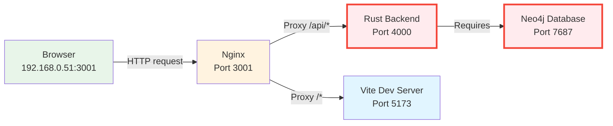

# 502 Error Diagnosis - VisionFlow Dev Endpoint

**Issue**: Accessing http://192.168.0.51:3001 returns 502 Bad Gateway error

**Date**: 2025-11-06
**Status**: Root cause identified ✅

---

## Executive Summary

The **502 Bad Gateway error** is caused by the **Rust backend failing to start** inside the Docker container. The backend requires Neo4j database to be running, but **Neo4j is not configured in the Docker Compose stack**.

---

## Architecture Overview



---

## Root Cause Analysis

### What Happens During Container Startup

1. **Supervisord starts three services**:
   - ✅ Nginx (port 3001) - Starts successfully
   - ✅ Vite dev server (port 5173) - Starts successfully
   - ❌ **Rust backend (port 4000) - Fails to start**

2. **Rust backend startup sequence** (`scripts/rust-backend-wrapper.sh`):
   ```bash
   # Step 1: Rebuild Rust backend with GPU features
   cargo build --features gpu

   # Step 2: Start the backend
   /app/target/debug/webxr
   ```

3. **Backend initialization** (`src/main.rs:163-178`):
   ```rust
   // Backend tries to connect to Neo4j
   let settings_config = Neo4jSettingsConfig::default();
   let settings_repository = Neo4jSettingsRepository::new(settings_config).await;

   // If Neo4j connection fails, backend exits with error
   if settings_repository.is_err() {
       error!("Failed to create Neo4j settings repository: {}", e);
       return Err(...); // BACKEND EXITS HERE
   }
   ```

4. **What happens when backend fails**:
   - Nginx receives requests on port 3001
   - Nginx tries to proxy `/api/*` requests to `http://127.0.0.1:4000`
   - Backend is not listening (failed to start)
   - Nginx returns **502 Bad Gateway**

---

## Evidence

### 1. Neo4j is REQUIRED (from `.env.example:43-48`)

```env
# Neo4j Graph Database (REQUIRED - sole persistence layer)
# All graph data, ontology, and settings stored in Neo4j
NEO4J_URI=bolt://localhost:7687
NEO4J_USER=neo4j
NEO4J_PASSWORD=your-neo4j-password-here
NEO4J_DATABASE=neo4j
```

### 2. Neo4j Default Connection (`src/adapters/neo4j_settings_repository.rs:44-46`)

```rust
uri: std::env::var("NEO4J_URI").unwrap_or_else(|_| "bolt://localhost:7687".to_string()),
user: std::env::var("NEO4J_USER").unwrap_or_else(|_| "neo4j".to_string()),
password: std::env::var("NEO4J_PASSWORD").unwrap_or_else(|_| "password".to_string()),
```

### 3. Neo4j Missing from Docker Compose

Checked all `docker-compose*.yml` files - **No Neo4j service defined**.

### 4. Documentation Confirms Neo4j Migration Complete

From `docs/reference/implementation-status.md:69-87`:
- ✅ Neo4j is primary database (November 2025)
- ✅ Settings repository migrated to Neo4j
- ✅ Graph & ontology repository using Neo4j

---

## Why Frontend Appears to Work

The **frontend (Vite dev server)** starts successfully because:
- It's independent of Neo4j
- Vite only serves static assets and React app
- No database required for frontend startup

**User sees**: Frontend loads, but API calls fail with 502 errors

---

## Solution Options

### Option 1: Add Neo4j to Docker Compose (Recommended)

Add Neo4j service to `docker-compose.dev.yml`:

```yaml
services:
  neo4j:
    image: neo4j:5.13.0
    container_name: visionflow-neo4j
    environment:
      - NEO4J_AUTH=neo4j/your-secure-password
      - NEO4J_PLUGINS=["apoc"]
      - NEO4J_dbms_memory_pagecache_size=512M
      - NEO4J_dbms_memory_heap_initial__size=512M
      - NEO4J_dbms_memory_heap_max__size=1G
    ports:
      - "7474:7474"  # HTTP
      - "7687:7687"  # Bolt
    volumes:
      - neo4j-data:/data
      - neo4j-logs:/logs
    networks:
      - docker_ragflow

  webxr:
    # ... existing config ...
    depends_on:
      - neo4j
    environment:
      - NEO4J_URI=bolt://neo4j:7687  # Use service name
      - NEO4J_USER=neo4j
      - NEO4J_PASSWORD=your-secure-password
      # ... other env vars ...

volumes:
  neo4j-data:
  neo4j-logs:
  # ... existing volumes ...
```

**Then update `.env` file**:
```env
NEO4J_URI=bolt://neo4j:7687
NEO4J_USER=neo4j
NEO4J_PASSWORD=your-secure-password
NEO4J_DATABASE=neo4j
```

**Restart the stack**:
```bash
docker-compose -f docker-compose.dev.yml down
docker-compose -f docker-compose.dev.yml up -d
```

---

### Option 2: Run Neo4j Separately (Quick Test)

If Neo4j is already running on the host:

1. **Update `.env`** to point to host Neo4j:
   ```env
   NEO4J_URI=bolt://host.docker.internal:7687
   # OR if on Linux:
   NEO4J_URI=bolt://172.17.0.1:7687
   NEO4J_USER=neo4j
   NEO4J_PASSWORD=your-actual-password
   ```

2. **Rebuild and restart container**:
   ```bash
   docker-compose -f docker-compose.dev.yml down
   docker-compose -f docker-compose.dev.yml up -d --build
   ```

---

### Option 3: Use External Neo4j Instance

If using managed Neo4j (Neo4j Aura, etc.):

Update `.env`:
```env
NEO4J_URI=bolt+s://your-instance.databases.neo4j.io:7687
NEO4J_USER=neo4j
NEO4J_PASSWORD=your-password
NEO4J_DATABASE=neo4j
```

---

## Verification Steps

After implementing a solution:

### 1. Check Container Logs

```bash
docker logs visionflow_container -f
```

Look for:
```
✅ Neo4jSettingsRepository initialized successfully
✅ Connected to Neo4j
✅ Starting HTTP server on 0.0.0.0:4000
```

### 2. Test Backend Health

```bash
curl http://192.168.0.51:3001/api/health
```

Expected response:
```json
{
  "status": "healthy",
  "database": "connected",
  "timestamp": "2025-11-06T..."
}
```

### 3. Test Settings API

```bash
curl http://192.168.0.51:3001/api/settings
```

Should return settings data (not 502 error).

### 4. Check Neo4j Connection

```bash
# If Neo4j exposed on host
docker exec -it visionflow-neo4j cypher-shell -u neo4j -p your-password

# Run query
MATCH (n) RETURN count(n) as total_nodes;
```

---

## Additional Diagnostics

### Check What's Actually Listening

From inside the container:
```bash
docker exec -it visionflow_container bash
netstat -tlnp | grep -E "(3001|4000|5173)"
```

Expected:
```
tcp  0.0.0.0:3001  0.0.0.0:*  LISTEN  xxx/nginx
tcp  0.0.0.0:5173  0.0.0.0:*  LISTEN  xxx/node
tcp  0.0.0.0:4000  0.0.0.0:*  LISTEN  xxx/webxr  ← Missing if Neo4j down
```

### Check Supervisord Status

```bash
docker exec -it visionflow_container supervisorctl status
```

Expected when working:
```
nginx          RUNNING   pid 123, uptime 0:01:00
rust-backend   RUNNING   pid 456, uptime 0:01:00  ← Should be RUNNING
vite-dev       RUNNING   pid 789, uptime 0:01:00
```

If backend shows `FATAL` or `EXITED`:
```bash
docker exec -it visionflow_container cat /app/logs/rust-error.log
```

---

## Timeline of Changes

From the documentation consolidation work:

1. **November 2025**: Neo4j migration completed
   - Settings repository → Neo4j ✅
   - Graph & ontology → Neo4j ✅
   - SQLite deprecated (rusqlite still in Cargo.toml as fallback)

2. **November 5, 2025**: GraphServiceActor removed
   - Modular actor architecture implemented
   - 5,130 lines of deprecated code removed

3. **Current issue**: Docker Compose not updated to include Neo4j service

---

## References

- **Implementation Status**: `docs/reference/implementation-status.md`
- **Neo4j Migration Guide**: `docs/guides/neo4j-migration.md`
- **Backend Main**: `src/main.rs:163-178` (Neo4j initialization)
- **Settings Repository**: `src/adapters/neo4j_settings_repository.rs`
- **Docker Config**: `docker-compose.dev.yml`
- **Nginx Config**: `nginx.dev.conf`
- **Startup Scripts**:
  - `scripts/dev-entrypoint.sh`
  - `scripts/rust-backend-wrapper.sh`
  - `supervisord.dev.conf`

---

## Recommended Next Steps

1. ✅ **Implement Option 1** (add Neo4j to docker-compose)
2. Test backend startup with logs
3. Verify API endpoints work
4. Update documentation with Neo4j requirement
5. Consider adding health checks to docker-compose

---

## Additional Notes

### Why This Wasn't Caught Earlier

- Documentation correctly states Neo4j is primary database
- Migration guides assume Neo4j is already running
- Docker Compose files may have been created before migration
- `.env.example` documents the requirement but doesn't enforce it

### Prevention

Add health check to docker-compose:
```yaml
  webxr:
    healthcheck:
      test: ["CMD", "curl", "-f", "http://localhost:4000/api/health"]
      interval: 10s
      timeout: 5s
      retries: 3
      start_period: 30s
```

---

**Document Version**: 1.0
**Created**: 2025-11-06
**Author**: VisionFlow Diagnostics
**Status**: Root cause identified - awaiting Neo4j service addition
