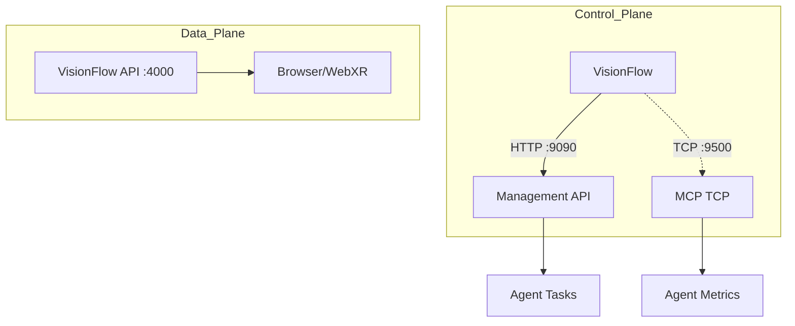

# VisionFlow Docker System Architecture

Complete inventory of Docker files, configurations, and scripts for the VisionFlow system.

## Running Containers Overview

| Container | Image | Purpose | Ports |
|-----------|-------|---------|-------|
| `visionflow_container` | `ar-ai-knowledge-graph-visionflow` | Main VisionFlow backend + frontend | 3001, 4000 |
| `visionflow-neo4j` | `neo4j:5.13.0` | Graph database | 7474, 7687 |
| `visionflow-jss` | `ar-ai-knowledge-graph-jss` | Solid Protocol pods | 3030 |
| `agentic-workstation` | `multi-agent-docker-agentic-workstation` | Multi-agent Claude environment | 2222, 5901, 8080, 9090 |
| `comfyui` | `comfyui-sam3d:latest` | AI image generation | 8188 |
| `ragflow-server` | `infiniflow/ragflow:nightly` | RAG pipeline | 80, 443, 9380 |
| `ragflow-mysql` | `mysql:8.0.39` | RAGFlow database | 5455→3306 |
| `ragflow-redis` | `valkey/valkey:8` | RAGFlow cache | 6379 |
| `ragflow-es-01` | `elasticsearch:8.11.3` | RAGFlow search | 1200→9200 |
| `ragflow-minio` | `minio:RELEASE.2025-06-13` | RAGFlow object storage | 9000, 9001 |
| `xinference` | `xprobe/xinference:latest` | Model inference | 9997 |
| `qdrant` | `qdrant/qdrant` | Vector database | 6333, 6334 |
| `whisper-webui` | `aadnk/whisper-webui:latest` | Speech-to-text | 7860 |
| `kokoro-tts-container` | `remsky/kokoro-fastapi-gpu:latest` | Text-to-speech | 8880 |
| `vircadia_world_postgres` | `postgres:17.5-alpine3.21` | Vircadia database | 5432 |
| `fossflow-app` | `fossflow-fossflow` | FossFlow app | 3002, 3003 |

---

## 1. VisionFlow Main Stack

**Launch Command:** `./scripts/launch.sh [up|down|build] [dev|prod]`

### Docker Compose Files

| File | Purpose |
|------|---------|
| `docker-compose.unified.yml` | **Primary** - Dev/Prod unified compose |
| `docker-compose.yml` | Legacy compose (deprecated) |
| `docker-compose.dev.yml` | Legacy dev-specific overrides |
| `docker-compose.production.yml` | Legacy production overrides |
| `docker-compose.unified-with-neo4j.yml` | Unified with embedded Neo4j |
| `docker-compose.vircadia.yml` | Vircadia XR integration |

### Dockerfiles

| File | Target | Purpose |
|------|--------|---------|
| `Dockerfile.unified` | `development` / `production` | **Primary** - Multi-stage VisionFlow build |
| `Dockerfile.dev` | Development | Legacy dev Dockerfile |
| `Dockerfile.production` | Production | Legacy production Dockerfile |

### Configuration Files

| File | Service | Purpose |
|------|---------|---------|
| `nginx.dev.conf` | Nginx | Dev reverse proxy (port 3001 → Vite + API) |
| `nginx.production.conf` | Nginx | Prod reverse proxy (port 4000) |
| `nginx.conf` | Nginx | Base nginx config |
| `supervisord.dev.conf` | Supervisord | Dev process manager (Rust + Vite + Nginx) |
| `supervisord.production.conf` | Supervisord | Prod process manager |
| `config.yml` | Cloudflared | Tunnel config for `www.visionflow.info` |

### Environment Files

| File | Purpose |
|------|---------|
| `.env` | Active environment variables |
| `.env.example` | Template with all variables |
| `.env.development.template` | Dev defaults template |
| `.env.production.template` | Prod defaults template |

### Entrypoint Scripts

| Script | Purpose |
|--------|---------|
| `scripts/dev-entrypoint.sh` | Dev container startup (rebuilds Rust, starts Vite) |
| `scripts/prod-entrypoint.sh` | Prod container startup (runs pre-built binary) |
| `scripts/production-entrypoint.sh` | Alternate production entrypoint |
| `scripts/rust-backend-wrapper.sh` | Rust backend process wrapper |

### Launch Script (`scripts/launch.sh`)

```bash
./scripts/launch.sh up dev      # Start development
./scripts/launch.sh up prod     # Start production (with cloudflared)
./scripts/launch.sh build dev   # Build dev containers
./scripts/launch.sh rebuild prod # Rebuild without cache
./scripts/launch.sh logs dev    # Follow logs
./scripts/launch.sh shell dev   # Shell into container
./scripts/launch.sh status      # Show status and URLs
./scripts/launch.sh clean       # Remove all VisionFlow resources
```

### Services in `docker-compose.unified.yml`

| Service | Container | Profiles | Dependencies |
|---------|-----------|----------|--------------|
| `neo4j` | `visionflow-neo4j` | All | - |
| `jss` | `visionflow-jss` | dev, prod | - |
| `visionflow` | `visionflow_container` | dev | neo4j (healthy) |
| `visionflow-production` | `visionflow_prod_container` | prod | neo4j (healthy) |
| `cloudflared` | `cloudflared-tunnel` | dev, prod | visionflow |

### Volumes (VisionFlow)

| Volume | Mount Point | Purpose |
|--------|-------------|---------|
| `visionflow-data` | `/app/data` | Application data |
| `visionflow-logs` | `/app/logs` | Log files |
| `npm-cache` | `/root/.npm` | NPM cache |
| `cargo-cache` | `/root/.cargo/registry` | Rust crate cache |
| `cargo-git-cache` | `/root/.cargo/git` | Rust git deps |
| `cargo-target-cache` | `/app/target` | Rust build artifacts |
| `neo4j-data` | `/data` | Neo4j database |
| `neo4j-logs` | `/logs` | Neo4j logs |
| `jss-data` | `/data` | Solid pod storage |

---

## 2. JavaScriptSolidServer (JSS)

**Location:** `JavaScriptSolidServer/`

| File | Purpose |
|------|---------|
| `JavaScriptSolidServer/Dockerfile.jss` | JSS container build (Node 20 Alpine) |
| `JavaScriptSolidServer/LOCAL_CHANGES.md` | Tracks local modifications |
| `JavaScriptSolidServer/package.json` | JSS v0.0.46 dependencies |

**Build Context:** `./JavaScriptSolidServer` (from docker-compose.unified.yml)

---

## 3. Multi-Agent Workstation

**Location:** `multi-agent-docker/`
**Launch Command:** `cd multi-agent-docker && ./build-unified.sh`

### Docker Files

| File | Purpose |
|------|---------|
| `multi-agent-docker/docker-compose.unified.yml` | Agentic workstation compose |
| `multi-agent-docker/Dockerfile.unified` | CachyOS-based multi-user container |

### Key Configuration

| File | Purpose |
|------|---------|
| `multi-agent-docker/unified-config/supervisord.unified.conf` | 9+ services manager |
| `multi-agent-docker/unified-config/supervisord.simple.conf` | Minimal services |
| `multi-agent-docker/unified-config/entrypoint-unified.sh` | Container initialization |
| `multi-agent-docker/unified-config/tmux-autostart.sh` | 8-window tmux workspace |
| `multi-agent-docker/.env` | API keys and configuration |
| `multi-agent-docker/.env.example` | Template |

### User Switching Scripts

| Script | Purpose |
|--------|---------|
| `multi-agent-docker/unified-config/scripts/as-gemini.sh` | Switch to gemini-user |
| `multi-agent-docker/unified-config/scripts/as-openai.sh` | Switch to openai-user |
| `multi-agent-docker/unified-config/scripts/as-zai.sh` | Switch to zai-user |

### Terminal Initialization Scripts

| Script | Purpose |
|--------|---------|
| `unified-config/terminal-init/init-claude-main.sh` | Claude main window |
| `unified-config/terminal-init/init-claude-agent.sh` | Agent execution window |
| `unified-config/terminal-init/init-services.sh` | Supervisord monitoring |
| `unified-config/terminal-init/init-development.sh` | Python/Rust/CUDA dev |
| `unified-config/terminal-init/init-gemini.sh` | Gemini user session |
| `unified-config/terminal-init/init-openai.sh` | OpenAI user session |
| `unified-config/terminal-init/init-zai.sh` | Z.AI service session |
| `unified-config/terminal-init/init-deepseek.sh` | DeepSeek session |
| `unified-config/terminal-init/init-docker.sh` | Docker operations |
| `unified-config/terminal-init/init-git.sh` | Git operations |

### MCP Infrastructure Scripts

| Script | Purpose |
|--------|---------|
| `mcp-infrastructure/servers/mcp-gateway.js` | **Unified MCP Gateway (TCP:9500 + WS:3002)** |
| `mcp-infrastructure/scripts/automated-setup.sh` | Automated MCP setup |
| `mcp-infrastructure/scripts/init-claude-flow-agents.sh` | Initialize Claude Flow agents |
| `mcp-infrastructure/monitoring/health-check.sh` | Health monitoring |
| `mcp-infrastructure/monitoring/check-setup-status.sh` | Setup verification |

### MCP Gateway Details

The `mcp-gateway` service provides unified MCP connectivity for VisionFlow:

- **TCP Server (Port 9500)**: JSON-RPC 2.0 over TCP for agent discovery/telemetry
- **WebSocket Server (Port 3002)**: Real-time agent coordination (Bots Orchestrator)
- **Dependencies**: `ws` npm package (installed in `mcp-infrastructure/servers/`)

**Supervisord Configuration** (in `supervisord.unified.conf`):
```ini
[program:mcp-gateway]
command=/usr/local/bin/node /home/devuser/workspace/project/multi-agent-docker/mcp-infrastructure/servers/mcp-gateway.js
directory=/home/devuser/workspace/project/multi-agent-docker/mcp-infrastructure/servers
user=devuser
environment=HOME="/home/devuser",MCP_TCP_PORT="9500",MCP_WS_PORT="3002",LOG_LEVEL="info"
autostart=true
autorestart=true
priority=150
```

**Verification**:
```bash
# Check ports are listening
ss -tlnp | grep -E ':(9500|3002)'

# Check service status
sudo /opt/venv/bin/supervisorctl status mcp-gateway

# View logs
tail -f /var/log/mcp-gateway.log
```

### Skill Scripts

| Script | Purpose |
|--------|---------|
| `skills/docker-manager/tools/visionflow_ctl.sh` | VisionFlow container control |
| `skills/docker-manager/test-skill.sh` | Test Docker Manager skill |
| `skills/docs-alignment/scripts/*.sh` | Documentation validation (8 scripts) |
| `skills/frontend-creator/scripts/*.sh` | Frontend artifact generation |
| `skills/latex-documents/*.sh` | LaTeX compilation |
| `skills/fossflow/scripts/screenshot-verify.sh` | Screenshot verification |

### Services (Supervisord)

| Service | Port | User | Purpose |
|---------|------|------|---------|
| dbus | - | root | System messaging |
| sshd | 22→2222 | root | SSH access |
| xvnc | 5901 | devuser | VNC desktop |
| xfce4 | - | devuser | Desktop environment |
| **mcp-gateway** | **9500, 3002** | devuser | **MCP TCP + WebSocket (VisionFlow integration)** |
| management-api | 9090 | devuser | HTTP management API |
| code-server | 8080 | devuser | Web IDE |
| claude-zai | 9600 | zai-user | Z.AI service (internal) |
| gemini-flow | - | gemini-user | Gemini orchestration |
| tmux-autostart | - | devuser | 8-window workspace |

---

## 4. ComfyUI Stack

**Location:** `multi-agent-docker/comfyui/`
**Launch:** Via `./build-unified.sh` or standalone

### Docker Files

| File | Purpose |
|------|---------|
| `comfyui/docker-compose.comfyui.yml` | ComfyUI standalone compose |
| `comfyui/Dockerfile` | ComfyUI with SAM3D support |

### Scripts

| Script | Purpose |
|--------|---------|
| `comfyui/runner-scripts/entrypoint.sh` | Container entrypoint |
| `comfyui/runner-scripts/entrypoint-with-sam3d-fix.sh` | SAM3D CUDA fix |
| `comfyui/runner-scripts/fix-sam3d-on-startup.sh` | Runtime SAM3D fix |
| `comfyui/scripts/fix-sam3d-cuda.sh` | CUDA compatibility fix |

### Volumes

| Volume | Mount Point | Purpose |
|--------|-------------|---------|
| `./storage-models` | `/root/ComfyUI/models` | AI models (gitignored) |
| `./storage-output` | `/root/ComfyUI/output` | Generated images |
| `./storage-input` | `/root/ComfyUI/input` | Input images |
| `comfyui-custom-nodes` | `/root/ComfyUI/custom_nodes` | Custom nodes |
| `comfyui-user` | `/root/ComfyUI/user` | User preferences |

---

## 5. Network Configuration

All containers join the `docker_ragflow` external network:

```yaml
networks:
  docker_ragflow:
    external: true
    name: docker_ragflow
```

**Create network if missing:**
```bash
docker network create docker_ragflow
```

---

## 6. Project Scripts Reference

### Build & Launch

| Script | Purpose |
|--------|---------|
| `scripts/launch.sh` | **Primary** VisionFlow launcher |
| `multi-agent-docker/build-unified.sh` | Multi-agent workstation builder |
| `multi-agent-docker/REBUILD.sh` | Force rebuild |
| `scripts/sync-jss-upstream.sh` | Sync JSS from upstream |

### CUDA & GPU

| Script | Purpose |
|--------|---------|
| `scripts/build_ptx.sh` | Build PTX kernels |
| `scripts/compile_cuda.sh` | Compile CUDA kernels |
| `scripts/verify_ptx.sh` | Verify PTX compilation |
| `scripts/verify_ptx_compilation.sh` | Extended PTX verification |
| `scripts/run_gpu_tests.sh` | GPU test suite |
| `scripts/run-gpu-test-suite.sh` | Full GPU validation |

### Testing & Validation

| Script | Purpose |
|--------|---------|
| `scripts/test_validation.sh` | General validation |
| `scripts/test_compile.sh` | Compilation test |
| `scripts/test_hot_reload.sh` | Hot reload test |
| `scripts/test-mcp-patch.sh` | MCP patch test |
| `scripts/verify-mcp-connection.sh` | MCP connection test |
| `scripts/validate_migration.sh` | Migration validation |
| `scripts/validate-mermaid-diagrams.sh` | Mermaid diagram validation |
| `scripts/validate_doc_links.sh` | Documentation link validation |
| `multi-agent-docker/scripts/validate-docker-manager.sh` | Docker Manager skill validation |

### Voice Pipeline

| Script | Purpose |
|--------|---------|
| `scripts/test_whisper_stt.sh` | Whisper STT test |
| `scripts/test_kokoro_tts.sh` | Kokoro TTS test |
| `scripts/test_voice_pipeline.sh` | Full voice pipeline |
| `scripts/voice_pipeline_test.sh` | Alternate voice test |
| `scripts/fix_kokoro_network.sh` | Fix Kokoro network |

### Physics & Settings

| Script | Purpose |
|--------|---------|
| `scripts/check_physics_settings.sh` | Check physics config |
| `scripts/update_physics_settings.sh` | Update physics config |
| `scripts/update_physics_direct.sh` | Direct physics update |
| `scripts/trigger_physics_update.sh` | Trigger physics refresh |
| `scripts/test-physics-update.sh` | Physics update test |
| `scripts/load_test_settings.sh` | Load test settings |
| `scripts/test-settings-cache.sh` | Settings cache test |

### Utilities

| Script | Purpose |
|--------|---------|
| `scripts/remove-comments.sh` | Remove code comments |
| `scripts/remove-rust-comments.sh` | Remove Rust comments |
| `scripts/fix-uk-spellings.sh` | UK spelling corrections |
| `scripts/generate_pipeline_context.sh` | Generate pipeline context |
| `scripts/trigger_sync.sh` | Trigger sync |
| `scripts/monitor-audit-completion.sh` | Monitor audit |

---

## 7. Quick Reference Commands

### VisionFlow

```bash
# Development
./scripts/launch.sh up dev
./scripts/launch.sh logs dev
./scripts/launch.sh shell dev

# Production
./scripts/launch.sh up prod
./scripts/launch.sh down prod

# Build
./scripts/launch.sh build dev
./scripts/launch.sh rebuild prod
```

### Multi-Agent Workstation

```bash
cd multi-agent-docker

# Build and launch
./build-unified.sh
./build-unified.sh --no-cache
./build-unified.sh --skip-comfyui

# Access
ssh -p 2222 devuser@localhost          # SSH
vnc://localhost:5901                    # VNC
http://localhost:8080                   # code-server
http://localhost:9090/health            # Management API

# Inside container
sudo supervisorctl status
as-gemini                               # Switch to gemini-user
as-zai                                  # Switch to zai-user
tmux attach -t workspace                # tmux workspace
```

### Docker Management

```bash
# View all VisionFlow containers
docker ps --filter "name=visionflow"

# View logs
docker logs -f visionflow_container
docker logs -f agentic-workstation

# Clean up
./scripts/launch.sh clean
docker system prune -af
```

---

## 8. Environment Variables (Key)

### VisionFlow (.env)

```bash
# Neo4j
NEO4J_USER=neo4j
NEO4J_PASSWORD=<password>
NEO4J_URI=bolt://neo4j:7687

# Build
CUDA_ARCH=86
BUILD_TARGET=development|production

# Cloudflare (Production)
CLOUDFLARE_TUNNEL_TOKEN=<token>

# JSS
JSS_PORT=3030
JSS_URL=http://jss:3030
```

### Multi-Agent (multi-agent-docker/.env)

```bash
# API Keys
ANTHROPIC_API_KEY=<key>
GOOGLE_GEMINI_API_KEY=<key>
OPENAI_API_KEY=<key>
GITHUB_TOKEN=<token>

# Z.AI
ZAI_API_KEY=<key>
ZAI_BASE_URL=https://api.z.ai/api/anthropic

# Management
MANAGEMENT_API_KEY=<secret>

# Project Mount
PROJECT_DIR=/path/to/VisionFlow
HOST_CLAUDE_DIR=${HOME}/.claude
```

---

*Generated: 2026-01-03*
*VisionFlow Docker System v2.0*

---

## Recommendations & Hardening Priorities

### Security & Isolation
- **Privileged Access Control**: Prefer a Docker socket proxy for `agentic-workstation` instead of a raw `/var/run/docker.sock` mount. Scope allowed API verbs strictly to `build`/`start`/`stop`/`logs` for VisionFlow containers only, significantly reducing host root-equivalent exposure.
- **Secrets Management**: Move sensitive API keys (OpenAI, Anthropic, Gemini, Z.AI) from `.env` files into Docker/Compose secrets. Mount these as files with least-privilege read access per service (e.g., `read_only: true`, owned by `devuser`). Avoid passing secrets as build args or environment variables where they can leak into image layers or `docker inspect` output.
- **Runtime User Separation**: Enforce user separation at runtime. Ensure `visionflow` runs as a non-root user (UID/GID 1000). Drop privileges for `agentic-workstation` services that do not absolutely need elevated rights (like `code-server` or `management-api`). Implement `read_only: true` root filesystems for stateless services (e.g., `cloudflared`, `nginx`) to prevent tampering.
- **Network Segmentation**: Gate inter-container traffic with an internal firewall policy (e.g., `iptables` inside `agentic-workstation`) or strict Compose network scoping. Allow *only* required ports:
    - VisionFlow → Management API :9090
    - VisionFlow → MCP TCP :9500
    - GUI bridges 9876–9878
    - *Block* external access to internal services like Z.AI (9600) and raw DB ports.
- **TLS & Authentication**:
    - **Dev**: HTTP is acceptable for local loops.
    - **Prod**: Front `visionflow-production` with TLS (nginx sidecar or `cloudflared` tunnel). Implement mutual TLS (mTLS) or signed JWTs for Management API calls from VisionFlow to Agentic Workstation to ensure only trusted components can spawn tasks.
- **Exposure Rotation**: Rotate SSH/VNC exposure. Disable host port binding by default in production. If enabled, enforce key-only authentication for SSH and rotate default VNC passwords (e.g., `devuser:turboflow`).

### Operations, Observability, & Health
- **Comprehensive Health Checks**: Align and expand health checks:
    - `visionflow`/`visionflow-production`: `/api/health` (Application ready)
    - `agentic-workstation`: `/health` on port 9090 (Management API ready)
    - **MCP Liveness**: Add a dedicated TCP probe or supervisord script to verify port 9500 is accepting connections, preventing "zombie" agent states.
- **Centralized Logging**: Ship stdout/stderr to a centralized log driver (Loki, Fluentd, or simple file rotation) with tags per container. Maintain `max-size`/`max-file` limits to prevent disk exhaustion.
- **Deterministic Startup**: Enforce startup ordering. Ensure VisionFlow starts *only after* Management API (9090) and MCP (9500) are reachable. Use `depends_on` with `condition: service_healthy` or a custom `wait-for-it` script in the entrypoint to prevent initial connection failures and log noise.
- **Metrics & Telemetry**:
    - Expose `/metrics` (Prometheus format) on the Management API.
    - Surface VisionFlow internal metrics: REST latency, MCP poll latency, agent-state freshness/staleness.
    - Publish per-agent job resource usage via Management API, backed by periodic `docker stats` sampling, to identify resource-hogging agents.

### Performance, Build, and GPU
- **Optimized Builds**: Leverage BuildKit caching. Keep `npm-cache`, `cargo-cache`, etc. Run builds with `COMPOSE_DOCKER_CLI_BUILD=1` and `BUILDKIT_INLINE_CACHE=1` to reuse layers across CI/CD runs, significantly speeding up "rebuild" tasks.
- **Profile Separation**: Strict separation of Dev vs Prod mounts:
    - **Dev**: Mount source code `:ro` for hot-reload.
    - **Prod**: **NEVER** mount source code or the Docker socket. Use prebuilt, immutable artifacts (binaries) only.
- **GPU Scheduling & Isolation**: Pin `CUDA_VISIBLE_DEVICES` per service to avoid contention. Consider MIG (Multi-Instance GPU) or explicit device allocation (e.g., `device=0` for VisionFlow, `device=1` for ComfyUI) if hardware allows.

### Networking & Data
- **Network Segmentation**: Maintain `docker_ragflow` creation but consider splitting into:
    - `network_data`: Internal-only (Neo4j, RAGFlow, Redis, Postgres) - no external access.
    - `network_control`: Control plane for MCP/Management traffic.
    - `network_public`: Ingress traffic (Nginx, Cloudflare).
- **Port Discipline**: Validate port exposure. Keep MCP (9500), Z.AI (9600), and GUI bridges (9876–9878) unexposed on the host. Expose 3001/4000/9090 *only* as required per environment (e.g., via `127.0.0.1` binding).
- **Data Safety**: Document and script backup/restore procedures for critical volumes: `visionflow-data`, `visionflow-logs`, `neo4j-data`, and `.claude`/workspace. Use `:ro` mounts for static configuration files (nginx, supervisord) to prevent accidental mutation.

### Multi-Agent Workstation Specifics
- **Supervisord Hardening**: Set restart policies for GUI MCP programs to `unexpected` with bounded retries and exponential backoff. Add specific health probes for `blender-mcp`, `qgis-mcp`, `pbr-mcp`, and `comfyui` to detect silent failures (e.g., process running but stuck).
- **Least-Privilege User Hopping**: Scripts like `as-gemini.sh` rely on passwordless sudo. Limit this to the specific required commands only. Drop `SYS_ADMIN`/`NET_ADMIN` capabilities for non-GUI services where possible. Prefer a capability drop list per program in supervisord.
- **Dynamic API Keys**: Ensure `multi-agent-docker/.env` is *not* baked into images. Inject at runtime. Prefer per-user secrets mounts (e.g., `/run/secrets/anthropic_key` owned by `devuser`) over environment variables for better leak protection.

---

## AI Service Integrations

### Kokoro (TTS) & Whisper (STT) Analysis

**Services:**
- `kokoro-tts-container` (Port 8880): Text-to-Speech service. Image: `ghcr.io/remsky/kokoro-fastapi-gpu:latest`
- `whisper-webui` (Port 7860): Speech-to-Text service. Image: `registry.gitlab.com/aadnk/whisper-webui:latest`

**Network Topology:**
Both containers reside on the `docker_ragflow` network, enabling direct internal communication with VisionFlow and Agentic Workstation without exposing ports to the host (unless explicitly mapped).

**Communication Flow:**
1.  **Request**: VisionFlow/Agent sends audio/text payload to `http://kokoro-tts-container:8880` or `http://whisper-webui:7860`.
2.  **Processing**: Service processes request (GPU-accelerated if configured).
3.  **Response**: JSON result or audio blob returned to requester.

**Recommendations:**
-   **Health Checks**: Add explicit health checks for these services in `docker-compose.unified.yml` (e.g., `curl -f http://localhost:8880/health`).
-   **GPU Isolation**: Use explicit device requests (e.g., `--gpus '"device=2"'`) to prevent memory fragmentation when running alongside VisionFlow physics or ComfyUI.
-   **Internal Only**: Keep these ports unexposed on the host unless debugging. Use the Docker network aliases for all inter-container traffic.

### RAGFlow Knowledge Management

**Service:** `ragflow-server` (Ports 80, 443, 9380) and dependencies (MySQL, Redis, ES, MinIO).

**Network Topology:**
Resides on `docker_ragflow`. Critical for document ingestion and semantic search.

**Integration Points:**
-   **VisionFlow → RAGFlow**: VisionFlow agents query `http://ragflow-server:9380` (API) for knowledge retrieval.
-   **Agentic Workstation → RAGFlow**: Agents can trigger ingestion tasks or search via MCP tools bridging to the RAGFlow API.
-   **RAGFlow MCP Server**: A dedicated MCP server is available to bridge Claude/Agents directly to RAGFlow capabilities. Configure via `mcp-config.json` in `agentic-workstation`.

**Recommendations:**
-   **Startup Dependency**: RAGFlow has a heavy startup time (ES + MySQL). VisionFlow agents relying on RAG should implement a "wait-for-ready" logic or retry mechanism when querying the knowledge base on boot.
-   **Resource Fencing**: RAGFlow's Elasticsearch and MySQL can be memory-intensive. Set explicit memory limits in Docker Compose to prevent OOM kills affecting the core VisionFlow services.
-   **Data Persistence**: Ensure `ragflow-mysql`, `ragflow-es-01`, and `ragflow-minio` volumes are included in the backup strategy documented in the "Security & Isolation" section.

---

## Rust Backend ↔ Agentic Workstation Telemetry & Control Analysis

### Communication Architecture

1.  **Task Orchestration (Control Plane)**:
    -   **Direction**: VisionFlow (Rust) → Agentic Workstation (Node.js)
    -   **Protocol**: HTTP REST
    -   **Endpoint**: `http://agentic-workstation:9090`
    -   **Function**: VisionFlow requests task creation, monitoring, and termination.
    -   **Auth**: Bearer Token (shared secret).
    -   **Risk**: Synchronous coupling. If 9090 is down, user actions in VisionFlow (e.g., "Spawn Agent") fail immediately.

2.  **Agent Telemetry (Observability Plane)**:
    -   **Direction**: VisionFlow (Rust) → Agentic Workstation (MCP Server)
    -   **Protocol**: JSON-RPC 2.0 over TCP (Connection-oriented)
    -   **Endpoint**: `agentic-workstation:9500`
    -   **Component**: `AgentMonitorActor` (Rust) polls/subscribes.
    -   **Function**: Real-time updates of agent status, health, and logs for visualization.
    -   **Risk**: Polling overhead or connection drops causing "stale" UI state.

3.  **WebSocket Relay (Real-time Feedback)**:
    -   **Direction**: Agentic Workstation → VisionFlow → Browser
    -   **Protocol**: WebSocket
    -   **Endpoint**: `/ws/mcp` (proxied)
    -   **Function**: Streaming logs/tokens directly to the user interface.

### Failure Mode Analysis

| Failure Scenario | Symptom | Current Behavior | Risk Level |
| :--- | :--- | :--- | :--- |
| **9090 Unreachable** | Task spawning fails | VisionFlow returns 5xx error to client immediately. No retry. | High (UX Impact) |
| **9500 Unreachable** | Stale Agent UI | Agent monitor polls fail. UI shows empty or frozen agent list. Log spam in Rust backend. | Medium (Visibility) |
| **Partial Startup** | Connection Refused | VisionFlow starts before Agentic Workstation. Initial polls fail continuously until manual restart or lucky timing. | High (Reliability) |
| **Auth Mismatch** | 401 Unauthorized | Token mismatch between `.env` files. Requests fail permanently. | High (Config) |
| **Actor Crash** | Message Loss | Internal Actor (`AgentMonitor`) crashes on panic (e.g., unwrap). Telemetry stops until service restart. | Critical (Stability) |

### Robustness Recommendations

1.  **Resilient Polling & Backoff**:
    -   Implement **Exponential Backoff with Jitter** for the `AgentMonitorActor`'s TCP connection logic. Do not hammer a down service.
    -   Add a **Circuit Breaker**: If 9500 is unreachable for >30s, stop polling, mark system as "Degraded" in UI, and try a slow heartbeat (e.g., every 30s) instead of 2s.

2.  **Dual-Path Monitoring**:
    -   Expose a lightweight `/telemetry/agent-status` endpoint on the Management API (9090).
    -   VisionFlow can fallback to polling this HTTP endpoint if the high-fidelity MCP TCP connection (9500) is lost, ensuring *some* visibility is maintained.

3.  **Structured & Persisted Events**:
    -   Standardize the JSON schema for agent metrics (status, CPU/GPU, queue depth, errors).
    -   Persist a ring buffer of recent samples to `visionflow-logs`. This allows post-mortem analysis of *why* an agent crashed, even if the realtime stream is gone.

4.  **Strict Timeouts & Error Handling**:
    -   Enforce strict timeouts (e.g., 5s) on all Management API calls.
    -   Wrap all MCP Actor logic in `Result` types; remove any `unwrap()` calls that could panic on network data. Return typed, actionable errors to the frontend (e.g., "Agent Service Unreachable" vs "Task Failed").

5.  **Secure Production Transport**:
    -   In production, upgrade MCP TCP/WS to use **Mutual TLS (mTLS)**.
    -   Ensure `docker_ragflow` network isolation prevents any external entity from connecting to the MCP port.

### Proposed Bring-up Sequence

To eliminate "Partial Startup" race conditions:



**Recommended Startup Order:**
1.  **Infrastructure**: Start Databases (Neo4j, Redis, Postgres). Wait for healthy.
2.  **Agentic Workstation**: Start `agentic-workstation`. Wait for `/health` (9090) AND MCP port (9500) to be open.
3.  **VisionFlow**: Start `visionflow`/`visionflow-production`. It can now safely connect to 9090/9500 immediately.
4.  **Extensions**: Optionally start GUI bridges and ComfyUI.

### Observability Hooks

-   **Metrics**: Track "MCP Poll Latency" and "Poll Failure Count" in VisionFlow metrics. Tag by endpoint/transport.
-   **APM**: Emit Management API call metrics (duration, status code) to Prometheus (`/metrics`).
-   **Supervisord**: Configure `stdout_logfile_maxbytes` and `stdout_logfile_backups` for all MCP programs to prevent disk fill. Use `startretries` to handle transient startup failures gracefully.

---

## 9. Session Fixes Applied (2026-01-03)

### MCP Gateway Service Added

**Issue**: MCP TCP (9500) and WebSocket (3002) ports were not running - infrastructure existed but wasn't started.

**Fix**: Added `[program:mcp-gateway]` to `supervisord.unified.conf`:
- Provides unified MCP TCP (9500) + WebSocket (3002) gateway
- Dependencies: `ws` npm package installed in `mcp-infrastructure/servers/`
- Auto-starts with container via supervisord

**Verification**:
```bash
# Inside agentic-workstation container
ss -tlnp | grep -E ':(9500|3002)'  # Should show both ports
sudo /opt/venv/bin/supervisorctl status mcp-gateway  # Should show RUNNING
```

### Client MCP Status Fix

**Issue**: UI showed "MCP Disconnected" even when backend reported `connected: true`.

**Root Cause**: Response unwrapping bug in `MultiAgentInitializationPrompt.tsx`:
- API returns: `{ success: true, data: { connected: true, ... } }`
- Client was reading: `data.connected` (undefined)
- Should read: `data.data.connected`

**Fix**: Updated status check to handle nested response:
```typescript
// Before (incorrect)
setMcpConnected(data.connected);

// After (correct)
setMcpConnected(response?.data?.connected ?? response?.connected ?? false);
```

**File**: `client/src/features/bots/components/MultiAgentInitializationPrompt.tsx`

### System Health Panel MCP Status Fix

**Issue**: System Health Panel (top-left) showed red MCP indicator even when Hive Mind dialog showed connected.

**Root Cause**: `BotsDataContext.tsx` was setting `mcpConnected: pollingData.isPolling` which only indicates whether the polling loop is running, NOT actual MCP connection status.

**Fix**: Added proper MCP status checking:
1. Added `mcpConnectionStatus` state to track actual connection
2. Added useEffect to poll `/bots/status` API every 5 seconds
3. Changed `mcpConnected` to use actual API response instead of `pollingData.isPolling`
4. Added separate effect to update status even when no agents are present

```typescript
// Before (incorrect - line 253)
mcpConnected: pollingData.isPolling,  // Just means polling loop is running

// After (correct)
const [mcpConnectionStatus, setMcpConnectionStatus] = useState<boolean>(false);

// Poll actual status from API
useEffect(() => {
  const checkMcpStatus = async () => {
    const response = await unifiedApiClient.getData('/bots/status');
    setMcpConnectionStatus(response?.data?.connected ?? false);
  };
  checkMcpStatus();
  const interval = setInterval(checkMcpStatus, 5000);
  return () => clearInterval(interval);
}, []);

// Use actual status
mcpConnected: mcpConnectionStatus,
```

**File**: `client/src/features/bots/contexts/BotsDataContext.tsx`

### Note on Rebuilds

- **MCP Gateway**: Runtime fix applied via `supervisorctl update`. For persistence, ensure `supervisord.unified.conf` is baked into Docker image.
- **Client Fixes** (`MultiAgentInitializationPrompt.tsx`, `BotsDataContext.tsx`): Require client rebuild (`npm run build` in client directory) or dev server restart to take effect.

### Files Modified (Session 2026-01-03)

| File | Change |
|------|--------|
| `multi-agent-docker/unified-config/supervisord.unified.conf` | Added `[program:mcp-gateway]` service |
| `client/src/features/bots/components/MultiAgentInitializationPrompt.tsx` | Fixed response unwrapping for MCP status |
| `client/src/features/bots/contexts/BotsDataContext.tsx` | Fixed mcpConnected to use actual API status |
