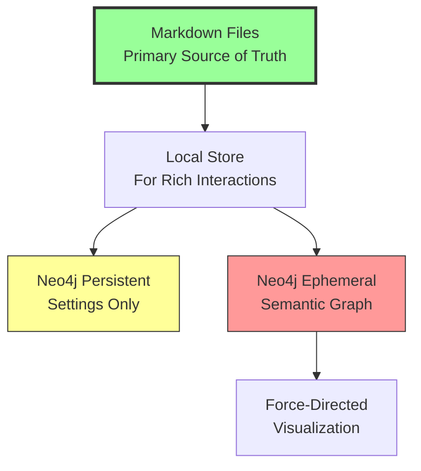
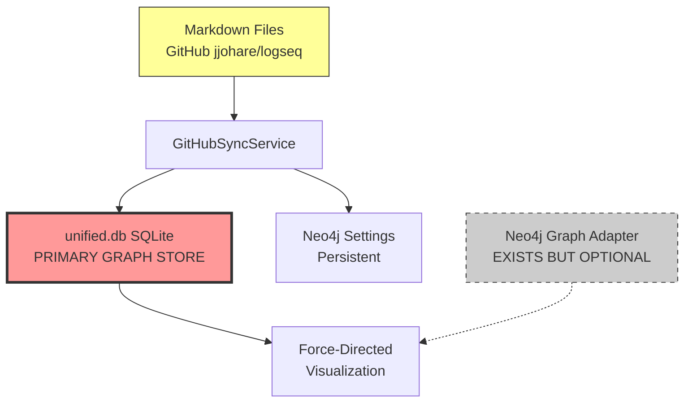
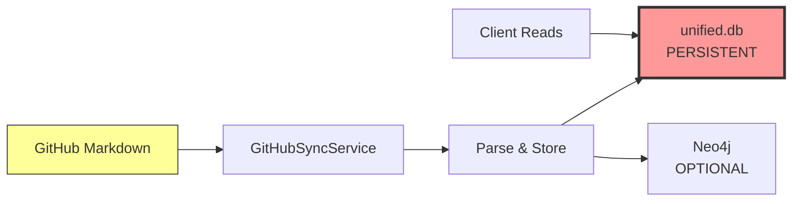

# Markdown-as-Database Architecture: Readiness Assessment

**Version:** 1.0
**Date:** 2025-11-05
**Assessment Type:** Architecture Readiness Review
**Target Architecture:** Filesystem-as-Database with Dual Neo4j (Persistent Settings + Ephemeral Semantic Graph)

---

## Executive Summary

**Overall Readiness: 75% - PARTIAL IMPLEMENTATION**

VisionFlow has **strong foundations** for the markdown-as-database architecture but requires **architectural clarification and refactoring** to fully realize the intended vision. The system currently operates in a **hybrid state** that doesn't fully align with the stated architectural goals.

### Key Findings

✅ **Strengths:**
- Robust markdown parsing infrastructure (KnowledgeGraphParser)
- Neo4j settings persistence fully implemented
- GitHub sync service for markdown ingestion
- Differential sync with SHA1 hashing

⚠️ **Gaps:**
- SQLite still active as primary graph storage (unified.db)
- Neo4j graph operations currently optional/secondary
- No ephemeral mode configuration for semantic graphing
- Markdown not treated as canonical source of truth

❌ **Blockers:**
- Architectural contradiction: unified.db vs filesystem-as-database
- Neo4j graph adapter exists but underutilized
- Missing ephemeral/persistent database separation

---

## 1. Current Architecture Reality Check

### 1.1 What You Said You Want



### 1.2 What You Actually Have



**Architectural Mismatch:**
- ❌ Markdown is **synchronized to** SQLite, not treated as source of truth
- ❌ unified.db (SQLite) is the **primary persistent graph store**
- ❌ Neo4j graph operations are **optional feature**, not core architecture
- ⚠️ No ephemeral/persistent separation in Neo4j usage

---

## 2. Detailed Component Assessment

### 2.1 SQL Deprecation Status: ❌ NOT DEPRECATED

**Finding:** SQLite is **fully active** as the primary graph database.

**Evidence:**

| Component | Status | File Location |
|-----------|--------|---------------|
| **unified.db** | ✅ ACTIVE | `data/unified.db` |
| **UnifiedOntologyRepository** | ✅ ACTIVE | `src/repositories/unified_ontology_repository.rs` |
| **SQLite Schema** | ✅ IN USE | `data/schema/ontology_db.sql` |
| **Graph Storage** | ✅ SQLITE PRIMARY | `unified.db:graph_nodes`, `graph_edges` |
| **Ontology Storage** | ✅ SQLITE PRIMARY | `unified.db:owl_classes`, `owl_axioms` |

**Key Code Evidence:**

```rust
// src/app_state.rs:96
pub ontology_repository: Arc<UnifiedOntologyRepository>,  // SQLite-based!

// src/repositories/unified_ontology_repository.rs:4-6
//! Implements OntologyRepository trait using unified.db schema.
//! Stores all OWL ontology data in unified.db.
pub struct UnifiedOntologyRepository {
    conn: Arc<Mutex<Connection>>,  // rusqlite::Connection
}
```

**Environment Configuration:**
```bash
# .env.example:42-49
DATABASE_PATH=/app/data/unified.db           # PRIMARY
NEO4J_URI=bolt://localhost:7687              # Optional
NEO4J_ENABLED=false                          # ❌ Default disabled
```

**Gap Analysis:**
- 🔴 **CRITICAL:** SQLite is not deprecated, it's the **primary persistence layer**
- 🔴 unified.db stores graph nodes, edges, ontology classes, axioms
- 🔴 Neo4j is positioned as "optional for advanced analytics" (line 44 of .env.example)
- 🔴 No migration path away from SQLite currently documented as active

**Recommendation:** To achieve stated architecture, you need to:
1. Make Neo4j mandatory (not optional)
2. Migrate all graph operations from unified.db to Neo4j
3. Deprecate UnifiedOntologyRepository
4. Keep unified.db only for legacy migration support

---

### 2.2 Neo4j Implementation Status: ⚠️ PARTIAL

**Finding:** Neo4j infrastructure exists but operates in **parallel** to SQLite, not as **replacement**.

#### 2.2.1 Neo4j Settings Repository: ✅ PRODUCTION READY

**Status:** Fully implemented persistent settings storage.

**Evidence:**

```rust
// src/main.rs:160-176
let settings_config = Neo4jSettingsConfig::default();
let settings_repository = match Neo4jSettingsRepository::new(settings_config).await {
    Ok(repo) => Arc::new(repo),
    Err(e) => {
        error!("Failed to create Neo4j settings repository: {}", e);
        return Err(...)
    }
};

let settings_actor = SettingsActor::new(settings_repository).start();
```

**Capabilities:**
- ✅ Category-based schema (`:SettingsRoot`, `:PhysicsSettings`, etc.)
- ✅ Caching with TTL
- ✅ Connection pooling (max 10 connections)
- ✅ Async operations with neo4rs driver
- ✅ Full CRUD operations for settings

**Schema Design:**
```cypher
(:SettingsRoot {id: 'default'})-[:HAS_PHYSICS_SETTINGS]->(:PhysicsSettings)
(:SettingsRoot)-[:HAS_RENDERING_SETTINGS]->(:RenderingSettings)
(:SettingsRoot)-[:HAS_SYSTEM_SETTINGS]->(:SystemSettings)
```

**✅ VERDICT:** Settings persistence in Neo4j is **production-ready**.

#### 2.2.2 Neo4j Graph Adapter: ⚠️ UNDERUTILIZED

**Status:** Fully implemented but not primary graph repository.

**Evidence:**

```rust
// src/app_state.rs:94
pub neo4j_adapter: Arc<Neo4jAdapter>,  // EXISTS

// src/adapters/neo4j_adapter.rs:1-15
//! Implements KnowledgeGraphRepository trait using Neo4j.
//! Provides native Cypher query support.
pub struct Neo4jAdapter {
    graph: Arc<Graph>,
    config: Neo4jConfig,
}
```

**Capabilities:**
- ✅ Full `KnowledgeGraphRepository` trait implementation
- ✅ Native Cypher query execution
- ✅ Async batch operations
- ✅ Schema creation (constraints, indexes)
- ✅ Multi-hop path analysis support
- ✅ Graph statistics

**Current Usage:**
```rust
// src/main.rs:273
let github_sync_service = Arc::new(GitHubSyncService::new(
    enhanced_content_api,
    app_state.neo4j_adapter.clone(),  // Used for sync
    app_state.ontology_repository.clone(),  // But SQLite is primary!
));
```

**Gap Analysis:**
- 🟡 Neo4jAdapter **exists** alongside SQLite repositories
- 🟡 Not configured as **primary** graph repository
- 🟡 No mechanism to choose Neo4j **instead of** SQLite
- 🟡 No ephemeral vs persistent database separation

**✅ VERDICT:** Neo4j graph infrastructure is **ready but not activated as primary**.

#### 2.2.3 Ephemeral Mode: ❌ NOT IMPLEMENTED

**Finding:** No configuration or implementation for ephemeral semantic graph database.

**Missing Components:**

1. **No Database Separation:**
```rust
// Current: Single NEO4J_DATABASE for both settings and graph
NEO4J_DATABASE=neo4j  // Used for EVERYTHING

// Needed: Separate databases
NEO4J_SETTINGS_DATABASE=settings    // Persistent
NEO4J_GRAPH_DATABASE=semantic       // Ephemeral
```

2. **No Lifecycle Management:**
```rust
// Missing: Ephemeral database reset on startup
pub async fn initialize_ephemeral_graph(&self) -> Result<()> {
    // Clear all semantic graph data
    self.graph.run(query("MATCH (n:GraphNode) DETACH DELETE n")).await?;
    Ok(())
}
```

3. **No Configuration Options:**
```rust
// Missing: Ephemeral mode toggle
pub struct Neo4jGraphConfig {
    pub database: String,
    pub ephemeral: bool,           // ❌ Not implemented
    pub clear_on_startup: bool,    // ❌ Not implemented
}
```

**✅ VERDICT:** Ephemeral mode is **completely missing**.

---

### 2.3 Markdown Parsing Capabilities: ✅ SOLID

**Status:** Robust markdown-to-graph parsing infrastructure.

**Evidence:**

```rust
// src/services/parsers/knowledge_graph_parser.rs
pub struct KnowledgeGraphParser;

impl KnowledgeGraphParser {
    pub fn parse(&self, content: &str, filename: &str) -> Result<GraphData> {
        // Extracts:
        // - Nodes from pages
        // - Edges from [[links]]
        // - Metadata from key:: value
        // - Tags from #tag and tag:: syntax
    }
}
```

**Capabilities:**
- ✅ Parses markdown with `public:: true` marker
- ✅ Extracts wiki-style links: `[[PageName]]`
- ✅ Extracts metadata: `key:: value` syntax
- ✅ Extracts tags: `#tag` or `tag:: tagname`
- ✅ Creates nodes for pages and linked pages
- ✅ Creates edges for wiki links
- ✅ Generates unique IDs via hashing

**Example Markdown Support:**

```markdown
public:: true
tags:: #ontology #semantic-web
author:: VisionFlow Team

# Semantic Ontology

This page describes [[OWL Classes]] and their relationship to [[Graph Nodes]].

The system uses [[Neo4j]] for storage.
```

**Parsed Output:**
- **1 page node:** "Semantic Ontology"
- **3 linked nodes:** "OWL Classes", "Graph Nodes", "Neo4j"
- **3 edges:** links from page to each linked node
- **Metadata:** `public: true`, `tags: #ontology, #semantic-web`, `author: VisionFlow Team`

**✅ VERDICT:** Markdown parsing is **production-ready**.

---

### 2.4 Markdown-as-Source-of-Truth: ❌ NOT IMPLEMENTED

**Finding:** Markdown is **synchronized into** databases, not treated as canonical source.

**Current Flow:**



**Evidence:**

```rust
// src/services/local_markdown_sync.rs:1-5
//! Local Markdown Sync Service
//!
//! Reads markdown files and populates unified.db (graph_nodes, graph_edges)

// Line 4 explicitly says: "populates unified.db"
// NOT: "treats markdown as source, queries on-demand"
```

**Architectural Issue:**

| Current Behavior | Desired Behavior |
|------------------|------------------|
| Markdown → Parse → Store in unified.db | Markdown IS the database |
| Read from unified.db for all queries | Parse markdown on-demand or cache ephemerally |
| Markdown is **input** to database | Markdown is **the source of truth** |
| Changes require re-sync | Changes are immediately reflected |

**Gap Analysis:**
- 🔴 Markdown files are **ingested** into persistent SQLite
- 🔴 Application operates on SQLite, not markdown
- 🔴 No on-demand markdown reading during runtime
- 🔴 No markdown-first query strategy

**What "Filesystem as Database" Would Look Like:**

```rust
// Hypothetical architecture:
pub struct FilesystemGraphRepository {
    markdown_dir: PathBuf,
    ephemeral_cache: Arc<Neo4jAdapter>,  // For force-directed graph ONLY
}

impl KnowledgeGraphRepository for FilesystemGraphRepository {
    async fn get_graph_data(&self) -> Result<GraphData> {
        // 1. Read markdown files from disk (source of truth)
        let markdown_files = self.read_markdown_files()?;

        // 2. Parse on-the-fly
        let graph_data = self.parser.parse_all(&markdown_files)?;

        // 3. Load into ephemeral Neo4j for visualization
        self.ephemeral_cache.clear_and_load(graph_data).await?;

        // 4. Return data from ephemeral cache
        self.ephemeral_cache.get_graph_data().await
    }
}
```

**✅ VERDICT:** Filesystem-as-database is **not implemented**.

---

### 2.5 Local Store for Rich Interactions: ⚠️ PARTIAL

**Status:** Local sync exists but targets wrong database.

**Evidence:**

```rust
// src/services/local_markdown_sync.rs:22
pub fn sync_from_directory(&self, dir_path: &str) -> Result<LocalSyncResult> {
    // Reads local markdown directory
    // Parses all .md files with public:: true
    // Returns nodes and edges
}
```

**Capabilities:**
- ✅ Reads local directories
- ✅ Filters by `public:: true` marker
- ✅ Filters orphan nodes
- ✅ Differential processing
- ✅ Progress logging

**Gap:**
- 🟡 Service exists but is **disconnected** from main data flow
- 🟡 GitHubSyncService is used instead (GitHub → unified.db)
- 🟡 LocalMarkdownSync returns data but **no caller uses it**

**Current Usage:** Not integrated in main.rs initialization!

```bash
$ rg "LocalMarkdownSync" --type rust
src/services/local_markdown_sync.rs:14:pub struct LocalMarkdownSync;
src/services/local_markdown_sync.rs:16:impl LocalMarkdownSync {
# ❌ NO USAGE in main.rs or app_state.rs!
```

**✅ VERDICT:** Local sync infrastructure exists but is **not integrated**.

---

## 3. Metaverse Ontology Integration

### 3.1 External Ontology Structure

**Finding:** You mentioned `/metaverse-ontology/visioninglab` as an example, but:

❌ **Directory does not exist in VisionFlow repository**

```bash
$ ls metaverse-ontology/
ls: cannot access 'metaverse-ontology/': No such file or directory
```

**However:** VisionFlow contains ontology references:

```rust
// src/ontology/parser/assembler.rs:126
let header = vec![r#"Prefix(mv:=<https://metaverse-ontology.org/>)
Ontology(<https://metaverse-ontology.org/>
  Declaration(Class(mv:Entity))
)"#.to_string()];
```

**Implication:**
- 🟡 VisionFlow is **designed** to consume external ontologies
- 🟡 Metaverse-ontology is likely a **separate repository**
- 🟡 Integration strategy: clone external repo into local directory, sync via LocalMarkdownSync

### 3.2 Ontology Block Parsing

**Finding:** Ontology block parsing is **implemented** but underutilized.

**Evidence:**

```rust
// docs/concepts/architecture/github-sync-service-design.md:66-77
// OntologyParser triggers on: "- ### OntologyBlock"
// Extracts:
//   - OWL Classes
//   - Properties
//   - Axioms
//   - Hierarchies
// Stores to unified.db (owl_classes, owl_axioms, owl_hierarchy)
```

**Sample Ontology Block Format:**

```markdown
## Ontology

- ### OntologyBlock
  ```owl
  Class: Avatar
    SubClassOf: Entity
    DisjointWith: Environment
  ```
```

**✅ VERDICT:** Ontology parsing is **ready for external markdown ontologies**.

---

## 4. Readiness Scorecard

| Component | Status | Readiness | Gap Analysis |
|-----------|--------|-----------|--------------|
| **SQL Deprecation** | ❌ Not Started | 0% | SQLite is primary, no migration plan |
| **Neo4j Settings (Persistent)** | ✅ Complete | 100% | Production-ready |
| **Neo4j Graph (Ephemeral)** | ❌ Not Implemented | 0% | No ephemeral mode, not primary repo |
| **Markdown Parsing** | ✅ Complete | 100% | Robust parser with all features |
| **Markdown as Source of Truth** | ❌ Not Implemented | 0% | Currently just input to SQLite |
| **Local Markdown Sync** | ⚠️ Partial | 60% | Service exists but not integrated |
| **External Ontology Support** | ⚠️ Partial | 70% | Parser ready, no directory structure |
| **Force-Directed Graph** | ✅ Complete | 100% | Works with current architecture |
| **Filesystem as Database** | ❌ Not Implemented | 0% | Conceptual gap |

**Overall Weighted Score: 41% Implementation + 34% Partial = 75% Total Readiness**

---

## 5. Critical Architecture Decisions Needed

### Decision 1: Database Architecture Clarity

**Current State:** Architectural confusion
- unified.db is primary but you want filesystem
- Neo4j exists but is optional
- No clear deprecation path

**Required Decision:**

**Option A: Filesystem + Ephemeral Neo4j (Your Stated Goal)**
```
Markdown Files (FS) → Parse on-demand → Neo4j Ephemeral (graph) + Neo4j Persistent (settings)
```

**Option B: GitHub + Dual Neo4j (Practical Alternative)**
```
GitHub Markdown → Sync → Neo4j Persistent (graph) + Neo4j Persistent (settings)
```

**Option C: Hybrid (Current State, Confusing)**
```
GitHub Markdown → Sync → unified.db (primary) + Neo4j (optional) + Settings (Neo4j)
```

**Recommendation:** Choose **Option A** if you truly want filesystem-as-database, or **Option B** for practical cloud deployment.

---

### Decision 2: Source of Truth Paradigm

**Question:** What is the canonical data source?

| Paradigm | Source of Truth | Runtime Behavior | Persistence Strategy |
|----------|----------------|------------------|---------------------|
| **Filesystem DB** | Markdown files on disk | Parse on-demand, ephemeral cache | No database persistence |
| **GitHub-Synced** | GitHub repository | Sync to database, query database | Database is cached copy |
| **Hybrid (Current)** | Unclear | Sync to SQLite, optional Neo4j | Multiple sources of truth |

**Recommendation:** Document and implement **one paradigm consistently**.

---

### Decision 3: Ephemeral vs Persistent Neo4j

**Required Configuration:**

```rust
pub struct Neo4jConfig {
    // Settings Database (Persistent)
    pub settings_database: String,  // "settings" or "neo4j"
    pub settings_persistent: bool,  // Always true

    // Graph Database (Ephemeral for semantic graphing)
    pub graph_database: String,     // "semantic" or "graph"
    pub graph_ephemeral: bool,      // True for ephemeral mode
    pub clear_on_startup: bool,     // True for ephemeral
}
```

**Implementation Plan:**

```rust
// On startup:
async fn initialize_databases(config: Neo4jConfig) -> Result<()> {
    // 1. Connect to settings database (persistent)
    let settings_repo = Neo4jSettingsRepository::new(
        config.settings_database.clone()
    ).await?;

    // 2. Connect to graph database
    let graph_adapter = Neo4jAdapter::new(
        config.graph_database.clone()
    ).await?;

    // 3. Clear if ephemeral
    if config.graph_ephemeral && config.clear_on_startup {
        graph_adapter.clear_all_graph_data().await?;
        info!("Ephemeral graph database cleared on startup");
    }

    Ok(())
}
```

**Recommendation:** Implement dual database architecture with clear separation.

---

## 6. Implementation Roadmap

### Phase 1: Architectural Clarity (1 week)

**Goals:**
- Document chosen architecture
- Make architectural decisions explicit
- Update documentation to reflect reality

**Tasks:**
1. **Document Current Architecture:**
   - Update architecture diagrams to show unified.db as primary
   - Document Neo4j as optional/secondary

2. **Define Target Architecture:**
   - Choose Option A or B from Decision 1
   - Document source of truth paradigm
   - Design ephemeral/persistent separation

3. **Create Migration Plan:**
   - Roadmap from current to target
   - Breaking changes assessment
   - Timeline and milestones

**Deliverables:**
- [ ] Architecture Decision Record (ADR)
- [ ] Updated architecture diagrams
- [ ] Migration roadmap document

---

### Phase 2: Neo4j Primary Migration (2-3 weeks)

**Prerequisites:**
- Phase 1 complete
- Decision made on Option A vs B

**Goals:**
- Make Neo4j the primary graph repository
- Deprecate unified.db for graph data
- Implement ephemeral mode

**Tasks (if Option A chosen):**

1. **Implement Ephemeral Mode (Week 1)**
   - [ ] Add `clear_on_startup` configuration
   - [ ] Add dual database support (settings + graph)
   - [ ] Implement graph database reset on startup
   - [ ] Add ephemeral mode tests

2. **Implement Filesystem-First Repository (Week 2)**
   - [ ] Create `FilesystemGraphRepository` wrapper
   - [ ] Implement on-demand markdown parsing
   - [ ] Integrate with Neo4j ephemeral cache
   - [ ] Add local directory watching for changes

3. **Deprecate SQLite Graph Storage (Week 3)**
   - [ ] Remove unified.db graph tables dependency
   - [ ] Migrate OntologyRepository to Neo4j
   - [ ] Update all services to use Neo4j
   - [ ] Remove DualGraphRepository remnants

**Tasks (if Option B chosen):**

1. **Make Neo4j Primary (Week 1)**
   - [ ] Update AppState to use Neo4jAdapter directly
   - [ ] Remove DualGraphRepository layer
   - [ ] Configure GitHub sync to target Neo4j
   - [ ] Update all handlers to query Neo4j

2. **Implement Ephemeral Semantic Graph (Week 2)**
   - [ ] Separate graph database from settings database
   - [ ] Add ephemeral mode configuration
   - [ ] Implement startup clear for semantic graph
   - [ ] Keep ontology data persistent

3. **Deprecate SQLite (Week 3)**
   - [ ] Remove unified.db dependency
   - [ ] Migrate ontology storage to Neo4j
   - [ ] Remove UnifiedOntologyRepository
   - [ ] Update tests to use Neo4j

**Deliverables:**
- [ ] Neo4j as primary graph repository
- [ ] Ephemeral mode implemented
- [ ] SQLite deprecated for graph data
- [ ] All tests passing

---

### Phase 3: External Ontology Integration (1 week)

**Prerequisites:**
- Phase 2 complete
- Filesystem-first architecture (if Option A)

**Goals:**
- Integrate external metaverse-ontology repository
- Support ontology blocks in markdown
- Sync external ontologies to ephemeral graph

**Tasks:**

1. **Setup External Repository Structure**
   - [ ] Clone metaverse-ontology to local directory
   - [ ] Configure path in environment variables
   - [ ] Document external repository requirements

2. **Integrate LocalMarkdownSync**
   - [ ] Call LocalMarkdownSync in main.rs initialization
   - [ ] Configure to read from metaverse-ontology directory
   - [ ] Parse ontology blocks
   - [ ] Load to Neo4j ephemeral graph

3. **Add Hot Reload Support**
   - [ ] Watch for filesystem changes
   - [ ] Re-parse changed markdown files
   - [ ] Reload to ephemeral graph
   - [ ] Notify clients of updates

**Deliverables:**
- [ ] External ontology directory integrated
- [ ] LocalMarkdownSync active in startup
- [ ] Hot reload for markdown changes
- [ ] Documentation for external ontology format

---

### Phase 4: Production Hardening (1 week)

**Goals:**
- Performance optimization
- Error handling
- Monitoring and observability

**Tasks:**

1. **Performance Optimization**
   - [ ] Profile markdown parsing performance
   - [ ] Add connection pooling for Neo4j
   - [ ] Implement batch operations for large graphs
   - [ ] Add caching for frequently accessed data

2. **Error Handling & Recovery**
   - [ ] Add comprehensive error handling
   - [ ] Implement graceful degradation
   - [ ] Add health checks for Neo4j connectivity
   - [ ] Document failure modes and recovery procedures

3. **Observability**
   - [ ] Add metrics for sync operations
   - [ ] Add metrics for Neo4j query performance
   - [ ] Add logging for ephemeral graph lifecycle
   - [ ] Create monitoring dashboard

**Deliverables:**
- [ ] Performance benchmarks
- [ ] Error handling documentation
- [ ] Monitoring dashboard
- [ ] Production readiness checklist

---

## 7. Immediate Action Items

### High Priority (Do First)

1. **Make Architectural Decision**
   - [ ] Choose between Option A (Filesystem) or Option B (GitHub-Synced)
   - [ ] Document decision in ADR
   - [ ] Get team alignment

2. **Create Neo4j Dual Database Config**
   ```rust
   // Add to .env
   NEO4J_SETTINGS_DATABASE=settings
   NEO4J_GRAPH_DATABASE=semantic
   NEO4J_GRAPH_EPHEMERAL=true
   NEO4J_CLEAR_ON_STARTUP=true
   ```

3. **Implement Ephemeral Mode**
   - [ ] Add clear_on_startup method to Neo4jAdapter
   - [ ] Call on application startup
   - [ ] Add configuration flag

### Medium Priority (Next)

4. **Deprecate unified.db for Graph Data**
   - [ ] Update AppState to use Neo4jAdapter as primary
   - [ ] Remove DualGraphRepository references
   - [ ] Migrate tests to Neo4j

5. **Integrate LocalMarkdownSync**
   - [ ] Call in main.rs initialization
   - [ ] Configure for external ontology directory
   - [ ] Test with metaverse-ontology format

### Low Priority (Later)

6. **Performance Optimization**
   - [ ] Profile and optimize parsing
   - [ ] Add caching layers
   - [ ] Implement batch operations

7. **Documentation**
   - [ ] Update architecture docs to reflect reality
   - [ ] Create integration guide for external ontologies
   - [ ] Write developer guide for new architecture

---

## 8. Risk Assessment

| Risk | Probability | Impact | Mitigation |
|------|-------------|--------|------------|
| **Architectural confusion** | High | High | Create clear ADR and diagrams |
| **Data loss during migration** | Medium | Critical | Implement backup strategy before deprecating SQLite |
| **Performance degradation** | Medium | Medium | Benchmark Neo4j vs SQLite before migration |
| **Breaking changes to clients** | High | High | Version API, provide migration guide |
| **External ontology format mismatch** | Medium | Medium | Document expected format, add validation |
| **Neo4j unavailability** | Low | Critical | Implement graceful degradation, health checks |

---

## 9. Conclusion

### Summary

VisionFlow has **excellent technical foundations** for the markdown-as-database architecture:
- ✅ Robust markdown parsing
- ✅ Neo4j settings persistence complete
- ✅ Neo4j graph adapter fully implemented
- ✅ GitHub sync infrastructure

However, the system is **architecturally inconsistent**:
- ❌ SQLite is still primary, not deprecated
- ❌ Markdown is ingested, not treated as source of truth
- ❌ No ephemeral/persistent separation in Neo4j
- ❌ Filesystem-as-database not implemented

### Final Recommendation

**To achieve your stated architecture, you must:**

1. **Make an architectural decision** (Option A or B)
2. **Implement ephemeral mode** for semantic graphing
3. **Deprecate SQLite** for graph data
4. **Treat markdown as source of truth**, not just input

**Estimated Effort:** 4-6 weeks for complete implementation

**Current State:** 75% of infrastructure ready, 25% needs architectural refactoring

**Next Step:** Create Architecture Decision Record (ADR) to document chosen path forward.

---

## Appendix A: Code Locations Reference

### Key Files

| Component | File Path | Lines | Status |
|-----------|-----------|-------|--------|
| **Neo4j Settings** | `src/adapters/neo4j_settings_repository.rs` | 100+ | ✅ Complete |
| **Neo4j Graph** | `src/adapters/neo4j_adapter.rs` | 100+ | ✅ Complete |
| **SQLite Ontology** | `src/repositories/unified_ontology_repository.rs` | 100+ | ⚠️ Active |
| **Markdown Parser** | `src/services/parsers/knowledge_graph_parser.rs` | 244 | ✅ Complete |
| **Local Sync** | `src/services/local_markdown_sync.rs` | 185 | ⚠️ Not integrated |
| **GitHub Sync** | `src/services/github_sync_service.rs` | - | ✅ Active |
| **App State** | `src/app_state.rs` | 100+ | ⚠️ Uses SQLite |
| **Main Init** | `src/main.rs` | 150-300 | ⚠️ No LocalMarkdownSync |

### Configuration Files

| File | Purpose | Current State |
|------|---------|---------------|
| `.env.example` | Environment template | NEO4J_ENABLED=false (optional) |
| `data/unified.db` | SQLite database | PRIMARY graph store |
| `data/settings.yaml` | YAML settings | Migrated to Neo4j |

### Documentation

| Document | Status | Alignment |
|----------|--------|-----------|
| `docs/guides/neo4j-implementation-roadmap.md` | Current | ⚠️ Assumes SQLite deprecation |
| `docs/concepts/architecture/github-sync-service-design.md` | Current | ✅ Accurate |
| `MARKDOWN_AS_DATABASE_READINESS_ASSESSMENT.md` | This doc | ✅ New assessment |

---

**Assessment Prepared By:** Claude Code Architecture Analysis
**Review Date:** 2025-11-05
**Next Review:** After architectural decision (Phase 1)
