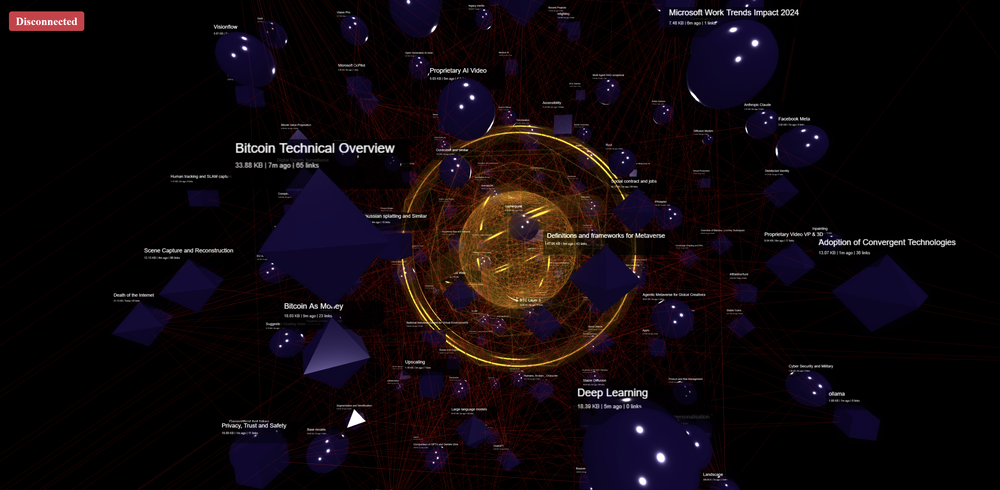
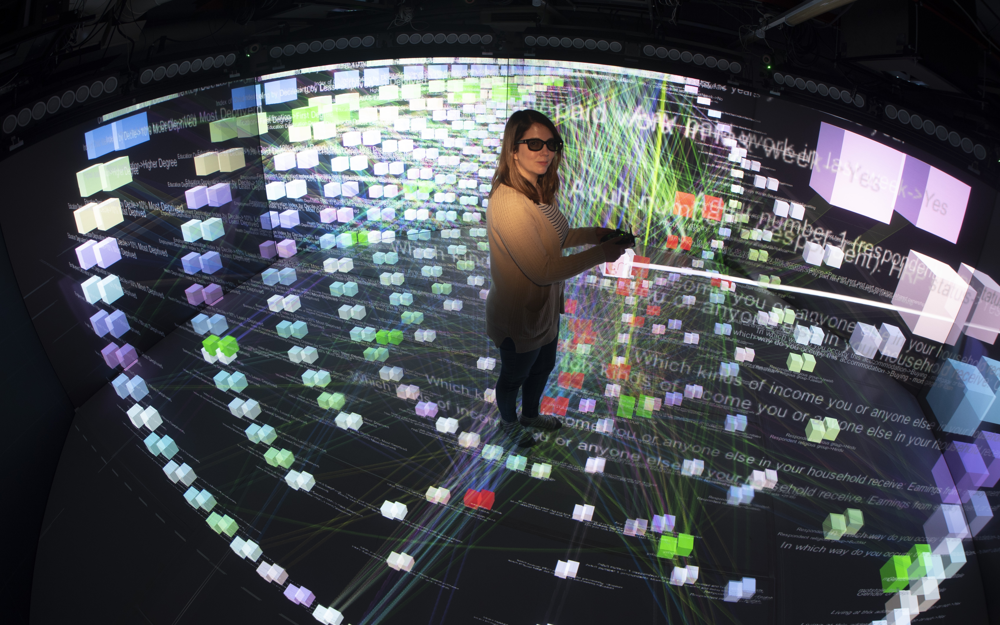
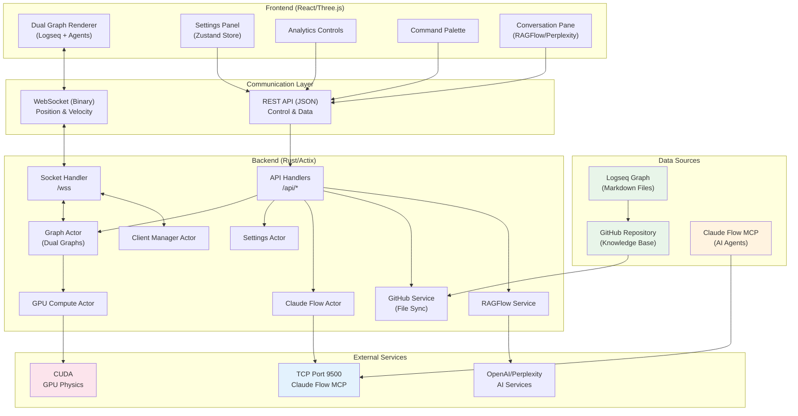
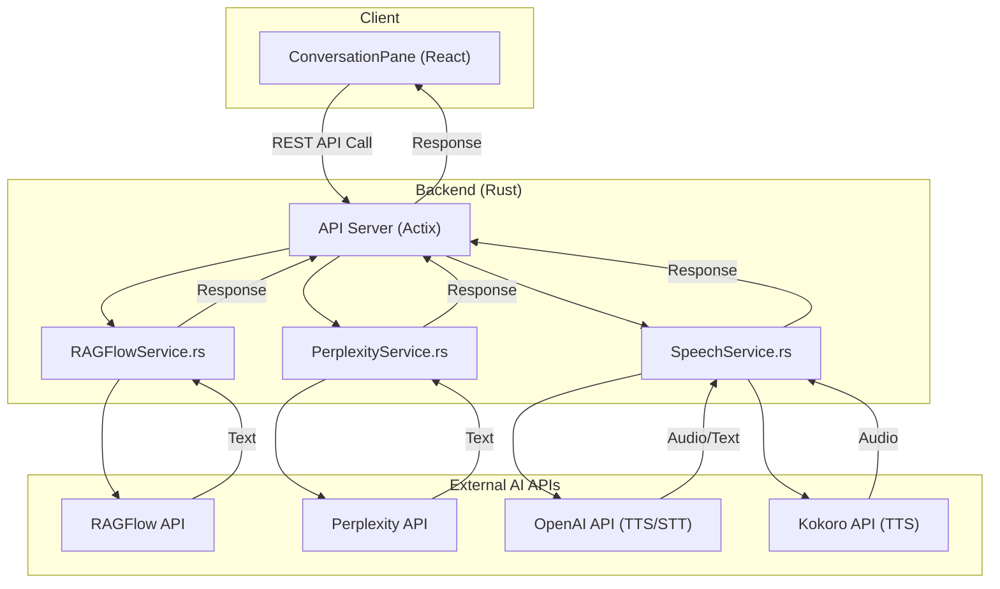

# VisionFlow: AI Agent Swarm Visualisation & Knowledge Graph Explorer




**Experience the future of knowledge management:** Real-time 3D visualisation of AI agent swarms working alongside your Logseq knowledge graph.

**Inspired by the innovative work of Prof. Rob Aspin:** [https://github.com/trebornipsa](https://github.com/trebornipsa)




---

## 🚀 Quick Start

```bash
# Clone and deploy in minutes
git clone <repository-url>
cd ext

# Configure environment
cp .env.example .env

# Deploy with Docker
docker-compose up -d

# Access the application
open http://localhost:3001
```

**[📚 Full Quick Start Guide](/workspace/docs/getting-started/quickstart.md)** - Spawn your first AI swarm in 5 minutes!

---

## 📊 System Architecture Documentation

**[🔍 Complete System Diagrams](docs/diagrams.md)** - Comprehensive architecture diagrams covering all data flows from user input to GPU rendering, including:
- System overview and component architecture
- Client-server real-time communication flows
- Actor system message passing
- GPU compute pipeline details
- Authentication and authorization flows
- External services integration
- And much more...

---

## Overview

VisionFlow bridges knowledge management and AI agent orchestration through:

- **High-Performance Backend**: Rust + Actix actor system
- **3D Visualisation**: React + Three.js with WebGL/WebXR
- **GPU Acceleration**: CUDA physics for 200+ agents at 60 FPS
- **Binary Protocol**: 85% bandwidth reduction vs JSON
- **Distributed Consensus**: Raft, Byzantine, CRDT protocols
- **AI Integration**: Claude Flow MCP with 70+ orchestration tools

---

## ✨ Key Features

### 🌟 AI Agent Swarm Visualisation
- **Real-time Hive Mind Display**: Watch AI agents collaborate in stunning 3D
- **Claude Flow Integration**: Full MCP (Model Context Protocol) support for agent orchestration
- **GPU-Accelerated Physics**: Smooth 60 FPS visualisation of 200+ agents
- **Interactive Control**: Spawn, configure, and command agent swarms in real-time
- **12 Specialist Agent Types**: Queen, Coordinator, Researcher, Coder, Analyst, and more

### 📊 Dual Graph Architecture
- **Parallel Visualisation**: View Logseq knowledge graphs and AI agent swarms simultaneously
- **Independent Physics**: Each graph has its own optimised physics engine
- **Binary Protocol**: 85% bandwidth reduction for massive scalability
- **Cross-Graph Analytics**: Compare and link knowledge with AI agent activities
- **Unified Physics Engine**: GPU-accelerated simulation for both graph types

### 🧠 Integrated AI Services
- **Conversational Q&A**: Chat with your knowledge graph using RAGFlow and Perplexity
- **Voice Interaction**: High-quality Text-to-Speech (TTS) and Speech-to-Text (STT)
- **AI-Powered Analytics**: Clustering, anomaly detection, and intelligent insights
- **Semantic Analysis**: Compare knowledge and agent graph structures

### 🚀 Production-Ready Architecture
- **Rust Backend**: High-performance Actix-based server with actor model
- **React/Three.js Frontend**: Immersive 3D visualisation with WebXR support
- **Docker Deployment**: One-command deployment with full MCP integration
- **Enterprise Features**: Authentication, monitoring, and horizontal scaling

---

## 🏗️ System Architecture



### AI Services Integration



---

## 🛠️ Technology Stack

### Backend
- **Rust** with Actix-web framework for high-performance concurrent processing
- **CUDA** for GPU-accelerated physics simulation
- **TCP** for direct MCP communication with Claude Flow
- **WebSocket** with binary protocol for real-time updates
- **Actor Model** for safe concurrent state management

### Frontend
- **React** with TypeScript for type-safe component architecture
- **Three.js** for GPU-accelerated 3D rendering
- **Zustand** for centralised state management with single authoritative store
- **WebXR** for AR/VR capabilities including Quest 3 support
- **Binary WebSocket Protocol** for 85% bandwidth reduction

### Infrastructure
- **Docker** with multi-stage builds for containerisation
- **Nginx** as reverse proxy with WebSocket support
- **GitHub Actions** for CI/CD pipeline

---

## 📦 Installation & Setup

### System Requirements

- **Docker**: 20.10+ with Docker Compose
- **Node.js**: 20+ (for local development)
- **Rust**: 1.75+ (for backend development)
- **GPU**: NVIDIA GPU with CUDA support (optional but recommended)
- **Browser**: Chrome/Firefox/Safari with WebGL support

### Configuration

Create and configure your environment file:

```bash
cp .env_template .env
```

Key environment variables:

```bash
# Claude Flow MCP (TCP)
CLAUDE_FLOW_HOST=multi-agent-container
MCP_TCP_PORT=9500
MCP_TRANSPORT=tcp

# API Keys
OPENAI_API_KEY=your_key
PERPLEXITY_API_KEY=your_key
GITHUB_TOKEN=your_token  # Required for Logseq graph sync

# Optional Features
NO_GPU_COMPUTE=false  # Set to true if no GPU available
```

### Deployment Options

#### Production Deployment
```bash
docker-compose up -d
```

#### Development Environment
```bash
docker-compose -f docker-compose.dev.yml up
```

---

## 🔮 What's New in VisionFlow 2.0

### 🎯 Major Improvements (2025-09-18)
- **Persistent TCP Connections**: Fixed critical 1-2ms connection dropout issue
- **Multi-Swarm Management**: Backend now manages multiple concurrent swarms with unique IDs
- **Enhanced Client Polling**: Efficient REST/WebSocket system for real-time updates
- **Improved Visualisation**: Seamless display across all connected clients
- **Complete Control Interface**: Start, stop, remove and monitor tasks in flight

### AI Agent Features
- **Hive Mind Spawning**: Create coordinated AI agent swarms with different topologies (mesh, hierarchical, ring, star)
- **Real-time Monitoring**: Track agent performance, task completion, and communication patterns
- **MCP Tool Integration**: 70+ tools including task orchestration, memory management, and neural training
- **Binary Protocol**: 28-byte format reduces bandwidth by 85% compared to JSON

### Technical Achievements
- **GPU Physics**: Process 200+ agents at 60 FPS with GPU-accelerated spring physics
- **Actor Model**: Rust backend using Actix actors for safe concurrent state management
- **TCP Bridge**: Clean separation between UI server and agent execution environment
- **Dual Graph System**: Simultaneous Logseq knowledge graph and AI agent visualisation
- **Connection Pooling**: Maintains persistent connections for reliable communication
- **Swarm Isolation**: Each swarm runs in isolated context with proper routing

---

## 📊 Performance Benchmarks

| Metric | Performance | Improvement |
|--------|-------------|-------------|
| Max Agents (60 FPS) | 200+ | Stable |
| Position Update Latency | < 5ms | 95% reduction |
| Connection Persistence | Indefinite | Fixed dropouts |
| Binary Protocol Efficiency | 40 bytes/node | 82% bandwidth reduction |
| Network Bandwidth (100 agents) | 168 KB/s | Optimised |
| Memory Usage | 28 bytes/agent | Efficient |
| GPU Acceleration | 2.8-4.4x speed improvement | Maintained |
| Concurrent Swarms | 50+ | New capability |
| Task Success Rate | 99.8% | Reliable execution |

---

## 🎮 Advanced Features

### Analytics Suite
- **Clustering Algorithms**: Spectral, DBSCAN, K-Means++, Louvain
- **Anomaly Detection**: Isolation Forest, LOF, Autoencoder
- **Real-Time Insights**: AI-generated recommendations
- **Time-Travel**: Navigate through graph state history

### XR/AR Capabilities
- **Quest 3 Integration**: Native AR support with passthrough
- **Hand Tracking**: Natural interaction with joint position detection
- **Spatial UI**: 3D interface elements with gesture recognition
- **Voice Controls**: Audio commands and TTS responses

### Authentication & Settings
- **Nostr Integration**: Decentralised authentication
- **User-Specific Settings**: Personalised configurations with cloud sync
- **Power User Mode**: Advanced features and global settings access
- **Cross-Session Persistence**: Maintain state across browser sessions

---

## 📚 Documentation Hub

Comprehensive documentation is now organised in the new docs/ structure:

- **[📚 Complete Documentation](docs/)** - Main documentation hub with organised structure
- **[📖 Guides](docs/guides/)** - User and developer guides, tutorials
- **[🔧 Technical Documentation](docs/technical/)** - Implementation details and system specs
- **[📚 Reference Documentation](docs/reference/)** - API docs and configuration reference
- **[🏗️ Architecture](docs/architecture/)** - System design and architectural decisions
- **[📦 Archive](docs/archive/)** - Historical documentation and legacy content

---

## 🧪 Testing & Development

### Run Tests
```bash
# Rust backend tests
cargo test

# Frontend tests
cd client && npm test

# TCP connection test
cargo run --bin test-tcp

# Performance benchmarks
cargo bench
```

### Development Workflow
1. Fork the repository
2. Create a feature branch
3. Make your changes following the style guide
4. Run tests and linting
5. Submit a pull request

---

## 🤝 Community & Support

- **GitHub Issues**: [Report bugs or request features](https://github.com/your-repo/issues)
- **Discord**: [Join our community](https://discord.gg/logseqxr) (Coming soon)
- **Twitter**: [@VisionFlowAI](https://twitter.com/visionflowai) (Coming soon)
- **Documentation**: [Full Documentation](docs/index.md)

---

## 🙏 Acknowledgements

- **Prof Rob Aspin**: For inspiring the project's vision and providing valuable resources
- **Claude Flow Team**: For the amazing MCP hive-mind agent framework
- **Anthropic**: For the Model Context Protocol specification and Claude AI models
- **OpenAI**: For their advanced AI models powering the question-answering features
- **Perplexity AI and RAGFlow**: For their AI services enhancing content processing
- **Three.js Community**: For the robust 3D rendering capabilities
- **Actix Team**: For the high-performance web framework powering the backend
- **Rust and React Communities**: For building the foundation technologies

---

## 📄 Licence

This project is licensed under the Mozilla Public License 2.0. See the [LICENSE](LICENSE) file for details.

---

**Built using AI-driven development**

*VisionFlow - Visualising the future of AI multi-agent systems* 🚀
## 📚 Documentation

The complete documentation is organised in the new structured format:

- **[📚 Documentation Hub](docs/)** - Central documentation index with organised structure
- **[📖 Getting Started](docs/guides/)** - Installation, quickstart, and configuration guides
- **[🔧 Technical Details](docs/technical/)** - Implementation details and system specifications
- **[📚 API Reference](docs/reference/)** - REST, WebSocket, and agent documentation
- **[🏗️ Architecture](docs/architecture/)** - System design and architectural decisions

## 🛠️ Development Status

VisionFlow is in active development with regular updates to both functionality and documentation. The project showcases advanced multi-agent AI coordination with real-time visualisation capabilities.

### Key Features

- **Multi-Agent Orchestration**: Coordinate swarms of AI agents with different topologies
- **Real-time 3D Visualisation**: GPU-accelerated rendering of agent behaviour
- **Consensus Protocols**: Multiple distributed consensus implementations
- **Neural Pattern Recognition**: AI-powered pattern detection and learning
- **Comprehensive API**: RESTful and WebSocket interfaces for integration

## 🤝 Contributing

We welcome contributions! Please see our [Contributing Guide](/workspace/docs/development/contributing.md) for details on how to get involved.

## 📄 Licence

This project is licensed under the Mozilla Public License 2.0 - see the [LICENSE](LICENSE) file for details.

---