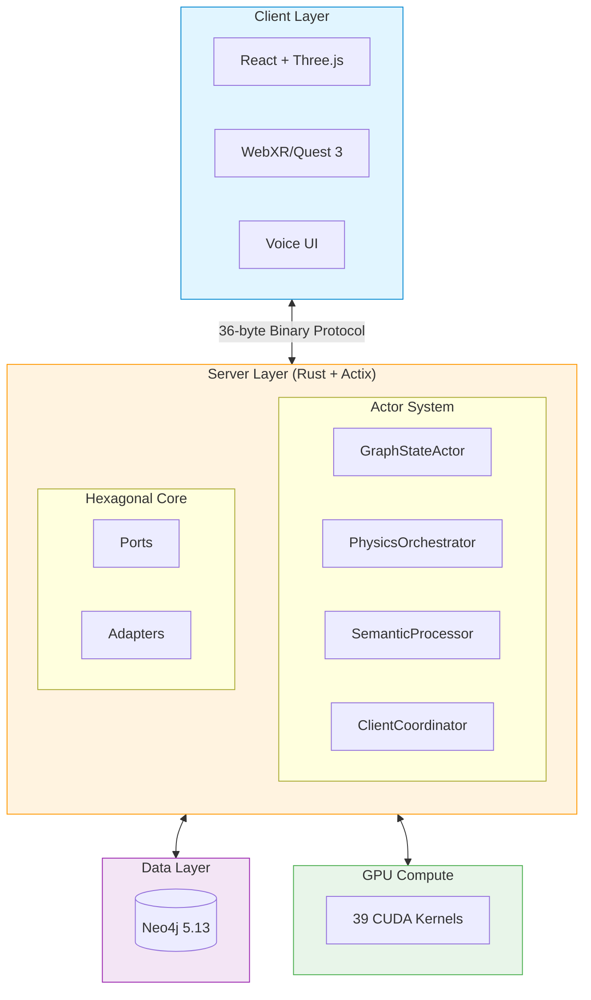
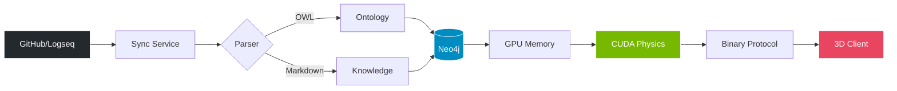
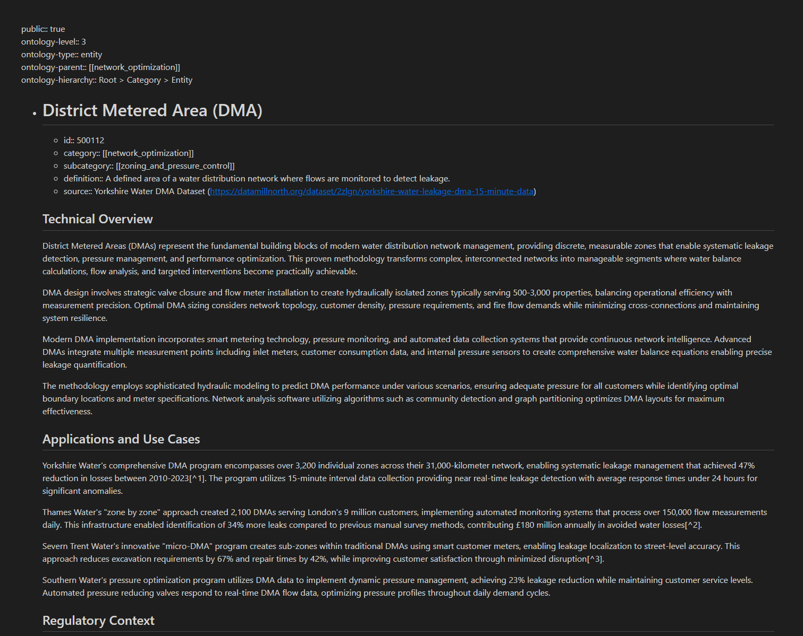
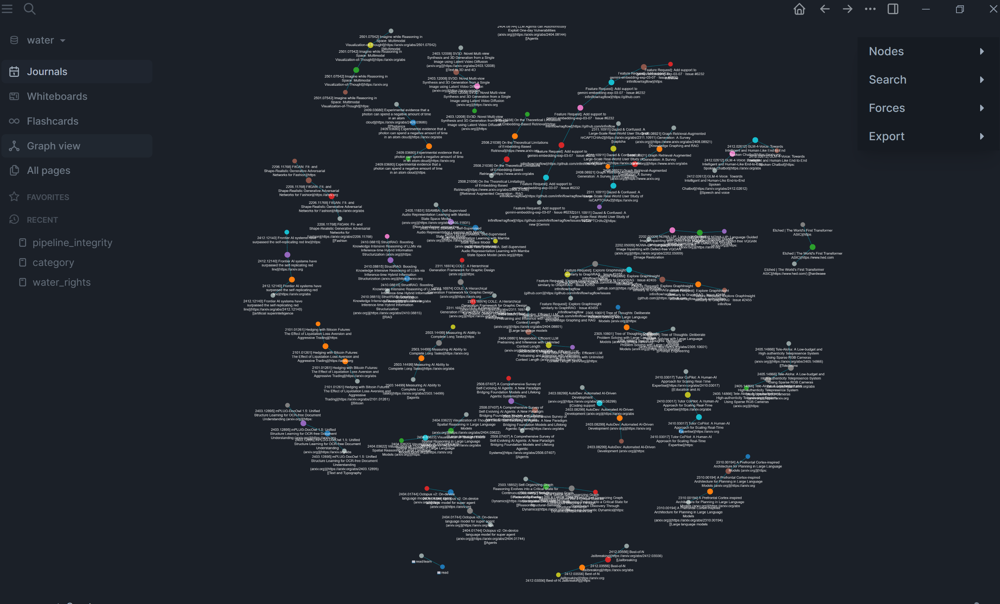
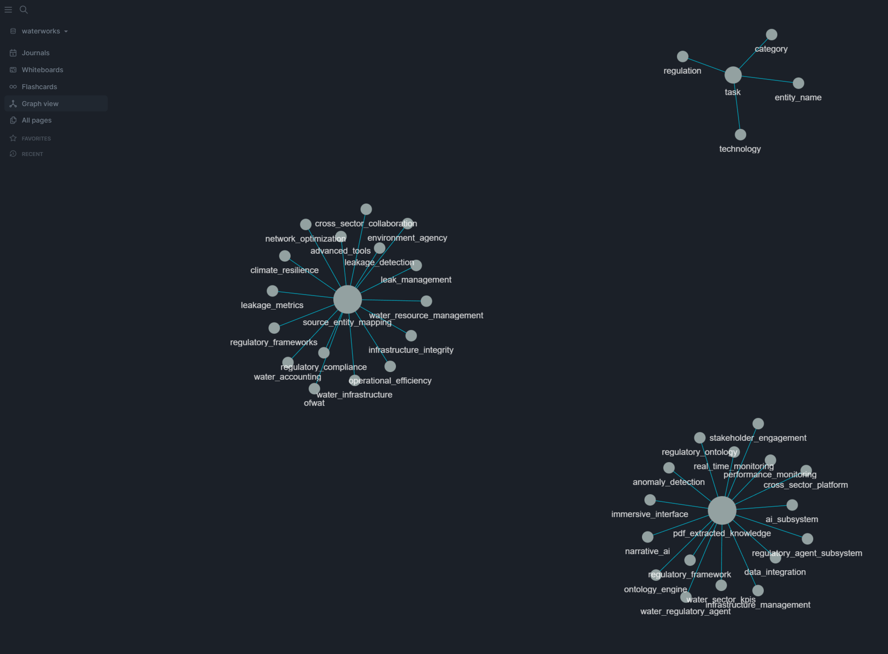
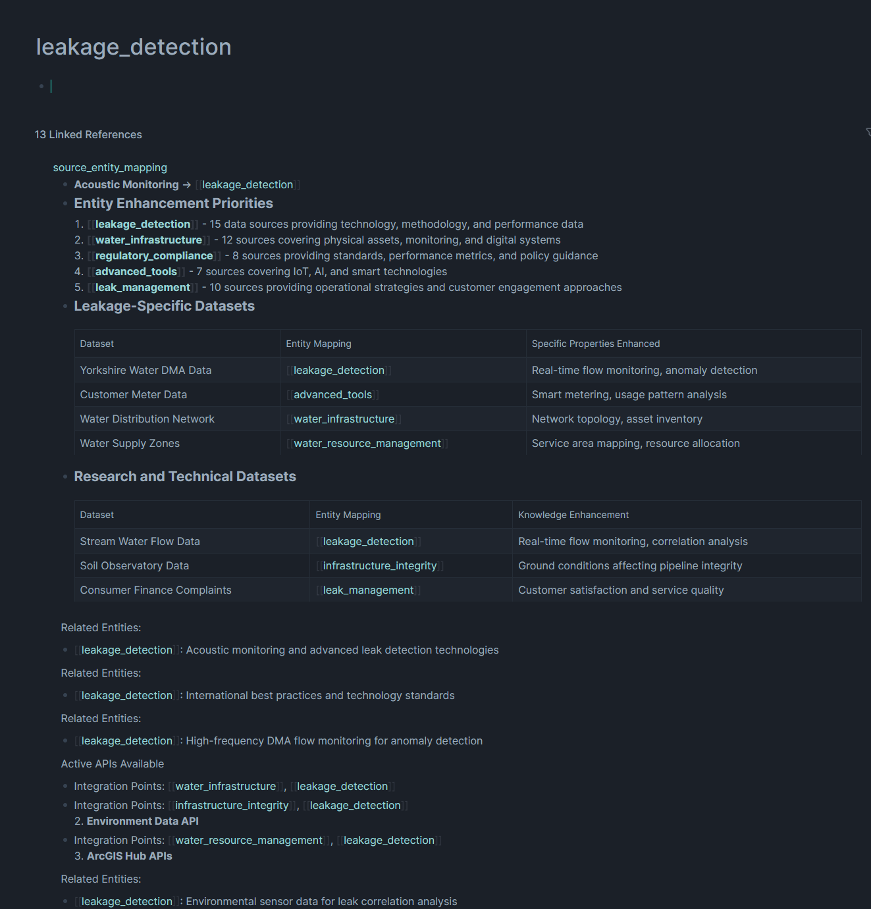

<div align="center">

# VisionFlow

### **Self-Sovereign AI Knowledge Graphing with Immersive 3D Visualization**

[](LICENSE)
[](https://www.rust-lang.org/)
[](https://developer.nvidia.com/cuda-toolkit)
[](https://neo4j.com/)
[](https://deepwiki.com/DreamLab-AI/VisionFlow)

**Deploy autonomous AI agent teams that continuously research, analyze, and surface insights from your entire data corpus—visualized in a stunning, real-time 3D interface.**

<br/>

<table>
  <tr>
    <td></td>
    <td></td>
  </tr>
</table>

<br/>

[**Quick Start**](#-quick-start) · [**Documentation**](docs/) · [**Architecture**](#-architecture) · [**Roadmap**](#-roadmap) · [**Contributing**](#-contributing)

---

**Note:** This README contains expandable sections marked with **"Click to expand"**. Click on these to reveal detailed information.

</div>

---

## The Vision

> *What if your knowledge base could think for itself?*

VisionFlow transforms static documents into living, breathing knowledge ecosystems. Instead of searching through files, **AI agents continuously analyze your data**, discovering connections you didn't know existed—while you **explore the results in an immersive 3D space** with your team.


### Why VisionFlow?

| VisionFlow | Traditional AI Tools |
|:---|:---|
| **Continuous** agent research, 24/7 | Reactive, query-based responses |
| **Private** data stays on your infrastructure | Sent to third-party APIs |
| **Visual** 3D exploration with your team | Static text output |
| **Auditable** Git version control for all changes | No transparency |
| **Voice-first** spatial interaction | Text-only interface |

---

## Key Capabilities

<table>
<tr>
<td width="50%">

### Autonomous AI Analysis
- **50+ concurrent AI agents** with specialized roles
- **Microsoft GraphRAG** for hierarchical reasoning
- **Leiden clustering** for community detection
- **Multi-hop reasoning** across knowledge domains

</td>
<td width="50%">

### GPU-Accelerated Performance
- **39 CUDA kernels** for 100x speedup
- **60 FPS** rendering at 100,000+ nodes
- **36-byte binary protocol** (80% bandwidth reduction)
- **Sub-10ms** WebSocket latency

</td>
</tr>
<tr>
<td>

### Real-Time Collaboration
- **Multi-user synchronization** via WebSocket
- **Independent camera controls** with shared state
- **Voice-to-voice AI interaction**
- **Spatial audio** via WebRTC

</td>
<td>

### Ontology Intelligence
- **OWL 2 EL reasoning** with Whelk-rs (10-100x faster)
- **Semantic physics** engine for meaningful layouts
- **Automatic inference** and contradiction detection
- **Type-based clustering** and hierarchy visualization

</td>
</tr>
<tr>
<td>

### Immersive XR
- **Meta Quest 3** native support (Beta)
- **Force-directed 3D physics** engine
- **Hand tracking** and controller input
- **Vircadia multi-user** integration (planned)

</td>
<td>

### Enterprise-Ready
- **Hexagonal architecture** with CQRS pattern
- **Neo4j** as single source of truth
- **JWT authentication** with RBAC
- **Git version control** for audit trails

</td>
</tr>
</table>

<details>
<summary><strong>Click to expand: The Ontology Intelligence System</strong></summary>

### From Chaos to Structure: Four Superpowers

**1. Grammar Checker for Your Data**
Just as spell-check prevents "runned," the ontology prevents logical errors in your knowledge graph. It enforces rules like "a Person cannot also be a Company" or "Software Projects must have source code."

**2. Automatic Knowledge Discovery**
Add one fact, get two for free. Define `Company X employs Person Y`, and the system automatically infers `Person Y works for Company X`. The ontology uses inverse relationships to multiply your knowledge.

**3. Self-Organizing 3D Visualization**
The physics engine translates logical rules into spatial forces:
- `SubClassOf` → Attraction (child classes cluster near parents)
- `DisjointWith` → Repulsion (disjoint classes pushed apart)
- `EquivalentClasses` → Strong attraction (synonyms together)

**4. Context-Aware AI Agents**
Agents understand the "rules of your world." When tasked to "audit all software projects," they know exactly what qualifies as a project versus a library or documentation page.

| Without Ontology | With Ontology |
|:---|:---|
| Inconsistent data—connect anything to anything | Validated data—system prevents logical errors |
| Only know what you explicitly enter | Auto-discover hidden relationships |
| Generic hairball layout | Meaningful spatial organization |
| AI agents require hand-holding | Context-aware autonomous agents |

</details>

---

## Quick Start

Get VisionFlow running in under 5 minutes:

```bash
# Clone the repository
git clone https://github.com/DreamLab-AI/VisionFlow.git
cd VisionFlow

# Configure environment
cp .env.example .env
# Edit .env with your NEO4J_PASSWORD

# Deploy with Docker
docker-compose --profile dev up -d

# Access VisionFlow
# Frontend:    http://localhost:3001
# Neo4j:       http://localhost:7474
# Backend API: http://localhost:4000
```

**That's it.** Your AI agent teams will begin analyzing data immediately.

**Next:** [Full Installation Guide](docs/getting-started/01-installation.md) · [First Graph Tutorial](docs/getting-started/02-first-graph-and-agents.md)

<details>
<summary><strong>Click to expand: Native Installation (without Docker)</strong></summary>

### 1. Install Rust

```bash
curl --proto '=https' --tlsv1.2 -sSf https://sh.rustup.rs | sh
source $HOME/.cargo/env
rustup default stable
```

### 2. Install CUDA (Optional, for GPU acceleration)

```bash
# Ubuntu/Debian
wget https://developer.download.nvidia.com/compute/cuda/repos/ubuntu2204/x86_64/cuda-keyring_1.0-1_all.deb
sudo dpkg -i cuda-keyring_1.0-1_all.deb
sudo apt-get update
sudo apt-get install cuda-toolkit-12-4

# Verify
nvcc --version
```

### 3. Install Node.js

```bash
curl -fsSL https://deb.nodesource.com/setup_20.x | sudo -E bash -
sudo apt-get install -y nodejs
```

### 4. Install Neo4j

```bash
# Docker (Recommended)
docker run -d --name neo4j \
  -p 7474:7474 -p 7687:7687 \
  -e NEO4J_AUTH=neo4j/your_password \
  neo4j:5.13.0
```

### 5. Build and Run

```bash
# Clone and configure
git clone https://github.com/DreamLab-AI/VisionFlow.git
cd VisionFlow
cp .env.example .env

# Build server (with GPU)
cargo build --release --features gpu

# Build client
cd client && npm install && npm run build && cd ..

# Run
./target/release/webxr
```

</details>

---

## Architecture

VisionFlow implements a **Hexagonal Architecture** with **Modular Actor System** for clean separation of concerns:



### Core Design Principles

- **Server-Authoritative State** — Neo4j is the single source of truth
- **Binary Protocol** — 36-byte WebSocket messages (80% bandwidth reduction vs JSON)
- **GPU Offloading** — Physics, clustering, pathfinding accelerated 100x
- **Actor Isolation** — Specialized actors for graph state, physics, semantics, and coordination

**Deep Dive:** [Architecture Overview](docs/concepts/architecture/00-architecture-overview.md) · [Hexagonal CQRS](docs/concepts/architecture/hexagonal-cqrs-architecture.md) · [Actor System](docs/guides/graphserviceactor-migration.md)

<details>
<summary><strong>Click to expand: Data Pipeline Details</strong></summary>



**Pipeline Features:**
- **Streaming processing** — No batching bottlenecks
- **Real-time persistence** — Immediate Neo4j writes
- **GPU-accelerated physics** — 100x faster than CPU
- **Binary efficiency** — 36 bytes per node update

**Complete documentation:** [Pipeline Integration](docs/concepts/architecture/pipeline-integration.md)

</details>

<details>
<summary><strong>Click to expand: Architecture Documentation Index</strong></summary>

**Core Architecture:**
- [Architecture Overview](docs/concepts/architecture/00-architecture-overview.md)
- [Hexagonal CQRS Architecture](docs/concepts/architecture/hexagonal-cqrs-architecture.md)
- [Modular Actor System](docs/guides/graphserviceactor-migration.md)

**Specialized Systems:**
- [XR Immersive System](docs/concepts/architecture/xr-immersive-system.md)
- [Ontology Storage Architecture](docs/concepts/architecture/ontology-storage-architecture.md)
- [Semantic Physics System](docs/concepts/architecture/semantic-physics-system.md)
- [GPU Semantic Forces](docs/concepts/architecture/gpu-semantic-forces.md)

**Communication Protocols:**
- [WebSocket Protocol](docs/reference/websocket-protocol.md)
- [REST API Reference](docs/reference/api/rest-api-reference.md)
- [Error Codes](docs/reference/error-codes.md)

**Data Flow:**
- [Data Flow Complete](docs/concepts/architecture/data-flow-complete.md)
- [Reasoning Data Flow](docs/concepts/architecture/reasoning-data-flow.md)

</details>

---

## Performance

### Rendering

| Metric | Value |
|:---|---:|
| Frame Rate | **60 FPS** @ 100K nodes |
| Render Latency | **<16ms** per frame |
| Max Nodes | **100,000+** without degradation |
| Concurrent Users | **50+** simultaneous |

### GPU Acceleration

| Operation | CPU | GPU | Speedup |
|:---|---:|---:|---:|
| Physics Simulation | 1,600ms | 16ms | **100x** |
| Leiden Clustering | 800ms | 12ms | **67x** |
| Shortest Path | 500ms | 8ms | **62x** |

### Network

| Metric | Value |
|:---|---:|
| WebSocket Latency | **<10ms** |
| Bandwidth Reduction | **80%** vs JSON |
| Message Size | **36 bytes**/node |

<details>
<summary><strong>Click to expand: Detailed Performance Benchmarks</strong></summary>

### AI Agent Performance
- **Agent Spawn Time:** <50ms per agent
- **Concurrent Agents:** 50+ simultaneous
- **Memory Per Agent:** ~50MB average
- **Agent Communication:** <5ms message latency

### Binary Protocol V2 (36-byte format)
```
| Field        | Bytes | Description           |
|--------------|-------|-----------------------|
| Node ID      | 4     | Unique identifier     |
| Position X   | 4     | Float32               |
| Position Y   | 4     | Float32               |
| Position Z   | 4     | Float32               |
| Velocity X   | 4     | Float32               |
| Velocity Y   | 4     | Float32               |
| Velocity Z   | 4     | Float32               |
| Flags        | 4     | State flags           |
| Reserved     | 4     | Future use            |
```

**Full benchmarks:** [Performance Benchmarks](docs/reference/performance-benchmarks.md)

</details>

---

## Technology Stack

| Layer | Technology |
|:---|:---|
| **Frontend** | React, Three.js (React Three Fiber), TypeScript |
| **Backend** | Rust, Actix-Web, Hexagonal Architecture |
| **Database** | Neo4j 5.13 |
| **GPU** | CUDA 12.4 (39 kernels) |
| **AI** | MCP Protocol, Claude, Microsoft GraphRAG |
| **Semantic** | OWL/RDF, Whelk-rs Reasoner |
| **XR** | Babylon.js, WebXR, Quest 3 |

---

## Documentation

VisionFlow uses the **Diátaxis** framework for organized documentation:

<table>
<tr>
<td width="50%">

### Tutorials (Learning)
- [Installation Guide](docs/getting-started/01-installation.md)
- [First Graph & Agents](docs/getting-started/02-first-graph-and-agents.md)
- [Neo4j Quick Start](docs/tutorials/neo4j-quick-start.md)

### How-To Guides
- [Working with Agents](docs/archive/docs/guides/user/working-with-agents.md)
- [XR Setup](docs/guides/vircadia-xr-complete-guide.md)
- [Neo4j Integration](docs/guides/neo4j-integration.md)
- [Docker Deployment](docs/guides/docker-compose-guide.md)

</td>
<td width="50%">

### Concepts (Understanding)
- [Architecture Overview](docs/concepts/architecture/00-architecture-overview.md)
- [Hexagonal CQRS](docs/concepts/architecture/hexagonal-cqrs-architecture.md)
- [Semantic Physics](docs/concepts/architecture/semantic-physics-system.md)
- [Ontology Reasoning](docs/concepts/ontology-reasoning.md)

### Reference
- [REST API](docs/reference/api/rest-api-reference.md)
- [WebSocket Protocol](docs/reference/websocket-protocol.md)
- [Error Codes](docs/reference/error-codes.md)
- [Performance Benchmarks](docs/reference/performance-benchmarks.md)

</td>
</tr>
</table>

**Full Documentation Hub:** [docs/](docs/)

<details>
<summary><strong>Click to expand: Complete Documentation Index</strong></summary>

### Getting Started
- [Installation Guide](docs/getting-started/01-installation.md)
- [First Graph & Agents](docs/getting-started/02-first-graph-and-agents.md)

### User Guides
- [Working with Agents](docs/archive/docs/guides/user/working-with-agents.md)
- [XR Setup](docs/guides/vircadia-xr-complete-guide.md)
- [Neo4j Integration](docs/guides/neo4j-integration.md)
- [Docker Deployment](docs/guides/docker-compose-guide.md)
- [Configuration](docs/guides/configuration.md)
- [Security](docs/guides/security.md)

### Developer Guides
- [Development Setup](docs/guides/developer/01-development-setup.md)
- [Project Structure](docs/guides/developer/02-project-structure.md)
- [Architecture Overview](docs/guides/developer/03-architecture.md)
- [Adding Features](docs/guides/developer/04-adding-features.md)
- [Testing Guide](docs/guides/testing-guide.md)
- [Contributing](docs/guides/developer/06-contributing.md)

### Architecture Concepts
- [Architecture Overview](docs/concepts/architecture/00-architecture-overview.md)
- [Hexagonal CQRS](docs/concepts/architecture/hexagonal-cqrs-architecture.md)
- [Semantic Physics](docs/concepts/architecture/semantic-physics-system.md)
- [XR Immersive System](docs/concepts/architecture/xr-immersive-system.md)
- [Ontology Storage](docs/concepts/architecture/ontology-storage-architecture.md)
- [GPU Semantic Forces](docs/concepts/architecture/gpu-semantic-forces.md)

### Feature Guides
- [Natural Language Queries](docs/guides/features/natural-language-queries.md)
- [Intelligent Pathfinding](docs/guides/features/intelligent-pathfinding.md)
- [Semantic Forces](docs/guides/features/semantic-forces.md)
- [Filtering Nodes](docs/guides/features/filtering-nodes.md)

### Reference
- [REST API](docs/reference/api/rest-api-reference.md)
- [WebSocket Protocol](docs/reference/websocket-protocol.md)
- [Error Codes](docs/reference/error-codes.md)
- [Performance Benchmarks](docs/reference/performance-benchmarks.md)

### Multi-Agent System
- [Architecture](docs/multi-agent-docker/architecture.md)
- [Tools](docs/multi-agent-docker/tools.md)
- [Docker Environment](docs/multi-agent-docker/docker-environment.md)
- [Troubleshooting](docs/multi-agent-docker/troubleshooting.md)

</details>

---

## Project Structure

```
VisionFlow/
├── src/                    # Rust server
│   ├── actors/             # Modular actor system
│   ├── handlers/           # HTTP/WebSocket handlers
│   ├── services/           # Business logic
│   ├── adapters/           # Neo4j integration
│   ├── ontology/           # OWL reasoning
│   ├── gpu/                # CUDA kernels
│   └── protocols/          # Binary protocol
│
├── client/src/             # React frontend
│   ├── components/         # UI components
│   ├── rendering/          # Three.js 3D engine
│   ├── immersive/          # XR integration
│   └── services/           # API clients
│
├── multi-agent-docker/     # AI orchestration
│   ├── agents/             # 54+ agent templates
│   └── coordination/       # Agent coordination
│
└── docs/                   # Documentation
    ├── getting-started/    # Tutorials
    ├── guides/             # How-to guides
    ├── concepts/           # Architecture docs
    └── reference/          # API reference
```

<details>
<summary><strong>Click to expand: Detailed Directory Structure</strong></summary>

```
VisionFlow/
├── src/                          # Server code (Rust + Actix)
│   ├── handlers/                 # HTTP/WebSocket request handlers
│   │   ├── socket_flow_handler.rs   # WebSocket connection management
│   │   └── graph_handler.rs         # Graph API endpoints
│   ├── services/                 # Business logic layer
│   │   ├── graph_service.rs         # Graph operations
│   │   └── sync_service.rs          # GitHub synchronization
│   ├── adapters/                 # Neo4j & external integrations
│   │   └── neo4j_adapter.rs         # Database operations
│   ├── ports/                    # Interface definitions
│   ├── actors/                   # Modular actor system
│   │   ├── graph_state_actor.rs     # Graph state management
│   │   ├── physics_orchestrator_actor.rs  # Physics coordination
│   │   ├── semantic_processor_actor.rs    # Semantic processing
│   │   └── client_coordinator_actor.rs    # Client synchronization
│   ├── ontology/                 # OWL reasoning and validation
│   │   ├── parser.rs                # OWL/RDF parsing
│   │   └── reasoner.rs              # Whelk-rs integration
│   ├── gpu/                      # CUDA kernel integration
│   │   └── kernels/                 # 39 CUDA kernels
│   └── protocols/                # Binary WebSocket protocol
│       └── binary_protocol.rs       # 36-byte message format
│
├── client/src/                   # Client code (React + Three.js)
│   ├── components/               # React UI components
│   │   ├── ControlCenter/           # Main control panel
│   │   └── Graph/                   # 3D graph components
│   ├── features/                 # Feature-specific modules
│   │   ├── visualisation/           # Visualization features
│   │   └── design-system/           # UI design system
│   ├── rendering/                # 3D rendering engine
│   │   └── GraphRenderer.tsx        # Three.js graph rendering
│   ├── services/                 # API client services
│   │   └── websocket.ts             # WebSocket client
│   ├── immersive/                # XR/VR integration
│   └── xr/                       # WebXR implementation
│
├── multi-agent-docker/           # Multi-agent orchestration container
│   ├── agents/                   # 54+ AI agent templates
│   ├── coordination/             # Agent coordination logic
│   ├── hooks/                    # Pre/post task automation
│   └── unified-config/           # Container configuration
│
└── docs/                         # Complete documentation
    ├── getting-started/          # Installation & tutorials
    ├── guides/                   # How-to guides (user, developer, operations)
    │   ├── developer/               # Development guides
    │   ├── features/                # Feature-specific guides
    │   └── infrastructure/          # Infrastructure guides
    ├── concepts/                 # Architecture & design concepts
    │   └── architecture/            # System architecture
    ├── reference/                # API references & technical specs
    │   └── api/                     # API documentation
    └── explanations/             # Deep-dive explanations
```

</details>

---

## Roadmap

### Completed (v2.0)

- Modular actor architecture
- Neo4j as primary database
- Binary WebSocket protocol (36 bytes, 80% reduction)
- 39 CUDA kernels (100x speedup)
- 50+ concurrent AI agents
- OWL 2 EL reasoning with Whelk-rs
- Quest 3 WebXR (Beta)

### In Progress (v2.1)

- Vircadia multi-user integration
- Spatial avatars and presence
- SPARQL query interface
- Distributed GPU compute

### Future (v3.0+)

- Apple Vision Pro native app
- Federated ontologies
- Kubernetes operator
- Multi-region replication

<details>
<summary><strong>Click to expand: Roadmap for Q1 2026</strong></summary>

### Q1 2026 — Foundation & Collaboration Infrastructure

**Sprint 1: W3C Compliant DID Layer for Agents**
- [ ] Implement W3C DID specification for agent identity management
- [ ] Create DID:web resolver for human expert authentication
- [ ] Build DID document generation and verification service
- [ ] Integrate with existing Nostr authentication as fallback
- [ ] Deliverable: Agents and humans share cryptographically verifiable identities

**Sprint 2: Offline Message Passing Protocol**
- [ ] Design CRDT-based message queue for offline-first operation
- [ ] Implement local message store with conflict resolution
- [ ] Build sync protocol for intermittent connectivity scenarios
- [ ] Add message signing using DID keypairs
- [ ] Deliverable: Communications protocol supporting disconnected operation

**Sprint 3: Multi-User Shared Presence Protocol**
- [ ] Extend Vircadia layer for 12+ person simultaneous collaboration
- [ ] Implement cursor/avatar awareness in shared knowledge spaces
- [ ] Build conflict resolution for concurrent node manipulation
- [ ] Add presence indicators and activity status broadcasting
- [ ] Deliverable: Real-time collaborative editing with visual awareness

**Sprint 4: Semantic LOD (Level of Detail) System**
- [ ] Progressive disclosure based on camera distance AND semantic relevance
- [ ] Cluster collapse/expand driven by ontology hierarchy
- [ ] GPU-accelerated frustum culling with semantic weighting
- [ ] Performance optimisation for 4M+ token knowledge graphs
- [ ] Deliverable: Adaptive detail rendering based on semantic importance

</details>

<details>
<summary><strong>Click to expand: Roadmap for Q2 2026</strong></summary>

### Q2 2026 — Performance & Embodied Intelligence

**Sprint 5: Spring Solver R&D Programme**
- [ ] Benchmark client vs server vs GPU physics computation
- [ ] Research optimistic update strategies with rollback
- [ ] Develop novel CUDA kernels for ontology-based shortest path discovery
- [ ] Implement adaptive solver selection based on graph characteristics
- [ ] Deliverable: Optimal spring solving strategy per deployment context

**Sprint 6: Self-Sovereign Agentic Inferencing Stack**
- [ ] Local inference engine for team/agent collaboration
- [ ] Mixed workload distribution across CPU/GPU resources
- [ ] Agent-to-agent communication without central orchestration
- [ ] Privacy-preserving inference with local model hosting
- [ ] Deliverable: Fully offline-capable AI inference infrastructure

**Sprint 7: Embodied Agent Visualisation**
- [ ] Visual representation of AI agents "inhabiting" the knowledge space
- [ ] Attention beams showing agent focus and processing targets
- [ ] Activity trails displaying agent traversal history
- [ ] Agent state indicators (thinking, searching, communicating)
- [ ] Deliverable: Transparent AI presence within immersive environments

**Sprint 8: Gesture Vocabulary for Graph Operations**
- [ ] Hand tracking integration (Quest, Vision Pro)
- [ ] Pinch-drag, two-hand scaling, semantic gesture recognition
- [ ] Configurable gesture bindings with user customisation
- [ ] "Connect" motion for relationship creation
- [ ] Deliverable: Natural hand-based graph manipulation system

</details>

<details>
<summary><strong>Click to expand: Roadmap for Q3 2026</strong></summary>

### Q3 2026 — Immersive Environments & Accessibility

**Sprint 9: Gaussian Splat Integration**
- [ ] Import pre-scanned Gaussian splats into knowledge environments
- [ ] SAM3D image-to-splat pipeline integration
- [ ] Hybrid rendering combining graphs with photorealistic backgrounds
- [ ] LOD system for splat quality based on viewer distance
- [ ] Deliverable: Photorealistic knowledge environment foundations

**Sprint 10: Spatial Audio Sonification Layer**
- [ ] Audio cues for graph topology (distance = volume, density = harmonic complexity)
- [ ] Accessibility mode for visually impaired knowledge workers
- [ ] Directional audio for off-screen node awareness
- [ ] Integration with Bernie's spatial audio system (if available)
- [ ] Deliverable: Auditory navigation and awareness system

**Sprint 11: Temporal Knowledge Archaeology**
- [ ] Time-slider to navigate knowledge graph evolution
- [ ] Diff view showing changes between temporal states
- [ ] Provenance trails tracking node origin and modifications
- [ ] Visual git-blame for knowledge attribution
- [ ] Deliverable: Versioned graph store with temporal query API + visualisation

**Sprint 12: Biometric-Adaptive Interface**
- [ ] Eye tracking for attention-based navigation (foveated detail loading)
- [ ] Cognitive load detection with automatic complexity reduction
- [ ] Dwell-to-select for hands-free operation
- [ ] Gaze-based node highlighting and selection
- [ ] Deliverable: Eye tracking integration + adaptive UI state machine

</details>

<details>
<summary><strong>Click to expand: Roadmap for Q4 2026 & Beyond</strong></summary>

### Q4 2026 — Enterprise Scale & Extended Reality

**Sprint 13: AR Document Anchoring Mode**
- [ ] Project knowledge subgraphs onto physical documents/whiteboards
- [ ] QR/marker-based anchoring for persistent placement
- [ ] Bridge between physical research materials and digital knowledge
- [ ] Multi-surface projection with automatic alignment
- [ ] Deliverable: WebXR AR module with image tracking

**Sprint 14: Apple Vision Pro Native Application**
- [ ] RealityKit-based immersive knowledge space
- [ ] visionOS-native hand and eye tracking
- [ ] SharePlay integration for collaborative sessions
- [ ] Spatial Personas for multi-user presence
- [ ] Deliverable: Native visionOS application

**Sprint 15: Federated Ontologies & Enterprise Features**
- [ ] Cross-organisation ontology federation
- [ ] SSO integration (SAML, OAuth2, OpenID Connect)
- [ ] Fine-grained RBAC permission system
- [ ] Audit logging and compliance reporting
- [ ] Deliverable: Enterprise-ready multi-tenant deployment

**Sprint 16: Kubernetes Operator & Global Scale**
- [ ] Custom Kubernetes operator for auto-scaling
- [ ] Multi-region data replication with CRDT sync
- [ ] Support for millions of nodes
- [ ] Real-time collaborative VR for 100+ simultaneous users
- [ ] Deliverable: Production-grade cloud-native deployment

</details>

<details>
<summary><strong>Click to expand: Strategic Development Bundles</strong></summary>

### Bundle A: Decentralised Immersive Collaboration
*Secure, persistent, multi-stakeholder knowledge collaboration*

| Component | Sprint | Priority |
|:---|:---:|:---:|
| W3C DID Layer | Q1 S1 | High |
| Shared Presence Protocol | Q1 S3 | High |
| Offline Message Passing | Q1 S2 | Medium |

**Story:** Enable distributed teams with varying connectivity to collaborate on shared knowledge spaces with cryptographically verifiable identity and offline-first resilience.

---

### Bundle B: High-Performance Semantic Visualisation
*Real-time ontology navigation at enterprise scale*

| Component | Sprint | Priority |
|:---|:---:|:---:|
| Spring Solver R&D | Q2 S5 | Critical |
| Semantic LOD System | Q1 S4 | High |
| Novel CUDA Kernels | Q2 S5 | High |

**Story:** Achieve sub-frame rendering and physics updates for knowledge graphs exceeding 4 million tokens through intelligent GPU utilisation and semantic-aware level of detail.

---

### Bundle C: Embodied AI Knowledge Agents
*Human-AI teaming in immersive environments*

| Component | Sprint | Priority |
|:---|:---:|:---:|
| Agent Visualisation | Q2 S7 | High |
| Self-Sovereign Inference | Q2 S6 | High |
| Gesture Vocabulary | Q2 S8 | Medium |

**Story:** Transform abstract AI agents into visible collaborators that share the immersive space, enabling natural interaction through gesture and spatial awareness.

---

### Bundle D: Photorealistic Knowledge Environments
*Digital twin knowledge spaces with full provenance*

| Component | Sprint | Priority |
|:---|:---:|:---:|
| Gaussian Splats | Q3 S9 | Medium |
| AR Anchoring | Q4 S13 | Medium |
| Temporal Archaeology | Q3 S11 | High |

**Story:** Blend scanned real-world environments with knowledge graph overlays, maintaining complete historical provenance for every piece of information.

</details>

<details>
<summary><strong>Click to expand: Completed Milestones (v2.0)</strong></summary>

### v2.0.0 (Completed - November 2025)

**Core Infrastructure**
- [x] Modular actor architecture (GraphServiceActor → 4 specialised actors)
- [x] Neo4j 5.13 as primary database
- [x] Hexagonal architecture with ports & adapters
- [x] Binary WebSocket protocol (36 bytes, 80% bandwidth reduction)
- [x] Server-authoritative state management

**GPU Acceleration**
- [x] 39 production CUDA kernels
- [x] Physics simulation (100x CPU speedup)
- [x] Leiden clustering for community detection
- [x] Shortest path computation (SSSP)

**AI Agent System**
- [x] 50+ concurrent AI agents
- [x] Microsoft GraphRAG integration
- [x] Multi-hop reasoning
- [x] Whelk-rs OWL 2 DL reasoning (10-100x speedup)

**Ontology Support**
- [x] OWL 2 EL profile reasoning
- [x] Physics-based semantic constraints
- [x] Automatic inference and contradiction detection
- [x] LRU caching for inference optimisation

**Immersive XR**
- [x] Meta Quest 3 single-user AR/VR (Beta)
- [x] Force-directed graph physics with WebXR
- [x] Hand tracking and gesture recognition
- [x] Voice command integration

</details>

---

## Gallery

<div align="center">
<table>
<tr>
<td></td>
<td></td>
</tr>
<tr>
<td></td>
<td></td>
</tr>
</table>
</div>

---

## Contributing

We welcome contributions! See our [Contributing Guide](docs/guides/developer/06-contributing.md).

```bash
# Fork and clone
git clone https://github.com/YOUR_USERNAME/VisionFlow.git
cd VisionFlow

# Setup development environment
cargo build
cd client && npm install

# Run tests
cargo test
npm test

# Submit a PR
```

**Areas:** Bug fixes · Documentation · Features · Testing · Performance

<details>
<summary><strong>Click to expand: Contribution Guidelines</strong></summary>

### How to Contribute

1. **Fork the Repository**
   ```bash
   git clone https://github.com/DreamLab-AI/VisionFlow.git
   cd VisionFlow
   git checkout -b feature/your-feature-name
   ```

2. **Set Up Development Environment**
   ```bash
   cargo build
   cd client && npm install
   cargo test
   npm test
   ```

3. **Make Your Changes**
   - Follow the coding guidelines
   - Write tests for new features
   - Update documentation as needed

4. **Submit a Pull Request**
   - Describe your changes clearly
   - Reference any related issues
   - Ensure all tests pass

### Code Style

- **Rust:** Follow standard Rust conventions
- **TypeScript:** Follow ESLint configuration
- **Documentation:** Use Diátaxis framework
- **Commits:** Use conventional commit messages
- **Architecture:** Respect hexagonal architecture boundaries

### Contribution Areas

| Area | Description |
|:---|:---|
| Bug Fixes | Report or fix issues |
| Documentation | Improve guides and examples |
| Features | Propose and implement new capabilities |
| Testing | Add test coverage |
| UI/UX | Enhance the visualization interface |
| Performance | Optimize bottlenecks |

</details>

---

## Requirements

<details>
<summary><strong>Click to expand: System Requirements</strong></summary>

### Minimum
- **OS:** Linux (Ubuntu 20.04+), macOS (12.0+), Windows 10/11
- **CPU:** 4-core processor, 2.5GHz
- **RAM:** 8GB
- **Storage:** 10GB free disk space
- **Browser:** Chrome 90+, Firefox 88+, Safari 14+, Edge 90+

### Recommended
- **CPU:** 8-core processor, 3.0GHz+
- **RAM:** 16GB
- **Storage:** 50GB SSD
- **GPU:** NVIDIA GTX 1060 or AMD RX 580

### Enterprise (with GPU Acceleration)
- **CPU:** 16+ cores, 3.5GHz
- **RAM:** 32GB+
- **Storage:** 200GB+ NVMe SSD
- **GPU:** NVIDIA RTX 4080+ with 16GB+ VRAM (CUDA 12.4)

</details>

---

## Platform Support

| Platform | Server | GPU | XR |
|:---|:---:|:---:|:---:|
| **Linux (Ubuntu 20.04+)** | ✅ | ✅ | ✅ |
| **macOS (12.0+)** | ✅ | ❌ | ⚠️ |
| **Windows (WSL2)** | ✅ | ✅ | ✅ |
| **Meta Quest 3** | — | — | ✅ Beta |
| **Apple Vision Pro** | — | — | 🔄 Planned |

<details>
<summary><strong>Click to expand: Detailed Platform Support</strong></summary>

### Server Platform Support

| Platform | Status | Notes |
|:---|:---:|:---|
| **Linux (Ubuntu 20.04+)** | ✅ Full | Recommended for production |
| **Linux (Debian 11+)** | ✅ Full | Docker deployment tested |
| **Linux (Arch)** | ✅ Full | Including GPU acceleration |
| **macOS (12.0+)** | ⚠️ Partial | CPU-only (no CUDA) |
| **Windows 10/11** | ⚠️ Partial | WSL2 recommended |

### GPU Acceleration Support

| GPU | CUDA | Status |
|:---|:---:|:---|
| **NVIDIA RTX 40-series** | 12.4 | ✅ Optimal |
| **NVIDIA RTX 30-series** | 12.4 | ✅ Excellent |
| **NVIDIA GTX 10-series** | 12.4 | ✅ Good |
| **AMD (via ROCm)** | — | 🔄 Planned |
| **Apple Silicon (Metal)** | — | 🔄 Planned |

### Browser Support

| Browser | Status | WebGL 2 | WebXR |
|:---|:---:|:---:|:---:|
| **Chrome 90+** | ✅ Full | ✅ | ✅ |
| **Edge 90+** | ✅ Full | ✅ | ✅ |
| **Firefox 88+** | ✅ Full | ✅ | ⚠️ |
| **Safari 14+** | ⚠️ Limited | ✅ | ❌ |

### XR Device Support

| Device | Status | Features |
|:---|:---:|:---|
| **Meta Quest 3** | ✅ Beta | Force-directed graphs, hand tracking, AR passthrough |
| **Meta Quest 2** | ⚠️ Limited | Browser-based WebXR, reduced performance |
| **Vircadia** | 🔄 Architecture | Multi-user spatial avatars |
| **Apple Vision Pro** | 🔄 Planned | Native app Q3 2026 |

</details>

---

## Acknowledgements

Built on the work of:

- **[3d-force-graph](https://github.com/vasturiano/3d-force-graph)** — Force-directed visualization
- **[graph_RAG](https://github.com/nemegrod/graph_RAG)** — Natural language queries
- **[Semantic RAG Research](https://github.com/glacier-creative-git/knowledge-graph-traversal-semantic-rag-research)** — Intelligent pathfinding

Special thanks to **Prof. Rob Aspin** for research in immersive knowledge visualization.

---

## License

**Mozilla Public License 2.0** — Use commercially, modify freely, share changes.

[Read the Full License](LICENSE)

<details>
<summary><strong>Click to expand: License Details</strong></summary>

### What MPL-2.0 Means

- ✅ **Commercial Use:** Use VisionFlow in commercial projects
- ✅ **Modification:** Modify and customize the source code
- ✅ **Distribution:** Distribute your modifications
- ✅ **Patent Grant:** Explicit patent license from contributors
- ⚠️ **Copyleft:** Modified source files must be MPL-2.0
- ⚠️ **Disclosure:** Modified source must be made available

### Key Points

- You can use VisionFlow in proprietary applications
- You can modify files for internal use without disclosure
- If you distribute modifications, changed files must be MPL-2.0
- Your proprietary code can remain closed-source

</details>

---

<div align="center">

**Ready to transform knowledge discovery?**

```bash
git clone https://github.com/DreamLab-AI/VisionFlow.git && cd VisionFlow && docker-compose --profile dev up -d
```

<br/>

[**Documentation**](docs/) · [**Issues**](https://github.com/DreamLab-AI/VisionFlow/issues) · [**Discussions**](https://github.com/DreamLab-AI/VisionFlow/discussions)

<br/>

[](https://github.com/DreamLab-AI/VisionFlow)
[](https://github.com/DreamLab-AI/VisionFlow/fork)

**Built with care by the VisionFlow Team**

</div>
