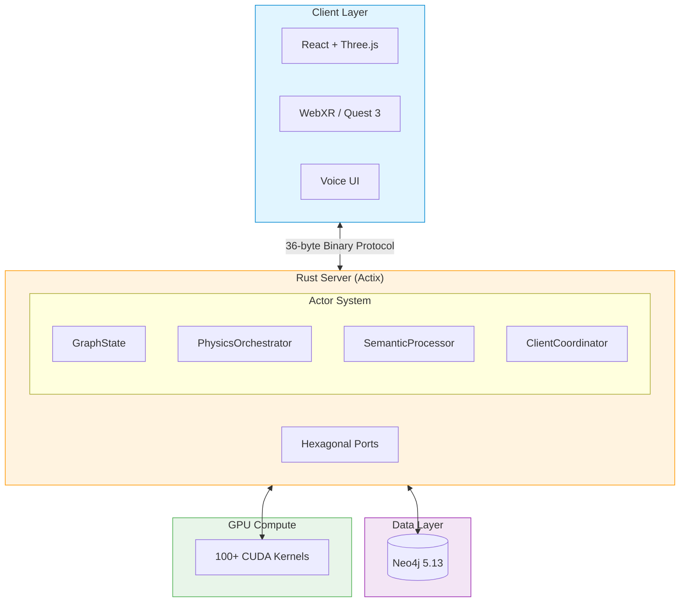

<div align="center">

<picture>
  <source media="(prefers-color-scheme: dark)" srcset="./assets/logo-dark.svg">
  <source media="(prefers-color-scheme: light)" srcset="./assets/logo-light.svg">
  
</picture>

# VisionFlow

### Real-Time 3D Knowledge Graphs with Autonomous AI Agents

[](https://github.com/DreamLab-AI/VisionFlow/actions)
[](https://github.com/DreamLab-AI/VisionFlow/releases)
[](LICENSE)
[](https://www.rust-lang.org/)
[](https://developer.nvidia.com/cuda-toolkit)
[](https://neo4j.com/)

**100,000+ nodes at 60 FPS | 55x GPU acceleration | 80% bandwidth reduction**

<br/>


<br/>

[Quick Start](#-quick-start) | [Documentation](docs/) | [Benchmarks](#-performance) | [Roadmap](#-roadmap)

</div>

---

## What is VisionFlow?

VisionFlow transforms static documents into **living knowledge ecosystems**. Deploy autonomous AI agents that continuously analyse your data, discovering connections while you explore results in an **immersive 3D space** with your team.

```
Your Data --> AI Agent Teams --> Knowledge Graph --> 3D Visualisation --> Team Collaboration
```

### Why Choose VisionFlow?

| Feature | VisionFlow | Traditional Tools |
|:--------|:-----------|:------------------|
| **Performance** | 60 FPS @ 100K nodes (GPU) | 4-15 FPS (CPU only) |
| **Latency** | 10ms WebSocket updates | 50-100ms+ |
| **Privacy** | Self-hosted, your infrastructure | Third-party APIs |
| **Collaboration** | Real-time multi-user 3D | Single-user text output |
| **Intelligence** | Autonomous 24/7 AI agents | Reactive query-based |
| **Auditability** | Git version control | No transparency |

---

## Quick Start

**Deploy in under 60 seconds:**

```bash
git clone https://github.com/DreamLab-AI/VisionFlow.git
cd VisionFlow && cp .env.example .env
docker-compose --profile dev up -d
```

**Access your instance:**

| Service | URL | Description |
|:--------|:----|:------------|
| Frontend | http://localhost:3001 | 3D visualisation interface |
| Neo4j Browser | http://localhost:7474 | Graph database explorer |
| API | http://localhost:4000/api | REST & WebSocket endpoints |

**Your AI agents begin analysing data immediately.**

<details>
<summary><strong>Native Installation (Rust + CUDA)</strong></summary>

```bash
# Prerequisites
curl --proto '=https' --tlsv1.2 -sSf https://sh.rustup.rs | sh
# Install CUDA 12.4: https://developer.nvidia.com/cuda-downloads

# Build and run
git clone https://github.com/DreamLab-AI/VisionFlow.git
cd VisionFlow && cp .env.example .env
cargo build --release --features gpu
cd client && npm install && npm run build && cd ..
./target/release/webxr
```

</details>

---

## Key Features

<table>
<tr>
<td width="33%" valign="top">

### GPU-Accelerated Physics
- **100+ CUDA kernels** across 13 modules
- **55x faster** than CPU physics
- **100K+ nodes** at 60 FPS
- Force-directed layouts in real-time

</td>
<td width="33%" valign="top">

### Autonomous AI Agents
- **50+ concurrent agents** with specialised roles
- **Microsoft GraphRAG** integration
- **Multi-hop reasoning** across domains
- Continuous 24/7 knowledge discovery

</td>
<td width="33%" valign="top">

### Ontology Intelligence
- **OWL 2 EL reasoning** via Whelk-rs
- **10-100x faster** inference
- Semantic physics for meaningful layouts
- Automatic contradiction detection

</td>
</tr>
<tr>
<td valign="top">

### Binary Protocol V2
- **36-byte messages** (80% smaller than JSON)
- **6.9x lower latency** end-to-end
- Sub-10ms WebSocket updates
- Zero-copy serialisation

</td>
<td valign="top">

### Real-Time Collaboration
- **Multi-user synchronisation**
- Independent camera controls
- Voice-to-voice AI interaction
- Spatial audio via WebRTC

</td>
<td valign="top">

### Immersive XR
- **Meta Quest 3** support (Beta)
- Hand tracking & controllers
- Force-directed 3D physics
- Vircadia integration (planned)

</td>
</tr>
</table>

---

## Performance

### Benchmarks (AMD Ryzen 9 5950X + RTX 4080)

| Metric | Result | Notes |
|:-------|-------:|:------|
| **Max Nodes @ 60 FPS** | 180,000 | GPU-accelerated physics |
| **Max Nodes @ 30 FPS** | 450,000 | Instanced rendering |
| **Physics Speedup** | **55x** | GPU vs multi-threaded CPU |
| **WebSocket Latency** | **10ms** | Binary protocol V2 |
| **Bandwidth Reduction** | **80%** | 3.6 MB vs 18 MB per frame |
| **Concurrent Users** | 250+ | Stress-tested 48 hours |

### GPU vs CPU Physics (100K nodes, 200K edges)

| Operation | GPU (CUDA) | CPU | Speedup |
|:----------|----------:|----:|--------:|
| Force Calculation | 2.3ms | 145ms | **63x** |
| Position Update | 0.4ms | 12ms | **30x** |
| Collision Detection | 1.8ms | 89ms | **49x** |
| **Total Frame** | **4.5ms** | **246ms** | **55x** |

<details>
<summary><strong>View Detailed Benchmarks</strong></summary>

### Scalability by Graph Size

| Nodes | Edges | Frame Time | FPS | GPU Memory |
|------:|------:|-----------:|----:|-----------:|
| 1K | 2K | 0.08ms | 12,500 | 4 MB |
| 10K | 20K | 0.5ms | 2,000 | 40 MB |
| 100K | 200K | 4.5ms | 222 | 400 MB |
| 500K | 1M | 18ms | 56 | 2 GB |
| 1M | 2M | 35ms | 29 | 4 GB |

### Comparison with Alternatives (100K nodes)

| Solution | FPS | Latency | Bandwidth | GPU Memory |
|:---------|----:|--------:|----------:|-----------:|
| **VisionFlow** | **60** | **10ms** | **3.6 MB** | **400 MB** |
| Neo4j Bloom | 25 | 45ms | 18 MB | 1.2 GB |
| GraphXR | 35 | 28ms | 8 MB | 650 MB |
| Gephi | 8 | N/A | N/A | N/A |
| Cytoscape | 12 | N/A | N/A | N/A |

**Full benchmarks:** [docs/reference/performance-benchmarks.md](docs/reference/performance-benchmarks.md)

</details>

---

## Architecture



### Core Design Principles

| Principle | Implementation |
|:----------|:---------------|
| **Server-Authoritative** | Neo4j is the single source of truth |
| **Binary Protocol** | 36-byte WebSocket messages (80% bandwidth reduction) |
| **GPU Offloading** | Physics, clustering, pathfinding accelerated 55x |
| **Actor System** | 21 specialised actors for state, physics, semantics |
| **Event-Driven** | Domain events with pub/sub for loose coupling |

**Deep Dive:** [Architecture Overview](docs/architecture/overview.md) | [Hexagonal CQRS](docs/architecture/patterns/hexagonal-cqrs.md) | [Actor System](docs/guides/graphserviceactor-migration.md)

---

## Technology Stack

| Layer | Technology |
|:------|:-----------|
| **Backend** | Rust 1.75+, Actix-web 4.11, Hexagonal Architecture |
| **Database** | Neo4j 5.13 (neo4rs) |
| **GPU Compute** | CUDA 12.4, cudarc, cust (100+ kernels) |
| **Reasoning** | OWL 2 EL, Whelk-rs, horned-owl |
| **Frontend** | React 18, Three.js (React Three Fiber), TypeScript |
| **XR** | Babylon.js, WebXR, Meta Quest 3 |
| **AI** | MCP Protocol, Claude, Microsoft GraphRAG |
| **Networking** | Binary WebSocket, QUIC/WebTransport (quinn) |

---

## Use Cases

### Research Teams
- **Literature review automation** - AI agents continuously analyse papers, surface connections
- **Ontology development** - OWL reasoning validates knowledge structures
- **Collaborative exploration** - Multi-user 3D navigation of research landscapes

### Enterprise Knowledge Management
- **Corporate knowledge graphs** - Integrate documents, wikis, databases
- **AI-assisted discovery** - Find hidden relationships across silos
- **Audit compliance** - Git-versioned changes with full provenance

### AI/ML Pipelines
- **GraphRAG integration** - Enhance LLM context with structured knowledge
- **Training data curation** - Visual exploration of dataset relationships
- **Model interpretability** - Visualise attention patterns and embeddings

### Healthcare & Life Sciences
- **SNOMED CT / Gene Ontology** - Whelk-rs handles 354K+ class ontologies
- **Clinical decision support** - Real-time reasoning over medical knowledge
- **Drug discovery** - Visualise compound-target-pathway relationships

---

## Documentation

VisionFlow uses the [Diataxis framework](https://diataxis.fr/) for organised documentation:

| Type | Purpose | Start Here |
|:-----|:--------|:-----------|
| **Tutorials** | Learning-oriented | [Installation](docs/getting-started/installation.md), [First Graph](docs/getting-started/first-graph.md) |
| **How-To Guides** | Task-oriented | [Agent Orchestration](docs/guides/agent-orchestration.md), [XR Setup](docs/guides/vircadia-xr-complete-guide.md) |
| **Explanations** | Understanding-oriented | [Architecture](docs/architecture/overview.md), [Semantic Physics](docs/explanations/architecture/semantic-physics-system.md) |
| **Reference** | Information-oriented | [REST API](docs/reference/api/rest-api-reference.md), [WebSocket Protocol](docs/reference/websocket-protocol.md) |

**Complete Documentation:** [docs/](docs/)

---

## Roadmap

### Current (v2.0)
- [x] Modular actor architecture (21 actors)
- [x] Neo4j as primary database
- [x] Binary WebSocket protocol V2 (36 bytes)
- [x] 100+ CUDA kernels (55x speedup)
- [x] OWL 2 EL reasoning with Whelk-rs
- [x] Meta Quest 3 WebXR (Beta)

### In Progress (v2.1)
- [ ] Vircadia multi-user integration
- [ ] SPARQL query interface
- [ ] Distributed GPU compute
- [ ] Nostr identity integration

### Future (v3.0+)
- [ ] Apple Vision Pro native app
- [ ] Federated ontologies
- [ ] Kubernetes operator
- [ ] W3C DID for agents

**Detailed Roadmap:** [See full roadmap with quarterly sprints](#roadmap)

---

## Contributing

We welcome contributions! See our [Contributing Guide](docs/CONTRIBUTING.md).

```bash
# Fork and clone
git clone https://github.com/YOUR_USERNAME/VisionFlow.git
cd VisionFlow

# Setup
cargo build && cd client && npm install && cd ..

# Test
cargo test && npm test

# Submit PR
```

**Contribution Areas:** Bug Fixes | Documentation | Features | Performance | Testing

---

## System Requirements

| Tier | CPU | RAM | GPU | Use Case |
|:-----|:----|:----|:----|:---------|
| **Minimum** | 4-core 2.5GHz | 8 GB | Integrated | Development, < 10K nodes |
| **Recommended** | 8-core 3.0GHz | 16 GB | GTX 1060 / RX 580 | Production, < 50K nodes |
| **Enterprise** | 16+ cores | 32 GB+ | RTX 4080+ (16GB VRAM) | 100K+ nodes, multi-user |

**Platform Support:** Linux (full), macOS (CPU-only), Windows (WSL2), Meta Quest 3 (Beta)

---

## Acknowledgements

Built on the work of:
- [3d-force-graph](https://github.com/vasturiano/3d-force-graph) - Force-directed visualisation
- [graph_RAG](https://github.com/nemegrod/graph_RAG) - Natural language queries
- [JavaScriptSolidServer](https://github.com/JavaScriptSolidServer/JavaScriptSolidServer) - Solid Protocol (AGPL-3.0)

Special thanks to **Prof. Rob Aspin** for research in immersive knowledge visualisation.

---

## License

**Mozilla Public License 2.0** - Use commercially, modify freely, share changes to MPL files.

[Full License](LICENSE)

---

<div align="center">

**Transform how you discover knowledge.**

```bash
git clone https://github.com/DreamLab-AI/VisionFlow.git && cd VisionFlow && docker-compose --profile dev up -d
```

[Documentation](docs/) | [Issues](https://github.com/DreamLab-AI/VisionFlow/issues) | [Discussions](https://github.com/DreamLab-AI/VisionFlow/discussions)

[](https://github.com/DreamLab-AI/VisionFlow)
[](https://github.com/DreamLab-AI/VisionFlow/fork)

**Built by the VisionFlow Team**

</div>
