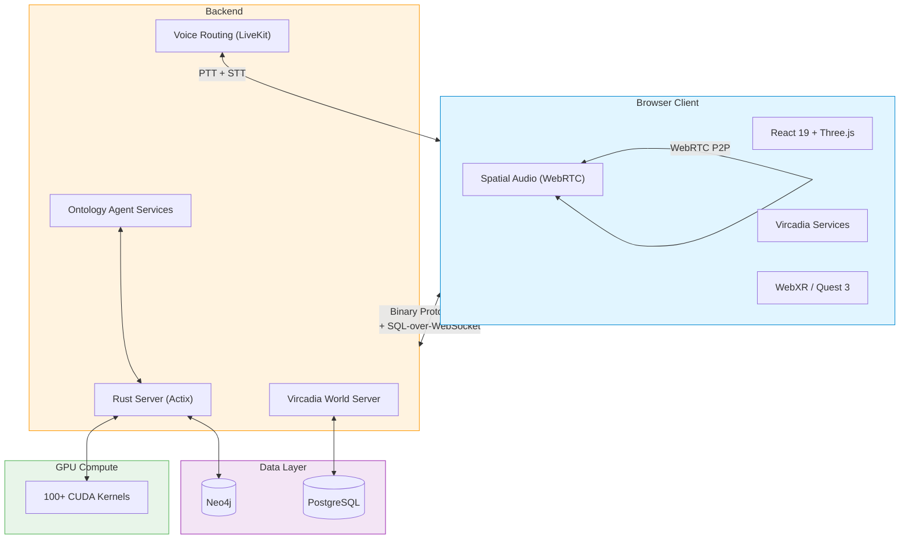

<div align="center">

<picture>
  <source media="(prefers-color-scheme: dark)" srcset="./assets/logo-dark.svg">
  <source media="(prefers-color-scheme: light)" srcset="./assets/logo-light.svg">
  
</picture>

# VisionFlow

### Real-Time 3D Knowledge Graphs with Autonomous AI Agents

[](https://github.com/DreamLab-AI/VisionFlow/actions)
[](https://github.com/DreamLab-AI/VisionFlow/releases)
[](LICENSE)
[](https://www.rust-lang.org/)
[](https://developer.nvidia.com/cuda-toolkit)

**100,000+ nodes at 60 FPS | 55x GPU acceleration | Multi-user immersive XR**

<br/>


<br/>

[Quick Start](#quick-start) | [Architecture](#architecture) | [Documentation](#documentation) | [Contributing](#contributing)

</div>

---

## Overview

VisionFlow transforms static documents into living knowledge ecosystems. Deploy autonomous AI agents that continuously analyse your data, discover connections, and present results in an immersive 3D space with real-time multi-user collaboration.

| Capability | Detail |
|:-----------|:-------|
| **GPU Physics** | 100+ CUDA kernels, 55x faster than CPU, 100K+ nodes at 60 FPS |
| **Multi-User XR** | Vircadia World Server integration with avatar sync, spatial audio, and collaborative graph editing |
| **Binary Protocol** | 21-byte position updates (80% bandwidth reduction vs JSON) |
| **Ontology Reasoning** | OWL 2 EL via Whelk-rs for semantic physics and contradiction detection |
| **AI Agents** | 50+ concurrent agents with Microsoft GraphRAG integration |
| **XR Support** | Meta Quest 3 with hand tracking, foveated rendering, and dynamic resolution |
| **Voice Routing** | Multi-user push-to-talk with LiveKit SFU, turbo-whisper STT, Opus codec |
| **Ontology Agents** | Agent read/write tools with Whelk consistency, GitHub PR feedback loop, MCP integration |

---

## Quick Start

```bash
git clone https://github.com/DreamLab-AI/VisionFlow.git
cd VisionFlow && cp .env.example .env
docker-compose --profile dev up -d
```

| Service | URL | Description |
|:--------|:----|:------------|
| Frontend | http://localhost:3001 | 3D knowledge graph interface |
| Vircadia Server | ws://localhost:3020/world/ws | Multi-user WebSocket endpoint |
| Neo4j Browser | http://localhost:7474 | Graph database explorer |
| API | http://localhost:4000/api | REST and WebSocket endpoints |

To enable the Vircadia multi-user experience:

```bash
docker-compose -f docker-compose.yml -f docker-compose.vircadia.yml --profile dev up -d
```

<details>
<summary><strong>Native Installation (Rust + CUDA)</strong></summary>

```bash
curl --proto '=https' --tlsv1.2 -sSf https://sh.rustup.rs | sh
git clone https://github.com/DreamLab-AI/VisionFlow.git
cd VisionFlow && cp .env.example .env
cargo build --release --features gpu
cd client && npm install && npm run build && cd ..
./target/release/webxr
```

</details>

---

## Architecture



The client communicates with the Vircadia World Server via WebSocket, using parameterized SQL queries for entity CRUD and a compact binary protocol for high-frequency position and state updates. Spatial audio operates peer-to-peer over WebRTC with HRTF spatialization.

### Client Service Layer

| Service | Responsibility |
|:--------|:---------------|
| **VircadiaClientCore** | WebSocket lifecycle, SQL-over-WS queries, event bus |
| **ThreeJSAvatarRenderer** | GLTF avatar loading, position broadcasting, nameplates |
| **SpatialAudioManager** | WebRTC peer connections, HRTF spatial audio |
| **CollaborativeGraphSync** | Multi-user selections, annotations, presence, conflict resolution |
| **EntitySyncManager** | Bidirectional graph-entity synchronization |
| **NetworkOptimizer** | Delta compression, binary batching, adaptive bandwidth |
| **Quest3Optimizer** | Foveated rendering, dynamic resolution, hand tracking |
| **FeatureFlags** | Runtime feature gating with rollout controls |
| **BinaryWebSocketProtocol** | Binary message encoding/decoding (Protocol V3) |

---

## Technology Stack

| Layer | Technology |
|:------|:-----------|
| **Frontend** | React 19, Three.js 0.182, React Three Fiber, TypeScript 5.9 |
| **XR** | WebXR, @react-three/xr, Meta Quest 3 |
| **Backend** | Rust 1.75+, Actix-web, Hexagonal Architecture |
| **Databases** | Neo4j 5.13, PostgreSQL 15 (Vircadia) |
| **GPU** | CUDA 12.4 (100+ kernels) |
| **Ontology** | OWL 2 EL, Whelk-rs |
| **Networking** | WebSocket (JSON + Binary V3), WebRTC |
| **Audio** | Web Audio API, HRTF PannerNode |
| **Voice** | LiveKit SFU, turbo-whisper STT, Opus codec |
| **Agent Tools** | MCP (Model Context Protocol), 7 ontology tools |
| **CI** | GitHub Actions |
| **Build** | Vite 6, Vitest, Playwright |

---

## Performance

| Metric | Result |
|:-------|-------:|
| Max Nodes at 60 FPS | 180,000 |
| GPU Physics Speedup | 55x |
| WebSocket Latency | 10ms |
| Bandwidth Reduction | 80% |
| Concurrent Users | 250+ |
| Position Update Size | 21 bytes/agent |

---

## Documentation

| Document | Description |
|:---------|:------------|
| [Architecture Overview](docs/architecture.md) | System design, data flow diagrams, service dependencies |
| [API Reference](docs/api-reference.md) | Complete TypeScript interfaces and method signatures |
| [Integration Guide](docs/integration-guide.md) | Step-by-step setup for avatars, audio, collaboration, XR |
| [Security](docs/security.md) | SQL parameterization, authentication, WebRTC security |
| [Ontology Agent Tools](docs/how-to/agents/ontology-agent-tools.md) | Agent read/write tools for ontology data |
| [Voice Routing](docs/how-to/features/voice-routing.md) | Multi-user voice system setup |
| [Full Documentation](docs/README.md) | Complete Diataxis documentation hub |

---

## Development Setup

### Prerequisites

- **Rust** 1.75+ with cargo
- **Node.js** 20+ with npm
- **Docker** and Docker Compose
- **CUDA** 12.4 (optional, for GPU acceleration)

### Build and Test

```bash
# Backend
cargo build --release
cargo test

# Frontend
cd client
npm install
npm run build
npm test

# Lint
cd client && npm run lint
```

### Environment Variables

Copy the example and configure:

```bash
cp .env.example .env
```

Key variables for the Vircadia integration:

| Variable | Description |
|:---------|:------------|
| `VITE_VIRCADIA_ENABLED` | Enable Vircadia features (`true`/`false`) |
| `VITE_VIRCADIA_SERVER_URL` | WebSocket URL for the Vircadia World Server |
| `VITE_VIRCADIA_AUTH_TOKEN` | Authentication token |
| `VITE_VIRCADIA_AUTH_PROVIDER` | Auth provider (`system` or `nostr`) |
| `VITE_VIRCADIA_ENABLE_MULTI_USER` | Enable multi-user mode |
| `VITE_VIRCADIA_ENABLE_SPATIAL_AUDIO` | Enable spatial audio |
| `VITE_QUEST3_ENABLE_HAND_TRACKING` | Enable Quest 3 hand tracking |
| `LIVEKIT_URL` | LiveKit server URL for voice routing |
| `LIVEKIT_API_KEY` | LiveKit API key |
| `LIVEKIT_API_SECRET` | LiveKit API secret |
| `GITHUB_TOKEN` | GitHub token for ontology PR creation |
| `GITHUB_OWNER` | GitHub repository owner for ontology PRs |
| `GITHUB_REPO` | GitHub repository name for ontology PRs |

---

## System Requirements

| Tier | CPU | RAM | GPU | Use Case |
|:-----|:----|:----|:----|:---------|
| **Minimum** | 4-core 2.5GHz | 8 GB | Integrated | Development, < 10K nodes |
| **Recommended** | 8-core 3.0GHz | 16 GB | GTX 1060 / RX 580 | Production, < 50K nodes |
| **Enterprise** | 16+ cores | 32 GB+ | RTX 4080+ (16GB VRAM) | 100K+ nodes, multi-user |

**Platform Support:** Linux (full), macOS (CPU-only), Windows (WSL2), Meta Quest 3 (Beta)

---

## Contributing

See the [Contributing Guide](docs/CONTRIBUTING.md) for development workflow and coding standards.

```bash
git clone https://github.com/YOUR_USERNAME/VisionFlow.git
cd VisionFlow
cargo build && cd client && npm install && cd ..
cargo test && cd client && npm test && cd ..
```

---

## License

[Mozilla Public License 2.0](LICENSE) -- Use commercially, modify freely, share changes to MPL files.

---

<div align="center">

[Documentation](docs/) | [Issues](https://github.com/DreamLab-AI/VisionFlow/issues) | [Discussions](https://github.com/DreamLab-AI/VisionFlow/discussions)

</div>
