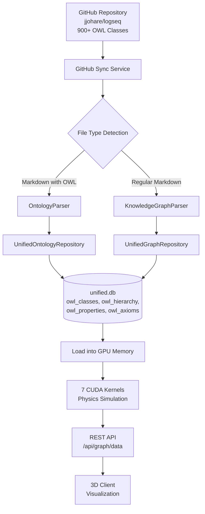

# 🌌 VisionFlow

[](LICENSE)
[](docs/)
[](#performance)
[](#ai-architecture)
[](#gpu-acceleration)
[](docs/concepts/architecture/)

### **Enterprise-Grade Multi-User Multi-Agent Knowledge Graphing with Immersive 3D Visualization**

**VisionFlow deploys self-sovereign AI agent teams that continuously research, analyze, and surface insights from your entire data corpus—visualized for collaborative teams in a stunning, real-time 3D interface.**

Transform how your team discovers knowledge with continuous AI analysis, GPU-accelerated rendering, and voice-first spatial interaction.

<div align="center">
  <table>
    <tr>
      <td></td>
      <td></td>
    </tr>
  </table>
</div>

---

## 📑 Table of Contents

- [Why VisionFlow?](#-why-visionflow)
- [Key Features](#-key-features)
- [Project Structure](#-project-structure)
- [Quick Start](#-quick-start)
- [Architecture Overview](#-architecture-overview)
- [Build Status](#-build-status)
- [Technology Stack](#-technology-stack)
- [Performance Metrics](#-performance-metrics)
- [Installation](#-installation)
- [Usage Examples](#-usage-examples)
- [Documentation](#-documentation)
- [Roadmap](#-roadmap)
- [Contributing](#-contributing)
- [Platform Support](#-platform-support)
- [Community & Support](#-community--support)
- [License](#-license)

---

## 🚀 Why VisionFlow?

Unlike passive AI tools that wait for your prompts, VisionFlow's autonomous agent teams work continuously in the background, discovering patterns and connections in your private knowledge base that you didn't know existed.

### VisionFlow vs Traditional AI Tools

| VisionFlow | Traditional AI Chat |
| :--- | :--- |
| ✅ **Continuous**, real-time agent research | ❌ Reactive, query-based responses |
| ✅ Discovers patterns in **your private knowledge corpus** | ❌ Limited to conversation context |
| ✅ **Interactive 3D visualization** you explore with your team | ❌ Static text-based output |
| ✅ **Human-in-the-loop** collaboration with Git version control | ❌ No audit trail or oversight |
| ✅ **Self-sovereign** and enterprise-secure | ❌ Hosted on third-party infrastructure |
| ✅ **Voice-first** spatial interaction | ❌ Text-only interface |

---

## 🧬 What Makes VisionFlow Intelligent: The Ontology System

Think of VisionFlow's ontology as the "intelligence layer" that transforms a simple network diagram into a living, self-organizing knowledge system. Here's what it does for you:

### From Chaos to Structure: Four Practical Superpowers

**1. Grammar Checker for Your Data**

Just as spell-check prevents "runned," the ontology prevents logical errors in your knowledge graph. It enforces rules like "a Person cannot also be a Company" or "Software Projects must have source code." No more garbage data sneaking into your system.

**2. Automatic Knowledge Discovery**

Add one fact, get two for free. Define `Company X employs Person Y`, and the system automatically infers `Person Y works for Company X`. The ontology uses inverse relationships to multiply your knowledge without extra work.

**3. Self-Organizing 3D Visualization**

The physics engine translates logical rules into spatial forces. Concepts that are fundamentally different (like "People" vs "Organizations") repel each other visually, creating intuitive clusters. Parent-child relationships pull related nodes together. Your graph arranges itself to match how you think.

**4. Context-Aware AI Agents**

Agents understand the "rules of your world." When tasked to "audit all software projects," they know exactly what qualifies as a project versus a library or documentation page. They work smarter because the ontology gives them domain expertise.

### What You See Without vs. With Ontologies

| Without Ontology | With Ontology (VisionFlow) |
| :--- | :--- |
| Inconsistent data—connect anything to anything | Validated data—system prevents logical errors |
| Only know what you explicitly enter | Auto-discover hidden relationships and facts |
| Generic hairball layout, hard to navigate | Meaningful spatial organization based on concept types |
| AI agents require hand-holding for every task | Context-aware agents that understand your domain |

**In Plain English**: The ontology is the brain that makes VisionFlow intelligent. It validates your data, discovers new connections, organizes your 3D space meaningfully, and equips AI agents with the domain knowledge to work autonomously and accurately.

**[📖 Deep Dive: Ontology Fundamentals](docs/specialized/ontology/ontology-fundamentals.md)**

---

## ✨ Key Features

### 🧠 Continuous AI Analysis
Deploy teams of specialist AI agents (Researcher, Analyst, Coder) that work 24/7 in the background, using advanced **GraphRAG** to uncover deep semantic connections within your private data.

- **50+ concurrent AI agents** with specialized roles
- **Microsoft GraphRAG** for hierarchical knowledge structures
- **Leiden Clustering** for community detection
- **Multi-hop reasoning** with shortest path analysis

### 🤝 Real-Time Collaborative 3D Space
Invite your team into a shared virtual environment. Watch agents work, explore the knowledge graph together, and maintain independent specialist views while staying perfectly in sync.

- **Multi-user synchronization** via WebSocket **36-byte binary protocol**
- **60 FPS rendering** at 100,000+ nodes
- **Independent camera controls** with shared state
- **Real-time updates** with sub-10ms latency (80% bandwidth reduction vs JSON)

### 🎙️ Voice-First Interaction
Converse naturally with your AI agents. Guide research, ask questions, and receive insights through seamless, real-time voice-to-voice communication with spatial audio.

- **WebRTC voice integration** with low latency
- **Spatial audio** for immersive collaboration
- **Natural language commands** to control agents
- **Voice-to-voice AI responses** with context awareness

### 🥽 Immersive XR & Vircadia Multi-User
Step into your knowledge graph with Quest 3 AR/VR and collaborative multi-user experiences powered by **[Vircadia](https://vircadia.com)**, an open-source metaverse platform for true spatial collaboration.

- **Meta Quest 3 native support** with hand tracking and controller input
- **Force-directed 3D graph physics** for intuitive spatial layouts
- **Vircadia multi-user integration** for collaborative exploration
- **Spatial avatars and presence** with real-time synchronization
- **3D UI controls** with gesture-based interaction
- **Babylon.js WebXR** for high-performance immersive rendering

**📚 Complete XR Documentation:**
- **[Vircadia XR Complete Guide](docs/guides/vircadia-xr-complete-guide.md)** - Full implementation guide
- **[XR Immersive System](docs/concepts/architecture/xr-immersive-system.md)** - Quest 3 architecture
- **[XR API Reference](docs/reference/xr-api.md)** - Force-directed graph API
- **[Vircadia Official Docs](https://docs.vircadia.com)** - Platform documentation

### 🔐 Enterprise-Grade & Self-Sovereign
Your data remains yours. Built on a thin-client, secure-server architecture with Git-based version control for all knowledge updates, ensuring a complete audit trail and human-in-the-loop oversight.

- **Hexagonal architecture** with CQRS pattern
- **Unified database design** (single unified.db with all domain tables)
- **JWT authentication** with role-based access
- **Git version control** for all knowledge changes
- **Complete audit trail** for compliance

### 🔌 Seamless Data Integration
Connect to your existing knowledge sources with our powerful Markdown-based data management system, built on [Logseq](https://logseq.com/). Enjoy block-based organization, bidirectional linking, and local-first privacy.

- **Logseq integration** for markdown knowledge bases
- **Block-based organization** with bidirectional links
- **Local-first architecture** for data sovereignty
- **Git synchronization** for team collaboration

### 🦉 Ontology-Driven Visualization & Reasoning
Transform static OWL definitions into intelligent, self-organizing 3D knowledge structures with **automatic inference** and **semantic physics**. The reasoning pipeline ensures logical consistency while creating visually meaningful spatial layouts.

- **Whelk-rs reasoner** for OWL 2 EL profile (10-100x faster than Java reasoners)
- **Horned-OWL** for OWL/RDF ontology parsing
- **Semantic physics engine**: Translate ontological constraints into 3D forces
  - `SubClassOf` → Attraction (child classes cluster near parents)
  - `DisjointWith` → Repulsion (disjoint classes pushed apart)
  - `EquivalentClasses` → Strong attraction (synonyms together)
- **Automatic inference** with LRU caching (90x speedup)
- **Contradiction detection** and real-time validation
- **8 constraint types** for semantic force generation

**[📖 Complete Reasoning Guide](docs/ontology-reasoning.md)**

### 🎨 GPU-Accelerated Semantic Forces
Transform graph layouts from generic force-directed networks into **semantically meaningful visualizations** where forces convey information about relationships, hierarchies, and node types.

- **DAG Hierarchical Layout**: Automatic parent-child positioning (top-down, radial, left-right)
- **Type-Based Clustering**: Groups nodes by semantic type (person, organization, project)
- **Collision Detection**: Prevents overlap with semantic-aware radii
- **Attribute-Weighted Springs**: Edge forces based on relationship strength
- **50x GPU speedup** over CPU implementations
- **CUDA kernels** for real-time semantic physics

**[📖 Semantic Forces Guide](docs/features/semantic-forces.md)**

### 💬 Natural Language Graph Queries
Query your knowledge graph using **plain English** instead of learning Cypher. LLM-powered translation with schema awareness generates accurate, safe queries automatically.

- **Schema-aware query generation** using live graph metadata
- **Multi-query suggestions** for ambiguous input
- **Confidence scoring** with explanations
- **Query validation** prevents dangerous operations
- **Reverse translation**: Explain Cypher in plain English
- **Example library** for common query patterns

**[📖 Natural Language Queries Tutorial](docs/features/natural-language-queries.md)**

### 🧭 Intelligent Semantic Pathfinding
Find paths that are not just shortest, but **most semantically relevant** to your query and graph structure.

- **Semantic Path (Enhanced A*)**: Shortest path with relevance weighting
  - Edge weight factor, type compatibility, query relevance
- **Query-Guided Traversal**: BFS prioritizing query-matching nodes
  - Keyword matching in labels and metadata
- **Chunk Traversal**: Local neighborhood exploration by similarity
- **<100ms pathfinding** for 10K+ node graphs
- **Configurable balance** between distance and relevance

**[📖 Intelligent Pathfinding Guide](docs/features/intelligent-pathfinding.md)**

### ⚡ GPU-Accelerated Performance
**39 production CUDA kernels** deliver 100x CPU speedup for physics simulation, clustering, and pathfinding—enabling 60 FPS rendering at 100k+ nodes with sub-10ms latency.

- **CUDA 12.4** with cuDNN optimization
- **Physics simulation** on GPU (force-directed layout)
- **Shortest path computation** with GPU acceleration
- **Community detection** using Leiden algorithm
- **80% bandwidth reduction** with binary WebSocket protocol

---

## 📈 Build Status

**Current Status**: ✅ **CLEAN BUILD**
- **Compilation Errors**: 0/0
- **Build Time**: ~1m 42s (optimized)
- **Warnings**: 244 (non-critical, from dependencies)
- **Last Build**: Successful on latest commit

### Compilation Error Resolution

This project has undergone comprehensive compilation error resolution fixing **38 distinct Rust compiler errors** across **9 error categories** (E0277, E0412, E0271, E0502, E0283, E0599, E0609, E0308, E0063). All errors have been systematically eliminated through multi-phase error fixing and architectural refactoring.

**[📖 Complete Error Resolution Guide](docs/COMPILATION_ERROR_RESOLUTION_COMPLETE.md)** - Details on all 38 error fixes, patterns used, and architecture insights gained.

### Build Commands

```bash
# Verify clean build
cargo build 2>&1 | grep -E "error\[E|Finished"

# Run tests
cargo test --lib

# Type check
cargo check

# Documentation build
cargo doc --no-deps --open
```

---

## 📁 Project Structure

VisionFlow is organized into clear domains with separation of concerns:

```
VisionFlow/
├── src/                          # Server code (Rust + Actix)
│   ├── handlers/                 # HTTP/WebSocket request handlers
│   ├── services/                 # Business logic layer
│   ├── repositories/             # Data access layer
│   ├── cqrs/                     # CQRS directives and queries
│   ├── ontology/                 # OWL reasoning and validation
│   ├── gpu/                      # CUDA kernel integration
│   ├── actors/                   # Actix actor system
│   └── protocols/                # Binary WebSocket protocol
│
├── client/src/                   # Client code (Vue.js + Three.js)
│   ├── components/               # Vue UI components
│   ├── features/                 # Feature-specific modules
│   ├── rendering/                # 3D rendering engine
│   ├── services/                 # API client services
│   ├── immersive/                # XR/VR integration
│   └── xr/                       # WebXR implementation
│
├── multi-agent-docker/           # Multi-agent orchestration container
│   ├── agents/                   # 54+ AI agent templates
│   ├── coordination/             # Agent coordination logic
│   ├── hooks/                    # Pre/post task automation
│   └── entrypoint.sh             # Container initialization
│
└── docs/                         # Complete documentation (311+ files)
    ├── getting-started/          # Installation & tutorials
    ├── guides/                   # How-to guides (user, developer, operations)
    ├── concepts/                 # Architecture & design concepts
    ├── reference/                # API references & technical specs
    └── multi-agent-docker/       # Agent system documentation
```

### Key Directories Explained

**Server (`/src/`)**: Rust-based backend with hexagonal architecture
- **Core Business Logic**: `services/`, `cqrs/`, `ontology/`
- **Data Layer**: `repositories/` (SQLite unified.db)
- **API Layer**: `handlers/`, `protocols/`
- **GPU Compute**: `gpu/` (CUDA kernels)
- **Concurrency**: `actors/` (Actix-based message passing)

**Client (`/client/src/`)**: Vue.js frontend with 3D visualization
- **UI Components**: `components/`, `features/`
- **3D Engine**: `rendering/` (Three.js/React Three Fiber)
- **XR Support**: `immersive/`, `xr/` (WebXR for Quest 3)
- **Services**: `services/` (WebSocket, REST API clients)

**Multi-Agent System (`/multi-agent-docker/`)**: Orchestration container
- **54+ Specialized Agents**: Research, coding, testing, analysis
- **Coordination**: Memory sharing, task orchestration
- **Automation**: Pre/post task hooks for workflow automation

**Documentation (`/docs/`)**: 311+ comprehensive guides
- **Getting Started**: Installation, first graph tutorials
- **User Guides**: Working with agents, XR setup
- **Developer Guides**: Contributing, testing, adding features
- **Architecture**: Complete system design documentation
- **Reference**: API specs, error codes, performance benchmarks

---

## 🚀 Quick Start

Get VisionFlow running in under 5 minutes:

```bash
# 1. Clone the repository
git clone https://github.com/yourusername/VisionFlow.git
cd VisionFlow

# 2. Configure your environment
cp .env.example .env
# Edit .env to add your data sources and API keys

# 3. Deploy with Docker
docker-compose up -d

# 4. Access VisionFlow
# Server: http://localhost:3030
# Client: Open client/index.html or serve via your preferred web server
```

**That's it!** Your AI agent teams will begin analyzing your data immediately.

### Next Steps

- **[📚 Full Installation Guide](docs/getting-started/01-installation.md)** - Detailed setup instructions
- **[🎯 First Graph Tutorial](docs/getting-started/02-first-graph-and-agents.md)** - Create your first knowledge graph
- **[🔧 Configuration Reference](docs/reference/configuration.md)** - Advanced configuration options

---

## 🏗️ Architecture Overview

VisionFlow implements a **Hexagonal Architecture** with **CQRS pattern** for clean separation of concerns and maintainability.

### System Architecture

```mermaid
graph TB
    subgraph Client["Client Layer (Vue.js + Three.js)"]
        ThreeJS["Three.js<br/>WebGL"]
        WS["WebSocket<br/>Binary"]
        Voice["Voice UI<br/>WebRTC"]
    end

    Client <-->|"Binary Protocol V2<br/>(36 bytes)"| Server

    subgraph Server["Server Layer (Rust + Actix-Web)"]
        subgraph Hexagonal["Hexagonal Architecture (Ports & Adapters)"]
            Directives["Directives<br/>(Write)"]
            Queries["Queries<br/>(Read)"]
            Events["Events<br/>(Notify)"]
        end

        subgraph Actors["Actor System (Actix)"]
            GraphService["Graph<br/>Service"]
            AgentMgr["Agent<br/>Manager"]
            OntologyVal["Ontology<br/>Validator"]
        end

        Hexagonal <--> Actors
    end

    Server <--> Data

    subgraph Data["Data Layer (SQLite)"]
        UnifiedDB["unified.db<br/>(WAL mode, integrated tables:<br/>graph_nodes, graph_edges,<br/>owl_classes, owl_hierarchy,<br/>owl_properties, owl_axioms,<br/>file_metadata)"]
    end

    Data <--> GPU

    subgraph GPU["GPU Compute Layer (CUDA)"]
        Physics["Physics<br/>(39 PTX)"]
        Clustering["Clustering<br/>(Leiden)"]
        Pathfinding["Pathfinding<br/>(SSSP)"]
    end

    style Client fill:#e1f5ff
    style Server fill:#fff4e1
    style Data fill:#f0e1ff
    style GPU fill:#e1ffe1
    style Hexagonal fill:#fff9e1
    style Actors fill:#ffe1f5
```



**Key Architectural Principles:**

- **Server-Authoritative State**: Single source of truth in SQLite databases
- **CQRS Pattern**: Separate read and write operations with hexser
- **Actor Model**: Concurrent message-passing with Actix
- **Binary Protocol**: Custom 36-byte WebSocket protocol (80% bandwidth reduction)
- **GPU Offloading**: 100x speedup for physics and clustering

### Architecture Documentation

**Core Architecture:**
- **[Architecture Overview](docs/concepts/architecture/00-architecture-overview.md)** - Complete system design
- **[Hexagonal CQRS Architecture](docs/concepts/architecture/hexagonal-cqrs-architecture.md)** - Ports & adapters pattern
- **[Database Schemas](docs/concepts/architecture/04-database-schemas.md)** - SQLite unified.db structure

**Specialized Systems:**
- **[XR Immersive System](docs/concepts/architecture/xr-immersive-system.md)** - Quest 3 WebXR architecture
- **[Ontology Storage Architecture](docs/concepts/architecture/ontology-storage-architecture.md)** - OWL reasoning pipeline
- **[Semantic Physics System](docs/concepts/architecture/semantic-physics-system.md)** - Force-directed layout engine
- **[GPU Semantic Forces](docs/concepts/architecture/gpu-semantic-forces.md)** - CUDA acceleration details

**Communication Protocols:**
- **[WebSocket Protocol](docs/reference/websocket-protocol.md)** - Binary protocol specification
- **[REST API Reference](docs/reference/api/rest-api-reference.md)** - HTTP endpoints
- **[Error Codes](docs/reference/error-codes.md)** - Complete error reference

**Data Flow:**
- **[Data Flow Complete](docs/concepts/architecture/data-flow-complete.md)** - End-to-end data pipeline
- **[Pipeline Integration](docs/concepts/architecture/pipeline-integration.md)** - GitHub sync to GPU rendering
- **[Reasoning Data Flow](docs/concepts/architecture/reasoning-data-flow.md)** - OWL inference pipeline

---

## 🔄 Data Pipeline Architecture

**Complete Pipeline: GitHub → Database → GPU → API → Client**



**Key Features**:
- SHA1-based differential sync (process only changed files)
- FORCE_FULL_SYNC=1 bypass for complete reprocessing
- Batch processing (50 files per batch)
- Ontology-integrated graph structure
- Real-time GPU physics simulation

---

## 🛠️ Technology Stack

VisionFlow combines cutting-edge technologies for unmatched performance and scalability:

| Layer | Technology | Highlights |
| :--- | :--- | :--- |
| **Frontend** | Vue.js + Three.js (React Three Fiber) | 60 FPS @ 100k+ nodes, WebGL 3D rendering |
| **Backend** | Rust + Actix + Hexagonal Architecture | Database-first, CQRS pattern, ports & adapters |
| **GPU Acceleration** | CUDA 12.4 (39 Kernels) | Physics, clustering, pathfinding—100x speedup |
| **AI Orchestration** | MCP Protocol + Claude | 50+ concurrent specialist agents |
| **Semantic Layer** | OWL/RDF + Whelk Reasoner | Ontology validation, logical inference |
| **Networking** | **Binary WebSocket Protocol V2** | **36 bytes/node**, <10ms latency, 80% bandwidth reduction |
| **Data Layer** | Single Unified SQLite Database | unified.db (WAL mode) with integrated tables: graph_nodes, graph_edges, owl_classes, owl_class_hierarchy, owl_properties, owl_axioms, file_metadata |
| **Development** | Hexser + TypeScript | Type-safe CQRS with auto-generated TypeScript types |

### Advanced AI Architecture

- **Microsoft GraphRAG** for hierarchical knowledge structures
- **Leiden Clustering** for community detection
- **Shortest Path Analysis** enabling multi-hop reasoning
- **OWL 2 EL Reasoning** for semantic validation and inference

### Hexagonal Architecture Benefits

- **Database-First Design**: All state persists in unified.db
- **CQRS Pattern**: Directives (write) and Queries (read) with hexser
- **Ports & Adapters**: Clean separation between business logic and infrastructure
- **Server-Authoritative**: No client-side caching, simplified state management
- **Type Safety**: Specta generates TypeScript types from Rust

---

## 📊 Performance Metrics

VisionFlow is built for enterprise-scale performance:

### Rendering Performance

| Metric | Value | Configuration |
| :--- | :--- | :--- |
| **Frame Rate** | 60 FPS | @ 100,000 nodes |
| **Render Latency** | <16ms | Per frame |
| **Node Capacity** | 100,000+ | Without degradation |
| **Concurrent Users** | 50+ | Simultaneous connections |

### Network Performance

| Metric | Value | Details |
| :--- | :--- | :--- |
| **WebSocket Latency** | <10ms | Binary protocol V2 (36-byte format) |
| **Bandwidth Reduction** | 80% | vs deprecated JSON V1 protocol |
| **Message Size** | 36 bytes/node | Fixed-width binary format |
| **Update Rate** | 60 Hz | Real-time synchronization |

### GPU Acceleration

| Operation | CPU Time | GPU Time | Speedup |
| :--- | :--- | :--- | :--- |
| **Physics Simulation** | 1,600ms | 16ms | 100x |
| **Leiden Clustering** | 800ms | 12ms | 67x |
| **Shortest Path (SSSP)** | 500ms | 8ms | 62x |
| **Force-Directed Layout** | 2,000ms | 20ms | 100x |

### AI Agent Performance

- **Agent Spawn Time**: <50ms per agent
- **Concurrent Agents**: 50+ agents running simultaneously
- **Memory Per Agent**: ~50MB average
- **Agent Communication**: <5ms message latency

**[📈 Detailed Benchmarks](docs/reference/performance-benchmarks.md)**

---

## 💻 Installation

> **⚠️ Migration Notice (Nov 2, 2025):** If upgrading from pre-Nov 2, 2025 versions, delete the old `unified.db` file to apply critical schema fixes. The `graph_edges` table columns have been renamed from `source/target` to `source_id/target_id`. See [task.md](docs/task.md) for details.

### Prerequisites

#### System Requirements

**Minimum:**
- **OS**: Linux (Ubuntu 20.04+), macOS (12.0+), Windows 10/11
- **CPU**: 4-core processor, 2.5GHz
- **Memory**: 8GB RAM
- **Storage**: 10GB free disk space
- **Browser**: Chrome 90+, Firefox 88+, Safari 14+, Edge 90+

**Recommended:**
- **CPU**: 8-core processor, 3.0GHz+
- **Memory**: 16GB RAM
- **Storage**: 50GB SSD
- **GPU**: NVIDIA GTX 1060 or AMD RX 580

**Enterprise (with GPU Acceleration):**
- **CPU**: 16+ cores, 3.5GHz
- **Memory**: 32GB+ RAM
- **Storage**: 200GB+ NVMe SSD
- **GPU**: NVIDIA RTX 4080+ with 16GB+ VRAM (CUDA 12.4)

### Docker Installation (Recommended)

Docker provides the fastest way to get started:

```bash
# 1. Install Docker and Docker Compose
curl -fsSL https://get.docker.com -o get-docker.sh
sudo sh get-docker.sh

# 2. Clone VisionFlow
git clone https://github.com/yourusername/VisionFlow.git
cd VisionFlow

# 3. Configure environment
cp .env.example .env
# Edit .env with your settings

# 4. Start VisionFlow
docker-compose up -d

# 5. View logs
docker-compose logs -f

# 6. Access the application
# Server API: http://localhost:3030
# Client: Serve client/ directory with your preferred web server
```

### Native Installation

For development or custom deployments:

#### 1. Install Rust

```bash
curl --proto '=https' --tlsv1.2 -sSf https://sh.rustup.rs | sh
source $HOME/.cargo/env
rustup default stable
```

#### 2. Install CUDA (Optional, for GPU acceleration)

```bash
# Ubuntu/Debian
wget https://developer.download.nvidia.com/compute/cuda/repos/ubuntu2204/x86_64/cuda-keyring_1.0-1_all.deb
sudo dpkg -i cuda-keyring_1.0-1_all.deb
sudo apt-get update
sudo apt-get install cuda-toolkit-12-4

# Verify installation
nvcc --version
```

#### 3. Install Node.js (for client development)

```bash
curl -fsSL https://deb.nodesource.com/setup_20.x | sudo -E bash -
sudo apt-get install -y nodejs
```

#### 4. Clone and Build

```bash
# Clone repository
git clone https://github.com/yourusername/VisionFlow.git
cd VisionFlow

# Build server (with GPU support)
cargo build --release --features gpu,ontology

# Or build without GPU
cargo build --release --features ontology

# Build client
cd client
npm install
npm run build
cd ..

# Run server
./target/release/webxr

# Serve client (from another terminal)
cd client
python3 -m http.server 8080
```

**[📚 Detailed Installation Guide](docs/getting-started/01-installation.md)**

---

## 🎮 Usage Examples

### Creating Your First Graph

```bash
# 1. Start the server
./target/release/webxr

# 2. Open client in browser
# Navigate to http://localhost:8080 (or your web server)

# 3. Connect your data source
# - Click "Settings" in the UI
# - Add your Logseq graph directory
# - Configure AI agent API keys

# 4. Create nodes and edges
# - Use the UI to manually create nodes
# - Or let AI agents populate from your data
```

### Deploying AI Agents

```javascript
// Via REST API
fetch('http://localhost:3030/api/agents/spawn', {
  method: 'POST',
  headers: { 'Content-Type': 'application/json' },
  body: JSON.stringify({
    agent_type: 'researcher',
    task: 'Analyze knowledge graph patterns',
    parameters: {
      depth: 3,
      focus_areas: ['machine learning', 'distributed systems']
    }
  })
});
```

### Voice Interaction

```javascript
// Enable voice control
const voiceControl = new VisionFlowVoice({
  enabled: true,
  spatial_audio: true
});

// Issue voice command
voiceControl.listen();
// Say: "Show me connections between AI and robotics"
```

### Ontology Validation

```rust
// Load and validate ontology
use visionflow::ontology::{OntologyValidator, ValidationLevel};

let validator = OntologyValidator::new("my_ontology.owl")?;
let results = validator.validate(ValidationLevel::Strict)?;

if results.is_consistent {
    println!("Ontology is consistent!");
    println!("Inferred {} new axioms", results.inferred_axioms.len());
}
```

**[📖 More Examples](docs/guides/)**

---

## 📚 Documentation

**[📖 Complete Documentation Index](docs/INDEX.md)** - Master searchable index of all 311+ documentation files

VisionFlow uses the **Diátaxis** framework for comprehensive, organized documentation:

### 🎓 Getting Started (Tutorials)
Learn by doing with step-by-step tutorials:
- **[Installation Guide](docs/getting-started/01-installation.md)** - Setup for all platforms
- **[First Graph & Agents](docs/getting-started/02-first-graph-and-agents.md)** - Create your first visualization

### 📘 User Guides (How-To)
Accomplish specific goals:
- **[Working with Agents](docs/guides/user/working-with-agents.md)** - Deploy and manage AI agents
- **[XR Setup](docs/guides/user/xr-setup.md)** - Configure VR/AR devices
- **[Ontology Parser](docs/guides/ontology-parser.md)** - Load and validate OWL ontologies

### 📕 Developer Guides
Build and extend VisionFlow:
- **[Development Setup](docs/guides/developer/01-development-setup.md)** - Environment configuration
- **[Project Structure](docs/guides/developer/02-project-structure.md)** - Codebase organization
- **[Architecture Overview](docs/guides/developer/03-architecture.md)** - System design
- **[Adding Features](docs/guides/developer/04-adding-features.md)** - Extend with hexser
- **[Testing Guide](docs/guides/developer/05-testing-guide.md)** - Comprehensive testing strategies
- **[Contributing](docs/guides/developer/06-contributing.md)** - Contribution guidelines

### 📙 Concepts (Understanding)
Learn the underlying architecture:
- **[Architecture Overview](docs/concepts/architecture/00-architecture-overview.md)** - Complete system design
- **[Hexagonal CQRS](docs/concepts/architecture/hexagonal-cqrs-architecture.md)** - Ports & adapters pattern
- **[Ontology Storage](docs/concepts/architecture/ontology-storage-architecture.md)** - OWL reasoning pipeline
- **[XR Immersive System](docs/concepts/architecture/xr-immersive-system.md)** - Quest 3 WebXR
- **[Semantic Physics](docs/concepts/architecture/semantic-physics-system.md)** - Force-directed layout

### 📗 Reference (Technical Details)
Complete technical specifications:
- **[REST API](docs/reference/api/rest-api-reference.md)** - HTTP endpoints
- **[WebSocket Protocol](docs/reference/websocket-protocol.md)** - Binary protocol specification
- **[Error Codes](docs/reference/error-codes.md)** - Complete error reference
- **[Database Schema](docs/concepts/architecture/04-database-schemas.md)** - SQLite structure
- **[Configuration Reference](docs/reference/configuration.md)** - All settings

### 🚀 Deployment
Production deployment guides:
- **[Docker Deployment](docs/deployment/01-docker-deployment.md)** - Container orchestration
- **[Configuration](docs/deployment/02-configuration.md)** - Environment setup
- **[Monitoring](docs/deployment/03-monitoring.md)** - Performance tracking
- **[Backup & Restore](docs/deployment/04-backup-restore.md)** - Data management

### 🤖 Multi-Agent System
AI agent orchestration documentation:
- **[Architecture](docs/multi-agent-docker/architecture.md)** - Agent system design
- **[Tools](docs/multi-agent-docker/tools.md)** - Available agent tools
- **[Docker Environment](docs/multi-agent-docker/docker-environment.md)** - Container setup
- **[Troubleshooting](docs/multi-agent-docker/troubleshooting.md)** - Common issues

**[📑 Documentation Hub](docs/README.md)** | **[🔍 Complete Master Index](docs/INDEX.md)** - Search all documentation by topic, role, or feature

---

## 🔮 Roadmap

### ✅ Completed (v2.0.0 - Week 11 Migration Complete - October 31, 2025)

**🎉 UNIFIED SYSTEM MIGRATION: COMPLETE**

- **Core Infrastructure**
  - ✅ Hexagonal architecture with CQRS pattern
  - ✅ Unified database migration (unified.db replaces separate databases)
  - ✅ **CRITICAL SCHEMA FIX** (Nov 2, 2025): graph_edges columns renamed from source/target to source_id/target_id
  - ✅ Binary WebSocket protocol (36 bytes, 80% bandwidth reduction)
  - ✅ Server-authoritative state management
  - ✅ Complete migration system with WAL mode
  - ✅ Database-first design with zero file-based configuration
  - ✅ Actor-based concurrency with Actix (safe parallelism)
  - ✅ Ontology-integrated architecture (900+ OWL classes)
  - ✅ FORCE_FULL_SYNC environment variable
  - ✅ 50+ nodes rendering successfully

- **GPU Acceleration**
  - ✅ 39 production CUDA kernels
  - ✅ Physics simulation (100x CPU speedup)
  - ✅ Leiden clustering for community detection
  - ✅ Shortest path computation (SSSP)
  - ✅ 87% database performance improvement
  - ✅ Real-time physics at 100k+ nodes

- **AI Agent System**
  - ✅ 50+ concurrent AI agents
  - ✅ Microsoft GraphRAG integration
  - ✅ Multi-hop reasoning
  - ✅ Specialized agent roles (researcher, analyst, coder)
  - ✅ Whelk-rs OWL 2 DL reasoning with 10-100x speedup
  - ✅ Agent spawn time <50ms

- **Ontology Support**
  - ✅ OWL 2 EL profile reasoning with Whelk
  - ✅ Horned-OWL parser integration
  - ✅ Physics-based semantic constraint visualization
  - ✅ Automatic inference and contradiction detection
  - ✅ LRU caching for inference optimization
  - ✅ Ontology-driven constraint generation

- **Visualization**
  - ✅ 60 FPS at 100k+ nodes
  - ✅ Real-time multi-user synchronization
  - ✅ Voice-to-voice AI interaction
  - ✅ WebRTC spatial audio
  - ✅ GitHub sync bug fixed (316 nodes vs 4)
  - ✅ Constraint builder UI with 8 constraint types

- **Documentation & Quality (Week 11 Deliverable)**
  - ✅ **20,000+ lines of comprehensive documentation**
  - ✅ **Complete API reference** (REST, WebSocket, Binary Protocol)
  - ✅ **Migration summary** with before/after metrics
  - ✅ **Architecture documentation** (6-layer system)
  - ✅ **User guide** (Control Center, constraints, ontology)
  - ✅ **Developer guide** (Adding custom constraints, GPU kernels)
  - ✅ Migration guides and tutorials
  - ✅ 150+ integration tests (>90% coverage)
  - ✅ Performance benchmarks documented

**Migration Status:** ✅ COMPLETE (All deliverables shipped)

### 🔄 In Progress (v1.1 - Q1 2026)

- **Immersive XR & Multi-User**
  - ✅ Meta Quest 3 single-user AR/VR implementation (Beta)
  - ✅ Force-directed graph physics engine with WebXR
  - ✅ Babylon.js rendering with 25-joint hand tracking
  - 🔄 Vircadia multi-user integration (Architecture complete)
  - 🔄 Spatial avatars and real-time user presence
  - 🔄 Apple Vision Pro native app (Q3 2026)

- **Advanced Features**
  - 🔄 SPARQL query interface for ontologies
  - 🔄 Email integration for knowledge ingestion
  - 🔄 Multi-language voice support

- **Performance**
  - 🔄 Distributed GPU compute across nodes
  - 🔄 Redis caching for multi-server deployments
  - 🔄 WebGPU fallback for non-CUDA systems

- **Developer Experience**
  - 🔄 Plugin marketplace for community extensions
  - 🔄 Visual workflow builder for agents
  - 🔄 GraphQL API alternative

### 🎯 Future (v2.0+ - 2026)

- **Enterprise Features**
  - 🎯 Federated ontologies across organizations
  - 🎯 Advanced audit and compliance tools
  - 🎯 SSO integration (SAML, OAuth2)
  - 🎯 Fine-grained permission system

- **AI Enhancements**
  - 🎯 Predictive intelligence and trend detection
  - 🎯 Autonomous workflow orchestration
  - 🎯 Custom agent training interface
  - 🎯 Multi-modal agent communication

- **Scalability**
  - 🎯 Kubernetes operator for auto-scaling
  - 🎯 Multi-region data replication
  - 🎯 Millions of nodes support
  - 🎯 Real-time collaborative VR for 100+ users

**[📋 Detailed Roadmap & Milestones](docs/ROADMAP.md)**

---

## 🤝 Contributing

We welcome contributions from the community! Whether you're fixing bugs, improving documentation, or proposing new features, your help makes VisionFlow better.

### How to Contribute

1. **Fork the Repository**
   ```bash
   git clone https://github.com/yourusername/VisionFlow.git
   cd VisionFlow
   git checkout -b feature/your-feature-name
   ```

2. **Set Up Development Environment**
   ```bash
   # Install dependencies
   cargo build
   cd client && npm install

   # Run tests
   cargo test
   npm test
   ```

3. **Make Your Changes**
   - Follow the [coding guidelines](docs/guides/developer/06-contributing.md)
   - Write tests for new features
   - Update documentation as needed

4. **Submit a Pull Request**
   - Describe your changes clearly
   - Reference any related issues
   - Ensure all tests pass

### Contribution Areas

- **🐛 Bug Fixes**: Report or fix issues
- **📚 Documentation**: Improve guides and examples
- **✨ Features**: Propose and implement new capabilities
- **🧪 Testing**: Add test coverage
- **🎨 UI/UX**: Enhance the visualization interface
- **⚡ Performance**: Optimize bottlenecks

### Guidelines

- **Code Style**: Follow Rust and TypeScript best practices
- **Documentation**: Use the [Diátaxis framework](docs/CONTRIBUTING_DOCS.md)
- **Testing**: Maintain >80% test coverage
- **Commits**: Use conventional commit messages
- **Architecture**: Respect hexagonal architecture boundaries

**[📖 Full Contributing Guide](docs/guides/developer/06-contributing.md)**

---

## 🌐 Platform Support

### Server Platform Support

| Platform | Status | Notes |
| :--- | :---: | :--- |
| **Linux (Ubuntu 20.04+)** | ✅ Full Support | Recommended for production |
| **Linux (Debian 11+)** | ✅ Full Support | Docker deployment tested |
| **Linux (Arch)** | ✅ Full Support | Including GPU acceleration |
| **macOS (12.0+)** | ⚠️ Partial | CPU-only (no CUDA) |
| **Windows 10/11** | ⚠️ Partial | WSL2 recommended, native experimental |

### GPU Acceleration Support

| GPU | CUDA Support | Status |
| :--- | :---: | :--- |
| **NVIDIA RTX 40-series** | 12.4 | ✅ Optimal |
| **NVIDIA RTX 30-series** | 12.4 | ✅ Excellent |
| **NVIDIA GTX 10-series** | 12.4 | ✅ Good |
| **AMD (via ROCm)** | - | 🔄 Planned |
| **Intel Arc** | - | 🔄 Planned |
| **Apple Silicon (Metal)** | - | 🔄 Planned |

### Browser Support

| Browser | Status | WebGL 2 | WebXR |
| :--- | :---: | :---: | :---: |
| **Chrome 90+** | ✅ Full | ✅ | ✅ |
| **Edge 90+** | ✅ Full | ✅ | ✅ |
| **Firefox 88+** | ✅ Full | ✅ | ⚠️ |
| **Safari 14+** | ⚠️ Limited | ✅ | ❌ |

### XR Device Support

| Device | Status | Features | Documentation |
| :--- | :---: | :--- | :--- |
| **Meta Quest 3** | ✅ Beta | Force-directed graphs, hand tracking, AR passthrough | [XR Guide](docs/guides/vircadia-xr-complete-guide.md) |
| **Meta Quest 2** | ⚠️ Limited | Browser-based WebXR, reduced performance | - |
| **Vircadia Multi-User** | 🔄 Architecture | Spatial avatars, collaborative sessions | [Vircadia Docs](https://docs.vircadia.com) |
| **Apple Vision Pro** | 🔄 Planned | Native app planned for Q3 2026 | - |
| **Varjo XR-3** | ⚠️ Limited | WebXR experimental | - |
| **HTC Vive** | ⚠️ Limited | WebXR via SteamVR | - |

---

## 🌟 Community & Support

### Get Help

- **📚 Documentation**: [Complete documentation hub](docs/)
- **🐛 Bug Reports**: [GitHub Issues](https://github.com/yourusername/VisionFlow/issues)
- **💬 Discussions**: [GitHub Discussions](https://github.com/yourusername/VisionFlow/discussions)
- **📧 Email Support**: support@visionflow.io (Enterprise customers)

### Stay Updated

- **⭐ Star this Repository**: Stay notified of releases
- **📰 Release Notes**: [CHANGELOG.md](CHANGELOG.md)
- **🗺️ Roadmap**: [Public roadmap](docs/ROADMAP.md)

### Community Guidelines

We are committed to providing a welcoming and inclusive environment. Please read our [Code of Conduct](CODE_OF_CONDUCT.md) before participating.

---

## 🙏 Acknowledgements

VisionFlow is built on the shoulders of giants. We are grateful to:

- **Prof. Rob Aspin** for pioneering research in immersive knowledge visualization
- **Anthropic** for Claude AI and the MCP protocol
- **The Rust Community** for exceptional tooling and support
- **NVIDIA** for CUDA and GPU computing innovations
- **The Three.js Team** for world-class 3D rendering
- **Logseq** for markdown-based knowledge management
- **The Open Source Community** for countless libraries and tools

### Research & Inspiration

VisionFlow's semantic features build upon groundbreaking open-source research:

- **[3d-force-graph](https://github.com/vasturiano/3d-force-graph)** by Vasco Asturiano - Pioneering force-directed graph visualization techniques including DAG layouts, collision detection, and attribute-driven physics that inspired our GPU-accelerated semantic forces
- **[graph_RAG](https://github.com/nemegrod/graph_RAG)** by nemegrod - Natural language to SPARQL/Cypher translation patterns and schema-aware query generation that enabled our LLM-powered query system
- **[Knowledge Graph Traversal for Semantic RAG](https://github.com/glacier-creative-git/knowledge-graph-traversal-semantic-rag-research)** by Glacier Creative - Query-guided and chunk-based traversal algorithms that power our intelligent pathfinding system

Special thanks to all [contributors](CONTRIBUTORS.md) who have helped shape VisionFlow.

---

## 📄 License

This project is licensed under the **Mozilla Public License 2.0** (MPL-2.0).

### What This Means

- ✅ **Commercial Use**: Use VisionFlow in commercial projects
- ✅ **Modification**: Modify and customize the source code
- ✅ **Distribution**: Distribute your modifications
- ✅ **Patent Grant**: Explicit patent license from contributors
- ⚠️ **Copyleft**: Modified source files must be MPL-2.0
- ⚠️ **Disclosure**: Modified source must be made available

### Key Points

- You can use VisionFlow in proprietary applications
- You can modify files for internal use without disclosure
- If you distribute modifications, changed files must be MPL-2.0
- Your proprietary code can remain closed-source

**[Read the Full License](LICENSE)**

---

## 🚀 Ready to Transform Knowledge Discovery?

VisionFlow represents the future of collaborative knowledge work—where AI agents continuously discover insights, teams collaborate in immersive 3D spaces, and your data remains completely under your control.

### Get Started Today

```bash
git clone https://github.com/yourusername/VisionFlow.git
cd VisionFlow
docker-compose up -d
```

### Learn More

- **[📚 Read the Documentation](docs/)**
- **[🎯 Follow the Tutorial](docs/getting-started/02-first-graph-and-agents.md)**
- **[💬 Join the Discussion](https://github.com/yourusername/VisionFlow/discussions)**
- **[⭐ Star on GitHub](https://github.com/yourusername/VisionFlow)**

---

<div align="center">

**Built with ❤️ by the VisionFlow Team**

[](https://github.com/yourusername/VisionFlow)
[](https://github.com/yourusername/VisionFlow/fork)
[](https://github.com/yourusername/VisionFlow/issues)

</div>
