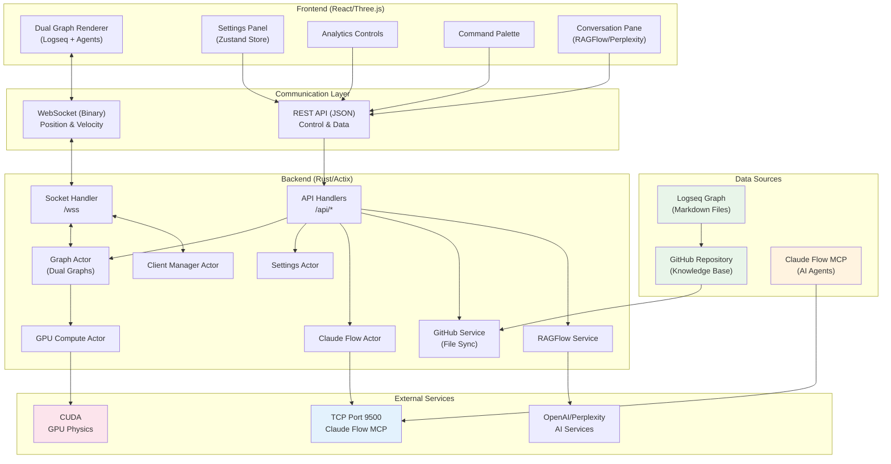
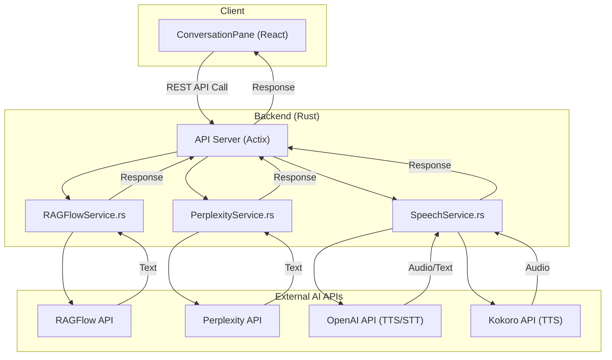

# VisionFlow: AI Agent Swarm Visualisation & Knowledge Graph Explorer


**Real-time 3D visualisation of AI agent swarms working alongside your Logseq knowledge graph.**

[](LICENSE)
[](docker-compose.yml)
[](#gpu-acceleration)

**Inspired by the innovative work of Prof. Rob Aspin:** [https://github.com/trebornipsa](https://github.com/trebornipsa)


---

## 🚀 Quick Start

```bash
# Clone and deploy in minutes
git clone <repository-url>
cd ext

# Configure environment
cp .env.example .env

# Deploy with Docker
docker-compose up -d

# Access the application
open http://localhost:3001
```

**[📚 Full Quick Start Guide](docs/quick-start-swarm.md)** - Spawn your first AI swarm in 5 minutes!

---

## 🎯 Project Overview

VisionFlow is a groundbreaking platform that bridges the gap between knowledge management and AI agent orchestration. Built entirely through AI-driven development, this project showcases the power of conversational coding and demonstrates what's possible when artificial intelligence becomes your co-developer.

### 🤖 AI-Driven Development Story

This entire codebase—from the Rust backend with Actix to the TypeScript frontend with React and Three.js—was generated through an iterative, conversational process with AI agents. This AI-first approach has shaped not only how the project was built but also the documentation and diagrams you see here.

The workflow allowed for rapid prototyping, complex feature implementation, and exploration of technologies that would typically be beyond the reach of a solo, non-developer founder.

---

## ✨ Key Features

### 🌟 AI Agent Swarm Visualisation
- **Real-time Hive Mind Display**: Watch AI agents collaborate in stunning 3D
- **Claude Flow Integration**: Full MCP (Model Context Protocol) support for agent orchestration
- **GPU-Accelerated Physics**: Smooth 60 FPS visualisation of 200+ agents
- **Interactive Control**: Spawn, configure, and command agent swarms in real-time
- **12 Specialist Agent Types**: Queen, Coordinator, Researcher, Coder, Analyst, and more

### 📊 Dual Graph Architecture
- **Parallel Visualisation**: View Logseq knowledge graphs and AI agent swarms simultaneously
- **Independent Physics**: Each graph has its own optimised physics engine
- **Binary Protocol**: 85% bandwidth reduction for massive scalability
- **Cross-Graph Analytics**: Compare and link knowledge with AI agent activities
- **Unified Physics Engine**: GPU-accelerated simulation for both graph types

### 🧠 Integrated AI Services
- **Conversational Q&A**: Chat with your knowledge graph using RAGFlow and Perplexity
- **Voice Interaction**: High-quality Text-to-Speech (TTS) and Speech-to-Text (STT)
- **AI-Powered Analytics**: Clustering, anomaly detection, and intelligent insights
- **Semantic Analysis**: Compare knowledge and agent graph structures

### 🚀 Production-Ready Architecture
- **Rust Backend**: High-performance Actix-based server with actor model
- **React/Three.js Frontend**: Immersive 3D visualisation with WebXR support
- **Docker Deployment**: One-command deployment with full MCP integration
- **Enterprise Features**: Authentication, monitoring, and horizontal scaling

---

## 🏗️ System Architecture



### AI Services Integration



---

## 🛠️ Technology Stack

### Backend
- **Rust** with Actix-web framework for high-performance concurrent processing
- **CUDA** for GPU-accelerated physics simulation
- **TCP** for direct MCP communication with Claude Flow
- **WebSocket** with binary protocol for real-time updates
- **Actor Model** for safe concurrent state management

### Frontend
- **React** with TypeScript for type-safe component architecture
- **Three.js** for GPU-accelerated 3D rendering
- **Zustand** for centralised state management with single authoritative store
- **WebXR** for AR/VR capabilities including Quest 3 support
- **Binary WebSocket Protocol** for 85% bandwidth reduction

### Infrastructure
- **Docker** with multi-stage builds for containerisation
- **Nginx** as reverse proxy with WebSocket support
- **GitHub Actions** for CI/CD pipeline

---

## 📦 Installation & Setup

### System Requirements

- **Docker**: 20.10+ with Docker Compose
- **Node.js**: 20+ (for local development)
- **Rust**: 1.75+ (for backend development)
- **GPU**: NVIDIA GPU with CUDA support (optional but recommended)
- **Browser**: Chrome/Firefox/Safari with WebGL support

### Configuration

Create and configure your environment file:

```bash
cp .env_template .env
```

Key environment variables:

```bash
# Claude Flow MCP (TCP)
CLAUDE_FLOW_HOST=multi-agent-container
MCP_TCP_PORT=9500
MCP_TRANSPORT=tcp

# API Keys
OPENAI_API_KEY=your_key
PERPLEXITY_API_KEY=your_key
GITHUB_TOKEN=your_token  # Required for Logseq graph sync

# Optional Features
NO_GPU_COMPUTE=false  # Set to true if no GPU available
```

### Deployment Options

#### Production Deployment
```bash
docker-compose up -d
```

#### Development Environment
```bash
docker-compose -f docker-compose.dev.yml up
```

---

## 🔮 What's New in VisionFlow

### AI Agent Swarm Features
- **Hive Mind Spawning**: Create coordinated AI agent swarms with different topologies (mesh, hierarchical, ring, star)
- **Real-time Monitoring**: Track agent performance, task completion, and communication patterns
- **MCP Tool Integration**: 70+ tools including task orchestration, memory management, and neural training
- **Binary Protocol**: 28-byte format reduces bandwidth by 85% compared to JSON

### Technical Achievements
- **GPU Physics**: Process 200+ agents at 60 FPS with GPU-accelerated spring physics
- **Actor Model**: Rust backend using Actix actors for safe concurrent state management
- **TCP Bridge**: Clean separation between UI server and agent execution environment
- **Dual Graph System**: Simultaneous Logseq knowledge graph and AI agent visualisation

---

## 📊 Performance Benchmarks

| Metric | Performance |
|--------|-------------|
| Max Agents (60 FPS) | 200+ |
| Position Update Latency | < 5ms |
| Binary Protocol Efficiency | 28 bytes/agent |
| Network Bandwidth (100 agents) | 168 KB/s |
| Memory Usage | 28 bytes/agent |
| GPU Acceleration | 2.8-4.4x speed improvement |

---

## 🎮 Advanced Features

### Analytics Suite
- **Clustering Algorithms**: Spectral, DBSCAN, K-Means++, Louvain
- **Anomaly Detection**: Isolation Forest, LOF, Autoencoder
- **Real-Time Insights**: AI-generated recommendations
- **Time-Travel**: Navigate through graph state history

### XR/AR Capabilities
- **Quest 3 Integration**: Native AR support with passthrough
- **Hand Tracking**: Natural interaction with joint position detection
- **Spatial UI**: 3D interface elements with gesture recognition
- **Voice Controls**: Audio commands and TTS responses

### Authentication & Settings
- **Nostr Integration**: Decentralised authentication
- **User-Specific Settings**: Personalised configurations with cloud sync
- **Power User Mode**: Advanced features and global settings access
- **Cross-Session Persistence**: Maintain state across browser sessions

---

## 📚 Documentation Hub

Comprehensive documentation is available to get you started:

- **[📚 Complete Documentation](docs/index.md)** - Comprehensive guide to all features
- **[🏗️ Architecture Overview](docs/architecture/system-overview.md)** - System design and components
- **[🚀 Docker Deployment](docs/deployment/docker-mcp-integration.md)** - Production deployment guide
- **[🔌 API Reference](docs/api/index.md)** - REST and WebSocket APIs
- **[🧪 Development Setup](docs/development/setup.md)** - Local development environment
- **[🤝 Contributing Guide](docs/contributing.md)** - Join the development community

---

## 🧪 Testing & Development

### Run Tests
```bash
# Rust backend tests
cargo test

# Frontend tests
cd client && npm test

# TCP connection test
cargo run --bin test-tcp

# Performance benchmarks
cargo bench
```

### Development Workflow
1. Fork the repository
2. Create a feature branch
3. Make your changes following the style guide
4. Run tests and linting
5. Submit a pull request

---

## 🤝 Community & Support

- **GitHub Issues**: [Report bugs or request features](https://github.com/your-repo/issues)
- **Discord**: [Join our community](https://discord.gg/logseqxr) (Coming soon)
- **Twitter**: [@VisionFlowAI](https://twitter.com/visionflowai) (Coming soon)
- **Documentation**: [Full Documentation](docs/index.md)

---

## 🙏 Acknowledgements

- **Prof Rob Aspin**: For inspiring the project's vision and providing valuable resources
- **Claude Flow Team**: For the amazing MCP hive-mind agent framework
- **Anthropic**: For the Model Context Protocol specification and Claude AI models
- **OpenAI**: For their advanced AI models powering the question-answering features
- **Perplexity AI and RAGFlow**: For their AI services enhancing content processing
- **Three.js Community**: For the robust 3D rendering capabilities
- **Actix Team**: For the high-performance web framework powering the backend
- **Rust and React Communities**: For building the foundation technologies

---

## 📄 Licence

This project is licenced under the MIT Licence. See the [LICENSE](LICENSE) file for details.

---

**Built with ❤️ by the VisionFlow community using AI-driven development**

*VisionFlow - Visualising the future of AI multi-agent systems* 🚀