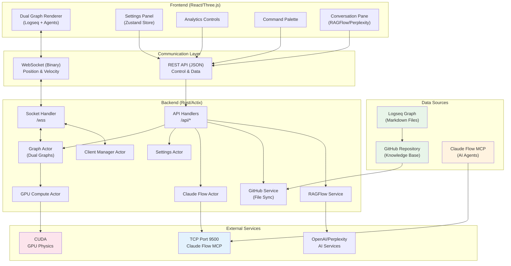

# VisionFlow: Real-Time AI Multi Agent Visualisation & Knowledge Graph Explorer

A high-performance, GPU-accelerated platform for real-time visualisation of AI multi-agent systems working alongside your Logseq knowledge graph. VisionFlow combines a Rust backend with React/Three.js frontend to deliver stunning 3D visualisations of both your personal knowledge base (from Logseq via GitHub) and live AI agent interactions.

## 🚀 Key Features

### Core Capabilities
- **Dual Graph System**: Simultaneous visualisation of Logseq knowledge graphs and AI agent networks
- **Logseq Integration**: Real-time synchronisation with your Logseq graph via GitHub
- **Knowledge Graph Explorer**: Navigate your personal knowledge base in stunning 3D
- **Multi-Agent Orchestration**: Direct TCP integration with Claude Flow MCP for agent coordination
- **Real-Time 3D Visualisation**: GPU-accelerated rendering of both knowledge and agent graphs
- **Advanced Physics Simulation**: CUDA-powered physics engine for realistic graph dynamics
- **XR/AR Support**: Quest 3 integration for immersive knowledge exploration
- **AI-Powered Analytics**: Clustering, anomaly detection, and intelligent insights on your knowledge

### Technical Highlights
- **High Performance**: Rust backend with Actix actors for concurrent processing
- **GPU Acceleration**: CUDA kernels for physics simulation and data processing
- **Binary Protocol**: Optimised binary WebSocket protocol for minimal latency
- **TCP-Based MCP**: Direct TCP connection (port 9500) for Claude Flow integration
- **Modular Architecture**: Clean separation of concerns with actor-based design

## 🛠️ Technology Stack

### Backend
- **Rust** with Actix-web framework
- **CUDA** for GPU compute
- **TCP** for MCP communication
- **WebSocket** for real-time client updates
- **Actor Model** for concurrent state management

### Frontend
- **React** with TypeScript
- **Three.js** for 3D rendering
- **Zustand** for state management
- **WebXR** for AR/VR capabilities

### Infrastructure
- **Docker** for containerisation
- **Nginx** as reverse proxy
- **GitHub Actions** for CI/CD

## 📦 Installation

### Prerequisites
- Docker and Docker Compose
- NVIDIA GPU with CUDA support (optional, for GPU features)
- Node.js 18+ (for development)
- Rust 1.75+ (for development)

### Quick Start

1. **Clone the repository**
```bash
git clone https://github.com/yourusername/visionflow.git
cd visionflow
```

2. **Configure environment**
```bash
cp .env_template .env
# Edit .env with your API keys and configuration
```

3. **Start with Docker**
```bash
docker-compose up
```

4. **Access the application**
- Web UI: http://localhost:3001
- API: http://localhost:4000

## 🔧 Configuration

### Environment Variables

Key environment variables (see `.env_template` for full list):

```bash
# Claude Flow MCP (TCP)
CLAUDE_FLOW_HOST=multi-agent-container
MCP_TCP_PORT=9500
MCP_TRANSPORT=tcp

# API Keys
OPENAI_API_KEY=your_key
PERPLEXITY_API_KEY=your_key
GITHUB_TOKEN=your_token  # Required for Logseq graph sync

# Optional Features
NO_GPU_COMPUTE=false  # Set to true if no GPU available
```

### Docker Compose Profiles

- **Production**: `docker-compose.yml` - Optimised for deployment
- **Development**: `docker-compose.dev.yml` - Hot reload and debugging

## 🏗️ Architecture

### System Overview



### Communication Architecture

The system uses a **dual-protocol architecture** for optimal performance:

#### REST API (JSON over HTTP)
- **Endpoint**: `/api/*`
- **Purpose**: Control plane operations & data fetching
- **Handles**:
  - Logseq graph data from GitHub (`/api/graph/data`)
  - GitHub file synchronisation (`/api/pages/*`)
  - Settings management (`/api/settings`)
  - Analytics operations (`/api/analytics/*`)
  - Authentication (`/api/auth/*`)
  - AI agent management (`/api/bots/*`)
  - RAGFlow chat (`/api/ragflow/*`)
  - Perplexity queries (`/api/perplexity/*`)
  - Health checks (`/api/health`)

#### WebSocket (Binary Protocol)
- **Endpoint**: `/wss`
- **Purpose**: Real-time physics streaming for dual graphs
- **Handles**:
  - Logseq knowledge graph node positions/velocities
  - AI agent graph node positions/velocities
  - Bi-directional physics streaming at 10-60 Hz
  - 28-byte binary format per node (85% bandwidth reduction vs JSON)
  - Node type flags to distinguish knowledge vs agent nodes

### Actor System

The backend uses an actor-based architecture for concurrent state management:

- **GraphServiceActor**: Manages dual graph data (Logseq + AI agents) and physics simulation
- **SettingsActor**: Handles configuration and preferences
- **ClaudeFlowActor**: TCP-based MCP integration (port 9500) for AI agents
- **GPUComputeActor**: Manages CUDA kernels for dual graph physics
- **ClientManagerActor**: WebSocket connection management
- **MetadataActor**: Manages Logseq metadata and graph structure

## 🚀 Advanced Features

### Dual Graph System
- **Logseq Integration**: Real-time sync with your personal knowledge base via GitHub
- **AI Agent Visualisation**: Live multi-agent system coordination and interactions
- **Cross-Graph Analysis**: Compare and link knowledge with AI agent activities
- **Unified Physics**: Both graphs share the same GPU-accelerated physics engine

### Graph Innovations
- **Synchronisation**: Real-time dual graph coordination (Logseq + Agents)
- **AI Comparison**: Semantic analysis between knowledge and agent graphs
- **Advanced Animations**: GPU-accelerated transitions
- **AI Insights**: Layout optimisation and cluster detection
- **Time-Travel**: Navigate through graph state history

### Analytics Suite
- **Clustering Algorithms**: Spectral, DBSCAN, K-Means++, Louvain
- **Anomaly Detection**: Isolation Forest, LOF, Autoencoder
- **Real-Time Insights**: AI-generated recommendations

### XR/AR Capabilities
- **Quest 3 Integration**: Native AR support
- **Spatial UI**: 3D interface elements
- **Hand Tracking**: Natural interaction
- **Voice Controls**: Audio commands

## 📚 Documentation

Comprehensive documentation is available in the `/docs` directory:

- [Architecture Overview](docs/architecture/system-overview.md)
- [API Reference](docs/api/index.md)
- [Configuration Guide](docs/configuration/index.md)
- [Development Setup](docs/development/setup.md)
- [Deployment Guide](docs/deployment/index.md)

## 🧪 Testing

### Run Tests
```bash
# Rust tests
cargo test

# Frontend tests
cd client && npm test

# TCP connection test
cargo run --bin test-tcp
```

### Performance Benchmarks
```bash
cargo bench
```

## 🤝 Contributing

We welcome contributions! Please see our [Contributing Guide](docs/contributing.md) for details.

### Development Workflow

1. Fork the repository
2. Create a feature branch
3. Make your changes
4. Run tests and linting
5. Submit a pull request

## 📄 License

This project is licensed under the MIT License - see the [LICENSE](LICENSE) file for details.

## 🙏 Acknowledgments

- Built with cutting-edge open source technologies
- Powered by the Rust and React communities
- GPU acceleration via NVIDIA CUDA
- MCP integration via Claude Flow

## 📞 Support

- **Issues**: [GitHub Issues](https://github.com/yourusername/visionflow/issues)
- **Documentation**: [Full Documentation](docs/index.md)
- **Community**: [Discord Server](https://discord.gg/visionflow)

---

**VisionFlow** - Visualising the future of AI multi-agent systems 🚀