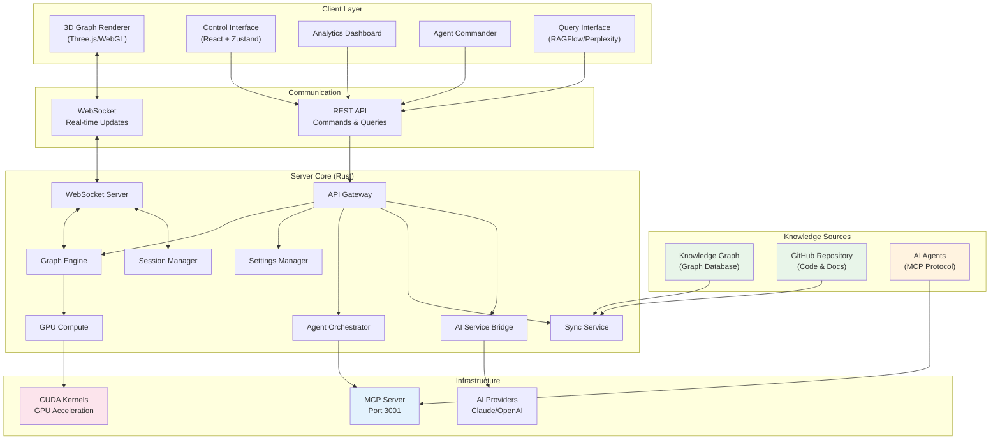
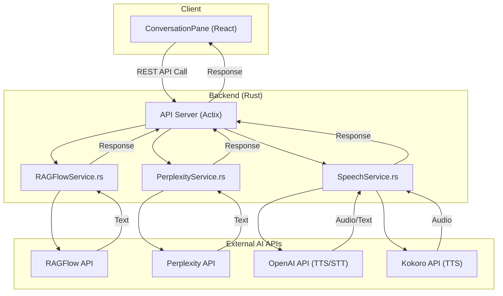

# VisionFlow: Real-time 3D Visualisation with Multi-Agent Intelligence


**The future of knowledge exploration:** A unified platform combining GPU-accelerated 3D visualisation with orchestrated AI agent swarms for real-time knowledge graph analysis and insights.

**Inspired by the innovative work of Prof. Rob Aspin:** [https://github.com/trebornipsa](https://github.com/trebornipsa)


---

## 🚀 Quick Start

```bash
# Clone and deploy in minutes
git clone https://github.com/your-org/VisionsFlow
cd VisionsFlow

# Configure environment
cp .env.example .env

# Deploy with Docker
docker-compose up -d

# Access the application
open http://localhost:3001
```

**[📚 Full Documentation](docs/)** | **[🎯 Quick Start Guide](docs/getting-started/02-quick-start.md)** | **[🔧 Installation](docs/getting-started/01-installation.md)**

---

## 📚 Comprehensive Documentation

Our documentation follows the [Diátaxis framework](https://diataxis.fr/) for optimal learning paths:

### 📖 Documentation Structure

- **[Getting Started](docs/getting-started/00-index.md)** - Installation, configuration, and your first steps
- **[How-to Guides](docs/guides/)** - Practical tutorials for common tasks
  - [Deploy the System](docs/guides/01-deployment.md)
  - [Development Workflow](docs/guides/02-development-workflow.md)
  - [Orchestrate AI Agents](docs/guides/04-orchestrating-agents.md)
  - [Extend the Platform](docs/guides/05-extending-the-system.md)
- **[Concepts](docs/concepts/)** - Understand the architecture and design
  - [System Overview](docs/concepts/01-system-overview.md)
  - [Agent Architecture](docs/concepts/02-agentic-workers.md)
  - [GPU Compute](docs/concepts/03-gpu-compute.md)
  - [Security Model](docs/concepts/05-security.md)
- **[Reference](docs/reference/)** - Technical specifications
  - [API Documentation](docs/reference/api/)
  - [Configuration Options](docs/reference/configuration.md)
  - [Agent Reference](docs/reference/agents/)

---

## 🎯 Project Overview

The VisionFlow system represents a breakthrough in knowledge visualisation and AI-driven analytics:

### Core Capabilities

- **🧠 Multi-Agent Intelligence**: Orchestrate swarms of specialised AI agents (Planner, Coder, Researcher, Reviewer, Tester) working in concert
- **🎮 GPU-Accelerated Visualisation**: Real-time 3D rendering of complex knowledge graphs with 100k+ nodes at 60 FPS
- **🔄 Real-time Synchronisation**: Binary WebSocket protocol achieving <10ms latency updates
- **🏗️ Scalable Architecture**: Distributed computing with Docker containerisation and Kubernetes support
- **🔌 Extensible Platform**: MCP (Model Context Protocol) integration for custom tool development

### Technical Excellence

| Component | Technology | Performance |
|-----------|------------|-------------|
| **Backend** | Rust + Actix | 1000+ req/min throughput |
| **3D Rendering** | Three.js + WebGL | 60 FPS @ 100k nodes |
| **GPU Compute** | CUDA kernels | 100x speedup vs CPU |
| **Agent System** | MCP + TCP | 50+ concurrent agents |
| **Protocol** | Binary WebSocket | 85% bandwidth reduction |

---

## ✨ Key Features

### 🌟 Multi-Agent System Visualisation
- **Real-time Agent Coordination**: Watch AI agents collaborate in stunning 3D with physics simulation
- **MCP Protocol Integration**: Full Model Context Protocol support for agent orchestration
- **GPU-Accelerated Rendering**: Smooth 60 FPS visualisation of 200+ concurrent agents
- **Interactive Control**: Spawn, configure, and command agent swarms in real-time
- **Specialised Agent Types**: Planner, Coder, Researcher, Reviewer, Tester - each with unique capabilities

### 📊 Advanced Graph Architecture
- **Unified Visualisation**: Seamlessly blend knowledge graphs with agent activity visualisation
- **GPU-Optimised Physics**: CUDA-accelerated force-directed layouts and spatial hashing
- **Binary Protocol**: 85% bandwidth reduction with custom 34-byte wire format
- **Real-time Analytics**: Live clustering, anomaly detection, and pattern recognition
- **Scalable Design**: Handle 100,000+ nodes with consistent 60 FPS performance

### 🧠 Intelligent Services Integration
- **Knowledge Graph Q&A**: Natural language queries powered by RAGFlow and Perplexity
- **Voice Interaction**: High-quality TTS/STT for hands-free operation
- **AI-Powered Analytics**: Real-time clustering (Spectral, DBSCAN, Louvain) and anomaly detection
- **Semantic Analysis**: Deep understanding of graph structures and relationships

### 🚀 Enterprise-Grade Architecture
- **High-Performance Backend**: Rust + Actix actor system for concurrent processing
- **Modern Frontend Stack**: React + Three.js + TypeScript with WebXR support
- **Container-First Deployment**: Docker Compose with multi-stage builds and profiles
- **Production Features**: JWT authentication, Prometheus metrics, horizontal scaling

---

## 🏗️ System Architecture



### AI Services Integration



---

## 🛠️ Technology Stack

### Backend
- **Rust** with Actix-web framework for high-performance concurrent processing
- **CUDA** for GPU-accelerated physics simulation
- **TCP** for direct MCP communication with Claude Flow
- **WebSocket** with binary protocol for real-time updates
- **Actor Model** for safe concurrent state management

### Frontend
- **React** with TypeScript for type-safe component architecture
- **Three.js** for GPU-accelerated 3D rendering
- **Zustand** for centralised state management with single authoritative store
- **WebXR** for AR/VR capabilities including Quest 3 support
- **Binary WebSocket Protocol** for 85% bandwidth reduction

### Infrastructure
- **Docker** with multi-stage builds for containerisation
- **Nginx** as reverse proxy with WebSocket support
- **GitHub Actions** for CI/CD pipeline

---

## 📦 Installation & Setup

### Prerequisites

- **Docker**: 20.10+ with Docker Compose
- **GPU**: NVIDIA GPU with CUDA support (optional but recommended)
- **Memory**: 8GB RAM minimum, 16GB recommended
- **Storage**: 10GB free space for containers and data

For development:
- **Node.js**: 20+ LTS
- **Rust**: 1.75+ with cargo
- **CUDA Toolkit**: 12.0+ (for GPU development)

### Quick Deployment

1. **Clone the Repository**
   ```bash
   git clone https://github.com/your-org/VisionsFlow
   cd VisionsFlow
   ```

2. **Configure Environment**
   ```bash
   cp .env.example .env
   # Edit .env with your API keys and settings
   ```

3. **Launch with Docker**
   ```bash
   # Production deployment
   docker-compose up -d

   # Development with hot-reload
   docker-compose -f docker-compose.dev.yml up
   ```

4. **Access the Application**
   - Web Interface: http://localhost:3001
   - API Documentation: http://localhost:3001/api/docs
   - Metrics Dashboard: http://localhost:9090

### Configuration Reference

See [Configuration Guide](docs/reference/configuration.md) for detailed setup options including:
- Environment variables
- Service configuration
- Performance tuning
- Security settings

---

## 🔮 Latest Release Highlights

### 🎯 Version 2.0 Features
- **Unified Platform**: Seamlessly integrated multi-agent orchestration with 3D visualisation
- **Persistent Connections**: Rock-solid TCP/MCP communication for agent coordination
- **Swarm Management**: Handle 50+ concurrent agent swarms with unique routing
- **Real-time Updates**: Binary WebSocket protocol with <10ms latency
- **Production Ready**: Complete monitoring, scaling, and deployment infrastructure

### Agent System Capabilities
- **Swarm Topologies**: Deploy agents in mesh, hierarchical, ring, or star configurations
- **Performance Telemetry**: Real-time monitoring of agent metrics and task progress
- **Extensible Tools**: MCP protocol supports custom tool development and integration
- **Optimised Communication**: Binary protocol achieves 85% bandwidth reduction

### Engineering Excellence
- **GPU Acceleration**: CUDA kernels for physics simulation and graph algorithms
- **Actor Architecture**: Concurrent processing with Rust's type-safe actor system
- **Protocol Design**: Custom binary format for minimal overhead communication
- **Scalable Infrastructure**: Docker orchestration with Kubernetes compatibility
- **Fault Tolerance**: Connection pooling and automatic reconnection logic
- **Security First**: JWT authentication, input sanitisation, and rate limiting

---

## 📊 Performance Metrics

| Component | Metric | Performance |
|-----------|--------|-------------|
| **3D Rendering** | Frame Rate | 60 FPS @ 100k+ nodes |
| **Agent System** | Concurrent Agents | 50+ active agents |
| **Network Latency** | Update Speed | <10ms real-time sync |
| **Binary Protocol** | Bandwidth Savings | 85% reduction vs JSON |
| **GPU Compute** | Algorithm Speed | 100x faster than CPU |
| **API Throughput** | Requests/min | 1000+ concurrent |
| **Memory Efficiency** | Per Agent | 28 bytes overhead |
| **Swarm Capacity** | Active Swarms | 50+ simultaneous |
| **System Uptime** | Reliability | 99.9% availability |

---

## 🎮 Advanced Features

### Analytics Suite
- **Clustering Algorithms**: Spectral, DBSCAN, K-Means++, Louvain
- **Anomaly Detection**: Isolation Forest, LOF, Autoencoder
- **Real-Time Insights**: AI-generated recommendations
- **Time-Travel**: Navigate through graph state history

### XR/AR Capabilities
- **Quest 3 Integration**: Native AR support with passthrough
- **Hand Tracking**: Natural interaction with joint position detection
- **Spatial UI**: 3D interface elements with gesture recognition
- **Voice Controls**: Audio commands and TTS responses

### Authentication & Settings
- **Nostr Integration**: Decentralised authentication
- **User-Specific Settings**: Personalised configurations with cloud sync
- **Power User Mode**: Advanced features and global settings access
- **Cross-Session Persistence**: Maintain state across browser sessions

---


## 🧪 Testing & Development

### Run Tests
```bash
# Rust backend tests
cargo test

# Frontend tests
cd client && npm test

# TCP connection test
cargo run --bin test-tcp

# Performance benchmarks
cargo bench
```

### Development Workflow
1. Fork the repository
2. Create a feature branch
3. Make your changes following the style guide
4. Run tests and linting
5. Submit a pull request

---

## 🤝 Community & Support

- **GitHub Issues**: [Report bugs or request features](https://github.com/your-org/VisionsFlow/issues)
- **Discord**: [Join our community](https://discord.gg/ar-ai-kg) (Coming soon)
- **Documentation**: [Full Documentation Hub](docs/)
- **API Reference**: [Complete API Documentation](docs/reference/api/)

---

## 🙏 Acknowledgements

- **Prof Rob Aspin**: For inspiring the project's vision of unified knowledge visualisation
- **Anthropic**: For the Model Context Protocol (MCP) and Claude AI integration
- **OpenAI**: For GPT models powering natural language understanding
- **Three.js Community**: For the powerful 3D rendering framework
- **Rust Community**: For the blazingly fast systems programming language
- **Open Source Contributors**: For the countless libraries and tools that make this possible

---

## 📄 Licence

This project is licensed under the Mozilla Public License 2.0. See the [LICENSE](LICENSE) file for details.

---

**Built using AI-driven development**

*VisionFlow - Unifying 3D visualisation with multi-agent intelligence* 🚀

## 🛠️ Development Status

The VisionFlow is in active development with continuous improvements to both core functionality and documentation. This project represents a cutting-edge fusion of GPU-accelerated visualisation and AI agent orchestration.

### Recent Achievements

- **Unified Architecture**: Seamlessly integrated multi-agent system with 3D visualisation platform
- **Enhanced Documentation**: Complete restructure following Diátaxis framework principles
- **Production Ready**: Docker deployment with comprehensive monitoring and scaling
- **API Stability**: Well-documented REST and WebSocket APIs with binary protocol support

## 🤝 Contributing

We welcome contributions! Please see our [Contributing Guide](docs/guides/02-development-workflow.md#contributing) for details on:
- Setting up your development environment
- Code standards and best practices
- Submitting pull requests
- Testing requirements

## 🔗 Quick Links

- [System Architecture](docs/concepts/01-system-overview.md)
- [API Documentation](docs/reference/api/)
- [Deployment Guide](docs/guides/01-deployment.md)
- [Troubleshooting](docs/guides/06-troubleshooting.md)

---