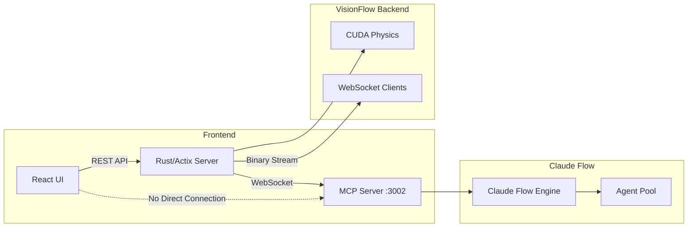

# VisionFlow: Real-Time AI Agent Swarm Visualization


**Experience the future of AI orchestration:** Watch Claude Flow agent swarms collaborate in stunning 3D while managing your knowledge graph.

## 🚀 What is VisionFlow?

VisionFlow is a high-performance visualization platform for AI agent swarms, built with a Claude Flow-centric architecture. It provides real-time 3D visualization of AI agents working collaboratively through the Model Context Protocol (MCP), alongside your Logseq knowledge graph.

### Key Highlights

- **🤖 Claude Flow MCP Integration**: Direct WebSocket connection to Claude Flow for real-time agent orchestration
- **📊 Dual Graph Architecture**: Simultaneous visualization of knowledge graphs and AI agent swarms  
- **⚡ GPU-Accelerated Physics**: 60 FPS visualization of 100,000+ nodes with CUDA acceleration
- **🔄 Binary Protocol**: 28-byte format reduces bandwidth by 85% vs JSON
- **🏗️ Production Ready**: Docker deployment, horizontal scaling, monitoring

## 🎯 Quick Start

```bash
# Clone and deploy in minutes
git clone <repository-url>
cd ext

# Configure environment
cp .env.example .env

# Deploy with Docker
docker-compose up -d

# Access the application
open http://localhost:3001
```

**[📖 Full Quick Start Guide](docs/quick-start.md)** - Spawn your first AI swarm in 5 minutes!

## 🏗️ Architecture

### Claude Flow-Centric Design



**Key Design Principles:**
- Frontend **never** connects directly to MCP
- All MCP communication flows through Rust backend
- Binary protocol for efficient streaming (28 bytes/node)
- GPU physics computation server-side

## ✨ Core Features

### AI Agent Swarm Orchestration

- **Swarm Topologies**: Mesh, hierarchical, star, ring configurations
- **Agent Types**: Coordinator, researcher, coder, architect, tester, reviewer, documenter
- **Real-time Telemetry**: 10Hz updates from Claude Flow MCP
- **Task Assignment**: Dynamic task distribution with dependencies

### Dual Graph Visualization

- **Knowledge Graph**: Static Logseq documents and concepts
- **Agent Graph**: Dynamic AI agents and interactions
- **Type Flags**: u32 node IDs with bit 31 (agents) and bit 30 (knowledge)
- **Independent Physics**: Different parameters for each graph type

### Performance & Scale

| Metric | Performance |
|--------|-------------|
| Max Nodes | 100,000+ @ 60 FPS |
| Agent Capacity | 50+ concurrent |
| Update Rate | 10Hz telemetry, 60 FPS render |
| Protocol Efficiency | 28 bytes/node |
| GPU Memory | 1.5GB for 100K nodes |

## 📚 Documentation

### Getting Started
- **[Quick Start](docs/quick-start.md)** - Get running in 5 minutes
- **[System Overview](docs/architecture/system-overview.md)** - Architecture and design
- **[API Reference](docs/api/rest.md)** - REST and WebSocket APIs

### Architecture Deep Dives
- **[MCP Integration](docs/architecture/mcp-integration.md)** - Claude Flow connection
- **[Dual Graph](docs/architecture/dual-graph.md)** - Knowledge + agent graphs
- **[GPU Compute](docs/architecture/gpu-compute.md)** - CUDA acceleration
- **[Binary Protocol](docs/api/binary-protocol.md)** - Wire format specification

### Server Documentation
- **[Actor System](docs/server/actors.md)** - Actix actor architecture
- **[Agent Swarm](docs/server/agent-swarm.md)** - Orchestration details
- **[Physics Engine](docs/server/physics-engine.md)** - Force-directed layout

## 🛠️ Technology Stack

### Backend (Rust)
- **Framework**: Actix Web with actor model
- **GPU**: CUDA 11.8+ for physics simulation
- **Protocol**: Binary WebSocket streaming
- **MCP**: Direct Claude Flow integration

### Frontend (TypeScript)
- **Framework**: React 18 with TypeScript
- **3D Engine**: Three.js with React Three Fiber
- **State**: Zustand for reactive state
- **WebSocket**: Binary protocol parsing

### Infrastructure
- **Containerization**: Docker & Docker Compose
- **Services**: Claude Flow, Redis, PostgreSQL
- **Monitoring**: Prometheus, Grafana, OpenTelemetry

## 🚀 Deployment

### Docker Compose (Recommended)

```yaml
services:
  backend:
    image: visionflow/backend:latest
    ports:
      - "3001:3001"
    environment:
      - CLAUDE_FLOW_HOST=multi-agent-container
      - CLAUDE_FLOW_PORT=3002
      - ENABLE_GPU=true
  
  claude-flow:
    image: visionflow/claude-flow:latest
    expose:
      - "3002"  # Internal only, not exposed
```

### System Requirements

**Minimum:**
- CPU: 4 cores
- RAM: 8GB
- Docker: 20.10+

**Recommended:**
- CPU: 8+ cores  
- RAM: 16GB
- GPU: NVIDIA with CUDA 11.8+
- Network: 100 Mbps

## 🎮 Usage Examples

### Spawn a Simple Swarm

```json
{
  "topology": "mesh",
  "maxAgents": 5,
  "agentTypes": ["coordinator", "coder", "tester"],
  "customPrompt": "Build a REST API with authentication"
}
```

### Complex System Design

```json
{
  "topology": "hierarchical",
  "maxAgents": 15,
  "agentTypes": ["coordinator", "architect", "researcher", "coder", "coder", "tester"],
  "customPrompt": "Design microservices for e-commerce platform"
}
```

## 🔧 Development

### Local Setup

```bash
# Backend (Rust)
cd ext
cargo build --release --features gpu

# Frontend (React)
cd client
npm install
npm run dev
```

### Running Tests

```bash
# Backend tests
cargo test

# Frontend tests
npm test
```

## 📊 Performance Benchmarks

Tested on NVIDIA RTX 4090:

| Nodes | Edges | FPS | GPU Memory | Bandwidth |
|-------|-------|-----|------------|-----------|
| 1K | 5K | 120 | 50 MB | 20 KB/s |
| 10K | 50K | 60 | 200 MB | 150 KB/s |
| 100K | 500K | 60 | 1.5 GB | 1.2 MB/s |

## 🤝 Contributing

We welcome contributions! Please see our [Contributing Guide](docs/contributing.md) for details.

### Areas for Contribution
- Additional agent types and behaviors
- Performance optimizations
- UI/UX improvements
- Documentation and examples
- Testing and bug reports

## 📄 License

This project is licensed under the MIT License. See [LICENSE](LICENSE) for details.

## 🙏 Acknowledgments

- **Claude Flow Team** - For the MCP agent orchestration framework
- **Anthropic** - For the Model Context Protocol specification
- **Prof. Rob Aspin** - For inspiring the visualization approach
- **Three.js Community** - For the excellent 3D rendering library
- **Rust Community** - For Actix and GPU compute libraries

## 🔗 Links

- **Documentation**: [docs/index.md](docs/index.md)
- **Issues**: [GitHub Issues](https://github.com/visionflow/visionflow/issues)
- **Discussions**: [GitHub Discussions](https://github.com/visionflow/visionflow/discussions)

---

**Built with ❤️ for the AI orchestration community**

*VisionFlow - Where AI agents come alive in 3D*