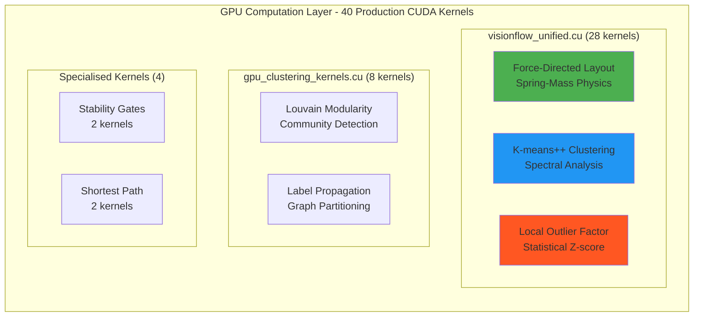
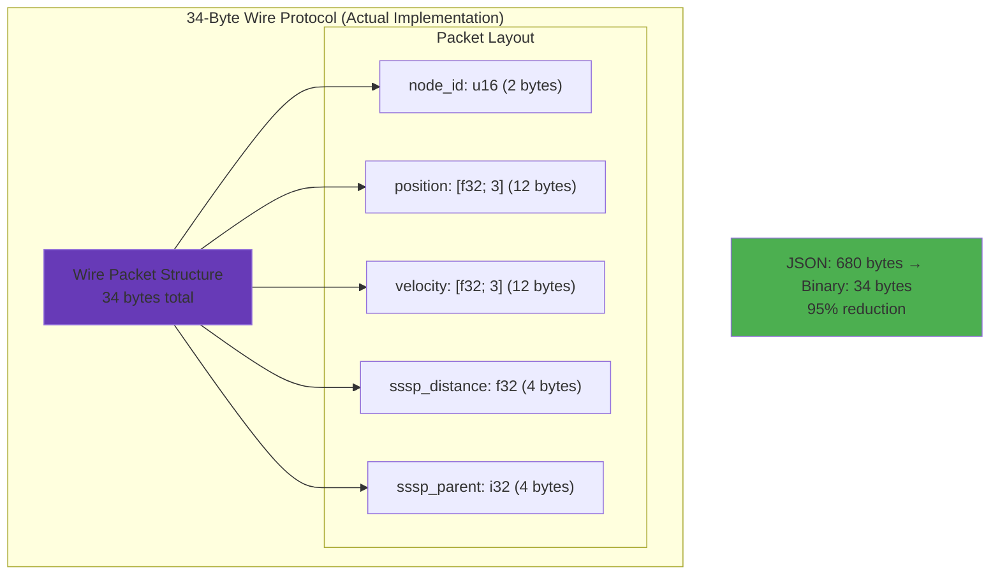
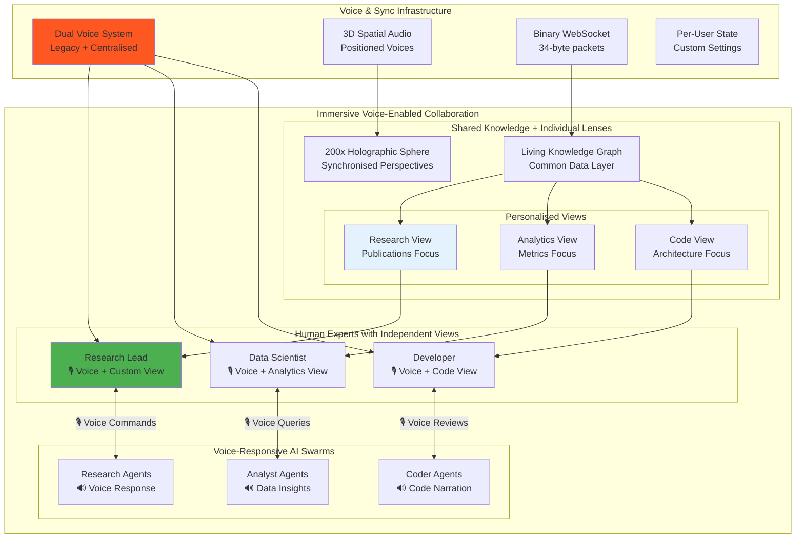
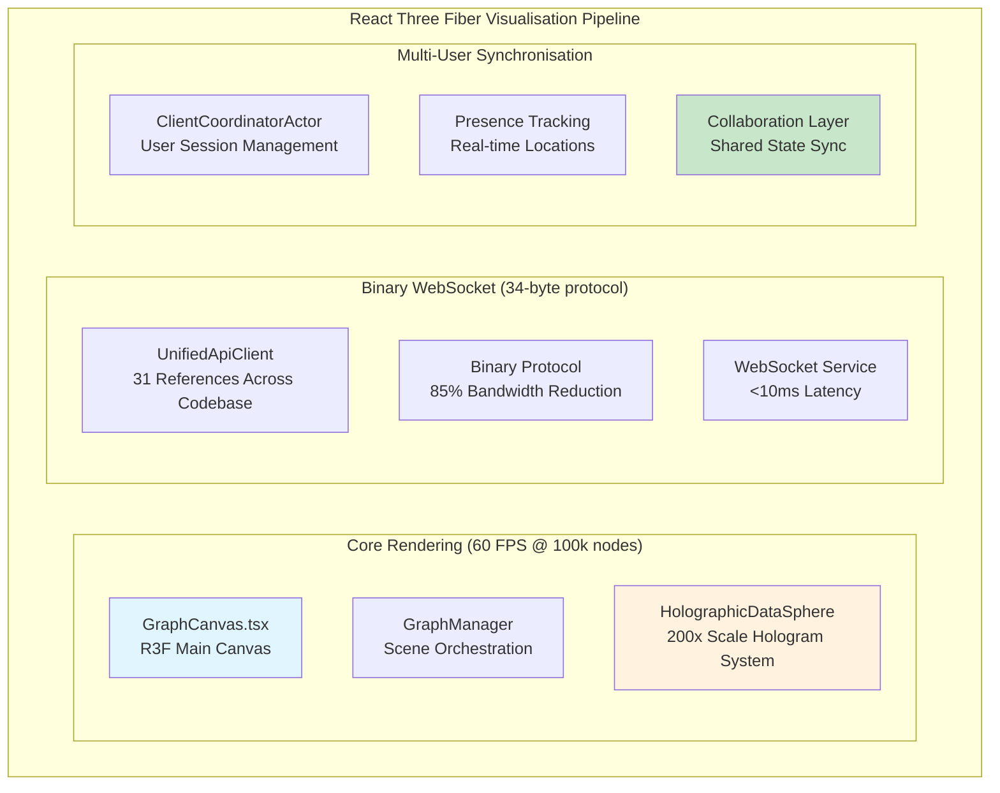
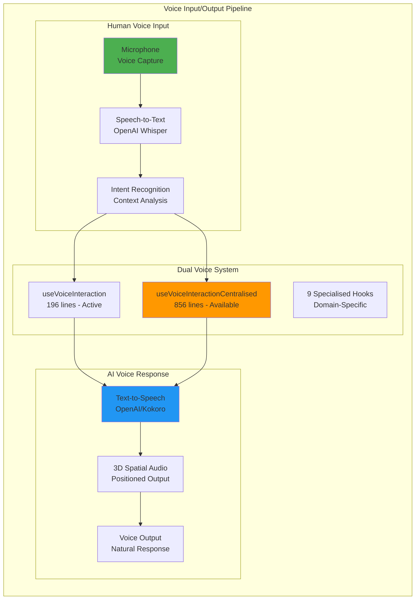

<div align="center">

# 🌌 VisionFlow

[](LICENSE)
[](docs/)
[](docs/)
[](docs/)

</div>

<div align="center">
  <table>
    <tr>
      <td align="center">
        <strong>👥 Collaborative Team AI</strong><br/>
        <sub>Action on 100k + complex nodes</sub>
      </td>
      <td align="center">
        <strong>🤖 Continuous Background Agents</strong><br/>
        <sub>Agent Intelligence • Dip In Dip Out</sub>
      </td>
      <td align="center">
        <strong>🔐 Private & Self-Sovereign</strong><br/>
        <sub>Multi-Modal Immersive Interface</sub>
      </td>
    </tr>
    <tr>
      <td align="center">
        <strong>📊 Massive Scale</strong><br/>
        <sub>Dozens of Users • Hundreds of Agents</sub>
      </td>
      <td align="center">
        <strong>🛡️ Enterprise Security</strong><br/>
        <sub>Thin Client • Secure Server • W3C DID</sub>
      </td>
      <td align="center">
        <strong>🎙️ Voice-First & Human First</strong><br/>
        <sub>Natural Human-AI Intreractions</sub>
      </td>
    </tr>
  </table>
</div>

---

<div align="center">
  <table>
    <tr>
      <td></td>
      <td></td>
    </tr>
  </table>
</div>

<br/>

<div align="center">
  <h3>🚀 Like ChatGPT Pulse for Your Private Knowledge</h3>
  <p><strong>VisionFlow deploys self-sovereign AI agents that continuously research, analyse, and surface insights<br/>from your data corpus - all visualised for collaborative teams, in stunning real-time 3D.</strong></p>

  <sub>Inspired by the innovative work of <a href="https://github.com/trebornipsa">Prof. Rob Aspin</a></sub>
</div>

---

<div align="center">
  <table>
    <tr>
      <th>🏆 Enterprise Value</th>
      <th>⚡ Performance</th>
      <th>🔧 Technology</th>
      <th>👥 Collaboration</th>
    </tr>
    <tr>
      <td align="center">
        <strong>Completely Open Source</strong><br/>
        <sub>Support Contracts on Request</sub>
      </td>
      <td align="center">
        <strong>60 FPS</strong><br/>
        <sub>@ 100k+ nodes</sub>
      </td>
      <td align="center">
        <strong>40 CUDA</strong><br/>
        <sub>GPU Kernels</sub>
      </td>
      <td align="center">
        <strong>50+ Agents</strong><br/>
        <sub>Concurrent Swarms</sub>
      </td>
    </tr>
    <tr>
      <td align="center">
        <strong>Cost Savings though Flow</strong><br/>
        <sub>Based on Decades of Immersive Research</sub>
      </td>
      <td align="center">
        <strong><10ms</strong><br/>
        <sub>WebSocket Latency</sub>
      </td>
      <td align="center">
        <strong>34-byte</strong><br/>
        <sub>Binary Protocol</sub>
      </td>
      <td align="center">
        <strong>Real-time</strong><br/>
        <sub>Voice-to-Voice AI</sub>
      </td>
    </tr>
  </table>
</div>

---

<div align="center">
  <table>
    <tr>
      <td></td>
      <td></td>
    </tr>
  </table>
</div>

---

### 📝 Powerful Markdown Based Data Management with Logseq

VisionFlow integrates seamlessly with [Logseq](https://logseq.com/), a privacy-first, open-source platform for knowledge management. Logseq enables you to maintain your research data in plain Markdown files while providing advanced features like:

- **Block-based organization** for structured knowledge capture
- **Bidirectional linking** to connect related concepts
- **Knowledge graphs** to visualize relationships in your data
- **Local storage** ensuring complete data ownership and privacy
- **Plugin ecosystem** for extending functionality
- **Multi Platform & Mobile** any of your users or team, anywhere

<div align="center">
  <table>
    <tr>
      <td></td>
      <td></td>
      <td></td>
      <td></td>
    </tr>
  </table>
</div>


# Private Knowledge with Powerful Data Analysis

VisionFlow combines cutting-edge graph analysis techniques with version-controlled data management to deliver unparalleled insights from your private knowledge corpus.

### 🔍 Advanced Knowledge Graph Architecture

- **Microsoft GraphRAG Integration**: Unlike traditional RAG systems that rely on simple vector similarity, VisionFlow leverages [Microsoft's GraphRAG](https://github.com/microsoft/graphrag) to build hierarchical knowledge structures. This creates subject-object-predicate relationships (e.g., "Project Alpha - requires - Machine Learning") that capture the deep semantic meaning within your data.

- **Leiden Clustering Algorithm**: Automatically organises your knowledge into well-connected communities using the state-of-the-art Leiden algorithm. This ensures:
  - **Hierarchical Organisation**: Knowledge is structured from high-level domains down to specific details
  - **Implicit Connection Discovery**: Reveals hidden relationships between disparate pieces of information
  - **Scalable Analysis**: Efficiently handles massive knowledge bases with hundreds of thousands of nodes

- **Cutting Edge Shortest Path Analysis**: Cutting edge ([new research](https://arxiv.org/abs/2504.17033)) shortest path analysis enables multi-hop reasoning across your knowledge graph to:
  - Connect concepts that aren't directly linked
  - Visually trace the flow of information through your organisation
  - Discover optimal knowledge paths for complex queries


# 🔄 Continuous Background Intelligence

### 🤖 Intelligent Agent Orchestration

VisionFlow deploys specialised AI agents that work continuously in the background:

- **Researcher Agents**: Deep-dive into specific topics using GraphRAG's local search capabilities
- **Analyst Agents**: Identify patterns and correlations using clustering algorithms
- **Coder Agents**: Parse and understand code relationships, documentation, and dependencies
- **Reviewer Agents**: Validate findings and cross-reference information across the knowledge graph
- **Planner Agents**: Coordinate research strategies using global search for holistic understanding

- **Autonomous Research**: Unlike ChatGPT Pulse's daily summaries, VisionFlow agents continuously analyse your private corpus in real-time, using GraphRAG's dual query modes (local for detail, global for synthesis)

- **Proactive Discovery**: Surface new connections through:
  - Community detection that groups related concepts
  - Path analysis that reveals indirect relationships
  - Hierarchical summarisation that provides context at every level

- **Living Knowledge Graph with Git Integration**:
  - Your data evolves in real-time as agents discover relationships
  - All changes are tracked through Git version control
  - Updates are submitted as **merge requests** for human oversight
  - Complete transparency with detailed commit history
  - Rollback capabilities for any knowledge state

### 🔐 Enterprise-Grade Data Governance
- Your data is stored in (private) **Git-tracked structures** with comprehensive version history, enabling:

- **Version Control**: Every knowledge update is tracked, attributed, and reversible
- **Audit Trail**: Complete history of how your knowledge graph evolved
- **Human-in-the-Loop**: AI discoveries require human approval via merge requests
- **Data Sovereignty**: All processing happens on your infrastructure
- **Time Travel**: Wind back and forth through the history of your data visually in the immersive graph

### 🚀 Multi-User Human-AI Collaboration Universe

VisionFlow creates an **immersive collaborative space** where human experts and AI agents work together:

- **👥 Multi-User Collaboration**: Multiple human experts collaborate with AI agents in real-time
- **🤝 Human-AI Symbiosis**: Agents learn from human expertise while augmenting human capabilities
- **🔐 Private & Secure**: Your data never leaves your infrastructure
- **👁️ Immersive 3D Workspace**: Watch humans and AI agents collaborate in shared virtual space
- **🌐 Unlimited Corpus**: Connect GitHub repos, documents, databases, APIs
- **⚡ Real-time Synchronisation**: All participants see updates instantly
- **🎮 Interactive Control**: Humans direct agent swarms while agents suggest new research directions


# VisionFlow Vs ChatGPT Pulse

| ChatGPT Pulse | VisionFlow |
|---------------|------------|
| Asynchronous daily research | Continuous real-time agent research |
| Surfaces insights from past chats | Discovers patterns in your knowledge corpus |
| Visual summaries you can expand | 3D visualisation you can explore |
| Proactive morning delivery | Real-time insight streaming |
| Based on your memories & history | Based on your private data & documents |
| Curated topics from interactions | Agent-discovered knowledge connections |


---

## 🚀 Quick Start

```bash
# Clone and deploy your private research assistant
git clone https://github.com/your-org/VisionsFlow
cd VisionsFlow

# Configure environment
cp .env.example .env

# Deploy with Docker
docker-compose up -d

# Access your AI research universe
open http://localhost:3001
```

**[📚 Full Documentation](docs/)** | **[🎯 Quick Start Guide](docs/getting-started/02-quick-start.md)** | **[🔧 Installation](docs/getting-started/01-installation.md)**

---

## ✨ Core Capabilities: Human-AI Collaborative Intelligence

### 🤝 Immersive Multi-User Collaboration Platform
VisionFlow enables **team-based human-AI research with voice**:

- **🎙️ Voice-to-Voice AI Interaction**: Natural conversation with AI agents using advanced TTS/STT
- **👁️ Independent Specialist Views**: Each user maintains their own perspective while staying synchronised
- **🌐 Shared Virtual Workspace**: Multiple experts and AI agents in the same 3D environment
- **📊 Personalised Data Lenses**: Individual filtering and visualisation preferences per user
- **🔊 Spatial Audio**: Voice communication positioned in 3D space for natural collaboration
- **Real-time Presence**: See where team members and agents are focusing
- **Collaborative Discovery**: Humans guide agents through voice while agents respond verbally
- **Knowledge Handoffs**: Seamless transfer of findings between humans and AI
- **Expertise Amplification**: AI agents learn from human domain knowledge through conversation

### 🤖 Autonomous Agent Research System
Just like ChatGPT Pulse researches on your behalf, VisionFlow deploys intelligent agents that:

- **Background Processing**: Agents work 24/7 analysing your data
- **Human-Guided Learning**: Agents adapt based on expert feedback
- **Pattern Recognition**: Automatically identify trends and anomalies
- **Collaborative Discovery**: Surface findings to human experts for validation
- **Knowledge Evolution**: Continuously update understanding through human-AI interaction

### 📊 Visual Intelligence Dashboard
VisionFlow provides:

- **3D Knowledge Universe**: Navigate your data like a galaxy of interconnected insights
- **Real-time Agent Visualisation**: Watch AI agents collaborate and discover
- **GPU-Accelerated Rendering**: Smooth interaction with 100,000+ data points
- **Interactive Exploration**: Dive deep into any insight cluster
- **Time-Travel Analysis**: Replay how knowledge evolved over time

### 🧠 Multi-Agent Orchestration
VisionFlow orchestrates specialised swarms:

- **Researcher Agents**: Deep-dive into specific topics
- **Analyst Agents**: Identify patterns and correlations
- **Coder Agents**: Understand and document code relationships
- **Reviewer Agents**: Validate and cross-reference findings
- **Planner Agents**: Coordinate research strategies

---

## 🎯 Use Cases: Collaborative Human-AI Research Teams

### 🎙️ Voice-First Collaborative Research
- **Natural Voice Conversations**: Speak directly to AI agents, receive voice responses
- **Hands-Free Operation**: Control entire system through voice commands
- **Multi-Language Support**: Teams collaborate in their preferred languages
- **Voice Transcription**: Automatic documentation of verbal insights
- **Audio Spatial Awareness**: Voices positioned in 3D space matching visual presence

### 👁️ Independent Specialist Views with Team Sync
- **Personalised Perspectives**: Each expert sees data through their specialist lens
- **Synchronous Exploration**: Individual views while maintaining team awareness
- **Custom Visualisation Filters**: Data scientists see metrics, developers see code structure
- **Focus Independence**: Zoom into details without affecting teammates' views
- **Instant View Sharing**: "Show my view" voice command for knowledge transfer

### 👥 Team-Based Knowledge Discovery
- **Collaborative Research Sessions**: Multiple experts work with AI agents simultaneously
- **Voice-Guided AI Training**: Train agents through natural conversation
- **Real-time Insight Sharing**: Discoveries instantly visible with voice announcements
- **Focus Coordination**: See and hear where colleagues and agents are investigating
- **Expertise Routing**: AI agents route findings to the right expert with voice alerts

### 🏢 Enterprise Collaboration Scenarios
- **Cross-Functional Teams**: Data scientists, developers, and domain experts in one space
- **Global Collaboration**: Teams across time zones with persistent AI agents
- **Knowledge Handoffs**: Agents continue research when humans go offline
- **Audit Trails**: Complete history of human decisions and AI discoveries
- **Training & Onboarding**: New team members learn from AI-captured expertise

### 📚 Knowledge Management with Human Oversight
- **Human-Validated Insights**: AI discoveries reviewed by domain experts
- **Guided Exploration**: Experts direct agent focus areas
- **Quality Control**: Human verification of AI-generated connections
- **Iterative Refinement**: Continuous improvement through human feedback

### 💻 Collaborative Code Intelligence
- **Pair Programming with AI**: Developers and coder agents work together
- **Code Review Sessions**: Multiple reviewers and AI agents analyse code
- **Architecture Discussions**: System architects guide AI analysis
- **Knowledge Transfer**: Senior developers' expertise captured by AI

### 🔬 Research & Development Teams
- **Hypothesis Validation**: Scientists validate AI-generated hypotheses
- **Experimental Design**: Researchers and AI co-create experiments
- **Data Interpretation**: Collaborative analysis of complex results
- **Publication Support**: AI agents assist with literature review while experts write

---

## 🏗️ Cutting-Edge Architecture:

### 🎯 TransitionalGraphSupervisor Pattern (Unique to VisionFlow)


### 🚀 40 CUDA Kernels for GPU Acceleration



### 📡 Binary Protocol: 95% Bandwidth Reduction



---

### 👥 Multi-User Voice-Enabled Collaboration Architecture



### 🔬 Unified Client Architecture with HolographicDataSphere



## 📊 Performance Metrics: Production-Ready at Scale

| Component | Specification | Performance |
|-----------|--------------|-------------|
| **GPU Kernels** | 40 CUDA kernels | 100x CPU speedup |
| **Binary Protocol** | 34-byte packets | 95% bandwidth saving |
| **Actor System** | 20 Actix actors | 1000+ req/min |
| **WebSocket Latency** | Binary streaming | <10ms updates |
| **3D Rendering** | Three.js + WebGL | 60 FPS @ 100k nodes |
| **Agent Swarms** | MCP orchestration | 50+ concurrent agents |
| **Memory Efficiency** | Per-node overhead | 34 bytes only |
| **Hologram Scale** | HolographicDataSphere | 200x visual scale |
| **API Architecture** | UnifiedApiClient | 31 optimised endpoints |

---

## 🎙️ Voice-to-Voice Architecture: Natural Human-AI Conversation



## 🛠️ Technology Stack: State-of-the-Art Implementation

### 🧠 Intelligence Layer - Advanced AI Orchestration
```
┌─────────────────────────────────────────────────────────────┐
│ MCP Protocol Stack (Model Context Protocol)                 │
├─────────────────────────────────────────────────────────────┤
│ • ClaudeFlowActor → TcpConnectionActor → MCP Server :9500  │
│ • DockerHiveMind: Container orchestration (948 lines)      │
│ • JsonRpcClient: Protocol correlation layer                │
│ • 50+ concurrent agent swarms with unique routing          │
└─────────────────────────────────────────────────────────────┘
```

### ⚡ GPU Acceleration - 40 Production CUDA Kernels
```
┌─────────────────────────────────────────────────────────────┐
│ CUDA Kernel Distribution                                    │
├─────────────────────────────────────────────────────────────┤
│ • visionflow_unified.cu: 28 kernels (physics, clustering)  │
│ • gpu_clustering_kernels.cu: 8 kernels (Louvain, K-means) │
│ • visionflow_unified_stability.cu: 2 stability kernels     │
│ • sssp_compact.cu: 2 shortest path kernels                │
│ • Dynamic grid sizing, shared memory optimisation          │
└─────────────────────────────────────────────────────────────┘
```

### 🎨 Visualisation Layer - React Three Fiber Pipeline
```
┌─────────────────────────────────────────────────────────────┐
│ 3D Rendering Architecture                                   │
├─────────────────────────────────────────────────────────────┤
│ • HolographicDataSphere: 200x scale hologram system        │
│ • SelectiveBloom: Layer-based post-processing              │
│ • Binary WebSocket: 34-byte protocol, <10ms latency        │
│ • UnifiedApiClient: 31 references, centralised HTTP        │
└─────────────────────────────────────────────────────────────┘
```

### 🏗️ Infrastructure - Production-Grade Architecture
```
┌─────────────────────────────────────────────────────────────┐
│ Actor System Architecture (Rust + Actix)                    │
├─────────────────────────────────────────────────────────────┤
│ • TransitionalGraphSupervisor: Bridge pattern wrapper      │
│ • 20 specialised actors with supervision strategies        │
│ • GraphServiceActor: 35,193 lines (being refactored)      │
│ • Binary protocol: 95% bandwidth reduction vs JSON         │
└─────────────────────────────────────────────────────────────┘
```

---

## 🚀 Getting Started: Deploy Your Research Assistant

### Prerequisites
- Docker 20.10+ with Docker Compose
- 8GB RAM (16GB recommended)
- NVIDIA GPU (optional, for acceleration)

### Quick Installation

1. **Clone Repository**
   ```bash
   git clone https://github.com/your-org/VisionsFlow
   cd VisionsFlow
   ```

2. **Configure Your Knowledge Sources**
   ```bash
   cp .env.example .env
   # Add your data sources, API keys, and agent configuration
   ```

3. **Deploy Your Research Universe**
   ```bash
   docker-compose up -d
   ```

4. **Access Your Intelligence Dashboard**
   - Research Interface: http://localhost:3001
   - Agent Monitor: http://localhost:3001/agents
   - API Docs: http://localhost:3001/api/docs

---

## 👁️ Independent Specialist Views: Your Data, Your Perspective

### Synchronous Yet Independent
Each team member experiences the same data through their own specialist lens:

```
┌──────────────────────────────────────────────────────────────────┐
│ Data Scientist View          │ Developer View                    │
├──────────────────────────────┼───────────────────────────────────┤
│ • Statistical overlays        │ • Code structure graphs          │
│ • Correlation matrices        │ • Dependency trees                │
│ • Anomaly highlights         │ • Performance hotspots            │
│ • Predictive models          │ • Architecture diagrams           │
│                              │                                   │
│ Research Analyst View        │ Domain Expert View                │
├──────────────────────────────┼───────────────────────────────────┤
│ • Citation networks          │ • Business process flows         │
│ • Literature connections     │ • Risk assessments                │
│ • Hypothesis tracking        │ • Compliance mappings             │
│ • Evidence trails            │ • Strategic insights              │
└──────────────────────────────────────────────────────────────────┘
          All views share the same underlying knowledge graph
               while maintaining individual perspectives
```

## 🔮 Roadmap: Evolution of Collaborative Intelligence

### Current Capabilities (v2.0)
- ✅ Voice-to-voice AI interaction with TTS/STT
- ✅ Multi-user synchronous collaboration
- ✅ Independent specialist views per user
- ✅ Multi-agent orchestration with 50+ concurrent agents
- ✅ Real-time 3D visualisation of knowledge graphs
- ✅ GPU-accelerated processing and rendering
- ✅ Binary protocol for efficient communication
- ✅ MCP integration for tool extensibility

### Coming Soon
- 🔄 **AR Knowledge Space**: Spatial computing interface
- 🔄 **Enhanced Voice Features**: Multi-language support, voice cloning
- 🔄 **AR Collaboration**: Quest 3 shared workspace with hand tracking
- 🔄 **Scheduled Insights**: Daily summaries option
- 🔄 **Email Integration**: Search and integrate across huge legacy email stores
- 🔄 **Mobile Companion**: iOS/Android apps with voice control
- 🔄 **Plugin Marketplace**: Community-built specialist views

### Future Vision
- 🔮 **Predictive Intelligence**: Anticipate information needs
- 🔮 **Cross-Corpus Learning**: Insights from multiple organisations
- 🔮 **Autonomous Workflows**: Agents that take action on insights

---

## 📚 Documentation

Our comprehensive documentation covers everything from basic setup to advanced agent orchestration:

- **[Getting Started](docs/getting-started/00-index.md)** - Installation and first steps
- **[Agent Orchestration](docs/guides/04-orchestrating-agents.md)** - Configure your research swarms
- **[System Architecture](docs/concepts/01-system-overview.md)** - Technical deep-dive
- **[API Reference](docs/reference/api/)** - Integration documentation

---

## 🤝 Community & Support

- **GitHub Issues**: [Report bugs or request features](https://github.com/your-org/VisionsFlow/issues)
- **Discord**: [Join our community](https://discord.gg/ar-ai-kg)
- **Documentation**: [Full Documentation Hub](docs/)

---

## 🙏 Acknowledgements

- **Prof Rob Aspin**: For inspiring unified knowledge visualisation
- **Anthropic**: For the Model Context Protocol enabling agent orchestration
- **OpenAI**: For ChatGPT Pulse inspiration and GPT models
- **Open Source Community**: For the incredible tools that power VisionFlow

---

## 📄 Licence

Mozilla Public License 2.0 - See [LICENSE](LICENSE) for details.

---

*Continuous research. Real-time insights. Your data, your control.*