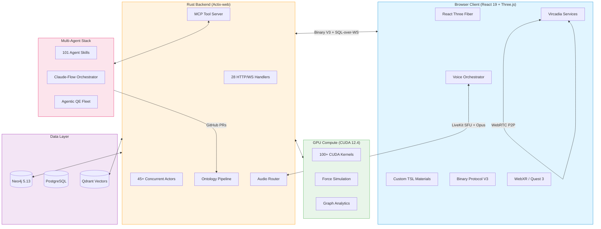
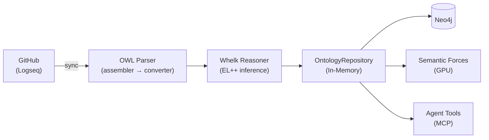

<div align="center">

<picture>
  <source media="(prefers-color-scheme: dark)" srcset="./assets/logo-dark.svg">
  <source media="(prefers-color-scheme: light)" srcset="./assets/logo-light.svg">
  
</picture>

# VisionFlow

### Real-Time 3D Knowledge Graphs with Autonomous AI Agents

[](https://github.com/DreamLab-AI/VisionFlow/actions)
[](https://github.com/DreamLab-AI/VisionFlow/releases)
[](LICENSE)
[](https://www.rust-lang.org/)
[](https://developer.nvidia.com/cuda-toolkit)

**180K nodes at 60 FPS | 55x GPU acceleration | Multi-user immersive XR | 101 agent skills**

<br/>


<br/>

[Quick Start](#quick-start) | [Architecture](#architecture) | [Documentation](#documentation) | [Contributing](#contributing)

</div>

---

## What is VisionFlow?

VisionFlow transforms static documents into living knowledge ecosystems. It ingests ontologies from Logseq notebooks via GitHub, reasons over them with an OWL 2 EL inference engine, and renders the result as an interactive 3D graph where nodes attract or repel based on their semantic relationships. Users collaborate in the same space through Vircadia-powered multi-user presence, spatial voice, and XR immersion. Autonomous AI agents continuously analyse the graph, propose new knowledge via GitHub PRs, and respond to voice commands through a 4-plane audio routing architecture.

The platform is built on a Rust/Actix-web backend with hexagonal architecture, a React 19 + Three.js frontend, Neo4j graph storage, and 100+ CUDA kernels for GPU-accelerated physics simulation. A containerised multi-agent Docker stack provides 101 specialised skills for everything from code review to 3D rendering.

<div align="center">

<br/>
<em>Interacting with a knowledge graph in an immersive projected environment</em>
</div>

---

## Quick Start

```bash
git clone https://github.com/DreamLab-AI/VisionFlow.git
cd VisionFlow && cp .env.example .env
docker-compose --profile dev up -d
```

| Service | URL | Description |
|:--------|:----|:------------|
| Frontend | http://localhost:3001 | 3D knowledge graph interface |
| API | http://localhost:4000/api | REST and WebSocket endpoints |
| Neo4j Browser | http://localhost:7474 | Graph database explorer |
| Vircadia Server | ws://localhost:3020/world/ws | Multi-user WebSocket endpoint |

<details>
<summary><strong>Enable voice routing</strong></summary>

```bash
docker-compose -f docker-compose.yml -f docker-compose.voice.yml --profile dev up -d
```

Adds LiveKit SFU (port 7880), turbo-whisper STT (CUDA), and Kokoro TTS.

</details>

<details>
<summary><strong>Enable multi-user XR</strong></summary>

```bash
docker-compose -f docker-compose.yml -f docker-compose.vircadia.yml --profile dev up -d
```

Adds Vircadia World Server with avatar sync, spatial audio, and collaborative graph editing.

</details>

<details>
<summary><strong>Native build (Rust + CUDA)</strong></summary>

```bash
curl --proto '=https' --tlsv1.2 -sSf https://sh.rustup.rs | sh
git clone https://github.com/DreamLab-AI/VisionFlow.git
cd VisionFlow && cp .env.example .env
cargo build --release --features gpu
cd client && npm install && npm run build && cd ..
./target/release/webxr
```

</details>

---

## Architecture



<details>
<summary><strong>Hexagonal Architecture (Ports & Adapters)</strong></summary>

VisionFlow follows strict hexagonal architecture. Business logic in `src/services/` depends only on port traits defined in `src/ports/`. Concrete implementations live in `src/adapters/`, swapped at startup via dependency injection.

```mermaid
flowchart LR
    subgraph Ports["src/ports/ (Traits)"]
        GP[GraphRepository]
        KG[KnowledgeGraphRepository]
        OR[OntologyRepository]
        IE[InferenceEngine]
        GPA[GpuPhysicsAdapter]
        GSA[GpuSemanticAnalyzer]
        SR[SettingsRepository]
    end

    subgraph Adapters["src/adapters/ (Implementations)"]
        Neo4jGraph[Neo4jGraphRepository]
        Neo4jOntology[Neo4jOntologyRepository]
        Whelk[WhelkInferenceEngine]
        CudaPhysics[PhysicsOrchestratorAdapter]
        CudaSemantic[GpuSemanticAnalyzerAdapter]
        Neo4jSettings[Neo4jSettingsRepository]
    end

    subgraph Services["src/services/ (Business Logic)"]
        OQS[OntologyQueryService]
        OMS[OntologyMutationService]
        GPS[GitHubPRService]
        OPS[OntologyPipelineService]
    end

    Services --> Ports
    Adapters -.->|implements| Ports

    style Ports fill:#e8f5e9,stroke:#4caf50
    style Adapters fill:#fff3e0,stroke:#ff9800
    style Services fill:#e1f5ff,stroke:#0288d1
```



| Port Trait | Adapter | Purpose |
|:-----------|:--------|:--------|
| `GraphRepository` | `ActorGraphRepository` | Graph CRUD via actor messages |
| `KnowledgeGraphRepository` | `Neo4jGraphRepository` | Neo4j Cypher queries |
| `OntologyRepository` | `Neo4jOntologyRepository` | OWL class/axiom storage |
| `InferenceEngine` | `WhelkInferenceEngine` | OWL 2 EL reasoning |
| `GpuPhysicsAdapter` | `PhysicsOrchestratorAdapter` | CUDA force simulation |
| `GpuSemanticAnalyzer` | `GpuSemanticAnalyzerAdapter` | GPU semantic forces |
| `SettingsRepository` | `Neo4jSettingsRepository` | Persistent settings |

</details>

<details>
<summary><strong>Actor System (45+ actors)</strong></summary>

The backend uses Actix actors for supervised concurrency. GPU compute actors run physics simulations, while service actors coordinate ontology processing, client sessions, and voice routing.

**GPU Compute Actors:**

| Actor | Purpose |
|:------|:--------|
| `ForceComputeActor` | Core force-directed layout (CUDA) |
| `StressMajorizationActor` | Stress majorisation algorithm |
| `ClusteringActor` | Graph clustering |
| `PageRankActor` | PageRank computation |
| `ShortestPathActor` | Single-source shortest paths |
| `ConnectedComponentsActor` | Component detection |
| `AnomalyDetectionActor` | Outlier node detection |
| `SemanticForcesActor` | OWL-driven attraction/repulsion |
| `ConstraintActor` | Layout constraint solving |
| `AnalyticsSupervisor` | GPU analytics orchestration |

**Service Actors:**

| Actor | Purpose |
|:------|:--------|
| `GraphStateActor` | Canonical graph state |
| `OntologyActor` | OWL class management |
| `WorkspaceActor` | Multi-workspace isolation |
| `ClientCoordinatorActor` | Per-client session management |
| `PhysicsOrchestratorActor` | GPU physics delegation |
| `SemanticProcessorActor` | NLP query processing |
| `VoiceCommandsActor` | Voice-to-action routing |
| `TaskOrchestratorActor` | Background task scheduling |

</details>

<details>
<summary><strong>Binary WebSocket Protocol V3</strong></summary>

High-frequency updates use a compact binary protocol instead of JSON, achieving 80% bandwidth reduction.

| Type | Code | Size | Purpose |
|:-----|:-----|:-----|:--------|
| `POSITION_UPDATE` | `0x10` | 21 bytes/node | Node positions from GPU physics |
| `AGENT_POSITIONS` | `0x11` | Variable | Batch agent position updates |
| `VELOCITY_UPDATE` | `0x12` | Variable | Node velocity vectors |
| `AGENT_STATE_FULL` | `0x20` | Variable | Complete agent state snapshot |
| `AGENT_STATE_DELTA` | `0x21` | Variable | Incremental agent state |
| `GRAPH_UPDATE` | `0x01` | Variable | Graph topology changes |
| `VOICE_DATA` | `0x02` | Variable | Opus audio frames |
| `SYNC_UPDATE` | `0x50` | Variable | Multi-user sync |
| `SELECTION_UPDATE` | `0x52` | Variable | Collaborative selection |
| `VR_PRESENCE` | `0x54` | Variable | XR avatar positions |
| `HEARTBEAT` | `0x33` | 1 byte | Connection keepalive |
| `BACKPRESSURE_ACK` | `0x34` | Variable | Flow control |

Features: delta encoding, flate2 streaming compression, path-registry ID compression.

</details>

---

## Core Capabilities

### GPU-Accelerated Physics

100+ CUDA kernels run server-authoritative graph layout. Clients receive position updates via the binary protocol and apply optimistic tweening for smooth 60 FPS rendering. Semantic relationships from the ontology influence physical forces — `subClassOf` creates attraction, `disjointWith` creates repulsion.

| Metric | Result |
|:-------|-------:|
| Max nodes at 60 FPS | 180,000 |
| GPU vs CPU speedup | 55x |
| Position update size | 21 bytes/node |
| WebSocket latency | 10ms |

### Ontology Pipeline



The ontology pipeline syncs Logseq markdown from GitHub, parses OWL 2 EL axioms, runs Whelk inference for subsumption and consistency checking, and stores results in both Neo4j (persistent) and an in-memory `OntologyRepository` (fast access). GPU semantic forces use the ontology to drive graph layout physics.

Explore a live ontology dataset at **[narrativegoldmine.com](https://www.narrativegoldmine.com)** — a 2D interactive graph and data explorer built on the same ontology data that VisionFlow renders in 3D.

<details>
<summary><strong>Logseq ontology input (source data)</strong></summary>

<br/>

| Ontology metadata | Graph structure |
|:-:|:-:|
|  |  |
| OWL entity page with category, hierarchy, and source metadata | Graph view showing semantic clusters (leakage_metrics, ai_subsystem, regulation) |


*Dense knowledge graph in Logseq — the raw ontology that VisionFlow ingests, reasons over, and renders in 3D*

</details>

### Voice Routing (4-Plane Architecture)

| Plane | Direction | Scope | Trigger |
|:------|:----------|:------|:--------|
| 1 | User mic → turbo-whisper STT → Agent | Private | PTT held |
| 2 | Agent → Kokoro TTS → User ear | Private | Agent responds |
| 3 | User mic → LiveKit SFU → All users | Public (spatial) | PTT released |
| 4 | Agent TTS → LiveKit → All users | Public (spatial) | Agent configured public |

Opus 48kHz mono end-to-end. HRTF spatial panning from Vircadia entity positions.

### Ontology Agent Tools (MCP)

7 tools exposed via Model Context Protocol for AI agent read/write access to the knowledge graph:

| Tool | Purpose |
|:-----|:--------|
| `ontology_discover` | Semantic keyword search with Whelk inference expansion |
| `ontology_read` | Enriched note with axioms, relationships, schema context |
| `ontology_query` | Validated Cypher execution with schema-aware label checking |
| `ontology_traverse` | BFS graph traversal from starting IRI |
| `ontology_propose` | Create/amend notes → consistency check → GitHub PR |
| `ontology_validate` | Axiom consistency check against Whelk reasoner |
| `ontology_status` | Service health and statistics |

### Multi-User XR

<div align="center">

<br/>
<em>Multi-user immersive knowledge graph — users collaborate inside a projected 3D graph space</em>
</div>

<br/>

Vircadia World Server provides spatial presence, collaborative graph editing, and avatar synchronisation. The client detects Quest headsets (Oculus/Pico) and applies XR optimisations: foveated rendering, DPR capping at 1.0, dynamic resolution scaling. `CollaborativeGraphSync` handles multi-user selections, annotations, and conflict resolution with jitter-threshold reconciliation.

### Rendering Pipeline

Custom Three.js TSL (Three Shading Language) materials for node and edge visualisation:

| Material | Effect |
|:---------|:-------|
| `GemNodeMaterial` | Primary node material with analytics-driven colour |
| `CrystalOrbMaterial` | Depth-pulsing emissive with cosmic spectrum + Fresnel |
| `AgentCapsuleMaterial` | Bioluminescent heartbeat pulse driven by activity level |
| `GlassEdgeMaterial` | Animated flow emissive for relationship edges |

Post-processing via `GemPostProcessing` with bloom, colour grading, and depth effects.

<details>
<summary><strong>Full demo recording (39 MB)</strong></summary>

<br/>

<div align="center">

</div>

</details>

---

## Multi-Agent Docker Stack

<details>
<summary><strong>101 specialised agent skills</strong></summary>

The `multi-agent-docker/` container provides a complete AI orchestration environment with Claude-Flow coordination and 101 skill modules:

**AI & Reasoning**
- `deepseek-reasoning` `perplexity` `perplexity-research` `pytorch-ml`
- `reasoningbank-intelligence` `reasoningbank-agentdb` `anthropic-examples-and-templates`

**Development & Quality**
- `build-with-quality` `rust-development` `pair-programming` `agentic-qe`
- `verification-quality` `performance-analysis` `github-code-review`

**Agent Orchestration**
- `hive-mind-advanced` `swarm-advanced` `swarm-orchestration`
- `flow-nexus-neural` `flow-nexus-platform` `flow-nexus-swarm`
- `agentic-lightning` `stream-chain`

**Knowledge & Ontology**
- `ontology-core` `ontology-enrich` `import-to-ontology`
- `logseq-formatted` `docs-alignment` `jss-memory`

**Creative & Media**
- `blender` `comfyui` `comfyui-3d` `canvas-design`
- `ffmpeg-processing` `imagemagick` `algorithmic-art`

**Infrastructure & DevOps**
- `docker-manager` `docker-orchestrator` `kubernetes-ops`
- `linux-admin` `tmux-ops` `infrastructure-manager`

**Automation & Integration**
- `playwright` `chrome-devtools` `jupyter-notebooks`
- `github-workflow-automation` `github-release-management` `github-multi-repo`
- `slack-gif-creator` `graphana-monitor` `network-analysis`

**Document Processing**
- `latex-documents` `docx` `xlsx` `pptx` `pdf` `text-processing`

**Architecture & Design**
- `sparc-methodology` `prd2build` `wardley-maps` `mcp-builder`
- `v3-ddd-architecture` `v3-security-overhaul` `v3-performance-optimization`

</details>

---

## Technology Stack

<details>
<summary><strong>Full technology breakdown</strong></summary>

| Layer | Technology | Detail |
|:------|:-----------|:-------|
| **Backend** | Rust 1.75+, Actix-web | 373 files, 168K LOC, hexagonal architecture |
| **Frontend** | React 19, Three.js 0.182, R3F | 377 files, 26K LOC, TypeScript 5.9 |
| **Graph DB** | Neo4j 5.13 | Primary store, Cypher queries, bolt protocol |
| **Relational DB** | PostgreSQL 15 | Vircadia World Server entity storage |
| **Vector DB** | Qdrant | Semantic similarity search |
| **GPU** | CUDA 12.4 | 100+ kernels via cudarc/cust crates |
| **Ontology** | OWL 2 EL, Whelk-rs | EL++ subsumption, consistency checking |
| **XR** | WebXR, @react-three/xr | Meta Quest 3, hand tracking, foveated rendering |
| **Multi-User** | Vircadia World Server | Avatar sync, spatial audio, entity CRUD |
| **Voice** | LiveKit SFU | turbo-whisper STT, Kokoro TTS, Opus codec |
| **Protocol** | Binary V3 | 21-byte position updates, delta encoding |
| **Auth** | Nostr NIP-07 | Browser extension signing, relay integration |
| **Agents** | MCP, Claude-Flow | 101 skills, 7 ontology tools |
| **AI/ML** | GraphRAG, RAGFlow | Knowledge retrieval, inference |
| **Build** | Vite 6, Vitest, Playwright | Frontend build, unit tests, E2E tests |
| **Infra** | Docker Compose | 10 compose files, multi-profile deployment |
| **CI** | GitHub Actions | Build, test, docs quality, ontology federation |

</details>

---

## Performance

| Metric | Result | Conditions |
|:-------|-------:|:-----------|
| Max nodes at 60 FPS | 180,000 | RTX 4080, CUDA 12.4 |
| GPU physics speedup | 55x | vs single-threaded CPU |
| WebSocket latency | 10ms | Local network |
| Bandwidth reduction | 80% | Binary V3 vs JSON |
| Concurrent users | 250+ | Vircadia World Server |
| Position update size | 21 bytes | Per node per frame |
| Agent concurrency | 50+ | Via actor supervisor tree |

---

## Documentation

VisionFlow uses the [Diataxis](https://diataxis.fr/) documentation framework — 243 markdown files organised into four categories:

| Category | Path | Content |
|:---------|:-----|:--------|
| **Tutorials** | `docs/tutorials/` | First graph, digital twin, protein folding, multiplayer |
| **How-To Guides** | `docs/how-to/` | Deployment, agents, features, operations, development |
| **Explanation** | `docs/explanation/` | Architecture, concepts, system overview, design decisions |
| **Reference** | `docs/reference/` | API specs, database schemas, port/adapter catalogue |

Key entry points:

- [Full Documentation Hub](docs/README.md)
- [Architecture Overview](docs/explanation/system-overview.md)
- [Project Structure](docs/how-to/development/02-project-structure.md)
- [Ontology Agent Tools](docs/how-to/agents/ontology-agent-tools.md)
- [Voice Routing](docs/how-to/features/voice-routing.md)
- [Docker Compose Guide](docs/how-to/deployment/docker-compose-guide.md)
- [Hexagonal Architecture](docs/explanation/architecture/patterns/hexagonal-cqrs.md)

---

## Development

### Prerequisites

- **Rust** 1.75+ with cargo
- **Node.js** 20+ with npm
- **Docker** and Docker Compose
- **CUDA** 12.4 (optional, for GPU acceleration)

### Build and Test

```bash
# Backend
cargo build --release
cargo test

# Frontend
cd client && npm install && npm run build && npm test

# Integration tests
cargo test --test ontology_agent_integration_test
```

<details>
<summary><strong>Environment variables</strong></summary>

Copy `.env.example` and configure:

| Variable | Description |
|:---------|:------------|
| `NEO4J_URI` | Neo4j bolt connection (default: `bolt://localhost:7687`) |
| `NEO4J_USER` / `NEO4J_PASSWORD` | Neo4j credentials |
| `VITE_VIRCADIA_ENABLED` | Enable Vircadia multi-user (`true`/`false`) |
| `VITE_VIRCADIA_SERVER_URL` | Vircadia World Server WebSocket URL |
| `VITE_VIRCADIA_AUTH_TOKEN` | Vircadia authentication token |
| `VITE_VIRCADIA_AUTH_PROVIDER` | Auth provider (`system` or `nostr`) |
| `VITE_VIRCADIA_ENABLE_SPATIAL_AUDIO` | Enable HRTF spatial audio |
| `VITE_QUEST3_ENABLE_HAND_TRACKING` | Enable Quest 3 hand tracking |
| `LIVEKIT_URL` | LiveKit server URL for voice routing |
| `LIVEKIT_API_KEY` / `LIVEKIT_API_SECRET` | LiveKit credentials |
| `GITHUB_TOKEN` | GitHub token for ontology PR creation |
| `GITHUB_OWNER` / `GITHUB_REPO` | Target repository for ontology PRs |

</details>

### System Requirements

| Tier | CPU | RAM | GPU | Use Case |
|:-----|:----|:----|:----|:---------|
| **Minimum** | 4-core 2.5GHz | 8 GB | Integrated | Development, < 10K nodes |
| **Recommended** | 8-core 3.0GHz | 16 GB | GTX 1060 / RX 580 | Production, < 50K nodes |
| **Enterprise** | 16+ cores | 32 GB+ | RTX 4080+ (16GB VRAM) | 180K nodes, multi-user XR |

**Platform Support:** Linux (full GPU), macOS (CPU-only), Windows (WSL2), Meta Quest 3 (Beta)

---

## Project Structure

```
VisionFlow/
├── src/                          # Rust backend (373 files, 168K LOC)
│   ├── actors/                   #   45+ Actix actors (GPU compute + services)
│   ├── adapters/                 #   Neo4j, Whelk, CUDA adapter implementations
│   ├── handlers/                 #   28 HTTP/WebSocket request handlers
│   ├── services/                 #   Business logic (ontology, voice, agents)
│   ├── ports/                    #   Trait definitions (hexagonal boundaries)
│   ├── gpu/                      #   CUDA kernel bridge, memory, streaming
│   ├── ontology/                 #   OWL parser, reasoning, physics integration
│   ├── protocols/                #   Binary settings protocol
│   ├── models/                   #   Data models
│   └── config/                   #   Configuration management
├── client/                       # React frontend (377 files, 26K LOC)
│   └── src/
│       ├── features/             #   13 feature modules (graph, settings, etc.)
│       ├── services/             #   Voice, WebSocket, auth, integration services
│       ├── rendering/            #   Custom TSL materials, post-processing
│       └── immersive/            #   XR/VR specific code
├── multi-agent-docker/           # AI agent orchestration container
│   ├── skills/                   #   101 agent skill modules
│   ├── mcp-infrastructure/       #   MCP servers, config, tools
│   └── management-api/           #   Agent lifecycle management
├── docs/                         # Diataxis documentation (243 files)
├── tests/                        # Integration tests
├── config/                       # LiveKit, deployment config
└── scripts/                      # Build, migration, testing scripts
```

---

## Contributing

See the [Contributing Guide](docs/how-to/development/contributing.md) for development workflow, branching conventions, and coding standards.

---

## License

[Mozilla Public License 2.0](LICENSE) — Use commercially, modify freely, share changes to MPL files.

---

<div align="center">

[Documentation](docs/README.md) | [Issues](https://github.com/DreamLab-AI/VisionFlow/issues) | [Discussions](https://github.com/DreamLab-AI/VisionFlow/discussions)

</div>
