

# VisionFlow

### Coordination Engineering for Federated Human–AI Intelligence

**Maintainer**: [John O'Hare](https://github.com/jjohare) · **Upstream IP**: [Melvin Carvalho](https://github.com/melvincarvalho) ([JSS](https://github.com/JavaScriptSolidServer/JavaScriptSolidServer), [DID:Nostr](https://github.com/nicholasgasior/did-nostr), [Web Ledgers](https://webledgers.org)) · [MAINTAINERS.md](MAINTAINERS.md)

 

[The Problem](#the-problem) · [Evolution Line](#the-evolution-line) · [Five Substrates](#five-substrates-one-identity) · [Judgment Broker](#the-judgment-broker) · [Scaling](#scaling-model) · [Repository Map](#repository-map) · [Wardley Map](#strategic-positioning)

---

**Federated coordination · Self-sovereign data · OWL 2 EL reasoning · Nostr message passing · Cryptographic provenance · Human-in-the-loop governance · GPU-accelerated sense-making**

 

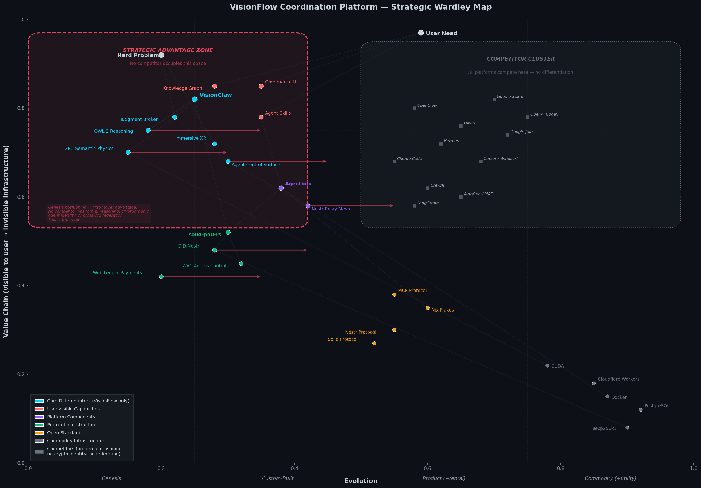

*Every VisionFlow differentiator (left, red zone) sits where no competitor can follow. All 11 competing platforms cluster in the commodity zone (right, grey) where there is no structural differentiation. [Full analysis below.](#strategic-positioning)*

---

## The Problem

Hard problems — climate modelling, drug discovery, organisational transformation, creative production at scale — share a common shape: they require diverse intelligence (human intuition, domain expertise, machine pattern recognition, formal reasoning) to collaborate across trust boundaries, at scales that defeat centralised coordination.

Existing approaches fail in predictable ways:

- **Centralised AI platforms** scale tokens but not trust. One vendor, one failure mode, one billing relationship.
- **Agent frameworks** scale tasks but not governance. Fast and broken is still broken.
- **Knowledge management tools** scale information but not reasoning. More data doesn't mean better decisions.
- **Collaboration platforms** scale communication but not coordination. More Slack channels don't solve alignment.

VisionFlow solves all four simultaneously because the substrate handles identity, provenance, access control, and semantic reasoning as first-class architectural primitives — not bolted-on features.

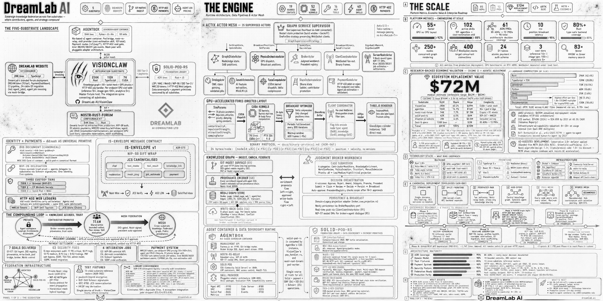

---

## The Evolution Line

The AI industry has moved through a clear progression. Each stage solves the previous stage's limitation and reveals a new one:

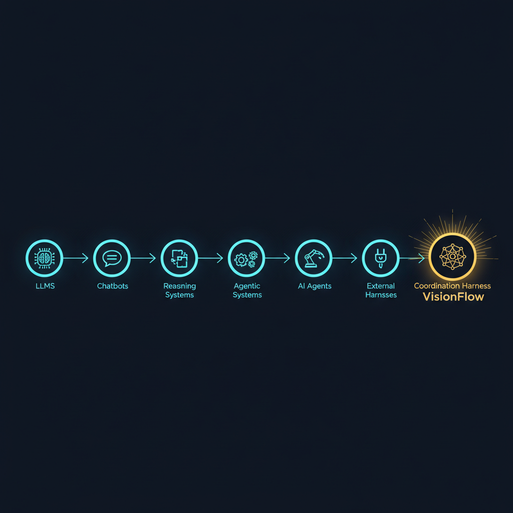

View as interactive diagram

```mermaid
flowchart LR
    LLM["LLM\n(Foundation Models)"]
    CB["Chatbots\n(Conversational UI)"]
    RE["Reasoning\n(Chain-of-Thought)"]
    AG["Agents\n(Tool Use + Planning)"]
    AE["Agentics\n(Multi-Agent Systems)"]
    EH["External Harnesses\n(Agent Runtimes)"]
    CH["Coordination Harness\n(VisionFlow)"]

    LLM -->|"add interface"| CB
    CB -->|"add thinking"| RE
    RE -->|"add tools"| AG
    AG -->|"add collaboration"| AE
    AE -->|"add sovereignty"| EH
    EH -->|"add governance\n+ shared semantics\n+ federated identity"| CH

    style LLM fill:#374151,stroke:#6b7280,color:#fff
    style CB fill:#374151,stroke:#6b7280,color:#fff
    style RE fill:#374151,stroke:#9ca3af,color:#fff
    style AG fill:#1e3a5f,stroke:#3b82f6,color:#fff
    style AE fill:#1e3a5f,stroke:#3b82f6,color:#fff
    style EH fill:#1a0a2a,stroke:#8b5cf6,color:#fff
    style CH fill:#1a1a2e,stroke:#e94560,color:#fff
```

| Stage | What It Adds | What It Still Lacks |
|:------|:-------------|:--------------------|
| **LLM** | Pattern recognition at scale | No interface, no memory, no tools |
| **Chatbot** | Conversational access to the model | No structured reasoning, hallucinates confidently |
| **Reasoning** | Chain-of-thought, self-correction | Can think but can't act |
| **Agent** | Tool use, planning, execution | Acts alone — no collaboration, no oversight |
| **Agentics** | Multi-agent coordination, task decomposition | No persistent identity, no data sovereignty, no governance |
| **External Harness** | Sovereign runtime, privacy, reproducibility | Individual agents are governed but the mesh is not |
| **Coordination Harness** | Shared semantics, federated identity, human-in-the-loop governance, provenance by construction | **VisionFlow occupies this position** |

73% of frontline AI adoption happens without management sign-off. Your workforce is already building shadow workflows, stitching together AI agents, automating procurement shortcuts, inventing cross-functional pipelines that don't appear on any org chart. The question isn't whether your organisation is becoming an agentic mesh. It's whether you'll shape how it forms.

**The personal agent revolution has a governance problem.** Autonomous AI agents are powerful, popular, and ready to act. They've also shown what happens without shared semantics, formal reasoning, or organisational guardrails: unauthorised actions, prompt injection attacks, and enterprises deploying security scanners just to detect rogue agent instances on their own networks.

---

## Five Substrates, One Identity

No single repository *is* VisionFlow. It emerges when five independent systems mesh together through a shared cryptographic identity spine.

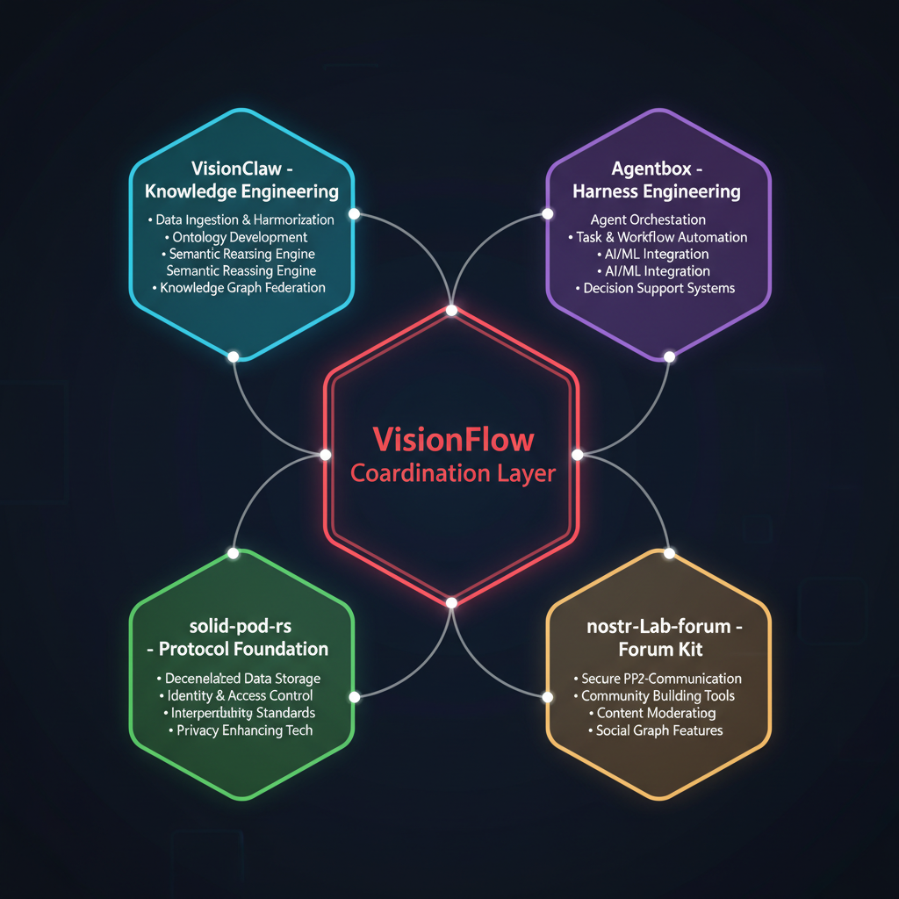

View as interactive diagram

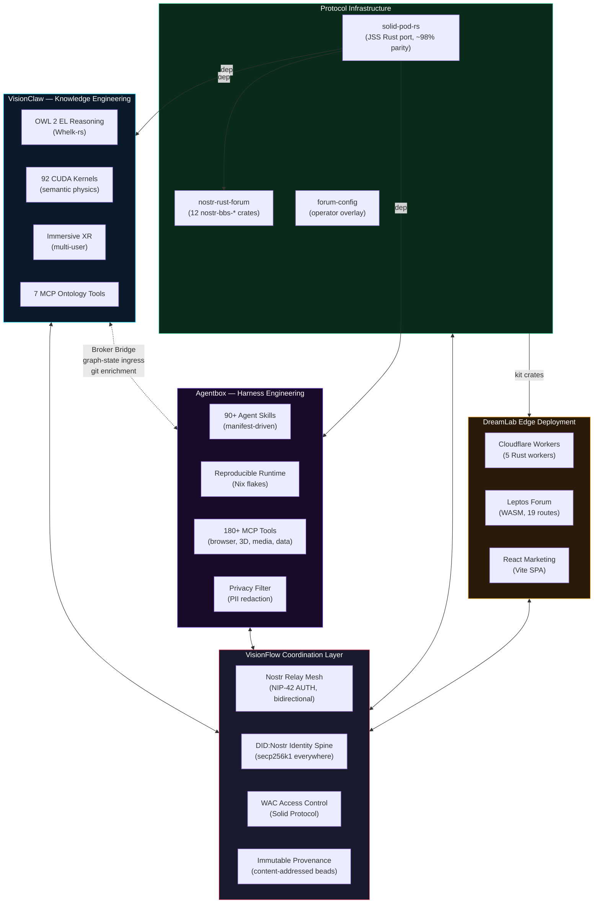
```mermaid
flowchart TB
    subgraph VF["VisionFlow Coordination Layer"]
        direction LR
        MESH["Nostr Relay Mesh\n(NIP-42 AUTH, bidirectional)"]
        DID["DID:Nostr Identity Spine\n(secp256k1 everywhere)"]
        WAC["WAC Access Control\n(Solid Protocol)"]
        PROV["Immutable Provenance\n(content-addressed beads)"]
    end

    subgraph VC["VisionClaw — Knowledge Engineering"]
        OWL["OWL 2 EL Reasoning\n(Whelk-rs)"]
        GPU["92 CUDA Kernels\n(semantic physics)"]
        XR["Immersive XR\n(multi-user)"]
        MCP_VC["7 MCP Ontology Tools"]
    end

    subgraph AB["Agentbox — Harness Engineering"]
        AGENTS["90+ Agent Skills\n(manifest-driven)"]
        NIX["Reproducible Runtime\n(Nix flakes)"]
        TOOLS["180+ MCP Tools\n(browser, 3D, media, data)"]
        PRIV["Privacy Filter\n(PII redaction)"]
    end

    subgraph PROTO["Protocol Infrastructure"]
        SPR["solid-pod-rs\n(JSS Rust port, ~98% parity)"]
        NRF["nostr-rust-forum\n(12 nostr-bbs-* crates)"]
        FC["forum-config\n(operator overlay)"]
    end

    subgraph EDGE["DreamLab Edge Deployment"]
        CF["Cloudflare Workers\n(5 Rust workers)"]
        FORUM["Leptos Forum\n(WASM, 19 routes)"]
        SITE["React Marketing\n(Vite SPA)"]
    end

    VC <--> VF
    AB <--> VF
    PROTO <--> VF
    EDGE <--> VF

    VC <-.->|"Broker Bridge\ngraph-state ingress\ngit enrichment"| AB
    PROTO -->|"kit crates"| EDGE
    SPR -->|"dep"| NRF
    SPR -->|"dep"| AB
    SPR -->|"dep"| VC

    style VF fill:#1a1a2e,stroke:#e94560,color:#fff
    style VC fill:#0a1a2a,stroke:#00d4ff,color:#fff
    style AB fill:#1a0a2a,stroke:#8b5cf6,color:#fff
    style PROTO fill:#0a2a1a,stroke:#10b981,color:#fff
    style EDGE fill:#2a1a0a,stroke:#f59e0b,color:#fff
```

Every actor — human, agent, server, worker — is identified by a single secp256k1 keypair expressed as `did:nostr:<hex-pubkey>`. This identity is:

- **Verified at the relay** via NIP-42 AUTH challenge-response
- **Verified at every HTTP request** via NIP-98 Schnorr signatures (URL + method + body hash binding)
- **Evaluated against WAC ACLs** on every Solid pod read/write
- **Embedded in every provenance bead** as the event author
- **Resolvable as a DID Document** at `/.well-known/did.json`

No shared session store. No token exchange between tiers. The cryptographic primitive is the coordination primitive.

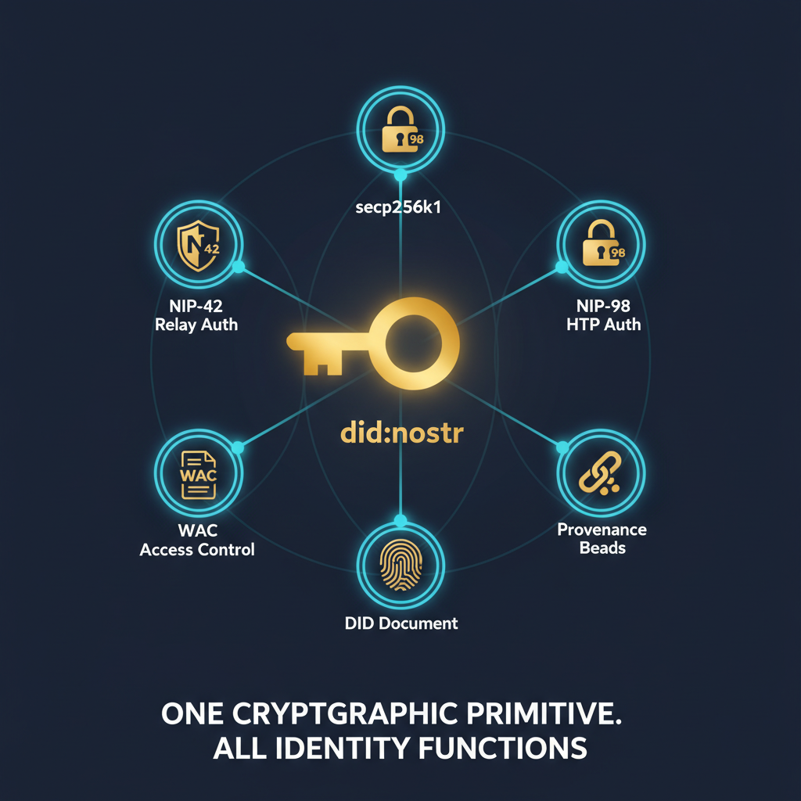

---

### VisionClaw — Knowledge Engineering

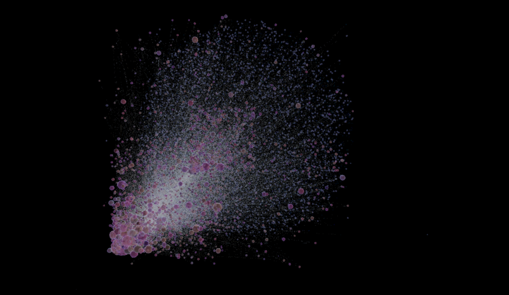

*GPU-accelerated force-directed graph — 934 nodes responding to spring, repulsion, and ontology-driven semantic forces in real time*

The shared semantic substrate where humans and agents reason together. [VisionClaw](https://github.com/DreamLab-AI/VisionClaw) ingests knowledge from Logseq notebooks via GitHub, applies OWL 2 EL formal reasoning through [Whelk-rs](https://github.com/INCATools/whelk-rs), renders it as an interactive 3D graph where nodes attract or repel based on semantic relationships, and exposes everything to AI agents through 7 Model Context Protocol tools.

| Capability | Detail |
|:-----------|:-------|
| **Ontology reasoning** | OWL 2 EL inference engine (Whelk-rs) — `subClassOf` → attraction, `disjointWith` → repulsion in GPU physics |
| **GPU physics** | 92 CUDA kernels across 11 files (6,585 LOC), 55x speedup vs CPU, force-directed + semantic forces + stress majorisation |
| **Immersive XR** | Babylon.js WebXR (Quest 3 optimised) + React Three Fiber (desktop), Vircadia World Server for multi-user presence |
| **MCP tools** | 7 ontology tools: discover, read, query, traverse, propose, validate, status |
| **Hexagonal architecture** | 9 ports, 12 adapters, 114 CQRS handlers, 23 Actix actors |
| **GPU analytics** | K-Means clustering, Louvain communities, LOF anomaly detection, PageRank centrality — all on GPU |

**Key insight:** The ontology isn't just metadata. When `subClassOf` creates attraction and `disjointWith` creates repulsion in the GPU physics engine, the graph's spatial layout *is* the reasoning result. Humans see patterns emerge; agents traverse them algorithmically. The same formal vocabulary means "Deliverable" has the same meaning for a Creative Production agent and a Governance agent.

### Agentbox — Harness Engineering

The reproducible, hardened runtime for sovereign AI agents. [Agentbox](https://github.com/DreamLab-AI/agentbox) provides the container, the tools, the cryptographic identity, and the privacy guarantees.

| Capability | Detail |
|:-----------|:-------|
| **Manifest-driven** | One `agentbox.toml`, one Nix flake — byte-for-byte identical containers. No `npm install` at runtime |
| **Sovereign data** | BIP-340 secp256k1 keypair at bootstrap → `did:nostr` identity root → 18 URN kinds for every entity |
| **Privacy filter** | Embedded 1.5B-parameter MoE model redacts PII before any data reaches storage or logs |
| **Five-slot adapters** | Swap standalone (SQLite + local JSONL) ↔ federated (PostgreSQL pgvector + VisionClaw beads) by editing TOML |
| **180+ tools** | Browser automation, 3D modelling, geospatial, media, data science — all Nix packages, gated by manifest |
| **90+ skills** | Claude Code, Codex, Gemini, DeepSeek, ruflo — with Playwright, ComfyUI, QGIS, Blender, LaTeX, Jupyter |

**Key insight:** Most agent runtimes are tool collections with no provenance, privacy, or reproducible state. Agentbox generates a cryptographic identity root at bootstrap and stamps every action, memory, and event with that identity. When the agent writes to its embedded Solid pod, the data is cryptographically owned. When it leaves the mesh, it takes its data with it.

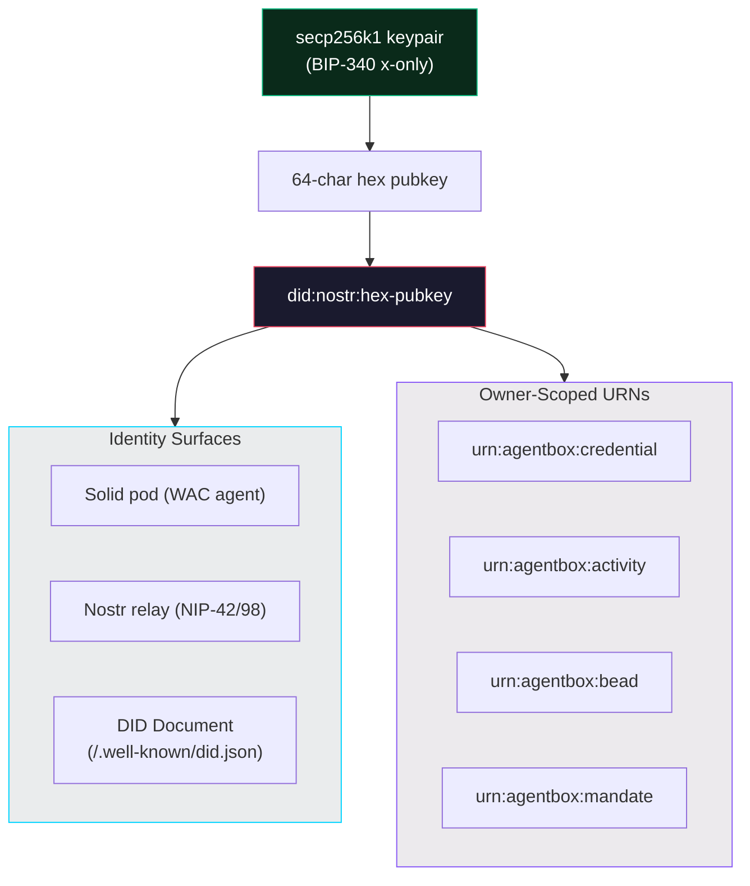
```mermaid
flowchart TB
    KP["secp256k1 keypair\n(BIP-340 x-only)"]
    HEX["64-char hex pubkey"]
    DID["did:nostr:hex-pubkey"]
    KP --> HEX --> DID

    subgraph surfaces["Identity Surfaces"]
        POD["Solid pod (WAC agent)"]
        RELAY["Nostr relay (NIP-42/98)"]
        DIDDOC["DID Document\n(/.well-known/did.json)"]
    end

    subgraph urns["Owner-Scoped URNs"]
        CRED["urn:agentbox:credential"]
        ACTIVITY["urn:agentbox:activity"]
        BEAD["urn:agentbox:bead"]
        MANDATE["urn:agentbox:mandate"]
    end

    DID --> surfaces
    DID --> urns

    style KP fill:#0a2a1a,stroke:#10b981,color:#fff
    style DID fill:#1a1a2e,stroke:#e94560,color:#fff
    style surfaces fill:#0a1a2a15,stroke:#00d4ff
    style urns fill:#1a0a2a15,stroke:#8b5cf6
```

### solid-pod-rs — Cryptographic Foundation

The Rust-native port of [JavaScriptSolidServer (JSS)](https://github.com/JavaScriptSolidServer/JavaScriptSolidServer), Melvin Carvalho's AGPL-3.0 reference implementation of the Solid Protocol. [solid-pod-rs](https://github.com/DreamLab-AI/solid-pod-rs) delivers ~98% strict parity with JSS as a framework-agnostic Rust library.

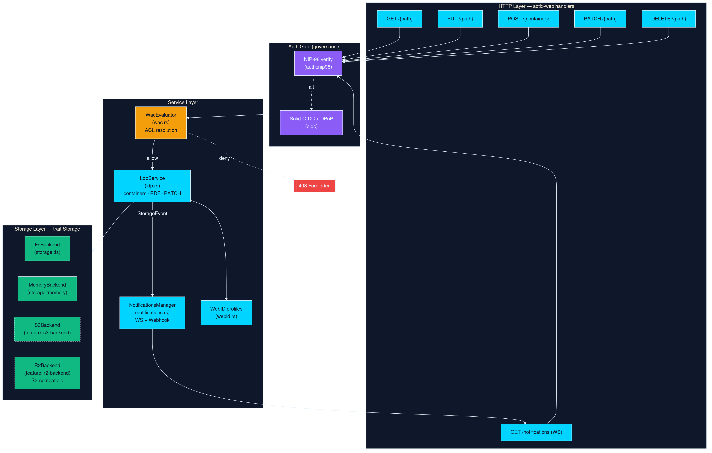

| Capability | Detail |
|:-----------|:-------|
| **Solid Protocol** | LDP CRUD, WAC access control, WebID profiles, content negotiation (Turtle ↔ JSON-LD) |
| **DID:Nostr** | Tier 1 (pubkey → DID Doc), Tier 3 (DID ↔ WebID cross-verification via `alsoKnownAs`) |
| **Authentication** | NIP-98 Schnorr, Solid-OIDC (DPoP), LWS 1.0 / W3C CID v1, WebAuthn passkeys |
| **HTTP 402 Web Ledgers** | PaymentCondition in WAC ACLs, per-read micropayments, MRC20 token chains, BIP-341 Bitcoin anchoring |
| **Dual compile** | Native (Tokio) and WASM (Cloudflare Workers) via `core` feature flag — same crate, edge and server |
| **Git-auto-init** | Pods are clone-able git repositories at provisioning (native deployments) |
| **7 Cargo crates** | core, server, idp, activitypub, nostr, git, didkey |

**Key insight:** solid-pod-rs doesn't just store data — it makes data *sovereign*. WAC ACLs evaluated against `did:nostr` identities mean the pod owner controls access cryptographically. If an organisation leaves the mesh, it takes its data with it. No migration. No export. The data was always theirs.

<strong>JSS Protocol Extensions (beyond core Solid spec)</strong>

These extensions originate from Melvin Carvalho's upstream JSS work. solid-pod-rs tracks all of them:

- **ActivityPub federation** — pods federate with Mastodon-compatible servers via HTTP Signatures
- **Embedded identity provider** — full Solid-OIDC IdP (authorization-code flow, DPoP, JWKS)
- **Git HTTP backend** — clone/push to pod containers directly
- **Nostr integration** — NIP-98 auth, `did:nostr` resolution, embedded NIP-01 relay
- **HTTP 402 payments** — webledger balances, MRC20 token trails, BIP-341 anchoring, AMM liquidity pools
- **End-to-end encryption** — NIP-44 client-side via `did:nostr` keys (zero server-side changes)
- **LWS 1.0 / W3C CID v1** — self-signed JWT auth aligned with W3C Linked Web Storage spec

The SAND stack (Solid + ActivityPub + Nostr + DID) creates a verifiable identity link across all four ecosystems through the `alsoKnownAs` triple on ActivityPub Actor profiles.

### nostr-rust-forum — Governance UI and Relay Kit

The full-stack forum kit built on Nostr. [nostr-rust-forum](https://github.com/DreamLab-AI/nostr-rust-forum) provides passkey-first authentication, zone-based access control, and the Agent Control Surface Protocol — the governance bridge between agents and humans.

| Capability | Detail |
|:-----------|:-------|
| **12 crates** | core, config, mesh, setup-skill, auth-worker, pod-worker, preview-worker, relay-worker, search-worker, rate-limit, forum-client, upstream-canary |
| **Passkey-first auth** | WebAuthn PRF → HKDF → secp256k1 — passkey *is* the Nostr keypair |
| **5 Cloudflare Workers** | Auth, pod, relay (Durable Objects), preview, vector search |
| **Leptos WASM client** | 19 pages, 60+ components, admin panel, governance dashboard with PanelRegistry |
| **Agent Control Surface** | Kinds 31400-31405 — agents publish control panels, humans approve/reject with NIP-98 signatures |
| **Federated NIP-05** | Resolves against D1 whitelist first, falls back to user's pod over HTTP |
| **Governance D1 schema** | 4 tables: agent_registry, broker_cases, governance_roles, governance_actions |

### DreamLab Edge — Branded Deployment

The user-facing surface: [dreamlab-ai-website](https://github.com/DreamLab-AI/dreamlab-ai-website) — React SPA, Leptos WASM forum, and five Cloudflare Workers. Consumes protocol infrastructure as library crates. Demonstrates VisionFlow at production scale on [dreamlab-ai.com](https://www.dreamlab-ai.com).

---

## The Judgment Broker

The Judgment Broker is VisionFlow's distributed business decision system. It spans three repositories — VisionClaw's `BrokerActor` (case triage + ontology grounding), nostr-rust-forum's governance dashboard (human decision surface), and Agentbox's Nostr Bridge (agent relay subscriber). Together they create a human-in-the-loop governance plane that is immutable by construction.

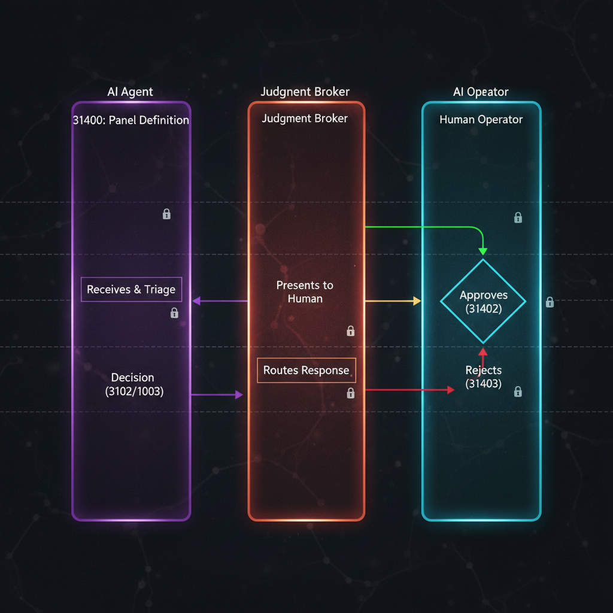

View as interactive diagram

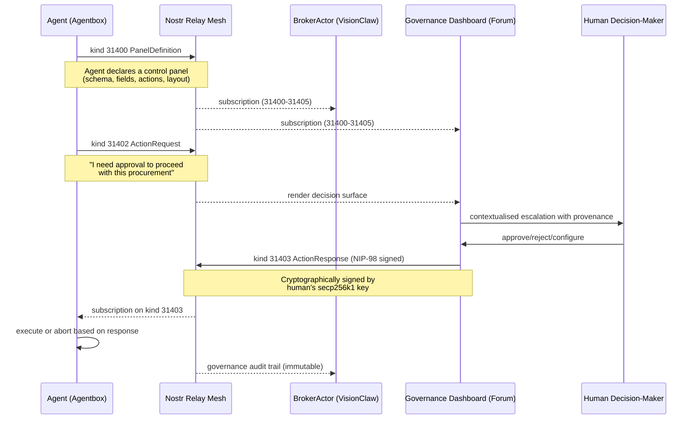
```mermaid
sequenceDiagram
    participant Agent as Agent (Agentbox)
    participant Relay as Nostr Relay Mesh
    participant Broker as BrokerActor (VisionClaw)
    participant Forum as Governance Dashboard (Forum)
    participant Human as Human Decision-Maker

    Agent->>Relay: kind 31400 PanelDefinition
    Note over Agent,Relay: Agent declares a control panel<br/>(schema, fields, actions, layout)
    Relay-->>Broker: subscription (31400-31405)
    Relay-->>Forum: subscription (31400-31405)

    Agent->>Relay: kind 31402 ActionRequest
    Note over Agent,Relay: "I need approval to proceed<br/>with this procurement"
    Relay-->>Forum: render decision surface
    Forum->>Human: contextualised escalation with provenance

    Human->>Forum: approve/reject/configure
    Forum->>Relay: kind 31403 ActionResponse (NIP-98 signed)
    Note over Forum,Relay: Cryptographically signed by<br/>human's secp256k1 key

    Relay-->>Agent: subscription on kind 31403
    Agent->>Agent: execute or abort based on response
    Relay-->>Broker: governance audit trail (immutable)
```

| Kind | Name | Direction | Purpose |
|:-----|:-----|:----------|:--------|
| 31400 | PanelDefinition | Agent → Relay | Declare a control panel (schema, fields, actions, layout) |
| 31401 | PanelState | Agent → Relay | Publish current panel data snapshot |
| 31402 | ActionRequest | Agent → Relay | Request a human decision (approve/reject/configure) |
| 31403 | ActionResponse | Human → Relay | Respond with NIP-98 signed decision |
| 31404 | PanelUpdate | Agent → Relay | Incremental state diff |
| 31405 | PanelRetired | Agent → Relay | Retire a control panel |

**Governance is an accelerant, not a bottleneck.** When agents know their authority boundary and surface exceptions cleanly, the 90% of decisions that don't need human judgment flow without friction. The 10% that do get clean, contextualised escalation with full provenance. Every governance decision is an immutable Nostr event with a `prior_decision_id` chain — auditors traverse from any point back to first principles. This isn't an audit log; it's a structural guarantee.

### Cross-Substrate Event Kinds

| Kind Range | Owner | Purpose |
|:-----------|:------|:--------|
| 1, 4, 42 | Forum users | Text notes, DMs, channel messages |
| 27235 | Any authenticated actor | NIP-98 HTTP auth tokens |
| 30001 | VisionClaw | Provenance beads (content-addressed) |
| 30910-30916 | Forum admins | Moderation (ban, mute, warning, report) |
| 31400-31405 | Registered agents | Agent Control Surface (panel, state, action, response) |
| 38000-38201 | Agentbox agents | Agent intent, job estimates, settlements |

---

## Coordination Topology

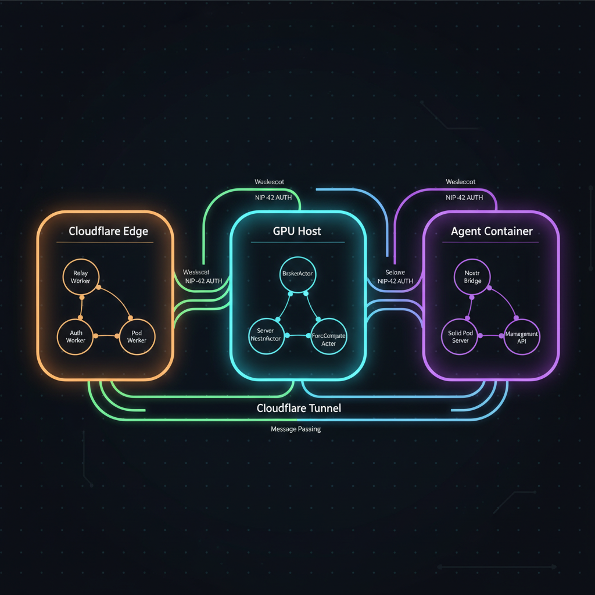

View as interactive diagram

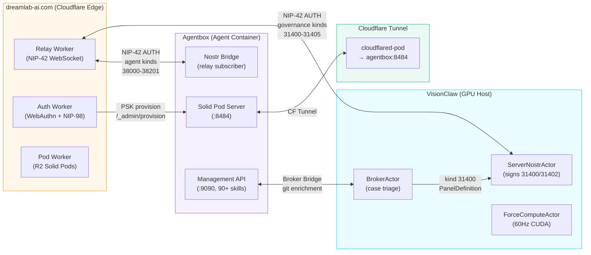
```mermaid
flowchart LR
    subgraph SITE["dreamlab-ai.com (Cloudflare Edge)"]
        RW["Relay Worker\n(NIP-42 WebSocket)"]
        AW["Auth Worker\n(WebAuthn + NIP-98)"]
        PW["Pod Worker\n(R2 Solid Pods)"]
    end

    subgraph VC_HOST["VisionClaw (GPU Host)"]
        BA["BrokerActor\n(case triage)"]
        SNA["ServerNostrActor\n(signs 31400/31402)"]
        PHYSICS["ForceComputeActor\n(60Hz CUDA)"]
    end

    subgraph AB_HOST["Agentbox (Agent Container)"]
        NB["Nostr Bridge\n(relay subscriber)"]
        SP["Solid Pod Server\n(:8484)"]
        MA["Management API\n(:9090, 90+ skills)"]
    end

    subgraph TUNNEL["Cloudflare Tunnel"]
        CFT["cloudflared-pod\n→ agentbox:8484"]
    end

    RW <-->|"NIP-42 AUTH\ngovernance kinds\n31400-31405"| SNA
    RW <-->|"NIP-42 AUTH\nagent kinds\n38000-38201"| NB
    BA -->|"kind 31400\nPanelDefinition"| SNA
    AW -->|"PSK provision\n/_admin/provision"| SP
    SP <-->|"CF Tunnel"| CFT
    MA <-->|"Broker Bridge\ngit enrichment"| BA

    style SITE fill:#f59e0b15,stroke:#f59e0b
    style VC_HOST fill:#00d4ff15,stroke:#00d4ff
    style AB_HOST fill:#8b5cf615,stroke:#8b5cf6
    style TUNNEL fill:#10b98115,stroke:#10b981
```

### Two-Tier Pod Architecture

| Tier | Host | Storage | Git | Provisioning | Identity |
|:-----|:-----|:--------|:----|:-------------|:---------|
| **CF Workers** | Cloudflare edge | R2 + KV | No (runtime limitation) | Auto at registration | `did:nostr` |
| **Native (Agentbox)** | Docker + CF Tunnel | Host filesystem | Yes (`/_git/<pk>/`) | Admin PSK via auth-worker | `did:nostr` |

Both tiers verify NIP-98 independently. Same passkey-derived keypair authenticates to both. No shared session store, no token exchange. The identity is portable because the cryptographic primitive is portable.

---

## Scaling Model

VisionFlow scales along three axes simultaneously:

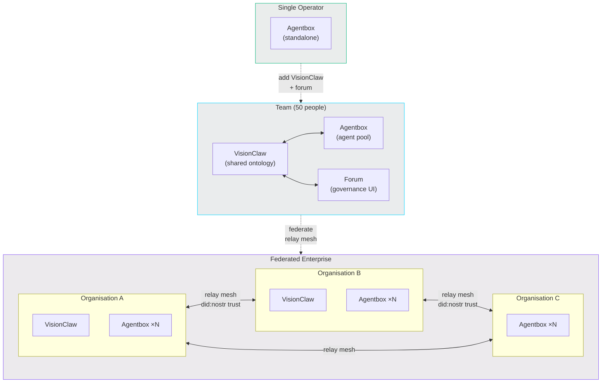
```mermaid
flowchart TB
    subgraph SINGLE["Single Operator"]
        AB1["Agentbox\n(standalone)"]
    end

    subgraph TEAM["Team (50 people)"]
        VC1["VisionClaw\n(shared ontology)"]
        AB2["Agentbox\n(agent pool)"]
        FORUM1["Forum\n(governance UI)"]
        VC1 <--> AB2
        VC1 <--> FORUM1
    end

    subgraph ENTERPRISE["Federated Enterprise"]
        subgraph ORG_A["Organisation A"]
            VC_A["VisionClaw"]
            AB_A["Agentbox ×N"]
        end
        subgraph ORG_B["Organisation B"]
            VC_B["VisionClaw"]
            AB_B["Agentbox ×N"]
        end
        subgraph ORG_C["Organisation C"]
            AB_C["Agentbox ×N"]
        end
        ORG_A <-->|"relay mesh\ndid:nostr trust"| ORG_B
        ORG_B <-->|"relay mesh\ndid:nostr trust"| ORG_C
        ORG_A <-->|"relay mesh"| ORG_C
    end

    SINGLE -.->|"add VisionClaw\n+ forum"| TEAM
    TEAM -.->|"federate\nrelay mesh"| ENTERPRISE

    style SINGLE fill:#0a2a1a15,stroke:#10b981
    style TEAM fill:#0a1a2a15,stroke:#00d4ff
    style ENTERPRISE fill:#1a0a2a15,stroke:#8b5cf6
```

### Token Efficiency (Single Operator)

One Agentbox in standalone mode. Local SQLite beads, local Solid pod, local JSONL events. 90+ skills available, 180+ tools, privacy filter active. A single operator solving tasks with AI agents — token-efficient because the agent has sovereign tools, persistent memory, and doesn't need to rediscover context each session.

**Cost profile:** One API key. One container. Minutes to deploy.

### Governed Collaboration (Team)

VisionClaw + forum + Agentbox on a shared relay mesh. The ontology provides shared vocabulary. The Judgment Broker provides human oversight. Agents publish control panels; humans approve actions. Every mutation passes through a GitHub PR. Every agent decision traces back through provenance beads.

**Cost profile:** One GPU host (VisionClaw), one agent container (Agentbox), Cloudflare Workers (forum). 50-person team validated at DreamLab.

### Federated Intelligence (Enterprise / Cross-Organisation)

Multiple Agentbox instances federated via the Nostr relay mesh. Governance event kinds (31400-31405) propagate across substrates. Each node is independently hardened (Nix reproducible, read-only filesystem, capability-dropped, seccomp-profiled). Nodes trust each other via `did:nostr` identity verification, not network topology.

**Cost profile:** Horizontal. Add nodes. Each node is sovereign — it owns its data, controls its agents, sets its trust thresholds. The mesh coordinates; no node controls.

---

## Why This Architecture

### Platform Agnostic

solid-pod-rs compiles to both native Rust (Tokio) and WASM (Cloudflare Workers). The same crate powers edge pods on R2 and native pods on host filesystems. Agents run in Nix containers on any Linux host. The forum runs on CF Workers. VisionClaw runs on any CUDA-capable machine. No vendor lock-in at any layer.

### Self-Sovereign Data

Every actor owns a Solid pod. WAC ACLs — evaluated against `did:nostr` identities — control access. The pod is the canonical data store; the relay mesh is the coordination transport. If an organisation leaves the mesh, it takes its data with it. No migration. No export. The data was always theirs.

### Provenance by Construction

Every write is signed. Every event is content-addressed. Every governance decision is an immutable Nostr event with a `prior_decision_id` provenance chain. Auditors traverse the chain from any point back to first principles. This isn't an audit log — it's a structural guarantee.

### Privacy by Default

Every Agentbox runs an embedded privacy filter — a 1.5B-parameter MoE model that intercepts every persistent write and redacts PII before it reaches storage, logs, or the mesh. The filter operates at the adapter layer, not the application layer, so it cannot be bypassed by new code paths.

### Formal Reasoning, Not Just Search

VisionClaw doesn't do keyword search — it does OWL 2 EL subsumption checking. When an agent asks "what is related to X?", the answer comes from a formal reasoner that understands `subClassOf`, `equivalentClass`, transitivity, and existential restrictions. The inference is provably correct within the Description Logic, not probabilistically approximate.

---

## The Insight Ingestion Loop

How shadow workflows become sanctioned organisational intelligence:

```mermaid
flowchart LR
    D["DISCOVERY\nPassive agent monitoring\ndetects the pattern"]
    C["CODIFICATION\nMaps the new path\nas a proposed DAG —\nOWL 2 formalised\nwith provenance"]
    V["VALIDATION\nThe Judgment Broker\nreviews for strategic\nfit & bias"]
    I["INTEGRATION\nPromoted to live mesh\nwith SLAs, ownership,\nquality"]
    A["AMPLIFICATION\nMesh propagates\npattern to other\nteams where it applies"]

    D --> C --> V --> I --> A

    style D fill:#0A2A1A,stroke:#10B981
    style C fill:#0A1A2A,stroke:#00D4FF
    style V fill:#1A0A2A,stroke:#8B5CF6
    style I fill:#0A1A2A,stroke:#00D4FF
    style A fill:#0A2A1A,stroke:#10B981
```

---

## Strategic Positioning

*Refer to the [Wardley map above](#visionflow) for visual context.*

### Reading the Map

A Wardley map positions components along two axes: **evolution** (left = novel, right = commodity) and **value chain** (top = user-visible, bottom = invisible infrastructure). The strategic insight is in *where the empty space is*.

**The red zone (left)** is VisionFlow's Strategic Advantage Zone. Every differentiating capability — OWL 2 formal reasoning, GPU semantic physics, the Judgment Broker, cryptographic agent identity, Immersive XR — sits here because *no competitor has built them*. This isn't a sign of immaturity; it's a moat. Genesis positioning means first-mover advantage in capabilities that take years to replicate.

**The grey zone (right)** is the Competitor Cluster. All 11 competing platforms — Google Spark, OpenAI Codex, Devin, Claude Code, OpenClaw, Hermes, CrewAI, AutoGen, LangGraph, Cursor, Jules — cluster in the Product/Commodity space. They compete on execution speed, model quality, and pricing. They differentiate on nothing structural. Switch one for another and your architecture doesn't change.

**The evolution arrows** show where VisionFlow is actively investing to move capabilities rightward — from Genesis toward Product — making them accessible to broader adoption without surrendering the structural advantage:

| Component | Current | Evolving Toward | What This Means |
|:----------|:--------|:----------------|:----------------|
| **OWL 2 Reasoning** | Genesis | Custom-Built → Product | Making formal reasoning accessible through MCP tools and the Insight Ingestion Loop — non-ontologists use it without knowing it |
| **Agent Control Surface** | Genesis | Custom-Built | Standardising kinds 31400-31405 for broader adoption; potential NIP proposal |
| **GPU Semantic Physics** | Genesis | Custom-Built | Ontology-driven forces moving from research prototype to production feature |
| **DID:Nostr** | Custom-Built | Product | Pushing the identity bridge toward ecosystem-wide adoption |
| **Nostr Relay Mesh** | Custom-Built | Product | Moving from standalone to federated mode for enterprise-scale deployment |
| **Web Ledger Payments** | Genesis | Custom-Built | Building agent micropayment infrastructure for token-priced services |

### Why This Matters

**Competitors can't move left.** Adding formal reasoning, cryptographic identity, or self-sovereign data to an existing platform requires rearchitecting from the protocol layer up. Google Spark can't bolt on OWL 2 EL reasoning — it would need to rebuild its data model. CrewAI can't add `did:nostr` identity — it has no identity layer at all. These aren't features; they're architectural decisions that compound over time.

**VisionFlow moves right naturally.** As each Genesis component matures through use, it becomes more accessible without losing its structural advantage. The Insight Ingestion Loop makes formal reasoning invisible to end users. The passkey-first auth makes `did:nostr` feel like "just logging in." The governance dashboard makes the Judgment Broker feel like "just approving a request." The complexity is real; the user experience hides it.

---

## Competitive Landscape

Every platform below solves part of the coordination problem. VisionFlow is the only architecture that combines cryptographic agent identity, formal reasoning, self-sovereign data, and human-in-the-loop governance as protocol-level primitives rather than application-layer add-ons.

| | Identity | Data Sovereignty | Governance | Formal Reasoning | Federation | Persistent Memory | Open Source | Pricing |
|:---|:---|:---|:---|:---|:---|:---|:---|:---|
| **VisionFlow** | **Cryptographic** (`did:nostr` secp256k1) | **Self-sovereign** (Solid pods, WAC ACLs) | **Protocol-native** (Judgment Broker, kinds 31400-31405) | **OWL 2 EL** (Whelk-rs subsumption) | **Native** (Nostr relay mesh) | **Sovereign** (embedded pods + pgvector) | **Yes** (MPL-2.0 / AGPL-3.0) | Self-hosted |
| **Google Spark** | Session (Google SSO) | Platform-owned (Google Cloud) | Payment approval only | LLM inference | Google ecosystem only | Yes (user preferences) | No | Google AI Ultra subscription |
| **OpenClaw** | Enterprise SSO + verifiable tokens | Strong (self-hosted, no telemetry) | Community foundation (MIT) | LLM inference | Multi-provider, no org federation | Yes (cross-session) | Yes (MIT) | Free + API keys |
| **Claude Code (Hosted)** | Session (SAML/OIDC) | Platform-managed | Permission system | LLM + extended thinking | MCP tool federation | Session-based | CLI open source | $100/mo Max, token-based |
| **Claude Code (Local)** | API key / OAuth | Local files, remote inference | Local permission system | LLM + extended thinking | MCP tool federation | CLAUDE.md + MCP | CLI open source | API token costs |
| **Hermes Agent** | Persistent agent identity | Strong (self-hosted, no tracking) | Container hardening + rollback | LLM inference | Multi-provider, no org federation | Core feature | Yes (MIT) | Free + API keys |
| **OpenAI Codex** | Session (OpenAI account) | Cloud sandbox | Sandbox isolation | LLM inference | No | Per-task only | CLI open source | Pro/Team subscription |
| **Google Jules** | Session (Google account) | Platform-owned (GCP VMs) | PR review (human) | LLM inference (Gemini) | Jules API for CI/CD | Per-task only | No | Free tier + paid |
| **Devin** | Session (account) | Cloud-hosted (VPC option) | Human reviews output | LLM inference | No | Per-task | No | $20/mo Core |
| **Cursor / Windsurf** | Session (account) | Local index, remote inference | Accept/reject in IDE | LLM inference | No | Project-level | No | $20/mo Pro |
| **CrewAI** | None (framework-level) | Self-hostable (OSS core) | Hierarchical delegation | LLM inference | MCP + A2A protocols | Shared memory systems | Core: Yes (MIT) | Free OSS, Enterprise $75K/yr |
| **AutoGen / MS Agent Framework** | Azure AD / Entra ID | Self-hostable + Azure | Checkpointing | LLM + structured planning | A2A + MCP protocols | State checkpointing | Yes (MIT) | Free OSS + Azure costs |
| **LangGraph** | None (app-level) | Self-hostable (OSS core) | First-class human-in-loop API | LLM + graph control flow | Multi-provider | Durable state persistence | Yes (MIT) | Free OSS, LangSmith $39/seat |

### What the Table Reveals

Three structural gaps separate VisionFlow from the field:

1. **No platform does formal reasoning.** Every competitor relies on probabilistic LLM inference. VisionFlow's OWL 2 EL subsumption checking produces provably correct answers within the Description Logic — when it says A is a subclass of B, that's a logical entailment, not a confident guess.

2. **Identity is universally session-based.** Only VisionFlow implements cryptographic agent identity at the protocol level. Every other platform ties identity to an account on someone else's server. When the server goes away, so does the identity — and the audit trail.

3. **No platform federates across organisations.** MCP and A2A enable tool interoperability, but no competitor supports sovereign nodes that trust each other via cryptographic identity verification rather than shared infrastructure. VisionFlow's Nostr relay mesh enables cross-organisational coordination where each node owns its data and sets its own trust thresholds.

---

## Federated Problem-Solving

VisionFlow's architecture is designed for hard problems that require diverse intelligence across trust boundaries. Here's how the mesh operates on real multi-specialism challenges:

### Scenario 1: Climate Modelling Consortium

Three universities, two government agencies, one NGO — each with domain expertise, proprietary datasets, and different compliance requirements.

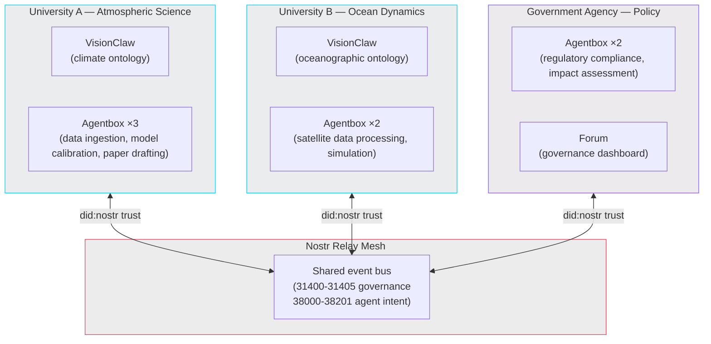
```mermaid
flowchart TB
    subgraph UNI_A["University A — Atmospheric Science"]
        VC_A["VisionClaw\n(climate ontology)"]
        AB_A["Agentbox ×3\n(data ingestion, model calibration, paper drafting)"]
    end

    subgraph UNI_B["University B — Ocean Dynamics"]
        VC_B["VisionClaw\n(oceanographic ontology)"]
        AB_B["Agentbox ×2\n(satellite data processing, simulation)"]
    end

    subgraph GOV["Government Agency — Policy"]
        AB_G["Agentbox ×2\n(regulatory compliance, impact assessment)"]
        FORUM_G["Forum\n(governance dashboard)"]
    end

    subgraph RELAY["Nostr Relay Mesh"]
        R["Shared event bus\n(31400-31405 governance\n38000-38201 agent intent)"]
    end

    UNI_A <-->|"did:nostr trust"| R
    UNI_B <-->|"did:nostr trust"| R
    GOV <-->|"did:nostr trust"| R

    style UNI_A fill:#0a1a2a15,stroke:#00d4ff
    style UNI_B fill:#0a1a2a15,stroke:#00d4ff
    style GOV fill:#1a0a2a15,stroke:#8b5cf6
    style RELAY fill:#1a1a2e15,stroke:#e94560
```

**How it works:**
- Each institution runs its own VisionClaw with domain-specific ontologies. OWL 2 EL reasoning ensures "sea surface temperature anomaly" means the same thing across all three ontologies via shared upper ontology alignment.
- Data agents at each institution process proprietary datasets locally — nothing leaves the sovereign pod unless the WAC ACL explicitly grants access to a specific `did:nostr` identity.
- The policy agency's governance dashboard surfaces cross-institutional findings via the Judgment Broker. A human policy analyst approves or rejects agent-proposed conclusions before they enter the shared knowledge graph.
- Every reasoning chain traces back through content-addressed provenance beads to source data. Peer reviewers traverse the chain to verify methodology.

**Why competitors can't do this:** No other platform combines formal ontology alignment (ensuring cross-institution semantic consistency), cryptographic data sovereignty (each institution controls its own data), and human-in-the-loop governance (policy decisions require signed approval) in a single coordinated mesh.

### Scenario 2: Pharmaceutical Drug Discovery Pipeline

A biotech startup, a contract research organisation (CRO), and a regulatory affairs consultancy collaborating on a novel compound.

| Phase | Agents | Ontology Role | Governance Gate |
|:------|:-------|:-------------|:----------------|
| **Target identification** | Literature mining agents (biotech Agentbox) parse 50K papers | VisionClaw aligns gene ontology + disease ontology | Judgment Broker: senior scientist approves target shortlist |
| **Lead optimisation** | Chemistry agents (CRO Agentbox) run ADMET predictions | Molecular property ontology constrains valid modifications | Judgment Broker: medicinal chemist signs off on candidates |
| **Regulatory pre-submission** | Compliance agents (consultancy Agentbox) map to ICH guidelines | Regulatory ontology maps compound data to required endpoints | Judgment Broker: regulatory affairs lead approves submission package |
| **Audit** | Any auditor traverses provenance beads from submission back to source papers | Every decision is an immutable Nostr event with `prior_decision_id` chain | Full chain of custody without reconstruction |

Each organisation's agents operate within their Solid pod boundary. Cross-organisation data sharing requires explicit WAC grants tied to `did:nostr` identities. The CRO never sees the biotech's proprietary target list; the biotech never sees the CRO's compound library. They collaborate through the shared ontology layer.

### Scenario 3: Creative Production at Scale

A media company producing a 12-episode series with distributed creative teams across five time zones.

| Substrate | Role in Production |
|:----------|:-------------------|
| **VisionClaw** | Production ontology: episodes → scenes → shots → assets → deliverables. Semantic forces cluster related assets visually. |
| **Agentbox (Editorial)** | Script analysis agents parse screenplays, extract entity relationships, flag continuity issues |
| **Agentbox (VFX)** | Asset management agents track 3D models, textures, composites through pipeline stages |
| **Agentbox (Compliance)** | Rights clearance agents verify music licensing, location permissions, talent contracts |
| **Forum** | Governance dashboard: executive producer approves budget exceptions, schedule changes, creative pivots |
| **Judgment Broker** | When VFX cost exceeds threshold → signed approval required. When script change affects continuity across episodes → flagged for showrunner review. |

The ontology doesn't just organise — it *reasons*. If a VFX shot depends on a 3D asset that hasn't been approved, the `subClassOf` chain from "approved deliverable" propagates a constraint through the graph. The GPU physics engine makes the blocked dependency visually obvious — the shot node repels from the "approved" cluster.

---

## Repository Map

| Substrate | Repository | Role | Key Technology |
|:----------|:-----------|:-----|:---------------|
| **VisionFlow** | [DreamLab-AI/VisionFlow](https://github.com/DreamLab-AI/VisionFlow) | Ecosystem guide and coordination architecture | This repository |
| **VisionClaw** | [DreamLab-AI/VisionClaw](https://github.com/DreamLab-AI/VisionClaw) | Knowledge engineering substrate | OWL 2 EL, 92 CUDA kernels, multi-user XR, 7 MCP tools |
| **Agentbox** | [DreamLab-AI/agentbox](https://github.com/DreamLab-AI/agentbox) | Harness engineering runtime | Nix flakes, 90+ skills, 180+ tools, sovereign Solid pods |
| **solid-pod-rs** | [DreamLab-AI/solid-pod-rs](https://github.com/DreamLab-AI/solid-pod-rs) | Cryptographic foundation | JSS Rust port, DID:Nostr, WAC, Web Ledgers, HTTP 402 |
| **nostr-rust-forum** | [DreamLab-AI/nostr-rust-forum](https://github.com/DreamLab-AI/nostr-rust-forum) | Forum kit | 12 crates, passkey auth, governance event routing |
| **dreamlab-ai-website** | [DreamLab-AI/dreamlab-ai-website](https://github.com/DreamLab-AI/dreamlab-ai-website) | Branded deployment | React SPA, WASM forum, operator overlay, Cloudflare Workers |

---

## Real-World Validation

| Deployment | Context | Scale |
|:-----------|:--------|:------|
| **DreamLab Creative Hub** | 50-person creative technology team — live production | ~998 knowledge graph nodes, daily ontology mutations |
| **University of Salford** | Research partnership validating semantic force-directed layout | Multi-institution ontology |
| **THG World Record** | Large-scale multi-user immersive data visualisation | 250+ concurrent XR users |

---

## Upstream

VisionFlow's protocol layer is built on [Melvin Carvalho](https://github.com/melvincarvalho)'s [JavaScriptSolidServer (JSS)](https://github.com/JavaScriptSolidServer/JavaScriptSolidServer) and [DID:Nostr](https://github.com/nicholasgasior/did-nostr). JSS is the AGPL-3.0 reference implementation of the Solid Protocol and the canonical source for the feature set, protocol extensions, and Web Ledger micropayment system. solid-pod-rs is a Rust port; protocol-level decisions defer to the upstream JSS repository.

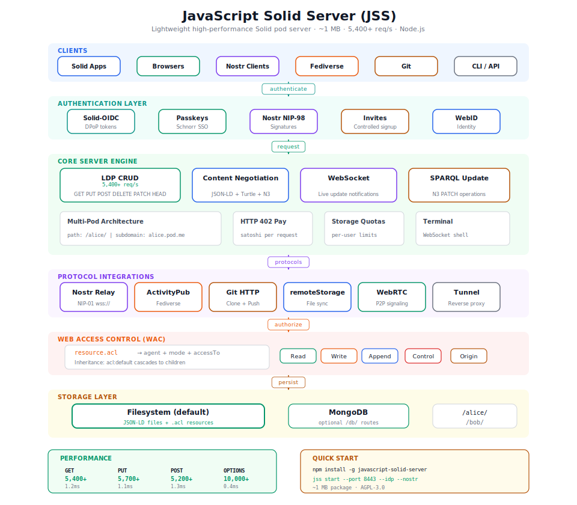

The SAND stack — **S**olid + **A**ctivityPub + **N**ostr + **D**ID — creates a verifiable identity link across four ecosystems. The `alsoKnownAs` triple on an ActivityPub Actor profile binds the Solid WebID, the Nostr pubkey, and the DID document into a single cryptographically verifiable identity chain.

See [Melvin Carvalho's Practical Guide to Solid](https://melvin.me/public/solid/) for a 10-part walkthrough of the JSS payment system.

---

## License

VisionFlow combines components under two licenses:

- **VisionClaw**: [Mozilla Public License 2.0](https://github.com/DreamLab-AI/VisionClaw/blob/main/LICENSE) — use commercially, modify freely, share changes to MPL files
- **solid-pod-rs, Agentbox, nostr-rust-forum**: [AGPL-3.0](https://github.com/DreamLab-AI/solid-pod-rs/blob/main/LICENSE) — network-service copyleft preserving the upstream JSS ecosystem. Commercial licensing available via [Melvin Carvalho](mailto:melvincarvalho@gmail.com)

---

**VisionFlow is built by [DreamLab AI](https://www.dreamlab-ai.com) — coordination engineering for federated human–AI intelligence.**

[VisionClaw](https://github.com/DreamLab-AI/VisionClaw) · [Agentbox](https://github.com/DreamLab-AI/agentbox) · [solid-pod-rs](https://github.com/DreamLab-AI/solid-pod-rs) · [nostr-rust-forum](https://github.com/DreamLab-AI/nostr-rust-forum) · [dreamlab-ai.com](https://www.dreamlab-ai.com)

