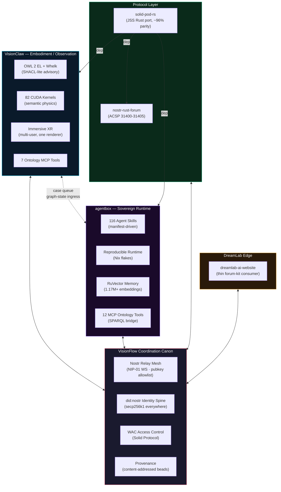

<div align="center">

# VisionFlow

### Coordination Engineering for Federated Human–AI Intelligence

[](docs/architecture/licensing.md)
[](docs/architecture/repository-map.md)
[](docs/protocol/identity-spine.md)

**Maintainer**: [John O'Hare](https://github.com/jjohare) · **Upstream IP**: [Melvin Carvalho](https://github.com/melvincarvalho) ([JSS](https://github.com/JavaScriptSolidServer/JavaScriptSolidServer), [DID:Nostr](https://github.com/nicholasgasior/did-nostr), [Web Ledgers](https://webledgers.org)) · [MAINTAINERS.md](MAINTAINERS.md)

[Ecosystem](#the-ecosystem) · [Architecture](#five-substrates-one-identity) · [Quickstart](#quickstart) · [Docs](docs/README.md) · [Status](#status--remaining-work)

**PDF pitch:** [One-Pager](pdf-reports/visionflow-onepager.pdf) · [Ecosystem Technical Pitch](pdf-reports/visionflow-ecosystem-pitch.pdf)

</div>

---

## What this repository is

Hierarchy was an information-routing protocol bounded by human bandwidth. AI is collapsing the cost of that routing towards zero, so the human role is not eliminated — it is promoted from **router** to **judgment broker**: the person who holds the decision at the intersections a machine should not close on its own.

**VisionFlow is the canon for that thesis.** This repository is the coordination-of-coordination layer for five federated substrates — the ADRs and PRDs, the ecosystem map, the maturity vocabulary, the marketing website, the vision report and the pitch decks. It is the thing that stops five honest local truths from assembling into one collective lie.

**This repo is documentation and website — not a runtime.** The running systems live in the sibling repositories linked below; VisionFlow holds the story, the compatibility record and the honest status ledger that grades those systems against their own code. Its own maturity claim is deliberately the most modest of the set: it ships words, and it is accountable for their accuracy.

<div align="center">


*The differentiating capabilities (OWL reasoning, GPU semantic physics, cryptographic agent identity, human-in-the-loop governance) sit in the genesis-to-custom zone where competitors cluster in commodity execution. Full competitive analysis lives in [`presentation/report`](presentation/report/) and the [ecosystem pitch PDF](pdf-reports/visionflow-ecosystem-pitch.pdf), not here — it is high-churn content and does not belong in the front door.*

</div>

---

## The ecosystem

No single repository *is* VisionFlow. The siblings call the whole the **Dynamic Agentic Mesh** — seven repositories, five running substrates, this canon, and the published corpus. It emerges when five independent systems mesh through one cryptographic identity spine — every actor, human or agent or server, is a single secp256k1 keypair expressed as `did:nostr:<hex-pubkey>`.

| Substrate | Role | Where to run it |
|:----------|:-----|:----------------|
| **[VisionClaw](https://github.com/DreamLab-AI/VisionClaw)** | Flagship engine — ontology-grounded immersive 3D knowledge graph. OWL 2 EL + Whelk reasoning, 82 CUDA kernels of GPU physics, one renderer shared desktop↔headset. *Watch here, judge there — it observes, it never signs a decision.* | Clone the repo; needs a CUDA host. |
| **[agentbox](https://github.com/DreamLab-AI/agentbox)** | Sovereign agent runtime — reproducible Nix container, a `did:nostr` key minted per agent at spawn, 116 skills, RuVector semantic memory, NIP-59 session mirror, Solid pod bridge. *Reproduce, audit, control.* | Clone the repo; `nix` build. |
| **[solid-pod-rs](https://github.com/DreamLab-AI/solid-pod-rs)** | Personal-data-sovereignty layer — Rust Solid pod server (LDP, WAC, NIP-98, DID:Nostr, WebID). Every write is a git-mark commit; high-value writes anchor to Bitcoin. *The exit right sits in the floor, not granted at the door.* | Clone the repo; `cargo` build. |
| **[nostr-rust-forum](https://github.com/DreamLab-AI/nostr-rust-forum)** | Human+agent communication substrate — Nostr-native forum + relay in Rust. The one place a human decision is cryptographically signed (ACSP kinds 31400–31405). *The one place a decision gets signed.* | Clone the repo; Cloudflare Workers + Leptos WASM. |
| **[dreamlab-ai-website](https://github.com/DreamLab-AI/dreamlab-ai-website)** | Commercial face — DreamLab AI company site, a thin consumer of the forum kit at the Cloudflare edge. | Clone the repo. |

Supporting corpus: **[narrativegoldmine](https://github.com/DreamLab-AI/knowledgeGraph)** publishes the readable `public:: true` knowledge graph at [narrativegoldmine.com](https://narrativegoldmine.com) — the same corpus VisionClaw renders in 3D.

### Independent convergence — Block's Buzz

In July 2026 Block (Jack Dorsey) released [**Buzz**](https://github.com/block/buzz), a self-hosted, Nostr-native team-chat + AI-agent + git platform written in Rust. It arrives independently at the substrate this ecosystem has been building since 2022: Nostr events as the source of truth, agents as first-class signed participants with their own keypairs, NIP-42/98 authentication, kind-based extensibility. Read it as industry validation of the direction, stated plainly.

Where Buzz is ahead: its NIP-42 relay gate and git forge are wired end-to-end today, whereas the forum's NIP-42 gate is currently a pubkey allowlist and cross-relay mesh federation is designed, not shipped, on both sides. What Buzz does not carry: OWL 2 EL knowledge-graph grounding, Solid-pod personal-data sovereignty, immersive 3D embodiment, and closed memory/learning loops. That set is the differentiation — not a claim to win by default.

---

## Five Substrates, One Identity

One canonical diagram. The identity spine is the coordination primitive: no shared session store, no token exchange between tiers — the same `did:nostr` keypair is login, WAC principal, provenance author, DID subject and payment account at once.


```mermaid
flowchart TB
    subgraph VF["VisionFlow Coordination Canon"]
        direction LR
        MESH["Nostr Relay Mesh\n(NIP-01 WS · pubkey allowlist)"]
        DID["did:nostr Identity Spine\n(secp256k1 everywhere)"]
        WAC["WAC Access Control\n(Solid Protocol)"]
        PROV["Provenance\n(content-addressed beads)"]
    end

    subgraph VC["VisionClaw — Embodiment / Observation"]
        OWL["OWL 2 EL + Whelk\n(SHACL-lite advisory)"]
        GPU["82 CUDA Kernels\n(semantic physics)"]
        XR["Immersive XR\n(multi-user, one renderer)"]
        MCP_VC["7 Ontology MCP Tools"]
    end

    subgraph AB["agentbox — Sovereign Runtime"]
        AGENTS["116 Agent Skills\n(manifest-driven)"]
        NIX["Reproducible Runtime\n(Nix flakes)"]
        MEM["RuVector Memory\n(1.17M+ embeddings)"]
        BRIDGE["12 MCP Ontology Tools\n(SPARQL bridge)"]
    end

    subgraph PROTO["Protocol Layer"]
        SPR["solid-pod-rs\n(JSS Rust port, ~96% parity)"]
        NRF["nostr-rust-forum\n(ACSP 31400-31405)"]
    end

    subgraph EDGE["DreamLab Edge"]
        SITE["dreamlab-ai-website\n(thin forum-kit consumer)"]
    end

    VC <--> VF
    AB <--> VF
    PROTO <--> VF
    EDGE <--> VF

    VC <-.->|"case queue\ngraph-state ingress"| AB
    SPR -->|"dep"| NRF
    SPR -->|"dep"| AB
    SPR -->|"dep"| VC

    style VF fill:#1a1a2e,stroke:#e94560,color:#fff
    style VC fill:#0a1a2a,stroke:#00d4ff,color:#fff
    style AB fill:#1a0a2a,stroke:#8b5cf6,color:#fff
    style PROTO fill:#0a2a1a,stroke:#10b981,color:#fff
    style EDGE fill:#2a1a0a,stroke:#f59e0b,color:#fff
```

That single keypair is gated at the relay by a pubkey allowlist, verified at every HTTP request via NIP-98 Schnorr signatures, evaluated against WAC ACLs on every pod read/write, embedded in every provenance bead as author, and resolvable as a DID Document at `/.well-known/did.json`. The full contract is in [`docs/protocol/identity-spine.md`](docs/protocol/identity-spine.md).

---

## Quickstart

VisionFlow has no application runtime of its own — it is the canon repo. There are two honest things to do here.

**1. Build and verify the marketing website locally.** The site is a Rust/WASM build under `website/`, driven from `package.json`:

```bash
npm ci
npm run build     # runs website/build.sh — wasm-pack builds both WASM crates, writes website/dist/
npm run verify    # build + CDP sidecar check + Playwright site tests (see docs/site-verification.md)
```

`npm run verify` expects the external Chrome sidecar (`npm run check:sidecar` probes `/json/version`); CI uses the same sidecar and installs no local Chromium. Verification status against the website PRD lives in [`docs/site-verification.md`](docs/site-verification.md).

**2. Run the real systems — from their own repositories.** The runtime lives in the siblings, each with its own README and build path:

| Want to run… | Clone | Build path |
|:-------------|:------|:-----------|
| The 3D knowledge-graph engine | [VisionClaw](https://github.com/DreamLab-AI/VisionClaw) | Docker + CUDA host |
| A sovereign agent runtime | [agentbox](https://github.com/DreamLab-AI/agentbox) | Nix flake container |
| A personal Solid pod server | [solid-pod-rs](https://github.com/DreamLab-AI/solid-pod-rs) | `cargo build` |
| The forum + relay + governance UI | [nostr-rust-forum](https://github.com/DreamLab-AI/nostr-rust-forum) | Cloudflare Workers + Leptos |

---

## Documentation

Everything below is local to this repository and verified present on disk.

| Document | What it holds |
|:---------|:--------------|
| [`docs/README.md`](docs/README.md) | Docs index — ADR-002, the PRDs, compatibility matrix, roadmap |
| [`docs/ecosystem-map.md`](docs/ecosystem-map.md) | Synthesis of the sibling repositories, system flows and gap register |
| [`docs/roadmap.md`](docs/roadmap.md) | Phased roadmap from docs honesty to mesh proof and operations |
| [`docs/architecture/repository-map.md`](docs/architecture/repository-map.md) | Local path and role map for the federated repositories |
| [`docs/architecture/licensing.md`](docs/architecture/licensing.md) | Licence boundaries across the ecosystem |
| [`docs/protocol/identity-spine.md`](docs/protocol/identity-spine.md) | The shared `did:nostr` identity contract |
| [`docs/site-verification.md`](docs/site-verification.md) | Website verification status against the PRD acceptance criteria |
| [`docs/closeout/final-design.md`](docs/closeout/final-design.md) | The 2026-07-03 closeout audit — the honest source for what is shipped versus overstated |
| [`MAINTAINERS.md`](MAINTAINERS.md) | Maintainers and upstream IP attribution |

Longer-form: the canonical vision report is under [`presentation/report`](presentation/report/) (LaTeX `main.tex`), the pitch decks in [`pitch/`](pitch/), and the packaged PDFs in [`pdf-reports/`](pdf-reports/).

---

## Status & remaining work

*Dated 2026-07-22. Maturity words pinned to the ADR-002 ladder (historical / planned / scaffolded / standalone / integrated / federation-verified / released). The canonical work register is VisionClaw's `docs/TODO-unified.md`; this table cites it and does not contradict it. Where the running code falls short of the principle, that is stated in the same breath — that is the house voice, not a footnote.*

| Capability | Maturity | Honest boundary |
|:-----------|:---------|:----------------|
| OWL 2 EL + Whelk reasoning (VisionClaw) | integrated | Real and running — 5,975 classes. |
| W3C SPARQL query | integrated | Real (Oxigraph). No Neo4j anywhere — that is retired. |
| **SHACL shape validation** | **scaffolded** | **"Lite" — an inline Rust matcher, advisory-only gating. The five `.shacl.ttl` NodeShapes are authored but not loaded into Oxigraph. It is not a "dual-mode gate".** |
| **PROV-O provenance** | **scaffolded** | **URN-based today, not yet reified as queryable RDF triples. The reification emitter has zero production callers. Do not read "every decision traceable via SPARQL" into this.** |
| GPU graph physics | released | 82 CUDA kernels / 9 `.cu` files / 5,854 LOC. ~17k nodes live (17,147 captured); higher figures are benchmarked capacity, not live count. |
| Hexser handlers / Actix actors | released | 44 handlers (19 directive + 25 query); 35 Actix actors; 9 ports / 12 adapters — re-verified against the live tree. |
| `did:nostr` identity spine | integrated | One keypair as login + WAC principal + provenance author + DID subject + payment account. |
| ACSP signed governance (kinds 31400–31405) | integrated | Six-kind protocol live; only the admin key publishes a Decision (31403). Serves one use case today — ontology concept elevation, capped at 5 concurrent — narrower than "universal human-in-the-loop". |
| agentbox skills | released | **116** skills (validator schema fix landed 2026-07-22, C-6). Every "115" copy is stale. |
| RuVector semantic memory | released | 1.17M+ embeddings. |
| Sovereign mesh (agentbox, allowlisted relay) | integrated (single-node) | Condense scheduler + relay allowlist live. Allowlist baked but inert until the T-6 image rebuild for full exposure. Cross-relay / cross-org federation: designed, not shipped. |
| Cross-org mesh federation | planned | Designed, not shipped — the `nostr-bbs-mesh` `MeshTransport`, peer discovery and IS-Envelope routing are scaffold-only, parked until a transport is wired into the relay. |
| Judgment Broker | integrated | Runs as an `ElevationActor` / case queue on VisionClaw `main` — not the originally designed distributed `BrokerActor` (superseded, ADR-130). The case round-trip has been exercised in-container; the production live-session canary is still pending. |
| Forum NIP-42 relay AUTH | scaffolded | Currently a pubkey allowlist, not enforced NIP-42 challenge/response. Buzz is ahead here. |

For the full grading and the wager — every open gap becoming a dated, falsifiable commitment — see [`docs/closeout/final-design.md`](docs/closeout/final-design.md) (2026-07-03 audit, Theme T7) and VisionClaw's `docs/TODO-unified.md`.

---

## Upstream & licence

VisionFlow's protocol layer builds on [Melvin Carvalho](https://github.com/melvincarvalho)'s [JavaScriptSolidServer (JSS)](https://github.com/JavaScriptSolidServer/JavaScriptSolidServer) and [DID:Nostr](https://github.com/nicholasgasior/did-nostr). solid-pod-rs is a Rust port; protocol-level decisions defer to upstream JSS. The SAND stack — **S**olid + **A**ctivityPub + **N**ostr + **D**ID — binds a WebID, a Nostr pubkey and a DID document into one verifiable identity chain via the `alsoKnownAs` triple.

Licensing today is **AGPL-3.0-only across all four code repos** — VisionClaw's `LICENSE` and `Cargo.toml` say AGPL-3.0-only, as do solid-pod-rs, agentbox and nostr-rust-forum — a network-service copyleft that preserves the upstream JSS ecosystem. A **proposed** relicense would move VisionClaw to [MPL 2.0](https://github.com/DreamLab-AI/VisionClaw/blob/main/LICENSE.MPL) (the file ships in-tree but is not yet operative). Boundaries and commercial-licensing routes: [`docs/architecture/licensing.md`](docs/architecture/licensing.md) and [MAINTAINERS.md](MAINTAINERS.md).

---

<div align="center">

**VisionFlow is built by [DreamLab AI](https://www.dreamlab-ai.com) — coordination engineering for federated human–AI intelligence.**

[VisionClaw](https://github.com/DreamLab-AI/VisionClaw) · [agentbox](https://github.com/DreamLab-AI/agentbox) · [solid-pod-rs](https://github.com/DreamLab-AI/solid-pod-rs) · [nostr-rust-forum](https://github.com/DreamLab-AI/nostr-rust-forum) · [dreamlab-ai-website](https://github.com/DreamLab-AI/dreamlab-ai-website)

</div>
