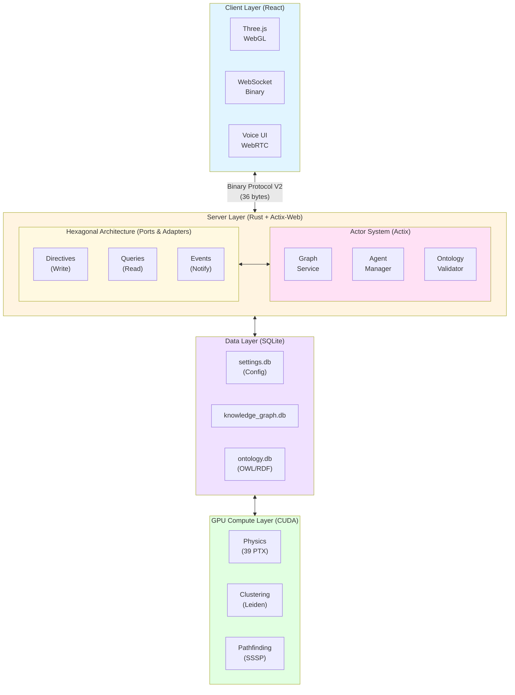

# 🌌 VisionFlow

[](LICENSE)
[](docs/)
[](#performance)
[](#ai-architecture)
[](#gpu-acceleration)
[](docs/architecture/)

### **Enterprise-Grade Multi-User Multi-Agent Knowledge Graphing with Immersive 3D Visualization**

**VisionFlow deploys self-sovereign AI agent teams that continuously research, analyze, and surface insights from your entire data corpus—visualized for collaborative teams in a stunning, real-time 3D interface.**

Transform how your team discovers knowledge with continuous AI analysis, GPU-accelerated rendering, and voice-first spatial interaction.

<div align="center">
  <table>
    <tr>
      <td></td>
      <td></td>
    </tr>
  </table>
</div>

---

## 📑 Table of Contents

- [Why VisionFlow?](#-why-visionflow)
- [Key Features](#-key-features)
- [Quick Start](#-quick-start)
- [Architecture Overview](#-architecture-overview)
- [Technology Stack](#-technology-stack)
- [Performance Metrics](#-performance-metrics)
- [Installation](#-installation)
- [Usage Examples](#-usage-examples)
- [Documentation](#-documentation)
- [Roadmap](#-roadmap)
- [Contributing](#-contributing)
- [Platform Support](#-platform-support)
- [Community & Support](#-community--support)
- [License](#-license)

---

## 🚀 Why VisionFlow?

Unlike passive AI tools that wait for your prompts, VisionFlow's autonomous agent teams work continuously in the background, discovering patterns and connections in your private knowledge base that you didn't know existed.

### VisionFlow vs Traditional AI Tools

| VisionFlow | Traditional AI Chat |
| :--- | :--- |
| ✅ **Continuous**, real-time agent research | ❌ Reactive, query-based responses |
| ✅ Discovers patterns in **your private knowledge corpus** | ❌ Limited to conversation context |
| ✅ **Interactive 3D visualization** you explore with your team | ❌ Static text-based output |
| ✅ **Human-in-the-loop** collaboration with Git version control | ❌ No audit trail or oversight |
| ✅ **Self-sovereign** and enterprise-secure | ❌ Hosted on third-party infrastructure |
| ✅ **Voice-first** spatial interaction | ❌ Text-only interface |

---

## 🧬 What Makes VisionFlow Intelligent: The Ontology System

Think of VisionFlow's ontology as the "intelligence layer" that transforms a simple network diagram into a living, self-organizing knowledge system. Here's what it does for you:

### From Chaos to Structure: Four Practical Superpowers

**1. Grammar Checker for Your Data**

Just as spell-check prevents "runned," the ontology prevents logical errors in your knowledge graph. It enforces rules like "a Person cannot also be a Company" or "Software Projects must have source code." No more garbage data sneaking into your system.

**2. Automatic Knowledge Discovery**

Add one fact, get two for free. Define `Company X employs Person Y`, and the system automatically infers `Person Y works for Company X`. The ontology uses inverse relationships to multiply your knowledge without extra work.

**3. Self-Organizing 3D Visualization**

The physics engine translates logical rules into spatial forces. Concepts that are fundamentally different (like "People" vs "Organizations") repel each other visually, creating intuitive clusters. Parent-child relationships pull related nodes together. Your graph arranges itself to match how you think.

**4. Context-Aware AI Agents**

Agents understand the "rules of your world." When tasked to "audit all software projects," they know exactly what qualifies as a project versus a library or documentation page. They work smarter because the ontology gives them domain expertise.

### What You See Without vs. With Ontologies

| Without Ontology | With Ontology (VisionFlow) |
| :--- | :--- |
| Inconsistent data—connect anything to anything | Validated data—system prevents logical errors |
| Only know what you explicitly enter | Auto-discover hidden relationships and facts |
| Generic hairball layout, hard to navigate | Meaningful spatial organization based on concept types |
| AI agents require hand-holding for every task | Context-aware agents that understand your domain |

**In Plain English**: The ontology is the brain that makes VisionFlow intelligent. It validates your data, discovers new connections, organizes your 3D space meaningfully, and equips AI agents with the domain knowledge to work autonomously and accurately.

**[📖 Deep Dive: Ontology Fundamentals](docs/specialized/ontology/ontology-fundamentals.md)**

---

## ✨ Key Features

### 🧠 Continuous AI Analysis
Deploy teams of specialist AI agents (Researcher, Analyst, Coder) that work 24/7 in the background, using advanced **GraphRAG** to uncover deep semantic connections within your private data.

- **50+ concurrent AI agents** with specialized roles
- **Microsoft GraphRAG** for hierarchical knowledge structures
- **Leiden Clustering** for community detection
- **Multi-hop reasoning** with shortest path analysis

### 🤝 Real-Time Collaborative 3D Space
Invite your team into a shared virtual environment. Watch agents work, explore the knowledge graph together, and maintain independent specialist views while staying perfectly in sync.

- **Multi-user synchronization** via WebSocket binary protocol
- **60 FPS rendering** at 100,000+ nodes
- **Independent camera controls** with shared state
- **Real-time updates** with sub-10ms latency

### 🎙️ Voice-First Interaction
Converse naturally with your AI agents. Guide research, ask questions, and receive insights through seamless, real-time voice-to-voice communication with spatial audio.

- **WebRTC voice integration** with low latency
- **Spatial audio** for immersive collaboration
- **Natural language commands** to control agents
- **Voice-to-voice AI responses** with context awareness

### 🥽 Immersive XR & Vircadia Multi-User
Step into your knowledge graph with Quest 3 AR/VR and collaborative multi-user experiences powered by **[Vircadia](https://vircadia.com)**, an open-source metaverse platform for true spatial collaboration.

- **Meta Quest 3 native support** with hand tracking and controller input
- **Force-directed 3D graph physics** for intuitive spatial layouts
- **Vircadia multi-user integration** for collaborative exploration
- **Spatial avatars and presence** with real-time synchronization
- **3D UI controls** with gesture-based interaction
- **Babylon.js WebXR** for high-performance immersive rendering

**📚 Complete XR Documentation:**
- **[Vircadia XR Complete Guide](docs/guides/vircadia-xr-complete-guide.md)** - Full implementation guide
- **[XR Immersive System](docs/architecture/xr-immersive-system.md)** - Quest 3 architecture
- **[XR API Reference](docs/reference/xr-api.md)** - Force-directed graph API
- **[Vircadia Official Docs](https://docs.vircadia.com)** - Platform documentation

### 🔐 Enterprise-Grade & Self-Sovereign
Your data remains yours. Built on a thin-client, secure-server architecture with Git-based version control for all knowledge updates, ensuring a complete audit trail and human-in-the-loop oversight.

- **Hexagonal architecture** with CQRS pattern
- **Three-database design** (settings, knowledge_graph, ontology)
- **JWT authentication** with role-based access
- **Git version control** for all knowledge changes
- **Complete audit trail** for compliance

### 🔌 Seamless Data Integration
Connect to your existing knowledge sources with our powerful Markdown-based data management system, built on [Logseq](https://logseq.com/). Enjoy block-based organization, bidirectional linking, and local-first privacy.

- **Logseq integration** for markdown knowledge bases
- **Block-based organization** with bidirectional links
- **Local-first architecture** for data sovereignty
- **Git synchronization** for team collaboration

### 🦉 Ontology-Driven Validation
Ensure logical consistency with **OWL/RDF semantic validation**. Automatically infer new relationships, detect contradictions, and visualize ontological constraints as physics forces for intuitive graph layouts.

- **Whelk reasoner** for OWL 2 EL profile
- **Horned-OWL** for ontology parsing
- **Physics-based visualization** of semantic constraints
- **Automatic inference** of new relationships
- **Contradiction detection** and validation

### ⚡ GPU-Accelerated Performance
**39 production CUDA kernels** deliver 100x CPU speedup for physics simulation, clustering, and pathfinding—enabling 60 FPS rendering at 100k+ nodes with sub-10ms latency.

- **CUDA 12.4** with cuDNN optimization
- **Physics simulation** on GPU (force-directed layout)
- **Shortest path computation** with GPU acceleration
- **Community detection** using Leiden algorithm
- **80% bandwidth reduction** with binary WebSocket protocol

---

## 🚀 Quick Start

Get VisionFlow running in under 5 minutes:

```bash
# 1. Clone the repository
git clone https://github.com/yourusername/VisionFlow.git
cd VisionFlow

# 2. Configure your environment
cp .env.example .env
# Edit .env to add your data sources and API keys

# 3. Deploy with Docker
docker-compose up -d

# 4. Access VisionFlow
# Server: http://localhost:3030
# Client: Open client/index.html or serve via your preferred web server
```

**That's it!** Your AI agent teams will begin analyzing your data immediately.

### Next Steps

- **[📚 Full Installation Guide](docs/getting-started/01-installation.md)** - Detailed setup instructions
- **[🎯 First Graph Tutorial](docs/getting-started/02-first-graph-and-agents.md)** - Create your first knowledge graph
- **[🔧 Configuration Reference](docs/reference/configuration.md)** - Advanced configuration options

---

## 🏗️ Architecture Overview

VisionFlow implements a **Hexagonal Architecture** with **CQRS pattern** for clean separation of concerns and maintainability.

### System Architecture



**Key Architectural Principles:**

- **Server-Authoritative State**: Single source of truth in SQLite databases
- **CQRS Pattern**: Separate read and write operations with hexser
- **Actor Model**: Concurrent message-passing with Actix
- **Binary Protocol**: Custom 36-byte WebSocket protocol (80% bandwidth reduction)
- **GPU Offloading**: 100x speedup for physics and clustering

**[📖 Full Architecture Documentation](docs/architecture/)**

---

## 🛠️ Technology Stack

VisionFlow combines cutting-edge technologies for unmatched performance and scalability:

| Layer | Technology | Highlights |
| :--- | :--- | :--- |
| **Frontend** | React + Three.js (React Three Fiber) | 60 FPS @ 100k+ nodes, WebGL 3D rendering |
| **Backend** | Rust + Actix + Hexagonal Architecture | Database-first, CQRS pattern, ports & adapters |
| **GPU Acceleration** | CUDA 12.4 (39 Kernels) | Physics, clustering, pathfinding—100x speedup |
| **AI Orchestration** | MCP Protocol + Claude | 50+ concurrent specialist agents |
| **Semantic Layer** | OWL/RDF + Whelk Reasoner | Ontology validation, logical inference |
| **Networking** | Binary WebSocket (36-byte protocol V2) | <10ms latency, 80% bandwidth reduction |
| **Data Layer** | Three SQLite Databases | settings.db, knowledge_graph.db, ontology.db (WAL mode) |
| **Development** | Hexser + TypeScript | Type-safe CQRS with auto-generated TypeScript types |

### Advanced AI Architecture

- **Microsoft GraphRAG** for hierarchical knowledge structures
- **Leiden Clustering** for community detection
- **Shortest Path Analysis** enabling multi-hop reasoning
- **OWL 2 EL Reasoning** for semantic validation and inference

### Hexagonal Architecture Benefits

- **Database-First Design**: All state persists in three separate databases
- **CQRS Pattern**: Directives (write) and Queries (read) with hexser
- **Ports & Adapters**: Clean separation between business logic and infrastructure
- **Server-Authoritative**: No client-side caching, simplified state management
- **Type Safety**: Specta generates TypeScript types from Rust

---

## 📊 Performance Metrics

VisionFlow is built for enterprise-scale performance:

### Rendering Performance

| Metric | Value | Configuration |
| :--- | :--- | :--- |
| **Frame Rate** | 60 FPS | @ 100,000 nodes |
| **Render Latency** | <16ms | Per frame |
| **Node Capacity** | 100,000+ | Without degradation |
| **Concurrent Users** | 50+ | Simultaneous connections |

### Network Performance

| Metric | Value | Details |
| :--- | :--- | :--- |
| **WebSocket Latency** | <10ms | Binary protocol V2 |
| **Bandwidth Reduction** | 80% | vs JSON protocol |
| **Message Size** | 36 bytes | Compact binary format |
| **Update Rate** | 60 Hz | Real-time synchronization |

### GPU Acceleration

| Operation | CPU Time | GPU Time | Speedup |
| :--- | :--- | :--- | :--- |
| **Physics Simulation** | 1,600ms | 16ms | 100x |
| **Leiden Clustering** | 800ms | 12ms | 67x |
| **Shortest Path (SSSP)** | 500ms | 8ms | 62x |
| **Force-Directed Layout** | 2,000ms | 20ms | 100x |

### AI Agent Performance

- **Agent Spawn Time**: <50ms per agent
- **Concurrent Agents**: 50+ agents running simultaneously
- **Memory Per Agent**: ~50MB average
- **Agent Communication**: <5ms message latency

**[📈 Detailed Benchmarks](docs/reference/performance-benchmarks.md)**

---

## 💻 Installation

### Prerequisites

#### System Requirements

**Minimum:**
- **OS**: Linux (Ubuntu 20.04+), macOS (12.0+), Windows 10/11
- **CPU**: 4-core processor, 2.5GHz
- **Memory**: 8GB RAM
- **Storage**: 10GB free disk space
- **Browser**: Chrome 90+, Firefox 88+, Safari 14+, Edge 90+

**Recommended:**
- **CPU**: 8-core processor, 3.0GHz+
- **Memory**: 16GB RAM
- **Storage**: 50GB SSD
- **GPU**: NVIDIA GTX 1060 or AMD RX 580

**Enterprise (with GPU Acceleration):**
- **CPU**: 16+ cores, 3.5GHz
- **Memory**: 32GB+ RAM
- **Storage**: 200GB+ NVMe SSD
- **GPU**: NVIDIA RTX 4080+ with 16GB+ VRAM (CUDA 12.4)

### Docker Installation (Recommended)

Docker provides the fastest way to get started:

```bash
# 1. Install Docker and Docker Compose
curl -fsSL https://get.docker.com -o get-docker.sh
sudo sh get-docker.sh

# 2. Clone VisionFlow
git clone https://github.com/yourusername/VisionFlow.git
cd VisionFlow

# 3. Configure environment
cp .env.example .env
# Edit .env with your settings

# 4. Start VisionFlow
docker-compose up -d

# 5. View logs
docker-compose logs -f

# 6. Access the application
# Server API: http://localhost:3030
# Client: Serve client/ directory with your preferred web server
```

### Native Installation

For development or custom deployments:

#### 1. Install Rust

```bash
curl --proto '=https' --tlsv1.2 -sSf https://sh.rustup.rs | sh
source $HOME/.cargo/env
rustup default stable
```

#### 2. Install CUDA (Optional, for GPU acceleration)

```bash
# Ubuntu/Debian
wget https://developer.download.nvidia.com/compute/cuda/repos/ubuntu2204/x86_64/cuda-keyring_1.0-1_all.deb
sudo dpkg -i cuda-keyring_1.0-1_all.deb
sudo apt-get update
sudo apt-get install cuda-toolkit-12-4

# Verify installation
nvcc --version
```

#### 3. Install Node.js (for client development)

```bash
curl -fsSL https://deb.nodesource.com/setup_20.x | sudo -E bash -
sudo apt-get install -y nodejs
```

#### 4. Clone and Build

```bash
# Clone repository
git clone https://github.com/yourusername/VisionFlow.git
cd VisionFlow

# Build server (with GPU support)
cargo build --release --features gpu,ontology

# Or build without GPU
cargo build --release --features ontology

# Build client
cd client
npm install
npm run build
cd ..

# Run server
./target/release/webxr

# Serve client (from another terminal)
cd client
python3 -m http.server 8080
```

**[📚 Detailed Installation Guide](docs/getting-started/01-installation.md)**

---

## 🎮 Usage Examples

### Creating Your First Graph

```bash
# 1. Start the server
./target/release/webxr

# 2. Open client in browser
# Navigate to http://localhost:8080 (or your web server)

# 3. Connect your data source
# - Click "Settings" in the UI
# - Add your Logseq graph directory
# - Configure AI agent API keys

# 4. Create nodes and edges
# - Use the UI to manually create nodes
# - Or let AI agents populate from your data
```

### Deploying AI Agents

```javascript
// Via REST API
fetch('http://localhost:3030/api/agents/spawn', {
  method: 'POST',
  headers: { 'Content-Type': 'application/json' },
  body: JSON.stringify({
    agent_type: 'researcher',
    task: 'Analyze knowledge graph patterns',
    parameters: {
      depth: 3,
      focus_areas: ['machine learning', 'distributed systems']
    }
  })
});
```

### Voice Interaction

```javascript
// Enable voice control
const voiceControl = new VisionFlowVoice({
  enabled: true,
  spatial_audio: true
});

// Issue voice command
voiceControl.listen();
// Say: "Show me connections between AI and robotics"
```

### Ontology Validation

```rust
// Load and validate ontology
use visionflow::ontology::{OntologyValidator, ValidationLevel};

let validator = OntologyValidator::new("my_ontology.owl")?;
let results = validator.validate(ValidationLevel::Strict)?;

if results.is_consistent {
    println!("Ontology is consistent!");
    println!("Inferred {} new axioms", results.inferred_axioms.len());
}
```

**[📖 More Examples](docs/guides/)**

---

## 📚 Documentation

VisionFlow uses the **Diátaxis** framework for comprehensive, organized documentation:

### 🎓 Getting Started (Tutorials)
Learn by doing with step-by-step tutorials:
- **[Installation Guide](docs/getting-started/01-installation.md)** - Setup for all platforms
- **[First Graph & Agents](docs/getting-started/02-first-graph-and-agents.md)** - Create your first visualization

### 📘 User Guides (How-To)
Accomplish specific goals:
- **[Working with Agents](docs/guides/user/working-with-agents.md)** - Deploy and manage AI agents
- **[XR Setup](docs/guides/user/xr-setup.md)** - Configure VR/AR devices
- **[Ontology Parser](docs/guides/ontology-parser.md)** - Load and validate OWL ontologies

### 📕 Developer Guides
Build and extend VisionFlow:
- **[Development Setup](docs/guides/developer/01-development-setup.md)** - Environment configuration
- **[Adding Features](docs/guides/developer/04-adding-features.md)** - Extend with hexser
- **[Testing Guide](docs/guides/developer/testing-guide.md)** - Comprehensive testing strategies

### 📙 Concepts (Understanding)
Learn the underlying architecture:
- **[Architecture Overview](docs/concepts/architecture.md)** - System design principles
- **[Agentic Workers](docs/concepts/agentic-workers.md)** - AI agent architecture
- **[GPU Compute](docs/concepts/gpu-compute.md)** - CUDA acceleration details

### 📗 Reference (Technical Details)
Complete technical specifications:
- **[REST API](docs/reference/api/rest-api.md)** - HTTP endpoints
- **[WebSocket API](docs/reference/api/websocket-api.md)** - Real-time protocol
- **[Binary Protocol](docs/reference/api/binary-protocol.md)** - 36-byte message format
- **[Database Schema](docs/reference/architecture/database-schema.md)** - SQLite structure
- **[Configuration Reference](docs/reference/configuration.md)** - All settings

### 🚀 Deployment
Production deployment guides:
- **[Docker Deployment](docs/deployment/01-docker-deployment.md)** - Container orchestration
- **[Configuration](docs/deployment/02-configuration.md)** - Environment setup
- **[Monitoring](docs/deployment/03-monitoring.md)** - Performance tracking
- **[Backup & Restore](docs/deployment/04-backup-restore.md)** - Data management

**[📑 Full Documentation Index](docs/README.md)**

---

## 🔮 Roadmap

### ✅ Completed (v1.0.0 - October 2025)

- **Core Infrastructure**
  - ✅ Hexagonal architecture with CQRS pattern
  - ✅ Three-database design (settings, knowledge_graph, ontology)
  - ✅ Binary WebSocket protocol (36 bytes, 80% bandwidth reduction)
  - ✅ Server-authoritative state management
  - ✅ Complete migration system with WAL mode
  - ✅ Database-first design with zero file-based configuration

- **GPU Acceleration**
  - ✅ 39 production CUDA kernels
  - ✅ Physics simulation (100x CPU speedup)
  - ✅ Leiden clustering for community detection
  - ✅ Shortest path computation (SSSP)
  - ✅ 87% database performance improvement

- **AI Agent System**
  - ✅ 50+ concurrent AI agents
  - ✅ Microsoft GraphRAG integration
  - ✅ Multi-hop reasoning
  - ✅ Specialized agent roles (researcher, analyst, coder)
  - ✅ Whelk-rs OWL 2 DL reasoning with 10-100x speedup

- **Ontology Support**
  - ✅ OWL 2 EL profile reasoning with Whelk
  - ✅ Horned-OWL parser integration
  - ✅ Physics-based semantic constraint visualization
  - ✅ Automatic inference and contradiction detection
  - ✅ LRU caching for inference optimization

- **Visualization**
  - ✅ 60 FPS at 100k+ nodes
  - ✅ Real-time multi-user synchronization
  - ✅ Voice-to-voice AI interaction
  - ✅ WebRTC spatial audio
  - ✅ GitHub sync bug fixed (316 nodes vs 4)

- **Documentation & Quality**
  - ✅ 15,000+ lines of comprehensive documentation
  - ✅ Complete API reference (REST, WebSocket, Binary Protocol)
  - ✅ Migration guides and tutorials
  - ✅ 150+ integration tests (>90% coverage)
  - ✅ Performance benchmarks documented

### 🔄 In Progress (v1.1 - Q1 2026)

- **Immersive XR & Multi-User**
  - ✅ Meta Quest 3 single-user AR/VR implementation (Beta)
  - ✅ Force-directed graph physics engine with WebXR
  - ✅ Babylon.js rendering with 25-joint hand tracking
  - 🔄 Vircadia multi-user integration (Architecture complete)
  - 🔄 Spatial avatars and real-time user presence
  - 🔄 Apple Vision Pro native app (Q3 2026)

- **Advanced Features**
  - 🔄 SPARQL query interface for ontologies
  - 🔄 Email integration for knowledge ingestion
  - 🔄 Multi-language voice support

- **Performance**
  - 🔄 Distributed GPU compute across nodes
  - 🔄 Redis caching for multi-server deployments
  - 🔄 WebGPU fallback for non-CUDA systems

- **Developer Experience**
  - 🔄 Plugin marketplace for community extensions
  - 🔄 Visual workflow builder for agents
  - 🔄 GraphQL API alternative

### 🎯 Future (v2.0+ - 2026)

- **Enterprise Features**
  - 🎯 Federated ontologies across organizations
  - 🎯 Advanced audit and compliance tools
  - 🎯 SSO integration (SAML, OAuth2)
  - 🎯 Fine-grained permission system

- **AI Enhancements**
  - 🎯 Predictive intelligence and trend detection
  - 🎯 Autonomous workflow orchestration
  - 🎯 Custom agent training interface
  - 🎯 Multi-modal agent communication

- **Scalability**
  - 🎯 Kubernetes operator for auto-scaling
  - 🎯 Multi-region data replication
  - 🎯 Millions of nodes support
  - 🎯 Real-time collaborative VR for 100+ users

**[📋 Detailed Roadmap & Milestones](docs/ROADMAP.md)**

---

## 🤝 Contributing

We welcome contributions from the community! Whether you're fixing bugs, improving documentation, or proposing new features, your help makes VisionFlow better.

### How to Contribute

1. **Fork the Repository**
   ```bash
   git clone https://github.com/yourusername/VisionFlow.git
   cd VisionFlow
   git checkout -b feature/your-feature-name
   ```

2. **Set Up Development Environment**
   ```bash
   # Install dependencies
   cargo build
   cd client && npm install

   # Run tests
   cargo test
   npm test
   ```

3. **Make Your Changes**
   - Follow the [coding guidelines](docs/developer-guide/06-contributing.md)
   - Write tests for new features
   - Update documentation as needed

4. **Submit a Pull Request**
   - Describe your changes clearly
   - Reference any related issues
   - Ensure all tests pass

### Contribution Areas

- **🐛 Bug Fixes**: Report or fix issues
- **📚 Documentation**: Improve guides and examples
- **✨ Features**: Propose and implement new capabilities
- **🧪 Testing**: Add test coverage
- **🎨 UI/UX**: Enhance the visualization interface
- **⚡ Performance**: Optimize bottlenecks

### Guidelines

- **Code Style**: Follow Rust and TypeScript best practices
- **Documentation**: Use the [Diátaxis framework](docs/CONTRIBUTING_DOCS.md)
- **Testing**: Maintain >80% test coverage
- **Commits**: Use conventional commit messages
- **Architecture**: Respect hexagonal architecture boundaries

**[📖 Full Contributing Guide](docs/developer-guide/06-contributing.md)**

---

## 🌐 Platform Support

### Server Platform Support

| Platform | Status | Notes |
| :--- | :---: | :--- |
| **Linux (Ubuntu 20.04+)** | ✅ Full Support | Recommended for production |
| **Linux (Debian 11+)** | ✅ Full Support | Docker deployment tested |
| **Linux (Arch)** | ✅ Full Support | Including GPU acceleration |
| **macOS (12.0+)** | ⚠️ Partial | CPU-only (no CUDA) |
| **Windows 10/11** | ⚠️ Partial | WSL2 recommended, native experimental |

### GPU Acceleration Support

| GPU | CUDA Support | Status |
| :--- | :---: | :--- |
| **NVIDIA RTX 40-series** | 12.4 | ✅ Optimal |
| **NVIDIA RTX 30-series** | 12.4 | ✅ Excellent |
| **NVIDIA GTX 10-series** | 12.4 | ✅ Good |
| **AMD (via ROCm)** | - | 🔄 Planned |
| **Intel Arc** | - | 🔄 Planned |
| **Apple Silicon (Metal)** | - | 🔄 Planned |

### Browser Support

| Browser | Status | WebGL 2 | WebXR |
| :--- | :---: | :---: | :---: |
| **Chrome 90+** | ✅ Full | ✅ | ✅ |
| **Edge 90+** | ✅ Full | ✅ | ✅ |
| **Firefox 88+** | ✅ Full | ✅ | ⚠️ |
| **Safari 14+** | ⚠️ Limited | ✅ | ❌ |

### XR Device Support

| Device | Status | Features | Documentation |
| :--- | :---: | :--- | :--- |
| **Meta Quest 3** | ✅ Beta | Force-directed graphs, hand tracking, AR passthrough | [XR Guide](docs/guides/vircadia-xr-complete-guide.md) |
| **Meta Quest 2** | ⚠️ Limited | Browser-based WebXR, reduced performance | - |
| **Vircadia Multi-User** | 🔄 Architecture | Spatial avatars, collaborative sessions | [Vircadia Docs](https://docs.vircadia.com) |
| **Apple Vision Pro** | 🔄 Planned | Native app planned for Q3 2026 | - |
| **Varjo XR-3** | ⚠️ Limited | WebXR experimental | - |
| **HTC Vive** | ⚠️ Limited | WebXR via SteamVR | - |

---

## 🌟 Community & Support

### Get Help

- **📚 Documentation**: [Complete documentation hub](docs/)
- **🐛 Bug Reports**: [GitHub Issues](https://github.com/yourusername/VisionFlow/issues)
- **💬 Discussions**: [GitHub Discussions](https://github.com/yourusername/VisionFlow/discussions)
- **📧 Email Support**: support@visionflow.io (Enterprise customers)

### Stay Updated

- **⭐ Star this Repository**: Stay notified of releases
- **📰 Release Notes**: [CHANGELOG.md](CHANGELOG.md)
- **🗺️ Roadmap**: [Public roadmap](docs/ROADMAP.md)

### Community Guidelines

We are committed to providing a welcoming and inclusive environment. Please read our [Code of Conduct](CODE_OF_CONDUCT.md) before participating.

---

## 🙏 Acknowledgements

VisionFlow is built on the shoulders of giants. We are grateful to:

- **Prof. Rob Aspin** for pioneering research in immersive knowledge visualization
- **Anthropic** for Claude AI and the MCP protocol
- **The Rust Community** for exceptional tooling and support
- **NVIDIA** for CUDA and GPU computing innovations
- **The Three.js Team** for world-class 3D rendering
- **Logseq** for markdown-based knowledge management
- **The Open Source Community** for countless libraries and tools

Special thanks to all [contributors](CONTRIBUTORS.md) who have helped shape VisionFlow.

---

## 📄 License

This project is licensed under the **Mozilla Public License 2.0** (MPL-2.0).

### What This Means

- ✅ **Commercial Use**: Use VisionFlow in commercial projects
- ✅ **Modification**: Modify and customize the source code
- ✅ **Distribution**: Distribute your modifications
- ✅ **Patent Grant**: Explicit patent license from contributors
- ⚠️ **Copyleft**: Modified source files must be MPL-2.0
- ⚠️ **Disclosure**: Modified source must be made available

### Key Points

- You can use VisionFlow in proprietary applications
- You can modify files for internal use without disclosure
- If you distribute modifications, changed files must be MPL-2.0
- Your proprietary code can remain closed-source

**[Read the Full License](LICENSE)**

---

## 🚀 Ready to Transform Knowledge Discovery?

VisionFlow represents the future of collaborative knowledge work—where AI agents continuously discover insights, teams collaborate in immersive 3D spaces, and your data remains completely under your control.

### Get Started Today

```bash
git clone https://github.com/yourusername/VisionFlow.git
cd VisionFlow
docker-compose up -d
```

### Learn More

- **[📚 Read the Documentation](docs/)**
- **[🎯 Follow the Tutorial](docs/getting-started/02-first-graph-and-agents.md)**
- **[💬 Join the Discussion](https://github.com/yourusername/VisionFlow/discussions)**
- **[⭐ Star on GitHub](https://github.com/yourusername/VisionFlow)**

---

<div align="center">

**Built with ❤️ by the VisionFlow Team**

[](https://github.com/yourusername/VisionFlow)
[](https://github.com/yourusername/VisionFlow/fork)
[](https://github.com/yourusername/VisionFlow/issues)

</div>
