# 🌌 VisionFlow

[](LICENSE)
[](docs/)
[](docs/)
[](docs/)

### **Immersive Multi-User Multi-Agent Knowledge Graphing**
**VisionFlow deploys self-sovereign AI agent teams that continuously research, analyse, and surface insights from your entire data corpus—visualised for collaborative teams in a stunning, real-time 3D interface.**


<div align="center">
  <table>
    <tr>
      <td></td>
      <td></td>
    </tr>
  </table>
</div>

---

## ✨ Core Features

*   **🧠 Continuous AI Analysis**: Deploy teams of specialist AI agents (Researcher, Analyst, Coder) that work 24/7 in the background, using advanced GraphRAG to uncover deep semantic connections within your private data.
*   **🤝 Real-Time Collaborative 3D Space**: Invite your team into a shared virtual environment. Watch agents work, explore the knowledge graph together, and maintain independent specialist views while staying perfectly in sync.
*   **🎙️ Voice-First Interaction**: Converse naturally with your AI agents. Guide research, ask questions, and receive insights through seamless, real-time voice-to-voice communication with spatial audio.
*   **🔐 Enterprise-Grade & Self-Sovereign**: Your data remains yours. Built on a thin-client, secure-server architecture with Git-based version control for all knowledge updates, ensuring a complete audit trail and human-in-the-loop oversight.
*   **🔌 Seamless Data Integration**: Connect to your existing knowledge sources with our powerful Markdown-based data management system, built on [Logseq](https://logseq.com/). Enjoy block-based organisation, bidirectional linking, and local-first privacy.

| VisionFlow | ChatGPT Pulse |
| :--- | :--- |
| ✅ **Continuous**, real-time agent research | ❌ Asynchronous daily research |
| ✅ Discovers patterns in **your private knowledge corpus** | ❌ Surfaces insights from past chats |
| ✅ **Interactive 3D visualisation** you explore | ❌ Static visual summaries |
| ✅ **Human-in-the-loop** collaboration | ❌ Passive insight delivery |
| ✅ **Self-sovereign** and enterprise-secure | ❌ Hosted on third-party infrastructure |

---

## 🚀 Quick Start

```bash
# 1. Clone the repository
git clone https://github.com/your-org/VisionFlow
cd VisionFlow

# 2. Configure your environment
cp .env.example .env
# Edit .env to add your data sources and API keys

# 3. Deploy with Docker
docker-compose up -d

# 4. Access your AI research universe
echo "VisionFlow is running at http://localhost:3001"
```

**[📚 Full Documentation](docs/)** | **[🎯 Getting Started Guide](docs/getting-started/02-quick-start.md)** | **[🔧 Installation Details](docs/getting-started/01-installation.md)**

---

## 🛠️ Technical Deep Dive
(..**click to expand**..)

<details>
<summary><strong>🧠 Advanced Knowledge Architecture & Agent Orchestration</strong></summary>

### Advanced Knowledge Graph Architecture
- **Microsoft GraphRAG Integration**: We build hierarchical knowledge structures with subject-object-predicate relationships, capturing deep semantic meaning beyond simple vector similarity.
- **Leiden Clustering Algorithm**: Automatically organises your knowledge into well-connected communities, revealing hidden relationships and structuring information from high-level domains down to specific details.
- **Cutting-Edge Shortest Path Analysis**: Utilises [new research](https://arxiv.org/abs/2504.17033) for multi-hop reasoning, enabling you to connect distant concepts and trace the flow of information.

### Intelligent Agent Orchestration
VisionFlow deploys specialised AI agents that work continuously in the background:
- **Researcher Agents**: Deep-dive into topics using GraphRAG's local search.
- **Analyst Agents**: Identify patterns and correlations using clustering algorithms.
- **Coder Agents**: Parse and understand codebases, documentation, and dependencies.
- **Planner & Reviewer Agents**: Coordinate research strategies and validate findings.

### Living Knowledge Graph with Git Integration
- Your data evolves in real-time as agents discover relationships.
- All changes are submitted as **merge requests** for human oversight, tracked with a complete Git version history.
- **Time Travel**: Visually rewind and fast-forward through the history of your data in the immersive graph.

</details>

<details>
<summary><strong>⚡ High-Performance Technology Stack</strong></summary>

| Layer | Component | Specification | Performance |
| :--- | :--- | :--- | :--- |
| **GPU Acceleration** | 40 CUDA Kernels | Physics, clustering, pathfinding | 100x CPU speedup |
| **Networking** | Binary WebSocket | 34-byte custom protocol | <10ms latency, 95% bandwidth saving |
| **Visualisation** | React Three Fiber | WebGL 3D Rendering Pipeline | 60 FPS @ 100k+ nodes |
| **Backend** | Rust + Actix | Supervised actor system | 1,000+ requests/min |
| **AI Orchestration**| MCP Protocol | ClaudeFlowActor & Agent teams | 50+ concurrent agents |

<br/>


</details>

<details>
<summary><strong>👥 Multi-User Collaboration & Use Cases</strong></summary>

VisionFlow enables team-based human-AI research where multiple experts collaborate with AI agents in real-time.

### Key Scenarios:
- **Voice-First Collaborative Research**: Human teams guide agent teams and discuss findings using natural voice commands in a shared 3D space with spatial audio.
- **Independent Specialist Views**: A data scientist can view statistical overlays while a developer sees code dependency graphs—both looking at the same core data, at the same time, without interrupting each other.
- **Team-Based Knowledge Discovery**: AI agents route findings to the most relevant human expert, who can then validate the insight and guide the next phase of research via merge request approval.
- **Collaborative Code Intelligence**: Use coder agents for live pair-programming sessions, architectural discussions, and automated knowledge capture from senior developers.

```mermaid
graph TB
    subgraph "Immersive Collaboration"
        Expert1["Research Lead\n🎙️ Voice + Custom View"]
        Expert2["Data Scientist\n🎙️ Voice + Analytics View"]

        subgraph "Shared Knowledge Space"
           AI_teams["Voice-Responsive AI teams"]
           KnowledgeGraph["Living Knowledge Graph"]
        end

        Expert1 <--> |Guides & Validates| AI_teams
        Expert2 <--> |Queries & Directs| AI_teams
        AI_teams -- Updates --> KnowledgeGraph
        KnowledgeGraph -- Streams To --> Expert1 & Expert2
    end
```

<br/>



</details>

---

## 🔮 Roadmap

- ✅ **Current**: Real-time multi-user collaboration, voice-to-voice AI, 50+ concurrent agents, GPU acceleration, mobile companion app (LogSeq), ML tools.
- 🔄 **Coming Soon**: AR/VR (Quest 3) interface, multi-language voice support, email integration.
- 🎯 **Future Vision**: Scaled Collaborative VR, predictive intelligence, autonomous workflows, and a community plugin marketplace.

---

<details>
<summary><strong>🏗️ System Architecture Diagrams (Click to expand for the deep dive)</strong></summary>
<br/>

VisionFlow is built on a sophisticated, high-performance architecture. The following diagrams provide a detailed look into the server, client, and communication protocols that power the system.

### 1. Overall System Architecture

These master diagrams illustrate the complete client and server systems, showing all major components and their interactions.

**Complete Rust Server Architecture**
This diagram shows the entire Rust backend, including the transitional actor system, API layers, WebSocket handlers, the 40-kernel GPU subsystem, and all external service integrations. It provides a complete map of the server-side logic.


**Complete Client Architecture**
This is the master diagram for the frontend, built with React and Three.js. It details everything from the application bootstrap and state management to the complex 3D rendering pipeline, voice system, and the unified API communication layer.


### 2. Backend Architecture Deep Dive

**Transitional Actor System**
The Rust server is migrating from a monolith to a supervised actor system. This diagram shows the current "bridge" pattern that wraps the legacy actor while new, specialised actors are extracted for better modularity and resilience.


**GPU Acceleration Layer**
Performance is critical. VisionFlow offloads heavy computation to the GPU using 40 production CUDA kernels, managed by a dedicated hierarchy of supervisor and worker actors.


### 3. Frontend Architecture Deep Dive

**Real-time Graph Rendering Pipeline**
This shows the flow of data from the WebSocket service through the data and scene managers to the final render on the React Three Fiber canvas, including post-processing effects and agent visualisation overlays.


**Voice System (Dual Implementation)**
This diagram reveals the current state of the voice system, where a legacy hook is actively used in production while a more robust, centralised architecture has been designed and is available for future migration.


### 4. Communication & Data Flow

**34-Byte Binary Protocol**
To achieve real-time performance, VisionFlow uses a highly optimised 34-byte binary protocol for node updates, reducing bandwidth by over 95% compared to JSON. This is fundamental to supporting 100k+ nodes at 60 FPS.


**Real-time Graph Data Flow**
This sequence diagram illustrates the dynamic flow of information, from the backend pushing a binary frame over WebSockets to the client parsing it and updating the 3D scene, all within milliseconds.


</details>

## 🤝 Community & Support

- **GitHub Issues**: [Report bugs or request features](https://github.com/your-org/VisionFlow/issues)
- **Discord**: [Join our community](https://discord.gg/ar-ai-kg)
- **Documentation**: [Full Documentation Hub](docs/)

#### 🙏 Acknowledgements
Inspired by the innovative work of **Prof. Rob Aspin** and powered by the tools and concepts from **Anthropic**, **OpenAI**, and the incredible open-source community.

---

## 📄 Licence

This project is licensed under the Mozilla Public License 2.0. See the [LICENSE](LICENSE) file for details.