# 🌌 VisionFlow

[](LICENSE)
[](docs/)
[](docs/)
[](docs/)

### **Immersive Multi-User Multi-Agent Knowledge Graphing**
**VisionFlow deploys self-sovereign AI agent teams that continuously research, analyse, and surface insights from your entire data corpus—visualised for collaborative teams in a stunning, real-time 3D interface.**


<div align="center">
  <table>
    <tr>
      <td></td>
      <td></td>
    </tr>
  </table>
</div>

---

## ✨ Core Features

*   **🧠 Continuous AI Analysis**: Deploy swarms of specialist AI agents (Researcher, Analyst, Coder) that work 24/7 in the background, using advanced GraphRAG to uncover deep semantic connections within your private data.
*   **🤝 Real-Time Collaborative 3D Space**: Invite your team into a shared virtual environment. Watch agents work, explore the knowledge graph together, and maintain independent specialist views while staying perfectly in sync.
*   **🎙️ Voice-First Interaction**: Converse naturally with your AI agents. Guide research, ask questions, and receive insights through seamless, real-time voice-to-voice communication with spatial audio.
*   **🔐 Enterprise-Grade & Self-Sovereign**: Your data remains yours. Built on a thin-client, secure-server architecture with Git-based version control for all knowledge updates, ensuring a complete audit trail and human-in-the-loop oversight.
*   **🔌 Seamless Data Integration**: Connect to your existing knowledge sources with our powerful Markdown-based data management system, built on [Logseq](https://logseq.com/). Enjoy block-based organisation, bidirectional linking, and local-first privacy.

| VisionFlow | ChatGPT Pulse |
| :--- | :--- |
| ✅ **Continuous**, real-time agent research | ❌ Asynchronous daily research |
| ✅ Discovers patterns in **your private knowledge corpus** | ❌ Surfaces insights from past chats |
| ✅ **Interactive 3D visualisation** you explore | ❌ Static visual summaries |
| ✅ **Human-in-the-loop** collaboration | ❌ Passive insight delivery |
| ✅ **Self-sovereign** and enterprise-secure | ❌ Hosted on third-party infrastructure |

---

## 🚀 Quick Start

```bash
# 1. Clone the repository
git clone https://github.com/your-org/VisionFlow
cd VisionFlow

# 2. Configure your environment
cp .env.example .env
# Edit .env to add your data sources and API keys

# 3. Deploy with Docker
docker-compose up -d

# 4. Access your AI research universe
echo "VisionFlow is running at http://localhost:3001"
```

**[📚 Full Documentation](docs/)** | **[🎯 Getting Started Guide](docs/getting-started/02-quick-start.md)** | **[🔧 Installation Details](docs/getting-started/01-installation.md)**

---

## 🛠️ Technical Deep Dive

> 💡 **Click the sections below to explore detailed architecture diagrams and technical specifications**

<details>
<summary><strong>🧠 Advanced Knowledge Architecture & Agent Orchestration</strong></summary>

### Advanced Knowledge Graph Architecture


- **Microsoft GraphRAG Integration**: We build hierarchical knowledge structures with subject-object-predicate relationships, capturing deep semantic meaning beyond simple vector similarity.
- **Leiden Clustering Algorithm**: Automatically organises your knowledge into well-connected communities, revealing hidden relationships and structuring information from high-level domains down to specific details.
- **Cutting-Edge Shortest Path Analysis**: Utilises [new research](https://arxiv.org/abs/2504.17033) for multi-hop reasoning, enabling you to connect distant concepts and trace the flow of information.

### Intelligent Agent Orchestration
VisionFlow deploys specialised AI agents that work continuously in the background:
- **Researcher Agents**: Deep-dive into topics using GraphRAG's local search.
- **Analyst Agents**: Identify patterns and correlations using clustering algorithms.
- **Coder Agents**: Parse and understand codebases, documentation, and dependencies.
- **Planner & Reviewer Agents**: Coordinate research strategies and validate findings.

### Living Knowledge Graph with Git Integration
- Your data evolves in real-time as agents discover relationships.
- All changes are submitted as **merge requests** for human oversight, tracked with a complete Git version history.
- **Time Travel**: Visually rewind and fast-forward through the history of your data in the immersive graph.

</details>

<details>
<summary><strong>⚡ High-Performance Technology Stack</strong></summary>

### GPU Computation Layer


### Binary Protocol Architecture


| Layer | Component | Specification | Performance |
| :--- | :--- | :--- | :--- |
| **GPU Acceleration** | 40 CUDA Kernels | Physics, clustering, pathfinding | 100x CPU speedup |
| **Networking** | Binary WebSocket | 34-byte custom protocol | <10ms latency, 95% bandwidth saving |
| **Visualisation** | React Three Fiber | WebGL 3D Rendering Pipeline | 60 FPS @ 100k+ nodes |
| **Backend** | Rust + Actix | Supervised actor system | 1,000+ requests/min |
| **AI Orchestration**| MCP Protocol | ClaudeFlowActor & Agent Swarms | 50+ concurrent agents |

```mermaid
graph TB
    subgraph "Immersive Voice-Enabled Collaboration"
        subgraph "Human Experts with Independent Views"
            Expert1[Research Lead<br/>🎙️ Voice + Custom View]
            Expert2[Data Scientist<br/>🎙️ Voice + Analytics View]
            Expert3[Developer<br/>🎙️ Voice + Code View]
        end

        subgraph "Voice-Responsive AI Swarms"
            ResearchSwarm[Research Agents<br/>🔊 Voice Response]
            CoderSwarm[Coder Agents<br/>🔊 Code Narration]
            AnalystSwarm[Analyst Agents<br/>🔊 Data Insights]
        end

        subgraph "Shared Knowledge + Individual Lenses"
            KnowledgeGraph[Living Knowledge Graph<br/>Common Data Layer]

            subgraph "Personalised Views"
                View1[Research View<br/>Publications Focus]
                View2[Analytics View<br/>Metrics Focus]
                View3[Code View<br/>Architecture Focus]
            end

            HolographicVis[200x Holographic Sphere<br/>Synchronised Perspectives]
        end

        Expert1 <-->|🎙️ Voice Commands| ResearchSwarm
        Expert2 <-->|🎙️ Voice Queries| AnalystSwarm
        Expert3 <-->|🎙️ Voice Reviews| CoderSwarm

        KnowledgeGraph --> View1 & View2 & View3
        View1 --> Expert1
        View2 --> Expert2
        View3 --> Expert3
    end

    subgraph "Voice & Sync Infrastructure"
        VoiceSystem[Dual Voice System<br/>Legacy + Centralised]
        SpatialAudio[3D Spatial Audio<br/>Positioned Voices]
        WebSocketSync[Binary WebSocket<br/>34-byte packets]
        IndependentState[Per-User State<br/>Custom Settings]
    end

    VoiceSystem --> Expert1 & Expert2 & Expert3
    SpatialAudio --> HolographicVis
    WebSocketSync --> KnowledgeGraph

    style Expert1 fill:#4caf50
    style VoiceSystem fill:#ff5722
    style View1 fill:#e3f2fd
```

</details>

<details>
<summary><strong>👥 Multi-User Voice-Enabled Collaboration Architecture</strong></summary>



### Key Scenarios:
- **Voice-First Collaborative Research**: Teams guide agent swarms and discuss findings using natural voice commands in a shared 3D space with spatial audio.
- **Independent Specialist Views**: A data scientist can view statistical overlays while a developer sees code dependency graphs—both looking at the same core data, at the same time, without interrupting each other.
- **Team-Based Knowledge Discovery**: AI agents route findings to the most relevant human expert, who can then validate the insight and guide the next phase of research via merge request approval.
- **Collaborative Code Intelligence**: Use coder agents for live pair-programming sessions, architectural discussions, and automated knowledge capture from senior developers.

</details>

<details>
<summary><strong>🔬 Client Architecture & 3D Rendering Pipeline</strong></summary>


### Data Flow Architecture


<details>
<summary><strong>🎙️ Voice-to-Voice Architecture</strong></summary>


### Voice Data Flow


<details>
<summary><strong>🏗️ System Integration Overview</strong></summary>


### Performance Metrics

| Component | Specification | Performance |
|-----------|--------------|-------------|
| **GPU Kernels** | 40 CUDA kernels | 100x CPU speedup |
| **Binary Protocol** | 34-byte packets | 95% bandwidth saving |
| **Actor System** | 20 Actix actors | 1000+ req/min |
| **WebSocket Latency** | Binary streaming | <10ms updates |
| **3D Rendering** | Three.js + WebGL | 60 FPS @ 100k nodes |
| **Agent Swarms** | MCP orchestration | 50+ concurrent agents |
| **Memory Efficiency** | Per-node overhead | 34 bytes only |
| **Hologram Scale** | HolographicDataSphere | 200x visual scale |

</details>

---

## 🔮 Roadmap

- ✅ **Current**: Real-time multi-user collaboration, voice-to-voice AI, 50+ concurrent agents, GPU acceleration.
- 🔄 **Coming Soon**: AR/VR (Quest 3) interface, multi-language voice support, email integration, mobile companion app.
- 🎯 **Future Vision**: Predictive intelligence, autonomous workflows, and a community plugin marketplace.

---

## 🤝 Community & Support

- **GitHub Issues**: [Report bugs or request features](https://github.com/your-org/VisionFlow/issues)
- **Discord**: [Join our community](https://discord.gg/ar-ai-kg)
- **Documentation**: [Full Documentation Hub](docs/)

#### 🙏 Acknowledgements
Inspired by the innovative work of **Prof. Rob Aspin** and powered by the tools and concepts from **Anthropic**, **OpenAI**, and the incredible open-source community.

---

## 📄 Licence

This project is licensed under the Mozilla Public License 2.0. See the [LICENSE](LICENSE) file for details.