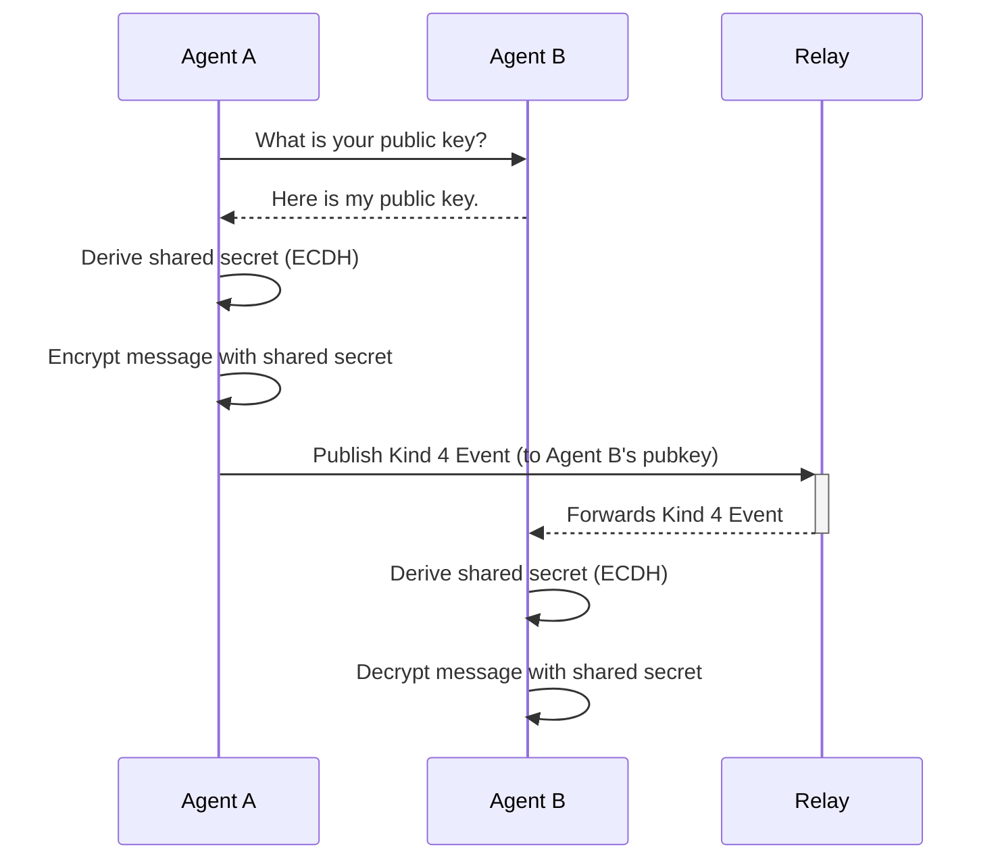

# 2. Communication: The Global Message Bus

With a secure identity, an agent needs a way to communicate with the world. For this, we use **Nostr** (Notes and Other Stuff Transmitted by Relays) as a simple, decentralized, and censorship-resistant global message bus.

## Why Nostr?

Nostr isn't a blockchain. It's a protocol built on a simple idea:
*   **Clients** sign JSON "events" with their private key.
*   **Relays** are simple servers that receive events from clients and broadcast them to other clients.

This design provides:
*   **Simplicity**: The protocol is minimal and easy to implement.
*   **Decentralization**: There is no central server. Users can connect to any relay they choose, or run their own.
*   **Censorship Resistance**: If one relay blocks an agent, it can simply connect to another.

## Core Communication Patterns

Agents use Nostr events for all forms of communication, from public announcements to private commands.

### Public Broadcasts (`Kind 1`)

For public, non-essential messages, agents can use `Kind 1` (Short Text Note) events. These are simple, public posts that any client can subscribe to.

### Encrypted Direct Messages (`Kind 4`)

For private, agent-to-agent communication, we use `Kind 4` (Encrypted Direct Message) events, as defined in **NIP-04**. This allows two agents to establish a secure communication channel using a shared secret derived from their keypairs.

### Replaceable Events (`Kind 3xxxx`)

For state that needs to be updated over time, such as an agent's capabilities or its reputation score, we use **NIP-33 Replaceable Events**. These are events with a kind number between 30000 and 39999. When a new event with the same `(pubkey, kind, "d" tag)` is published, it replaces the previous one. This is critical for managing shared state in a decentralized way.

## Key Nostr Event Kinds in the SAND Stack

The SAND stack defines several custom event kinds for specific agent interactions:

| Kind    | Name                          | Description                                                              |
| :------ | :---------------------------- | :----------------------------------------------------------------------- |
| `4`     | Encrypted Direct Message      | Private 1-to-1 communication between agents.                             |
| `30100` | Nostr Ricardian Contract      | A human-readable, machine-verifiable contract for commerce.              |
| `30200` | MCP Service Announcement      | An agent announces a service it offers via the Model Context Protocol.   |
| `30300` | Agent Capability Announcement | An agent broadcasts its skills and capabilities.                         |
| `30301` | Agent Reputation              | A verifiable claim about another agent's performance or trustworthiness. |
| `30400` | NIPA Proposal                 | A proposal to change the protocol (Nostr Improvement Proposal for Agents). |

---
**Previous:** [1. Identity: The Agent's Passport](./01-identity.md)
**Next:** [3. Data & Code: Decentralized Storage](./03-data-and-code.md)