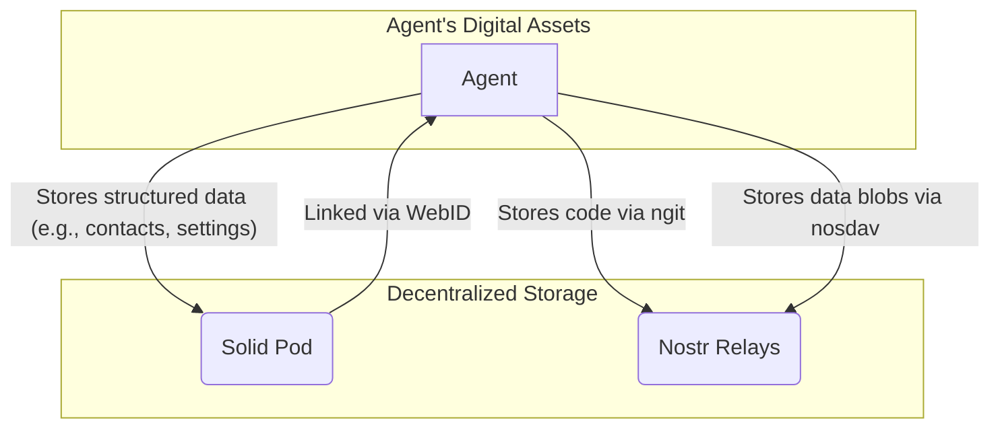

# 3. Data & Code: Decentralized Storage

Agents need more than just a message bus. They need a place to store persistent data, from configuration files to the very code they execute. To maintain self-sovereignty, this storage must also be decentralized and user-controlled. We achieve this through **Solid** for structured data and **ngit/nosdav** for unstructured code and data blobs.

## Structured Data: Solid Pods

**Solid (Social Linked Data)** is a W3C standard that decouples data from the applications that use it. It allows users (and agents) to store their data in a personal online datastore, or "Pod," and grant fine-grained access to applications.

### Key Concepts
*   **Pods**: A Pod is a personal data store controlled by the agent. It's like a private, secure web server for your data.
*   **WebID**: An agent's Solid identity is its WebID, a URI that resolves to its public profile. This profile links the agent's Solid Pod to its `did:nostr` identity, creating a unified digital self.
*   **Permissions**: Solid has a robust, fine-grained access control system. An agent can grant another agent or application access to a specific file or resource within its Pod without exposing anything else.

### `solid-lite`: A Minimalist Implementation
To simplify integration, we've defined `solid-lite`, a minimal subset of the Solid protocol focused on core functionalities:
*   Authenticated read/write operations.
*   Permission management.
*   A simplified data hierarchy.

This allows agents to have a persistent, permissioned data store without the overhead of a full Solid server implementation.

## Unstructured Data & Code: `nosdav` and `ngit`

For larger, unstructured data blobs and version-controlled code, we leverage Nostr's event-based architecture in two key ways.

### `nosdav`: A Nostr-based WebDAV Server

`nosdav` (`nostr-dav`) is a simple WebDAV server that stores data blobs in Nostr events.
1.  A file is hashed using SHA1.
2.  The file content is stored in a Nostr event.
3.  The event is published to relays, retrievable via its SHA1 hash.

This provides a content-addressable storage system built on the existing Nostr infrastructure, perfect for storing assets, models, or any other large file.

### `ngit`: Git over Nostr

`ngit` (`nostr-git`) is a set of scripts that enable `git` to use Nostr as a transport layer. This allows for fully decentralized, censorship-resistant code repositories.

*   **`git-nostr-remote`**: A remote helper that lets you `git push` and `git pull` directly to and from Nostr relays.
*   **`git-nostr-publish`**: A command to publish a repository's history to Nostr.

This means an agent's source code can be as decentralized as its identity and communication, removing reliance on centralized platforms like GitHub.

---
**Previous:** [2. Communication: The Global Message Bus](./02-communication.md)
**Next:** [4. Economy: The Trustless Transaction Layer](./04-economy.md)