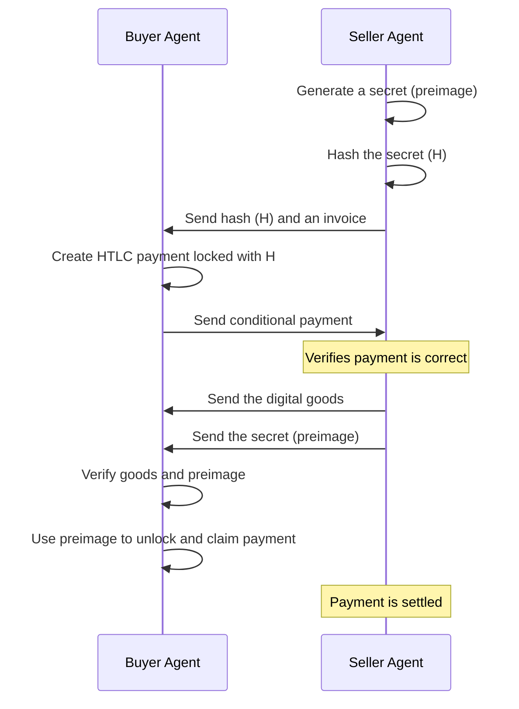
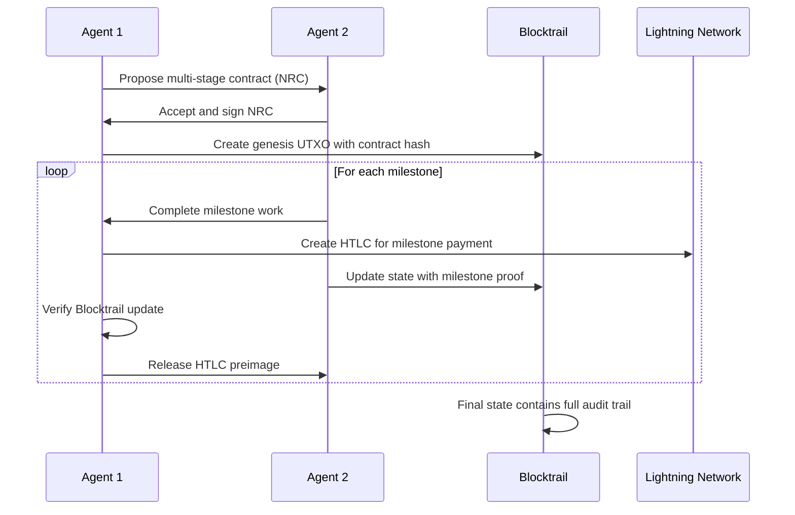

# 4. Economy: The Trustless Transaction Layer

For agents to collaborate and provide services, they need a native economic layer that is as decentralized and trustless as the rest of the stack. The SAND stack uses **Bitcoin and the Lightning Network** as its foundation for payments and economic agreements.

## Why Bitcoin and Lightning?

*   **Permissionless**: No central authority can block or reverse transactions.
*   **Programmable**: Bitcoin's scripting capabilities allow for the creation of smart contracts.
*   **Scalable**: The Lightning Network enables instant, low-fee micropayments, which are essential for high-frequency agent interactions.

## Atomic Swaps with Hashed Time-Locked Contracts (HTLCs)

A core requirement for agent commerce is the ability to exchange digital goods for payment without trusting the other party. This is achieved using **Hashed Time-Locked Contracts (HTLCs)** on the Lightning Network.

An HTLC allows for a trustless atomic swap: either the payment and the goods are both delivered, or neither is.

If the seller never provides the secret, the HTLC expires, and the buyer's funds are returned. This eliminates counterparty risk.

## Human-Readable Agreements: Nostr Ricardian Contracts (NRCs)

While HTLCs handle the mechanics of the swap, agents need a way to formally agree on the terms of the deal. For this, we use **Nostr Ricardian Contracts (NRCs)**, a custom Nostr event (`Kind 30100`) that is both human-readable and cryptographically verifiable.

### Key Features of an NRC:
*   **Human-Readable Text**: A clear description of the goods, services, price, and terms.
*   **Machine-Readable Data**: Structured data including the parties' public keys, the payment hash (from the HTLC), and expiration dates.
*   **Cryptographic Signature**: The contract is signed by both parties, making it a non-repudiable agreement.

An NRC serves as the "paperwork" for the HTLC, providing a clear, auditable record of the transaction that can be used for dispute resolution or automated service validation.

Together, HTLCs and NRCs create a robust framework for decentralized, agent-to-agent commerce, enabling a true machine-to-machine economy.

## Blocktrails: On-Chain State Verification

While HTLCs handle atomic payments and NRCs provide human-readable agreements, complex multi-step transactions and long-running agent interactions require verifiable state management. **Blocktrails** extend the economic layer with Bitcoin-native smart contract functionality.

### What are Blocktrails?

Blocktrails are chains of Bitcoin UTXOs where each output's Taproot tweak contains the SHA-256 hash of application state. This creates an immutable, auditable history of state transitions without requiring additional tokens or sidechains.

### Economic Use Cases

1. **Multi-Stage Escrows**: Beyond simple atomic swaps, Blocktrails enable complex escrow arrangements with multiple milestones and conditional releases.

2. **Reputation Systems**: Agents can commit their reputation scores and transaction history to Blocktrails, creating tamper-proof economic profiles.

3. **Service Level Agreements (SLAs)**: Long-term service contracts can track compliance and violations on-chain, with automatic economic consequences.

4. **DAO Treasury Management**: Agent collectives can use Blocktrails to create transparent, auditable records of treasury operations and voting outcomes.

### Integration with HTLCs and NRCs

This combination provides:
- **Immediate Settlement**: Lightning HTLCs for instant payments
- **Clear Agreements**: NRCs for human and machine-readable terms  
- **State Verification**: Blocktrails for complex, multi-step processes
- **Dispute Resolution**: Immutable on-chain evidence for arbitration

The result is a complete economic infrastructure that scales from simple micropayments to complex, long-term economic relationships between autonomous agents.

---
**Previous:** [3. Data & Code: Decentralized Storage](./03-data-and-code.md)
**Next:** [5. Discovery & Interoperability: Finding and Using Agents](./05-discovery-and-interoperability.md)