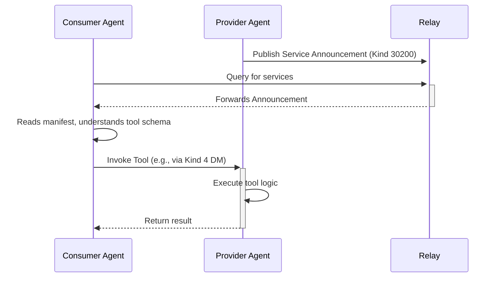

# 5. Discovery & Interoperability: Finding and Using Agents

A decentralized ecosystem of agents is only useful if they can find each other and understand how to interact. The SAND stack addresses this through a combination of Nostr-based announcements and a standardized protocol for service interaction.

## Announcing Capabilities (`Kind 30300`)

How does an agent know what other agents can do? Agents broadcast their skills and capabilities using a specific, replaceable Nostr event: `Kind 30300` (Agent Capability Announcement).

This event contains structured data that describes the agent's abilities, such as:
*   `"can_translate"`
*   `"can_analyze_images"`
*   `"provides_weather_forecast"`

Other agents can subscribe to these events on Nostr relays to discover agents that offer the services they need. Because it's a replaceable event, the information can be updated at any time.

## The Model Context Protocol (MCP)

Once an agent is discovered, a consumer needs a standardized way to *use* its services. This is where the **Model Context Protocol (MCP)** comes in. MCP is a simple, JSON-based request/response protocol that allows agents to expose their capabilities as programmable tools.

### How MCP Works

1.  **Service Announcement (`Kind 30200`)**: An agent that wants to offer a service publishes a replaceable `Kind 30200` event. This event contains a manifest describing the service, its tools, and the input/output schemas for each tool.

2.  **Discovery**: A consumer agent discovers this service announcement by querying Nostr relays.

3.  **Invocation**: The consumer agent formats a request according to the schema defined in the manifest and sends it to the provider agent (typically as a `Kind 4` encrypted message).

4.  **Execution & Response**: The provider agent executes the requested tool and returns the result to the consumer.

### Benefits of MCP
*   **Interoperability**: Any agent that speaks MCP can interact with any other MCP-compliant agent.
*   **Dynamic Discovery**: Agents can discover and bind to services at runtime without prior configuration.
*   **Composability**: Agents can chain together services from multiple other agents to accomplish complex tasks.

MCP transforms a collection of individual agents into a true, collaborative network, where capabilities can be shared, composed, and monetized in a decentralized and permissionless way.

---
**Previous:** [4. Economy: The Trustless Transaction Layer](./04-economy.md)