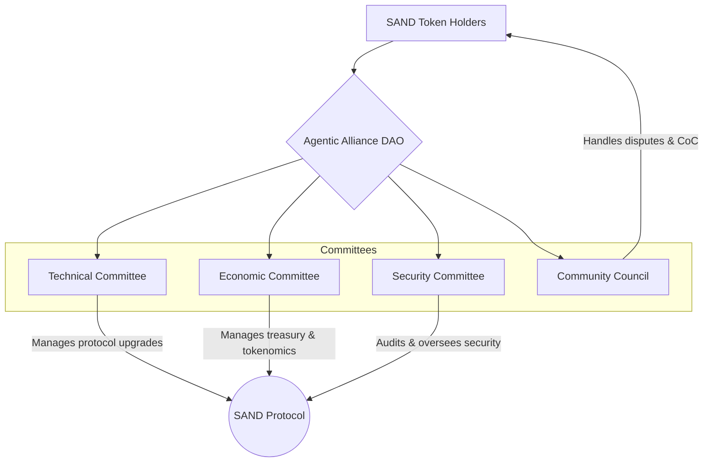

# 1. Governance Model

The Agentic Alliance is governed by a Decentralized Autonomous Organization (DAO) responsible for guiding the evolution of the SAND stack and the health of the ecosystem. The governance model is designed to be transparent, resilient, and adaptable.

## The DAO Structure

The DAO is structured around a set of specialized committees, each with a distinct mandate. This separation of concerns ensures that decisions are made by those with the most relevant expertise.

### Roles and Responsibilities

#### SAND Token Holders
SAND token holders are the ultimate authority in the DAO. They have the power to:
*   Vote on all major proposals (PIPs/NIPAs).
*   Elect members to the various committees.
*   Delegate their voting power to other community members or elected representatives.

#### Technical Committee
*   **Mandate**: To oversee the technical development and maintenance of the SAND protocol stack.
*   **Responsibilities**:
    *   Review and approve technical proposals (e.g., new NIPs, protocol upgrades).
    *   Maintain the core codebase and reference implementations.
    *   Define the technical roadmap for the ecosystem.
*   **Composition**: Comprised of experienced developers and protocol specialists elected by token holders.

#### Economic Committee
*   **Mandate**: To ensure the long-term economic sustainability of the ecosystem.
*   **Responsibilities**:
    *   Manage the DAO treasury.
    *   Propose adjustments to the tokenomic model (e.g., fee structures, staking rewards).
    *   Oversee the allocation of grants and funding for ecosystem projects.
*   **Composition**: Comprised of experts in economics, finance, and token engineering.

#### Security Committee
*   **Mandate**: To safeguard the security and integrity of the SAND protocol and its users.
*   **Responsibilities**:
    *   Conduct and commission security audits of the core protocol and critical infrastructure.
    *   Manage a bug bounty program.
    *   Develop and publish security best practices for agent developers.
    *   Respond to security incidents.
*   **Composition**: Comprised of security researchers, smart contract auditors, and cybersecurity professionals.

#### Community Council
*   **Mandate**: To foster a healthy, inclusive, and productive community.
*   **Responsibilities**:
    *   Mediate disputes between community members.
    *   Enforce the Code of Conduct.
    *   Organize community events and initiatives.
    *   Act as a liaison between the community and the other governance committees.
*   **Composition**: Comprised of respected and trusted community members.

## Proposal Lifecycle

The process for introducing changes to the protocol or the DAO is formalized through **Protocol Improvement Proposals (PIPs)** or **Nostr Improvement Proposals for Agents (NIPAs)**.

1.  **Idea**: A proposal is formulated and discussed informally within the community (e.g., on a forum or social channel).
2.  **Draft**: The author drafts a formal proposal following a standardized template.
3.  **Submission**: The draft is submitted to the relevant committee for review.
4.  **Review**: The committee reviews the proposal for technical soundness, economic viability, and security implications.
5.  **Vote**: If the committee approves the proposal, it is put to a formal vote of all SAND token holders.
6.  **Implementation**: If the vote passes, the proposal is implemented by the relevant teams.

This structured process ensures that all changes are thoroughly vetted and have the broad support of the community before being enacted.

---
**Next:** [2. Economic Model](./02-economic-model.md)