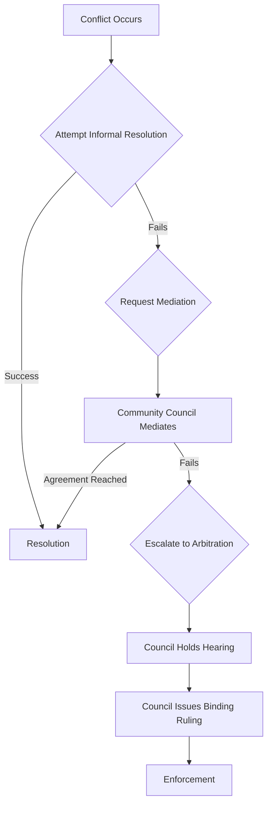

# 4. Conflict Resolution

In any large, decentralized community, disagreements and disputes are inevitable. The Agentic Alliance has a structured, transparent process for resolving conflicts, ensuring that all parties are heard and that decisions are made fairly. The Community Council is the primary body responsible for overseeing this process.

## Guiding Principles

*   **Assume Good Faith**: We start from the assumption that community members are acting with good intentions.
*   **Privacy and Transparency**: The process should be as transparent as possible, but the privacy of the individuals involved will be respected.
*   **De-escalation**: The primary goal is to de-escalate conflict and find a mutually agreeable solution.
*   **Proportionality**: The response to a conflict or violation should be proportional to its severity.

## The Resolution Process

### Step 1: Informal Resolution (Peer-to-Peer)

Whenever possible, community members are encouraged to resolve disputes directly and informally. A simple, respectful conversation can often clear up misunderstandings before they escalate.

### Step 2: Mediation (Community Council)

If informal resolution fails or is not appropriate, any party involved in a dispute can request mediation from the Community Council.
1.  **Request**: A formal request is submitted to the Council, outlining the nature of the dispute.
2.  **Assignment**: The Council assigns one or two members to act as neutral mediators.
3.  **Mediation Session**: The mediators facilitate a private discussion between the parties, helping them to find common ground and reach a voluntary agreement.
4.  **Agreement**: If an agreement is reached, it is documented and signed by all parties.

### Step 3: Arbitration (Formal Ruling)

If mediation fails to produce an agreement, the dispute can be escalated to formal arbitration by the Community Council.
1.  **Evidence Submission**: All parties submit their evidence and arguments to the Council.
2.  **Hearing**: The Council holds a formal hearing where each party can present their case.
3.  **Deliberation**: The Council deliberates in private to reach a decision.
4.  **Binding Ruling**: The Council issues a binding ruling. This ruling is public and must be respected by all parties.

## Types of Disputes

This process applies to several types of conflicts:

*   **Interpersonal Disputes**: Disagreements between community members.
*   **Code of Conduct Violations**: Allegations of harassment, abuse, or other violations of the community's code of conduct.
*   **Technical Disputes**: Disagreements over technical implementations or the interpretation of a protocol specification.
*   **Economic Disputes**: Conflicts arising from failed transactions or disagreements over the terms of a Nostr Ricardian Contract (NRC). The NRC itself often serves as the primary evidence in these cases.

## Enforcement

The Community Council has the authority to enforce its rulings. The actions taken will be proportional to the severity of the offense and may include:
*   Formal warnings.
*   Temporary or permanent suspension from community platforms.
*   In extreme cases, a public statement of censure.

This structured process ensures that conflicts are resolved in a fair and predictable manner, maintaining the health and integrity of the community.

---
**Previous:** [3. Decision-Making & Voting](./03-decision-making-and-voting.md)
**Next:** [5. Community & Code of Conduct](./05-community-and-code-of-conduct.md)