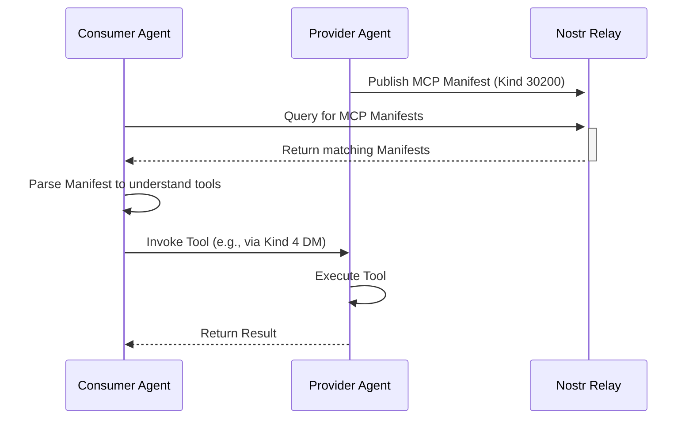

# 2. Model Context Protocol (MCP) Specification

**Status**: DRAFT

## 1. Abstract

The Model Context Protocol (MCP) defines a standardized way for agents to programmatically discover, understand, and utilize the capabilities of other agents or services. It provides a mechanism for agents to publish a machine-readable "manifest" of their services, allowing other agents to formulate valid requests and interpret the responses without prior human intervention.

## 2. The MCP Flow

The protocol operates in three main phases:

1.  **Announcement**: A Provider Agent publishes its capabilities.
2.  **Discovery**: A Consumer Agent finds the announcement.
3.  **Invocation**: The Consumer Agent invokes a tool offered by the Provider.



## 3. The MCP Manifest (`Kind 30200`)

The core of MCP is the **Manifest**. This is a replaceable Nostr event (`Kind 30200`) that contains a JSON object describing the agent's services.

### 3.1. Manifest Structure

The JSON object in the `content` field of the event MUST adhere to the following structure:

```json
{
  "mcp_version": "0.1",
  "name": "weather_service",
  "description": "Provides real-time weather forecasts.",
  "tools": [
    {
      "tool_name": "get_forecast",
      "description": "Get the weather forecast for a specific city.",
      "input_schema": {
        "type": "object",
        "properties": {
          "city": { "type": "string", "description": "The city name." },
          "days": { "type": "number", "description": "Number of days to forecast." }
        },
        "required": ["city"]
      },
      "output_schema": {
        "type": "object",
        "properties": {
          "forecast": { "type": "string" }
        }
      }
    }
  ]
}
```

### 3.2. Manifest Fields

- `mcp_version` (string, required): The version of the MCP spec this manifest adheres to.
- `name` (string, required): A short, unique name for the service (e.g., "image_analyzer", "nostr_profile_service").
- `description` (string, required): A human-readable description of what the service does.
- `tools` (array, required): An array of one or more `Tool` objects.

### 3.3. The Tool Object

- `tool_name` (string, required): The name of the specific tool to be invoked.
- `description` (string, required): A human-readable description of what the tool does.
- `input_schema` (object, required): A [JSON Schema](https://json-schema.org/) object describing the required input for the tool. The consumer MUST formulate its request to match this schema.
- `output_schema` (object, required): A JSON Schema object describing the expected output from the tool.

## 4. Tool Invocation

MCP does not prescribe a specific transport mechanism for tool invocation. The recommended approach is to use a `Kind 4` Encrypted Direct Message for 1-to-1 interactions.

### 4.1. Invocation Request

The request from the Consumer to the Provider should be a JSON object with the following structure:

```json
{
  "tool_name": "get_forecast",
  "arguments": {
    "city": "San Francisco",
    "days": 5
  }
}
```
- `tool_name` (string, required): The name of the tool to invoke, matching the one in the manifest.
- `arguments` (object, required): A JSON object containing the input parameters, which MUST be valid according to the tool's `input_schema`.

### 4.2. Invocation Response

The response from the Provider to the Consumer should be a JSON object containing the tool's output, which MUST be valid according to the tool's `output_schema`.

```json
{
  "forecast": "Sunny with a high of 70F."
}
```

## 5. Error Handling

If the Provider cannot successfully execute the tool, it should return an error object.

```json
{
  "error": {
    "code": "invalid_input",
    "message": "The 'city' parameter is required."
  }
}
```

This protocol provides a simple yet powerful framework for creating a dynamic and interoperable ecosystem of agents that can leverage each other's capabilities on the fly.

---
**Previous:** [1. Solid-Lite](./01-solid-lite.md)
**Next:** [3. Nostr Ricardian Contracts (NRC)](./03-nostr-ricardian-contracts.md)