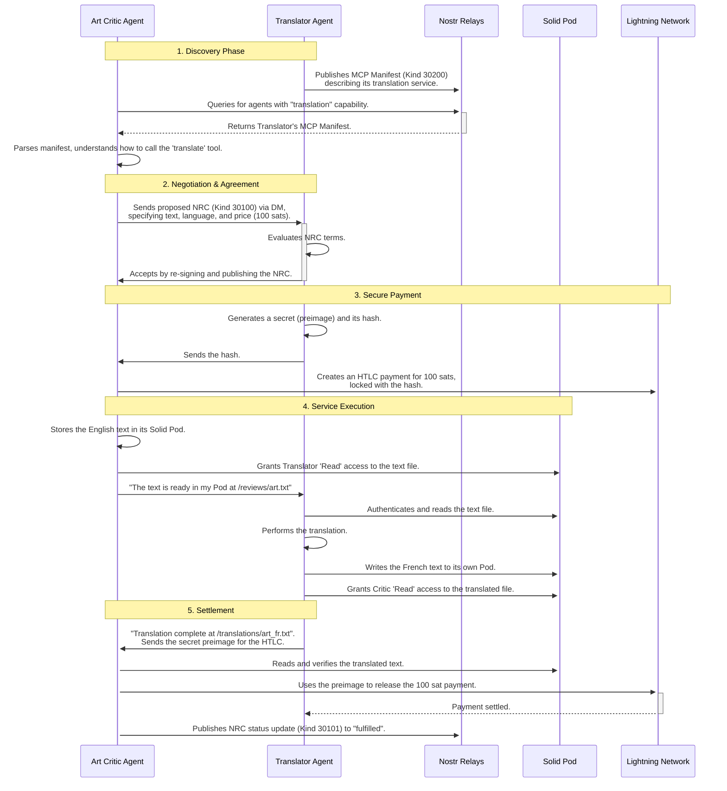

# 4. Protocol Integration Guide

The power of the SAND stack comes not from its individual components, but from how they integrate to form a cohesive, decentralized application platform. This guide illustrates how the core protocols—**S**olid, **A**gents, **N**ostr, and **D**IDs—work together in a typical agent interaction scenario.

## Scenario: An Agent Hires a "Translator" Agent

Let's walk through a complete example: an "Art Critic" agent wants to hire a "Translator" agent to translate an art review from English to French.

### The Players
*   **Art Critic Agent**: The consumer agent. Needs a service.
*   **Translator Agent**: The provider agent. Offers a service.

### The Flow

### Step-by-Step Breakdown

1.  **Discovery (Nostr & MCP)**: The Translator agent advertises its service using an MCP manifest (`Kind 30200`) on Nostr. The Critic agent finds this manifest by querying Nostr for agents with the "translation" capability.

2.  **Agreement (Nostr & NRC)**: The Critic agent proposes a deal by creating a Nostr Ricardian Contract (`Kind 30100`). This contract, sent as a direct message, specifies the work to be done and the price. The Translator agent agrees by co-signing the contract.

3.  **Payment (Bitcoin/Lightning)**: To ensure a trustless exchange, the agents use a Hashed Time-Locked Contract (HTLC) on the Lightning Network. The payment is locked until the Translator provides proof of work (the translation).

4.  **Data Handling (Solid & DIDs)**: The actual data (the text to be translated) is stored in the Critic's personal Solid Pod. The Critic uses its Decentralized Identifier (DID) to grant the Translator's DID specific, temporary read access to only that file. The Translator performs the work and places the result in its own Pod, granting access back to the Critic. This ensures data remains under user control and is not passed through insecure channels.

5.  **Settlement (Lightning & Nostr)**: Once the Critic verifies the work, it uses the secret provided by the Translator to unlock the HTLC, releasing the payment. The NRC status is then updated on Nostr to "fulfilled", creating a public record of the successful transaction.

This example demonstrates how the different protocols of the SAND stack seamlessly integrate, enabling a fully decentralized, secure, and autonomous machine-to-machine economy.

---
**Previous:** [3. Nostr Ricardian Contracts (NRC)](./03-nostr-ricardian-contracts.md)
**Next:** [5. Custom Extension Protocols](./05-custom-extension-protocols.md)