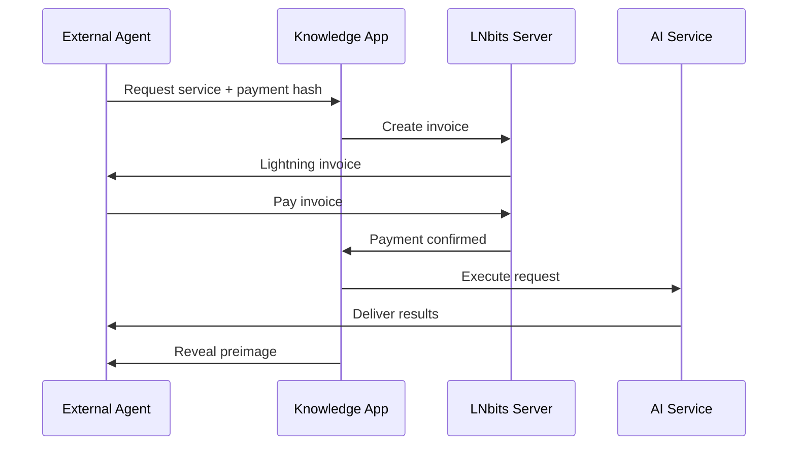

# Knowledge Management App Integration with SAND/Blocktrails

## Executive Summary

This document outlines a comprehensive plan to integrate the AR-AI-Knowledge-Graph application with the SAND Stack (Solid, Agents, Nostr, DIDs) and Blocktrails ecosystem. The integration will transform the knowledge management app into a decentralized, agent-based service that can:

- Offer paid knowledge inference services to external nostr agents
- Store knowledge graphs in decentralized SOLID-lite pods
- Create immutable audit trails using Blocktrails
- Enable agent-to-agent knowledge sharing and collaboration
- Participate in the decentralized machine economy

## Current State Analysis

### Existing Capabilities
1. **Nostr Authentication** (NIP-42)
   - Already implements nostr-based auth with session management
   - Power user and regular user distinction
   - API protection via nostr pubkeys

2. **AI Services**
   - RAGFlow for chat/conversation
   - Perplexity for content generation
   - Speech-to-text/text-to-speech
   - Knowledge graph visualization

3. **Architecture**
   - Actor-based system (Actix)
   - WebSocket real-time communication
   - Binary protocol for efficiency
   - GPU-accelerated graph processing

4. **Undocumented Assets**
   - LNbits lightning server access
   - Nostr-aware payment infrastructure

## Integration Opportunities

### 1. Transform App into SAND Agent

**Objective**: Convert the knowledge app into a fully autonomous SAND agent that can offer services on the nostr network.

**Implementation**:
```javascript
// Agent identity creation
{
  "@context": ["https://www.w3.org/ns/did/v1", "https://w3id.org/nostr/context"],
  "id": "did:nostr:knowledge-graph-agent",
  "service": [{
    "id": "#knowledge-inference",
    "type": "KnowledgeInferenceService",
    "serviceEndpoint": "https://api.knowledge-graph.ai",
    "priceModel": {
      "query": "100 sats",
      "graphVisualization": "500 sats",
      "aiInference": "1000 sats"
    }
  }]
}
```

### 2. Payment-Gated Knowledge APIs

**Objective**: Monetize knowledge inference services using Lightning Network.

**Architecture**:


**Services to Monetize**:
- Knowledge graph queries
- AI-powered inference
- Graph visualization rendering
- Document analysis
- Custom knowledge synthesis

### 3. SOLID-lite Storage Integration

**Objective**: Store knowledge graphs in decentralized, user-owned data pods.

**Data Architecture**:
```turtle
# Knowledge Graph Pod Structure
/pods/{user-did}/
  /graphs/
    /public/              # Publicly accessible graphs
    /private/             # Private knowledge graphs
    /shared/              # Graphs with specific ACL
  /metadata/
    /index.ttl           # Graph metadata index
    /relationships.ttl   # Inter-graph relationships
  /checkpoints/
    /blocktrail-refs/    # Blocktrail state references
```

**Benefits**:
- User data sovereignty
- Decentralized backup
- Cross-agent graph sharing
- Fine-grained access control

### 4. Blocktrails for Knowledge State

**Objective**: Create immutable audit trails for knowledge graph evolution.

**Use Cases**:
1. **Knowledge Graph Checkpoints**
   ```javascript
   // Periodic state commitment
   const graphState = {
     graphId: "knowledge-graph-001",
     nodeCount: 1523,
     edgeCount: 4892,
     lastModified: Date.now(),
     contentHash: sha256(graphData),
     solidPodUrl: "https://pod.provider/user/graphs/001"
   };
   
   const checkpoint = await blocktrail.commitState(graphState);
   ```

2. **Collaborative Knowledge Building**
   - Track contributions from multiple agents
   - Prove knowledge provenance
   - Enable reputation-based access

3. **Knowledge Verification**
   - Cryptographic proof of knowledge state
   - Tamper-evident history
   - Dispute resolution for conflicting information

### 5. Nostr Agent Ecosystem Integration

**Objective**: Enable the app to create and manage its own agent swarm.

**Agent Types**:
1. **Query Agents**: Handle specific knowledge domains
2. **Synthesis Agents**: Combine knowledge from multiple sources
3. **Validation Agents**: Verify information accuracy
4. **Translation Agents**: Convert between knowledge formats

**Communication Protocol**:
```javascript
// Knowledge query via Nostr
{
  kind: 31337,  // Custom knowledge query kind
  tags: [
    ["service", "knowledge-inference"],
    ["query-type", "semantic-search"],
    ["payment", "lightning-invoice-here"],
    ["response-format", "graph-json"]
  ],
  content: "Find connections between quantum computing and biological systems"
}
```

### 6. Feature Distribution Strategy

**Modular Services**:
1. **Graph Algorithms** (as SAND utilities)
   - PageRank calculation
   - Community detection
   - Path finding
   - Similarity metrics

2. **Knowledge Protocols**
   - Standard query format
   - Graph interchange format
   - Inference result schema
   - Collaboration protocol

3. **Marketplace Participation**
   - Offer knowledge services
   - Consume external data
   - Trade knowledge assets
   - Collaborative inference

## Migration Roadmap

### Phase 1: Foundation (Weeks 1-4)
- [ ] Create agent DID and service definitions
- [ ] Implement Lightning invoice generation
- [ ] Basic HTLC payment verification
- [ ] Nostr service announcement

### Phase 2: Storage Migration (Weeks 5-8)
- [ ] Implement SOLID-lite client
- [ ] Create pod structure for graphs
- [ ] Migrate existing graphs to pods
- [ ] Implement ACL management

### Phase 3: Economic Integration (Weeks 9-12)
- [ ] Full Lightning payment flow
- [ ] Nostr Ricardian Contracts for SLAs
- [ ] Implement usage-based pricing
- [ ] Create billing dashboard

### Phase 4: Blocktrail Integration (Weeks 13-16)
- [ ] Design state checkpoint schema
- [ ] Implement Blocktrail client
- [ ] Create audit UI
- [ ] Enable state verification

### Phase 5: Agent Ecosystem (Weeks 17-20)
- [ ] Spawn specialized sub-agents
- [ ] Implement inter-agent protocols
- [ ] Create agent marketplace listing
- [ ] Enable collaborative knowledge building

### Phase 6: Advanced Features (Weeks 21-24)
- [ ] Multi-agent consensus for facts
- [ ] Reputation system integration
- [ ] Advanced privacy features
- [ ] Cross-pod knowledge federation

## Technical Implementation Details

### 1. Nostr Integration Enhancement
```rust
// Extend existing NostrService
impl NostrService {
    async fn create_service_announcement(&self) -> NostrEvent {
        // Announce knowledge services on nostr
    }
    
    async fn handle_service_request(&self, event: NostrEvent) -> Result<()> {
        // Process incoming service requests
    }
    
    async fn create_payment_invoice(&self, amount: u64) -> LightningInvoice {
        // Generate Lightning invoice via LNbits
    }
}
```

### 2. SOLID-lite Client
```rust
pub struct SolidLiteClient {
    pod_url: String,
    auth_token: String,
}

impl SolidLiteClient {
    async fn store_graph(&self, graph: &KnowledgeGraph) -> Result<()> {
        // Store graph in SOLID pod
    }
    
    async fn share_with_agent(&self, graph_id: &str, agent_did: &str) -> Result<()> {
        // Update ACL to share with specific agent
    }
}
```

### 3. Blocktrail Service
```rust
pub struct BlocktrailService {
    current_utxo: Option<Utxo>,
    keypair: NostrKeypair,
}

impl BlocktrailService {
    async fn checkpoint_graph_state(&self, graph: &KnowledgeGraph) -> Result<Outpoint> {
        // Commit graph state hash to blocktrail
    }
    
    async fn verify_graph_history(&self, graph_id: &str) -> Result<Vec<StateProof>> {
        // Audit graph modification history
    }
}
```

## Security Considerations

1. **Payment Security**
   - Use HTLCs for atomic swaps
   - Implement payment timeouts
   - Rate limiting per pubkey

2. **Data Privacy**
   - Encrypt sensitive graphs in SOLID pods
   - Use zero-knowledge proofs for private queries
   - Implement selective disclosure

3. **Agent Authentication**
   - Verify all nostr signatures
   - Maintain agent reputation scores
   - Implement permission inheritance

## Performance Optimizations

1. **Caching Strategy**
   - Cache frequent queries
   - Local SOLID pod mirrors
   - Payment channel reuse

2. **Scalability**
   - Horizontal agent spawning
   - Graph sharding across pods
   - Distributed inference

## Success Metrics

1. **Economic**
   - Revenue from knowledge services
   - Number of paying agents
   - Transaction volume

2. **Technical**
   - Query response time
   - Graph storage efficiency
   - Blocktrail verification speed

3. **Ecosystem**
   - Active agent connections
   - Knowledge graph diversity
   - Collaboration frequency

## Risk Mitigation

1. **Technical Risks**
   - Gradual migration with fallbacks
   - Extensive testing environment
   - Monitoring and alerting

2. **Economic Risks**
   - Start with low prices
   - Free tier for testing
   - Gradual feature rollout

3. **Security Risks**
   - Regular security audits
   - Bug bounty program
   - Incident response plan

## Next Steps

1. **Immediate Actions**
   - Set up SAND development environment
   - Create proof-of-concept Lightning integration
   - Design graph storage schema for SOLID-lite

2. **Research Requirements**
   - Study ngit for version control integration
   - Evaluate multi-agent consensus mechanisms
   - Investigate privacy-preserving query methods

3. **Community Engagement**
   - Join SAND developer community
   - Propose knowledge protocol standards
   - Seek feedback on integration approach

## Conclusion

The integration of the AR-AI-Knowledge-Graph with the SAND/Blocktrails ecosystem represents a significant evolution from a centralized knowledge management system to a decentralized, agent-based knowledge economy. This transformation will enable:

- Monetization of knowledge services
- Decentralized knowledge ownership
- Trustless agent collaboration
- Immutable knowledge provenance
- Participation in the machine economy

The phased approach ensures a smooth transition while maintaining system stability and user experience. By leveraging existing nostr authentication and the undocumented Lightning infrastructure, we can accelerate the integration and quickly demonstrate value to the ecosystem.