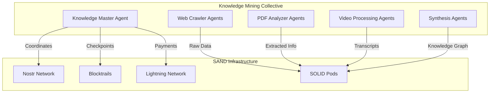

# Innovative SAND/Blocktrails Integration Ideas for Knowledge Management

## Revolutionary Concepts

### 1. Distributed Knowledge Mining Collective

**Concept**: Create a swarm of specialized mining agents that collaboratively build knowledge graphs.



**Implementation**:
- Each agent specializes in different data sources
- Agents bid on mining tasks via Lightning micropayments
- Knowledge contributions tracked on Blocktrails
- Collective knowledge graph emerges from individual contributions

### 2. Knowledge Consensus Protocol

**Concept**: Multi-agent validation for establishing "truth" in knowledge graphs.

```javascript
// Knowledge Claim Event
{
  kind: 31338,  // Knowledge claim
  content: {
    claim: "Quantum entanglement enables faster-than-light communication",
    confidence: 0.15,
    sources: ["arxiv:1234.5678", "doi:10.1234/science.abc"],
    graphNode: "node-quantum-comms-001"
  },
  tags: [
    ["validation-bounty", "5000 sats"],
    ["deadline", "1234567890"],
    ["expertise-required", "quantum-physics"]
  ]
}

// Validation Response Event
{
  kind: 31339,  // Knowledge validation
  content: {
    claimId: "claim-event-id",
    verdict: "disputed",
    evidence: "Violates no-communication theorem",
    counterSources: ["doi:10.1234/physics.xyz"],
    validatorReputation: 0.92
  }
}
```

**Benefits**:
- Crowdsourced fact-checking
- Reputation-weighted consensus
- Economic incentives for accuracy
- Transparent validation history

### 3. Knowledge Graph NFTs with Blocktrails

**Concept**: Create tradeable knowledge graph segments as NFTs, with Blocktrails proving provenance.

```javascript
class KnowledgeNFT {
  constructor(graphSegment) {
    this.id = sha256(graphSegment);
    this.metadata = {
      nodeCount: graphSegment.nodes.length,
      domain: graphSegment.domain,
      quality: graphSegment.validationScore,
      creator: graphSegment.creatorDID
    };
    this.blocktrail = null;
  }
  
  async mint() {
    // Create genesis UTXO for this knowledge NFT
    this.blocktrail = await createGenesisUTXO({
      tweak: sha256(this.metadata),
      value: 546  // Dust limit
    });
    
    // Announce on Nostr
    await announceNFT(this);
  }
  
  async transfer(newOwnerDID) {
    // Update Blocktrail with new ownership
    this.blocktrail = await spendUTXO({
      prev: this.blocktrail,
      tweak: sha256({
        ...this.metadata,
        owner: newOwnerDID,
        transferTime: Date.now()
      })
    });
  }
}
```

### 4. Predictive Knowledge Markets

**Concept**: Agents bet on future knowledge graph connections using Lightning.

```javascript
// Create prediction market for knowledge connection
const market = {
  question: "Will a connection between 'CRISPR' and 'Aging reversal' be established by 2025?",
  options: {
    yes: { odds: 3.5, volume: 150000 },
    no: { odds: 1.4, volume: 95000 }
  },
  resolver: "did:nostr:knowledge-oracle-agent",
  settlementBlocktrail: "genesis-outpoint-123",
  expiryDate: "2025-01-01"
};

// Agents place bets via Lightning
const bet = {
  market: market.id,
  position: "yes",
  amount: 10000,  // sats
  paymentHash: "lightning-payment-hash"
};
```

### 5. Semantic Lightning Routing

**Concept**: Route payments through agents based on semantic knowledge paths.

```javascript
// Payment request with semantic routing hints
{
  invoice: "lnbc...",
  semanticRoute: {
    start: "quantum-computing",
    end: "drug-discovery",
    preferredPath: ["materials-science", "molecular-simulation"],
    routingAgents: [
      {
        did: "did:nostr:materials-expert",
        specialty: "quantum-materials",
        fee: 10  // sats
      },
      {
        did: "did:nostr:pharma-researcher",
        specialty: "computational-drug-design",
        fee: 15
      }
    ]
  }
}
```

### 6. Collaborative Knowledge Synthesis DAO

**Concept**: Decentralized organization where agents vote on knowledge synthesis priorities.

```yaml
KnowledgeDAO:
  treasury:
    address: "bc1q..."
    balance: 10000000  # sats
    blocktrail: "dao-treasury-genesis"
  
  proposals:
    - id: "synth-climate-ai"
      title: "Synthesize AI solutions for climate change"
      requestedFunding: 500000
      deliverables:
        - "Comprehensive knowledge graph"
        - "Action recommendations"
        - "Implementation roadmap"
      votes:
        for: 127
        against: 23
      votingDeadline: "2024-12-31"
  
  members:
    - did: "did:nostr:member1"
      reputation: 850
      votingPower: 15
      contributions: 47
```

### 7. Zero-Knowledge Knowledge Proofs

**Concept**: Prove knowledge possession without revealing the knowledge itself.

```rust
// Prove you have knowledge about a topic without revealing specifics
struct KnowledgeProof {
    commitment: Hash,  // Hash of the knowledge graph segment
    challenge: Hash,   // Random challenge from verifier
    response: ZKProof, // Zero-knowledge proof of knowledge
}

impl KnowledgeProof {
    fn prove_connection_exists(&self, node_a: &str, node_b: &str) -> bool {
        // Prove a connection exists between two nodes
        // without revealing the path or intermediate nodes
    }
    
    fn prove_graph_size(&self, min_nodes: usize) -> bool {
        // Prove the graph has at least N nodes
        // without revealing exact count or content
    }
}
```

### 8. Knowledge Graph Sharding with Multi-Sig Control

**Concept**: Distribute large knowledge graphs across multiple SOLID pods with multi-agent control.

```javascript
class ShardedKnowledgeGraph {
  constructor(graphId, shardCount) {
    this.graphId = graphId;
    this.shards = new Map();
    this.shardIndex = {}; // Maps nodes to shards
    this.controllers = []; // Multi-sig controllers
  }
  
  async distributeGraph(graph, agents) {
    // Shard the graph using consistent hashing
    const shards = this.shardGraph(graph);
    
    // Distribute shards to different SOLID pods
    for (const [shardId, shard] of shards) {
      const pod = agents[shardId % agents.length].solidPod;
      await pod.store(`/graphs/${this.graphId}/shard-${shardId}`, shard);
      
      // Record shard location on Blocktrail
      await this.recordShardLocation(shardId, pod.url);
    }
  }
  
  async queryAcrossShards(query) {
    // Parallel query across all shards
    const results = await Promise.all(
      Array.from(this.shards.values()).map(shard => 
        shard.query(query)
      )
    );
    return this.mergeResults(results);
  }
}
```

### 9. Time-Locked Knowledge Reveals

**Concept**: Encrypt knowledge that automatically becomes available at specific times/conditions.

```javascript
// Time-locked knowledge contract
const timeLockedKnowledge = {
  encryptedContent: "encrypted-knowledge-data",
  revealConditions: {
    time: "2025-01-01T00:00:00Z",
    blockHeight: 820000,
    eventTrigger: "patent-expiry:US123456"
  },
  beneficiaries: [
    "did:nostr:researcher1",
    "did:nostr:institution2"
  ],
  escrowPayment: {
    amount: 100000,  // sats
    releaseOn: "reveal"
  }
};
```

### 10. Knowledge Liquidity Pools

**Concept**: Create AMM-style pools for knowledge token swaps.

```javascript
class KnowledgeLiquidityPool {
  constructor(knowledgeDomainA, knowledgeDomainB) {
    this.reserves = {
      domainA: 1000,  // Knowledge tokens for domain A
      domainB: 1000   // Knowledge tokens for domain B
    };
    this.k = this.reserves.domainA * this.reserves.domainB;
  }
  
  async swapKnowledge(inputDomain, inputAmount) {
    // Calculate output using constant product formula
    const outputDomain = inputDomain === 'domainA' ? 'domainB' : 'domainA';
    const outputAmount = this.calculateOutput(inputAmount);
    
    // Execute swap via Lightning payment
    const invoice = await this.createSwapInvoice(inputAmount, outputAmount);
    
    // Update reserves on Blocktrail
    await this.updateReserves();
    
    return { outputAmount, invoice };
  }
}
```

## Implementation Strategies

### 1. Phased Rollout
- Start with simple payment-gated APIs
- Add collaborative features gradually
- Build reputation system over time
- Introduce advanced features last

### 2. Developer Experience
- Create SAND SDK for knowledge apps
- Provide templates and examples
- Build debugging tools
- Offer hosted infrastructure initially

### 3. Economic Bootstrap
- Initial liquidity provision
- Early adopter incentives
- Gradual fee introduction
- Revenue sharing with contributors

### 4. Community Building
- Open source core protocols
- Developer grants program
- Hackathons and bounties
- Educational content

## Future Vision

The integration of SAND/Blocktrails with knowledge management creates possibilities for:

1. **Global Knowledge Commons**: Decentralized, collectively-owned knowledge
2. **Truth Markets**: Economic incentives for accurate information
3. **Automated Research**: Agent swarms conducting independent research
4. **Knowledge Democracy**: Community-governed information systems
5. **Semantic Web 3.0**: Machine-readable, economically-incentivized knowledge

This transformation positions the knowledge management app at the forefront of the decentralized knowledge economy, enabling new forms of collaboration, monetization, and discovery that were previously impossible.