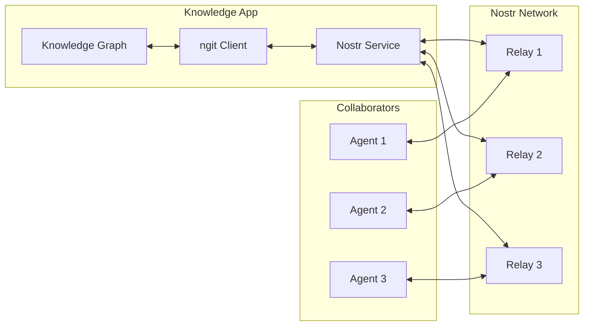

# Technical Specifications: Knowledge App SAND Integration

## ngit Integration for Distributed Knowledge Versioning

### Overview
ngit (Nostr Git) enables decentralized version control for knowledge graphs, allowing collaborative editing without central servers.

### Architecture



### Implementation Specifications

#### 1. ngit Events for Knowledge Graphs

```rust
// Custom ngit event types for knowledge management
pub enum KnowledgeGitEventKind {
    GraphCommit = 31340,      // Commit knowledge graph changes
    GraphBranch = 31341,      // Create/update branch
    GraphMergeRequest = 31342, // Request to merge changes
    GraphTag = 31343,         // Tag specific graph versions
    GraphIssue = 31344,       // Report issues with knowledge
}

// Knowledge graph commit event
pub struct GraphCommitEvent {
    pub id: EventId,
    pub pubkey: PublicKey,
    pub created_at: Timestamp,
    pub kind: u16, // 31340
    pub tags: Vec<Tag>,
    pub content: GraphCommitContent,
    pub sig: Signature,
}

#[derive(Serialize, Deserialize)]
pub struct GraphCommitContent {
    pub graph_id: String,
    pub parent_commits: Vec<String>,
    pub changes: GraphDiff,
    pub message: String,
    pub metadata: CommitMetadata,
}

#[derive(Serialize, Deserialize)]
pub struct GraphDiff {
    pub added_nodes: Vec<Node>,
    pub removed_nodes: Vec<NodeId>,
    pub added_edges: Vec<Edge>,
    pub removed_edges: Vec<EdgeId>,
    pub modified_nodes: Vec<NodeModification>,
}
```

#### 2. Branching Strategy

```rust
// Branch management for knowledge graphs
impl KnowledgeGitBranch {
    pub async fn create_feature_branch(&self, base: &str, name: &str) -> Result<Branch> {
        let branch_event = NostrEvent {
            kind: KnowledgeGitEventKind::GraphBranch as u16,
            tags: vec![
                Tag::Generic("branch".into(), vec![name.into()]),
                Tag::Generic("base".into(), vec![base.into()]),
                Tag::Generic("graph".into(), vec![self.graph_id.clone()]),
            ],
            content: serde_json::to_string(&BranchMetadata {
                created_by: self.agent_did.clone(),
                purpose: "feature".into(),
                timestamp: Utc::now(),
            })?,
            ..Default::default()
        };
        
        self.publish_event(branch_event).await
    }
    
    pub async fn merge_branches(&self, source: &str, target: &str) -> Result<MergeResult> {
        // Implement three-way merge for knowledge graphs
        let common_ancestor = self.find_common_ancestor(source, target).await?;
        let source_changes = self.get_changes_since(source, &common_ancestor).await?;
        let target_changes = self.get_changes_since(target, &common_ancestor).await?;
        
        // Detect and resolve conflicts
        let conflicts = self.detect_conflicts(&source_changes, &target_changes);
        
        if conflicts.is_empty() {
            self.apply_merge(source_changes, target).await
        } else {
            self.create_merge_request(source, target, conflicts).await
        }
    }
}
```

### Lightning Payment Integration

#### Payment Channel Management

```rust
// Lightning service extension for knowledge services
pub struct KnowledgeLightningService {
    lnbits_client: LNBitsClient,
    channel_manager: ChannelManager,
    invoice_cache: Arc<RwLock<HashMap<String, Invoice>>>,
}

impl KnowledgeLightningService {
    pub async fn create_knowledge_invoice(&self, request: KnowledgeRequest) -> Result<Invoice> {
        let price = self.calculate_price(&request);
        
        let invoice = self.lnbits_client.create_invoice(CreateInvoiceRequest {
            amount: price,
            memo: format!("Knowledge query: {}", request.query_type),
            webhook: Some(format!("{}/webhooks/payment", self.base_url)),
            expiry: Some(600), // 10 minutes
        }).await?;
        
        // Store invoice with metadata
        self.invoice_cache.write().await.insert(
            invoice.payment_hash.clone(),
            InvoiceMetadata {
                invoice: invoice.clone(),
                request,
                created_at: Utc::now(),
                status: InvoiceStatus::Pending,
            }
        );
        
        Ok(invoice)
    }
    
    pub async fn verify_payment(&self, payment_hash: &str) -> Result<PaymentStatus> {
        let status = self.lnbits_client.check_invoice(payment_hash).await?;
        
        if status.paid {
            // Update cache and trigger service delivery
            if let Some(mut metadata) = self.invoice_cache.write().await.get_mut(payment_hash) {
                metadata.status = InvoiceStatus::Paid;
                self.deliver_knowledge_service(&metadata.request).await?;
            }
        }
        
        Ok(status)
    }
}
```

#### HTLC-based Knowledge Swaps

```rust
// Atomic knowledge-for-payment swaps
pub struct KnowledgeHTLC {
    pub payment_hash: Hash,
    pub knowledge_hash: Hash,
    pub timeout: u32,
    pub amount: u64,
}

impl KnowledgeHTLC {
    pub async fn create_swap(&self, knowledge: &EncryptedKnowledge) -> Result<SwapContract> {
        // Generate preimage for knowledge unlock
        let preimage = generate_random_bytes(32);
        let payment_hash = sha256(&preimage);
        
        // Encrypt knowledge with preimage
        let encrypted = knowledge.encrypt_with_preimage(&preimage)?;
        
        // Create HTLC on Lightning
        let htlc = self.create_htlc(payment_hash, self.amount, self.timeout).await?;
        
        // Publish swap offer on Nostr
        let swap_event = NostrEvent {
            kind: 31345, // Knowledge swap offer
            content: serde_json::to_string(&SwapOffer {
                knowledge_hash: sha256(&knowledge.content),
                payment_hash,
                amount: self.amount,
                description: knowledge.description.clone(),
                preview: knowledge.generate_preview()?,
            })?,
            ..Default::default()
        };
        
        Ok(SwapContract { htlc, encrypted, swap_event })
    }
}
```

### SOLID-lite Pod Integration

#### Pod Structure for Knowledge Graphs

```typescript
// TypeScript client for SOLID-lite knowledge pods
interface KnowledgePodStructure {
  graphs: {
    [graphId: string]: {
      metadata: GraphMetadata;
      nodes: {
        [nodeId: string]: NodeData;
      };
      edges: {
        [edgeId: string]: EdgeData;
      };
      indexes: {
        semantic: SemanticIndex;
        temporal: TemporalIndex;
        spatial?: SpatialIndex;
      };
      versions: {
        [commitHash: string]: GraphVersion;
      };
    };
  };
  
  agents: {
    [agentDid: string]: {
      permissions: Permission[];
      contributions: Contribution[];
      reputation: number;
    };
  };
  
  blocktrails: {
    [trailId: string]: {
      latestOutpoint: string;
      checkpoints: Checkpoint[];
    };
  };
}

// SOLID-lite client implementation
class KnowledgeSolidClient {
  private ldp: LDPClient;
  private auth: NostrAuth;
  
  async storeGraph(graph: KnowledgeGraph): Promise<void> {
    const podUrl = await this.getPodUrl();
    const graphPath = `/graphs/${graph.id}`;
    
    // Store metadata
    await this.ldp.put(
      `${podUrl}${graphPath}/metadata.ttl`,
      this.graphToTurtle(graph.metadata),
      'text/turtle'
    );
    
    // Store nodes in batches
    const nodeBatches = chunk(graph.nodes, 100);
    for (const [index, batch] of nodeBatches.entries()) {
      await this.ldp.put(
        `${podUrl}${graphPath}/nodes/batch-${index}.ttl`,
        this.nodesToTurtle(batch),
        'text/turtle'
      );
    }
    
    // Update ACL for graph access
    await this.updateGraphACL(graphPath, graph.permissions);
  }
  
  async queryAcrossPods(query: SemanticQuery): Promise<QueryResult[]> {
    // Federated query across multiple pods
    const pods = await this.discoverRelevantPods(query);
    
    const results = await Promise.all(
      pods.map(pod => this.queryPod(pod, query))
    );
    
    return this.mergeAndRankResults(results);
  }
}
```

#### ACL Management for Knowledge Sharing

```turtle
# ACL for shared knowledge graph
@prefix acl: <http://www.w3.org/ns/auth/acl#> .
@prefix foaf: <http://xmlns.com/foaf/0.1/> .
@prefix kg: <https://knowledge.graph/ns#> .

# Owner has full control
<#owner>
    a acl:Authorization ;
    acl:agent <did:nostr:owner123> ;
    acl:accessTo </graphs/knowledge-base-001/> ;
    acl:default </graphs/knowledge-base-001/> ;
    acl:mode acl:Read, acl:Write, acl:Control .

# Collaborator agents have write access to specific branches
<#collaborators>
    a acl:Authorization ;
    acl:agentClass kg:TrustedCollaborator ;
    acl:accessTo </graphs/knowledge-base-001/branches/> ;
    acl:mode acl:Read, acl:Write .

# Public read access to main branch
<#public-read>
    a acl:Authorization ;
    acl:agentClass foaf:Agent ;
    acl:accessTo </graphs/knowledge-base-001/branches/main/> ;
    acl:mode acl:Read .

# Payment-gated access
<#paid-access>
    a acl:Authorization ;
    acl:agentClass kg:PaidSubscriber ;
    acl:accessTo </graphs/knowledge-base-001/premium/> ;
    acl:mode acl:Read .
```

### Blocktrail Integration Specifications

```rust
// Blocktrail service for knowledge management
pub struct KnowledgeBlocktrailService {
    bitcoin_client: BitcoinClient,
    current_trails: HashMap<String, BlocktrailState>,
}

#[derive(Serialize, Deserialize)]
pub struct KnowledgeCheckpoint {
    pub graph_id: String,
    pub graph_hash: Hash,
    pub node_count: u64,
    pub edge_count: u64,
    pub contributors: Vec<DID>,
    pub timestamp: DateTime<Utc>,
    pub pod_references: Vec<PodReference>,
    pub ngit_commit: String,
}

impl KnowledgeBlocktrailService {
    pub async fn checkpoint_knowledge_state(
        &mut self,
        graph: &KnowledgeGraph,
        changes: &GraphChanges,
    ) -> Result<Outpoint> {
        let checkpoint = KnowledgeCheckpoint {
            graph_id: graph.id.clone(),
            graph_hash: graph.calculate_hash(),
            node_count: graph.nodes.len() as u64,
            edge_count: graph.edges.len() as u64,
            contributors: changes.contributors.clone(),
            timestamp: Utc::now(),
            pod_references: self.get_pod_references(&graph).await?,
            ngit_commit: changes.commit_hash.clone(),
        };
        
        let state_hash = sha256(&serde_json::to_vec(&checkpoint)?);
        
        // Get or create trail for this graph
        let trail = self.current_trails.entry(graph.id.clone())
            .or_insert_with(|| self.create_genesis_trail(&graph));
        
        // Spend current UTXO with new state
        let new_utxo = self.bitcoin_client.spend_utxo(
            &trail.current_utxo,
            &trail.keypair,
            state_hash,
        ).await?;
        
        trail.current_utxo = new_utxo.clone();
        trail.height += 1;
        
        // Announce checkpoint on Nostr
        self.announce_checkpoint(&checkpoint, &new_utxo).await?;
        
        Ok(new_utxo)
    }
    
    pub async fn verify_knowledge_history(
        &self,
        graph_id: &str,
        from_height: Option<u32>,
    ) -> Result<Vec<VerifiedCheckpoint>> {
        let trail = self.current_trails.get(graph_id)
            .ok_or_else(|| anyhow!("Trail not found"))?;
        
        // Walk back through the trail
        let history = self.bitcoin_client.audit_trail(
            &trail.current_utxo,
            from_height,
        ).await?;
        
        // Verify each checkpoint
        let mut verified = Vec::new();
        for (outpoint, tweak) in history {
            if let Ok(checkpoint) = self.retrieve_checkpoint(&outpoint).await {
                if sha256(&serde_json::to_vec(&checkpoint)?) == tweak {
                    verified.push(VerifiedCheckpoint {
                        checkpoint,
                        outpoint,
                        verified: true,
                    });
                }
            }
        }
        
        Ok(verified)
    }
}
```

### Performance Optimizations

#### 1. Graph Sharding
```rust
// Distribute large graphs across multiple storage backends
pub struct ShardedGraphStorage {
    shard_map: ConsistentHash<NodeId, ShardId>,
    shards: HashMap<ShardId, Box<dyn GraphStorage>>,
}

impl ShardedGraphStorage {
    pub async fn query_parallel(&self, query: &GraphQuery) -> Result<QueryResult> {
        let relevant_shards = self.identify_shards(query);
        
        let futures: Vec<_> = relevant_shards.into_iter()
            .map(|shard_id| {
                let shard = self.shards.get(&shard_id).unwrap();
                shard.query(query.clone())
            })
            .collect();
        
        let results = futures::future::join_all(futures).await;
        self.merge_results(results)
    }
}
```

#### 2. Caching Strategy
```yaml
cache_layers:
  l1_memory:
    type: "in-memory"
    size: "1GB"
    ttl: 300  # 5 minutes
    items:
      - hot_nodes
      - recent_queries
      - active_edges
  
  l2_redis:
    type: "redis"
    size: "10GB"
    ttl: 3600  # 1 hour
    items:
      - query_results
      - graph_metadata
      - agent_permissions
  
  l3_ipfs:
    type: "ipfs"
    pinning: true
    items:
      - graph_snapshots
      - large_datasets
      - historical_versions
```

#### 3. Query Optimization
```rust
// Semantic query optimizer
pub struct QueryOptimizer {
    statistics: GraphStatistics,
    index_manager: IndexManager,
}

impl QueryOptimizer {
    pub fn optimize_query(&self, query: &SemanticQuery) -> ExecutionPlan {
        // Analyze query complexity
        let complexity = self.estimate_complexity(query);
        
        // Choose execution strategy
        match complexity {
            Complexity::Simple => self.direct_execution_plan(query),
            Complexity::Medium => self.indexed_execution_plan(query),
            Complexity::Complex => self.distributed_execution_plan(query),
        }
    }
}
```

## Security Considerations

### 1. Multi-Party Computation for Sensitive Queries
```rust
// Enable private queries on shared knowledge
pub struct MPCQueryEngine {
    parties: Vec<PartyEndpoint>,
    threshold: usize,
}

impl MPCQueryEngine {
    pub async fn private_query(&self, query: &EncryptedQuery) -> Result<EncryptedResult> {
        // Split query into shares
        let shares = self.secret_share(query, self.parties.len());
        
        // Distribute to parties
        let partial_results = self.compute_on_shares(shares).await?;
        
        // Reconstruct result
        self.reconstruct_result(partial_results, self.threshold)
    }
}
```

### 2. Homomorphic Encryption for Knowledge Operations
```rust
// Perform operations on encrypted knowledge graphs
pub trait HomomorphicKnowledgeOps {
    fn add_encrypted_edge(&self, encrypted_edge: &EncryptedEdge) -> Result<()>;
    fn search_encrypted(&self, encrypted_query: &EncryptedQuery) -> Result<EncryptedResults>;
    fn merge_encrypted_graphs(&self, g1: &EncryptedGraph, g2: &EncryptedGraph) -> Result<EncryptedGraph>;
}
```

## Monitoring and Analytics

### 1. Knowledge Economy Metrics
```yaml
metrics:
  economic:
    - total_knowledge_transactions
    - average_query_price
    - agent_earnings_distribution
    - knowledge_domain_valuations
  
  quality:
    - validation_success_rate
    - knowledge_accuracy_scores
    - contributor_reputation_changes
    - conflict_resolution_time
  
  performance:
    - query_response_time_p99
    - graph_traversal_speed
    - storage_efficiency_ratio
    - cache_hit_rate
  
  ecosystem:
    - active_agents_count
    - knowledge_graph_growth_rate
    - cross_pod_query_frequency
    - collaboration_index
```

### 2. Dashboards
```typescript
// Real-time monitoring dashboard
interface KnowledgeEconomyDashboard {
  panels: {
    economicActivity: {
      revenueGraph: TimeSeriesChart;
      topEarningAgents: LeaderBoard;
      paymentFlowSankey: SankeyDiagram;
    };
    
    knowledgeQuality: {
      validationStats: GaugeChart;
      disputeHeatmap: HeatMap;
      truthConsensusTree: TreeMap;
    };
    
    systemHealth: {
      nodeStatus: StatusGrid;
      queryLatency: HistogramChart;
      errorRate: LineChart;
    };
  };
}
```

## Conclusion

These technical specifications provide a comprehensive blueprint for integrating the AR-AI-Knowledge-Graph with the SAND/Blocktrails ecosystem. The implementation leverages:

1. **ngit** for decentralized version control
2. **Lightning** for micropayments and atomic swaps
3. **SOLID-lite** for distributed storage
4. **Blocktrails** for immutable audit trails
5. **Nostr** for agent communication

This architecture enables a truly decentralized knowledge economy where agents can collaboratively build, validate, and monetize knowledge while maintaining data sovereignty and cryptographic trust.