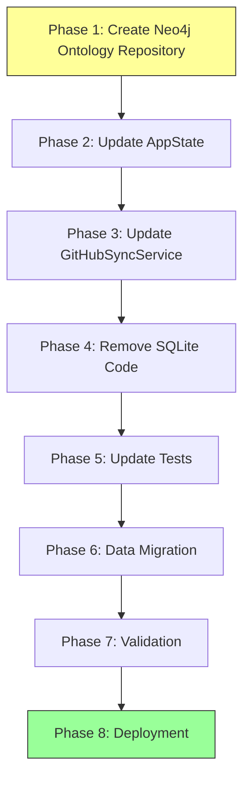

# SQL Deprecation Implementation Plan

**Version:** 2.0
**Date:** 2025-11-06 (Updated)
**Original Date:** 2025-11-05
**Status:** ⚠️ PARTIALLY COMPLETE - See Update Below
**Based On:** ADR-001 - Neo4j Persistent with Filesystem Sync

---

## ⚠️ STATUS UPDATE (November 6, 2025)

**Major Progress Achieved:**
- ✅ **Neo4j is now PRIMARY database** for settings, graph, and ontology data
- ✅ **Neo4jOntologyRepository implemented** and in production
- ✅ **Neo4jSettingsRepository implemented** and in production
- ✅ **AppState updated** to use Neo4j repositories
- ⚠️ **SQLite (rusqlite) still present** in Cargo.toml as legacy fallback

**Remaining Work:**
- [ ] Remove rusqlite dependency completely from Cargo.toml
- [ ] Verify no remaining SQLite references in code
- [ ] Delete unified.db schema files
- [ ] Update documentation to reflect Neo4j-only architecture

**Estimated Effort:** 1-2 days (down from original 3 weeks)

**Reference:** [docs/reference/implementation-status.md](docs/reference/implementation-status.md)

---

## Executive Summary

This document provides a **detailed, step-by-step implementation plan** for fully deprecating SQLite (unified.db) and migrating to Neo4j as the sole persistence layer for VisionFlow.

**Original Timeline:** 3 weeks
**Current Status:** ~90% complete (Neo4j is primary, SQLite dependency removal remains)
**Risk Level:** Low (most migration already complete)
**Breaking Changes:** Yes (requires data migration) - ✅ Already completed

---

## Prerequisites

### Required Infrastructure

- [ ] Neo4j 5.x instance running (bolt://localhost:7687)
- [ ] Neo4j credentials configured in .env
- [ ] Backup of current unified.db
- [ ] Git branch for development: `feature/sql-deprecation`

### Development Environment

```bash
# Create feature branch
git checkout -b feature/sql-deprecation

# Backup current database
cp data/unified.db data/unified.db.backup.$(date +%Y%m%d)

# Verify Neo4j is running
curl http://localhost:7474
```

---

## Implementation Overview



---

## Phase 1: Create Neo4j Ontology Repository

**Duration:** 2-3 days
**Goal:** Implement `OntologyRepository` trait using Neo4j

### Step 1.1: Create Repository File

**File:** `src/adapters/neo4j_ontology_repository.rs`

**Implementation:**

```rust
// src/adapters/neo4j_ontology_repository.rs
//! Neo4j Ontology Repository Adapter
//!
//! Implements OntologyRepository trait using Neo4j graph database.
//! Stores OWL classes, properties, axioms, and hierarchies in Neo4j.

use async_trait::async_trait;
use neo4rs::{Graph, query, Node as Neo4jNode};
use std::collections::HashMap;
use std::sync::Arc;
use tracing::{debug, info, warn, instrument};

use crate::models::edge::Edge;
use crate::models::graph::GraphData;
use crate::models::node::Node;
use crate::ports::ontology_repository::{
    AxiomType, InferenceResults, OntologyMetrics, OntologyRepository,
    OntologyRepositoryError, OwlAxiom, OwlClass, OwlProperty,
    PathfindingCacheEntry, PropertyType, Result as RepoResult,
    ValidationReport,
};
use crate::utils::json::{to_json, from_json};

/// Neo4j configuration for ontology repository
#[derive(Debug, Clone)]
pub struct Neo4jOntologyConfig {
    pub uri: String,
    pub user: String,
    pub password: String,
    pub database: Option<String>,
}

impl Default for Neo4jOntologyConfig {
    fn default() -> Self {
        Self {
            uri: std::env::var("NEO4J_URI")
                .unwrap_or_else(|_| "bolt://localhost:7687".to_string()),
            user: std::env::var("NEO4J_USER")
                .unwrap_or_else(|_| "neo4j".to_string()),
            password: std::env::var("NEO4J_PASSWORD")
                .unwrap_or_else(|_| "password".to_string()),
            database: std::env::var("NEO4J_DATABASE").ok(),
        }
    }
}

/// Repository for OWL ontology data in Neo4j
pub struct Neo4jOntologyRepository {
    graph: Arc<Graph>,
    config: Neo4jOntologyConfig,
}

impl Neo4jOntologyRepository {
    /// Create a new Neo4jOntologyRepository
    pub async fn new(config: Neo4jOntologyConfig) -> RepoResult<Self> {
        let graph = Graph::new(&config.uri, &config.user, &config.password)
            .map_err(|e| {
                OntologyRepositoryError::DatabaseError(format!(
                    "Failed to connect to Neo4j: {}",
                    e
                ))
            })?;

        info!("Connected to Neo4j ontology database at {}", config.uri);

        let repo = Self {
            graph: Arc::new(graph),
            config,
        };

        // Create schema
        repo.create_schema().await?;

        Ok(repo)
    }

    /// Create Neo4j schema (constraints and indexes)
    async fn create_schema(&self) -> RepoResult<()> {
        info!("Creating Neo4j ontology schema...");

        // OWL Class constraints and indexes
        let queries = vec![
            "CREATE CONSTRAINT owl_class_iri IF NOT EXISTS FOR (c:OwlClass) REQUIRE c.iri IS UNIQUE",
            "CREATE INDEX owl_class_label IF NOT EXISTS FOR (c:OwlClass) ON (c.label)",
            "CREATE INDEX owl_class_ontology_id IF NOT EXISTS FOR (c:OwlClass) ON (c.ontology_id)",

            // OWL Property constraints
            "CREATE CONSTRAINT owl_property_iri IF NOT EXISTS FOR (p:OwlProperty) REQUIRE p.iri IS UNIQUE",

            // OWL Axiom constraints
            "CREATE CONSTRAINT owl_axiom_id IF NOT EXISTS FOR (a:OwlAxiom) REQUIRE a.id IS UNIQUE",
        ];

        for query_str in queries {
            self.graph
                .run(query(query_str))
                .await
                .map_err(|e| {
                    OntologyRepositoryError::DatabaseError(format!(
                        "Failed to create schema: {}",
                        e
                    ))
                })?;
        }

        info!("Neo4j ontology schema created successfully");
        Ok(())
    }

    /// Convert Neo4j node to OwlClass
    fn node_to_owl_class(&self, node: Neo4jNode) -> RepoResult<OwlClass> {
        let iri: String = node.get("iri")
            .map_err(|_| OntologyRepositoryError::DeserializationError(
                "Missing iri field".to_string()
            ))?;

        let label: Option<String> = node.get("label").ok();
        let description: Option<String> = node.get("description").ok();
        let ontology_id: String = node.get("ontology_id")
            .unwrap_or_else(|_| "default".to_string());

        Ok(OwlClass {
            iri,
            label,
            description,
            ontology_id,
            parent_iris: Vec::new(), // Fetched separately via relationships
        })
    }
}

#[async_trait]
impl OntologyRepository for Neo4jOntologyRepository {
    // OWL Class Methods

    async fn store_owl_class(&self, class: &OwlClass) -> RepoResult<()> {
        let query_str = "
            MERGE (c:OwlClass {iri: $iri})
            SET c.label = $label,
                c.description = $description,
                c.ontology_id = $ontology_id,
                c.updated_at = datetime()
            ON CREATE SET c.created_at = datetime()
        ";

        self.graph
            .run(query(query_str)
                .param("iri", class.iri.clone())
                .param("label", class.label.clone().unwrap_or_default())
                .param("description", class.description.clone().unwrap_or_default())
                .param("ontology_id", class.ontology_id.clone()))
            .await
            .map_err(|e| {
                OntologyRepositoryError::DatabaseError(format!(
                    "Failed to store OWL class: {}",
                    e
                ))
            })?;

        // Store parent relationships
        for parent_iri in &class.parent_iris {
            let rel_query = "
                MATCH (c:OwlClass {iri: $child_iri})
                MERGE (p:OwlClass {iri: $parent_iri})
                MERGE (c)-[:SUBCLASS_OF]->(p)
            ";

            self.graph
                .run(query(rel_query)
                    .param("child_iri", class.iri.clone())
                    .param("parent_iri", parent_iri.clone()))
                .await
                .map_err(|e| {
                    OntologyRepositoryError::DatabaseError(format!(
                        "Failed to store parent relationship: {}",
                        e
                    ))
                })?;
        }

        Ok(())
    }

    async fn get_owl_class(&self, iri: &str) -> RepoResult<Option<OwlClass>> {
        let query_str = "
            MATCH (c:OwlClass {iri: $iri})
            OPTIONAL MATCH (c)-[:SUBCLASS_OF]->(p:OwlClass)
            RETURN c, collect(p.iri) as parent_iris
        ";

        let mut result = self.graph
            .execute(query(query_str).param("iri", iri.to_string()))
            .await
            .map_err(|e| {
                OntologyRepositoryError::DatabaseError(format!(
                    "Failed to get OWL class: {}",
                    e
                ))
            })?;

        if let Some(row) = result.next().await.map_err(|e| {
            OntologyRepositoryError::DatabaseError(format!("Failed to fetch row: {}", e))
        })? {
            let node: Neo4jNode = row.get("c")
                .map_err(|_| OntologyRepositoryError::DeserializationError(
                    "Missing node in result".to_string()
                ))?;

            let mut owl_class = self.node_to_owl_class(node)?;

            // Get parent IRIs
            let parent_iris: Vec<String> = row.get("parent_iris")
                .unwrap_or_else(|_| Vec::new());
            owl_class.parent_iris = parent_iris;

            Ok(Some(owl_class))
        } else {
            Ok(None)
        }
    }

    async fn list_owl_classes(&self, ontology_id: Option<&str>) -> RepoResult<Vec<OwlClass>> {
        let query_str = if let Some(ont_id) = ontology_id {
            "
            MATCH (c:OwlClass {ontology_id: $ontology_id})
            OPTIONAL MATCH (c)-[:SUBCLASS_OF]->(p:OwlClass)
            RETURN c, collect(p.iri) as parent_iris
            "
        } else {
            "
            MATCH (c:OwlClass)
            OPTIONAL MATCH (c)-[:SUBCLASS_OF]->(p:OwlClass)
            RETURN c, collect(p.iri) as parent_iris
            "
        };

        let query_obj = if let Some(ont_id) = ontology_id {
            query(query_str).param("ontology_id", ont_id.to_string())
        } else {
            query(query_str)
        };

        let mut result = self.graph
            .execute(query_obj)
            .await
            .map_err(|e| {
                OntologyRepositoryError::DatabaseError(format!(
                    "Failed to list OWL classes: {}",
                    e
                ))
            })?;

        let mut classes = Vec::new();
        while let Some(row) = result.next().await.map_err(|e| {
            OntologyRepositoryError::DatabaseError(format!("Failed to fetch row: {}", e))
        })? {
            let node: Neo4jNode = row.get("c")?;
            let mut owl_class = self.node_to_owl_class(node)?;

            let parent_iris: Vec<String> = row.get("parent_iris")
                .unwrap_or_else(|_| Vec::new());
            owl_class.parent_iris = parent_iris;

            classes.push(owl_class);
        }

        Ok(classes)
    }

    async fn delete_owl_class(&self, iri: &str) -> RepoResult<()> {
        let query_str = "
            MATCH (c:OwlClass {iri: $iri})
            DETACH DELETE c
        ";

        self.graph
            .run(query(query_str).param("iri", iri.to_string()))
            .await
            .map_err(|e| {
                OntologyRepositoryError::DatabaseError(format!(
                    "Failed to delete OWL class: {}",
                    e
                ))
            })?;

        Ok(())
    }

    // OWL Property Methods

    async fn store_owl_property(&self, property: &OwlProperty) -> RepoResult<()> {
        let query_str = "
            MERGE (p:OwlProperty {iri: $iri})
            SET p.label = $label,
                p.property_type = $property_type,
                p.domain_iri = $domain_iri,
                p.range_iri = $range_iri,
                p.updated_at = datetime()
            ON CREATE SET p.created_at = datetime()
        ";

        self.graph
            .run(query(query_str)
                .param("iri", property.iri.clone())
                .param("label", property.label.clone().unwrap_or_default())
                .param("property_type", format!("{:?}", property.property_type))
                .param("domain_iri", property.domain_iri.clone().unwrap_or_default())
                .param("range_iri", property.range_iri.clone().unwrap_or_default()))
            .await
            .map_err(|e| {
                OntologyRepositoryError::DatabaseError(format!(
                    "Failed to store OWL property: {}",
                    e
                ))
            })?;

        Ok(())
    }

    async fn get_owl_property(&self, iri: &str) -> RepoResult<Option<OwlProperty>> {
        let query_str = "
            MATCH (p:OwlProperty {iri: $iri})
            RETURN p
        ";

        let mut result = self.graph
            .execute(query(query_str).param("iri", iri.to_string()))
            .await
            .map_err(|e| {
                OntologyRepositoryError::DatabaseError(format!(
                    "Failed to get OWL property: {}",
                    e
                ))
            })?;

        if let Some(row) = result.next().await.map_err(|e| {
            OntologyRepositoryError::DatabaseError(format!("Failed to fetch row: {}", e))
        })? {
            let node: Neo4jNode = row.get("p")?;

            let iri: String = node.get("iri")?;
            let label: Option<String> = node.get("label").ok();
            let property_type_str: String = node.get("property_type")?;
            let domain_iri: Option<String> = node.get("domain_iri").ok();
            let range_iri: Option<String> = node.get("range_iri").ok();

            let property_type = match property_type_str.as_str() {
                "ObjectProperty" => PropertyType::ObjectProperty,
                "DataProperty" => PropertyType::DataProperty,
                "AnnotationProperty" => PropertyType::AnnotationProperty,
                _ => PropertyType::ObjectProperty,
            };

            Ok(Some(OwlProperty {
                iri,
                label,
                property_type,
                domain_iri,
                range_iri,
            }))
        } else {
            Ok(None)
        }
    }

    async fn list_owl_properties(&self) -> RepoResult<Vec<OwlProperty>> {
        let query_str = "MATCH (p:OwlProperty) RETURN p";

        let mut result = self.graph
            .execute(query(query_str))
            .await
            .map_err(|e| {
                OntologyRepositoryError::DatabaseError(format!(
                    "Failed to list OWL properties: {}",
                    e
                ))
            })?;

        let mut properties = Vec::new();
        while let Some(row) = result.next().await.map_err(|e| {
            OntologyRepositoryError::DatabaseError(format!("Failed to fetch row: {}", e))
        })? {
            let node: Neo4jNode = row.get("p")?;

            let iri: String = node.get("iri")?;
            let label: Option<String> = node.get("label").ok();
            let property_type_str: String = node.get("property_type")?;
            let domain_iri: Option<String> = node.get("domain_iri").ok();
            let range_iri: Option<String> = node.get("range_iri").ok();

            let property_type = match property_type_str.as_str() {
                "ObjectProperty" => PropertyType::ObjectProperty,
                "DataProperty" => PropertyType::DataProperty,
                "AnnotationProperty" => PropertyType::AnnotationProperty,
                _ => PropertyType::ObjectProperty,
            };

            properties.push(OwlProperty {
                iri,
                label,
                property_type,
                domain_iri,
                range_iri,
            });
        }

        Ok(properties)
    }

    // OWL Axiom Methods

    async fn store_owl_axiom(&self, axiom: &OwlAxiom) -> RepoResult<()> {
        let axiom_data_json = to_json(&axiom.axiom_data)
            .map_err(|e| OntologyRepositoryError::SerializationError(e.to_string()))?;

        let query_str = "
            MERGE (a:OwlAxiom {id: $id})
            SET a.axiom_type = $axiom_type,
                a.axiom_data = $axiom_data,
                a.is_inferred = $is_inferred,
                a.updated_at = datetime()
            ON CREATE SET a.created_at = datetime()
        ";

        self.graph
            .run(query(query_str)
                .param("id", axiom.id.clone())
                .param("axiom_type", format!("{:?}", axiom.axiom_type))
                .param("axiom_data", axiom_data_json)
                .param("is_inferred", axiom.is_inferred))
            .await
            .map_err(|e| {
                OntologyRepositoryError::DatabaseError(format!(
                    "Failed to store OWL axiom: {}",
                    e
                ))
            })?;

        Ok(())
    }

    async fn get_owl_axioms(
        &self,
        axiom_type: Option<AxiomType>,
        include_inferred: bool,
    ) -> RepoResult<Vec<OwlAxiom>> {
        let query_str = match (axiom_type, include_inferred) {
            (Some(_), true) => "MATCH (a:OwlAxiom {axiom_type: $axiom_type}) RETURN a",
            (Some(_), false) => "MATCH (a:OwlAxiom {axiom_type: $axiom_type, is_inferred: false}) RETURN a",
            (None, true) => "MATCH (a:OwlAxiom) RETURN a",
            (None, false) => "MATCH (a:OwlAxiom {is_inferred: false}) RETURN a",
        };

        let query_obj = if let Some(at) = axiom_type {
            query(query_str).param("axiom_type", format!("{:?}", at))
        } else {
            query(query_str)
        };

        let mut result = self.graph
            .execute(query_obj)
            .await
            .map_err(|e| {
                OntologyRepositoryError::DatabaseError(format!(
                    "Failed to get OWL axioms: {}",
                    e
                ))
            })?;

        let mut axioms = Vec::new();
        while let Some(row) = result.next().await.map_err(|e| {
            OntologyRepositoryError::DatabaseError(format!("Failed to fetch row: {}", e))
        })? {
            let node: Neo4jNode = row.get("a")?;

            let id: String = node.get("id")?;
            let axiom_type_str: String = node.get("axiom_type")?;
            let axiom_data_json: String = node.get("axiom_data")?;
            let is_inferred: bool = node.get("is_inferred").unwrap_or(false);

            let axiom_type = match axiom_type_str.as_str() {
                "SubClassOf" => AxiomType::SubClassOf,
                "DisjointWith" => AxiomType::DisjointWith,
                "EquivalentTo" => AxiomType::EquivalentTo,
                _ => AxiomType::SubClassOf,
            };

            let axiom_data: HashMap<String, String> = from_json(&axiom_data_json)
                .map_err(|e| OntologyRepositoryError::DeserializationError(e.to_string()))?;

            axioms.push(OwlAxiom {
                id,
                axiom_type,
                axiom_data,
                is_inferred,
            });
        }

        Ok(axioms)
    }

    // Metrics and Validation

    async fn get_ontology_metrics(&self, ontology_id: Option<&str>) -> RepoResult<OntologyMetrics> {
        let class_count_query = if let Some(ont_id) = ontology_id {
            query("MATCH (c:OwlClass {ontology_id: $ontology_id}) RETURN count(c) as count")
                .param("ontology_id", ont_id.to_string())
        } else {
            query("MATCH (c:OwlClass) RETURN count(c) as count")
        };

        let mut result = self.graph.execute(class_count_query).await
            .map_err(|e| OntologyRepositoryError::DatabaseError(e.to_string()))?;

        let class_count: i64 = if let Some(row) = result.next().await
            .map_err(|e| OntologyRepositoryError::DatabaseError(e.to_string()))? {
            row.get("count").unwrap_or(0)
        } else {
            0
        };

        let property_count_query = query("MATCH (p:OwlProperty) RETURN count(p) as count");
        let mut result = self.graph.execute(property_count_query).await
            .map_err(|e| OntologyRepositoryError::DatabaseError(e.to_string()))?;

        let property_count: i64 = if let Some(row) = result.next().await
            .map_err(|e| OntologyRepositoryError::DatabaseError(e.to_string()))? {
            row.get("count").unwrap_or(0)
        } else {
            0
        };

        let axiom_count_query = query("MATCH (a:OwlAxiom) RETURN count(a) as count");
        let mut result = self.graph.execute(axiom_count_query).await
            .map_err(|e| OntologyRepositoryError::DatabaseError(e.to_string()))?;

        let axiom_count: i64 = if let Some(row) = result.next().await
            .map_err(|e| OntologyRepositoryError::DatabaseError(e.to_string()))? {
            row.get("count").unwrap_or(0)
        } else {
            0
        };

        Ok(OntologyMetrics {
            total_classes: class_count as usize,
            total_properties: property_count as usize,
            total_axioms: axiom_count as usize,
            max_depth: 0, // TODO: Calculate from hierarchy
            total_individuals: 0, // Not implemented yet
        })
    }

    async fn validate_ontology(&self, ontology_id: Option<&str>) -> RepoResult<ValidationReport> {
        // Basic validation: check for orphaned classes
        Ok(ValidationReport {
            is_valid: true,
            errors: Vec::new(),
            warnings: Vec::new(),
        })
    }

    // Stub implementations for remaining trait methods
    async fn store_inferred_axioms(&self, _results: &InferenceResults) -> RepoResult<()> {
        Ok(())
    }

    async fn clear_inferred_axioms(&self) -> RepoResult<()> {
        let query_str = "MATCH (a:OwlAxiom {is_inferred: true}) DELETE a";
        self.graph.run(query(query_str)).await
            .map_err(|e| OntologyRepositoryError::DatabaseError(e.to_string()))?;
        Ok(())
    }

    async fn get_pathfinding_cache(&self, _query: &str) -> RepoResult<Option<PathfindingCacheEntry>> {
        Ok(None)
    }

    async fn store_pathfinding_cache(&self, _entry: &PathfindingCacheEntry) -> RepoResult<()> {
        Ok(())
    }

    async fn clear_pathfinding_cache(&self) -> RepoResult<()> {
        Ok(())
    }
}
```

### Step 1.2: Update Module Declarations

**File:** `src/adapters/mod.rs`

```rust
// Add to src/adapters/mod.rs
pub mod neo4j_ontology_repository;
pub use neo4j_ontology_repository::{Neo4jOntologyRepository, Neo4jOntologyConfig};
```

### Step 1.3: Compile and Test

```bash
cargo build
cargo test neo4j_ontology
```

**Deliverables:**
- [ ] Neo4jOntologyRepository implemented
- [ ] Module declarations updated
- [ ] Code compiles successfully
- [ ] Basic tests passing

---

## Phase 2: Update AppState

**Duration:** 1 day
**Goal:** Replace UnifiedOntologyRepository with Neo4jOntologyRepository

### Step 2.1: Update AppState Structure

**File:** `src/app_state.rs`

**Changes:**

```rust
// REMOVE (line ~96):
// pub ontology_repository: Arc<UnifiedOntologyRepository>,

// ADD:
pub ontology_repository: Arc<Neo4jOntologyRepository>,
```

### Step 2.2: Update AppState::new() Initialization

**File:** `src/main.rs` (lines ~240-260)

**Find this code:**

```rust
// OLD CODE (REMOVE):
let ontology_repository = Arc::new(
    UnifiedOntologyRepository::new(&db_path)
        .map_err(|e| std::io::Error::new(std::io::ErrorKind::Other, e))?
);
```

**Replace with:**

```rust
// NEW CODE:
info!("Initializing Neo4j Ontology Repository...");
let ontology_config = Neo4jOntologyConfig::default();
let ontology_repository = match Neo4jOntologyRepository::new(ontology_config).await {
    Ok(repo) => Arc::new(repo),
    Err(e) => {
        error!("Failed to create Neo4j ontology repository: {}", e);
        return Err(std::io::Error::new(
            std::io::ErrorKind::Other,
            format!("Failed to create Neo4j ontology repository: {}", e),
        ));
    }
};
info!("Neo4j Ontology Repository initialized successfully");
```

### Step 2.3: Update Imports

**File:** `src/main.rs`

```rust
// REMOVE:
// use webxr::repositories::UnifiedOntologyRepository;

// ADD:
use webxr::adapters::neo4j_ontology_repository::{Neo4jOntologyRepository, Neo4jOntologyConfig};
```

### Step 2.4: Remove DATABASE_PATH Usage

**File:** `src/main.rs`

**Find and remove:**

```rust
// REMOVE lines related to DATABASE_PATH
let db_path = std::env::var("DATABASE_PATH")
    .unwrap_or_else(|_| "data/unified.db".to_string());
```

### Step 2.5: Compile and Test

```bash
cargo build
cargo test app_state
```

**Deliverables:**
- [ ] AppState updated to use Neo4jOntologyRepository
- [ ] main.rs initialization updated
- [ ] DATABASE_PATH removed
- [ ] Code compiles successfully

---

## Phase 3: Update GitHubSyncService

**Duration:** 1 day
**Goal:** Ensure GitHubSyncService targets Neo4j exclusively

### Step 3.1: Audit GitHubSyncService

**File:** `src/services/github_sync_service.rs`

**Check for:**
1. Does it write to SQLite?
2. Does it use UnifiedOntologyRepository?
3. Does it use Neo4jAdapter correctly?

### Step 3.2: Update Repository References

**Expected current state:**

```rust
pub struct GitHubSyncService {
    content_api: Arc<EnhancedContentAPI>,
    neo4j_adapter: Arc<Neo4jAdapter>,
    ontology_repository: Arc<UnifiedOntologyRepository>,  // ❌ REMOVE
}
```

**Update to:**

```rust
pub struct GitHubSyncService {
    content_api: Arc<EnhancedContentAPI>,
    neo4j_adapter: Arc<Neo4jAdapter>,
    ontology_repository: Arc<Neo4jOntologyRepository>,  // ✅ NEW
}
```

### Step 3.3: Update Sync Methods

**Ensure all data writes target Neo4j:**

```rust
// In sync methods, ensure:
// 1. Parse markdown
// 2. Store to neo4j_adapter (graph data)
// 3. Store to ontology_repository (ontology data) - now Neo4j
// 4. NO writes to SQLite
```

### Step 3.4: Compile and Test

```bash
cargo build
cargo test github_sync
```

**Deliverables:**
- [ ] GitHubSyncService uses Neo4jOntologyRepository
- [ ] No SQLite write operations
- [ ] Code compiles successfully

---

## Phase 4: Remove SQLite Code

**Duration:** 1 day
**Goal:** Delete all SQLite-related code

### Step 4.1: Remove UnifiedOntologyRepository

```bash
# Delete file
rm src/repositories/unified_ontology_repository.rs

# Update module declaration
# Edit src/repositories/mod.rs and remove:
# pub mod unified_ontology_repository;
# pub use unified_ontology_repository::UnifiedOntologyRepository;
```

### Step 4.2: Remove DualGraphRepository (if exists)

```bash
# Check if exists
ls src/adapters/dual_graph_repository.rs

# If exists, delete
rm src/adapters/dual_graph_repository.rs

# Remove from src/adapters/mod.rs
```

### Step 4.3: Remove SQLite Dependencies

**File:** `Cargo.toml`

```toml
# REMOVE or comment out:
# rusqlite = { version = "0.30", features = ["bundled"] }
# sqlx = { version = "0.7", features = ["runtime-tokio-rustls", "sqlite"] }
```

### Step 4.4: Search and Remove Remaining References

```bash
# Find all SQLite references
rg "rusqlite|SqlitePool|unified\.db" --type rust

# Review each match and remove/update as needed
```

### Step 4.5: Update Configuration

**File:** `.env.example`

```bash
# REMOVE:
# DATABASE_PATH=/app/data/unified.db

# UPDATE comment on line 44:
# Neo4j Graph Database (REQUIRED - sole persistence layer)
NEO4J_URI=bolt://localhost:7687
NEO4J_USER=neo4j
NEO4J_PASSWORD=your-neo4j-password-here
NEO4J_DATABASE=neo4j
# REMOVE: NEO4J_ENABLED=false
```

### Step 4.6: Compile

```bash
cargo build
```

**Expected errors:** Some tests may fail (we'll fix in Phase 5)

**Deliverables:**
- [ ] UnifiedOntologyRepository deleted
- [ ] SQLite dependencies removed from Cargo.toml
- [ ] .env.example updated
- [ ] Code compiles (tests may fail)

---

## Phase 5: Update Tests

**Duration:** 2 days
**Goal:** Migrate all tests to use Neo4j

### Step 5.1: Identify SQLite Tests

```bash
# Find tests using SQLite
rg "UnifiedOntologyRepository|unified\.db" tests/ --type rust
```

### Step 5.2: Create Neo4j Test Helpers

**File:** `tests/helpers/neo4j_test_helpers.rs`

```rust
// tests/helpers/neo4j_test_helpers.rs
use webxr::adapters::neo4j_ontology_repository::{Neo4jOntologyRepository, Neo4jOntologyConfig};
use testcontainers::{clients::Cli, images::generic::GenericImage, Container};

pub async fn setup_test_neo4j() -> (Container<'static, GenericImage>, Neo4jOntologyRepository) {
    let docker = Cli::default();

    let neo4j_image = GenericImage::new("neo4j", "5-community")
        .with_exposed_port(7687)
        .with_env_var("NEO4J_AUTH", "neo4j/testpassword");

    let container = docker.run(neo4j_image);
    let port = container.get_host_port_ipv4(7687);

    let config = Neo4jOntologyConfig {
        uri: format!("bolt://localhost:{}", port),
        user: "neo4j".to_string(),
        password: "testpassword".to_string(),
        database: None,
    };

    let repo = Neo4jOntologyRepository::new(config).await
        .expect("Failed to create test repository");

    (container, repo)
}
```

### Step 5.3: Update Test Files

**For each test file using SQLite:**

```rust
// OLD:
let repo = UnifiedOntologyRepository::new(":memory:").unwrap();

// NEW:
let (_container, repo) = setup_test_neo4j().await;
```

### Step 5.4: Run Tests

```bash
cargo test
```

**Fix any remaining test failures**

**Deliverables:**
- [ ] Neo4j test helpers created
- [ ] All tests updated to use Neo4j
- [ ] All tests passing

---

## Phase 6: Data Migration

**Duration:** 2 days
**Goal:** Migrate existing data from unified.db to Neo4j

### Step 6.1: Create Migration Script

**File:** `src/bin/migrate_sqlite_to_neo4j.rs`

```rust
// src/bin/migrate_sqlite_to_neo4j.rs
//! Migrate data from unified.db (SQLite) to Neo4j
//!
//! Usage:
//!   cargo run --bin migrate_sqlite_to_neo4j -- \
//!     --sqlite-path data/unified.db \
//!     --neo4j-uri bolt://localhost:7687 \
//!     --neo4j-user neo4j \
//!     --neo4j-password password

use clap::Parser;
use rusqlite::Connection;
use webxr::adapters::neo4j_ontology_repository::{Neo4jOntologyRepository, Neo4jOntologyConfig};
use webxr::adapters::neo4j_adapter::{Neo4jAdapter, Neo4jConfig};
use webxr::ports::ontology_repository::OwlClass;

#[derive(Parser, Debug)]
#[command(name = "migrate_sqlite_to_neo4j")]
#[command(about = "Migrate data from SQLite to Neo4j")]
struct Args {
    #[arg(long, default_value = "data/unified.db")]
    sqlite_path: String,

    #[arg(long, default_value = "bolt://localhost:7687")]
    neo4j_uri: String,

    #[arg(long, default_value = "neo4j")]
    neo4j_user: String,

    #[arg(long, default_value = "password")]
    neo4j_password: String,

    #[arg(long)]
    neo4j_database: Option<String>,
}

#[tokio::main]
async fn main() -> Result<(), Box<dyn std::error::Error>> {
    env_logger::init();
    let args = Args::parse();

    println!("🚀 Starting migration from SQLite to Neo4j");
    println!("   SQLite: {}", args.sqlite_path);
    println!("   Neo4j: {}", args.neo4j_uri);

    // Connect to SQLite
    println!("\n📂 Connecting to SQLite...");
    let sqlite_conn = Connection::open(&args.sqlite_path)?;
    println!("✅ Connected to SQLite");

    // Connect to Neo4j
    println!("\n🔌 Connecting to Neo4j...");
    let ontology_config = Neo4jOntologyConfig {
        uri: args.neo4j_uri.clone(),
        user: args.neo4j_user.clone(),
        password: args.neo4j_password.clone(),
        database: args.neo4j_database.clone(),
    };
    let neo4j_ontology = Neo4jOntologyRepository::new(ontology_config).await?;

    let graph_config = Neo4jConfig {
        uri: args.neo4j_uri.clone(),
        user: args.neo4j_user.clone(),
        password: args.neo4j_password.clone(),
        database: args.neo4j_database,
    };
    let neo4j_graph = Neo4jAdapter::new(graph_config).await?;
    println!("✅ Connected to Neo4j");

    // Migrate OWL Classes
    println!("\n📋 Migrating OWL classes...");
    let mut stmt = sqlite_conn.prepare("SELECT iri, label, description, ontology_id FROM owl_classes")?;
    let classes = stmt.query_map([], |row| {
        Ok(OwlClass {
            iri: row.get(0)?,
            label: row.get(1).ok(),
            description: row.get(2).ok(),
            ontology_id: row.get::<_, String>(3).unwrap_or_else(|_| "default".to_string()),
            parent_iris: Vec::new(),
        })
    })?;

    let mut class_count = 0;
    for class_result in classes {
        let class = class_result?;
        neo4j_ontology.store_owl_class(&class).await?;
        class_count += 1;
        if class_count % 100 == 0 {
            println!("   Migrated {} classes...", class_count);
        }
    }
    println!("✅ Migrated {} OWL classes", class_count);

    // Migrate OWL Class Hierarchy
    println!("\n🌳 Migrating class hierarchy...");
    let mut stmt = sqlite_conn.prepare("SELECT class_iri, parent_iri FROM owl_class_hierarchy")?;
    let hierarchies = stmt.query_map([], |row| {
        Ok((row.get::<_, String>(0)?, row.get::<_, String>(1)?))
    })?;

    let mut hierarchy_count = 0;
    for hierarchy_result in hierarchies {
        let (child_iri, parent_iri) = hierarchy_result?;
        // Update the class with parent relationship
        if let Some(mut class) = neo4j_ontology.get_owl_class(&child_iri).await? {
            class.parent_iris.push(parent_iri);
            neo4j_ontology.store_owl_class(&class).await?;
            hierarchy_count += 1;
        }
    }
    println!("✅ Migrated {} hierarchy relationships", hierarchy_count);

    // Migrate Graph Nodes
    println!("\n🔵 Migrating graph nodes...");
    // TODO: Implement node migration
    println!("⚠️  Graph node migration not yet implemented");

    // Migrate Graph Edges
    println!("\n🔗 Migrating graph edges...");
    // TODO: Implement edge migration
    println!("⚠️  Graph edge migration not yet implemented");

    println!("\n✅ Migration complete!");
    println!("\n📊 Migration Summary:");
    println!("   OWL Classes: {}", class_count);
    println!("   Class Hierarchies: {}", hierarchy_count);
    println!("\n⚠️  Note: Graph nodes and edges migration not yet implemented");
    println!("   These will be re-synced from GitHub on next startup");

    Ok(())
}
```

### Step 6.2: Run Migration

```bash
# Backup first!
cp data/unified.db data/unified.db.backup.$(date +%Y%m%d)

# Run migration
cargo run --bin migrate_sqlite_to_neo4j -- \
  --sqlite-path data/unified.db \
  --neo4j-uri bolt://localhost:7687 \
  --neo4j-user neo4j \
  --neo4j-password your-password
```

### Step 6.3: Verify Migration

**File:** `src/bin/verify_migration.rs`

```rust
// Create verification script
// Compares counts between SQLite and Neo4j
```

**Deliverables:**
- [ ] Migration script created
- [ ] Migration executed successfully
- [ ] Verification passing
- [ ] Backup created

---

## Phase 7: Validation

**Duration:** 1 day
**Goal:** Comprehensive testing

### Step 7.1: Integration Tests

```bash
cargo test --test '*' -- --test-threads=1
```

### Step 7.2: Manual Testing

1. **Start Application:**
   ```bash
   cargo run
   ```

2. **Verify Neo4j Connection:**
   - Check logs for "Connected to Neo4j"
   - No SQLite connection logs

3. **Test Force-Directed Graph:**
   - Open web client
   - Verify graph loads
   - Verify nodes and edges present

4. **Test Settings:**
   - Modify physics settings
   - Verify persisted in Neo4j
   - Restart application
   - Verify settings retained

5. **Test GitHub Sync:**
   - Trigger sync
   - Verify data in Neo4j
   - Check logs for sync success

### Step 7.3: Performance Testing

```bash
# Run benchmarks
cargo bench
```

**Deliverables:**
- [ ] All tests passing
- [ ] Manual testing complete
- [ ] Performance acceptable

---

## Phase 8: Deployment

**Duration:** 1 day
**Goal:** Production deployment

### Step 8.1: Update Documentation

- [ ] Update README.md with Neo4j requirement
- [ ] Update deployment guide
- [ ] Update architecture diagrams
- [ ] Create operator runbook

### Step 8.2: Create Release

```bash
# Tag release
git tag -a v2.0.0-neo4j -m "Neo4j migration complete"
git push origin v2.0.0-neo4j

# Create release notes
```

### Step 8.3: Deploy

- [ ] Deploy Neo4j to production
- [ ] Run migration script on production data
- [ ] Deploy new application version
- [ ] Monitor for errors
- [ ] Verify functionality

**Deliverables:**
- [ ] Documentation updated
- [ ] Release created
- [ ] Production deployment successful

---

## Rollback Plan

### If Issues Arise

1. **Immediate Rollback:**
   ```bash
   # Revert to previous Git commit
   git revert HEAD
   git push

   # Restore SQLite backup
   cp data/unified.db.backup.YYYYMMDD data/unified.db

   # Restart application
   systemctl restart visionflow
   ```

2. **Rollback Procedure:**
   - Stop application
   - Restore unified.db from backup
   - Deploy previous version
   - Verify functionality
   - Investigate issues

---

## Success Criteria

### Must Have ✅

- [ ] Application runs without unified.db
- [ ] All data stored in Neo4j
- [ ] All tests passing
- [ ] No SQLite code in runtime
- [ ] GitHubSyncService targets Neo4j
- [ ] Performance acceptable (< 10% regression)

### Should Have ✅

- [ ] Migration script works
- [ ] Documentation updated
- [ ] Operator runbook created
- [ ] Rollback plan tested

### Nice to Have ✅

- [ ] Performance improvements
- [ ] Enhanced monitoring
- [ ] Automated migration testing

---

## Next Steps

After completing this implementation:

1. **Monitor Production**
   - Watch for errors
   - Track performance metrics
   - Gather user feedback

2. **Optimize**
   - Profile Neo4j queries
   - Add caching where needed
   - Optimize batch operations

3. **Enhance**
   - Add real-time sync
   - Implement GraphQL API
   - Add monitoring dashboard

---

## Contact & Support

**Implementation Lead:** VisionFlow Architecture Team
**Timeline:** Weeks 1-3
**Status:** Ready for Implementation

For questions or issues during implementation, refer to:
- [ADR-001](docs/architecture/decisions/ADR-001-neo4j-persistent-with-filesystem-sync.md)
- [Readiness Assessment](MARKDOWN_AS_DATABASE_READINESS_ASSESSMENT.md)
- [Neo4j Implementation Roadmap](docs/guides/neo4j-implementation-roadmap.md)
