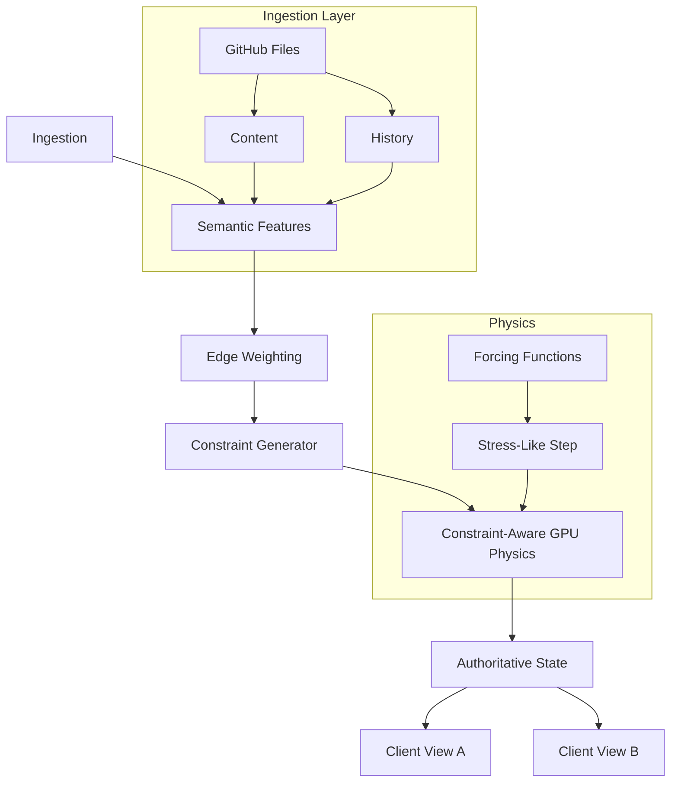
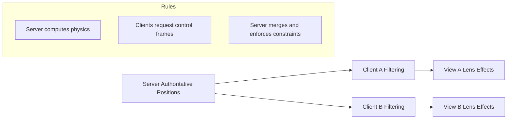

# World-Class Knowledge Graph Force-Directed Layout System
Research-driven refactor plan with code examples and GPU constraint-enhanced physics

Executive summary
- Upgrade the current CUDA spring embedder to a constraint-aware, research-aligned engine that combines forcing functions with stress-majorization style optimization.
- Enrich metadata and edge weights using semantic, structural, and temporal signals sourced from GitHub and local analysis.
- Maintain one authoritative spatio-temporal ground truth on the server; clients apply view-specific filters without changing shared coordinates.

Current baseline anchors in repo (clickable):
- [`compute_forces_kernel()`](src/utils/compute_forces.cu:34) is the current GPU kernel.
- [`struct GPUCompute`](src/utils/gpu_compute.rs:35) launches the kernel; see [`GPUCompute::compute_forces()`](src/utils/gpu_compute.rs:402), [`GPUCompute::update_graph_data()`](src/utils/gpu_compute.rs:314).
- Simulation config in [`SimulationParams`](src/models/simulation_params.rs:48) with presets in [`SimulationParams::new()`](src/models/simulation_params.rs:73).
- The graph is assembled in [`GraphServiceActor::build_from_metadata()`](src/actors/graph_actor.rs:116) and advanced each frame via [`GraphServiceActor::run_simulation_step()`](src/actors/graph_actor.rs:230).
- Binary streaming over WebSocket encodes nodes via [`encode_node_data()`](src/utils/binary_protocol.rs:140).
- Data models: [`struct Metadata`](src/models/metadata.rs:9), [`struct Node`](src/models/node.rs:12), [`struct Edge`](src/models/edge.rs:7).

Architecture at a glance


Key outcomes
- Constraint taxonomy supported: fixed positions, separation/non-overlap, alignment, clustering, boundaries, directional flow.
- Multi-modal forces: semantic similarity, structural dependencies, temporal co-evolution, agent communication, center/boundary fields.
- Hybrid solver: fast CUDA force step each frame + periodic stress-majorization style projection for constraint satisfaction.
- Multi-client consistency: server computes and streams positions; clients filter attributes and add local visual effects without changing positions.

Plan of record
- Phase 1: Add constraint and advanced parameter models; implement GPU forcing functions; keep current binary protocol.
- Phase 2: Add CPU-side periodic stress-projection step; integrate semantic clustering and separation constraints.
- Phase 3: Enrich metadata and edge generation with semantic/temporal signals.
- Phase 4: Introduce binary-side control frames to stream constraint deltas and lens presets.

New/updated modules and contracts
- New: src/models/constraints.rs
- New: src/physics/semantic_constraints.rs
- New: src/physics/stress_majorization.rs
- New: src/services/edge_generation.rs
- New: src/services/semantic_analyzer.rs
- New: src/utils/advanced_compute_forces.cu
- Update: src/utils/gpu_compute.rs to upload constraints/advanced params and launch new kernel.
- Update: src/actors/graph_actor.rs to orchestrate hybrid solver and authoritative broadcasting.
- Update: src/utils/binary_protocol.rs optional control frames (text) for constraints/lenses.

1) Constraint and advanced parameter data model

File: src/models/constraints.rs
```rust
//! Constraint and physics parameter models
use serde::{Deserialize, Serialize};

#[derive(Debug, Clone, Serialize, Deserialize)]
pub enum ConstraintKind {
    FixedPosition,
    Separation,
    AlignmentHorizontal,
    AlignmentVertical,
    Clustering,
    Boundary,
}

#[derive(Debug, Clone, Serialize, Deserialize)]
pub struct Constraint {
    pub kind: ConstraintKind,
    pub node_indices: Vec<u32>,
    pub params: Vec<f32>, // documented per kind
}

#[derive(Debug, Clone, Serialize, Deserialize, Default)]
pub struct AdvancedParams {
    pub semantic_force_weight: f32,
    pub temporal_force_weight: f32,
    pub constraint_force_weight: f32,
    pub stress_step_interval_frames: u32,
    pub separation_factor: f32,
    pub boundary_force_weight: f32,
    pub knowledge_force_weight: f32,
    pub agent_communication_weight: f32,
}
```

2) CUDA kernel: constraint-aware forcing functions

File: src/utils/advanced_compute_forces.cu
```cuda
#include <cuda_runtime.h>
#include <device_launch_parameters.h>

extern "C" {
    struct Vec3Data { float x; float y; float z; };

    struct EnhancedBinaryNodeData {
        Vec3Data position;
        Vec3Data velocity;
        unsigned char mass;
        unsigned char flags;
        unsigned char node_type;
        unsigned char pad;
    };

    struct EnhancedEdgeData {
        int source_idx;
        int target_idx;
        float weight;
        float semantic_similarity;
        float structural_similarity;
        float temporal_similarity;
        unsigned char edge_type;
        unsigned char pad3[3];
    };

    struct ConstraintData {
        int kind; // matches ConstraintKind discriminant
        int count; // number of node indices used
        int node_idx[4];
        float params[8];
    };

    struct AdvancedSimulationParams {
        float spring_k;
        float damping;
        float repel_k;
        float dt;
        float max_repulsion_dist;
        float viewport_bounds;
        float semantic_force_weight;
        float temporal_force_weight;
        float constraint_force_weight;
        float boundary_force_weight;
        float separation_factor;
    };

    __device__ inline float3 make_f3(const Vec3Data &v){ return make_float3(v.x,v.y,v.z);} 
    __device__ inline Vec3Data make_v3(const float3 &v){ return Vec3Data{v.x,v.y,v.z}; }

    __device__ float3 apply_boundary(const float3 pos, float bounds, float w) {
        if (bounds <= 0.0f) return make_float3(0,0,0);
        float3 f = make_float3(0,0,0);
        const float soft = 0.8f * bounds;
        if (fabsf(pos.x) > soft) f.x -= (pos.x/soft) * w;
        if (fabsf(pos.y) > soft) f.y -= (pos.y/soft) * w;
        if (fabsf(pos.z) > soft) f.z -= (pos.z/soft) * w;
        return f;
    }

    __global__ void advanced_forces_kernel(
        EnhancedBinaryNodeData* nodes,
        EnhancedEdgeData* edges,
        int num_nodes,
        int num_edges,
        const ConstraintData* constraints,
        int num_constraints,
        AdvancedSimulationParams p,
        int iteration
    ) {
        int i = blockIdx.x * blockDim.x + threadIdx.x;
        if (i >= num_nodes) return;

        float3 pos = make_f3(nodes[i].position);
        float3 vel = make_f3(nodes[i].velocity);
        float mass = (nodes[i].mass==0?0.5f:(nodes[i].mass+1.0f)/256.0f);

        float3 total = make_float3(0,0,0);

        // Repulsion + spring with semantic modulation
        for (int e=0; e<num_edges; ++e) {
            int other = -1;
            if (edges[e].source_idx==i) other = edges[e].target_idx;
            else if (edges[e].target_idx==i) other = edges[e].source_idx;
            if (other<0 || other>=num_nodes) continue;
            float3 op = make_f3(nodes[other].position);
            float3 d = make_float3(op.x-pos.x, op.y-pos.y, op.z-pos.z);
            float dist = sqrtf(d.x*d.x + d.y*d.y + d.z*d.z) + 1e-4f;
            float3 dir = make_float3(d.x/dist, d.y/dist, d.z/dist);

            float sim = edges[e].semantic_similarity;
            float ideal = 1.5f * (1.0f - 0.5f*sim);
            float spring = -p.spring_k * (dist - ideal) * (0.5f + 0.5f*sim);
            float repel = 0.0f;
            if (dist < p.max_repulsion_dist) {
                repel = p.repel_k * (1.0f - 0.7f*sim) / (dist*dist);
            }
            total.x += dir.x * (spring - repel);
            total.y += dir.y * (spring - repel);
            total.z += dir.z * (spring - repel);
        }

        // Boundary force
        float3 bf = apply_boundary(pos, p.viewport_bounds, p.boundary_force_weight);
        total.x += bf.x; total.y += bf.y; total.z += bf.z;

        // Simple constraint projections as forces
        for (int c=0; c<num_constraints; ++c) {
            const ConstraintData &cd = constraints[c];
            if (cd.kind==1 /*Separation*/ && cd.count==2) {
                int a = cd.node_idx[0], b = cd.node_idx[1];
                if (i==a || i==b) {
                    int other = (i==a)?b:a;
                    float min_d = cd.params[0];
                    float3 op = make_f3(nodes[other].position);
                    float3 d = make_float3(op.x-pos.x, op.y-pos.y, op.z-pos.z);
                    float dist = sqrtf(d.x*d.x + d.y*d.y + d.z*d.z) + 1e-4f;
                    if (dist < min_d) {
                        float3 dir = make_float3(d.x/dist, d.y/dist, d.z/dist);
                        float corr = (min_d - dist) * p.separation_factor;
                        total.x -= dir.x * corr * p.constraint_force_weight;
                        total.y -= dir.y * corr * p.constraint_force_weight;
                        total.z -= dir.z * corr * p.constraint_force_weight;
                    }
                }
            }
        }

        // Integrate
        vel.x = vel.x * (1.0f - p.damping) + total.x * p.dt;
        vel.y = vel.y * (1.0f - p.damping) + total.y * p.dt;
        vel.z = vel.z * (1.0f - p.damping) + total.z * p.dt;
        pos.x += vel.x * p.dt;
        pos.y += vel.y * p.dt;
        pos.z += vel.z * p.dt;

        nodes[i].position = make_v3(pos);
        nodes[i].velocity = make_v3(vel);
    }
}
```

Notes
- We keep the existing kernel [`compute_forces_kernel()`](src/utils/compute_forces.cu:34) for fallback/A-B testing; new kernel name `advanced_forces_kernel`.
- Constraint projection is approximated as forces for GPU efficiency; a periodic CPU-side projection (next section) refines layout toward feasibility.

3) Hybrid solver orchestration on server

Updates in src/utils/gpu_compute.rs
```rust
// New launcher that selects advanced kernel and uploads constraints/params
pub struct AdvancedGPUContext { /* device, funcs, buffers, etc. */ }

impl AdvancedGPUContext {
    pub fn step_with_constraints(&mut self,
        params: &crate::models::constraints::AdvancedParams,
        constraints: &[crate::models::constraints::Constraint]
    ) -> std::io::Result<()> {
        // 1) Map Constraint -> ConstraintData and copy to GPU
        // 2) Build AdvancedSimulationParams from SimulationParams + AdvancedParams
        // 3) Launch advanced_forces_kernel grid
        Ok(())
    }
}
```

Updates in src/actors/graph_actor.rs
```rust
/// Pseudocode inside GraphServiceActor::run_simulation_step
{
  // 1) Every frame: GPU forcing step
  //    self.advanced_gpu.step_with_constraints(&self.adv_params, &self.constraints)?;
  // 2) Every N frames: CPU projection (stress-like) for constraints
  //    if frame % self.adv_params.stress_step_interval_frames == 0 {
  //       let snapshot = self.fetch_positions();
  //       let projected = stress_majorizer.optimize_layout(&snapshot, &constraints);
  //       self.apply_positions(projected);
  //    }
  // 3) Stream authoritative positions as today via binary protocol
}
```

4) Semantic edges and constraints

File: src/services/edge_generation.rs
```rust
pub struct AdvancedEdgeGenerator {
    pub similarity_threshold: f32,
    pub weights: (f32, f32, f32), // (semantic, structural, temporal)
}

impl AdvancedEdgeGenerator {
    pub fn generate(&self,
        features: &std::collections::HashMap<String, crate::services::semantic_analyzer::SemanticFeatures>
    ) -> Vec<crate::models::edge::Edge> {
        // compute pairwise weights then map into Edge
        vec![]
    }
}
```

File: src/physics/semantic_constraints.rs
```rust
pub struct SemanticConstraintGenerator;

impl SemanticConstraintGenerator {
    pub fn build(&self,
        edges: &[(u32,u32,f32)],
        topics: &std::collections::HashMap<u32, std::collections::HashMap<String,f32>>
    ) -> Vec<crate::models::constraints::Constraint> {
        // clustering, separation, alignment
        vec![]
    }
}
```

5) Binary protocol and control frames

- Keep the 28-byte position wire format via [`encode_node_data()`](src/utils/binary_protocol.rs:140).
- Add a lightweight text control frame over the same WebSocket for constraint/lens updates:

```json
{
  "type": "constraints_update",
  "version": 1,
  "constraints": [
    { "kind": "Separation", "node_indices": [12, 45], "params": [250.0] }
  ],
  "advancedParams": {
    "semantic_force_weight": 0.6,
    "temporal_force_weight": 0.3,
    "constraint_force_weight": 0.8,
    "stress_step_interval_frames": 30
  }
}
```

Server applies these without altering client-authoritative split; clients never write positions, only request.

6) Multi-client spatial consistency



7) Implementation steps (sequenced)

1. Define models in constraints.rs and wire AdvancedParams through settings.
2. Add advanced CUDA kernel and Rust launcher; keep old kernel for fallback.
3. Generate initial constraints:
   - Separation for very weakly related node pairs.
   - Boundary and center forces tuned per graph size.
   - Simple clustering by dominant topic.
4. Implement hybrid loop in GraphServiceActor calling GPU each frame, CPU projection every N frames.
5. Validate stability on small, medium, large graphs; profile GPU time and transfer sizes.
6. Implement semantic analyzer and advanced edge generator; replace topic_counts-derived weights.
7. Add WebSocket control frames for constraints/params; persist server-side presets.
8. Harden tests and add A/B toggles via settings to compare kernels and solvers.

8) Testing matrix

- Numerical safety:
  - Finite velocities/positions across 10k frames.
  - Invariance under node order permutation.
- Constraint fidelity:
  - Separation pairs respect min distance within tolerance.
  - Fixed/alignment preserved during dynamic updates.
- Performance:
  - <= 4 ms GPU step @ 10k nodes, target hardware.
  - <= 1 ms encode and send per update batch.
- Consistency:
  - Clients render identical coordinates for same server tick.
  - Lens-only differences produce no divergence in positions.

9) Rollout and risk mitigation

- Feature flags to toggle advanced kernel and CPU projection.
- Fallback to existing [`GPUCompute::step()`](src/utils/gpu_compute.rs:475) path if any error detected.
- Binary protocol unchanged for positions; control frames are additive.
- Progressive activation per cohort to measure stability.

Appendix: References mapped to implementation

- Stress majorization and PGD inspire the periodic CPU projection (Section 3).
- Forcing functions encode constraints directly in GPU step (Section 2).
- Dwyer et al. separation/flow constraints map to Separation and Alignment kinds (Section 1/4).