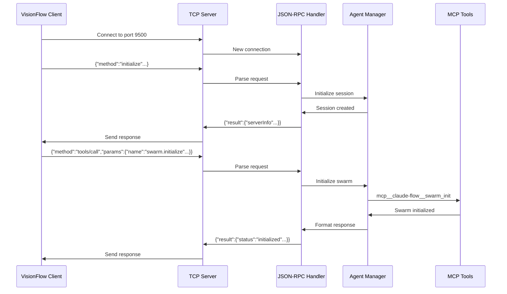

# Agent Control Interface Design Document

## System Overview

The Agent Control Interface serves as a bridge between the VisionFlow backend (external Rust client) and our MCP-based agent orchestration tools. It exposes a JSON-RPC 2.0 API over TCP port 9500.

## Architecture Design

### Layer 1: Network Transport
```javascript
TCPServer (port 9500)
├── Connection Manager
│   ├── Session tracking
│   ├── Keep-alive handling
│   └── Graceful disconnection
└── Stream Parser
    ├── Newline-delimited JSON parsing
    └── Buffer management
```

### Layer 2: Protocol Handler
```javascript
JSON-RPC Handler
├── Request Validator
│   ├── Schema validation
│   ├── Method existence check
│   └── Parameter validation
├── Method Router
│   ├── initialize → SessionHandler
│   ├── agents/list → AgentHandler
│   └── tools/call → ToolHandler
└── Response Formatter
    ├── Success responses
    └── Error responses (with proper codes)
```

### Layer 3: Business Logic
```javascript
Telemetry Orchestrator
├── Swarm Manager
│   ├── Claude-flow integration
│   ├── Ruv-swarm integration
│   ├── MCP-observability integration
│   └── Telemetry normalization
├── Data Aggregator
│   ├── Agent states
│   ├── Performance metrics
│   └── Connection tracking
└── Cache Manager
    ├── Telemetry cache
    ├── TTL management
    └── Update coordination
```

### Layer 4: MCP Integration
```javascript
MCP Bridge
├── Tool Executor
│   ├── Command building
│   ├── Process spawning
│   └── Output parsing
├── Response Translator
│   ├── MCP → Internal format
│   └── Internal → API format
└── Error Handler
    ├── Tool failures
    └── Timeout management
```

## Data Flow



## Key Design Decisions

### 1. Triple Swarm Support
- Support `claude-flow`, `ruv-swarm`, and `mcp-observability` implementations
- Abstract differences behind unified telemetry interface
- Allow runtime selection based on requirements

### 2. Telemetry-Only Approach
- **NO position calculations** - the Rust service handles all spatial topology
- We provide raw telemetry data:
  - Agent states, types, and capabilities
  - Performance metrics (CPU, memory, task completion)
  - Connection relationships between agents
  - Message flow statistics
- The Rust service uses GPU acceleration (compute_forces.cu) for physics

### 3. State Management
- Maintain local cache of agent telemetry
- Poll MCP tools at configurable intervals
- Merge telemetry from multiple sources
- Ensure consistent agent ID mapping across systems

### 4. Error Handling Approach
- Map all MCP errors to JSON-RPC error codes
- Implement retry logic for transient failures
- Graceful degradation when tools unavailable

## Critical Problems & Mitigations

### Problem: MCP Tool Latency
**Impact**: Slow responses to telemetry requests
**Mitigation**:
- Aggressive caching with intelligent invalidation
- Predictive pre-fetching for likely requests
- Async updates pushed to cache

### Problem: Connection State Management
**Impact**: Lost sessions, orphaned resources
**Mitigation**:
- Session timeout with cleanup
- Reconnection support with session recovery
- Resource limits per connection

### Problem: Scale Limitations
**Impact**: Performance degradation with many agents
**Mitigation**:
- Pagination support in agent listings
- Telemetry aggregation for large agent counts
- Sampling for metrics at high agent counts

### Problem: MCP Process Management
**Impact**: mcp-observability uses stdio, not TCP
**Mitigation**:
- Fork mcp-observability as subprocess
- Bridge stdio to internal state
- Or modify mcp-observability to support TCP directly

## Security Considerations

1. **Input Validation**: Strict JSON schema validation
2. **Rate Limiting**: Prevent DoS via request flooding
3. **Resource Limits**: Cap memory/CPU per session
4. **No Direct MCP Access**: All tools mediated through abstraction
5. **Audit Logging**: Track all API calls with session context

## Performance Targets

- **Connection Setup**: < 50ms
- **Initialize Response**: < 100ms
- **Agent List (100 agents)**: < 200ms
- **Visualization Snapshot**: < 150ms
- **Metrics Response**: < 100ms
- **Position Update Rate**: 10 Hz minimum

## Implementation Priorities

1. **Phase 1: Core TCP Server**
   - Basic connection handling
   - JSON-RPC parsing
   - Initialize method

2. **Phase 2: MCP Integration**
   - MCP-observability subprocess management
   - Claude-flow bridge
   - Ruv-swarm bridge
   - Swarm initialization

3. **Phase 3: Telemetry Aggregation**
   - Agent state collection
   - Performance metrics gathering
   - Connection tracking
   - Data format translation for VisionFlow

4. **Phase 4: Polish**
   - Performance optimization
   - Error handling refinement
   - Caching strategy
   - Monitoring/metrics

## Testing Strategy

1. **Unit Tests**: Each component in isolation
2. **Integration Tests**: MCP tool interaction
3. **Load Tests**: 100+ concurrent agents
4. **Chaos Tests**: Network failures, tool crashes
5. **End-to-End**: Full VisionFlow integration