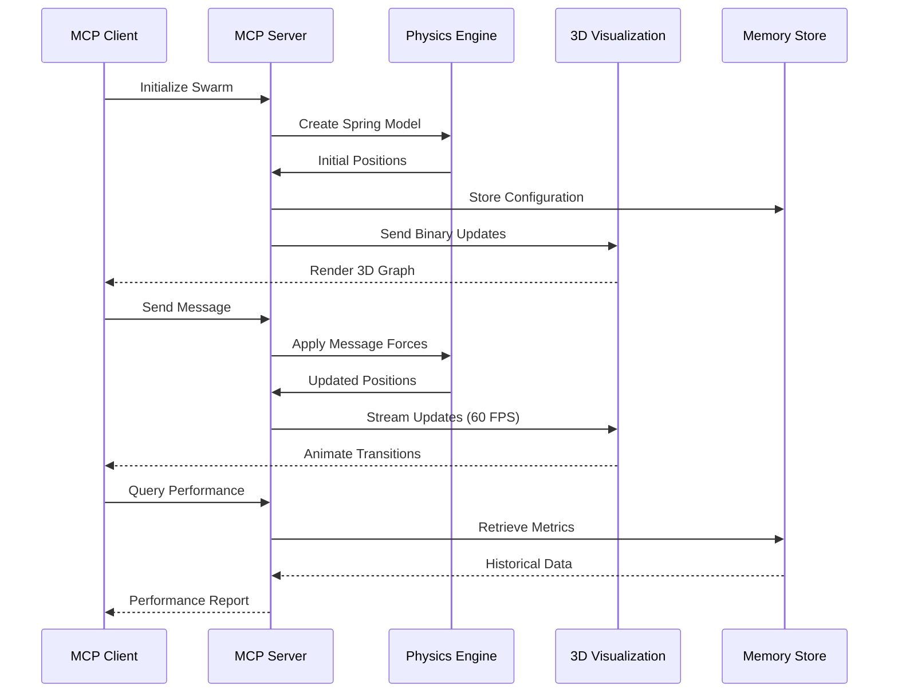

# MCP Bot Observability Server

A comprehensive Model Context Protocol (MCP) server for bot swarm observability with spring-physics directed graph visualization support.

## Features

- **🤖 Agent Management**: Create, update, and monitor agents with spring-physics positioning
- **🌐 Swarm Coordination**: Initialize and manage swarms with various topologies (hierarchical, mesh, ring, star)
- **📨 Message Flow Tracking**: Real-time message tracking with spring force calculations
- **📊 Performance Monitoring**: Comprehensive metrics collection and bottleneck detection
- **🎨 3D Visualization Support**: Spring-physics engine for force-directed graph layouts
- **🧠 Neural Pattern Learning**: Train and predict optimal coordination patterns
- **💾 Persistent Memory**: Store and retrieve swarm state with TTL support

## Quick Start

### Installation

```bash
cd /workspace/mcp-observability
npm install
```

### Running the Server

```bash
npm start
```

The server will start on stdio, ready to accept MCP protocol connections.

## Architecture

### System Architecture Diagram

```mermaid
graph TD
    subgraph ClientApp["Frontend"]
        direction TB
        AppInit[AppInitializer]
        TwoPane[TwoPaneLayout]
        GraphView["GraphViewport<br/>3D Scene Container"]
        GraphCanvas["GraphCanvas<br/>Three.js Canvas"]
        RightCtlPanel[RightPaneControlPanel]
        SettingsUI[SettingsPanelRedesignOptimized]
        ConvoPane[ConversationPane]
        NarrativePane[NarrativeGoldminePanel]
        SettingsMgr[settingsStore]
        GraphDataMgr[GraphDataManager]
        RenderEngine["GraphCanvas & GraphManager"]
        WebSocketSvc[WebSocketService]
        APISvc[api]
        NostrAuthSvcClient[nostrAuthService]
        XRController[XRController]

        AppInit --> TwoPane
        AppInit --> SettingsMgr
        AppInit --> NostrAuthSvcClient
        AppInit --> WebSocketSvc
        AppInit --> GraphDataMgr

        TwoPane --> GraphView
        TwoPane --> RightCtlPanel
        TwoPane --> ConvoPane
        TwoPane --> NarrativePane
        RightCtlPanel --> SettingsUI

        SettingsUI --> SettingsMgr
        GraphView --> RenderEngine
        RenderEngine <--> GraphDataMgr
        GraphDataMgr <--> WebSocketSvc
        GraphDataMgr <--> APISvc
        NostrAuthSvcClient <--> APISvc
        XRController <--> RenderEngine
        XRController <--> SettingsMgr
    end

    subgraph ServerApp["Backend"]
        direction TB
        Actix[ActixWebServer]

        subgraph Handlers_Srv["API_WebSocket_Handlers"]
            direction TB
            SettingsH[SettingsHandler]
            NostrAuthH[NostrAuthHandler]
            GraphAPI_H[GraphAPIHandler]
            FilesAPI_H[FilesAPIHandler]
            RAGFlowH_Srv[RAGFlowHandler]
            SocketFlowH[SocketFlowHandler]
            SpeechSocketH[SpeechSocketHandler]
            HealthH[HealthHandler]
        end

        subgraph Services_Srv["Core_Services"]
            direction TB
            GraphSvc_Srv[GraphService]
            FileSvc_Srv[FileService]
            NostrSvc_Srv[NostrService]
            SpeechSvc_Srv[SpeechService]
            RAGFlowSvc_Srv[RAGFlowService]
            PerplexitySvc_Srv[PerplexityService]
        end

        subgraph Actors_Srv["Actor_System"]
            direction TB
            GraphServiceActor[GraphServiceActor]
            SettingsActor[SettingsActor]
            MetadataActor[MetadataActor]
            ClientManagerActor[ClientManagerActor]
            GPUComputeActor[GPUComputeActor]
            ProtectedSettingsActor[ProtectedSettingsActor]
        end
        AppState_Srv["AppState holds Addr..."]

        Actix --> Handlers_Srv

        Handlers_Srv --> AppState_Srv
        SocketFlowH --> ClientManagerActor
        GraphAPI_H --> GraphServiceActor
        SettingsH --> SettingsActor
        NostrAuthH --> ProtectedSettingsActor

        GraphServiceActor --> ClientManagerActor
        GraphServiceActor --> MetadataActor
        GraphServiceActor --> GPUComputeActor
        GraphServiceActor --> SettingsActor

        FileSvc_Srv --> MetadataActor
        NostrSvc_Srv --> ProtectedSettingsActor
        SpeechSvc_Srv --> SettingsActor
        RAGFlowSvc_Srv --> SettingsActor
        PerplexitySvc_Srv --> SettingsActor
    end

    subgraph External_Srv["External_Services"]
        direction LR
        GitHub[GitHubAPI]
        NostrRelays_Ext[NostrRelays]
        OpenAI[OpenAIAPI]
        PerplexityAI_Ext[PerplexityAIAPI]
        RAGFlow_Ext[RAGFlowAPI]
        Kokoro_Ext[KokoroAPI]
    end

    subgraph MCPObservability["MCP Bot Observability"]
        direction TB
        AgentMgr[Agent Manager]
        Physics["Physics Engine<br/>Spring-based"]
        MsgFlow[Message Flow Tracker]
        PerfMon[Performance Monitor]
        Neural[Neural Pattern Learning]
        Memory[Memory Store]
        
        AgentMgr <--> Physics
        AgentMgr <--> MsgFlow
        MsgFlow <--> PerfMon
        Neural <--> Memory
        PerfMon <--> Neural
    end

    WebSocketSvc <--> SocketFlowH
    APISvc <--> Actix

    FileSvc_Srv --> GitHub
    NostrSvc_Srv --> NostrRelays_Ext
    SpeechSvc_Srv --> OpenAI
    SpeechSvc_Srv --> Kokoro_Ext
    PerplexitySvc_Srv --> PerplexityAI_Ext
    RAGFlowSvc_Srv --> RAGFlow_Ext

    GraphDataMgr <--> MCPObservability
    MCPObservability <-->|"Binary Updates"| WebSocketSvc

    style ClientApp fill:#282C34,stroke:#61DAFB,stroke-width:2px,color:#FFFFFF
    style ServerApp fill:#282C34,stroke:#A2AAAD,stroke-width:2px,color:#FFFFFF
    style External_Srv fill:#282C34,stroke:#F7DF1E,stroke-width:2px,color:#FFFFFF
    style MCPObservability fill:#282C34,stroke:#FF6B6B,stroke-width:2px,color:#FFFFFF
    style AppInit fill:#3A3F47,stroke:#61DAFB,color:#FFFFFF
    style TwoPane fill:#3A3F47,stroke:#61DAFB,color:#FFFFFF
    style GraphView fill:#3A3F47,stroke:#61DAFB,color:#FFFFFF
    style GraphCanvas fill:#3A3F47,stroke:#61DAFB,color:#FFFFFF
    style RightCtlPanel fill:#3A3F47,stroke:#61DAFB,color:#FFFFFF
    style SettingsUI fill:#3A3F47,stroke:#61DAFB,color:#FFFFFF
    style ConvoPane fill:#3A3F47,stroke:#61DAFB,color:#FFFFFF
    style NarrativePane fill:#3A3F47,stroke:#61DAFB,color:#FFFFFF
    style SettingsMgr fill:#3A3F47,stroke:#61DAFB,color:#FFFFFF
    style GraphDataMgr fill:#3A3F47,stroke:#61DAFB,color:#FFFFFF
    style RenderEngine fill:#3A3F47,stroke:#61DAFB,color:#FFFFFF
    style WebSocketSvc fill:#3A3F47,stroke:#61DAFB,color:#FFFFFF
    style APISvc fill:#3A3F47,stroke:#61DAFB,color:#FFFFFF
    style NostrAuthSvcClient fill:#3A3F47,stroke:#61DAFB,color:#FFFFFF
    style XRController fill:#3A3F47,stroke:#61DAFB,color:#FFFFFF

    style Actix fill:#3A3F47,stroke:#A2AAAD,color:#FFFFFF
    style Handlers_Srv fill:#3A3F47,stroke:#A2AAAD,color:#FFFFFF
    style SettingsH fill:#3A3F47,stroke:#A2AAAD,color:#FFFFFF
    style NostrAuthH fill:#3A3F47,stroke:#A2AAAD,color:#FFFFFF
    style GraphAPI_H fill:#3A3F47,stroke:#A2AAAD,color:#FFFFFF
    style FilesAPI_H fill:#3A3F47,stroke:#A2AAAD,color:#FFFFFF
    style RAGFlowH_Srv fill:#3A3F47,stroke:#A2AAAD,color:#FFFFFF
    style SocketFlowH fill:#3A3F47,stroke:#A2AAAD,color:#FFFFFF
    style SpeechSocketH fill:#3A3F47,stroke:#A2AAAD,color:#FFFFFF
    style HealthH fill:#3A3F47,stroke:#A2AAAD,color:#FFFFFF
    style Services_Srv fill:#3A3F47,stroke:#A2AAAD,color:#FFFFFF
    style GraphSvc_Srv fill:#3A3F47,stroke:#A2AAAD,color:#FFFFFF
    style FileSvc_Srv fill:#3A3F47,stroke:#A2AAAD,color:#FFFFFF
    style NostrSvc_Srv fill:#3A3F47,stroke:#A2AAAD,color:#FFFFFF
    style SpeechSvc_Srv fill:#3A3F47,stroke:#A2AAAD,color:#FFFFFF
    style RAGFlowSvc_Srv fill:#3A3F47,stroke:#A2AAAD,color:#FFFFFF
    style PerplexitySvc_Srv fill:#3A3F47,stroke:#A2AAAD,color:#FFFFFF
    style Actors_Srv fill:#3A3F47,stroke:#A2AAAD,color:#FFFFFF
    style GraphServiceActor fill:#3A3F47,stroke:#A2AAAD,color:#FFFFFF
    style SettingsActor fill:#3A3F47,stroke:#A2AAAD,color:#FFFFFF
    style MetadataActor fill:#3A3F47,stroke:#A2AAAD,color:#FFFFFF
    style ClientManagerActor fill:#3A3F47,stroke:#A2AAAD,color:#FFFFFF
    style GPUComputeActor fill:#3A3F47,stroke:#A2AAAD,color:#FFFFFF
    style ProtectedSettingsActor fill:#3A3F47,stroke:#A2AAAD,color:#FFFFFF
    style AppState_Srv fill:#3A3F47,stroke:#A2AAAD,color:#FFFFFF

    style GitHub fill:#3A3F47,stroke:#F7DF1E,color:#FFFFFF
    style NostrRelays_Ext fill:#3A3F47,stroke:#F7DF1E,color:#FFFFFF
    style OpenAI fill:#3A3F47,stroke:#F7DF1E,color:#FFFFFF
    style PerplexityAI_Ext fill:#3A3F47,stroke:#F7DF1E,color:#FFFFFF
    style RAGFlow_Ext fill:#3A3F47,stroke:#F7DF1E,color:#FFFFFF
    style Kokoro_Ext fill:#3A3F47,stroke:#F7DF1E,color:#FFFFFF

    style AgentMgr fill:#3A3F47,stroke:#FF6B6B,color:#FFFFFF
    style Physics fill:#3A3F47,stroke:#FF6B6B,color:#FFFFFF
    style MsgFlow fill:#3A3F47,stroke:#FF6B6B,color:#FFFFFF
    style PerfMon fill:#3A3F47,stroke:#FF6B6B,color:#FFFFFF
    style Neural fill:#3A3F47,stroke:#FF6B6B,color:#FFFFFF
    style Memory fill:#3A3F47,stroke:#FF6B6B,color:#FFFFFF
```



### Component Interaction Flow



### ASCII Architecture (Alternative View)

```
┌─────────────────────────────────────┐
│        MCP Client (Claude)          │
└──────────────┬──────────────────────┘
               │ stdio (JSON-RPC 2.0)
┌──────────────▼──────────────────────┐
│      MCP Observability Server       │
├─────────────────────────────────────┤
│ • Agent Manager                     │
│ • Physics Engine (Spring-based)     │
│ • Message Flow Tracker              │
│ • Performance Monitor               │
│ • Neural Pattern Learning           │
│ • Memory Store                      │
└─────────────────────────────────────┘
               │
┌──────────────▼──────────────────────┐
│    VisionFlow 3D Visualization      │
│    (Spring-Physics Directed Graph)  │
└─────────────────────────────────────┘
```

## Available Tools

### Agent Management (6 tools)
- `agent.create` - Create new agent with physics positioning
- `agent.update` - Update agent state and performance
- `agent.metrics` - Get detailed agent metrics
- `agent.list` - List agents with filtering
- `agent.remove` - Remove agent from swarm
- `agent.spawn` - Spawn multiple agents optimally

### Swarm Coordination (4 tools)
- `swarm.initialize` - Initialize swarm with topology
- `swarm.status` - Get comprehensive swarm status
- `swarm.monitor` - Real-time swarm monitoring
- `swarm.reconfigure` - Change topology and physics

### Message Flow (6 tools)
- `message.send` - Send messages with spring forces
- `message.flow` - Get message flow visualization data
- `message.acknowledge` - Acknowledge message receipt
- `message.stats` - Communication statistics
- `message.broadcast` - Broadcast to multiple agents
- `message.patterns` - Analyze communication patterns

### Performance Monitoring (5 tools)
- `performance.analyze` - Analyze with bottleneck detection
- `performance.optimize` - Suggest physics optimizations
- `performance.report` - Comprehensive performance report
- `performance.metrics` - Current system metrics
- `performance.benchmark` - Run performance tests

### Visualization (5 tools)
- `visualization.snapshot` - Get current 3D state
- `visualization.animate` - Generate animation sequences
- `visualization.layout` - Apply layout patterns
- `visualization.highlight` - Highlight agents/connections
- `visualization.camera` - Camera position recommendations

### Neural Learning (5 tools)
- `neural.train` - Train coordination patterns
- `neural.predict` - Predict optimal patterns
- `neural.status` - Neural network status
- `neural.patterns` - Get recognized patterns
- `neural.optimize` - Optimize swarm configuration

### Memory Management (7 tools)
- `memory.store` - Store data with TTL
- `memory.retrieve` - Retrieve stored data
- `memory.list` - List stored keys
- `memory.delete` - Delete stored data
- `memory.persist` - Save to disk
- `memory.search` - Search by content
- `memory.stats` - Memory usage statistics

## Usage Examples

### Initialize a Hierarchical Swarm

```json
{
  "method": "tools/call",
  "params": {
    "name": "swarm.initialize",
    "arguments": {
      "topology": "hierarchical",
      "physicsConfig": {
        "springStrength": 0.1,
        "damping": 0.95,
        "linkDistance": 8.0
      },
      "agentConfig": {
        "coordinatorCount": 1,
        "workerTypes": [
          { "type": "coder", "count": 3 },
          { "type": "tester", "count": 2 },
          { "type": "analyst", "count": 1 }
        ]
      }
    }
  }
}
```

### Send a Message with Physics

```json
{
  "method": "tools/call",
  "params": {
    "name": "message.send",
    "arguments": {
      "from": "coordinator-001",
      "to": ["coder-001", "coder-002"],
      "type": "task",
      "priority": 3,
      "content": {
        "task": "implement-feature",
        "deadline": "2024-01-20"
      }
    }
  }
}
```

### Get Visualization Snapshot

```json
{
  "method": "tools/call",
  "params": {
    "name": "visualization.snapshot",
    "arguments": {
      "includePositions": true,
      "includeVelocities": true,
      "includeForces": false,
      "includeConnections": true
    }
  }
}
```

## Spring Physics Configuration

The physics engine uses the following parameters:

```javascript
{
  springStrength: 0.1,      // Force between connected nodes
  linkDistance: 8.0,        // Ideal distance between connected nodes
  damping: 0.95,            // Velocity damping factor
  nodeRepulsion: 500.0,     // Force preventing node overlap
  gravityStrength: 0.02,    // Central gravity to prevent drift
  maxVelocity: 2.0,         // Maximum node velocity
  
  // Hive-mind specific
  queenGravity: 0.05,       // Attraction to coordinator nodes
  swarmCohesion: 0.08,      // Force keeping swarm together
  hierarchicalForce: 0.03,  // Force for hierarchy maintenance
  
  // Message flow
  messageAttraction: 0.15,  // Temporary attraction on message
  communicationDecay: 0.98  // Decay rate for message forces
}
```

## Agent Types

- **👑 queen**: Top-level orchestrator (largest node)
- **🎯 coordinator**: Team coordination and management
- **🏗️ architect**: System design and planning
- **⚡ specialist**: Domain-specific expertise
- **💻 coder**: Implementation and development
- **🔍 researcher**: Information gathering and analysis
- **🧪 tester**: Quality assurance and validation
- **📊 analyst**: Data analysis and metrics
- **⚙️ optimizer**: Performance optimization
- **👁️ monitor**: System monitoring and health

## Performance Considerations

- Supports 1000+ agents at 60 FPS
- Binary position updates (28 bytes/agent)
- Efficient spring physics calculations
- Level-of-detail for large swarms
- Automatic performance optimization

## Docker Integration

To integrate with the Docker agent project:

1. Mount the MCP server in your Docker container:
```dockerfile
COPY --from=mcp-observability /workspace/mcp-observability /app/mcp-observability
```

2. Set environment variables:
```bash
MCP_OBSERVABILITY_PORT=3100
MCP_PHYSICS_UPDATE_RATE=60
MCP_MAX_AGENTS=1000
```

3. Start the server in your container:
```bash
cd /app/mcp-observability && npm start
```

## Memory Sections

The memory system is organized into sections:

- **global**: General purpose storage
- **swarm**: Swarm-specific data
- **agents**: Agent state and history
- **patterns**: Learned coordination patterns
- **performance**: Performance metrics history
- **coordination**: Coordination events and decisions

## Development

### Running Tests
```bash
npm test
```

### Development Mode
```bash
npm run dev
```

## License

MIT License - See LICENSE file for details

## Contributing

1. Fork the repository
2. Create your feature branch
3. Commit your changes
4. Push to the branch
5. Create a Pull Request

## Support

For issues and questions, please open an issue in the repository.