# VisionFlow Documentation Index

**Complete Navigation Guide for AR-AI Knowledge Graph System**

*Last Updated: 2025-10-03*
*Version: 2.0.0*

---

## Quick Navigation

- [Getting Started](#getting-started) - Installation and quick start guides
- [Architecture](#architecture) - System design and component architecture
- [XR/Vircadia Integration](#xrvircadia-integration) - Multi-user XR platform
- [Development](#development) - Developer guides and workflows
- [Deployment](#deployment) - Production deployment guides
- [API Reference](#api-reference) - REST, WebSocket, and GPU APIs
- [Agent System](#agent-system) - Multi-agent architecture
- [Guides](#guides) - User and developer guides
- [Research](#research) - Technical research documents

---

## Getting Started

### Installation & Setup

1. **[Installation Guide](./getting-started/01-installation.md)** - System requirements and installation
   - Prerequisites
   - Dependencies
   - Initial configuration
   - **Next**: [Quick Start Guide](./getting-started/02-quick-start.md)

2. **[Quick Start Guide](./getting-started/02-quick-start.md)** - Get up and running quickly
   - Development server setup
   - First graph creation
   - Basic operations
   - **Previous**: [Installation](./getting-started/01-installation.md)
   - **Next**: [Quest 3 XR Setup](./guides/xr-quest3-setup.md)

3. **[Getting Started Index](./getting-started/00-index.md)** - Complete getting started overview
   - **Related**: [Deployment Guide](./deployment/vircadia-docker-deployment.md)

---

## Architecture

### Core Architecture

1. **[System Architecture Overview](./architecture/hybrid_docker_mcp_architecture.md)** - Complete system design
   - Docker container architecture
   - MCP (Model Context Protocol) integration
   - Hybrid deployment patterns
   - **Related**: [Deployment Architecture](./deployment/vircadia-docker-deployment.md)
   - **See Also**: [Multi-Agent Docker Architecture](./multi-agent-docker/ARCHITECTURE.md)

2. **[XR Immersive System](./architecture/xr-immersive-system.md)** - XR rendering architecture
   - Babylon.js integration
   - WebXR session management
   - Performance optimisation
   - **Next**: [Vircadia-React XR Integration](./architecture/vircadia-react-xr-integration.md)
   - **Related**: [Quest 3 Setup](./guides/xr-quest3-setup.md)

### XR/Vircadia Integration

3. **[Vircadia-React XR Integration](./architecture/vircadia-react-xr-integration.md)** ⭐ **NEW**
   - Complete multi-user XR architecture
   - React component hierarchy
   - Real-time synchronisation patterns
   - Quest 3 optimisations
   - **Previous**: [XR Immersive System](./architecture/xr-immersive-system.md)
   - **Related**: [Vircadia Docker Deployment](./deployment/vircadia-docker-deployment.md)
   - **API Reference**: [XR API](./reference/xr-api.md)

4. **[Vircadia Integration (Legacy)](./xr-vircadia-integration.md)** - Original API reference
   - Entity system
   - WebSocket protocol
   - Authentication
   - **Updated By**: [Vircadia-React XR Integration](./architecture/vircadia-react-xr-integration.md)

---

## XR/Vircadia Integration

### User Guides

1. **[Quest 3 XR Setup Guide](./guides/xr-quest3-setup.md)** - Meta Quest 3 configuration
   - Hardware setup
   - Browser configuration
   - Controller mapping
   - Troubleshooting
   - **Previous**: [Quick Start](./getting-started/02-quick-start.md)
   - **Related**: [XR API Reference](./reference/xr-api.md)
   - **Architecture**: [Vircadia-React XR Integration](./architecture/vircadia-react-xr-integration.md)

### API Reference

2. **[XR API Reference](./reference/xr-api.md)** - XR programming interfaces
   - WebXR APIs
   - Babylon.js interfaces
   - Vircadia SDK methods
   - **Related**: [Quest 3 Setup](./guides/xr-quest3-setup.md)
   - **Architecture**: [XR Immersive System](./architecture/xr-immersive-system.md)

---

## Deployment

### Production Deployment

1. **[Vircadia Docker Deployment](./deployment/vircadia-docker-deployment.md)** ⭐ **NEW**
   - Complete Docker setup guide
   - Container orchestration
   - Service management
   - Monitoring and debugging
   - Backup and recovery
   - Production best practices
   - **Related**: [Vircadia-React XR Integration](./architecture/vircadia-react-xr-integration.md)
   - **See Also**: [Multi-Agent Docker](./multi-agent-docker/ARCHITECTURE.md)

2. **[General Deployment Guide](./development/deployment.md)** - System-wide deployment
   - Production configuration
   - SSL/TLS setup
   - Load balancing
   - **Related**: [Hybrid Architecture](./architecture/hybrid_docker_mcp_architecture.md)

---

## Development

### Developer Guides

1. **[Development Workflow](./development/workflow/)** - Development processes
   - Git workflow
   - Code review process
   - Testing procedures

2. **[Debugging Guide](./development/debugging/)** - Debugging tools and techniques
   - Browser DevTools
   - Remote Quest 3 debugging
   - Log analysis
   - **Related**: [Vircadia Deployment](./deployment/vircadia-docker-deployment.md#monitoring--debugging)

3. **[Testing Guide](./development/testing/)** - Testing strategies
   - Unit testing
   - Integration testing
   - XR testing on Quest 3
   - **Related**: [Quest 3 Setup](./guides/xr-quest3-setup.md#testing-workflow)

---

## API Reference

### Communication Protocols

1. **[WebSocket API](./reference/api/websocket-api.md)** - Real-time communication
   - Connection management
   - Message formats
   - Error handling
   - **Related**: [Binary Protocol](./reference/api/binary-protocol.md)
   - **Implementation**: [Vircadia-React Integration](./architecture/vircadia-react-xr-integration.md#network-architecture)

2. **[Binary Protocol](./reference/api/binary-protocol.md)** - Efficient data transfer
   - Message structure
   - Entity updates
   - Performance optimisation
   - **Related**: [WebSocket API](./reference/api/websocket-api.md)

3. **[REST API](./reference/api/rest-api.md)** - HTTP endpoints
   - Authentication
   - Entity management
   - Query interface

4. **[MCP Protocol](./reference/api/mcp-protocol.md)** - Model Context Protocol
   - Agent communication
   - Context sharing
   - **Related**: [Hybrid Architecture](./architecture/hybrid_docker_mcp_architecture.md)

### XR APIs

5. **[XR API](./reference/xr-api.md)** - Extended Reality interfaces
   - WebXR integration
   - Babylon.js methods
   - Vircadia SDK
   - **Guide**: [Quest 3 Setup](./guides/xr-quest3-setup.md)
   - **Architecture**: [XR Immersive System](./architecture/xr-immersive-system.md)

### GPU Computing

6. **[GPU Algorithms](./reference/api/gpu-algorithms.md)** - GPU-accelerated processing
   - CUDA kernels
   - Graph algorithms
   - Performance benchmarks
   - **Configuration**: [CUDA Parameters](./reference/cuda-parameters.md)

7. **[Voice API](./reference/api/voice-api.md)** - Spatial audio and voice chat
   - WebRTC integration
   - 3D positional audio
   - Voice commands

---

## Agent System

### Core Agents

1. **[Agent System Overview](./reference/agents/README.md)** - Multi-agent architecture
   - Agent types
   - Communication patterns
   - Coordination strategies
   - **Related**: [MCP Protocol](./reference/api/mcp-protocol.md)

2. **[Core Agents](./reference/agents/core/)** - Foundational agents
   - [Researcher](./reference/agents/core/researcher.md)
   - [Planner](./reference/agents/core/planner.md)
   - [Coder](./reference/agents/core/coder.md)
   - [Reviewer](./reference/agents/core/reviewer.md)
   - [Tester](./reference/agents/core/tester.md)

### Specialised Agents

3. **[GitHub Agents](./reference/agents/github/)** - Repository management
   - [PR Manager](./reference/agents/github/pr-manager.md)
   - [Issue Tracker](./reference/agents/github/issue-tracker.md)
   - [Code Review Swarm](./reference/agents/github/code-review-swarm.md)
   - **See Also**: [GitHub Integration Index](./reference/agents/github/index.md)

4. **[Optimisation Agents](./reference/agents/optimization/)** - Performance tuning
   - [Performance Monitor](./reference/agents/optimization/performance-monitor.md)
   - [Resource Allocator](./reference/agents/optimization/resource-allocator.md)
   - [Topology Optimiser](./reference/agents/optimization/topology-optimizer.md)
   - **See Also**: [Optimisation Index](./reference/agents/optimization/index.md)

5. **[Swarm Coordination](./reference/agents/swarm/)** - Multi-agent swarms
   - [Hierarchical Coordinator](./reference/agents/swarm/hierarchical-coordinator.md)
   - [Mesh Coordinator](./reference/agents/swarm/mesh-coordinator.md)
   - [Adaptive Coordinator](./reference/agents/swarm/adaptive-coordinator.md)

6. **[Consensus Mechanisms](./reference/agents/consensus/)** - Distributed consensus
   - [Raft Manager](./reference/agents/consensus/raft-manager.md)
   - [CRDT Synchroniser](./reference/agents/consensus/crdt-synchronizer.md)
   - [Byzantine Coordinator](./reference/agents/consensus/byzantine-coordinator.md)

### Agent Templates

7. **[Agent Templates](./reference/agents/templates/)** - Reusable patterns
   - [SPARC Coordinator](./reference/agents/templates/sparc-coordinator.md)
   - [Orchestrator Task](./reference/agents/templates/orchestrator-task.md)
   - [Performance Analyser](./reference/agents/templates/performance-analyzer.md)

---

## Guides

### User Guides

1. **[User Guide Directory](./guides/user/)** - End-user documentation
   - Basic operations
   - Graph manipulation
   - XR navigation

### Developer Guides

2. **[Developer Guide Directory](./guides/developer/)** - Development practices
   - Architecture patterns
   - Best practices
   - Code conventions

3. **[Getting Started Guides](./guides/getting-started/)** - Quick starts
   - **See**: [Getting Started Section](#getting-started)

---

## Multi-Agent Docker

### Docker Architecture

1. **[Multi-Agent Docker Architecture](./multi-agent-docker/ARCHITECTURE.md)** - Container orchestration
   - Service topology
   - Network configuration
   - Volume management
   - **Related**: [Hybrid Architecture](./architecture/hybrid_docker_mcp_architecture.md)
   - **Deployment**: [Vircadia Docker](./deployment/vircadia-docker-deployment.md)

2. **[Port Configuration](./multi-agent-docker/PORT-CONFIGURATION.md)** - Network ports
   - Service port mapping
   - Firewall rules
   - Security considerations

3. **[Tools Reference](./multi-agent-docker/TOOLS.md)** - Docker tooling
   - Container management
   - Debugging utilities
   - Performance monitoring

4. **[Troubleshooting](./multi-agent-docker/TROUBLESHOOTING.md)** - Common issues
   - Container failures
   - Network problems
   - Performance issues
   - **Related**: [Vircadia Troubleshooting](./deployment/vircadia-docker-deployment.md#troubleshooting)

5. **[Goalie Integration](./multi-agent-docker/GOALIE-INTEGRATION.md)** - Goalie framework
   - Agent coordination
   - Task management

---

## Research

### Technical Research

1. **[OWL/RDF Ontology Integration](./research/owl_rdf_ontology_integration_research.md)** - Semantic web
   - Ontology design
   - RDF triple stores
   - SPARQL queries
   - **Related**: [Ontology Validation](./concepts/ontology-validation.md)

2. **[Ontology Integration Summary](./specialized/ontology/ontology-integration-summary.md)** - Implementation summary
   - Integration patterns
   - Data mapping
   - Query optimisation

---

## Configuration & Reference

### Configuration

1. **[System Configuration](./reference/configuration.md)** - Configuration options
   - Environment variables
   - Service configuration
   - Performance tuning
   - **Related**: [Vircadia Docker .env](./deployment/vircadia-docker-deployment.md#configuration)

2. **[CUDA Parameters](./reference/cuda-parameters.md)** - GPU configuration
   - Kernel parameters
   - Memory allocation
   - Performance tuning

### General Reference

3. **[Glossary](./reference/glossary.md)** - Terminology reference
   - Technical terms
   - Acronyms
   - Concepts

4. **[Reference Index](./reference/index.md)** - Complete API reference
   - All APIs
   - All agents
   - All configurations

---

## Reports & Verification

### Technical Reports

1. **[Technical Verification Report](./reports/verification/technical-verification-report.md)** - System validation
   - Component testing
   - Integration testing
   - Performance benchmarks

2. **[System Integration Verification](./reports/verification/system-integration-verification-report.md)** - Integration testing
   - End-to-end testing
   - Multi-component validation

3. **[Ontology Constraints Translator](./reports/technical/ontology_constraints_translator.md)** - Ontology tooling
   - Constraint validation
   - Translation mechanisms

---

## Concepts

### Core Concepts

1. **[Ontology Validation](./concepts/ontology-validation.md)** - Semantic validation
   - Validation rules
   - Constraint checking
   - **Related**: [OWL/RDF Research](./research/owl_rdf_ontology_integration_research.md)

2. **[Architecture Concepts](./concepts/architecture/)** - Architectural patterns
   - Design patterns
   - Best practices

---

## Archive

### Historical Documentation

1. **[Archived Documentation](./archive/)** - Deprecated docs
   - Legacy implementations
   - Historical context
   - Migration notes

---

## Navigation Map

### Document Relationships

```mermaid
graph TB
    Index["📚 Documentation Index<br/>(This Document)"]

    subgraph "Getting Started Path"
        Install["Installation"]
        Quick["Quick Start"]
        Quest3["Quest 3 Setup"]
    end

    subgraph "Architecture Path"
        Hybrid["Hybrid Architecture"]
        XRSystem["XR Immersive System"]
        VircadiaArch["Vircadia-React Integration"]
    end

    subgraph "Deployment Path"
        VircadiaDocker["Vircadia Docker Deployment"]
        GeneralDeploy["General Deployment"]
        MultiAgentDocker["Multi-Agent Docker"]
    end

    subgraph "API Path"
        XRAPI["XR API"]
        WebSocketAPI["WebSocket API"]
        BinaryProto["Binary Protocol"]
        RESTAPI["REST API"]
    end

    subgraph "Development Path"
        DevWorkflow["Development Workflow"]
        Debugging["Debugging"]
        Testing["Testing"]
    end

    Index --> Install
    Install --> Quick
    Quick --> Quest3
    Quest3 --> XRAPI

    Index --> Hybrid
    Hybrid --> XRSystem
    XRSystem --> VircadiaArch
    VircadiaArch --> VircadiaDocker

    Index --> VircadiaDocker
    VircadiaDocker --> MultiAgentDocker
    VircadiaDocker --> GeneralDeploy

    Index --> XRAPI
    XRAPI --> WebSocketAPI
    WebSocketAPI --> BinaryProto
    XRAPI --> RESTAPI

    Index --> DevWorkflow
    DevWorkflow --> Debugging
    Debugging --> Testing

    VircadiaArch -.implements.-> XRAPI
    VircadiaArch -.implements.-> WebSocketAPI
    VircadiaDocker -.deploys.-> VircadiaArch
    Quest3 -.uses.-> VircadiaArch

    style Index fill:#667EEA,color:#FFF
    style VircadiaArch fill:#F6AD55
    style VircadiaDocker fill:#F6AD55
    style Quest3 fill:#48BB78
```



---

## Quick Reference Cards

### New to VisionFlow XR?

**Fastest Path to XR Development**:
1. [Installation](./getting-started/01-installation.md) (15 min)
2. [Quick Start](./getting-started/02-quick-start.md) (10 min)
3. [Quest 3 Setup](./guides/xr-quest3-setup.md) (20 min)
4. [Vircadia Docker Deployment](./deployment/vircadia-docker-deployment.md) (30 min)
5. [Vircadia-React XR Integration](./architecture/vircadia-react-xr-integration.md) (reference)

**Total Time**: ~75 minutes to running multi-user XR system

### Need to Deploy?

**Production Deployment Path**:
1. [Vircadia Docker Deployment](./deployment/vircadia-docker-deployment.md)
2. [Multi-Agent Docker Architecture](./multi-agent-docker/ARCHITECTURE.md)
3. [System Configuration](./reference/configuration.md)
4. [Port Configuration](./multi-agent-docker/PORT-CONFIGURATION.md)

### Troubleshooting?

**Common Issues**:
1. [Vircadia Docker Troubleshooting](./deployment/vircadia-docker-deployment.md#troubleshooting)
2. [Multi-Agent Docker Troubleshooting](./multi-agent-docker/TROUBLESHOOTING.md)
3. [Quest 3 Troubleshooting](./guides/xr-quest3-setup.md#troubleshooting)

### API Development?

**API Reference Quick Links**:
- [XR API](./reference/xr-api.md) - WebXR, Babylon.js, Vircadia
- [WebSocket API](./reference/api/websocket-api.md) - Real-time communication
- [Binary Protocol](./reference/api/binary-protocol.md) - Efficient data transfer
- [REST API](./reference/api/rest-api.md) - HTTP endpoints

---

## Contributing to Documentation

### Documentation Standards

- **UK English Spelling**: colour, optimisation, synchronisation, etc.
- **Mermaid Diagrams**: Use detailed diagrams for architecture
- **Cross-References**: Always link related documents (Previous/Next/Related/See Also)
- **Examples**: Include code examples where applicable
- **Versioning**: Update version and date on changes

### Documentation Structure

```
docs/
├── 00-INDEX.md              # This file - master navigation
├── getting-started/         # Installation and setup
├── architecture/            # System design documents
├── deployment/              # Deployment guides
├── guides/                  # User and developer guides
├── reference/               # API and configuration reference
├── development/             # Development workflows
├── multi-agent-docker/      # Docker-specific docs
├── research/                # Technical research
├── concepts/                # Core concepts
└── reports/                 # Verification and testing reports
```

### Adding New Documentation

1. Create document in appropriate directory
2. Add entry to this index
3. Add forward/back navigation links
4. Update related documents
5. Add to Navigation Map diagram
6. Update Quick Reference if applicable

---

## Document Status

| Status | Count | Examples |
|--------|-------|----------|
| ⭐ New (2025-10-03) | 2 | Vircadia-React Integration, Docker Deployment |
| ✅ Current | ~80% | Most architecture and API docs |
| 🔄 In Progress | ~15% | Some agent templates |
| 📦 Archived | ~5% | Legacy implementations |

---

**Document Maintained By**: VisionFlow Documentation Team
**Last Comprehensive Review**: 2025-10-03
**Next Scheduled Review**: 2025-11-03

For documentation issues or suggestions, please open a GitHub issue with label `documentation`.
