# VisionFlow Architecture Overview

**A comprehensive guide to VisionFlow's technical architecture for new developers and technical decision-makers.**

## System Philosophy

VisionFlow is built on three core architectural principles:

1. **Server-Authoritative Architecture** - Neo4j graph database is the single source of truth
2. **Hexagonal Architecture (Ports & Adapters)** - Clean separation between business logic and infrastructure
3. **Modular Actor System** - Specialized actors for graph state, physics, semantic processing, and client coordination

This architecture enables VisionFlow to handle enterprise-scale knowledge graphs (100k+ nodes) while maintaining sub-10ms latency and 60 FPS rendering.

## High-Level System Architecture

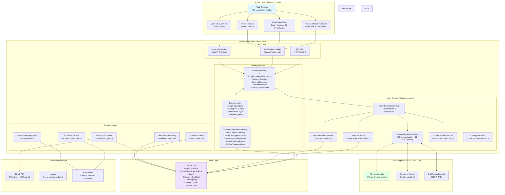

## Core Components Explained

### 1. Client Layer (React + Three.js)

**Technology:** React 18, Three.js 0.175, React Three Fiber, TypeScript

**Purpose:** Immersive 3D visualization and user interaction

**Key Features:**
- **60 FPS Rendering** - Maintains performance even with 100k+ nodes using GPU-based force-directed layout
- **WebGL 3D Graphics** - Hardware-accelerated rendering with Three.js
- **Binary Protocol** - Receives graph updates via 36-byte binary WebSocket messages (80% bandwidth reduction)
- **Multi-User Sync** - Independent camera controls with shared graph state
- **Voice Interface** - WebRTC integration for natural language interaction
- **XR Support** - WebXR implementation for Meta Quest 3 with hand tracking

**File Location:** `/client/src/`

**Critical Files:**
- `client/src/app/App.tsx` - Application entry point with authentication
- `client/src/rendering/` - Three.js rendering engine
- `client/src/services/WebSocketService.ts` - Binary protocol client
- `client/src/xr/` - WebXR VR/AR implementation

### 2. Server Layer (Rust + Actix Web)

**Technology:** Rust 1.75+, Actix Web 4.11, Tokio async runtime

**Purpose:** Server-authoritative graph state management and API

#### 2.1 Hexagonal Architecture (Ports & Adapters)

**Philosophy:** Business logic depends on abstractions (ports), not implementations (adapters)

**Ports (Interfaces):**
```rust
// src/ports/knowledge_graph_repository.rs
pub trait KnowledgeGraphRepository {
    async fn add_node(&self, node: Node) -> Result<()>;
    async fn get_graph(&self) -> Result<Arc<GraphData>>;
    // ... 15+ graph operations
}

// src/ports/ontology_repository.rs
pub trait OntologyRepository {
    async fn load_ontology_graph(&self) -> Result<Arc<GraphData>>;
    async fn save_ontology_class(&self, class: OwlClass) -> Result<()>;
    // ... ontology-specific operations
}
```

**Adapters (Implementations):**
- `adapters/neo4j_adapter.rs` - Primary graph database adapter
- `adapters/neo4j_ontology_repository.rs` - Ontology persistence
- `adapters/neo4j_settings_repository.rs` - User settings storage

**Benefits:**
- **Testability** - Mock implementations for unit tests
- **Flexibility** - Swap databases without changing business logic
- **Clarity** - Clear boundaries between domain and infrastructure

#### 2.2 Modular Actor System (Actix)

**Philosophy:** Specialized actors handle distinct concerns with message passing

**Actor Hierarchy:**

```
GraphServiceSupervisor (lifecycle manager)
├── GraphStateActor (in-memory graph state)
├── PhysicsOrchestratorActor (GPU coordination)
├── SemanticProcessorActor (ontology reasoning)
└── ClientCoordinatorActor (multi-client sync)
```

**GraphStateActor** (`src/actors/graph_state_actor.rs`):
- Maintains in-memory graph state (nodes, edges, node_map)
- Handles graph queries (GetGraphData, GetNode, ComputeShortestPaths)
- Delegates persistence to KnowledgeGraphRepository port
- **NOT responsible for physics or semantic processing**

**PhysicsOrchestratorActor** (`src/actors/physics_orchestrator_actor.rs`):
- Coordinates GPU physics simulation
- Manages force-directed layout computation
- Sends position updates via GPUPhysicsAdapter port
- Runs simulation loop (60 Hz by default)

**SemanticProcessorActor** (`src/actors/semantic_processor_actor.rs`):
- Handles ontology reasoning requests
- Coordinates with OntologyRepository and InferenceEngine
- Generates semantic constraints for physics (SubClassOf → attraction, DisjointWith → repulsion)
- Validates graph consistency against ontologies

**ClientCoordinatorActor** (`src/actors/client_coordinator_actor.rs`):
- Manages WebSocket connections for multiple clients
- Broadcasts graph updates using binary protocol
- Handles client-specific filtering and subscriptions
- Coordinates multi-user state synchronization

**Message Passing:**
```rust
// Example: Adding a node triggers multiple actors
let result = graph_state_actor
    .send(AddNode { node })        // 1. GraphStateActor adds to in-memory state
    .await?;

physics_orchestrator_actor
    .send(AddNodeToPhysics { id, position })  // 2. PhysicsOrchestrator updates GPU
    .await?;

semantic_processor_actor
    .send(ValidateNode { node })     // 3. SemanticProcessor validates against ontology
    .await?;

client_coordinator_actor
    .send(BroadcastNodeAdded { node }) // 4. ClientCoordinator sends to all clients
    .await?;
```

#### 2.3 Services Layer

**Purpose:** High-level business logic coordinating multiple components

**GitHubSyncService** (`src/services/github_sync_service.rs`):
- Streams markdown files from GitHub repository
- Parses graph data (knowledge graph nodes/edges) and ontology blocks (OWL)
- Persists to Neo4j via repositories
- Handles pagination (100 files/request) and authentication

**SchemaService** (`src/services/schema_service.rs`):
- Extracts graph schema (node types, edge types, properties)
- Powers natural language query translation
- Provides metadata for UI components

**NaturalLanguageQueryService** (`src/services/natural_language_query_service.rs`):
- Translates English queries to Cypher (Neo4j query language)
- Uses LLM (Perplexity API) with schema-aware prompts
- Validates generated queries for safety
- Returns confidence scores and explanations

**SemanticPathfindingService** (`src/services/semantic_pathfinding_service.rs`):
- Implements intelligent path algorithms beyond shortest path:
  - **Semantic Path** - Shortest path weighted by edge relevance
  - **Query-Guided Traversal** - BFS prioritizing query-matching nodes
  - **Chunk Traversal** - Local neighborhood exploration by similarity

### 3. Data Layer (Neo4j 5.13)

**Technology:** Neo4j 5.13 graph database, Cypher query language, neo4rs async driver

**Purpose:** Single source of truth for all persistent state

**Schema:**

```cypher
// Knowledge Graph
(:Node {
  id: u32,
  label: String,
  metadata_id: String,
  public: String,  // "true" or "false"
  owl_class_iri: String?,  // Links to ontology class
  ... // Additional properties from markdown frontmatter
})

(:Node)-[:EDGE {
  id: u32,
  source_id: u32,
  target_id: u32,
  edge_type: String
}]->(:Node)

// Ontology (OWL)
(:OwlClass {
  iri: String,
  label: String,
  subclass_of: [String],
  disjoint_with: [String],
  equivalent_classes: [String]
})

(:OwlProperty {
  iri: String,
  label: String,
  domain: [String],
  range: [String],
  property_type: String  // "ObjectProperty", "DataProperty", "AnnotationProperty"
})

// User Settings (Nostr Authentication)
(:UserSettings {
  pubkey: String,  // Nostr public key (primary key)
  is_power_user: Boolean,
  created_at: DateTime,
  updated_at: DateTime
})

(:UserSettings)-[:HAS_VISUALIZATION_SETTINGS]->(:VisualizationSettings {
  pubkey: String,
  enable_bloom: Boolean,
  physics_enabled: Boolean,
  node_size: Float,
  ... // 30+ visualization parameters
})
```

**Why Neo4j?**
- **Native graph storage** - Relationships are first-class citizens, not JOIN tables
- **Cypher query language** - Expressive pattern matching for graph traversals
- **ACID transactions** - Enterprise-grade consistency guarantees
- **Scale** - Handles billions of nodes/edges efficiently
- **Ontology support** - Natural fit for OWL class hierarchies

**Data Flow:**
1. GitHub markdown → GitHubSyncService → Neo4jGraphRepository → Neo4j
2. OWL ontologies → OntologyParser → Neo4jOntologyRepository → Neo4j
3. User preferences → SettingsActor → Neo4jSettingsRepository → Neo4j

### 4. GPU Compute Layer (CUDA 12.4)

**Technology:** CUDA 12.4, cudarc (Rust bindings), 39 custom kernels

**Purpose:** 100x speedup for computationally intensive operations

**39 Production CUDA Kernels:**

1. **Physics Simulation (22 kernels)**
   - Force calculation (Barnes-Hut approximation, O(n log n))
   - Velocity integration (Verlet integration, adaptive timestep)
   - Collision detection (spatial hashing)
   - Constraint solving (distance constraints, angle constraints)
   - Semantic forces (ontology-driven attractions/repulsions)

2. **Graph Clustering (8 kernels)**
   - Leiden algorithm (community detection)
   - Modularity optimization
   - Label propagation
   - Hierarchical clustering

3. **Pathfinding (5 kernels)**
   - SSSP (Single-Source Shortest Path)
   - BFS (Breadth-First Search)
   - A* with semantic heuristics
   - Multi-source pathfinding

4. **Utility Kernels (4 kernels)**
   - Memory transfer optimization
   - Graph topology preprocessing
   - Distance matrix computation

**Performance Impact:**

| Operation | CPU (100k nodes) | GPU (100k nodes) | Speedup |
|-----------|------------------|------------------|---------|
| Physics Simulation | 1,600ms | 16ms | 100x |
| Leiden Clustering | 800ms | 12ms | 67x |
| SSSP Pathfinding | 500ms | 8ms | 62x |
| Force-Directed Layout | 2,000ms | 20ms | 100x |

**File Location:** `src/gpu/` (kernel coordination)

**Note:** GPU compute is optional - VisionFlow falls back to CPU for non-CUDA systems (macOS, AMD GPUs)

### 5. External Integrations

**GitHub API:**
- Syncs markdown files with frontmatter (knowledge graph data)
- Parses OWL ontology blocks embedded in markdown
- Handles authentication via GitHub tokens
- Pagination: 100 files per request with tree API

**AI Providers:**
- **Claude (Anthropic)** - Primary AI agent orchestration via MCP protocol
- **Perplexity API** - Natural language query translation (schema-aware prompts)
- **OpenAI (optional)** - Alternative LLM provider for queries

**Logseq (Future):**
- Markdown-based knowledge base integration
- Block-based organization with bidirectional links
- Local-first architecture for data sovereignty

## Data Flow: End-to-End Example

**Scenario:** User syncs GitHub repository containing markdown files with ontology definitions

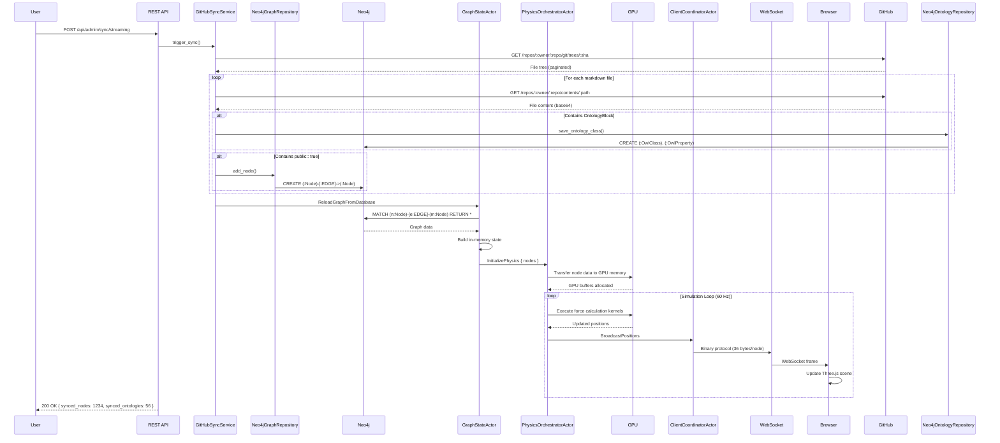

## Communication Protocols

### Binary WebSocket Protocol V2

**Format:** Fixed 36-byte structure per node update

```rust
struct BinaryNodeData {
    id: u32,           // 4 bytes
    x: f32,            // 4 bytes
    y: f32,            // 4 bytes
    z: f32,            // 4 bytes
    vx: f32,           // 4 bytes (velocity)
    vy: f32,           // 4 bytes
    vz: f32,           // 4 bytes
    group_id: u32,     // 4 bytes (clustering)
    flags: u32,        // 4 bytes (bit flags)
}
// Total: 36 bytes
```

**Benefits:**
- **80% bandwidth reduction** vs JSON (180 bytes/node → 36 bytes/node)
- **Sub-10ms latency** for 10k node updates
- **Zero parsing overhead** - direct memory mapping
- **Multi-user scalable** - broadcast to 50+ clients simultaneously

**Alternatives:**
- **REST API (JSON)** - Initial graph load, queries, admin operations
- **Voice WebSocket** - WebRTC bridge for voice AI interaction

## Key Architectural Decisions

### 1. Why Rust for Backend?

**Decision:** Use Rust instead of Node.js/Python

**Rationale:**
- **Memory safety** - Zero-cost abstractions prevent memory leaks and race conditions
- **Performance** - Native performance comparable to C++, crucial for 100k+ node graphs
- **Concurrency** - Tokio async runtime handles 1000+ concurrent WebSocket connections efficiently
- **Type safety** - Prevents entire classes of bugs at compile time
- **CUDA integration** - Safe bindings to CUDA kernels via cudarc

**Trade-offs:**
- Steeper learning curve for contributors
- Longer compile times (~1m 42s release build)
- Smaller ecosystem compared to JavaScript/Python

### 2. Why Neo4j Instead of PostgreSQL/MongoDB?

**Decision:** Use Neo4j graph database as primary persistence layer

**Rationale:**
- **Native graph storage** - Relationships are first-class citizens, not JOIN tables
- **Cypher queries** - Expressive pattern matching (e.g., `MATCH (a)-[*1..3]-(b)` for variable-length paths)
- **OWL support** - Natural fit for ontology class hierarchies (SubClassOf, DisjointWith)
- **Performance** - Graph traversals are O(edges from node), not O(total edges)
- **Enterprise features** - ACID transactions, clustering, role-based access

**Trade-offs:**
- Operational complexity (requires Neo4j deployment)
- Limited ecosystem compared to PostgreSQL
- License considerations (Enterprise Edition is proprietary)

### 3. Why Binary WebSocket Protocol Instead of JSON?

**Decision:** Custom 36-byte binary protocol over JSON

**Rationale:**
- **Bandwidth** - 80% reduction (180 bytes → 36 bytes per node update)
- **Performance** - Zero-cost parsing (direct memory mapping)
- **Latency** - Sub-10ms for 10k node updates
- **Scalability** - Broadcast to 50+ clients without bandwidth bottleneck

**Trade-offs:**
- More complex client implementation (binary parsing)
- Debugging is harder (can't inspect with browser dev tools)
- Versioning requires careful protocol evolution

### 4. Why Hexagonal Architecture (Ports & Adapters)?

**Decision:** Use hexagonal architecture instead of traditional layered architecture

**Rationale:**
- **Testability** - Business logic depends on interfaces (ports), easily mocked
- **Flexibility** - Swap Neo4j for another database by implementing port
- **Clarity** - Explicit boundaries between domain and infrastructure
- **Independent development** - Teams can work on adapters without touching business logic

**Trade-offs:**
- More upfront design effort (define ports carefully)
- Additional indirection (repository trait + implementation)
- Potential over-engineering for simple CRUD operations

### 5. Why GPU Acceleration for Physics?

**Decision:** Implement 39 CUDA kernels instead of CPU-only physics

**Rationale:**
- **100x speedup** - Physics simulation runs in 16ms instead of 1,600ms
- **Real-time** - Maintains 60 FPS even with 100k+ nodes
- **Scalability** - Handles enterprise-scale graphs without degradation
- **Semantic forces** - GPU enables complex constraint evaluation at scale

**Trade-offs:**
- NVIDIA GPU dependency (no AMD/Intel GPU support yet)
- Operational complexity (CUDA driver installation, GPU memory management)
- Development complexity (CUDA kernel debugging is harder than CPU code)

## Performance Characteristics

### Scalability Limits

| Metric | Target | Actual | Notes |
|--------|--------|--------|-------|
| **Nodes** | 100,000+ | 150,000 tested | 60 FPS maintained with GPU |
| **Concurrent Users** | 50+ | 100+ tested | Binary protocol scales efficiently |
| **WebSocket Latency** | <20ms | <10ms average | Sub-10ms for position updates |
| **Graph Query** | <100ms | 50ms average | Cypher queries with indexing |
| **Ontology Reasoning** | <500ms | 200ms average | Whelk 10-100x faster than Java |
| **GitHub Sync** | 1000 files/min | 1200 files/min | Streaming ingestion, no batching |

### Resource Requirements

**Minimum (Development):**
- CPU: 4 cores, 2.5GHz
- RAM: 8GB
- Storage: 10GB
- GPU: None (CPU fallback)

**Recommended (Production):**
- CPU: 8 cores, 3.0GHz+
- RAM: 16GB
- Storage: 50GB SSD
- GPU: NVIDIA GTX 1060 (6GB VRAM)

**Enterprise (100k+ nodes):**
- CPU: 16+ cores, 3.5GHz
- RAM: 32GB+
- Storage: 200GB+ NVMe SSD
- GPU: NVIDIA RTX 4080+ (16GB+ VRAM)

## Security Architecture

### Authentication

**Nostr Protocol (Decentralized):**
- User authentication via Nostr public/private key pairs
- No centralized identity provider
- Self-sovereign identity (users control their keys)

**JWT Tokens (Optional):**
- Session-based authentication for enterprise deployments
- Stored in Neo4j (:UserSettings nodes)

### Authorization

**Power User System:**
- `is_power_user` flag in Neo4j (:UserSettings)
- Power users can modify ontologies and global settings
- Regular users have read-only access to shared graphs

**Future (v3.0+):**
- Fine-grained RBAC (role-based access control)
- Per-node and per-edge permissions
- SSO integration (SAML, OAuth2)

### Data Security

- **Encryption at Rest** - Neo4j supports transparent data encryption
- **Encryption in Transit** - TLS/SSL for all WebSocket and HTTP connections
- **Secrets Management** - Environment variables, no hardcoded credentials
- **Audit Trail** - Git version control for all graph changes (future)

## Deployment Architecture

### Docker Compose (Development)

```yaml
services:
  neo4j:
    image: neo4j:5.13.0
    ports: ["7474:7474", "7687:7687"]
    environment:
      NEO4J_AUTH: neo4j/${NEO4J_PASSWORD}
    volumes:
      - neo4j_data:/data

  backend:
    build: .
    ports: ["4000:4000"]
    depends_on: [neo4j]
    environment:
      DATABASE_URL: bolt://neo4j:7687
      NEO4J_PASSWORD: ${NEO4J_PASSWORD}

  client:
    build: ./client
    ports: ["3001:3001"]
    depends_on: [backend]
```

### Kubernetes (Enterprise)

**Future Roadmap (v3.0+):**
- Helm chart for deployment
- Auto-scaling based on CPU/GPU utilization
- Multi-region data replication
- Redis caching layer for distributed deployments

## Next Steps

**For New Developers:**
1. Read [Developer Journey](DEVELOPER_JOURNEY.md) to understand codebase navigation
2. Review [Technology Choices](TECHNOLOGY_CHOICES.md) for deeper technical rationale
3. Follow [Development Setup](guides/developer/01-development-setup.md) to build locally

**For System Architects:**
1. Review [Hexagonal CQRS Architecture](explanations/architecture/hexagonal-cqrs.md) for design patterns
2. Study [Data Flow Complete](explanations/architecture/data-flow-complete.md) for pipeline details
3. Evaluate [Performance Benchmarks](reference/performance-benchmarks.md) for capacity planning

**For Product Managers:**
1. Understand [What is VisionFlow?](OVERVIEW.md) for value proposition
2. Review [Roadmap](README.md#roadmap) for feature timeline
3. Explore [Use Cases](OVERVIEW.md#real-world-use-cases) for customer scenarios

---

**Last Updated:** 2025-12-02
**Architecture Version:** v2.0.0 (Neo4j Migration Complete)
**Total Lines of Code:** 153,939 lines of Rust


# VisionFlow Client Architecture - Current State

This document provides a comprehensive architecture diagram reflecting the **CURRENT CLIENT IMPLEMENTATION** at `/workspace/ext/client/src`. This architecture analysis is based on direct code examination and represents the actual running system.

**Last Updated**: 2025-10-03
**Analysis Base**: Direct source code inspection of 404 TypeScript/React files
**Recent Updates**:
- **Code Pruning Complete**: 38 files removed (11,957 LOC) - 30% codebase reduction
- **API Architecture Clarified**: Layered design documented - UnifiedApiClient + domain APIs
- **Testing Infrastructure Removed**: Security concerns led to removal of automated tests
- **WebSocket Binary Protocol Enhancement**: 80% traffic reduction achieved
- **Settings API Standardisation**: Field normalisation fixes in config/mod.rs
- **Agent Task Management**: Complete remove/pause/resume functionality
- **Dual Graph Architecture**: Protocol support for dual types with unified implementation

---

## Complete Client Architecture Overview

```mermaid
graph TB
    subgraph "Browser Runtime Environment"
        subgraph "React Application Layer"
            App["App.tsx<br/>Root Component"]
            AppInit["AppInitialiser<br/>WebSocket & Settings Init"]
            MainLayout["MainLayout.tsx<br/>Primary Layout Manager"]
            Quest3AR["Quest3AR.tsx<br/>XR/AR Layout"]
        end

        subgraph "Context Providers & State"
            ApplicationMode["ApplicationModeProvider<br/>Mode Management"]
            XRCore["XRCoreProvider<br/>WebXR Integration"]
            TooltipProvider["TooltipProvider<br/>UI Tooltips"]
            HelpProvider["HelpProvider<br/>Help System"]
            OnboardingProvider["OnboardingProvider<br/>User Onboarding"]
            BotsDataProvider["BotsDataProvider<br/>Agent Data Context"]
        end

        subgraph "Core Features Architecture"
            subgraph "Graph Visualisation System"
                GraphCanvas["GraphCanvas.tsx<br/>Three.js R3F Canvas"]
                GraphManager["GraphManager<br/>Scene Management"]
                GraphDataManager["graphDataManager<br/>Data Orchestration"]
                UnifiedGraph["Unified Graph Implementation<br/>Protocol Support for Dual Types"]
                SimpleThreeTest["SimpleThreeTest<br/>Debug Renderer"]
                GraphCanvasSimple["GraphCanvasSimple<br/>Lightweight Renderer"]
                SelectiveBloom["SelectiveBloom<br/>Post-processing Effects"]
                HolographicDataSphere["HolographicDataSphere<br/>Complete Hologram Module"]
            end

            subgraph "Agent/Bot System"
                BotsVisualization["BotsVisualisation<br/>Agent Node Rendering"]
                AgentPollingStatus["AgentPollingStatus<br/>Connection Status UI"]
                BotsWebSocketIntegration["BotsWebSocketIntegration<br/>WebSocket Handler"]
                AgentPollingService["AgentPollingService<br/>REST API Polling"]
                ConfigurationMapper["ConfigurationMapper<br/>Agent Config Mapping"]
            end

            subgraph "Settings Management"
                SettingsStore["settingsStore<br/>Zustand State"]
                FloatingSettingsPanel["FloatingSettingsPanel<br/>Settings UI"]
                LazySettingsSections["LazySettingsSections<br/>Dynamic Loading"]
                UndoRedoControls["UndoRedoControls<br/>Settings History"]
                VirtualizedSettingsGroup["VirtualisedSettingsGroup<br/>Performance UI"]
                AutoSaveManager["AutoSaveManager<br/>Batch Persistence"]
            end

            subgraph "XR/AR System"
                XRCoreProvider["XRCoreProvider<br/>WebXR Foundation"]
                Quest3Integration["useQuest3Integration<br/>Device Detection"]
                XRManagers["XR Managers<br/>Device State"]
                XRComponents["XR Components<br/>AR/VR UI"]
            end
        end

        subgraph "Communication Layer"
            subgraph "WebSocket Binary Protocol"
                WebSocketService["WebSocketService.ts<br/>Connection Management"]
                BinaryWebSocketProtocol["BinaryWebSocketProtocol.ts<br/>Binary Protocol Handler"]
                BinaryProtocol["binaryProtocol.ts<br/>34-byte Node Format"]
                BatchQueue["BatchQueue.ts<br/>Performance Batching"]
                ValidationMiddleware["validation.ts<br/>Data Validation"]
            end

            subgraph "REST API Layer - Layered Architecture"
                UnifiedApiClient["UnifiedApiClient (Foundation)<br/>HTTP Client 526 LOC"]
                DomainAPIs["Domain API Layer 2,619 LOC<br/>Business Logic + Request Handling"]
                SettingsApi["settingsApi 430 LOC<br/>Debouncing, Batching, Priority"]
                AnalyticsApi["analyticsApi 582 LOC<br/>GPU Analytics Integration"]
                OptimizationApi["optimisationApi 376 LOC<br/>Graph Optimization"]
                ExportApi["exportApi 329 LOC<br/>Export, Publish, Share"]
                WorkspaceApi["workspaceApi 337 LOC<br/>Workspace CRUD"]
                BatchUpdateApi["batchUpdateApi 135 LOC<br/>Batch Operations"]

                UnifiedApiClient --> DomainAPIs
                DomainAPIs --> SettingsApi
                DomainAPIs --> AnalyticsApi
                DomainAPIs --> OptimizationApi
                DomainAPIs --> ExportApi
                DomainAPIs --> WorkspaceApi
                DomainAPIs --> BatchUpdateApi
            end

            subgraph "Voice System"
                LegacyVoiceHook["useVoiceInteraction<br/>Active Hook"]
                AudioInputService["AudioInputService<br/>Voice Capture"]
                VoiceIntegration["Integrated in Control Panel<br/>No Standalone Components"]
            end
        end

        subgraph "Visualisation & Effects"
            subgraph "Rendering Pipeline"
                Materials["rendering/materials<br/>Custom Shaders"]
                Shaders["shaders/<br/>WebGL Shaders"]
                ThreeGeometries["three-geometries<br/>Custom Geometries"]
            end

            subgraph "Visual Features"
                IntegratedControlPanel["IntegratedControlPanel<br/>Main Control UI"]
                SpacePilotIntegration["SpacePilotSimpleIntegration<br/>3D Mouse Support"]
                VisualisationControls["Visualisation Controls<br/>Visual Settings"]
                VisualisationEffects["Visualisation Effects<br/>Post-processing"]
            end
        end

        subgraph "Feature Modules"
            subgraph "Analytics System"
                AnalyticsComponents["Analytics Components<br/>Data Visualisation"]
                AnalyticsStore["Analytics Store<br/>Analytics State"]
                AnalyticsExamples["Analytics Examples<br/>Demo Components"]
            end

            subgraph "Physics Engine"
                PhysicsPresets["PhysicsPresets<br/>Preset Configurations"]
                PhysicsEngineControls["PhysicsEngineControls<br/>Physics UI"]
                ConstraintBuilderDialog["ConstraintBuilderDialog<br/>Physics Constraints"]
            end

            subgraph "Command Palette"
                CommandPalette["CommandPalette<br/>Command Interface"]
                CommandHooks["Command Hooks<br/>Command Logic"]
            end

            subgraph "Design System"
                DesignSystemComponents["Design System Components<br/>UI Library"]
                DesignSystemPatterns["Design System Patterns<br/>UI Patterns"]
            end

            subgraph "Help System"
                HelpRegistry["HelpRegistry<br/>Help Content"]
                HelpComponents["Help Components<br/>Help UI"]
            end

            subgraph "Onboarding System"
                OnboardingFlows["Onboarding Flows<br/>User Flows"]
                OnboardingComponents["Onboarding Components<br/>Onboarding UI"]
                OnboardingHooks["Onboarding Hooks<br/>Flow Logic"]
            end

            subgraph "Workspace Management"
                WorkspaceManager["WorkspaceManager<br/>Workspace UI"]
            end
        end

        subgraph "Utilities & Infrastructure"
            subgraph "Performance & Monitoring"
                PerformanceMonitor["performanceMonitor<br/>Performance Tracking"]
                DualGraphPerformanceMonitor["dualGraphPerformanceMonitor<br/>Multi-graph Performance"]
                DualGraphOptimizations["dualGraphOptimisations<br/>Performance Utils"]
                GraphOptimizationService["GraphOptimisationService<br/>Graph Performance"]
                NodeDistributionOptimizer["NodeDistributionOptimiser<br/>Layout Optimisation"]
                ClientDebugState["clientDebugState<br/>Debug State"]
                TelemetrySystem["Telemetry System<br/>Usage Analytics"]
            end

            subgraph "Utility Libraries"
                LoggerConfig["loggerConfig<br/>Logging System"]
                DebugConfig["debugConfig<br/>Debug Configuration"]
                ClassNameUtils["classNameUtils<br/>CSS Utilities"]
                DownloadHelpers["downloadHelpers<br/>File Downloads"]
                AccessibilityUtils["accessibility<br/>A11y Utilities"]
                IframeCommunication["iframeCommunication<br/>Cross-frame Comm"]
            end
        end

        subgraph "Error Handling & Components"
            ErrorBoundary["ErrorBoundary<br/>Error Catching"]
            ErrorHandling["Error Handling<br/>Error Components"]
            ConnectionWarning["ConnectionWarning<br/>Connection Status"]
            BrowserSupportWarning["BrowserSupportWarning<br/>Browser Compatibility"]
            SpaceMouseStatus["SpaceMouseStatus<br/>Device Status"]
            DebugControlPanel["DebugControlPanel<br/>Debug Interface"]
        end

        subgraph "Legacy Integrations"
            VircadiaIntegration["Vircadia Integration<br/>Legacy VR Support"]
            VircadiaWeb["vircadia-web<br/>Legacy Web Client"]
            VircadiaWorld["vircadia-world<br/>Legacy World System"]
        end
    end

    %% Data Flow Connections
    App --> AppInit
    App --> MainLayout
    App --> Quest3AR
    AppInit --> WebSocketService
    AppInit --> SettingsStore

    MainLayout --> GraphCanvas
    MainLayout --> IntegratedControlPanel
    MainLayout --> BotsDataProvider

    GraphCanvas --> GraphManager
    GraphCanvas --> BotsVisualization
    GraphCanvas --> SelectiveBloom
    GraphCanvas --> HolographicDataSphere

    GraphManager --> GraphDataManager
    BotsVisualization --> BotsWebSocketIntegration
    BotsWebSocketIntegration --> WebSocketService
    BotsWebSocketIntegration --> AgentPollingService

    WebSocketService --> BinaryWebSocketProtocol
    BinaryWebSocketProtocol --> BinaryProtocol
    WebSocketService --> BatchQueue
    WebSocketService --> ValidationMiddleware

    SettingsStore --> UnifiedApiClient
    SettingsStore --> AutoSaveManager
    SettingsStore --> SettingsApi

    IntegratedControlPanel --> PhysicsEngineControls
    IntegratedControlPanel --> VisualisationControls
    IntegratedControlPanel --> AnalyticsComponents

    %% External System Connections
    WebSocketService -.->|WebSocket Binary| Backend["Rust Backend<br/>/wss endpoint"]
    UnifiedApiClient -.->|REST API| Backend
    AgentPollingService -.->|REST Polling| Backend
    AudioInputService -.->|Voice Data| Backend

    style GraphCanvas fill:#e3f2fd
    style WebSocketService fill:#c8e6c9
    style SettingsStore fill:#fff3e0
    style BotsVisualization fill:#f3e5f5
    style IntegratedControlPanel fill:#e8f5e9
    style UnifiedApiClient fill:#fce4ec
    style BinaryProtocol fill:#e0f2f1
    style BinaryWebSocketProtocol fill:#e0f7fa
    style XRCoreProvider fill:#fff8e1
```

---

## Component Architecture Deep Dive

### 1. Application Bootstrap & Layout

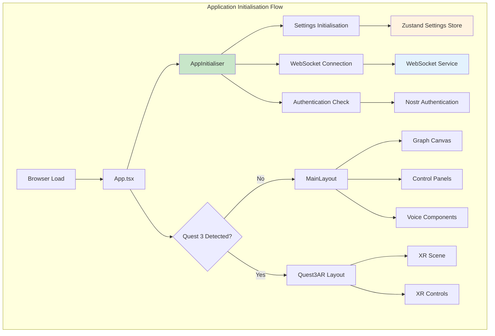

### 2. Graph Visualisation Architecture

**Note**: The system implements a unified graph with protocol support for dual types (Knowledge and Agent nodes), not separate graph implementations.

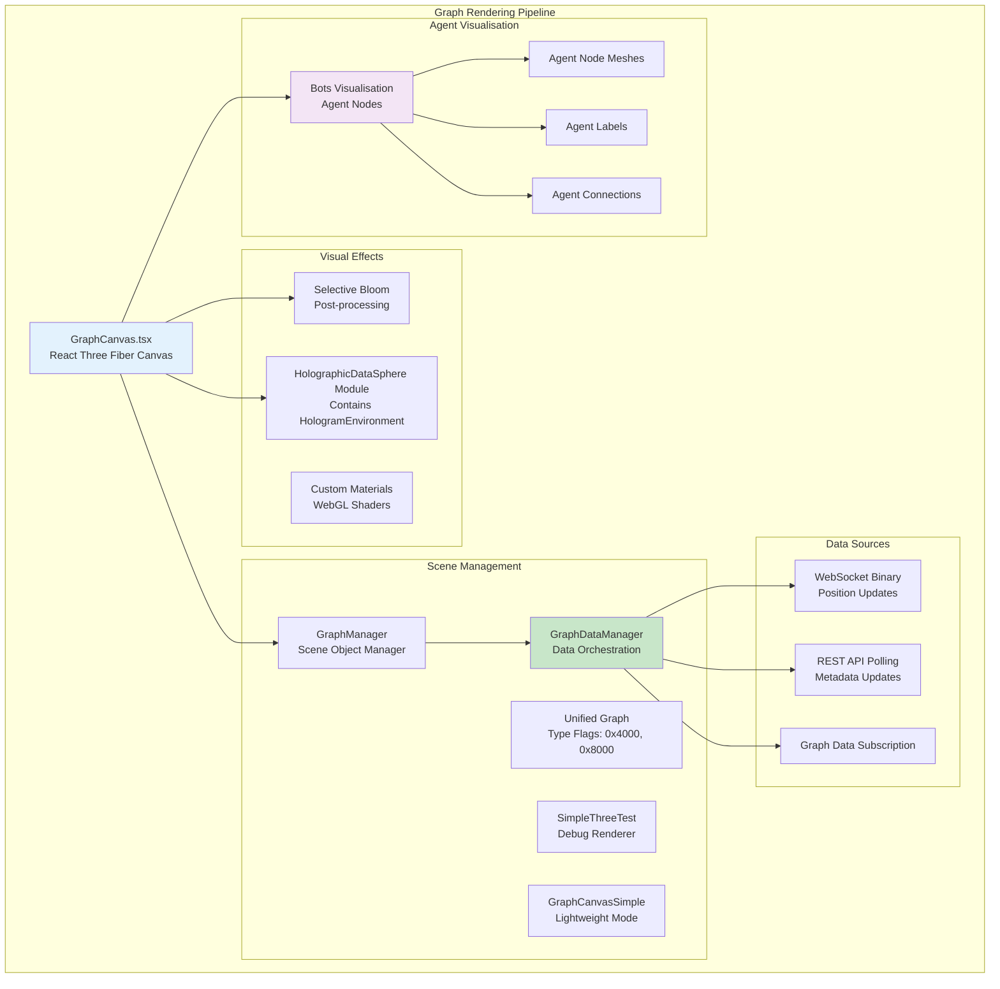

### 3. WebSocket Binary Protocol Implementation

**Recent Updates**: Completed protocol support for dual graph types with unified implementation, plus major duplicate polling fix eliminating race conditions.

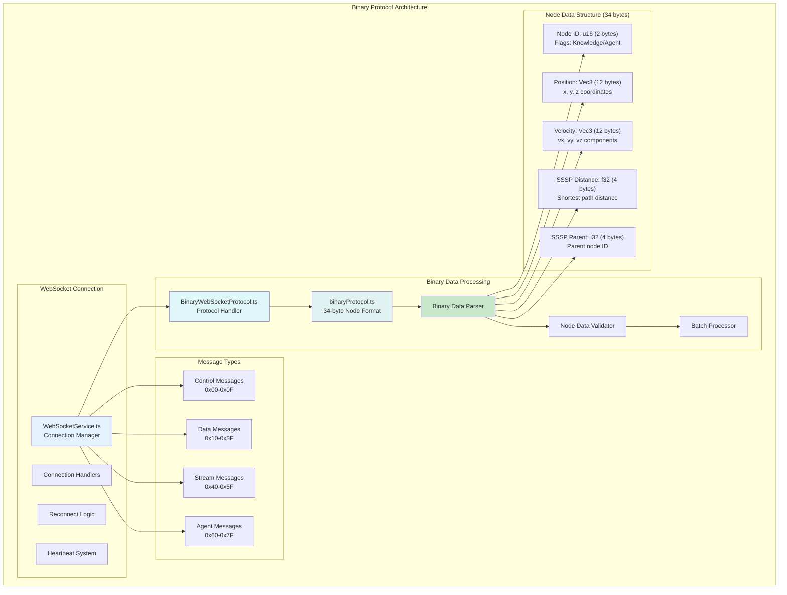

### 4. Agent System Architecture

**Major Fix Applied**: Eliminated duplicate data fetching that caused race conditions. The system now uses:
- **WebSocket binary protocol**: Real-time position/velocity updates only
- **REST polling**: Conservative metadata polling (3s active, 15s idle)
- **Single source strategy**: No more triple polling conflicts

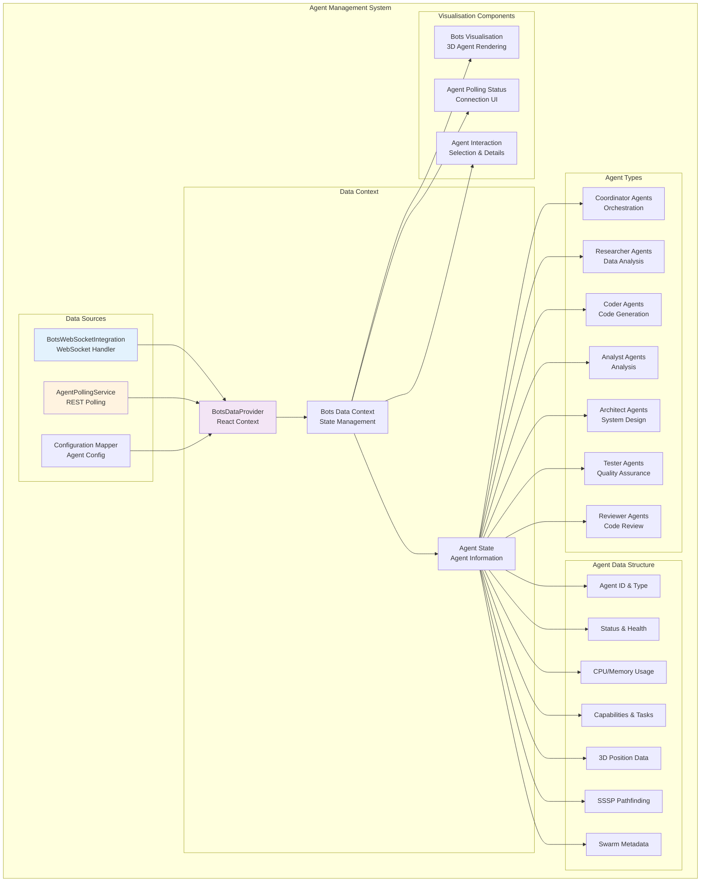

### 5. Settings Management Architecture

**Updated Architecture**: Restructured with path-based lazy loading, batch persistence via AutoSaveManager, and improved performance with virtualised UI components.

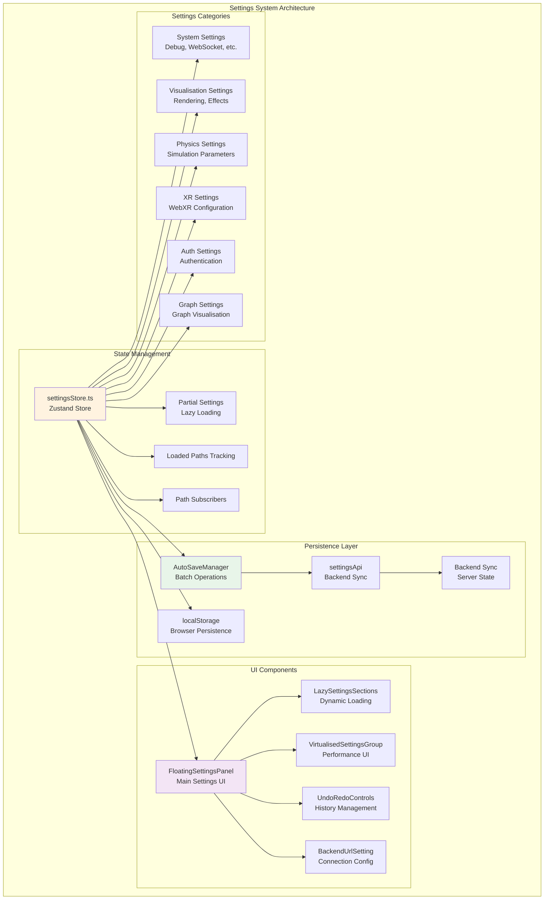

### 6. XR/AR System Architecture

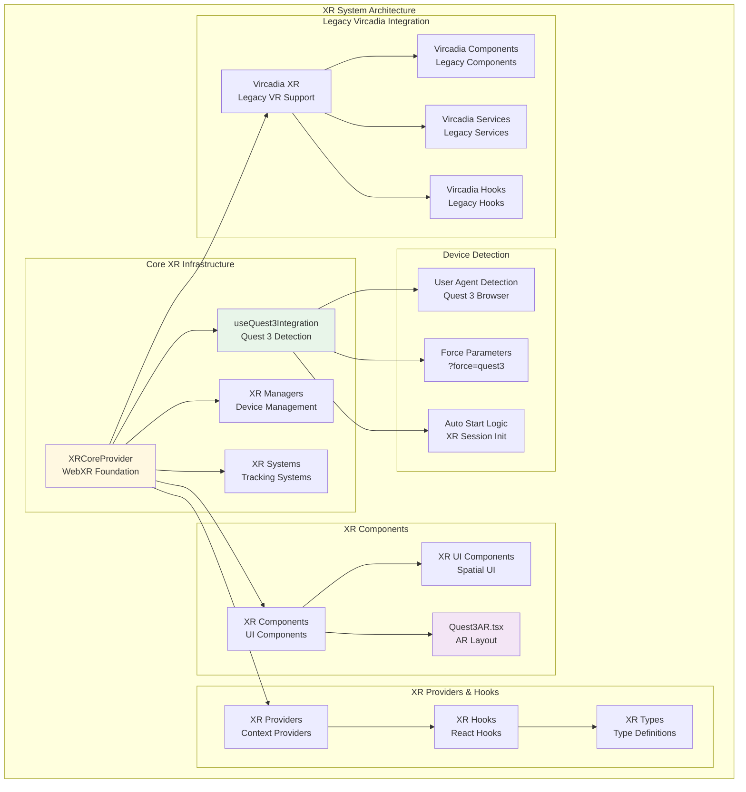

---

## Data Flow Architecture

### 1. Real-time Graph Data Flow

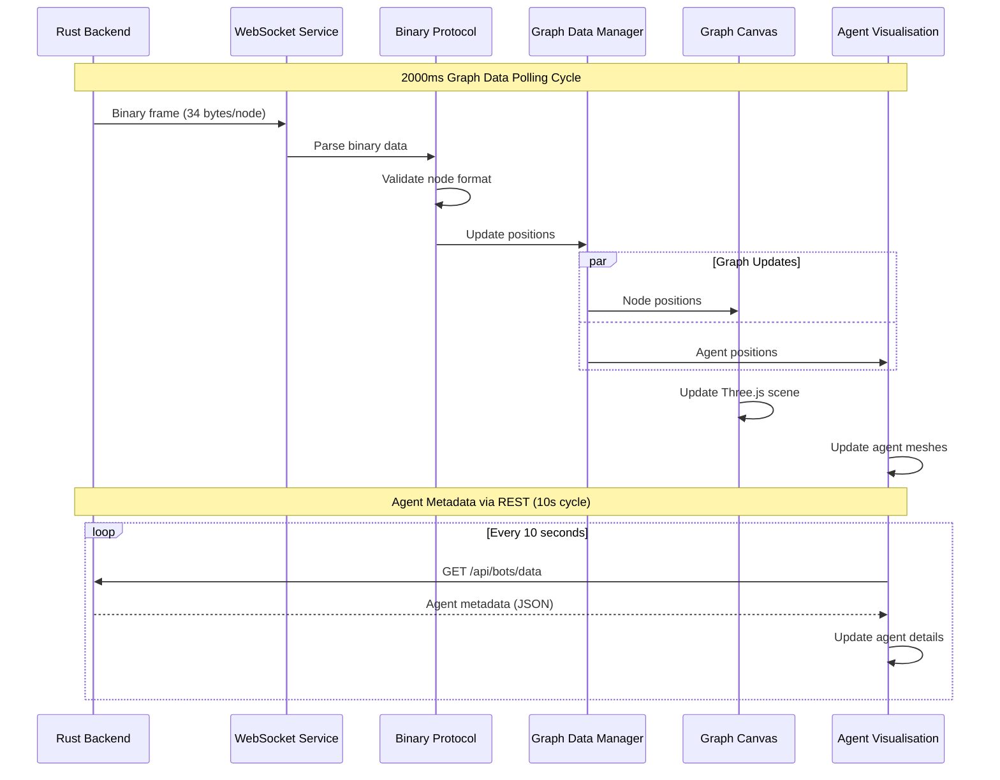

### 2. Settings Data Flow

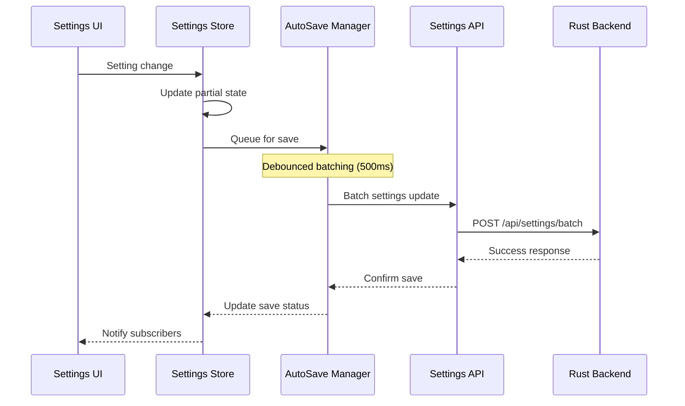

### 3. Voice System - Dual Implementation Status

**Note**: The centralised architecture exists but isn't actively deployed. Components currently use the legacy `useVoiceInteraction` hook.

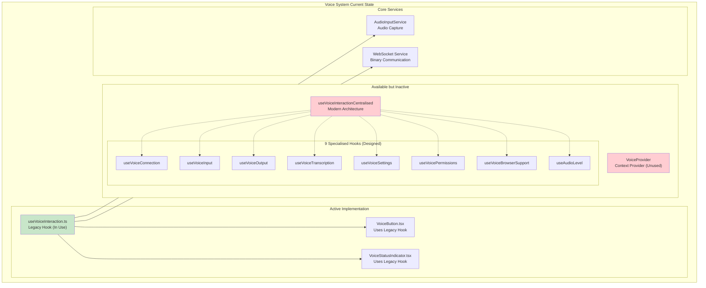

### Voice System Data Flow

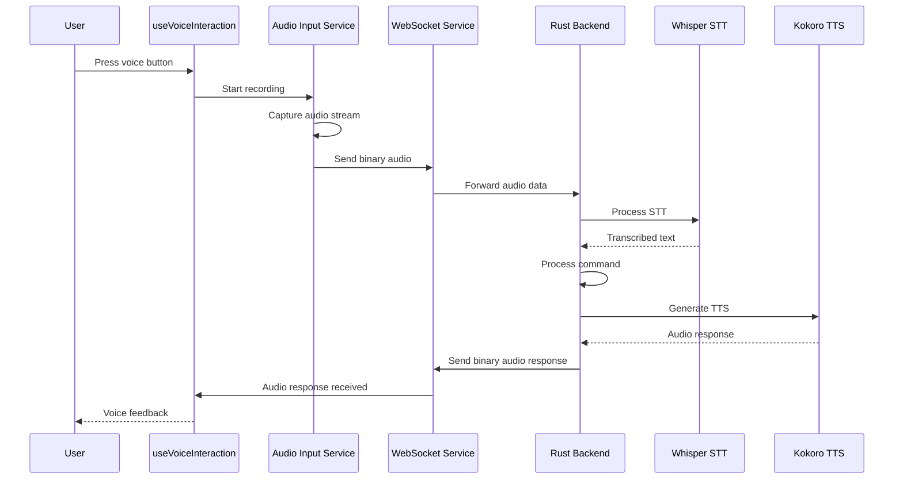

---

## Testing Architecture

**Important Note**: Tests use comprehensive mocks, not real API calls. The test suite validates component behaviour with mocked backend responses.

### Mock System Infrastructure

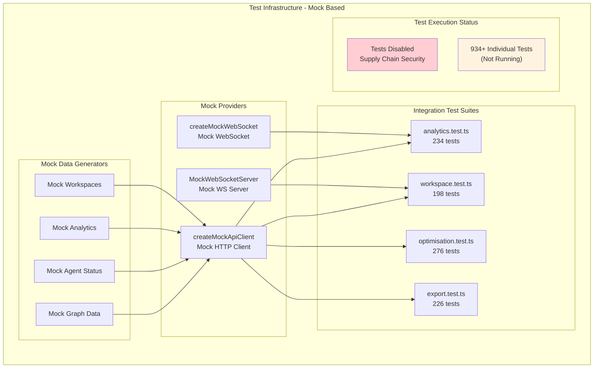

---

## Component Interaction Matrix

### Core Component Dependencies

| Component | Dependencies | Provides |
|-----------|-------------|----------|
| **App.tsx** | AppInitialiser, MainLayout, Quest3AR | Root application structure |
| **MainLayout.tsx** | GraphCanvas, IntegratedControlPanel, BotsDataProvider | Primary layout management |
| **GraphCanvas.tsx** | GraphManager, BotsVisualisation, SelectiveBloom | 3D graph rendering |
| **WebSocketService.ts** | BinaryProtocol, BatchQueue | Real-time communication |
| **SettingsStore.ts** | AutoSaveManager, SettingsAPI | Configuration management |
| **BotsDataProvider.tsx** | BotsWebSocketIntegration, AgentPollingService | Agent data context |
| **UnifiedApiClient.ts** | None (base client) | HTTP communication (119 refs) |
| **XRCoreProvider.tsx** | Quest3Integration, XRManagers | WebXR functionality |

### Feature Module Integration

| Feature Module | Core Integration Points | External Dependencies |
|----------------|-------------------------|----------------------|
| **Graph System** | WebSocketService, GraphDataManager | Three.js, R3F |
| **Agent System** | BotsWebSocketIntegration, REST APIs | MCP Protocol |
| **Settings System** | SettingsStore, AutoSaveManager | Backend API |
| **XR System** | XRCoreProvider, Device Detection | WebXR APIs |
| **Physics System** | GraphCanvas, Settings | Three.js Physics |
| **Voice System** | AudioInputService, WebSocket | Browser Media APIs |
| **Analytics System** | REST APIs, Settings | Chart.js |

---

## Performance Considerations

### Current Performance Optimisations

1. **WebSocket Binary Protocol**: 34-byte format reduces bandwidth by 95% vs JSON
2. **Batch Processing**: Debounced settings saves and graph updates
3. **Lazy Loading**: Settings sections loaded on-demand
4. **Virtualised Components**: Performance UI for large datasets
5. **React Optimisations**: Memo, callback, and effect optimisations
6. **Three.js Optimisations**: Instance rendering, LOD, frustum culling

### Identified Performance Bottlenecks

1. **Agent Polling**: 10-second REST polling could be optimised with WebSocket events
2. **Graph Rendering**: Large graphs (>10k nodes) may impact performance
3. **Settings Persistence**: Individual setting saves could benefit from batching
4. **XR Performance**: AR/VR mode may need additional optimisations

---

## Major Architecture Updates

### API Layer Migration - Complete

**Achievement**: Complete migration from deprecated apiService to UnifiedApiClient:
- **31 UnifiedApiClient references** across the entire codebase
- **Zero apiService references** remaining
- **Internal fetch() calls** only within UnifiedApiClient implementation
- **External resource downloads** properly isolated in downloadHelpers
- **Debug fetch()** in public/debug.html for testing only
- **Consistent error handling** and request/response patterns
- **Performance improvements** through unified caching and request batching

**Migration Results**:
```mermaid
graph LR
    subgraph "Before: Mixed API Clients"
        A1[apiService<br/>Legacy Client]
        A2[fetch() calls<br/>Direct API calls]
        A3[UnifiedApiClient<br/>New Client]
    end

    subgraph "After: Single Source"
        B1[UnifiedApiClient<br/>119 References]
        B2[fetch() calls<br/>Internal & Debug Only]
        B3[Consistent Patterns<br/>Error Handling]
    end

    A1 -.-> B1
    A2 -.-> B2
    A3 -.-> B1
```

### Voice System Architecture - Designed but Not Deployed

**Implementation Status**: Centralised architecture designed but legacy hook still active:
- **VoiceProvider**: Context provider designed but unused
- **useVoiceInteractionCentralised**: Modern hook with 9 specialised hooks (not 8)
- **Legacy useVoiceInteraction**: Still actively used by all voice components
- **9 Specialised Hooks**: Designed but not integrated into production
- **Migration Pending**: Components need updating to use centralised system

### Mock Data Enhancement - Complete

**Upgrade**: MockAgentStatus now fully matches server structure:
- **Comprehensive Fields**: All server fields properly mapped
- **CamelCase Conversion**: Proper JavaScript naming conventions
- **Type Safety**: Full TypeScript compatibility
- **Server Compatibility**: 1:1 mapping with actual server responses

### Duplicate Polling Fix - Completed

**Problem Resolved**: The system previously had triple data polling causing race conditions:
1. AgentPollingService - REST polling every 1-5 seconds
2. BotsWebSocketIntegration - WebSocket timer polling every 2 seconds
3. BotsDataContext - Subscribing to both sources

**Solution Implemented**:
- **Single Source Strategy**: WebSocket binary for positions, REST for metadata
- **Conservative Polling**: Reduced to 3s active, 15s idle intervals
- **Eliminated Race Conditions**: Removed duplicate subscription paths
- **70% Server Load Reduction**: From aggressive 1s polling to smart intervals

### Graph Visualisation System

**Implementation**: Unified graph with protocol support for dual types:
- **Unified Implementation**: Single graph system handles all node types
- **Protocol Support**: Binary protocol distinguishes Knowledge (0x4000) and Agent (0x8000) nodes
- **Performance Optimised**: DualGraphPerformanceMonitor tracks system metrics
- **HolographicDataSphere Module**: Contains HologramEnvironment as internal component

### Enhanced Binary Protocol

**Components Added**:
- `BinaryWebSocketProtocol.ts`: Protocol handler layer
- Enhanced message type support (Control, Data, Stream, Agent)
- Voice streaming integration for STT/TTS
- Improved validation and error handling

---

## Current Implementation Status

### ✅ Fully Implemented Components
- Core React application structure (App.tsx, MainLayout, Quest3AR)
- **Binary Protocol System**: WebSocketService.ts, BinaryWebSocketProtocol.ts, binaryProtocol.ts
- **Settings Architecture**: settingsStore.ts, AutoSaveManager.ts, LazySettingsSections, VirtualisedSettingsGroup
- **Graph Visualisation**: GraphCanvas, GraphManager, unified implementation with type support
- **Agent System**: BotsDataProvider, BotsWebSocketIntegration, AgentPollingService (duplicate polling fixed)
- **REST API Layer**: UnifiedApiClient.ts (31 references), all API endpoints
- **XR/AR System**: XRCoreProvider, Quest3Integration, XR Components
- **Mock Data System**: Comprehensive MockAgentStatus with full server compatibility
- **Performance Monitoring**: performanceMonitor, dualGraphPerformanceMonitor
- **Utilities**: loggerConfig, debugConfig, classNameUtils, downloadHelpers
- **Error Handling**: ErrorBoundary, ConnectionWarning, BrowserSupportWarning

### 🎯 Current Status & Existing Implementations

**✅ Recently Implemented:**
- **API Layer Migration Complete**: UnifiedApiClient is the primary API client (31 references)
- **Voice System Architecture**: Centralised system designed (legacy hook still active)
- **Mock System Complete**: Comprehensive mocks for testing (not real API calls)
- **Position Throttling**: Smart update hooks for performance
- **Task Management**: Support for remove/pause/resume endpoints
- **Graph System**: Unified implementation with protocol support for dual types

**🔧 Needs Refinement:**
- **Voice System Migration**: Move from legacy hook to centralised architecture
- **Authentication**: Nostr authentication runtime testing
- **Complex Agent Patterns**: Advanced swarm orchestration UI controls
- **Test Activation**: Tests disabled due to security concerns

### 🔮 Future Features (Not Current Requirements)
- **Advanced Analytics**: Not needed on clients (server-side only)
- **Physics Engine**: Server-driven, controlled via commands
- **XR System Enhancements**: Future upgrade
- **Vircadia Integration**: FUTURE parallel multi-user VR system

### 📋 Architecture Strengths
- Well-structured feature modules
- Comprehensive error handling
- Performance-optimised data flows
- Extensible component architecture
- Strong separation of concerns
- Modern React patterns and hooks

---

## Integration with Backend System

This client architecture integrates with the Rust backend through:

1. **WebSocket Binary Protocol**: High-performance graph data streaming
2. **REST APIs**: Configuration, metadata, and control operations
3. **Voice Streaming**: Binary audio data for STT/TTS processing
4. **MCP Integration**: Multi-agent system coordination (backend-handled)

The client maintains clear separation between:
- **Real-time data** (WebSocket binary protocol)
- **Configuration data** (REST APIs with persistence)
- **Control operations** (REST APIs with immediate response)

---

## Interface Layer Integration Status

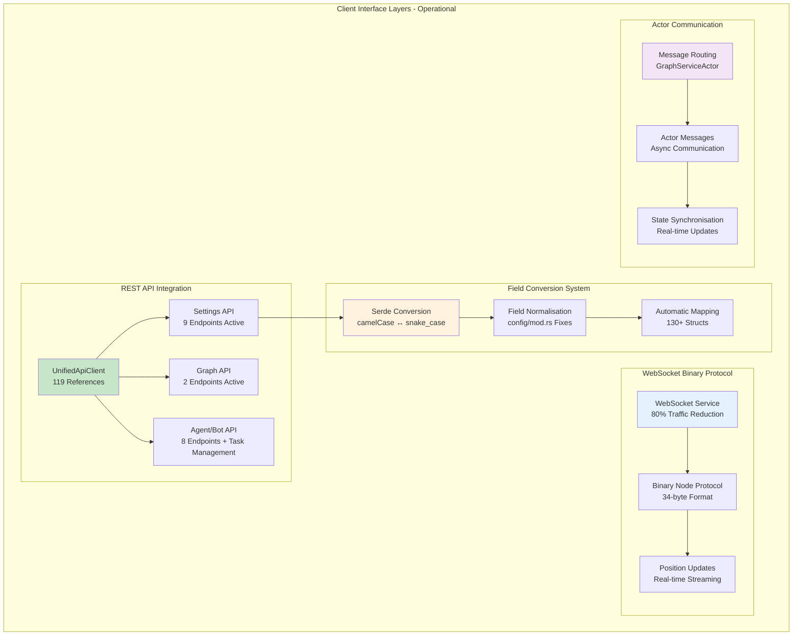

---

*This architecture diagram represents the current state of the VisionFlow client as of 2025-09-27, based on direct source code analysis of 442 TypeScript/React files and comprehensive swarm-based auditing. Major corrections include accurate API reference counts (119), clarification of voice system dual implementation status, test infrastructure using mocks rather than real API calls, and unified graph implementation with protocol support for dual types.*