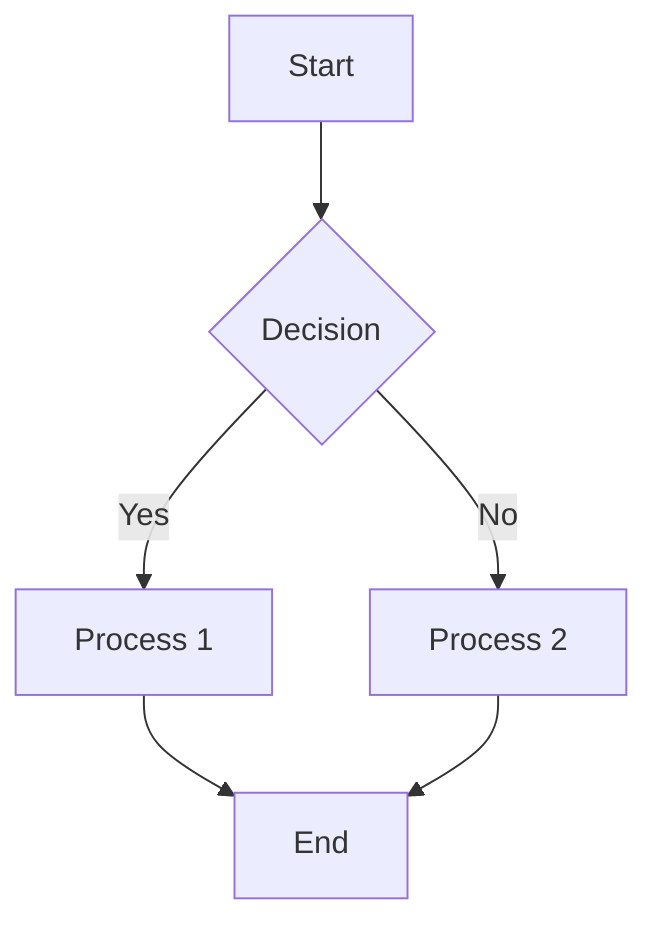
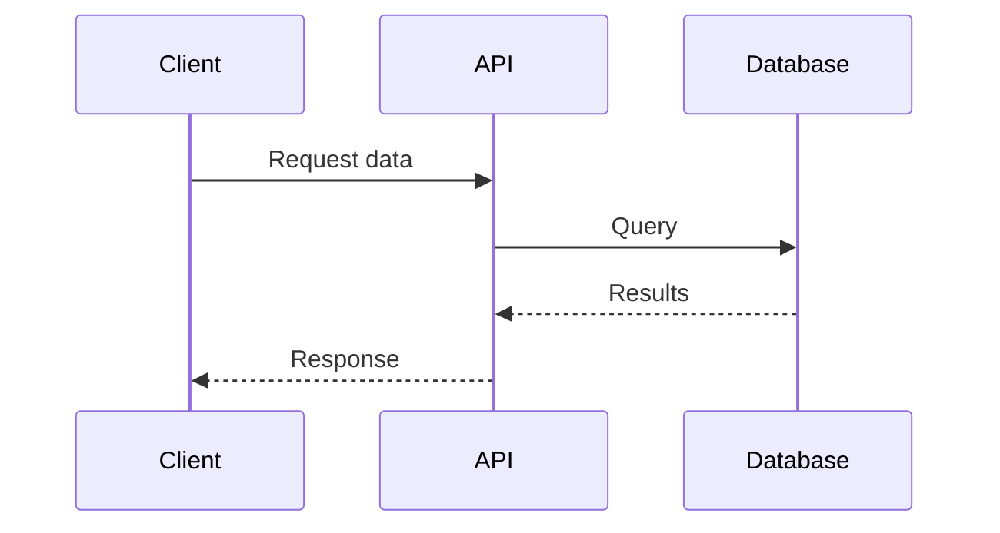
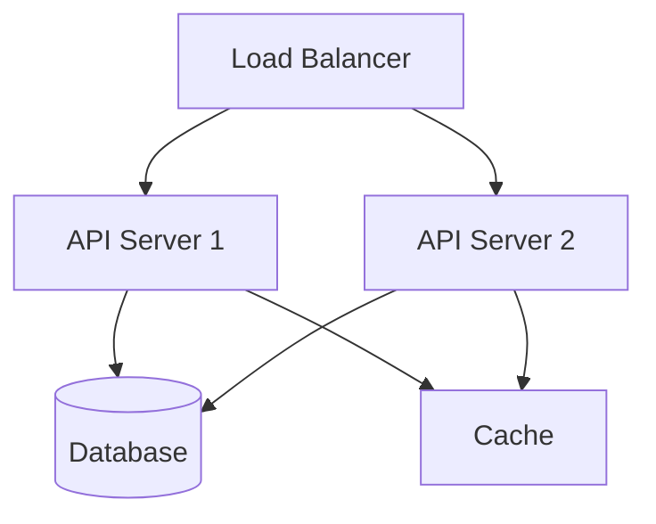
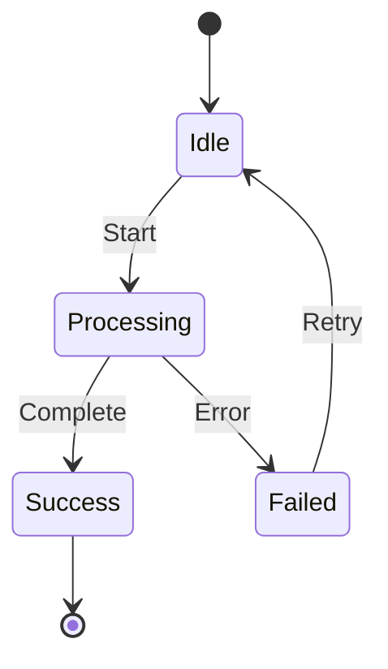

# Documentation Contribution Guide

Welcome to the unified documentation corpus. This guide helps you contribute high-quality documentation.

---

## Table of Contents

1. [Getting Started](#getting-started)
2. [Writing Standards](#writing-standards)
3. [Front Matter Requirements](#front-matter-requirements)
4. [Diagram Guidelines](#diagram-guidelines)
5. [Linking Standards](#linking-standards)
6. [Submission Process](#submission-process)

---

## Getting Started

### Prerequisites

- Git installed and configured
- Text editor with Markdown support
- Basic understanding of Markdown syntax
- Familiarity with Mermaid diagram syntax

### Setup

**1. Clone Repository**

```bash
git clone <repository-url>
cd project/docs
```

**2. Install Validation Tools**

```bash
# Make scripts executable
chmod +x scripts/*.sh

# Test validation
./scripts/validate-all.sh
```

**3. Review Existing Documentation**

Browse `INDEX.md` to understand current documentation structure and standards.

---

## Writing Standards

### Document Structure

Every document should follow this structure:

```markdown
---
title: "Document Title"
description: "Clear one-line description"
category: architecture|development|deployment|api|guides|reference
tags: [tag1, tag2, tag3]
version: 2.0.0
last_updated: 2025-12-18
---

# Document Title

Brief introduction paragraph.

---

## Table of Contents

1. [Section 1](#section-1)
2. [Section 2](#section-2)

---

## Section 1

Content...

### Subsection 1.1

Content...

---

## Section 2

Content...

---

*Last Updated: 2025-12-18*
*Version: 2.0.0*
```

### Writing Style

**Be Clear and Concise**

✅ Good:
```markdown
The system uses Redis for caching frequently accessed data.
```

❌ Avoid:
```markdown
The system architecture leverages Redis as a high-performance,
in-memory data structure store to cache frequently accessed data,
thereby reducing database load and improving response times.
```

**Use Active Voice**

✅ Good:
```markdown
Configure the API key in the environment file.
```

❌ Avoid:
```markdown
The API key should be configured in the environment file.
```

**Define Technical Terms**

```markdown
The system uses **idempotent** operations (operations that produce
the same result regardless of how many times they're executed).
```

### Code Examples

**Use Syntax Highlighting**

```markdown
```bash
npm install package-name
```
```

**Provide Context**

```markdown
Install the required dependencies:

```bash
npm install express dotenv
```

This command installs:
- `express`: Web framework
- `dotenv`: Environment variable management
```

**Show Complete Examples**

Include all necessary imports, configuration, and error handling.

---

## Front Matter Requirements

### Required Fields

All documents must include these fields:

```yaml
---
title: "Document Title"           # Clear, descriptive title
description: "One-line summary"   # Appears in search results
category: reference               # One of: architecture, development, deployment, api, guides, reference
tags: [tag1, tag2, tag3]         # 3-5 relevant tags
version: 2.0.0                    # Semantic version
last_updated: 2025-12-18          # ISO date format (YYYY-MM-DD)
---
```

### Optional Fields

```yaml
---
author: "Your Name"               # Original author
contributors: ["Name 1", "Name 2"] # Additional contributors
deprecated: false                  # Mark as deprecated
replacement: "../new-doc.md"       # Link to replacement doc
related: ["doc1.md", "doc2.md"]   # Related documents
---
```

### Category Guidelines

**architecture**
- System design documents
- Component architecture
- Integration patterns
- Technical decisions

**development**
- Setup guides
- Development workflows
- Testing strategies
- Debugging guides

**deployment**
- Deployment procedures
- Infrastructure setup
- CI/CD pipelines
- Environment configuration

**api**
- REST API documentation
- WebSocket API documentation
- MCP tool references
- API usage examples

**guides**
- Getting started guides
- How-to guides
- Tutorials
- Troubleshooting guides

**reference**
- CLI reference
- Configuration reference
- Glossary
- Cheat sheets

### Tag Guidelines

Use consistent, lowercase tags:

**Technology Tags**
- `docker`, `kubernetes`, `nvidia`, `cuda`, `gpu`
- `nodejs`, `python`, `rust`, `typescript`
- `redis`, `postgresql`, `mongodb`

**Function Tags**
- `deployment`, `configuration`, `setup`, `testing`
- `api`, `cli`, `ui`, `backend`, `frontend`
- `security`, `performance`, `monitoring`

**Type Tags**
- `guide`, `reference`, `tutorial`, `troubleshooting`
- `architecture`, `design`, `patterns`

---

## Diagram Guidelines

### Use Mermaid for All Diagrams

**Never use ASCII art.** All diagrams must use Mermaid syntax.

### Common Diagram Types

**Flowcharts**

```markdown

```

**Sequence Diagrams**

```markdown

```

**Architecture Diagrams**

```markdown

```

**State Diagrams**

```markdown

```

### Diagram Best Practices

1. **Keep diagrams simple** - Focus on key concepts
2. **Use consistent styling** - Maintain visual consistency
3. **Add labels** - Clearly label all nodes and edges
4. **Test syntax** - Validate at [mermaid.live](https://mermaid.live)
5. **Provide context** - Explain diagram before showing it

---

## Linking Standards

### Internal Links

**Use Relative Paths**

✅ Good:
```markdown
See [API Reference](./reference/api/rest-api.md)
```

❌ Avoid:
```markdown
See [API Reference](/docs/reference/api/rest-api.md)
```

**Link to Specific Sections**

```markdown
See [API Reference](./reference/api/rest-api.md#configuration)
```

**Verify Links Exist**

```bash
./scripts/validate-links.sh
```

### External Links

**Include Full URLs**

```markdown
See [Docker Documentation](https://docs.docker.com/)
```

**Use Descriptive Link Text**

✅ Good:
```markdown
Learn more in the [official Redis documentation](https://redis.io/docs/)
```

❌ Avoid:
```markdown
Click [here](https://redis.io/docs/) for documentation
```

### Cross-References

Link to related documents at the end of each section:

```markdown
---

**Related Documentation:**
- [API Reference](./reference/api/rest-api.md)
- [Configuration Guide](./how-to/operations/configuration.md)
- [Troubleshooting](./how-to/operations/troubleshooting.md)
```

---

## Submission Process

### Before Submitting

**1. Validate Your Changes**

```bash
# Run all validators
./scripts/validate-all.sh

# Check specific aspects
./scripts/validate-links.sh
./scripts/validate-frontmatter.sh
./scripts/validate-mermaid.sh
```

**2. Update Index**

```bash
./scripts/generate-index.sh
```

**3. Generate Reports**

```bash
./scripts/generate-reports.sh
```

**4. Review Changes**

```bash
git diff
```

### Commit Guidelines

**Use Conventional Commits**

```bash
# Documentation updates
git commit -m "docs: add deployment guide for Kubernetes"

# Fixes
git commit -m "fix(docs): correct broken links in API reference"

# Updates
git commit -m "docs: update front matter validation script"
```

**Commit Message Format**

```
<type>(<scope>): <subject>

<body>

<footer>
```

**Types:**
- `docs`: Documentation changes
- `fix`: Bug fixes in documentation
- `feat`: New documentation features
- `chore`: Maintenance tasks

### Pull Request Process

**1. Create Feature Branch**

```bash
git checkout -b docs/your-feature-name
```

**2. Make Changes**

Follow all guidelines in this document.

**3. Commit Changes**

```bash
git add .
git commit -m "docs: your commit message"
```

**4. Push to Remote**

```bash
git push origin docs/your-feature-name
```

**5. Create Pull Request**

- Use descriptive title
- Reference related issues
- Include validation results
- Request review from maintainers

### Pull Request Template

```markdown
## Description

Brief description of changes.

## Changes Made

- [ ] Added new documentation
- [ ] Updated existing documentation
- [ ] Fixed broken links
- [ ] Updated diagrams
- [ ] Updated front matter

## Validation

```bash
./scripts/validate-all.sh
```

Results: All checks passed ✅

## Related Issues

Closes #123

## Checklist

- [ ] Front matter complete and valid
- [ ] All links validated
- [ ] Mermaid diagrams tested
- [ ] No ASCII art diagrams
- [ ] Cross-references added
- [ ] INDEX.md updated
- [ ] Validation passed
```

---

## Review Process

### Reviewer Checklist

Reviewers will check:

- [ ] Front matter complete and valid
- [ ] Clear, concise writing
- [ ] Proper Markdown formatting
- [ ] Mermaid diagrams (no ASCII art)
- [ ] All links valid and working
- [ ] Appropriate tags and category
- [ ] Cross-references to related docs
- [ ] Code examples complete and tested
- [ ] Validation scripts pass
- [ ] INDEX.md updated

### Feedback Implementation

1. Address all reviewer comments
2. Re-run validation scripts
3. Push updates to PR branch
4. Request re-review

---

## Getting Help

### Resources

- [Markdown Guide](https://www.markdownguide.org/)
- [Mermaid Documentation](https://mermaid.js.org/)
- [Conventional Commits](https://www.conventionalcommits.org/)

### Support

- Review [MAINTENANCE.md](./how-to/operations/maintenance.md)
- Check existing documentation in [INDEX.md](./reference/INDEX.md)
- Open an issue for questions
- Contact documentation maintainers

---

## Best Practices Summary

✅ **Do:**
- Write clear, concise documentation
- Use Mermaid for all diagrams
- Include complete front matter
- Add cross-references
- Validate before submitting
- Use relative links
- Provide code examples
- Follow commit conventions

❌ **Don't:**
- Use ASCII art diagrams
- Use absolute paths for internal links
- Submit without validation
- Create orphaned documents
- Use vague link text
- Omit front matter fields
- Write overly long documents
- Leave broken links

---

*Last Updated: 2025-12-18*
*Version: 2.0.0*
