# VisionFlow Documentation Migration Plan

**Comprehensive Strategy for gh-pages Web Documentation System**

---

## 1. Executive Summary

### Scope Assessment

VisionFlow possesses a **mature, well-organised documentation corpus** with **398 markdown files** (323 active, 75 archived), already structured according to the **Diataxis Framework**. The existing documentation includes:

- **Comprehensive CI/CD pipeline** - Two GitHub Actions workflows for validation
- **Validation scripts** - 18 shell/Python scripts for link, frontmatter, Mermaid, and spelling validation
- **YAML frontmatter standardisation** - 345 files with `category` field
- **Mermaid diagram adoption** - 430 instances across 91 files (ASCII diagrams deprecated)

### Migration Complexity

| Factor | Assessment | Notes |
|--------|------------|-------|
| **Corpus Size** | Large (398 files, ~228 primary) | Well below 100MB threshold |
| **Structure Maturity** | High | Diataxis-compliant, clean hierarchy |
| **Existing Automation** | Advanced | CI/CD, validation scripts present |
| **Link Health** | 98% | Per existing metrics |
| **Diagram Format** | 100% Mermaid | ASCII deprecated |
| **Frontmatter Coverage** | ~95% | Category field present |

### Effort Classification

| Phase | Relative Effort | Risk |
|-------|-----------------|------|
| Static Site Generator Setup | Medium | Low |
| Content Migration | Low-Medium | Low |
| Navigation/Search Implementation | Medium | Medium |
| CI/CD Integration | Low | Low |
| Multi-Version Support | High | Medium |
| Mobile Responsiveness | Low | Low |

**Overall Assessment**: Migration is **LOW-MEDIUM complexity** due to existing infrastructure maturity. Primary effort lies in static site generator configuration and navigation design.

---

## 2. Current State Inventory

### 2.1 Documentation File Distribution

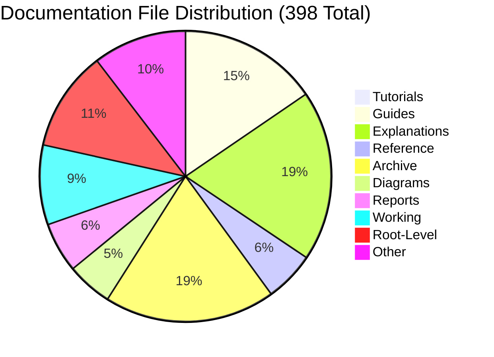

### 2.2 Complete Directory Structure

| Directory | Files | Purpose | Migration Priority |
|-----------|-------|---------|-------------------|
| `/docs/tutorials/` | 3 | Learning-oriented guides | Critical |
| `/docs/guides/` | 61 | Task-oriented how-to | Critical |
| `/docs/explanations/` | 75 | Architecture deep-dives | Critical |
| `/docs/reference/` | 22 | API/schema specifications | Critical |
| `/docs/concepts/` | 2 | Core concepts | High |
| `/docs/architecture/` | 10 | Architecture docs (overlap with explanations) | Medium |
| `/docs/diagrams/` | 20 | Mermaid diagram collections | High |
| `/docs/audits/` | 4 | Migration audits | Low |
| `/docs/reports/` | 22 | Quality/validation reports | Low |
| `/docs/working/` | 35 | Work-in-progress | Exclude |
| `/docs/archive/` | 75 | Historical/deprecated | Exclude (archive separately) |
| `/docs/scripts/` | 26 | Automation scripts | Internal only |
| `/docs/assets/` | 4 dirs | Images, diagrams | High |
| `/docs/analysis/` | 3 | Technical analysis | Low |
| `/docs/research/` | 3 | Research documents | Low |
| `/docs/multi-agent-docker/` | ~15 | Docker-specific docs | Medium |
| Root `/docs/*.md` | 44 | Index, overview, status | Critical |

### 2.3 Primary Navigation Documents

| Document | Role | Lines |
|----------|------|-------|
| `README.md` | Master index, quickstart | 778 |
| `INDEX.md` | Complete searchable index | 665 |
| `NAVIGATION.md` | Navigation guide | 637 |
| `OVERVIEW.md` | What is VisionFlow | ~200 |
| `ARCHITECTURE_OVERVIEW.md` | Technical architecture | ~400 |
| `DEVELOPER_JOURNEY.md` | Onboarding path | ~300 |
| `TECHNOLOGY_CHOICES.md` | Tech stack rationale | ~200 |

### 2.4 Diataxis Framework Compliance

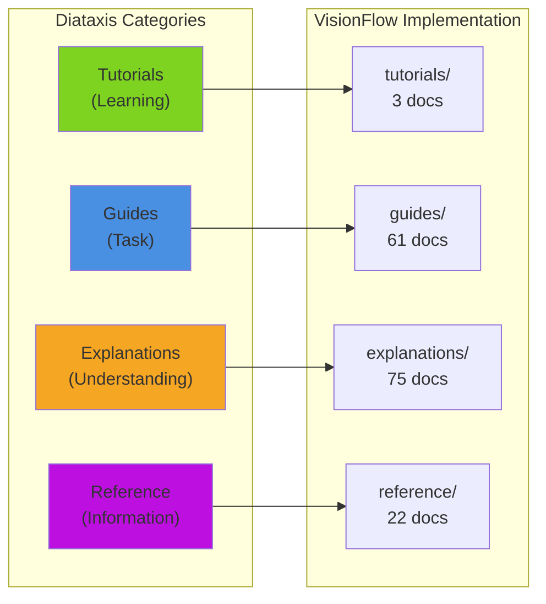

### 2.5 Existing Validation Infrastructure

**GitHub Actions Workflows:**

1. `/home/devuser/workspace/project/.github/workflows/docs-ci.yml` - Primary validation
2. `/home/devuser/workspace/project/docs/.github/workflows/docs-ci.yml` - Extended CI/CD with gh-pages deployment stub

**Validation Scripts (18 total):**

| Script | Purpose |
|--------|---------|
| `validate-links.sh` | Internal link validation |
| `validate-frontmatter.sh` | YAML frontmatter compliance |
| `validate-mermaid.sh` | Mermaid diagram syntax |
| `detect-ascii.sh` | ASCII diagram detection (deprecated) |
| `validate-spelling.sh` | UK English spelling |
| `validate-structure.sh` | Directory structure |
| `validate-coverage.sh` | Documentation coverage |
| `validate-all.sh` | Full validation suite |
| `generate-reports.sh` | Quality reports |
| `generate-index.sh` | Auto-generate index |
| `diataxis-migration.sh` | Diataxis compliance |
| `find-orphaned-files.sh` | Orphan detection |

### 2.6 Link and Diagram Health

| Metric | Current Value | Target |
|--------|---------------|--------|
| Internal Link Health | 98% | 100% |
| Mermaid Diagrams | 430 instances / 91 files | Maintain |
| ASCII Diagrams | Deprecated (per audit) | 0 |
| Frontmatter Coverage | ~95% (345 files) | 100% |
| Broken External Links | Unknown | < 5% |

### 2.7 Content Dependencies Map

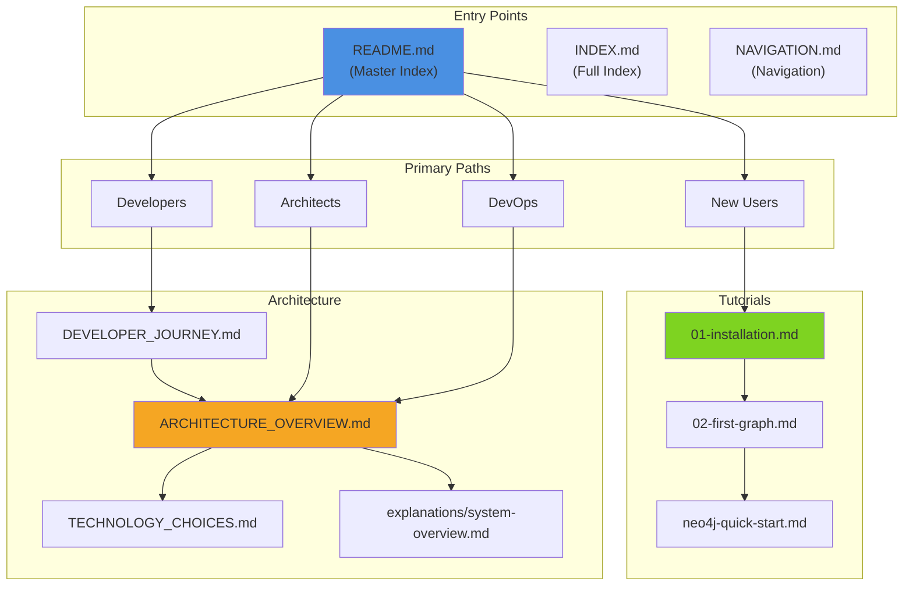

---

## 3. Target Architecture - gh-pages

### 3.1 Static Site Generator Recommendation

**Recommended: Jekyll with Just the Docs Theme**

| Generator | Pros | Cons | Recommendation |
|-----------|------|------|----------------|
| **Jekyll** | Native gh-pages support, mature, minimal config | Ruby dependency | **Primary choice** |
| **MkDocs** | Python-based, Material theme excellent | Requires Actions for deploy | Secondary option |
| **Docusaurus** | React-based, versioning built-in | Heavy, complex setup | Overkill |
| **Hugo** | Fastest builds | Less gh-pages native | Alternative |

**Rationale for Jekyll:**
1. **Zero-config gh-pages deployment** - Native GitHub Pages support
2. **Just the Docs theme** - Excellent navigation, search, mobile
3. **Mermaid native support** - Plugin available
4. **Minimal learning curve** - Existing markdown works as-is
5. **Existing CI/CD compatible** - Enhance rather than replace

### 3.2 Proposed Site Structure

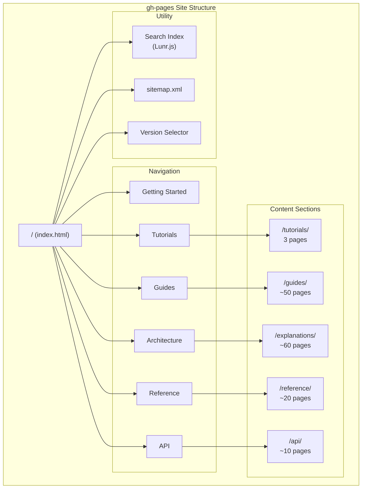

### 3.3 Jekyll Configuration

**`_config.yml` (proposed):**

```yaml
title: VisionFlow Documentation
description: Enterprise-grade multi-agent knowledge graphing system
baseurl: "/VisionFlow"
url: "https://dreamlab-ai.github.io"

theme: just-the-docs

# Mermaid support
mermaid:
  version: "10.6.0"

# Search
search_enabled: true
search:
  heading_level: 3
  previews: 3
  preview_words_before: 5
  preview_words_after: 10
  tokenizer_separator: /[\s/]+/

# Navigation
nav_sort: case_insensitive

# Collections
collections:
  tutorials:
    output: true
    permalink: /tutorials/:name/
  guides:
    output: true
    permalink: /guides/:path/
  explanations:
    output: true
    permalink: /explanations/:path/
  reference:
    output: true
    permalink: /reference/:path/

# Defaults
defaults:
  - scope:
      path: ""
      type: "tutorials"
    values:
      layout: "default"
      nav_order: 1
  - scope:
      path: ""
      type: "guides"
    values:
      layout: "default"
      nav_order: 2
```

### 3.4 Directory Mapping

| Source Directory | Target URL | Collection |
|------------------|------------|------------|
| `docs/tutorials/` | `/tutorials/` | `_tutorials` |
| `docs/guides/` | `/guides/` | `_guides` |
| `docs/guides/developer/` | `/guides/developer/` | Nested |
| `docs/guides/features/` | `/guides/features/` | Nested |
| `docs/guides/infrastructure/` | `/guides/infrastructure/` | Nested |
| `docs/explanations/` | `/explanations/` | `_explanations` |
| `docs/explanations/architecture/` | `/explanations/architecture/` | Nested |
| `docs/explanations/ontology/` | `/explanations/ontology/` | Nested |
| `docs/reference/` | `/reference/` | `_reference` |
| `docs/reference/api/` | `/api/` | Dedicated section |
| `docs/reference/database/` | `/reference/database/` | Nested |
| `docs/diagrams/` | Assets only | Embedded in pages |

### 3.5 Search Implementation

**Lunr.js client-side search (Just the Docs default):**

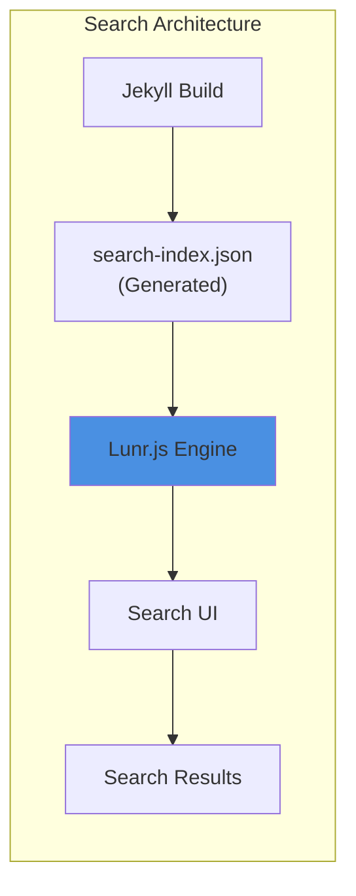

**Features:**
- Full-text search across all content
- Heading-level indexing (h1-h3)
- Preview snippets
- Real-time filtering
- No server required

### 3.6 Mobile Responsiveness

Just the Docs theme provides:
- Responsive navigation sidebar
- Collapsible mobile menu
- Touch-friendly interactions
- Readable typography at all sizes
- No additional configuration required

---

## 4. Migration Strategy

### 4.1 Phased Approach

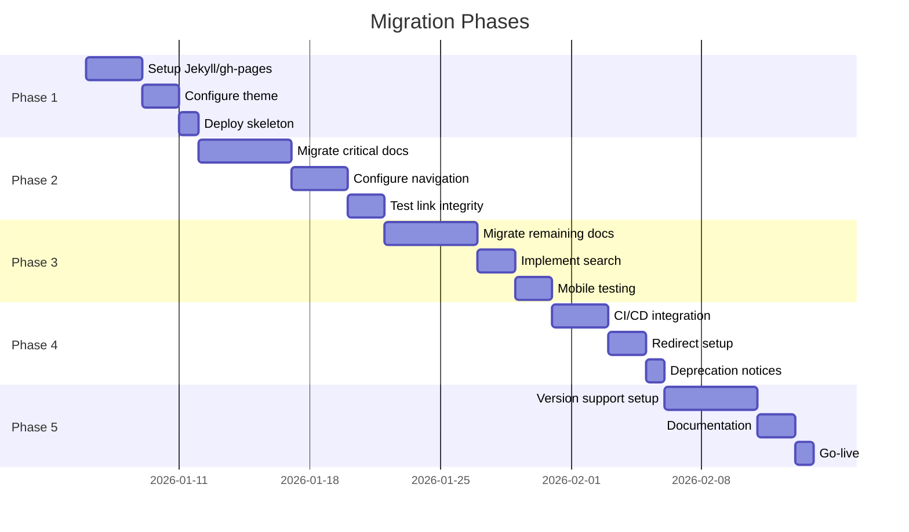

### 4.2 Phase 1: Infrastructure Setup

**Tasks:**
1. Create `gh-pages` branch
2. Install Jekyll with Just the Docs theme
3. Configure `_config.yml`
4. Setup Mermaid plugin
5. Deploy empty skeleton to verify pipeline

**Deliverables:**
- Working gh-pages deployment
- Accessible at `https://dreamlab-ai.github.io/VisionFlow/`

### 4.3 Phase 2: Critical Path Migration

**Priority Documents (46 files):**

| Category | Files | Priority |
|----------|-------|----------|
| Entry points | README.md, INDEX.md, OVERVIEW.md | P0 |
| Architecture | ARCHITECTURE_OVERVIEW.md, DEVELOPER_JOURNEY.md, TECHNOLOGY_CHOICES.md | P0 |
| Tutorials | All 3 files | P0 |
| Core guides | navigation-guide.md, configuration.md, troubleshooting.md | P1 |
| API reference | rest-api-complete.md, websocket-protocol.md | P1 |
| Database | schemas.md | P1 |

**Migration Actions:**
1. Copy files to Jekyll collections
2. Update frontmatter for Jekyll
3. Fix internal links to new structure
4. Configure navigation hierarchy
5. Verify Mermaid rendering

### 4.4 Phase 3: Complete Content Migration

**Remaining Documents (~200 files):**

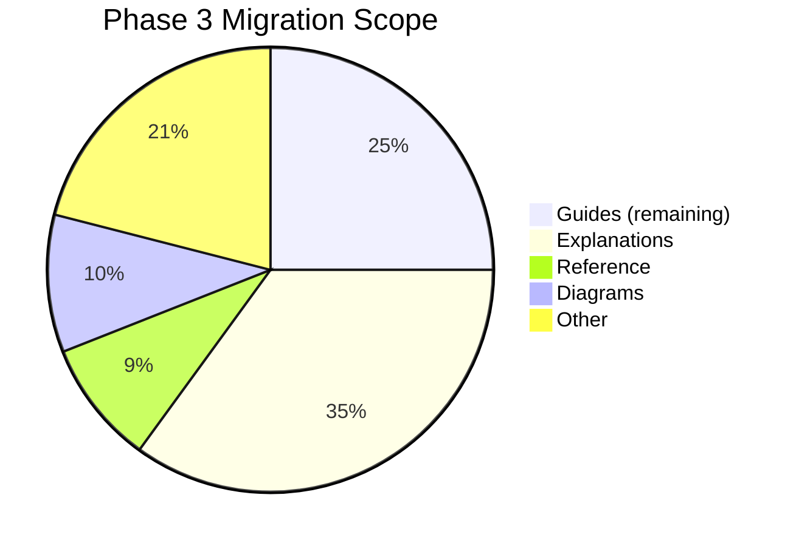

**Actions:**
1. Batch migrate by directory
2. Run link validation after each batch
3. Generate navigation files
4. Configure search indexing
5. Mobile responsiveness testing

### 4.5 Phase 4: CI/CD Integration

**Enhanced Workflow:**

```yaml
name: Documentation Deployment

on:
  push:
    branches: [main]
    paths:
      - 'docs/**'
  pull_request:
    branches: [main]
    paths:
      - 'docs/**'

jobs:
  validate:
    # Existing validation (links, frontmatter, mermaid)

  build:
    needs: validate
    runs-on: ubuntu-latest
    steps:
      - uses: actions/checkout@v4
      - uses: ruby/setup-ruby@v1
        with:
          ruby-version: '3.2'
          bundler-cache: true
      - run: bundle exec jekyll build
      - uses: actions/upload-pages-artifact@v3
        with:
          path: _site

  deploy:
    needs: build
    if: github.ref == 'refs/heads/main'
    permissions:
      pages: write
      id-token: write
    environment:
      name: github-pages
      url: ${{ steps.deployment.outputs.page_url }}
    runs-on: ubuntu-latest
    steps:
      - uses: actions/deploy-pages@v4
        id: deployment
```

### 4.6 Phase 5: Multi-Version Support

**Strategy: mike (MkDocs) or manual Jekyll versioning**

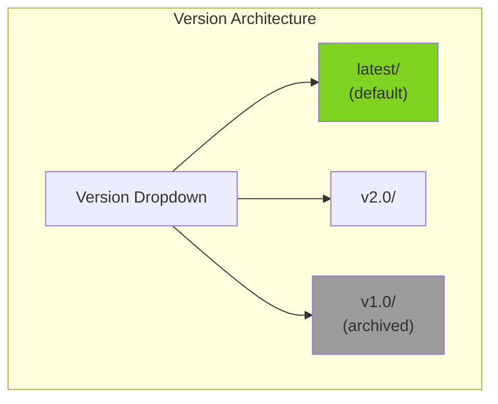

**Implementation:**
1. Branch-based versioning (docs-v1, docs-v2)
2. Build multiple versions to subdirectories
3. Add version selector to navigation
4. Redirect `/` to `/latest/`

---

## 5. Mermaid Diagram Conversion

### 5.1 Current State

| Metric | Value |
|--------|-------|
| Mermaid instances | 430 |
| Files with Mermaid | 91 |
| ASCII diagrams | Deprecated (audit complete) |

### 5.2 Diagram Conversion Requirements

**No conversion required** - All diagrams already use Mermaid.

**Validation checklist:**
- [x] ASCII diagram audit completed
- [x] ASCII deprecated and archived
- [x] Mermaid validation script exists
- [x] CI/CD validates Mermaid syntax

### 5.3 Mermaid Configuration for Jekyll

**Add to `_config.yml`:**

```yaml
mermaid:
  version: "10.6.0"
```

**Add to `_includes/head_custom.html`:**

```html
<script type="module">
  import mermaid from 'https://cdn.jsdelivr.net/npm/mermaid@10/dist/mermaid.esm.min.mjs';
  mermaid.initialize({ startOnLoad: true, theme: 'default' });
</script>
```

---

## 6. Navigation Design

### 6.1 Primary Navigation Structure

```mermaid
graph TB
    subgraph "Top-Level Navigation"
        HOME["Home"]
        START["Getting Started"]
        TUTORIALS["Tutorials"]
        GUIDES["Guides"]
        ARCH["Architecture"]
        REF["Reference"]
        API["API"]
    end

    subgraph "Getting Started"
        S1["Overview"]
        S2["Installation"]
        S3["First Graph"]
        S4["Configuration"]
    end

    subgraph "Guides Submenu"
        G1["Core Features"]
        G2["Developer"]
        G3["Infrastructure"]
        G4["AI Agents"]
        G5["Ontology"]
        G6["XR/VR"]
    end

    subgraph "Architecture Submenu"
        A1["System Overview"]
        A2["Hexagonal CQRS"]
        A3["Database"]
        A4["GPU/Physics"]
        A5["Ports"]
    end

    subgraph "Reference Submenu"
        R1["API Reference"]
        R2["Database Schemas"]
        R3["Protocols"]
        R4["Error Codes"]
    end

    HOME --> START
    HOME --> TUTORIALS
    HOME --> GUIDES
    HOME --> ARCH
    HOME --> REF
    HOME --> API

    START --> S1
    START --> S2
    START --> S3
    START --> S4

    GUIDES --> G1
    GUIDES --> G2
    GUIDES --> G3
    GUIDES --> G4
    GUIDES --> G5
    GUIDES --> G6

    ARCH --> A1
    ARCH --> A2
    ARCH --> A3
    ARCH --> A4
    ARCH --> A5

    REF --> R1
    REF --> R2
    REF --> R3
    REF --> R4

    style HOME fill:#4A90E2
    style TUTORIALS fill:#7ED321
    style GUIDES fill:#F5A623
    style ARCH fill:#BD10E0
    style REF fill:#50E3C2
```

### 6.2 Jekyll Navigation Configuration

**`_data/navigation.yml`:**

```yaml
main:
  - title: Home
    url: /
  - title: Getting Started
    url: /getting-started/
    children:
      - title: Overview
        url: /getting-started/overview/
      - title: Installation
        url: /tutorials/installation/
      - title: First Graph
        url: /tutorials/first-graph/
      - title: Configuration
        url: /guides/configuration/
  - title: Tutorials
    url: /tutorials/
    children:
      - title: Installation
        url: /tutorials/installation/
      - title: First Graph
        url: /tutorials/first-graph/
      - title: Neo4j Quick Start
        url: /tutorials/neo4j-quick-start/
  - title: Guides
    url: /guides/
    children:
      - title: Core Features
        url: /guides/features/
      - title: Developer
        url: /guides/developer/
      - title: Infrastructure
        url: /guides/infrastructure/
      - title: AI Agents
        url: /guides/agents/
      - title: Ontology
        url: /guides/ontology/
      - title: XR/VR
        url: /guides/xr/
  - title: Architecture
    url: /explanations/
    children:
      - title: System Overview
        url: /explanations/system-overview/
      - title: Hexagonal CQRS
        url: /explanations/architecture/hexagonal-cqrs/
      - title: Database
        url: /explanations/architecture/database-architecture/
      - title: GPU Physics
        url: /explanations/architecture/gpu-semantic-forces/
      - title: Ports
        url: /explanations/architecture/ports/
  - title: Reference
    url: /reference/
    children:
      - title: API Reference
        url: /reference/api/
      - title: Database Schemas
        url: /reference/database/
      - title: Protocols
        url: /reference/protocols/
      - title: Error Codes
        url: /reference/error-codes/
  - title: API
    url: /api/
```

### 6.3 Role-Based Landing Pages

| Role | Landing Page | Primary Path |
|------|--------------|--------------|
| New Users | `/getting-started/` | Overview -> Installation -> First Graph |
| Developers | `/developer-journey/` | Setup -> Structure -> Adding Features |
| Architects | `/architecture/` | Overview -> Hexagonal -> Data Flow |
| DevOps | `/deployment/` | Deployment -> Docker -> Operations |

---

## 7. Deprecation Plan

### 7.1 Transition Timeline

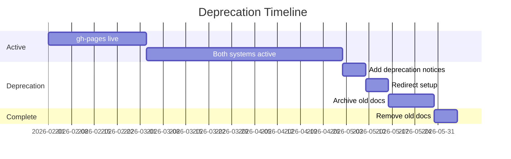

### 7.2 Deprecation Notices

**Add to every markdown file in old location:**

```markdown
> **DEPRECATED**: This documentation has moved to
> [VisionFlow Documentation](https://dreamlab-ai.github.io/VisionFlow/).
> This page will be removed on [DATE].
```

### 7.3 Redirect Strategy

**Option 1: Client-side redirect (simple)**

```html
<!-- old-docs/index.html -->
<meta http-equiv="refresh" content="0; url=https://dreamlab-ai.github.io/VisionFlow/">
```

**Option 2: Jekyll redirect plugin**

```yaml
# In deprecated file frontmatter
redirect_to: https://dreamlab-ai.github.io/VisionFlow/new-path/
```

### 7.4 Archive Management

| Content Type | Action |
|--------------|--------|
| `/docs/archive/` | Move to separate archive branch |
| `/docs/working/` | Exclude from gh-pages entirely |
| `/docs/reports/` | Keep internally, exclude from public site |
| Deprecated patterns | Archive in `docs-archive` branch |

---

## 8. Effort Estimation

### 8.1 Relative Effort by Category

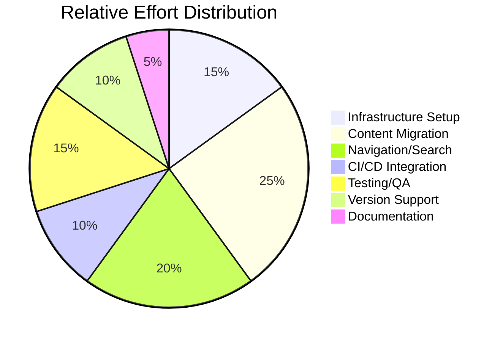

### 8.2 Effort Matrix

| Task | Effort | Dependencies | Skills Required |
|------|--------|--------------|-----------------|
| Jekyll setup | Low | None | DevOps, Ruby basics |
| Theme configuration | Low | Jekyll | YAML, CSS |
| gh-pages deployment | Low | Jekyll | GitHub Actions |
| Critical docs migration | Medium | Deployment | Markdown, links |
| Navigation config | Medium | Migration | YAML, IA |
| Search implementation | Low | Theme | Built-in |
| Full content migration | Medium | Navigation | Batch scripting |
| Link validation | Low | Migration | Existing scripts |
| Mermaid configuration | Low | Jekyll | JavaScript |
| CI/CD enhancement | Low | Existing workflow | GitHub Actions |
| Mobile testing | Low | Deployment | Browser testing |
| Version support | High | All above | Branch management |
| Redirect setup | Low | Version support | HTML/YAML |
| Documentation | Low | All above | Technical writing |

### 8.3 Risk-Adjusted Effort

| Phase | Base Effort | Risk Multiplier | Adjusted Effort |
|-------|-------------|-----------------|-----------------|
| Phase 1 (Setup) | Low | 1.0x | Low |
| Phase 2 (Critical) | Medium | 1.2x | Medium |
| Phase 3 (Complete) | Medium | 1.1x | Medium |
| Phase 4 (CI/CD) | Low | 1.0x | Low |
| Phase 5 (Versioning) | High | 1.5x | High |

---

## 9. Risk Assessment

### 9.1 Risk Matrix

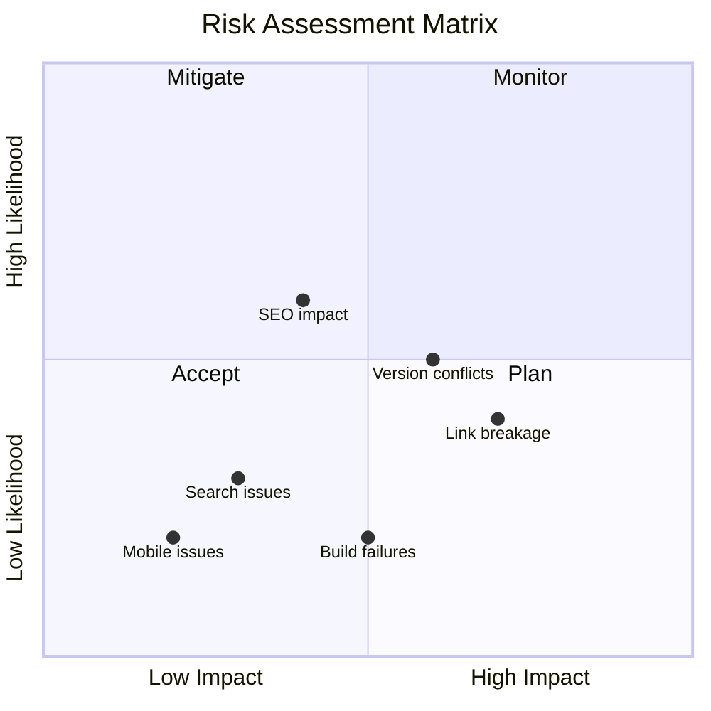

### 9.2 Risk Register

| Risk | Likelihood | Impact | Mitigation |
|------|------------|--------|------------|
| **Link breakage during migration** | Medium | High | Run existing validation scripts; staged rollout |
| **Mermaid rendering issues** | Low | Medium | Test all 91 files; fallback to image export |
| **Search index size** | Low | Low | Just the Docs handles large indexes |
| **CI/CD integration conflicts** | Low | Medium | Extend existing workflows; don't replace |
| **Version branching complexity** | High | Medium | Start with single version; add later |
| **SEO ranking impact** | Medium | Medium | Proper redirects; sitemap; canonical URLs |
| **Mobile layout issues** | Low | Low | Theme handles responsiveness |
| **Build time increase** | Low | Low | Jekyll is fast; incremental builds |
| **External link rot** | Medium | Low | Add external link checker to CI |
| **Content duplication** | Medium | Medium | Clear deprecation; single source of truth |

### 9.3 Contingency Plans

| Scenario | Contingency |
|----------|-------------|
| Jekyll build fails | Fall back to MkDocs (similar structure) |
| gh-pages quota exceeded | Deploy to Netlify/Vercel instead |
| Theme doesn't meet needs | Switch to Material for MkDocs |
| Search performance poor | Add Algolia DocSearch |
| Version support too complex | Maintain single version; archive old |

---

## 10. Success Criteria

### 10.1 Quality Gates

| Gate | Criterion | Measurement |
|------|-----------|-------------|
| Link integrity | 100% internal links valid | Automated validation |
| Mermaid rendering | All 430 diagrams render | Visual inspection |
| Search functionality | < 100ms response time | Performance test |
| Mobile responsiveness | Lighthouse score > 90 | Lighthouse audit |
| Build time | < 60 seconds | CI/CD metrics |
| Page load | < 2 seconds | Lighthouse audit |
| Accessibility | WCAG 2.1 AA | axe-core audit |

### 10.2 Acceptance Criteria

- [ ] All 228 primary documents migrated
- [ ] Navigation hierarchy matches Diataxis framework
- [ ] Search returns relevant results
- [ ] Mobile experience functional
- [ ] CI/CD deploys on every main branch push
- [ ] Existing validation scripts integrated
- [ ] Redirects from old paths working
- [ ] Version selector functional (Phase 5)

---

## 11. Appendices

### A. File Inventory Summary

| Category | Count |
|----------|-------|
| Total markdown files | 398 |
| Active (non-archive) | 323 |
| Archived | 75 |
| Working/draft | 35 |
| Primary (user-facing) | ~228 |
| Mermaid diagrams | 430 instances |
| Validation scripts | 18 |
| CI/CD workflows | 2 |

### B. Existing Infrastructure

- **CI/CD**: 2 GitHub Actions workflows
- **Validation**: 18 scripts (link, frontmatter, Mermaid, spelling)
- **Frontmatter**: YAML with category, tags, dates, difficulty
- **Diagrams**: 100% Mermaid (ASCII deprecated)
- **Framework**: Diataxis-compliant

### C. Technology Stack

| Component | Current | Target |
|-----------|---------|--------|
| Source format | Markdown | Markdown |
| Diagrams | Mermaid | Mermaid |
| Build tool | None | Jekyll |
| Theme | None | Just the Docs |
| Search | None | Lunr.js |
| Hosting | GitHub repo | GitHub Pages |
| CI/CD | GitHub Actions | GitHub Actions |

### D. Reference Links

- [Just the Docs Theme](https://just-the-docs.github.io/just-the-docs/)
- [Jekyll Documentation](https://jekyllrb.com/docs/)
- [GitHub Pages](https://docs.github.com/en/pages)
- [Mermaid.js](https://mermaid.js.org/)
- [Diataxis Framework](https://diataxis.fr/)

---

**Document Version**: 1.0
**Created**: 2026-01-02
**Author**: Hive Mind Collective Intelligence Coordinator
**Status**: Ready for Review
