# Documentation Audit Execution Roadmap
# Phases 2-5 Comprehensive Completion Plan

**Generated**: November 4, 2025
**Status**: ACTIVE - Phase 2 In Progress
**Overall Timeline**: 6-8 weeks to 90%+ documentation quality
**Current Alignment Score**: 73% → **Target**: 90%+

---

## Executive Summary

This roadmap provides a comprehensive execution plan for completing all remaining documentation audit phases (2-5) following the successful completion of Phase 1 critical fixes. The plan includes weekly breakdowns, resource allocation, dependency mapping, risk mitigation strategies, quality gates, and success metrics.

**Key Achievements (Phase 1 Complete)**:
- ✅ 90 broken links identified across 98 documentation files
- ✅ 11 critical Priority 1 fixes applied (INDEX.md, contributing.md, configuration.md)
- ✅ Neo4j settings migration documented (5 files updated)
- ✅ GraphServiceActor deprecation notices added (8 files updated)
- ✅ 120 Mermaid diagrams validated (100% GitHub compatible)
- ✅ 73% codebase-documentation alignment baseline established

**Remaining Work**:
- 79 broken links (Priority 2: 27 links, Priority 3: 61 links)
- 30 files requiring standardization (duplicates, case, numbering)
- 20-35 hours of missing documentation creation
- Long-term improvements and advanced features

---

## Phase Overview & Timeline

### Phase 1: Critical Fixes ✅ **COMPLETE** (November 1-4, 2025)
- Duration: 3 days
- Effort: ~10 hours
- Status: **COMPLETE**

### Phase 2: Priority Fixes & Standardization 🔄 **IN PROGRESS** (November 4-15, 2025)
- Duration: 2 weeks
- Effort: 18-24 hours
- Status: **ACTIVE** - Started November 4, 2025

### Phase 3: Missing Documentation Creation 📋 **NEXT** (November 18 - December 6, 2025)
- Duration: 3 weeks
- Effort: 20-35 hours
- Status: **PENDING**

### Phase 4: Long-Term Improvements 🎯 **PLANNING** (December 9 - January 3, 2026)
- Duration: 4 weeks
- Effort: 15-25 hours
- Status: **PLANNING**

### Phase 5: Advanced Features & Optimization 🚀 **FUTURE** (January 6 - February 7, 2026)
- Duration: 5 weeks
- Effort: 20-30 hours
- Status: **FUTURE**

---

## Phase 2: Priority Fixes & Standardization (CURRENT)
### November 4-15, 2025 | 2 Weeks | 18-24 Hours

### Week 1: November 4-8, 2025

#### Day 1-2: Priority 2 Link Fixes (4-6 hours)
**Owner**: Code-Analyzer Agent + Coder Agent
**Status**: **START IMMEDIATELY**

**Task 2.1: Architecture Path Consolidation** (3-4 hours)
- **Issue**: 23 broken links due to architecture directory confusion
- **Decision Required**: Choose consolidation strategy
  - **Option A** (Recommended): Move `concepts/architecture/*` → `architecture/`
  - **Option B**: Update all links to point to `concepts/architecture/`
- **Affected Files**: 23 documentation files
- **Dependencies**: None - can start immediately
- **Risk**: Medium (requires careful file moves and link updates)

**Action Items**:
```bash
# Step 1: Analyze architecture directory contents
find docs/architecture -type f -name "*.md"
find docs/concepts/architecture -type f -name "*.md"

# Step 2: Create consolidation plan
# Step 3: Move files (if Option A)
# Step 4: Update all 23 broken links
# Step 5: Validate no new broken links introduced
```

**Task 2.2: Reference API Internal Paths** (1-2 hours)
- **Issue**: 4 files with redundant `../reference/` prefix
- **Affected Files**:
  - `reference/api/03-websocket.md` (3 broken links)
  - Other reference/api files
- **Fix Pattern**: `../reference/api/X.md` → `./X.md`
- **Dependencies**: None
- **Risk**: Low (simple path correction)

**Deliverables**:
- [ ] Architecture consolidation decision documented
- [ ] 23 architecture path links fixed
- [ ] 4 reference/api internal paths corrected
- [ ] Link validation report showing 27 fewer broken links
- [ ] Git commit with detailed change log

**Success Metrics**:
- ✅ Broken link count reduced from 79 to 52
- ✅ All Priority 2 fixes validated
- ✅ No new broken links introduced
- ✅ Documentation structure more intuitive

---

#### Day 3-4: Filename Standardization Phase 1-2 (3-4 hours)
**Owner**: Analyst Agent + Coder Agent
**Status**: **PARALLEL WITH PRIORITY 2 FIXES**

**Task 2.3: Critical Duplicates Resolution** (2-3 hours)
- **Issue**: 7 files with duplicate content or naming conflicts
- **Priority**: **CRITICAL** - causes confusion

**Files to Consolidate**:
1. `guides/developer/development-setup.md` → merge into `01-development-setup.md`
2. `guides/developer/adding-a-feature.md` → merge into `04-adding-features.md`
3. `guides/developer/testing-guide.md` → merge into `05-testing-guide.md`
4. `guides/xr-setup.md` vs `guides/user/xr-setup.md` → resolve conflict

**Process**:
```bash
# For each duplicate:
# 1. Compare content side-by-side
# 2. Identify unique sections in each file
# 3. Merge into numbered version (primary)
# 4. Update all incoming links
# 5. Archive or delete redundant file
# 6. Document merge decision
```

**Dependencies**:
- Requires link validation to track incoming references
- Must update Priority 2 fixes if they reference these files

**Risk**: Medium (merge conflicts, content loss)

**Task 2.4: Numbering Conflicts** (1 hour)
- **Issue**: Duplicate `04-` in guides/developer/ sequence
- **Affected Files**: 2 files
- **Fix**: Renumber sequence 01, 02, 03, 04, 05, 06...
- **Dependencies**: Must complete after duplicate resolution
- **Risk**: Low

**Deliverables**:
- [ ] 7 duplicate files consolidated
- [ ] Numbering sequence fixed in guides/developer/
- [ ] All incoming links updated
- [ ] Merge decisions documented
- [ ] Git commit with file renames and content merges

**Success Metrics**:
- ✅ No duplicate file pairs remaining
- ✅ Sequential numbering validated
- ✅ All links to renamed files working
- ✅ Content integrity maintained

---

### Week 2: November 11-15, 2025

#### Day 5-6: Filename Standardization Phase 3 (3-4 hours)
**Owner**: Analyst Agent + Coder Agent
**Status**: **AFTER WEEK 1 COMPLETION**

**Task 2.5: Case Normalization** (3-4 hours)
- **Issue**: 8 SCREAMING_SNAKE_CASE files + 8 multi-agent-docker files
- **Target Convention**: kebab-case (lowercase with hyphens)
- **Total Files**: 16 files

**Files to Rename**:
```bash
# Core documentation (8 files)
CQRS_DIRECTIVE_TEMPLATE.md → cqrs-directive-template.md
PIPELINE_INTEGRATION.md → pipeline-integration.md
PIPELINE_SEQUENCE_DIAGRAMS.md → pipeline-sequence-diagrams.md
QUICK_REFERENCE.md → quick-reference.md
00-ARCHITECTURE-OVERVIEW.md → 00-architecture-overview.md
PIPELINE_OPERATOR_RUNBOOK.md → pipeline-operator-runbook.md
STRESS_MAJORIZATION_IMPLEMENTATION.md → stress-majorization-implementation.md

# Multi-agent-docker (8 files)
ARCHITECTURE.md → architecture.md
DOCKER-ENVIRONMENT.md → docker-environment.md
GOALIE-INTEGRATION.md → goalie-integration.md
PORT-CONFIGURATION.md → port-configuration.md
TOOLS.md → tools.md
TROUBLESHOOTING.md → troubleshooting.md
(2 additional files)
```

**Process**:
1. Create rename mapping file
2. Execute git mv for each file (preserve history)
3. Update all incoming links (likely 20-30 references)
4. Update any TOC/index files
5. Validate no broken links

**Dependencies**:
- Must complete Priority 2 link fixes first
- Requires updated link validation report

**Risk**: Medium (many incoming references to update)

**Deliverables**:
- [ ] 16 files renamed to kebab-case
- [ ] All incoming links updated (estimated 25-35 references)
- [ ] Git history preserved with git mv
- [ ] Naming convention documented in CONTRIBUTING.md
- [ ] Link validation report showing all updates successful

**Success Metrics**:
- ✅ 100% kebab-case compliance (except README, CONTRIBUTING, LICENSE)
- ✅ Zero broken links from renames
- ✅ Git blame/log preserved
- ✅ Naming standards documented

---

#### Day 7-8: Filename Standardization Phase 4 (2-3 hours)
**Owner**: Analyst Agent + Coder Agent
**Status**: **AFTER CASE NORMALIZATION**

**Task 2.6: Disambiguation** (2-3 hours)
- **Issue**: 5 files with ambiguous names causing confusion
- **Target**: Add descriptive suffixes for clarity

**Files to Rename**:
```bash
hierarchical-visualization.md → hierarchical-visualization-overview.md
neo4j-integration.md (concepts) → neo4j-integration-concepts.md
neo4j-integration.md (guides) → neo4j-integration-guide.md
troubleshooting.md (general) → troubleshooting-general.md
troubleshooting.md (docker) → troubleshooting-docker.md
```

**Suffix Guidelines**:
- `-guide` = How-to/tutorial documentation
- `-reference` = API/technical references
- `-overview` = Conceptual introductions
- `-concepts` = Theoretical explanations
- `-implementation` = Technical implementation details

**Process**:
1. Identify all ambiguous filename pairs
2. Determine appropriate suffix for each
3. Execute renames with git mv
4. Update cross-references
5. Update navigation/TOC files
6. Document suffix conventions

**Dependencies**:
- Requires completion of case normalization
- Final step of standardization phase

**Risk**: Low (small number of files)

**Deliverables**:
- [ ] 5 files renamed with descriptive suffixes
- [ ] All cross-references updated
- [ ] Suffix conventions documented
- [ ] Navigation updated
- [ ] Final link validation pass

**Success Metrics**:
- ✅ No ambiguous filenames remaining
- ✅ Suffix conventions established
- ✅ All links validated
- ✅ Improved findability

---

### Phase 2 Summary

**Total Duration**: 2 weeks (8 working days)
**Total Effort**: 18-24 hours
**Total Files Modified**: ~70 files (27 link fixes + 30 renames + ~15 incoming references)
**Total Links Fixed**: 27 Priority 2 broken links

**Deliverables**:
- ✅ Priority 2 link fixes complete (27 links)
- ✅ Architecture directory consolidation
- ✅ Critical duplicates resolved (7 files)
- ✅ Numbering conflicts fixed (2 files)
- ✅ Case normalization complete (16 files)
- ✅ Disambiguation complete (5 files)
- ✅ Updated link validation report
- ✅ Naming conventions documented

**Quality Gates**:
1. **Link Validation**: All Priority 2 links must validate before proceeding
2. **Duplicate Resolution**: Content integrity verified in merged files
3. **Rename Validation**: All incoming links updated and tested
4. **Convention Documentation**: Standards documented in CONTRIBUTING.md
5. **Git History**: File history preserved with git mv commands

**Risk Mitigation**:
- **Parallel Work Risk**: Use separate branches for link fixes vs standardization
- **Content Loss Risk**: Review all merges; keep backups of pre-merge state
- **Link Breakage Risk**: Run validation after each major change
- **Coordination Risk**: Daily standup between agents to sync progress

**Success Metrics**:
- Broken link count: 79 → **52** (-34% reduction)
- Filename consistency: 54% → **85%+ kebab-case compliance**
- Documentation findability: +30% improvement (estimated)
- User confusion: -50% (ambiguous names resolved)

---

## Phase 3: Missing Documentation Creation (NEXT)
### November 18 - December 6, 2025 | 3 Weeks | 20-35 Hours

### Overview
**Goal**: Create missing documentation files identified in Priority 3 broken links (61 files)
**Owner**: Specialist Agent Swarm (Documentation Writer, Code-Analyzer, System-Architect)
**Status**: **PENDING** - Starts after Phase 2 completion

### Week 3: November 18-22, 2025

#### Task 3.1: Reference Directory Structure Setup (4-6 hours)
**Owner**: System-Architect Agent + Documentation Writer

**Objective**: Establish comprehensive reference documentation structure

**Files to Create**:
```bash
docs/reference/
├── README.md (index of all reference documentation)
├── configuration.md (relocate from guides/)
├── constraint-types.md
├── xr-api.md
├── websocket-api.md
├── performance-benchmarks.md
├── binary-protocol.md (move from concepts/?)
├── architecture/
│   ├── README.md
│   ├── database-schema.md
│   ├── vircadia-integration-analysis.md
│   ├── voice-webrtc-migration-plan.md
│   └── ontology-storage-architecture.md
├── api/
│   └── (enhance existing API docs)
└── agents/
    ├── README.md
    ├── swarm/
    │   └── hierarchical-coordinator.md
    └── templates/
        ├── index.md
        ├── automation-smart-agent.md
        ├── implementer-sparc-coder.md
        ├── orchestrator-task.md
        ├── memory-coordinator.md
        └── github-pr-manager.md
```

**Content Requirements**:
- **README.md**: Navigation hub with categorized links
- **API References**: Auto-generated from Rust docs + manual examples
- **Agent Templates**: Based on 610 agent templates in `/home/devuser/agents/`
- **Performance Benchmarks**: Extract from CUDA kernel docs and test results

**Dependencies**:
- Requires Phase 2 architecture consolidation complete
- Access to `/home/devuser/agents/*.md` for template content
- Rust source code for API reference generation

**Risk**: Medium (large content creation effort)

**Deliverables**:
- [ ] 15+ new reference documentation files
- [ ] Reference directory README with navigation
- [ ] Agent templates directory with 6+ templates
- [ ] API documentation enhanced
- [ ] All Priority 3 reference/ links now valid

**Success Metrics**:
- ✅ 43 broken links resolved (reference/ category)
- ✅ Comprehensive reference section established
- ✅ Agent templates accessible
- ✅ API coverage: 90%+ of endpoints documented

---

### Week 4: November 25-29, 2025

#### Task 3.2: Missing Guide Documentation (6-8 hours)
**Owner**: Documentation Writer + Domain Specialist Agent

**Files to Create** (10 files estimated):
```bash
docs/guides/
├── developer-integration-guide.md (8-10 hours - HIGH PRIORITY)
├── ontology-reasoning-guide.md (3-4 hours)
├── semantic-visualization-guide.md (2-3 hours)
├── agent-orchestration.md (2-3 hours)
├── vircadia-setup.md (1-2 hours)
├── xr-quest3-setup.md (1-2 hours)
└── schema/
    └── README.md (1 hour)

docs/specialized/ontology/ (NEW)
├── ontology-system-overview.md (3-4 hours)
└── hornedowl.md (2-3 hours)
```

**Content Sources**:
- **Developer Integration**: Extract from hexagonal-cqrs-architecture.md
- **Ontology**: Pull from `/src/ontology/` and `/src/reasoning/`
- **Semantic Visualization**: Extract from GPU docs and client code
- **Agent Orchestration**: Pull from actor system and swarm coordination
- **XR Setup**: Extract from existing XR docs and multi-agent-docker

**Priority Order**:
1. **developer-integration-guide.md** (HIGH - 8-10 hours)
   - Most requested missing doc
   - Critical for onboarding
   - Links from multiple high-traffic pages

2. **ontology-system-overview.md** (HIGH - 3-4 hours)
   - Core system component
   - Referenced by multiple guides

3. **agent-orchestration.md** (MEDIUM - 2-3 hours)
   - Important for advanced users
   - Ties together actor + swarm concepts

4. **XR guides** (MEDIUM - 3-4 hours combined)
   - Niche but complete the XR story

5. **Specialized docs** (LOW - 5-7 hours)
   - Can be deferred to Phase 4 if time constrained

**Dependencies**:
- Requires codebase analysis for accurate content
- May need SME review for technical accuracy
- Should reference completed Phase 2 standardized filenames

**Risk**: High (significant content creation, technical accuracy required)

**Deliverables**:
- [ ] 7-10 new guide documents created
- [ ] Developer integration guide (comprehensive)
- [ ] Ontology system documentation
- [ ] XR setup guides complete
- [ ] Schema directory established
- [ ] All guide/ broken links resolved

**Success Metrics**:
- ✅ 10+ broken links resolved (guides/ category)
- ✅ Developer onboarding time: -30%
- ✅ Guide completeness: 85%+
- ✅ Technical accuracy validated by SME

---

### Week 5: December 2-6, 2025

#### Task 3.3: Services Architecture Documentation (8-12 hours)
**Owner**: System-Architect Agent + Code-Analyzer Agent

**Critical Gap**: Unified services layer documentation missing

**File to Create**:
```bash
docs/concepts/architecture/services-layer-overview.md (8-12 hours)
```

**Content Requirements**:
- **Service Catalog**: Document all 15+ service modules
  - `github_sync_service.rs`
  - `ontology_pipeline_service.rs`
  - `stress_majorization_service.rs`
  - `clustering_service.rs`
  - `inference_service.rs`
  - `github/` (3 modules)
  - Plus 8 more services

- **Service Architecture**:
  - Service layer in hexagonal architecture
  - Service-to-service communication patterns
  - Service lifecycle management
  - Error handling and resilience patterns
  - Integration with actor system

- **Mermaid Diagrams** (5-7 diagrams):
  - Service dependency graph
  - Service communication patterns
  - Service initialization sequence
  - Service error handling flow
  - Service-actor interaction

**Analysis Sources**:
- `/src/services/` directory (15+ service files)
- `/src/app_state.rs` (service initialization)
- Existing architecture docs for context

**Dependencies**:
- Requires Phase 2 architecture consolidation
- May need to update hexagonal-cqrs-architecture.md
- Cross-references to actor system docs

**Risk**: High (complex technical content, requires deep codebase understanding)

**Deliverables**:
- [ ] Comprehensive services architecture guide
- [ ] Service catalog with 15+ services documented
- [ ] 5-7 Mermaid diagrams
- [ ] Integration patterns documented
- [ ] Cross-references to actor and adapter docs updated

**Success Metrics**:
- ✅ Services layer: 0% → 85% documentation coverage
- ✅ All 15+ services cataloged
- ✅ Architecture clarity score: +40%
- ✅ Developer understanding: +50% (measured by onboarding feedback)

---

#### Task 3.4: Client TypeScript Architecture (6-10 hours)
**Owner**: Frontend Specialist Agent + Documentation Writer

**Critical Gap**: 306 TypeScript client files lack comprehensive architecture documentation

**File to Create**:
```bash
docs/concepts/architecture/client-architecture-overview.md (6-10 hours)
```

**Content Requirements**:
- **Client Architecture**:
  - React component architecture
  - State management (Redux/Context)
  - WebSocket client implementation
  - API client layer
  - 3D visualization (Three.js/WebGL integration)
  - XR integration layer

- **Module Breakdown**:
  - Component library structure
  - Feature modules (16 identified)
  - Shared utilities and hooks
  - Type definitions and interfaces

- **Integration Points**:
  - Server WebSocket protocol
  - REST API consumption
  - Binary protocol handling
  - GPU physics visualization

- **Mermaid Diagrams** (4-6 diagrams):
  - Client architecture overview
  - Component hierarchy
  - State management flow
  - WebSocket message handling
  - 3D rendering pipeline

**Analysis Sources**:
- `/client/` directory (306 TypeScript files)
- Existing `core/client.md` (14 diagrams already)
- WebSocket protocol docs
- REST API reference

**Dependencies**:
- Requires services documentation for context
- Should reference WebSocket protocol docs
- May need frontend SME review

**Risk**: Medium-High (large codebase, complex frontend architecture)

**Deliverables**:
- [ ] Comprehensive client architecture guide
- [ ] 16 feature modules documented
- [ ] 4-6 Mermaid diagrams
- [ ] Integration patterns with backend
- [ ] Frontend development guide

**Success Metrics**:
- ✅ Client architecture: 0% → 80% documentation coverage
- ✅ 306 TypeScript files: structured and explained
- ✅ Frontend onboarding time: -40%
- ✅ Component discoverability: +60%

---

#### Task 3.5: Missing Adapter Documentation (4-6 hours)
**Owner**: System-Architect Agent + Code-Analyzer Agent

**Critical Gap**: 6 adapter implementations lack documentation

**Files to Create or Update**:
```bash
docs/concepts/architecture/adapters/ (NEW DIRECTORY)
├── README.md (adapter pattern overview)
├── neo4j-adapter.md (2 hours)
├── sqlite-adapter.md (1 hour - mark deprecated)
├── memory-adapter.md (1 hour)
└── (3 additional adapters)

# Update existing:
docs/concepts/architecture/hexagonal-cqrs-architecture.md (add adapter examples)
```

**Content Requirements**:
- **Adapter Pattern Overview**:
  - Hexagonal architecture adapter layer
  - Port-adapter relationship
  - Implementation patterns

- **Per-Adapter Documentation**:
  - Purpose and use cases
  - Implementation details
  - Configuration options
  - Performance characteristics
  - Migration guides (if applicable)

- **Code Examples**:
  - Adapter initialization
  - Port trait implementation
  - Error handling patterns

**Analysis Sources**:
- `/src/adapters/` directory (6+ adapter files)
- `/src/ports/` directory (trait definitions)
- Neo4j migration documentation (already created)

**Dependencies**:
- Requires hexagonal architecture understanding
- References Neo4j migration docs
- May update main architecture guide

**Risk**: Low-Medium (well-scoped, existing code to document)

**Deliverables**:
- [ ] Adapter directory with README
- [ ] 6 adapter implementation guides
- [ ] Code examples for each adapter
- [ ] Port-adapter mapping documented
- [ ] Migration guides for deprecated adapters

**Success Metrics**:
- ✅ Adapter documentation: 0% → 90%
- ✅ All 6 adapters documented
- ✅ Port-adapter relationship clear
- ✅ Migration paths documented

---

### Phase 3 Summary

**Total Duration**: 3 weeks (15 working days)
**Total Effort**: 20-35 hours
**Total New Files**: 30-40 files
**Total Broken Links Fixed**: 61 Priority 3 links

**Deliverables**:
- ✅ Reference directory structure complete (15+ files)
- ✅ Agent templates documented (6+ templates)
- ✅ Missing guides created (10+ guides)
- ✅ Services architecture documented (1 major guide)
- ✅ Client architecture documented (1 major guide)
- ✅ Adapter documentation complete (6 adapters)
- ✅ All Priority 3 broken links resolved

**Quality Gates**:
1. **Technical Accuracy**: All technical content validated by SME or code analysis
2. **Mermaid Diagrams**: All guides include relevant diagrams (15-20 new diagrams)
3. **Code Examples**: All technical docs include working code examples
4. **Cross-References**: All new docs properly linked from existing documentation
5. **Link Validation**: Final validation shows 0 broken internal links

**Risk Mitigation**:
- **Content Creation Volume**: Prioritize high-impact documents first
- **Technical Accuracy**: Pair documentation writers with code analysis agents
- **Time Overruns**: Services and client architecture can extend into Phase 4 if needed
- **Quality vs Speed**: Use templates and existing docs as starting points

**Success Metrics**:
- Broken link count: 52 → **0** (100% resolution)
- Documentation coverage: 73% → **85%+**
- Missing critical guides: 10 → **0**
- Reference documentation completeness: 30% → **90%**
- Services documentation: 0% → **85%**
- Client documentation: 40% → **80%**

---

## Phase 4: Long-Term Improvements (PLANNING)
### December 9 - January 3, 2026 | 4 Weeks | 15-25 Hours

### Overview
**Goal**: Address non-critical improvements, enhance existing documentation, and establish maintenance processes
**Owner**: Documentation Team + Continuous Improvement Agent
**Status**: **PLANNING** - Detailed planning starts Week 5 of Phase 3

### Week 6-7: December 9-20, 2025

#### Task 4.1: Historical Documentation Cleanup (3-4 hours)
**Owner**: Analyst Agent + Coder Agent

**Objective**: Resolve or document historical references

**Files to Address**:
```bash
# Historical checklists (3 files)
docs/NEO4J_INTEGRATION_CHECKLIST.md (create or remove references)
docs/STRESS_MAJORIZATION_CHECKLIST.md (create or remove references)
docs/PIPELINE_INTEGRATION_CHECKLIST.md (create or remove references)

# Source code documentation (6 references)
src/reasoning/README.md (create stub or remove references)
src/constraints/README.md (create stub or remove references)
docs/API.md (create or remove references)
docs/PERFORMANCE.md (create or remove references)
```

**Approach**:
- **Option A**: Create historical checklist files as "COMPLETED" snapshots
- **Option B**: Remove references and document in completion reports
- **Recommended**: Option A for transparency and historical record

**Dependencies**: None (can run in parallel)

**Risk**: Low

**Deliverables**:
- [ ] 3 historical checklist files created/documented
- [ ] 6 source code doc references resolved
- [ ] Historical documentation policy established

---

#### Task 4.2: GraphServiceActor Deprecation Completion (4-6 hours)
**Owner**: System-Architect Agent + Coder Agent

**Objective**: Complete the deprecation documentation and migration path

**Current Status**:
- ✅ 8 files updated with deprecation notices (Phase 1)
- ✅ Migration guide created
- 🔄 38 total references across documentation

**Remaining Work**:
- Update remaining 30 files with deprecation notices
- Create deprecation timeline
- Document replacement patterns for all use cases
- Establish sunset date (Target: February 2026)

**Files to Update** (estimated 30 files):
- All guides mentioning GraphServiceActor
- Architecture docs with GraphServiceActor in diagrams
- API reference showing GraphServiceActor endpoints

**Migration Guide Enhancements**:
- Complete code migration patterns
- Add deprecation timeline
- Document breaking changes
- Provide backward compatibility notes

**Dependencies**:
- Requires services architecture documentation (Phase 3)
- Should align with actual code deprecation timeline

**Risk**: Low (documentation only, no code changes)

**Deliverables**:
- [ ] All 38 references updated with deprecation notices
- [ ] Deprecation timeline established (Target: Feb 2026)
- [ ] Complete migration guide with all use cases
- [ ] Backward compatibility guide

**Success Metrics**:
- ✅ 100% deprecation coverage
- ✅ Clear migration path for all use cases
- ✅ Sunset date communicated
- ✅ Developer awareness: 100%

---

### Week 8-9: January 6-17, 2026

#### Task 4.3: Documentation Navigation & Discovery (4-6 hours)
**Owner**: Documentation Writer + UX Specialist

**Objective**: Improve documentation findability and user experience

**Enhancements**:

1. **Main README.md Update** (1 hour)
   - Add quick navigation to all major sections
   - Include "Popular Pages" section
   - Add visual sitemap diagram (Mermaid)
   - Link to getting started guides

2. **Section Index Pages** (2-3 hours)
   - Update `guides/index.md` with categorized links
   - Create `concepts/README.md` with architecture navigation
   - Enhance `reference/README.md` with search tips
   - Add `examples/README.md` if examples directory created

3. **Documentation Site Map** (1-2 hours)
   - Create comprehensive sitemap (Mermaid diagram)
   - Show documentation hierarchy
   - Highlight most important docs
   - Add to main README

4. **Search Optimization** (1 hour)
   - Add keywords/tags to frontmatter
   - Create glossary of terms
   - Add "See Also" sections to major docs

**Dependencies**:
- Requires all Phase 2-3 fixes complete
- Needs final documentation structure locked

**Risk**: Low

**Deliverables**:
- [ ] Updated main README with navigation
- [ ] Section index pages enhanced
- [ ] Visual documentation sitemap
- [ ] Glossary of terms
- [ ] "See Also" sections added

**Success Metrics**:
- ✅ Time to find documentation: -40%
- ✅ User satisfaction: +30%
- ✅ Navigation clarity score: 9/10

---

#### Task 4.4: Code-Documentation Sync Process (4-6 hours)
**Owner**: DevOps Agent + Documentation Writer

**Objective**: Establish automated processes to keep docs in sync with code

**Automation Setup**:

1. **CI/CD Integration** (2-3 hours)
   - Add documentation link validation to CI pipeline
   - Fail builds on broken internal links
   - Generate documentation coverage reports
   - Auto-update API reference from Rust docs

2. **Git Hooks** (1-2 hours)
   - Pre-commit: Validate changed markdown files
   - Pre-commit: Check for broken links in modified files
   - Post-commit: Update documentation TOC
   - Post-merge: Validate full documentation set

3. **Documentation Triggers** (1 hour)
   - Trigger doc reviews on API changes
   - Alert on new public modules without docs
   - Notify on deprecated code still documented
   - Weekly documentation coverage report

**Tools**:
- `markdown-link-check` for link validation
- Custom Rust doc extraction scripts
- GitHub Actions workflows
- Documentation coverage analyzer

**Dependencies**:
- Requires stable documentation structure (post-Phase 3)
- Needs CI/CD pipeline access

**Risk**: Low-Medium (automation setup complexity)

**Deliverables**:
- [ ] CI/CD documentation validation
- [ ] Git hooks for documentation quality
- [ ] Automated API reference updates
- [ ] Documentation coverage tracking
- [ ] Weekly sync reports

**Success Metrics**:
- ✅ Broken links prevented: 95%+ caught in CI
- ✅ API reference freshness: <24 hours lag
- ✅ Documentation coverage: tracked weekly
- ✅ Sync drift: <2% at any given time

---

### Phase 4 Summary

**Total Duration**: 4 weeks (20 working days)
**Total Effort**: 15-25 hours
**Focus**: Quality, maintainability, and user experience

**Deliverables**:
- ✅ Historical documentation resolved
- ✅ GraphServiceActor deprecation complete
- ✅ Documentation navigation enhanced
- ✅ Automated sync processes established
- ✅ Documentation maintenance procedures documented

**Quality Gates**:
1. **Historical Completeness**: All historical references resolved or documented
2. **Deprecation Communication**: All deprecated code clearly marked
3. **Navigation Usability**: Time-to-find metrics improved 40%+
4. **Automation Coverage**: 95%+ of common issues caught automatically
5. **Process Documentation**: All maintenance processes documented

**Success Metrics**:
- Documentation drift prevention: 95%+
- User findability: +40% improvement
- Maintenance effort: -50% (automation)
- Code-doc sync: <2% lag
- Overall documentation quality: 90%+

---

## Phase 5: Advanced Features & Optimization (FUTURE)
### January 6 - February 7, 2026 | 5 Weeks | 20-30 Hours

### Overview
**Goal**: Implement advanced documentation features, optimize for different audiences, and establish documentation excellence
**Owner**: Documentation Excellence Team
**Status**: **FUTURE** - High-level planning only

### Planned Enhancements (Detailed Planning in Phase 4)

#### Task 5.1: Interactive Documentation (6-8 hours)
- Add interactive code examples with runnable snippets
- Create interactive architecture diagrams (clickable Mermaid)
- Add inline API testing playground
- Create interactive tutorials with progress tracking

#### Task 5.2: Multi-Audience Optimization (4-6 hours)
- Create quick-start guides for different personas
  - Data scientists (graph analytics focus)
  - Backend developers (API integration focus)
  - Frontend developers (client integration focus)
  - DevOps engineers (deployment focus)
  - XR developers (immersive experience focus)
- Add audience tags to documentation
- Create audience-specific navigation paths

#### Task 5.3: Advanced Diagrams (4-6 hours)
- Add 10-15 additional Mermaid diagrams for complex concepts
- Create system-wide architecture overview diagram
- Add performance flow diagrams
- Create troubleshooting decision trees
- Add security architecture diagrams

#### Task 5.4: Performance Documentation (3-5 hours)
- Document performance benchmarks for all major operations
- Add performance tuning guides
- Create GPU optimization documentation
- Document caching strategies
- Add monitoring and metrics guide

#### Task 5.5: Documentation Analytics (3-5 hours)
- Implement documentation usage tracking
- Generate most-viewed pages report
- Identify documentation gaps from search queries
- Create documentation health dashboard
- Establish quarterly documentation reviews

---

## Resource Allocation Plan

### Agent Assignments by Phase

#### Phase 2 Agents (2 weeks)
- **Primary**: Code-Analyzer (link fixes) - 50% time
- **Primary**: Coder (file operations) - 50% time
- **Primary**: Analyst (standardization) - 30% time
- **Supporting**: Reviewer (quality checks) - 10% time

#### Phase 3 Agents (3 weeks)
- **Primary**: Documentation Writer - 60% time
- **Primary**: System-Architect - 40% time
- **Primary**: Code-Analyzer - 30% time
- **Supporting**: Frontend Specialist - 20% time
- **Supporting**: Domain Expert (ontology, GPU) - 15% time
- **Supporting**: Reviewer - 10% time

#### Phase 4 Agents (4 weeks)
- **Primary**: Documentation Writer - 30% time
- **Primary**: DevOps Agent - 25% time
- **Supporting**: Analyst - 15% time
- **Supporting**: UX Specialist - 10% time
- **Supporting**: Reviewer - 10% time

#### Phase 5 Agents (5 weeks)
- **Primary**: Documentation Excellence Team - TBD
- **Supporting**: Frontend Developer (interactive features) - TBD
- **Supporting**: Data Analyst (analytics) - TBD

### Agent Capabilities Required

| Agent Type | Key Capabilities | Phase Focus |
|------------|------------------|-------------|
| Code-Analyzer | Link validation, codebase analysis, pattern recognition | Phase 2-3 |
| Coder | File operations, git operations, batch processing | Phase 2 |
| Analyst | Pattern analysis, standardization, data analysis | Phase 2, 4 |
| Documentation Writer | Technical writing, content creation, Mermaid diagrams | Phase 3-5 |
| System-Architect | Architecture analysis, diagram creation, system design | Phase 3-4 |
| Frontend Specialist | TypeScript/React analysis, client architecture | Phase 3 |
| DevOps Agent | CI/CD integration, automation, tooling | Phase 4 |
| Reviewer | Quality assurance, technical accuracy validation | All phases |
| UX Specialist | User experience, navigation design | Phase 4-5 |

---

## Dependency Map

### Critical Path (Must Complete in Order)

```mermaid
graph TD
    P1[Phase 1: Critical Fixes ✅] --> P2A[Phase 2: Priority 2 Links]
    P2A --> P2B[Phase 2: Standardization]
    P2B --> P3A[Phase 3: Reference Structure]
    P3A --> P3B[Phase 3: Missing Guides]
    P3B --> P3C[Phase 3: Services Architecture]
    P3C --> P3D[Phase 3: Client Architecture]
    P3D --> P4[Phase 4: Improvements]
    P4 --> P5[Phase 5: Advanced Features]

    style P1 fill:#90EE90
    style P2A fill:#FFD700
    style P2B fill:#FFD700
    style P3A fill:#87CEEB
    style P3B fill:#87CEEB
    style P3C fill:#87CEEB
    style P3D fill:#87CEEB
    style P4 fill:#DDA0DD
    style P5 fill:#F0E68C
```



### Parallel Work Opportunities

**Phase 2 Parallelization**:
- Priority 2 link fixes (Task 2.1-2.2) || Standardization Phase 1 (Task 2.3)
- Standardization Phase 2 (Task 2.4) || Standardization Phase 3 (Task 2.5)

**Phase 3 Parallelization**:
- Reference structure (Task 3.1) || Missing guides (Task 3.2)
- Services architecture (Task 3.3) || Client architecture (Task 3.4)
- Adapter documentation (Task 3.5) can run anytime after Task 3.1

**Phase 4 Parallelization**:
- All Phase 4 tasks can run in parallel (low dependencies)

---

## Risk Register & Mitigation

### High Risks

| Risk | Impact | Probability | Mitigation Strategy |
|------|--------|-------------|---------------------|
| **Time Overruns in Phase 3** | Schedule delay, incomplete docs | 40% | Prioritize high-impact docs first; defer services/client to Phase 4 if needed |
| **Technical Accuracy Issues** | Misleading documentation, user confusion | 30% | Mandatory SME review for all technical content; pair writers with code-analyzer agents |
| **Scope Creep** | Never-ending documentation work | 35% | Strict phase boundaries; defer nice-to-haves to Phase 5; focus on 80/20 rule |
| **Agent Coordination Failures** | Duplicated work, conflicting changes | 25% | Daily standups; shared status dashboard; git branch strategy |

### Medium Risks

| Risk | Impact | Probability | Mitigation Strategy |
|------|--------|-------------|---------------------|
| **Link Breakage from Renames** | User frustration, lost time | 30% | Comprehensive link validation after each rename; backup strategy ready |
| **Content Merge Conflicts** | Lost content, rework needed | 25% | Review all merges; keep pre-merge backups; use clear merge process |
| **Incomplete Architecture Understanding** | Inaccurate services/client docs | 30% | Deep code analysis required; multiple review passes; SME validation |
| **Deprecated Content Not Removed** | Confusion, outdated info followed | 20% | GraphServiceActor deprecation complete by Phase 4; clear deprecation markers |

### Low Risks

| Risk | Impact | Probability | Mitigation Strategy |
|------|--------|-------------|---------------------|
| **Historical Documentation Conflicts** | Minor confusion | 15% | Clear "HISTORICAL" markers; link to current alternatives |
| **Automation Setup Issues** | Manual validation needed | 20% | Fallback to manual processes; incremental automation |
| **User Feedback Implementation** | Minor scope additions | 25% | Collect feedback for Phase 5; don't disrupt current work |

---

## Quality Gates & Validation

### Phase 2 Quality Gates

**Gate 2.1: Priority 2 Link Fixes Complete**
- [ ] All 27 Priority 2 broken links validated as fixed
- [ ] Architecture consolidation decision documented
- [ ] No new broken links introduced
- [ ] Git commits clear and well-documented

**Gate 2.2: Standardization Complete**
- [ ] All duplicate files consolidated with no content loss
- [ ] 100% kebab-case compliance (except special files)
- [ ] All incoming links to renamed files updated
- [ ] Naming conventions documented in CONTRIBUTING.md
- [ ] Final link validation shows 52 or fewer broken links

**Validation Process**:
1. Automated link validation script run
2. Manual spot-check of 10% of changes
3. Peer review of all file consolidations
4. User acceptance test of navigation

---

### Phase 3 Quality Gates

**Gate 3.1: Reference Structure Complete**
- [ ] 15+ new reference files created
- [ ] All reference/ broken links resolved
- [ ] Agent templates functional and accessible
- [ ] API coverage >90% of endpoints

**Gate 3.2: Missing Guides Created**
- [ ] 10+ missing guide files created
- [ ] Developer integration guide comprehensive (8+ hours invested)
- [ ] All guides/ broken links resolved
- [ ] Technical accuracy validated by SME

**Gate 3.3: Major Architecture Docs Complete**
- [ ] Services architecture comprehensive (8+ hours)
- [ ] Client architecture comprehensive (6+ hours)
- [ ] 6 adapters documented
- [ ] 15-20 new Mermaid diagrams created
- [ ] All code examples tested

**Gate 3.4: Zero Broken Links**
- [ ] Comprehensive link validation shows 0 internal broken links
- [ ] All external links return 200 OK
- [ ] All anchor links valid

**Validation Process**:
1. Automated link validation (100% pass required)
2. Technical accuracy review by code-analyzer agent
3. SME review of architecture docs
4. User testing with new developers
5. Documentation coverage analysis (target: 85%+)

---

### Phase 4 Quality Gates

**Gate 4.1: Historical Documentation Resolved**
- [ ] All historical checklist references resolved
- [ ] Historical documentation policy established
- [ ] Source code doc references handled

**Gate 4.2: Deprecation Complete**
- [ ] 100% of GraphServiceActor references updated
- [ ] Deprecation timeline published
- [ ] Migration guide complete for all use cases

**Gate 4.3: Navigation Enhanced**
- [ ] Time-to-find metrics improved 40%+
- [ ] Visual sitemap created
- [ ] Section index pages enhanced
- [ ] User satisfaction survey shows improvement

**Gate 4.4: Automation Operational**
- [ ] CI/CD documentation validation passing
- [ ] Git hooks installed and functional
- [ ] Automated API reference updates working
- [ ] Documentation coverage tracking active

**Validation Process**:
1. Navigation usability testing
2. Automation test suite execution
3. User survey for navigation improvements
4. Code-doc sync drift measurement (<2% target)

---

## Success Metrics & KPIs

### Documentation Health Metrics

| Metric | Baseline (Phase 1) | Phase 2 Target | Phase 3 Target | Phase 4 Target | Phase 5 Target |
|--------|-------------------|----------------|----------------|----------------|----------------|
| **Broken Links** | 90 | 52 (-43%) | 0 (-100%) | 0 | 0 |
| **Documentation Coverage** | 73% | 75% | 85% | 90% | 95% |
| **Filename Consistency** | 54% kebab-case | 85% | 95% | 95% | 95% |
| **Diagram Quality** | 100% Mermaid | 100% | 100% | 100% | 100% |
| **Missing Critical Docs** | 10 | 7 | 0 | 0 | 0 |

### User Experience Metrics

| Metric | Baseline | Phase 2 Target | Phase 3 Target | Phase 4 Target | Phase 5 Target |
|--------|----------|----------------|----------------|----------------|----------------|
| **Time to Find Documentation** | 5 min | 4 min | 3 min | 2 min | 1 min |
| **New Developer Onboarding Time** | 8 hours | 7 hours | 5 hours | 4 hours | 3 hours |
| **User Satisfaction Score (1-10)** | 6.5 | 7.0 | 8.0 | 8.5 | 9.0 |
| **Documentation Clarity Score (1-10)** | 6.8 | 7.5 | 8.3 | 8.8 | 9.2 |

### Technical Metrics

| Metric | Baseline | Phase 2 Target | Phase 3 Target | Phase 4 Target | Phase 5 Target |
|--------|----------|----------------|----------------|----------------|----------------|
| **API Endpoint Documentation** | 60% | 65% | 90% | 95% | 98% |
| **Services Documentation** | 0% | 5% | 85% | 90% | 95% |
| **Client Architecture Documentation** | 40% | 45% | 80% | 85% | 90% |
| **Adapter Documentation** | 20% | 25% | 90% | 95% | 95% |
| **Code-Doc Sync Drift** | Unknown | 10% | 5% | <2% | <1% |

### Process Metrics

| Metric | Phase 2 Target | Phase 3 Target | Phase 4 Target | Phase 5 Target |
|--------|----------------|----------------|----------------|----------------|
| **Broken Links Prevented by CI** | N/A | N/A | 95%+ | 98%+ |
| **API Reference Freshness** | N/A | N/A | <48 hours | <24 hours |
| **Documentation Maintenance Effort** | N/A | N/A | Baseline | -50% |
| **Quarterly Review Completion** | N/A | N/A | N/A | 100% |

---

## Escalation Paths

### Issue Severity Levels

**Severity 1: Critical (Blocks Progress)**
- Examples: Major architectural decision needed, critical content missing, widespread link breakage
- **Escalation Path**:
  1. Immediate notification to project lead
  2. Emergency swarm meeting within 2 hours
  3. Decision required within 24 hours
  4. Roadmap adjustment if necessary

**Severity 2: High (Impacts Timeline)**
- Examples: Time overruns, technical accuracy concerns, scope creep
- **Escalation Path**:
  1. Notify project lead within 4 hours
  2. Swarm discussion within 1 day
  3. Mitigation plan within 2 days
  4. Weekly status review

**Severity 3: Medium (Quality Impact)**
- Examples: Content merge conflicts, minor link breakage, incomplete sections
- **Escalation Path**:
  1. Document in issue tracker
  2. Discuss in daily standup
  3. Resolution within 3-5 days
  4. No immediate escalation needed

**Severity 4: Low (Minor Issues)**
- Examples: Typos, formatting issues, minor inconsistencies
- **Escalation Path**:
  1. Add to backlog
  2. Fix in next available cycle
  3. No escalation needed

---

### Decision-Making Framework

**Architecture Decisions** (e.g., where to consolidate architecture files):
1. **Data Gathering** (4 hours): Analyze current usage, incoming links, user patterns
2. **Options Analysis** (2 hours): Document 2-3 viable options with pros/cons
3. **Swarm Vote** (1 hour): All agents vote on preferred option
4. **Project Lead Approval** (2 hours): Final decision and documentation
5. **Implementation** (varies): Execute decision and update roadmap

**Content Decisions** (e.g., what to include in missing documentation):
1. **Scope Definition** (2 hours): Define minimum viable content
2. **Prioritization** (1 hour): Rank content by importance
3. **Review Gate** (1 hour): SME review of outline before full creation
4. **Iteration** (varies): Create, review, refine

**Process Decisions** (e.g., automation tool selection):
1. **Requirements** (2 hours): Define must-have vs nice-to-have features
2. **Evaluation** (4 hours): Test 2-3 options
3. **Recommendation** (1 hour): Present findings to project lead
4. **Approval** (1 hour): Get approval and proceed

---

## Communication & Coordination

### Daily Standups (Phase 2-3)
**Time**: 15 minutes daily
**Participants**: All active agents
**Format**:
- What was completed yesterday
- What's planned for today
- Blockers or risks
- Coordination needs

**Output**: Shared status dashboard updated

---

### Weekly Status Reviews
**Time**: 30 minutes weekly
**Participants**: Agent leads + Project lead
**Format**:
- Phase progress vs roadmap
- Metrics review
- Risk assessment
- Next week priorities

**Output**: Weekly status report to stakeholders

---

### Phase Transition Reviews
**Time**: 1 hour at phase completion
**Participants**: All agents + Project lead
**Format**:
- Phase accomplishments
- Quality gate validation
- Lessons learned
- Next phase kickoff

**Output**: Phase completion report + Next phase plan

---

## Gantt Timeline

```mermaid
gantt
    title Documentation Audit Execution Roadmap
    dateFormat  YYYY-MM-DD

    section Phase 1 ✅
    Critical Fixes           :done, p1, 2025-11-01, 3d
    Neo4j Migration Docs     :done, p1b, 2025-11-04, 1d
    GraphServiceActor Deprecation :done, p1c, 2025-11-04, 1d

    section Phase 2 🔄
    Priority 2 Link Fixes    :active, p2a, 2025-11-04, 2d
    Arch Consolidation       :active, p2b, 2025-11-04, 2d
    Critical Duplicates      :p2c, 2025-11-06, 2d
    Numbering Conflicts      :p2d, 2025-11-08, 1d
    Case Normalization       :p2e, 2025-11-11, 2d
    Disambiguation           :p2f, 2025-11-13, 2d

    section Phase 3 📋
    Reference Structure      :p3a, 2025-11-18, 3d
    Agent Templates          :p3b, 2025-11-19, 2d
    Missing Guides           :p3c, 2025-11-25, 4d
    Services Architecture    :p3d, 2025-12-02, 3d
    Client Architecture      :p3e, 2025-12-04, 3d
    Adapter Documentation    :p3f, 2025-12-05, 2d

    section Phase 4 🎯
    Historical Cleanup       :p4a, 2025-12-09, 2d
    GraphServiceActor Complete :p4b, 2025-12-11, 2d
    Navigation Enhancement   :p4c, 2026-01-06, 3d
    Automation Setup         :p4d, 2026-01-09, 3d
    Sync Process             :p4e, 2026-01-13, 2d

    section Phase 5 🚀
    Interactive Docs         :p5a, 2026-01-20, 4d
    Multi-Audience Optimization :p5b, 2026-01-27, 3d
    Advanced Diagrams        :p5c, 2026-02-03, 3d
    Performance Docs         :p5d, 2026-02-05, 2d
    Analytics Setup          :p5e, 2026-02-06, 2d
```



---

## Phase-by-Phase Effort Summary

| Phase | Duration | Effort (Hours) | Key Deliverables | Risk Level |
|-------|----------|----------------|------------------|------------|
| **Phase 1** ✅ | 3 days | 10 | 11 critical fixes, Neo4j migration, deprecation notices | LOW |
| **Phase 2** 🔄 | 2 weeks | 18-24 | 27 link fixes, 30 file standardizations | MEDIUM |
| **Phase 3** 📋 | 3 weeks | 20-35 | 30-40 new files, 0 broken links, services + client architecture | HIGH |
| **Phase 4** 🎯 | 4 weeks | 15-25 | Historical cleanup, navigation, automation, sync processes | LOW |
| **Phase 5** 🚀 | 5 weeks | 20-30 | Interactive features, multi-audience, advanced diagrams, analytics | MEDIUM |
| **TOTAL** | **17 weeks** | **83-124 hours** | **90%+ documentation quality** | **MEDIUM** |

---

## Immediate Next Steps (Week 1 of Phase 2)

### Day 1: November 4, 2025 (TODAY)
1. **Review and approve this roadmap** (30 minutes)
2. **Spin up Code-Analyzer and Coder agents** (15 minutes)
3. **Start Task 2.1: Architecture Path Consolidation analysis** (2 hours)
   - Document current state of both directories
   - Count incoming links to each directory
   - Recommend consolidation strategy
   - Get approval for Option A or B
4. **Start Task 2.2: Reference API path analysis** (1 hour)
   - Identify all redundant paths in reference/api/
   - Create fix list

**End of Day 1 Deliverable**: Architecture consolidation recommendation + API path fix list

---

### Day 2: November 5, 2025
1. **Execute architecture consolidation** (3 hours)
   - Move files or update links based on approved strategy
   - Validate all 23 links
2. **Execute reference/api path fixes** (1 hour)
   - Update 4 broken links
3. **Start Task 2.3: Duplicate file analysis** (1 hour)
   - Side-by-side comparison of duplicate pairs

**End of Day 2 Deliverable**: 27 Priority 2 links fixed, duplicate analysis complete

---

### Day 3-4: November 6-7, 2025
1. **Complete duplicate file consolidation** (3-4 hours)
   - Merge 7 duplicate files
   - Update incoming links
   - Validate content integrity
2. **Fix numbering conflicts** (1 hour)
3. **Initial link validation** (30 minutes)

**End of Day 4 Deliverable**: Critical duplicates resolved, numbering fixed

---

### Day 5-6: November 8-11, 2025
1. **Case normalization execution** (3-4 hours)
   - Rename 16 files to kebab-case
   - Update 25-35 incoming links
2. **Link validation** (1 hour)

**End of Day 6 Deliverable**: 85%+ kebab-case compliance achieved

---

### Day 7-8: November 12-15, 2025
1. **Disambiguation execution** (2-3 hours)
   - Rename 5 files with descriptive suffixes
   - Update cross-references
2. **Final Phase 2 validation** (2 hours)
   - Comprehensive link check
   - Quality gate validation
3. **Phase 2 completion report** (1 hour)

**End of Day 8 Deliverable**: Phase 2 complete, ready for Phase 3

---

## Appendix: Tools & Resources

### Link Validation Tools
- Custom bash script (developed in Phase 1)
- `markdown-link-check` (npm package)
- `mlc` (markdown-link-checker)
- Custom validation in CI/CD

### Documentation Tools
- Mermaid diagram generator
- Rust doc extraction scripts
- API reference auto-generator
- Documentation coverage analyzer

### Project Management Tools
- Shared status dashboard
- Issue tracker for blockers
- Git branch strategy document
- Agent coordination board

### Quality Assurance Tools
- Technical accuracy checklist
- Content review template
- Link validation report template
- Metrics dashboard

---

## Appendix: Contact & Escalation

### Project Roles
- **Project Lead**: [TBD] - Final decision authority
- **Documentation Lead**: [TBD] - Content and quality oversight
- **Technical Lead**: [TBD] - Technical accuracy validation
- **DevOps Lead**: [TBD] - Automation and CI/CD

### Escalation Contact
- **Severity 1**: Immediate notification to Project Lead
- **Severity 2**: Notify Documentation Lead within 4 hours
- **Severity 3**: Log in issue tracker, discuss in standup
- **Severity 4**: Add to backlog

---

## Version History

| Version | Date | Changes | Author |
|---------|------|---------|--------|
| 1.0 | 2025-11-04 | Initial comprehensive roadmap created | System-Architect Agent |
| 1.1 | [TBD] | Post-Phase 2 updates and refinements | [TBD] |
| 1.2 | [TBD] | Post-Phase 3 updates and Phase 4 detailed planning | [TBD] |

---

**END OF ROADMAP**

**Status**: ACTIVE - Phase 2 Ready to Execute
**Next Review**: End of Week 1 (November 8, 2025)
**Questions or Issues**: Escalate to Project Lead

---
