# GraphServiceActor Deprecation - Documentation Templates and Strategy

**Date**: November 4, 2025
**Status**: Template Definition - Ready for Implementation
**Based on**: Neo4j Settings Migration Pattern
**Affected Files**: 8 documentation files (38 references)

---

## Executive Summary

This document provides **standardized templates** and **implementation strategy** for deprecating GraphServiceActor documentation across the codebase. The templates follow the proven patterns established during the Neo4j settings migration (November 2025) to ensure consistency and clarity.

### Template Categories
1. **Top-of-file deprecation banners** - Immediate visibility
2. **Inline deprecation notices** - Contextual warnings
3. **Migration path documentation** - "Before/After" examples
4. **Timeline and removal notices** - Clear expectations
5. **Cross-reference links** - Comprehensive guidance

---

## Template 1: Top-of-File Deprecation Banner

### Usage
Place at the **very top** of any document that extensively discusses GraphServiceActor (architectural docs, guides, API references).

### Template - Standard Version

```markdown
> ⚠️ **ARCHITECTURAL MIGRATION NOTICE (November 2025)**
> This document references the legacy **GraphServiceActor** pattern, which has been replaced by hexagonal CQRS architecture.
> The monolithic actor pattern (48,000+ tokens, 4,614 lines) has been decomposed into specialized handlers and services.
> See `/docs/concepts/architecture/hexagonal-cqrs-architecture.md` for the current architecture.
```

### Template - Detailed Version (for comprehensive architectural docs)

```markdown
> ⚠️ **ARCHITECTURAL MIGRATION NOTICE (November 2025)**
>
> **Legacy Pattern**: GraphServiceActor (monolithic actor, 48,000+ tokens)
> **Current Architecture**: Hexagonal CQRS with specialized handlers
> **Migration Status**: ✅ CQRS implementation complete
> **Documentation Status**: ⚠️ This document contains historical references
>
> **What Changed**:
> - ❌ Monolithic GraphServiceActor → ✅ Command/Query Handlers
> - ❌ In-memory actor cache → ✅ Event-driven cache invalidation
> - ❌ Direct physics coupling → ✅ PhysicsOrchestratorActor
> - ❌ Broadcast from actor → ✅ WebSocket event subscribers
>
> **Migration Guide**: `/docs/guides/graphserviceactor-migration.md`
> **Current Architecture**: `/docs/concepts/architecture/hexagonal-cqrs-architecture.md`
```

### Template - Partial Migration Version

```markdown
> ⚠️ **TRANSITIONAL ARCHITECTURE NOTICE (November 2025)**
> This document describes the **transitional state** of the graph service architecture.
> GraphServiceActor is currently being refactored into hexagonal CQRS patterns.
> See `TransitionalGraphSupervisor` as the bridge pattern during migration.
> **Current Status**: Phase 3 of 4 (CQRS handlers implemented, actor cleanup in progress)
```

---

## Template 2: Inline Deprecation Notices

### Usage
Place inline warnings **directly before** code examples, architecture diagrams, or detailed discussions of GraphServiceActor.

### Template - Code Example Warning

```markdown
**Legacy Architecture** ❌ **DEPRECATED (November 2025)**

The following code references the monolithic GraphServiceActor pattern which has been replaced.

```rust
// ❌ DEPRECATED: Monolithic actor pattern
pub struct GraphServiceActor {
    graph_data: Arc<RwLock<GraphData>>,
    physics_engine: PhysicsEngine,
    websocket_broadcaster: Addr<ClientManager>,
    settings: SettingsManager,
    // 48,000+ tokens of responsibilities...
}
```

**Current Implementation** ✅ **PRODUCTION (November 2025)**

```rust
// ✅ CURRENT: Hexagonal CQRS pattern
pub struct GraphCommandHandler {
    repository: Arc<dyn GraphRepository>,
    event_bus: EventBus,
}

pub struct GraphQueryHandler {
    repository: Arc<dyn GraphRepository>,
    cache: Arc<CacheService>,
}
```

**Migration Path**: See `/docs/guides/graphserviceactor-migration.md` section 3.2
```

### Template - Architecture Diagram Warning

```markdown
**Historical Architecture Diagram** ⚠️ **FOR REFERENCE ONLY**

The diagram below shows the **legacy monolithic actor pattern** (pre-November 2025).
For the **current hexagonal CQRS architecture**, see `/docs/concepts/architecture/hexagonal-cqrs-architecture.md`.

```mermaid
graph TB
    API[API Handlers]
    Actor[GraphServiceActor<br/>❌ DEPRECATED]
    API --> Actor
```



**Current Architecture**: Command/Query handlers with event sourcing (see section 4.2)
```

### Template - Feature Description Warning

```markdown
### Graph State Management ⚠️ **ARCHITECTURE CHANGED**

> **Historical Context**: Previously managed by monolithic GraphServiceActor
> **Current Implementation**: UnifiedGraphRepository with event-driven cache
> **Migration Date**: November 2025

**Legacy Approach** (for reference only):
- GraphServiceActor maintained in-memory cache
- Manual cache invalidation required
- Stale data issues after GitHub sync

**Current Approach**:
- UnifiedGraphRepository as single source of truth
- Event bus triggers automatic cache invalidation
- GitHub sync emits events for real-time updates
```

---

## Template 3: Migration Path Documentation

### Template - Before/After Comparison

```markdown
## Migration Example: Graph State Updates

### Before: Monolithic Actor Pattern ❌

```rust
// DEPRECATED: Direct actor messaging
let graph_service = app_state.graph_service_addr.clone();

graph_service.send(UpdateGraphData {
    nodes: new_nodes,
    edges: new_edges,
}).await?;

// ❌ PROBLEM: No event emitted, cache stays stale
```

### After: Hexagonal CQRS Pattern ✅

```rust
// CURRENT: Command handler with event bus
let command = UpdateGraphCommand {
    nodes: new_nodes,
    edges: new_edges,
};

let result = graph_command_handler.execute(command).await?;

// ✅ SOLUTION: Event automatically triggers:
//   1. Cache invalidation
//   2. WebSocket broadcast
//   3. Physics engine update
```

**Key Improvements**:
- ✅ Automatic cache invalidation via event bus
- ✅ Separation of command execution from side effects
- ✅ Testable handlers without actor infrastructure
- ✅ Clear data flow: Command → Repository → Event → Subscribers
```

### Template - Step-by-Step Migration

```markdown
## Migrating GraphServiceActor Code

### Step 1: Identify Actor Responsibility

**If your code does**: Graph CRUD operations (add/update/delete nodes)
**Migrate to**: `GraphCommandHandler` + `GraphRepository`

**If your code does**: Graph queries (get nodes, search, filter)
**Migrate to**: `GraphQueryHandler` + `GraphRepository`

**If your code does**: Physics simulation
**Migrate to**: `PhysicsOrchestratorActor` (specialized actor)

**If your code does**: WebSocket broadcasting
**Migrate to**: Event bus subscribers

### Step 2: Replace Actor Messaging

**Before**:
```rust
app_state.graph_service_addr.send(GetGraphData {}).await?
```

**After**:
```rust
let query = GetGraphQuery { filters: ... };
graph_query_handler.execute(query).await?
```

### Step 3: Handle Events (if writing data)

**Before**: Manual cache invalidation
```rust
actor.cache.clear(); // ❌ Manual, error-prone
```

**After**: Automatic via event bus
```rust
event_bus.publish(GraphUpdatedEvent { ... }); // ✅ Automatic subscribers
```
```

---

## Template 4: Timeline and Removal Notices

### Template - Migration Timeline

```markdown
## GraphServiceActor Deprecation Timeline

| Phase | Status | Date | Description |
|-------|--------|------|-------------|
| **Phase 1: Analysis** | ✅ Complete | Sept 2025 | Identified architectural issues (stale cache, monolithic design) |
| **Phase 2: CQRS Design** | ✅ Complete | Oct 2025 | Designed hexagonal architecture with event sourcing |
| **Phase 3: Implementation** | ✅ Complete | Nov 2025 | Implemented UnifiedGraphRepository, command/query handlers, event bus |
| **Phase 4: Transition** | 🔄 In Progress | Nov 2025 | TransitionalGraphSupervisor provides bridge pattern |
| **Phase 5: Actor Removal** | ⏳ Planned | Dec 2025 | Complete removal of GraphServiceActor from codebase |
| **Phase 6: Documentation Cleanup** | ⏳ Planned | Dec 2025 | Remove all legacy references and deprecation notices |

**Current Status**: Phase 4 - Transitional bridge pattern active
**Production Status**: ✅ CQRS handlers fully operational
**Legacy Code**: ⚠️ GraphServiceActor still present but wrapped by TransitionalGraphSupervisor
```

### Template - Removal Notice

```markdown
## Legacy Code Removal Schedule

**Target Date**: December 2025

**Files to be Removed**:
- `/src/actors/graph_actor.rs` (GraphServiceActor - 4,614 lines)
- `/src/actors/transitional_graph_supervisor.rs` (Bridge pattern wrapper)

**Dependencies to Update**:
- All API handlers currently using `graph_service_addr`
- Integration tests referencing GraphServiceActor
- Performance benchmarks using actor messaging

**Replacement Components** (already in production):
- ✅ `GraphCommandHandler` - Graph mutations
- ✅ `GraphQueryHandler` - Graph queries
- ✅ `UnifiedGraphRepository` - Data persistence
- ✅ `EventBus` - Cross-cutting concerns
- ✅ `PhysicsOrchestratorActor` - Physics simulation (specialized actor)
```

---

## Template 5: Architecture Overview Section

### Template - Current State Summary

```markdown
## Graph Service Architecture (Current State)

### Production Architecture ✅

**Pattern**: Hexagonal CQRS with Event Sourcing
**Database**: unified.db (SQLite) via UnifiedGraphRepository
**Status**: Fully operational in production

**Core Components**:

1. **Command Layer**
   - `GraphCommandHandler` - Mutations (create, update, delete)
   - `OntologyCommandHandler` - Ontology operations
   - `PhysicsCommandHandler` - Physics settings

2. **Query Layer**
   - `GraphQueryHandler` - Graph queries with caching
   - `OntologyQueryHandler` - Ontology reasoning queries
   - `AnalyticsQueryHandler` - Graph analytics

3. **Event Layer**
   - `EventBus` - Pub/sub messaging
   - `CacheInvalidator` - Automatic cache management
   - `WebSocketBroadcaster` - Client notifications

4. **Repository Layer**
   - `UnifiedGraphRepository` - Graph data (unified.db)
   - `UnifiedOntologyRepository` - Ontology data (unified.db)
   - `Neo4jSettingsRepository` - Settings data (Neo4j)

### Transitional Components ⚠️

**Bridge Pattern** (temporary):
- `TransitionalGraphSupervisor` - Wraps legacy GraphServiceActor
- Provides backward compatibility during migration
- **Removal planned**: December 2025

### Legacy Components ❌ (Deprecated)

- `GraphServiceActor` - Monolithic actor (48,000+ tokens, 4,614 lines)
- **Status**: Wrapped by TransitionalGraphSupervisor, direct usage deprecated
- **Replacement**: Command/Query handlers + Event bus
- **Migration Guide**: `/docs/guides/graphserviceactor-migration.md`
```

---

## Implementation Strategy

### Phase 1: Categorize Documentation Files

**8 Files with 38 References to Update**:

#### Category A: Architectural Deep-Dives (Use Detailed Banner)
1. `/docs/concepts/architecture/hexagonal-cqrs-architecture.md` (9 references)
   - **Action**: Add detailed banner, mark diagrams as "before/after"
   - **Special**: This is the primary migration guide - enhance with current state

2. `/docs/concepts/architecture/QUICK_REFERENCE.md` (2 references)
   - **Action**: Update size metrics, add migration status table

3. `/docs/concepts/architecture/core/server.md` (5 references)
   - **Action**: Add transitional architecture notice, update actor list

#### Category B: Integration and Data Flow (Use Standard Banner)
4. `/docs/concepts/ontology-pipeline-integration.md` (1 reference)
   - **Action**: Standard banner, update data flow diagram

5. `/docs/concepts/architecture/gpu/communication-flow.md` (16 references)
   - **Action**: Standard banner, show "legacy communication" vs "current event-driven"

6. `/docs/concepts/architecture/gpu/optimizations.md` (1 reference)
   - **Action**: Add inline notice marking optimization as historical

#### Category C: API Documentation (Use Inline Notices)
7. `/docs/guides/pipeline-admin-api.md` (1 reference)
   - **Action**: Inline notice before GraphServiceActor reference

8. `/docs/concepts/architecture/core/client.md` (1 reference)
   - **Action**: Inline notice, update message routing diagram

### Phase 2: Update Priority Order

**Recommended Update Sequence** (parallel work possible):

1. **First** (Foundational): `hexagonal-cqrs-architecture.md`
   - Most comprehensive architectural doc
   - Contains before/after diagrams
   - Serves as primary migration reference

2. **Second** (Context): `server.md` + `QUICK_REFERENCE.md`
   - Provides current system overview
   - Shows transitional state clearly

3. **Third** (Integration): `gpu/communication-flow.md` + `ontology-pipeline-integration.md`
   - Shows how subsystems integrate
   - Updates data flow patterns

4. **Fourth** (API): `pipeline-admin-api.md` + `client.md`
   - User-facing documentation
   - Simpler inline notices

5. **Last** (Historical): `gpu/optimizations.md`
   - Historical reference document
   - Single brief notice sufficient

### Phase 3: Create Master Migration Guide

**New File**: `/docs/guides/graphserviceactor-migration.md`

**Purpose**: Comprehensive migration guide (similar to `neo4j-migration.md`)

**Sections**:
1. Migration overview and rationale
2. Architecture comparison (before/after)
3. Code migration patterns (step-by-step)
4. API changes and equivalents
5. Testing strategies
6. Troubleshooting common issues
7. Performance implications
8. Timeline and removal schedule

### Phase 4: Update Cross-References

**Files Needing Cross-Reference Updates**:
- `/docs/ALIGNMENT_REPORT.md` - Update GraphServiceActor status from "needs deprecation" to "deprecation complete"
- `/docs/DOCUMENTATION_AUDIT_COMPLETION_REPORT.md` - Mark GraphServiceActor task as complete
- `/docs/concepts/architecture/00-ARCHITECTURE-OVERVIEW.md` - Update actor list with status indicators

---

## Consistency Rules (Based on Neo4j Migration)

### 1. Status Indicators
Use consistent emoji/text patterns:
- ✅ **COMPLETE** / **PRODUCTION** / **ACTIVE** - Fully operational
- 🔄 **IN PROGRESS** / **TRANSITIONAL** - Work underway
- ⚠️ **DEPRECATED** / **LEGACY** - Old pattern, avoid new usage
- ❌ **REMOVED** / **OBSOLETE** - No longer available
- ⏳ **PLANNED** - Future work

### 2. Date References
Always include dates for context:
- "November 2025" for CQRS implementation completion
- "December 2025" for planned actor removal
- "September 2025" for migration start

### 3. File Path References
Always use absolute paths from project root:
- ✅ `/docs/concepts/architecture/hexagonal-cqrs-architecture.md`
- ❌ `hexagonal-cqrs-architecture.md` (relative)
- ❌ `../concepts/architecture/...` (relative)

### 4. Code Example Format
**Before/After Structure**:
```markdown
**Legacy Pattern** ❌ **DEPRECATED**
```rust
// Old code
```

**Current Pattern** ✅ **PRODUCTION**
```rust
// New code
```
```

### 5. Link Text Convention
- "Migration Guide" → links to `/docs/guides/graphserviceactor-migration.md`
- "Current Architecture" → links to `/docs/concepts/architecture/hexagonal-cqrs-architecture.md`
- "Phase Timeline" → links to section in migration guide

---

## Quality Checklist

Use this checklist when updating each file:

### Banner Placement
- [ ] Banner placed at absolute top of document (before title if needed)
- [ ] Banner uses correct template (standard/detailed/transitional)
- [ ] Banner includes date reference (November 2025)
- [ ] Banner links to migration guide and current architecture

### Code Examples
- [ ] All GraphServiceActor code marked with ❌ DEPRECATED
- [ ] Replacement code provided with ✅ CURRENT/PRODUCTION
- [ ] Migration path explained (step 1, 2, 3...)
- [ ] Links to detailed guide included

### Diagrams
- [ ] Legacy diagrams labeled "Historical" or "Before Migration"
- [ ] Current diagrams labeled "Current" or "After Migration"
- [ ] Side-by-side comparison provided where helpful
- [ ] Diagram legends include deprecation status

### Cross-References
- [ ] All internal links use absolute paths
- [ ] Links verified to exist and be accurate
- [ ] Bidirectional links (guide → docs, docs → guide)
- [ ] No broken references to removed files

### Timeline Information
- [ ] Current phase status indicated
- [ ] Removal/completion dates mentioned
- [ ] Historical context provided (when migration started)
- [ ] Future work clearly marked

---

## Success Metrics

**Documentation Quality Indicators**:

1. **Clarity**: Developer immediately understands GraphServiceActor is deprecated
2. **Guidance**: Clear path from old pattern to new pattern
3. **Completeness**: All 38 references addressed with appropriate notices
4. **Consistency**: Same banner/notice style across all 8 files
5. **Actionability**: Developers know how to migrate their code
6. **Findability**: Migration guide easily discoverable from any reference

**Completion Criteria**:
- ✅ All 8 files updated with deprecation notices
- ✅ Master migration guide created
- ✅ Cross-references updated (alignment report, audit report)
- ✅ Code examples show before/after patterns
- ✅ Timeline clearly communicated
- ✅ Zero confusion about current vs. legacy architecture

---

## Example: Complete File Update

### Before Update

```markdown
# Server Architecture

## Actor System

The server uses Actix actors for concurrency:

- GraphServiceActor - Main graph service
- GPUManagerActor - GPU coordination

## Graph Operations

```rust
let result = graph_service.send(GetGraphData {}).await?;
```
```

### After Update (Following Templates)

```markdown
# Server Architecture

> ⚠️ **ARCHITECTURAL MIGRATION NOTICE (November 2025)**
> This document references the legacy **GraphServiceActor** pattern, which has been replaced by hexagonal CQRS architecture.
> See `/docs/concepts/architecture/hexagonal-cqrs-architecture.md` for the current architecture.

## Actor System

The server uses Actix actors for specialized services:

- ~~GraphServiceActor~~ ❌ **DEPRECATED** - Replaced by CQRS handlers
- GPUManagerActor ✅ - GPU coordination (specialized actor, retained)
- PhysicsOrchestratorActor ✅ - Physics simulation (extracted from GraphServiceActor)

**Current Architecture**: Command/Query handlers with event sourcing
**Migration Guide**: `/docs/guides/graphserviceactor-migration.md`

## Graph Operations

**Legacy Pattern** ❌ **DEPRECATED (November 2025)**

```rust
// DEPRECATED: Actor messaging
let result = graph_service.send(GetGraphData {}).await?;
```

**Current Pattern** ✅ **PRODUCTION (November 2025)**

```rust
// CURRENT: Query handler
let query = GetGraphQuery { filters: ... };
let result = graph_query_handler.execute(query).await?;
```

**Migration Steps**:
1. Replace `graph_service.send()` with handler `execute()`
2. Convert actor message to command/query struct
3. Update error handling (Result type unchanged)

See section 3.4 of `/docs/guides/graphserviceactor-migration.md` for complete examples.
```

---

## Appendix A: File-Specific Actions

### File 1: hexagonal-cqrs-architecture.md (9 refs)
**Banner**: Detailed version (this IS the migration guide)
**Actions**:
- Update title to clarify it's the primary CQRS documentation
- Enhance "Current State" section with production evidence
- Keep before/after diagrams but label clearly
- Add migration completion summary
- Update code examples with "legacy vs current" labels

### File 2: QUICK_REFERENCE.md (2 refs)
**Banner**: Standard version
**Actions**:
- Update GraphServiceActor size from 156KB to "❌ Deprecated (formerly 156KB)"
- Add CQRS handler sizes
- Update Phase 4 status to "In Progress"
- Add migration timeline table

### File 3: core/server.md (5 refs)
**Banner**: Transitional version (shows bridge pattern)
**Actions**:
- Explain TransitionalGraphSupervisor role
- Update actor list with status indicators
- Show gradual decomposition process
- Link to CQRS architecture doc

### File 4: ontology-pipeline-integration.md (1 ref)
**Banner**: Standard version
**Actions**:
- Update "GraphServiceActor broadcasts" to "Event bus broadcasts"
- Show event-driven pipeline
- Single inline notice sufficient

### File 5: gpu/communication-flow.md (16 refs - HIGHEST COUNT)
**Banner**: Standard version
**Actions**:
- Add "Legacy Communication Flow" section header before current content
- Create new "Current Communication Flow" section showing event-driven approach
- Update all diagrams to show both legacy and current
- Explain why direct actor messaging was problematic
- Show how event bus decouples GPU subsystem

### File 6: gpu/optimizations.md (1 ref)
**Banner**: None (use inline notice only)
**Actions**:
- Single inline notice: "Historical optimization (2025) - GraphServiceActor has since been refactored"
- Link to current architecture
- Minimal changes needed

### File 7: pipeline-admin-api.md (1 ref)
**Banner**: None (use inline notice)
**Actions**:
- Inline notice before GraphServiceActor mention
- Update API documentation to show current handlers
- Brief migration note

### File 8: core/client.md (1 ref)
**Banner**: Standard version
**Actions**:
- Update message routing diagram
- Show WebSocket event subscribers instead of actor broadcast
- Update client protocol documentation

---

## Appendix B: Lessons from Neo4j Migration

### What Worked Well

1. **Top-of-File Banners**: Immediately visible, prevented confusion
2. **Before/After Code**: Clear comparison helped developers understand changes
3. **Production Evidence**: Referencing actual code (main.rs line numbers) added credibility
4. **Consistent Status Icons**: ✅/❌/⚠️ provided quick visual scanning
5. **Comprehensive Guide**: Single migration guide doc became authoritative reference

### What to Improve

1. **Cross-File Updates**: Neo4j migration could have updated audit/alignment reports simultaneously
2. **Timeline Visibility**: More prominent timeline in each doc (not just migration guide)
3. **Video/Diagram**: Consider adding visual comparison diagrams
4. **API Mapping**: Could add table showing "old method → new method" equivalents

### Apply to GraphServiceActor

- ✅ Use same banner templates (proven effective)
- ✅ Create comprehensive migration guide first
- ✅ Update alignment reports simultaneously
- ✅ Add timeline to EVERY updated file (not just guide)
- ✅ Create API equivalence table
- ✅ Consider adding visual architecture diagrams

---

## Appendix C: Template Selection Decision Tree

```
START: Need to add deprecation notice?
  |
  ├─ Is this an architectural deep-dive document?
  │  ├─ YES → Use "Template 1: Detailed Banner"
  │  └─ NO → Continue
  |
  ├─ Does document extensively discuss GraphServiceActor?
  │  ├─ YES → Use "Template 1: Standard Banner"
  │  └─ NO → Continue
  |
  ├─ Is this about transitional/bridge pattern?
  │  ├─ YES → Use "Template 1: Transitional Banner"
  │  └─ NO → Continue
  |
  ├─ Document has code examples using GraphServiceActor?
  │  ├─ YES → Use "Template 2: Code Example Warning"
  │  └─ NO → Continue
  |
  ├─ Document has architecture diagrams with GraphServiceActor?
  │  ├─ YES → Use "Template 2: Architecture Diagram Warning"
  │  └─ NO → Continue
  |
  ├─ Document briefly mentions GraphServiceActor (1-2 refs)?
  │  ├─ YES → Use "Template 2: Feature Description Warning"
  │  └─ NO → Continue
  |
  └─ Historical/reference document only?
     └─ YES → Minimal inline notice with link to migration guide
```

---

**Template Version**: 1.0.0
**Created**: November 4, 2025
**Based on**: Neo4j Settings Migration Pattern (100% completion)
**Ready for**: Immediate implementation across 8 files
**Estimated Effort**: 2-3 hours (with templates)
