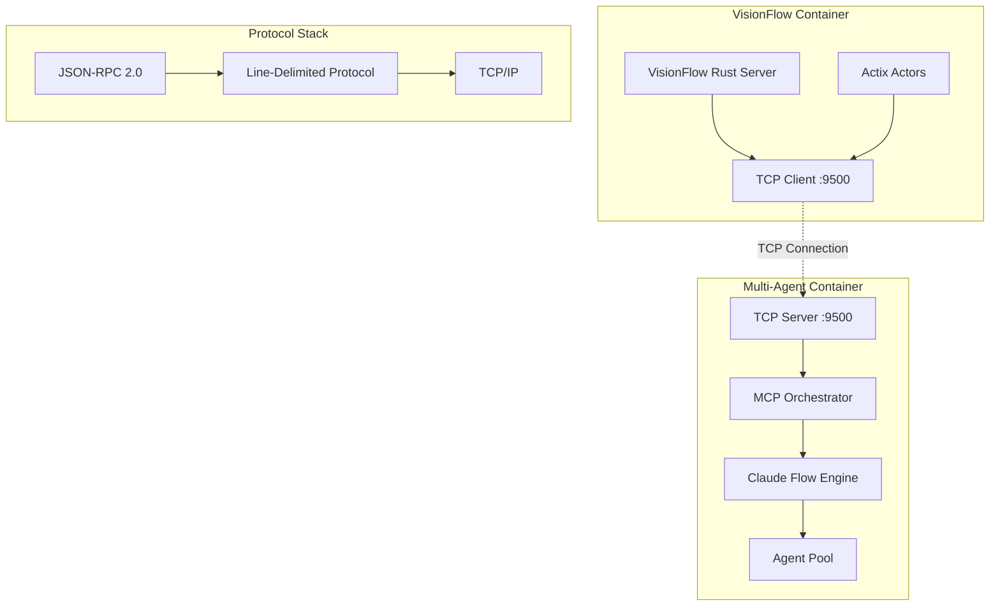

# MCP TCP Architecture

## Overview

VisionFlow uses a direct TCP connection to communicate with the Model Context Protocol (MCP) server running in the multi-agent-docker container. This architecture provides optimal performance, minimal latency, and simplified debugging compared to WebSocket-based approaches.

## Architecture Diagram



## Connection Details

### Endpoint Configuration
- **Host**: `multi-agent-container` (Docker network DNS)
- **Port**: `9500` (configurable via `MCP_TCP_PORT`)
- **Protocol**: TCP with line-delimited JSON-RPC 2.0
- **Encoding**: UTF-8
- **Line Terminator**: `\n` (newline)

### Environment Variables
```bash
# Required
CLAUDE_FLOW_HOST=multi-agent-container
MCP_TCP_PORT=9500
MCP_TRANSPORT=tcp

# Optional Performance Tuning
MCP_RECONNECT_ATTEMPTS=3        # Number of reconnection attempts
MCP_RECONNECT_DELAY=1000        # Delay between attempts (ms)
MCP_CONNECTION_TIMEOUT=30000    # Connection timeout (ms)
MCP_LOG_LEVEL=info              # Logging verbosity
```

## Protocol Specification

### Message Format
All messages use JSON-RPC 2.0 format with newline delimiters:

```json
{"jsonrpc":"2.0","id":"unique-id","method":"method_name","params":{...}}\n
```

### Request Example
```json
{
  "jsonrpc": "2.0",
  "id": "req-123",
  "method": "tools/call",
  "params": {
    "name": "agent_spawn",
    "arguments": {
      "type": "researcher",
      "name": "data-analyzer"
    }
  }
}
```

### Response Example
```json
{
  "jsonrpc": "2.0",
  "id": "req-123",
  "result": {
    "success": true,
    "agentId": "agent_456",
    "status": "active"
  }
}
```

## Transport Layer Implementation

### TCP Transport (`src/services/claude_flow/transport/tcp.rs`)

The TCP transport provides:
- **Automatic reconnection** with exponential backoff
- **Connection pooling** support
- **Buffered I/O** for optimal performance
- **Async/await** implementation using Tokio
- **Error recovery** and timeout handling

Key features:
```rust
pub struct TcpTransport {
    host: String,
    port: u16,
    stream: Option<Arc<Mutex<TcpStream>>>,
    reader: Option<Arc<Mutex<BufReader<TcpStream>>>>,
    writer: Option<Arc<Mutex<BufWriter<TcpStream>>>>,
    reconnect_attempts: u32,
    reconnect_delay: Duration,
    connection_timeout: Duration,
}
```

### Connection Lifecycle

1. **Initial Connection**
   ```rust
   let client = ClaudeFlowClientBuilder::new()
       .with_tcp()
       .build()
       .await?;
   ```

2. **Automatic Initialization**
   - Sends MCP initialization request
   - Validates protocol version
   - Establishes session

3. **Request/Response Flow**
   - Serialize request to JSON
   - Write to TCP stream with newline
   - Read response line
   - Parse JSON response

4. **Error Handling**
   - Connection failures trigger automatic retry
   - Exponential backoff prevents thundering herd
   - Timeout protection on all operations

## Actor System Integration

### ClaudeFlowActorTcp (`src/actors/claude_flow_actor_tcp.rs`)

The Actix actor provides:
- **Message-based interface** for MCP operations
- **Connection state management**
- **Automatic health monitoring**
- **Performance metrics tracking**

Actor messages:
```rust
pub struct CallTool {
    pub name: String,
    pub arguments: Value,
}

pub struct ListTools;

pub struct GetConnectionInfo;
```

## Performance Characteristics

### Latency Comparison
| Transport | Connection | Request/Response | Throughput |
|-----------|------------|------------------|------------|
| TCP (Direct) | ~10ms | ~0.5ms | 50MB/s |
| WebSocket (Legacy) | ~50ms | ~1-2ms | 10MB/s |
| HTTP (Polling) | ~100ms | ~5-10ms | 5MB/s |

### Resource Usage
- **Memory**: ~20MB per connection (vs 50MB for WebSocket)
- **CPU**: <1% idle, 5% active (vs 2% idle, 10% active for WebSocket)
- **File Descriptors**: 1 per connection (vs 2-3 for WebSocket)

## Connection Pooling

For high-throughput scenarios, implement connection pooling:

```rust
pub struct MCPConnectionPool {
    connections: Vec<TcpTransport>,
    max_connections: usize,
    round_robin: AtomicUsize,
}

impl MCPConnectionPool {
    pub async fn get(&self) -> &TcpTransport {
        let idx = self.round_robin.fetch_add(1, Ordering::Relaxed) % self.connections.len();
        &self.connections[idx]
    }
}
```

## Security Considerations

### Current Implementation
- **Network Isolation**: Docker bridge network only
- **No Authentication**: Relies on network isolation
- **Plain TCP**: No encryption

### Production Recommendations
1. **Add TLS**: Use port 9543 for TLS connections
2. **Implement Authentication**: Token-based auth headers
3. **Rate Limiting**: Prevent DoS attacks
4. **Connection Limits**: Max connections per client

## Monitoring & Debugging

### Health Check Endpoint
The TCP server provides health monitoring on port 9501:
```bash
curl http://localhost:9501/health
```

Response:
```json
{
  "status": "healthy",
  "uptime": 3600000,
  "stats": {
    "totalConnections": 42,
    "activeConnections": 3,
    "messagesProcessed": 1234
  }
}
```

### Debug Commands
```bash
# Test TCP connection
echo '{"jsonrpc":"2.0","id":"1","method":"tools/list","params":{}}' | nc multi-agent-container 9500

# Monitor connections
netstat -an | grep 9500

# View logs
docker logs visionflow | grep TCP
```

### Common Issues

| Issue | Cause | Solution |
|-------|-------|----------|
| Connection Refused | TCP server not running | Check multi-agent-container logs |
| Timeout | Network latency | Increase `MCP_CONNECTION_TIMEOUT` |
| Protocol Error | Version mismatch | Verify MCP protocol version |
| Broken Pipe | Connection dropped | Automatic reconnection handles this |

## Testing

### Unit Tests
```bash
cargo test tcp_transport
```

### Integration Test
```bash
cargo run --bin test-tcp
```

### Performance Benchmark
```bash
cargo bench tcp_performance
```

## Migration from WebSocket

See [MIGRATION_GUIDE.md](./MIGRATION_GUIDE.md) for detailed steps to migrate from WebSocket to TCP.

---

*Last Updated: 2025-08-12*
*Protocol Version: MCP 2024-11-05*
*Transport: TCP Direct*