# Mermaid Diagram Best Practices for VisionFlow

This guide provides comprehensive best practices for creating and maintaining Mermaid diagrams in the VisionFlow documentation.

## Quick Reference

### ✅ Do's and ❌ Don'ts

| ✅ **DO** | ❌ **DON'T** |
|----------|-------------|
| Use proper diagram declarations | Start without `graph TD` or `flowchart LR` |
| Use single spaces around arrows | Use multiple spaces or no spaces |
| Use `color` in style definitions | Use `colour` (British spelling) |
| Use meaningful node IDs | Use single characters for complex diagrams |
| Include closing `\`\`\`` | Leave diagram blocks unclosed |
| Test diagrams before committing | Assume syntax is correct |

## Diagram Types and Syntax

### 1. Graph/Flowchart Diagrams

**Basic Structure:**
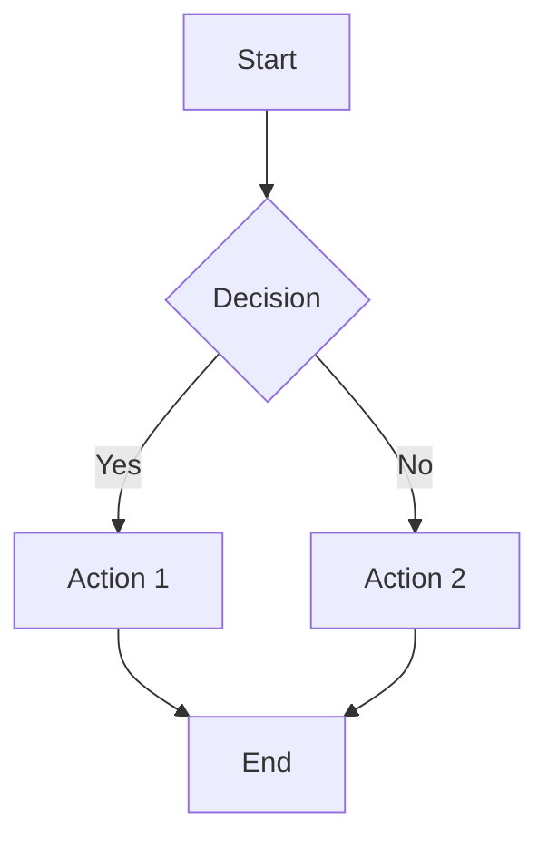

**Best Practices:**
- Always specify direction: `TD` (Top Down), `LR` (Left Right), `BT` (Bottom Top), `RL` (Right Left)
- Use descriptive node labels in square brackets
- Keep arrow labels concise but meaningful
- Use consistent node ID naming (e.g., `NodeA`, `NodeB` vs `A`, `B`)

### 2. Sequence Diagrams

**Basic Structure:**
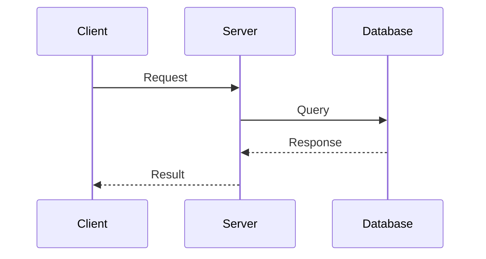

**Best Practices:**
- Define participants explicitly at the top
- Use `->>`for synchronous calls
- Use `-->>` for responses/returns
- Use `->` for asynchronous calls
- Include meaningful message labels

### 3. Class Diagrams

**Basic Structure:**
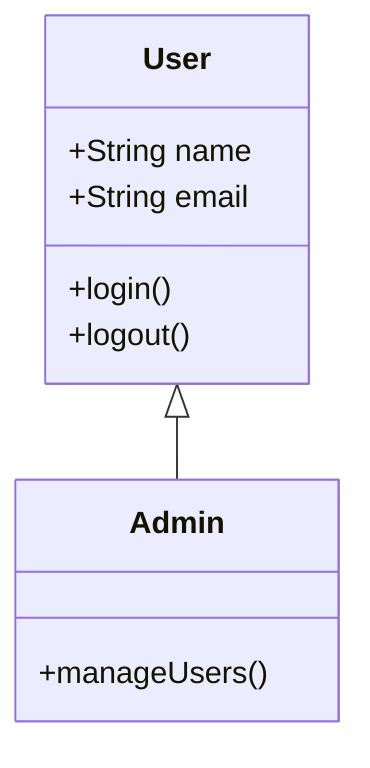

**Best Practices:**
- Use proper visibility indicators (`+` public, `-` private, `#` protected)
- Group related methods and properties
- Show inheritance relationships clearly
- Keep class definitions focused and cohesive

### 4. State Diagrams

**Basic Structure:**
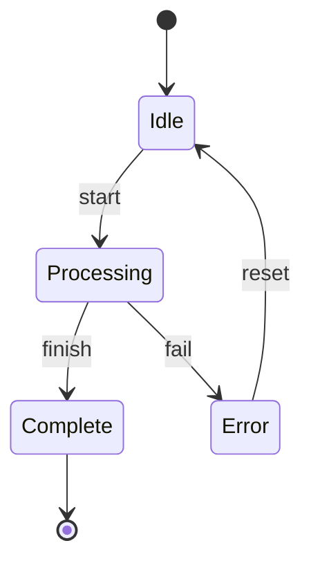

**Best Practices:**
- Use `stateDiagram-v2` for better features
- Include start `[*]` and end states
- Label transitions clearly
- Keep state names descriptive but concise

## Styling and Formatting

### Color and Style Definitions

**✅ Correct Syntax:**
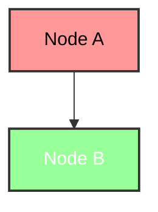

**❌ Common Mistakes:**
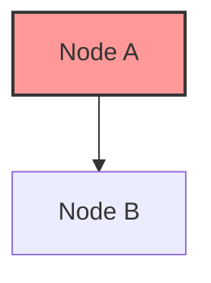

### VisionFlow Color Palette

Use these standardized colors for consistency:

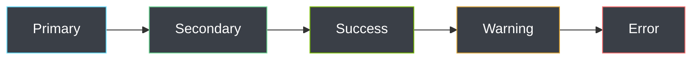

**Color Reference:**
- **Primary Blue**: `#61DAFB` (React blue)
- **Success Green**: `#68D391` 
- **Performance Green**: `#76B900`
- **Warning Orange**: `#D69E2E`
- **Error Red**: `#F56565`
- **Purple**: `#9F7AEA`
- **Background**: `#3A3F47`
- **Text**: `#FFFFFF` (white on dark) or `#000000` (black on light)

## Arrow Types and Usage

### Standard Arrows
```mermaid
graph LR
    A --> B  %% Solid arrow
    C -.-> D  %% Dotted arrow  
    E ==> F  %% Thick arrow
    G --- H  %% Line without arrow
    I -.- J  %% Dotted line without arrow
```

### Bidirectional Arrows
```mermaid
graph LR
    A <--> B  %% Bidirectional solid
    C <-.-> D  %% Bidirectional dotted
    E <==> F  %% Bidirectional thick
```

### Arrow Labels
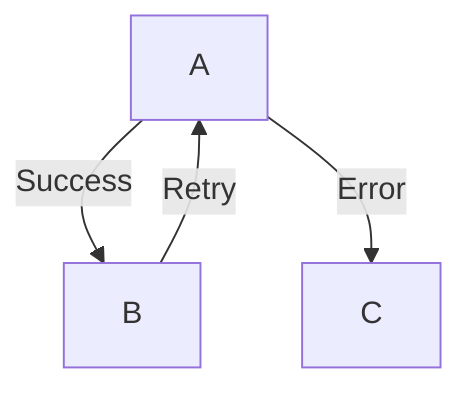

## Node Types and Shapes

### Shape Reference
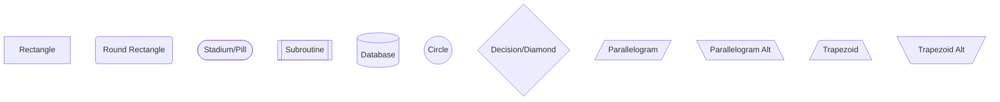

### When to Use Each Shape

| Shape | Use Case | Example |
|-------|----------|---------|
| Rectangle `[text]` | General processes, components | `[User Registration]` |
| Circle `((text))` | Start/end points, events | `((Start))` |
| Diamond `{text}` | Decisions, conditionals | `{Valid Input?}` |
| Database `[(text)]` | Data storage | `[(User Database)]` |
| Subroutine `[[text]]` | Sub-processes | `[[Validate Email]]` |

## Common Issues and Solutions

### 1. Diagram Not Rendering

**Problem**: Diagram appears as plain text
```markdown
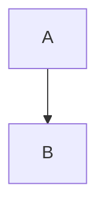

**Solution**: Check for:
- Proper opening: `\`\`\`mermaid`
- Proper closing: `\`\`\``
- Valid diagram declaration
- Correct indentation

### 2. Syntax Errors

**Problem**: "Syntax error in graph" message

**Common Causes & Fixes:**
```mermaid
%% ❌ Wrong: Missing declaration
A --> B

%% ✅ Correct: Proper declaration
graph TD
    A --> B

%% ❌ Wrong: Invalid characters
A[Node`A] --> B

%% ✅ Correct: Clean labels
A[Node A] --> B

%% ❌ Wrong: Unmatched quotes
A["Unclosed quote] --> B

%% ✅ Correct: Properly quoted
A["Properly quoted"] --> B
```

### 3. Style Issues

**Problem**: Styles not applying

```mermaid
%% ❌ Wrong: Style before node definition
style A fill:#ff0000
graph TD
    A --> B

%% ✅ Correct: Style after diagram
graph TD
    A --> B
    
style A fill:#ff0000,stroke:#333,color:#fff
```

## Performance Considerations

### Large Diagrams
- Keep diagrams under 50 nodes when possible
- Use subgraphs to organize complex diagrams
- Consider splitting very large diagrams into multiple smaller ones

### Subgraph Usage
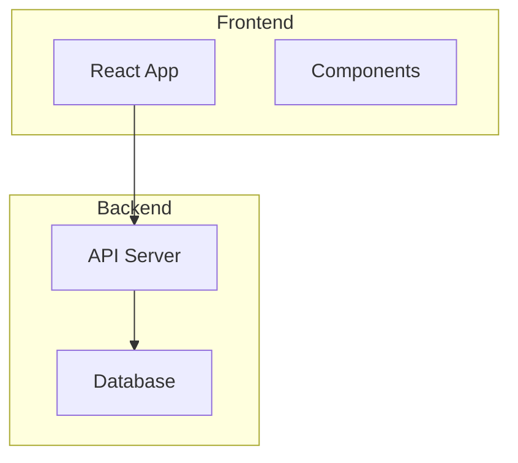

## Documentation Integration

### File Organization
```
docs/
├── architecture/
│   ├── system-overview.md     # High-level architecture
│   ├── components.md          # Component diagrams
│   └── data-flow.md          # Data flow diagrams
├── api/
│   ├── rest/                 # REST API docs
│   └── websocket/            # WebSocket docs
└── guides/
    └── mermaid-guide.md      # This guide
```

### Diagram Placement
- **Architecture diagrams**: In `/docs/architecture/`
- **API flow diagrams**: In respective API documentation
- **Component diagrams**: In component-specific documentation
- **Process diagrams**: In feature documentation

## Validation and Testing

### Pre-Commit Checklist
- [ ] Diagram renders correctly in preview
- [ ] All nodes are reachable
- [ ] Labels are clear and informative
- [ ] Colors follow VisionFlow palette
- [ ] Syntax follows best practices
- [ ] No spelling errors in labels

### Automated Validation
Run the validation script before committing:
```bash
python scripts/validate_mermaid_diagrams.py
```

### Manual Testing
1. Copy diagram to [Mermaid Live Editor](https://mermaid.live/)
2. Verify rendering
3. Test different themes if applicable
4. Check responsiveness on mobile

## Advanced Features

### Click Events (For Interactive Docs)
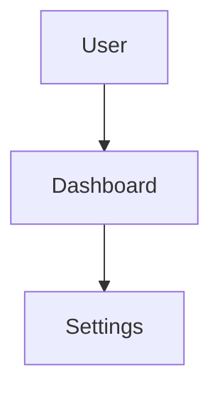

### Git Integration
```mermaid
gitgraph
    commit
    branch develop
    checkout develop
    commit
    commit
    checkout main
    merge develop
```

### Timeline/Gantt Charts
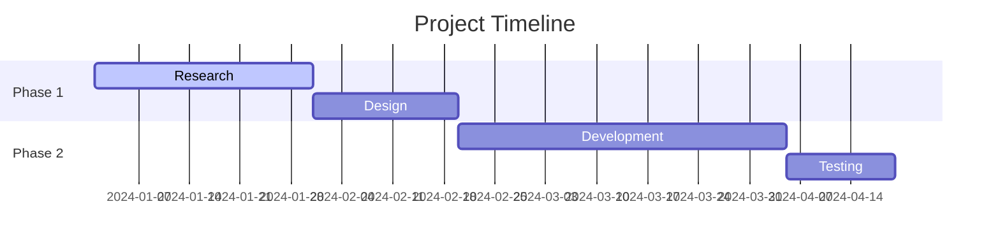

## Accessibility

### Alt Text and Labels
- Use descriptive node labels
- Avoid relying solely on color to convey meaning
- Include text descriptions for complex diagrams
- Consider screen reader compatibility

### Color Contrast
- Ensure sufficient contrast (4.5:1 minimum)
- Test with colorblind simulation tools
- Provide alternative text descriptions

## Maintenance

### Regular Updates
- Review diagrams quarterly for accuracy
- Update diagrams when architecture changes
- Validate all diagrams after major updates
- Keep diagram complexity manageable

### Version Control
- Include meaningful commit messages for diagram changes
- Use descriptive branch names for diagram updates
- Tag major diagram revisions

## Tools and Resources

### Recommended Tools
- **Mermaid Live Editor**: https://mermaid.live/
- **VS Code Extension**: Mermaid Preview
- **IntelliJ Plugin**: Mermaid Language Support
- **Validation Script**: `scripts/validate_mermaid_diagrams.py`

### Learning Resources
- **Official Mermaid Docs**: https://mermaid.js.org/
- **Syntax Reference**: https://mermaid.js.org/intro/syntax-reference.html
- **Examples Gallery**: https://mermaid.js.org/syntax/examples.html

## Contributing

### New Diagram Checklist
1. Follow naming conventions
2. Use standard colors and styles  
3. Include proper documentation
4. Test rendering
5. Run validation script
6. Get review from team

### Review Process
1. Check syntax correctness
2. Verify content accuracy
3. Ensure style consistency
4. Test accessibility
5. Validate against guidelines

---

*This guide is maintained by the VisionFlow documentation team. Last updated: September 2025*