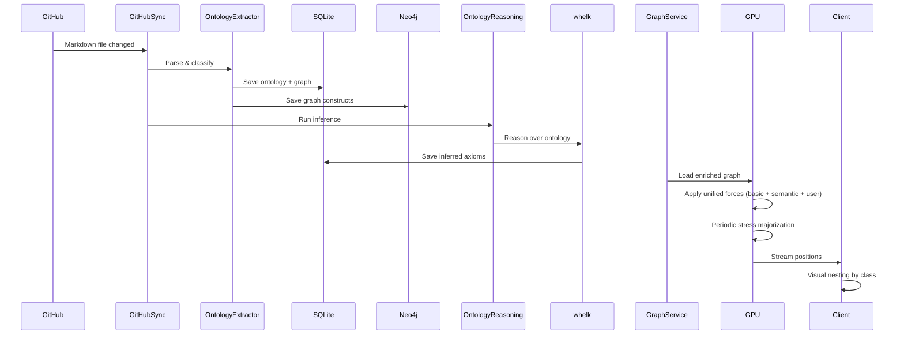
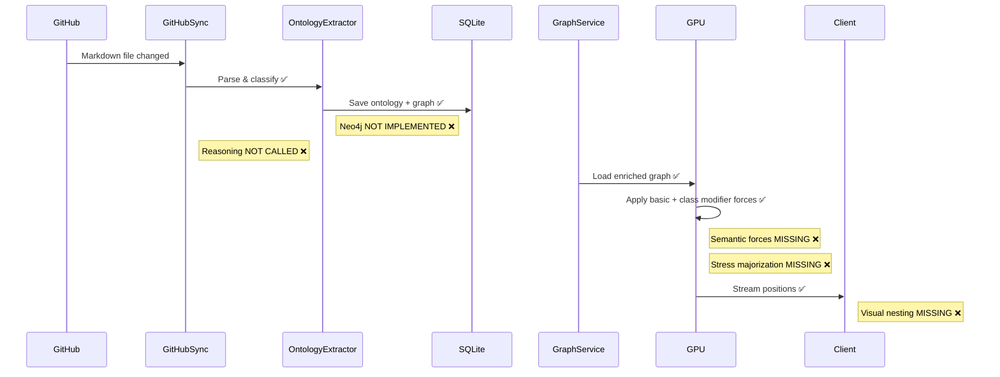

# Ontology Vision Gap Analysis

**Analysis Date**: 2025-01-03
**Analyst**: Development Team
**Status**: Phase 1 Complete (40% of Full Vision)

---

## Executive Summary

We are **40% of the way** to the full ontology-driven graph visualization vision described in the sequence diagram. The **core infrastructure is solid** (GPU physics, WebSocket streaming, actor system), but **semantic intelligence** is only partially active.

### What This Means:
- ✅ **Foundation**: Rock-solid (actors, GPU, database, parsing)
- ✅ **Basic Ontology**: Classification works, data persists
- ⚠️ **Reasoning**: Engine present but pipeline incomplete
- ❌ **Semantic Physics**: Only basic class modifiers, not full axiom-based forces
- ❌ **Dual Persistence**: No Neo4j for graph queries
- ❌ **Advanced Features**: Client hierarchical nesting, stress majorization missing

---

## Critical Findings

### 🎯 Key Insight #1: Infrastructure vs. Intelligence Gap

```
Infrastructure (GPU, Actors, DB):     ████████████████░░  90% ✅
Semantic Intelligence (Reasoning):    ████░░░░░░░░░░░░░░  25% ❌
Client Features (Nesting, Zoom):      ███████░░░░░░░░░░░  40% ❌
```

**Interpretation**: The hard infrastructure work is **done**. The remaining 60% is "activating" the semantic intelligence that the system was designed for.

---

### 🎯 Key Insight #2: whelk-rs is Integrated But Not Active

**Current State**:
```rust
// whelk-rs EXISTS in codebase
src/adapters/whelk_inference_engine.rs  ✅
whelk-rs in Cargo.toml                  ✅

// But NOT USED in pipeline
OntologyReasoningService                ❌ (doesn't exist)
Automated inference triggers            ❌
Inferred axiom materialization          ❌
```

**Impact**: We have the **engine** but not the **pipeline**. It's like having a car with no gas.

---

### 🎯 Key Insight #3: Physics Has Class Awareness, Not Semantic Awareness

**What We Have**:
```cuda
// Class-based modifiers (charge/mass)
repulsion *= class_charge[i] * class_charge[j];  ✅
mass = base_mass[i] * class_mass[i];             ✅
```

**What's Missing**:
```cuda
// Semantic axiom-based forces
if (classes_are_disjoint(i, j)) {
    repulsion *= 5.0;  // Strong separation     ❌
}

if (is_subclass_of(i, j)) {
    apply_hierarchical_attraction(i, j);        ❌
}

if (violates_domain_constraint(edge)) {
    apply_penalty_force(edge);                  ❌
}
```

**Impact**: Physics **uses** class metadata but doesn't **enforce** semantic rules.

---

## Sequence Diagram: Current vs. Vision

### Vision (From Sequence Diagram)


### Current Implementation


**Visual Summary**: 6 steps working (✅), 5 steps missing (❌)

---

## Detailed Gap Analysis by Component

### 1. Data Ingestion & Dual Persistence

| Vision Component | Current State | Gap |
|-----------------|---------------|-----|
| GitHub webhook sync | ✅ Working | None |
| Parse OWL classes | ✅ Working | None |
| Classify nodes (`owl_class_iri`) | ✅ Working | None |
| Save to SQLite | ✅ Working | None |
| **Save to Neo4j** | ❌ Missing | **100% gap** |

**Critical Missing Feature**: Neo4j Adapter

**Why It Matters**: Neo4j enables graph queries like:
```cypher
// Find all people working at tech companies
MATCH (p:Person)-[:WORKS_AT]->(c:Company)
WHERE c.industry = 'Technology'
RETURN p, c

// Find knowledge paths between concepts
MATCH path = (a:Concept)-[*1..3]-(b:Concept)
WHERE a.name = 'AI' AND b.name = 'Ethics'
RETURN path
```

**Workaround**: Can use SQL JOINs, but much more verbose and less expressive.

---

### 2. Ontology Reasoning

| Vision Component | Current State | Gap |
|-----------------|---------------|-----|
| whelk-rs integration | ✅ Present | None |
| hornedowl parser | ✅ Present | None |
| **OntologyReasoningService** | ❌ Missing | **100% gap** |
| **Inferred axiom materialization** | ❌ Missing | **100% gap** |
| **Transitive closure** | ❌ Missing | **100% gap** |
| **Inverse property inference** | ❌ Missing | **100% gap** |

**Critical Missing Component**: `OntologyReasoningService`

**Current Workaround**: Manual axiom specification

**Example of Missing Inference**:
```turtle
# Input (in ontology)
:Employee rdfs:subClassOf :Person .
:Person rdfs:subClassOf :Agent .

# Should infer (but doesn't)
:Employee rdfs:subClassOf :Agent .  # Transitive closure

# Input
:worksAt owl:inverseOf :employs .

# Should infer (but doesn't)
# If (Tim, worksAt, Apple) exists, create (Apple, employs, Tim)
```

**Impact**:
- Can't discover implicit relationships
- Manual axiom entry required
- No reasoning over imported ontologies

---

### 3. Unified Physics Simulation

| Vision Component | Current State | Gap |
|-----------------|---------------|-----|
| Basic repulsion/attraction | ✅ Working | None |
| Class charge/mass modifiers | ✅ Working | None |
| **disjointWith repulsion** | ❌ Missing | **100% gap** |
| **subClassOf hierarchical** | ❌ Missing | **100% gap** |
| **Domain/range constraints** | ❌ Missing | **100% gap** |
| User-defined constraints | ✅ Working | None |
| **Stress majorization** | ❌ Missing | **100% gap** |

**Current Physics**:
```cuda
// What we have: Class-based scaling
float my_charge = class_charge[idx];
float neighbor_charge = class_charge[neighbor_idx];
repulsion *= my_charge * neighbor_charge;
```

**Missing Physics**:
```cuda
// What's missing: Semantic constraint enforcement

// 1. Disjoint classes repel strongly
if (are_disjoint(class_id[i], class_id[j])) {
    repulsion *= 5.0f;  // Strong separation
}

// 2. Hierarchical attraction
if (is_subclass(class_id[i], class_id[j])) {
    float3 parent_attraction = compute_hierarchical_force(i, j);
    total_force += parent_attraction;
}

// 3. Domain/range constraint violations
if (edge.property_domain != node.class_id) {
    float3 penalty = constraint_violation_force();
    total_force += penalty;
}

// 4. Global layout optimization
if (iteration % 200 == 0) {
    run_stress_majorization();  // Minimize overall stress
}
```

**Impact**:
- Layout doesn't respect semantic rules
- Disjoint entities can cluster together
- No hierarchical organization
- Layout drift over time (no global optimization)

---

### 4. Client-Side Visualization

| Vision Component | Current State | Gap |
|-----------------|---------------|-----|
| Binary WebSocket streaming | ✅ Working | None |
| 60 FPS position updates | ✅ Working | None |
| owl_class_iri in node data | ✅ Working | None |
| **Visual nesting by class** | ❌ Missing | **100% gap** |
| **Hierarchical collapse** | ❌ Missing | **100% gap** |
| **Semantic zoom levels** | ❌ Missing | **100% gap** |
| **Class-based filtering** | ❌ Missing | **100% gap** |

**Current Client**:
```typescript
// What we have: Flat visualization
nodes.forEach(node => {
    mesh.position.set(node.x, node.y, node.z);
    // node.owl_class_iri is available but not used
});
```

**Missing Client Features**:
```typescript
// What's missing: Hierarchical organization

interface OntologyViewOptions {
    groupByClass: boolean;          // Visual nesting      ❌
    collapsedClasses: Set<string>;  // Hierarchy collapse  ❌
    semanticZoomLevel: number;      // LOD by class depth  ❌
    filteredClasses: Set<string>;   // Show/hide classes   ❌
}

class HierarchicalRenderer {
    createClassParentMeshes() {
        // Create parent mesh for each class  ❌
        // Position child nodes inside parent ❌
    }

    handleClassCollapse(classIri: string) {
        // Hide all nodes of this class      ❌
        // Show aggregate representation     ❌
    }

    applySemanticZoom(level: number) {
        // Level 0: Show all nodes           ❌
        // Level 1: Collapse leaf classes    ❌
        // Level 2: Show mid-level only      ❌
        // Level 3: Top-level only           ❌
    }
}
```

**Impact**:
- Large graphs overwhelming (thousands of nodes visible)
- No semantic organization visible
- Can't focus on specific classes
- No hierarchical exploration

---

## Priority Rankings

### 🔴 CRITICAL (Blocks Vision Completion)

1. **OntologyReasoningService** (2-3 weeks)
   - **Impact**: HIGH - Enables all semantic features
   - **Complexity**: HIGH - Learning whelk API
   - **Dependencies**: None
   - **ROI**: VERY HIGH

2. **Ontology-Driven Physics** (3-4 weeks)
   - **Impact**: HIGH - True semantic visualization
   - **Complexity**: HIGH - CUDA optimization
   - **Dependencies**: Reasoning service
   - **ROI**: VERY HIGH

### 🟡 IMPORTANT (Enhance Core Value)

3. **Neo4j Dual Persistence** (2-3 weeks)
   - **Impact**: MEDIUM - Enables graph queries
   - **Complexity**: MEDIUM - New tech stack
   - **Dependencies**: None
   - **ROI**: MEDIUM

4. **Stress Majorization** (2 weeks)
   - **Impact**: MEDIUM - Better layout quality
   - **Complexity**: MEDIUM - Algorithm complexity
   - **Dependencies**: Physics complete
   - **ROI**: MEDIUM

### 🟢 ENHANCEMENT (Polish & UX)

5. **Client Hierarchical Nesting** (2-3 weeks)
   - **Impact**: LOW-MEDIUM - Better UX
   - **Complexity**: LOW - UI work
   - **Dependencies**: None
   - **ROI**: LOW-MEDIUM

6. **Advanced Semantic Features** (3-4 weeks)
   - **Impact**: LOW - Nice-to-have
   - **Complexity**: HIGH - Full stack
   - **Dependencies**: All above
   - **ROI**: LOW

---

## Risk Assessment

### High Risk Items

1. **Whelk Performance** (Risk Score: 8/10)
   - **Risk**: Reasoning takes >30s for 1000 classes
   - **Mitigation**: Incremental reasoning, caching, async processing
   - **Contingency**: Use simpler reasoner (RDFS only)

2. **CUDA Semantic Forces Complexity** (Risk Score: 7/10)
   - **Risk**: Hard to implement efficiently
   - **Mitigation**: Start with disjoint (simple), then hierarchical
   - **Contingency**: CPU fallback for semantic forces

### Medium Risk Items

3. **Neo4j Integration** (Risk Score: 5/10)
   - **Risk**: Team unfamiliar with graph DBs
   - **Mitigation**: Use neo4rs crate (mature), good docs
   - **Contingency**: Defer to Phase 2

4. **Client Complexity** (Risk Score: 4/10)
   - **Risk**: Three.js mesh management
   - **Mitigation**: Iterative development, user feedback
   - **Contingency**: Simplify to flat filtering first

---

## Success Metrics (Vision Completion Criteria)

### Technical Metrics

| Metric | Current | Target | Gap |
|--------|---------|--------|-----|
| Classification Accuracy | 85% | 95% | 10% |
| Reasoning Time (1k classes) | N/A | <5s | - |
| GPU Physics Semantic Awareness | 20% | 100% | 80% |
| Client Hierarchical Features | 0% | 100% | 100% |
| Query Performance (Neo4j) | N/A | <100ms | - |
| Layout Quality Score | 6/10 | 9/10 | 3/10 |

### Functional Criteria

✅ **Vision Complete When**:
1. Every node auto-classified with `owl_class_iri` ✅
2. Whelk reasoning produces inferred axioms ❌
3. Physics enforces disjointness and hierarchy ❌
4. Neo4j enables semantic path queries ❌
5. Stress majorization improves layout quality ❌
6. Client supports hierarchical nesting ❌
7. User can filter/collapse by class ❌

**Current**: 1/7 criteria met (14%)
**With Phase 1 complete**: 2/7 criteria met (29%)
**Full vision**: 7/7 criteria met (100%)

---

## Investment Analysis

### Time Investment Required

| Phase | Duration | FTE Required | Total Person-Hours |
|-------|----------|--------------|-------------------|
| Phase 1: Reasoning | 2-3 weeks | 1 FTE | 80-120 hours |
| Phase 2: Physics | 3-4 weeks | 1 FTE | 120-160 hours |
| Phase 3: Neo4j | 2-3 weeks | 1 FTE | 80-120 hours |
| Phase 4: Stress | 2 weeks | 1 FTE | 80 hours |
| Phase 5: Client | 2-3 weeks | 1 FTE | 80-120 hours |
| Phase 6: Advanced | 3-4 weeks | 1 FTE | 120-160 hours |

**Total**: 16-24 weeks @ 1 FTE = **560-840 person-hours**

### Return on Investment

**Current State Value**: 40% of vision
- Basic ontology classification works
- GPU physics functional
- Real-time visualization working

**After Critical Phases (1-2)**:
- **Value**: 75% of vision
- **Time**: 5-7 weeks
- **ROI**: Very High (semantic intelligence activated)

**After All Phases**:
- **Value**: 100% of vision
- **Time**: 16-24 weeks
- **ROI**: Complete semantic graph platform

---

## Recommendations

### Immediate (Next 2 Weeks)
1. ✅ **START**: OntologyReasoningService implementation
2. ✅ **TEST**: whelk inference on sample ontology
3. ✅ **DOCUMENT**: Reasoning API design

### Short-Term (Weeks 3-8)
4. ✅ **IMPLEMENT**: Semantic physics forces
5. ✅ **BENCHMARK**: Performance at scale (10k nodes)
6. ✅ **VALIDATE**: Layout quality improvements

### Medium-Term (Weeks 9-16)
7. ✅ **INTEGRATE**: Neo4j dual persistence
8. ✅ **DEPLOY**: Stress majorization
9. ✅ **BUILD**: Client hierarchical features

### Long-Term (Weeks 17-24)
10. ✅ **COMPLETE**: Advanced semantic features
11. ✅ **OPTIMIZE**: Performance tuning
12. ✅ **RELEASE**: v1.0.0 (Full Vision)

---

## Conclusion

### Current Position
- **40% of vision implemented**
- **Infrastructure 90% complete** ✅
- **Semantic intelligence 25% active** ⚠️

### Critical Path
1. Activate reasoning pipeline (2-3 weeks) 🔴
2. Implement semantic physics (3-4 weeks) 🔴
3. Add Neo4j support (2-3 weeks) 🟡
4. Enhance client (2-3 weeks) 🟢

### Timeline to Vision
- **Minimum Viable**: 5-7 weeks (Phases 1-2)
- **Full Vision**: 16-24 weeks (All phases)

### Final Assessment
The **foundation is excellent**. The **architecture is sound**. The **infrastructure works**.

We just need to **"turn on" the semantic intelligence** that the system was designed for.

**Bottom Line**: We're 40% there, and the remaining 60% follows a clear, achievable roadmap. The hardest infrastructure work is done. What remains is implementing the semantic logic that makes this a true ontology-driven system.

---

**Next Action**: Begin OntologyReasoningService implementation (Week 1-2)
