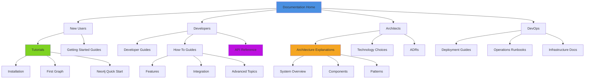

# VisionFlow Documentation

**Complete documentation for VisionFlow's enterprise-grade multi-agent knowledge graphing system.**

> **226 documents** organized using the **Diátaxis Framework** for maximum discoverability

---

## 🚀 Quickstart Paths

### ⚡ 5-Minute Start
1. **[Install VisionFlow](tutorials/01-installation.md)** → Deploy with Docker
2. **[Create First Graph](tutorials/02-first-graph.md)** → Launch AI agents
3. **[Navigate in 3D](guides/navigation-guide.md)** → Master the interface

### 👤 Choose Your Path

<table>
<tr>
<td valign="top" width="25%">

#### 🆕 New Users
*Just getting started?*

**Start here:**
- [What is VisionFlow?](OVERVIEW.md)
- [Installation](tutorials/01-installation.md)
- [First Graph](tutorials/02-first-graph.md)
- [Navigation Guide](guides/navigation-guide.md)

**Then:**
- [Configuration](guides/configuration.md)
- [Troubleshooting](guides/troubleshooting.md)

</td>
<td valign="top" width="25%">

#### 👨‍💻 Developers
*Building features?*

**Start here:**
- [Developer Journey](DEVELOPER_JOURNEY.md)
- [Development Setup](guides/developer/01-development-setup.md)
- [Project Structure](guides/developer/02-project-structure.md)

**Then:**
- [Adding Features](guides/developer/04-adding-features.md)
- [Testing Guide](guides/testing-guide.md)
- [Contributing](guides/developer/06-contributing.md)

</td>
<td valign="top" width="25%">

#### 🏗️ Architects
*Designing systems?*

**Start here:**
- [Architecture Overview](ARCHITECTURE_OVERVIEW.md)
- [Technology Choices](TECHNOLOGY_CHOICES.md)
- [System Overview](explanations/system-overview.md)

**Then:**
- [Hexagonal CQRS](explanations/architecture/hexagonal-cqrs.md)
- [Integration Patterns](explanations/architecture/integration-patterns.md)
- [Ports Overview](explanations/architecture/ports/01-overview.md)

</td>
<td valign="top" width="25%">

#### 🔧 DevOps
*Deploying to production?*

**Start here:**
- [Deployment Guide](guides/deployment.md)
- [Docker Compose](guides/docker-compose-guide.md)
- [Configuration](guides/configuration.md)

**Then:**
- [Operations Runbook](guides/operations/pipeline-operator-runbook.md)
- [Security](guides/security.md)
- [Telemetry](guides/telemetry-logging.md)

</td>
</tr>
</table>

---

## 📚 Documentation by Category

### 🎓 Tutorials (Learning-Oriented)
*Step-by-step lessons to learn by doing*

| Tutorial | What You'll Learn | Time |
|----------|-------------------|------|
| **[Installation](tutorials/01-installation.md)** | Docker and native setup for all platforms | 10 min |
| **[First Graph](tutorials/02-first-graph.md)** | Create your first visualization with AI agents | 15 min |
| **[Neo4j Quick Start](tutorials/neo4j-quick-start.md)** | Query and explore the graph database | 20 min |

---

### 🛠️ How-To Guides (Goal-Oriented)
*Practical instructions for specific tasks*

<details>
<summary><b>🎯 Core Features (8 guides)</b></summary>

| Guide | Task |
|-------|------|
| **[Navigation Guide](guides/navigation-guide.md)** | 3D interface controls, camera, selection |
| **[Filtering Nodes](guides/features/filtering-nodes.md)** | Client-side graph filtering with real-time updates |
| **[Intelligent Pathfinding](guides/features/intelligent-pathfinding.md)** | Graph traversal and shortest paths |
| **[Natural Language Queries](guides/features/natural-language-queries.md)** | Ask questions in plain English |
| **[Semantic Forces](guides/features/semantic-forces.md)** | Physics-based meaningful layouts |
| **[Configuration](guides/configuration.md)** | Environment variables and settings |
| **[Troubleshooting](guides/troubleshooting.md)** | Solve common issues |
| **[Extending the System](guides/extending-the-system.md)** | Plugin patterns and custom components |

</details>

<details>
<summary><b>🔐 Authentication & Security (3 guides)</b></summary>

| Guide | Task |
|-------|------|
| **[Auth & User Settings](guides/features/auth-user-settings.md)** | User authentication system implementation |
| **[Nostr Authentication](guides/features/nostr-auth.md)** | Decentralized identity with Nostr protocol |
| **[Settings Authentication](guides/features/settings-authentication.md)** | Secure settings API with JWT |

</details>

<details>
<summary><b>🤖 AI Agent System (4 guides)</b></summary>

| Guide | Task |
|-------|------|
| **[Agent Orchestration](guides/agent-orchestration.md)** | Deploy and manage 50+ concurrent AI agents |
| **[Orchestrating Agents](guides/orchestrating-agents.md)** | Advanced coordination patterns |
| **[Multi-Agent Skills](guides/multi-agent-skills.md)** | Agent capabilities and specializations |
| **[AI Models & Services](guides/ai-models/README.md)** | DeepSeek, Perplexity, RAGFlow, Z.AI integrations |

</details>

<details>
<summary><b>🗄️ Neo4j & Data (6 guides)</b></summary>

| Guide | Task |
|-------|------|
| **[Neo4j Integration](guides/neo4j-integration.md)** | Work with graph database operations |
| **[Neo4j Implementation Roadmap](guides/neo4j-implementation-roadmap.md)** | Migration planning and timeline |
| **[Neo4j Migration](guides/neo4j-migration.md)** | Step-by-step migration process |
| **[Local File Sync Strategy](guides/features/local-file-sync-strategy.md)** | File synchronization patterns |
| **[GitHub Pagination Fix](guides/features/github-pagination-fix.md)** | Handle large GitHub API responses |
| **[Pipeline Admin API](guides/pipeline-admin-api.md)** | Control GitHub sync pipelines |

</details>

<details>
<summary><b>🦉 Ontology & Reasoning (4 guides)</b></summary>

| Guide | Task |
|-------|------|
| **[Ontology Parser](guides/ontology-parser.md)** | Parse and validate OWL ontologies |
| **[Ontology Reasoning Integration](guides/ontology-reasoning-integration.md)** | Enable semantic inference with Whelk |
| **[Ontology Storage Guide](guides/ontology-storage-guide.md)** | Persist ontologies in Neo4j |
| **[Ontology Semantic Forces](guides/ontology-semantic-forces.md)** | Visualize constraints as physics forces |

</details>

<details>
<summary><b>🚀 Deployment & Operations (9 guides)</b></summary>

| Guide | Task |
|-------|------|
| **[Deployment](guides/deployment.md)** | Production deployment strategies |
| **[Docker Compose Guide](guides/docker-compose-guide.md)** | Multi-container orchestration |
| **[Docker Environment Setup](guides/docker-environment-setup.md)** | Container configuration details |
| **[Development Workflow](guides/development-workflow.md)** | Git, testing, CI/CD process |
| **[Testing Guide](guides/testing-guide.md)** | Unit, integration, E2E testing |
| **[Security](guides/security.md)** | Authentication, authorization, secrets |
| **[Telemetry Logging](guides/telemetry-logging.md)** | Observability and monitoring |
| **[Pipeline Operator Runbook](guides/operations/pipeline-operator-runbook.md)** | Operations playbook for production |
| **[Contributing](guides/developer/06-contributing.md)** | Code style, PRs, documentation |

</details>

<details>
<summary><b>🏢 Infrastructure (6 guides)</b></summary>

| Guide | Task |
|-------|------|
| **[Architecture Overview](guides/infrastructure/architecture.md)** | Multi-agent Docker system design |
| **[Docker Environment](guides/infrastructure/docker-environment.md)** | Container setup and management |
| **[Tools](guides/infrastructure/tools.md)** | Available MCP tools and integrations |
| **[Port Configuration](guides/infrastructure/port-configuration.md)** | Network and service ports |
| **[Troubleshooting](guides/infrastructure/troubleshooting.md)** | Infrastructure-specific issues |
| **[Goalie Integration](guides/infrastructure/goalie-integration.md)** | Quality gates and automated testing |

</details>

<details>
<summary><b>🥽 XR & Multi-User (2 guides)</b></summary>

| Guide | Task |
|-------|------|
| **[Vircadia XR Complete Guide](guides/vircadia-xr-complete-guide.md)** | Meta Quest 3 VR implementation |
| **[Vircadia Multi-User Guide](guides/vircadia-multi-user-guide.md)** | Collaborative VR experiences |

</details>

<details>
<summary><b>👨‍💻 Developer (10 guides)</b></summary>

| Guide | Priority | Task |
|-------|----------|------|
| **[Development Setup](guides/developer/01-development-setup.md)** | ⭐⭐⭐ | IDE, dependencies, local environment |
| **[Project Structure](guides/developer/02-project-structure.md)** | ⭐⭐⭐ | Codebase organization and modules |
| **[Adding Features](guides/developer/04-adding-features.md)** | ⭐⭐ | Feature development workflow |
| **[WebSocket Best Practices](guides/developer/websocket-best-practices.md)** | ⭐ | Real-time communication patterns |
| **[JSON Serialization Patterns](guides/developer/json-serialization-patterns.md)** | ⭐ | Data serialization strategies |
| **[Test Execution](guides/developer/test-execution.md)** | ⭐ | Running and debugging tests |

</details>

<details>
<summary><b>📊 Client Development (3 guides)</b></summary>

| Guide | Task |
|-------|------|
| **[State Management](guides/client/state-management.md)** | React state patterns with Zustand |
| **[Three.js Rendering](guides/client/three-js-rendering.md)** | 3D visualization pipeline |
| **[XR Integration](guides/client/xr-integration.md)** | WebXR implementation details |

</details>

<details>
<summary><b>🔄 Advanced Features (6 guides)</b></summary>

| Guide | Task |
|-------|------|
| **[Semantic Features Implementation](guides/semantic-features-implementation.md)** | Natural language query system |
| **[Hierarchy Integration](guides/hierarchy-integration.md)** | Hierarchical graph layouts |
| **[Stress Majorization Guide](guides/stress-majorization-guide.md)** | Advanced layout algorithm |
| **[Ontology Sync Enhancement](guides/features/ontology-sync-enhancement.md)** | GitHub ontology sync with HNSW vector search |
| **[DeepSeek Verification](guides/features/deepseek-verification.md)** | LLM API integration testing |
| **[DeepSeek Deployment](guides/features/deepseek-deployment.md)** | Deploy DeepSeek skill container |

</details>

<details>
<summary><b>🔧 Migration (2 guides)</b></summary>

| Guide | Task |
|-------|------|
| **[GraphServiceActor Migration](guides/graphserviceactor-migration.md)** | Actor system migration patterns |
| **[JSON to Binary Protocol](guides/migration/json-to-binary-protocol.md)** | WebSocket protocol upgrade |

</details>

---

### 🧠 Explanations (Understanding-Oriented)
*Deep dives into architecture, design decisions, and theory*

<details>
<summary><b>🏛️ High-Level Architecture (4 documents)</b></summary>

| Document | Description |
|----------|-------------|
| **[Architecture Overview](ARCHITECTURE_OVERVIEW.md)** | Complete system architecture with diagrams |
| **[Developer Journey](DEVELOPER_JOURNEY.md)** | Step-by-step codebase learning path |
| **[System Overview](OVERVIEW.md)** | What VisionFlow is and why it exists |
| **[Technology Choices](TECHNOLOGY_CHOICES.md)** | Technology stack rationale |

</details>

<details>
<summary><b>🔷 System Architecture (21 documents)</b></summary>

**⭐ NEW Core Architecture Docs (Dec 2025):**
| Document | Description |
|----------|-------------|
| **[Server Architecture](concepts/architecture/core/server.md)** | ⭐ **21 actors, ports/adapters, Neo4j** |
| **[Actor System Guide](guides/architecture/actor-system.md)** | ⭐ **Actor patterns, debugging, best practices** |
| **[Database Architecture](explanations/architecture/database-architecture.md)** | ⭐ **Neo4j schema, queries, performance** |

**System Architecture:**
| Document | Description |
|----------|-------------|
| **[System Overview](explanations/system-overview.md)** | Complete architectural blueprint |
| **[Hexagonal CQRS](explanations/architecture/hexagonal-cqrs.md)** | Ports & adapters with command/query separation |
| **[Services Architecture](explanations/architecture/services-architecture.md)** | Business logic layer design |
| **[Multi-Agent System](explanations/architecture/multi-agent-system.md)** | AI agent coordination patterns |
| **[Data Flow Complete](explanations/architecture/data-flow-complete.md)** | End-to-end data pipeline |
| **[Pipeline Integration](explanations/architecture/pipeline-integration.md)** | GitHub → Neo4j → GPU flow |
| **[Pipeline Sequence Diagrams](explanations/architecture/pipeline-sequence-diagrams.md)** | Visual interaction flows |
| **[Integration Patterns](explanations/architecture/integration-patterns.md)** | System integration strategies |
| **[GitHub Sync Service Design](explanations/architecture/github-sync-service-design.md)** | Streaming ontology sync |
| **[Quick Reference](explanations/architecture/quick-reference.md)** | Architecture cheat sheet |
| **[Analytics Visualization](explanations/architecture/analytics-visualization.md)** | UI/UX design patterns |
| **[Services Layer](explanations/architecture/services-layer.md)** | Business logic refactoring |
| **[Ontology Physics Integration](explanations/architecture/ontology-physics-integration.md)** | Wire OWL constraints to GPU physics |
| **[RuVector Integration](explanations/architecture/ruvector-integration.md)** | 150x faster HNSW vector search |
| **[API Handlers Reference](explanations/architecture/api-handlers-reference.md)** | Handler patterns and examples |
| **[CQRS Directive Template](explanations/architecture/cqrs-directive-template.md)** | Command/query templates |
| **[Ontology Analysis](explanations/architecture/ontology-analysis.md)** | Architecture decision analysis |
| **[XR Immersive System](explanations/architecture/xr-immersive-system.md)** | Quest 3 WebXR architecture |

</details>

<details>
<summary><b>🗄️ Database & Persistence (3 documents)</b></summary>

| Document | Description |
|----------|-------------|
| **[Database Architecture](explanations/architecture/database-architecture.md)** | ⭐ **Neo4j schema, queries, performance** |
| **[Adapter Patterns](explanations/architecture/adapter-patterns.md)** | Repository implementation patterns |
| **[Ontology Storage Architecture](explanations/architecture/ontology-storage-architecture.md)** | OWL persistence in Neo4j |

</details>

<details>
<summary><b>🦉 Ontology & Reasoning (11 documents)</b></summary>

**Architecture:**
| Document | Description |
|----------|-------------|
| **[Ontology Reasoning Pipeline](explanations/architecture/ontology-reasoning-pipeline.md)** | Whelk inference integration |
| **[Reasoning Data Flow](explanations/architecture/reasoning-data-flow.md)** | Inference pipeline stages |
| **[Reasoning Tests Summary](explanations/architecture/reasoning-tests-summary.md)** | Test coverage report |

**Concepts:**
| Document | Description |
|----------|-------------|
| **[Reasoning Engine](explanations/ontology/reasoning-engine.md)** | Inference engine concepts |
| **[Neo4j Integration](explanations/ontology/neo4j-integration.md)** | Graph database integration |
| **[Ontology Pipeline Integration](explanations/ontology/ontology-pipeline-integration.md)** | End-to-end OWL processing |
| **[Ontology Typed System](explanations/ontology/ontology-typed-system.md)** | Type system design |
| **[Client-Side Hierarchical LOD](explanations/ontology/client-side-hierarchical-lod.md)** | Level-of-detail optimization |
| **[Hierarchical Visualization](explanations/ontology/hierarchical-visualization.md)** | Tree and DAG layouts |
| **[Intelligent Pathfinding System](explanations/ontology/intelligent-pathfinding-system.md)** | Graph traversal theory |
| **[Enhanced Parser](explanations/ontology/enhanced-parser.md)** | OWL parser v2 design |

</details>

<details>
<summary><b>⚡ Visualization & Physics (8 documents)</b></summary>

| Document | Description |
|----------|-------------|
| **[Semantic Physics System](explanations/architecture/semantic-physics-system.md)** | Force-directed layout engine |
| **[Semantic Forces System](explanations/architecture/semantic-forces-system.md)** | Physics constraint generation |
| **[Semantic Physics](explanations/architecture/semantic-physics.md)** | Theory and algorithms |
| **[GPU Semantic Forces](explanations/architecture/gpu-semantic-forces.md)** | 39 CUDA kernels |
| **[Stress Majorization](explanations/architecture/stress-majorization.md)** | Graph layout technique |
| **[Hierarchical Visualization](explanations/architecture/hierarchical-visualization.md)** | DAG and tree layouts |
| **[Semantic Forces](explanations/physics/semantic-forces.md)** | Physics constraint design |
| **[Semantic Forces Actor](explanations/physics/semantic-forces-actor.md)** | Actor system integration |

</details>

<details>
<summary><b>🎮 GPU Acceleration (3 documents)</b></summary>

| Document | Description |
|----------|-------------|
| **[GPU Communication Flow](explanations/architecture/gpu/communication-flow.md)** | CPU-GPU data transfer |
| **[GPU Optimizations](explanations/architecture/gpu/optimizations.md)** | Performance tuning strategies |
| **[GPU README](explanations/architecture/gpu/readme.md)** | GPU subsystem overview |

</details>

<details>
<summary><b>💻 Client-Server (4 documents)</b></summary>

| Document | Description |
|----------|-------------|
| **[Client](explanations/architecture/core/client.md)** | React Three.js frontend architecture |
| **[Server](explanations/architecture/core/server.md)** | Rust Actix backend architecture |
| **[Visualization](explanations/architecture/core/visualization.md)** | 3D rendering pipeline |
| **[WebSocket Protocol](explanations/architecture/components/websocket-protocol.md)** | Binary protocol design |

</details>

<details>
<summary><b>🔌 Ports (Hexagonal Architecture) (7 documents)</b></summary>

| Document | Description |
|----------|-------------|
| **[Ports Overview](explanations/architecture/ports/01-overview.md)** | Interface definitions and contracts |
| **[Settings Repository](explanations/architecture/ports/02-settings-repository.md)** | User settings persistence port |
| **[Knowledge Graph Repository](explanations/architecture/ports/03-knowledge-graph-repository.md)** | Graph operations port |
| **[Ontology Repository](explanations/architecture/ports/04-ontology-repository.md)** | Ontology storage port |
| **[Inference Engine](explanations/architecture/ports/05-inference-engine.md)** | Reasoning engine port |
| **[GPU Physics Adapter](explanations/architecture/ports/06-gpu-physics-adapter.md)** | Physics computation port |
| **[GPU Semantic Analyzer](explanations/architecture/ports/07-gpu-semantic-analyzer.md)** | Semantic processing port |

</details>

<details>
<summary><b>📐 Architecture Decisions (1 document)</b></summary>

| Document | Description |
|----------|-------------|
| **[ADR-0001: Neo4j Persistence](explanations/architecture/decisions/0001-neo4j-persistent-with-filesystem-sync.md)** | Database strategy rationale |

</details>

---

### 📖 Reference (Information-Oriented)
*Technical specifications, APIs, and detailed references*

<details>
<summary><b>🌐 API Documentation (8 references)</b></summary>

| Reference | Type |
|-----------|------|
| **[API Complete Reference](reference/api-complete-reference.md)** | All endpoints with examples |
| **[REST API Complete](reference/api/rest-api-complete.md)** | HTTP API specification |
| **[REST API Reference](reference/api/rest-api-reference.md)** | OpenAPI/Swagger format |
| **[Authentication](reference/api/01-authentication.md)** | JWT, sessions, Nostr auth |
| **[WebSocket API](reference/api/03-websocket.md)** | Real-time binary protocol |
| **[Semantic Features API](reference/api/semantic-features-api.md)** | Natural language queries |
| **[Pathfinding Examples](reference/api/pathfinding-examples.md)** | Graph traversal examples |
| **[API README](reference/api/readme.md)** | API documentation index |

</details>

<details>
<summary><b>📡 Protocols (2 references)</b></summary>

| Reference | Type |
|-----------|------|
| **[Binary WebSocket](reference/protocols/binary-websocket.md)** | 36-byte node format spec |
| **[WebSocket Protocol](reference/websocket-protocol.md)** | V2 protocol specification |

</details>

<details>
<summary><b>🗄️ Database (4 references)</b></summary>

| Reference | Type |
|-----------|------|
| **[Schemas](reference/database/schemas.md)** | Neo4j graph schema |
| **[Ontology Schema V2](reference/database/ontology-schema-v2.md)** | Advanced ontology schema |
| **[User Settings Schema](reference/database/user-settings-schema.md)** | User data model |
| **[Neo4j Persistence Analysis](reference/database/neo4j-persistence-analysis.md)** | Migration analysis |

</details>

<details>
<summary><b>⚙️ System Status (5 references)</b></summary>

| Reference | Type |
|-----------|------|
| **[Error Codes](reference/error-codes.md)** | Complete error code reference |
| **[Implementation Status](reference/implementation-status.md)** | Feature completion matrix |
| **[Code Quality Status](reference/code-quality-status.md)** | Build and test health |
| **[Performance Benchmarks](reference/performance-benchmarks.md)** | GPU performance metrics |
| **[Physics Implementation](reference/physics-implementation.md)** | Physics system analysis |

</details>

---

## 🎯 Find What You Need

### Common Tasks (20+ Quick Links)

| I want to... | Go here → |
|-------------|----------|
| **Install VisionFlow** | [Installation Tutorial](tutorials/01-installation.md) |
| **Create my first graph** | [First Graph Tutorial](tutorials/02-first-graph.md) |
| **Deploy AI agents** | [Agent Orchestration Guide](guides/agent-orchestration.md) |
| **Query Neo4j database** | [Neo4j Integration Guide](guides/neo4j-integration.md) |
| **Add a new feature** | [Adding Features Guide](guides/developer/04-adding-features.md) |
| **Set up XR/VR** | [Vircadia XR Guide](guides/vircadia-xr-complete-guide.md) |
| **Understand the architecture** | [Architecture Overview](ARCHITECTURE_OVERVIEW.md) |
| **Learn the codebase** | [Developer Journey](DEVELOPER_JOURNEY.md) |
| **Deploy to production** | [Deployment Guide](guides/deployment.md) |
| **Configure environment** | [Configuration Guide](guides/configuration.md) |
| **Fix common issues** | [Troubleshooting Guide](guides/troubleshooting.md) |
| **Write tests** | [Testing Guide](guides/testing-guide.md) |
| **Integrate vector search** | [RuVector Integration](explanations/architecture/ruvector-integration.md) |
| **Enable ontology physics** | [Ontology Physics Integration](explanations/architecture/ontology-physics-integration.md) |
| **Use the REST API** | [REST API Complete](reference/api/rest-api-complete.md) |
| **Use WebSocket API** | [WebSocket API Reference](reference/api/03-websocket.md) |
| **Understand hexagonal architecture** | [Hexagonal CQRS](explanations/architecture/hexagonal-cqrs.md) |
| **Optimize performance** | [GPU Optimizations](explanations/architecture/gpu/optimizations.md) |
| **Secure the application** | [Security Guide](guides/security.md) |
| **Contribute code** | [Contributing Guide](guides/developer/06-contributing.md) |

### By Technology

<details>
<summary><b>📊 Neo4j Graph Database</b></summary>

- [Neo4j Integration Guide](guides/neo4j-integration.md)
- [Neo4j Quick Start Tutorial](tutorials/neo4j-quick-start.md)
- [Database Schemas Reference](reference/database/schemas.md)
- [Ontology Schema V2](reference/database/ontology-schema-v2.md)
- [User Settings Schema](reference/database/user-settings-schema.md)
- [Neo4j Persistence Analysis](reference/database/neo4j-persistence-analysis.md)
- [Adapter Patterns](explanations/architecture/adapter-patterns.md)

</details>

<details>
<summary><b>🦀 Rust / Actix Web Backend</b></summary>

- [Server Architecture](explanations/architecture/core/server.md)
- [Project Structure](guides/developer/02-project-structure.md)
- [Hexagonal CQRS](explanations/architecture/hexagonal-cqrs.md)
- [Services Architecture](explanations/architecture/services-architecture.md)
- [Adapter Patterns](explanations/architecture/adapter-patterns.md)
- [API Handlers Reference](explanations/architecture/api-handlers-reference.md)

</details>

<details>
<summary><b>⚛️ React / Three.js Frontend</b></summary>

- [Client Architecture](explanations/architecture/core/client.md)
- [Visualization](explanations/architecture/core/visualization.md)
- [State Management](guides/client/state-management.md)
- [Three.js Rendering](guides/client/three-js-rendering.md)
- [Analytics Visualization](explanations/architecture/analytics-visualization.md)

</details>

<details>
<summary><b>🎮 CUDA / GPU Acceleration</b></summary>

- [GPU Semantic Forces](explanations/architecture/gpu-semantic-forces.md)
- [GPU Communication Flow](explanations/architecture/gpu/communication-flow.md)
- [GPU Optimizations](explanations/architecture/gpu/optimizations.md)
- [GPU README](explanations/architecture/gpu/readme.md)
- [Performance Benchmarks](reference/performance-benchmarks.md)
- [Physics Implementation](reference/physics-implementation.md)

</details>

<details>
<summary><b>🦉 OWL / Ontologies / Reasoning</b></summary>

- [Ontology Storage Architecture](explanations/architecture/ontology-storage-architecture.md)
- [Ontology Parser Guide](guides/ontology-parser.md)
- [Ontology Reasoning Integration](guides/ontology-reasoning-integration.md)
- [Ontology Storage Guide](guides/ontology-storage-guide.md)
- [Ontology Semantic Forces](guides/ontology-semantic-forces.md)
- [Reasoning Engine](explanations/ontology/reasoning-engine.md)
- [Ontology Reasoning Pipeline](explanations/architecture/ontology-reasoning-pipeline.md)
- [Ontology Physics Integration](explanations/architecture/ontology-physics-integration.md)
- [Enhanced Parser](explanations/ontology/enhanced-parser.md)

</details>

<details>
<summary><b>🔍 Vector Search / HNSW</b></summary>

- [RuVector Integration](explanations/architecture/ruvector-integration.md) (150x faster)
- [Ontology Sync Enhancement](guides/features/ontology-sync-enhancement.md)

</details>

<details>
<summary><b>🤖 AI / MCP / Multi-Agent</b></summary>

- [Multi-Agent System](explanations/architecture/multi-agent-system.md)
- [Agent Orchestration](guides/agent-orchestration.md)
- [Orchestrating Agents](guides/orchestrating-agents.md)
- [Multi-Agent Skills](guides/multi-agent-skills.md)
- [Infrastructure Tools](guides/infrastructure/tools.md)

</details>

<details>
<summary><b>🥽 XR / WebXR / VR</b></summary>

- [XR Immersive System](explanations/architecture/xr-immersive-system.md)
- [Vircadia XR Complete Guide](guides/vircadia-xr-complete-guide.md)
- [Vircadia Multi-User Guide](guides/vircadia-multi-user-guide.md)
- [XR Integration](guides/client/xr-integration.md)

</details>

<details>
<summary><b>🔌 WebSocket / Real-Time</b></summary>

- [Binary WebSocket Protocol](reference/protocols/binary-websocket.md)
- [WebSocket Protocol V2](reference/websocket-protocol.md)
- [WebSocket API Reference](reference/api/03-websocket.md)
- [WebSocket Best Practices](guides/developer/websocket-best-practices.md)
- [JSON to Binary Migration](guides/migration/json-to-binary-protocol.md)

</details>

---

## 📂 Additional Resources

### 📊 Audits & Analysis
- **[Audits Overview](audits/README.md)**
- [Neo4j Settings Migration Audit](audits/neo4j-settings-migration-audit.md)
- [Neo4j Migration Action Plan](audits/neo4j-migration-action-plan.md)
- [Neo4j Migration Summary](audits/neo4j-migration-summary.md)

### 📦 Archive
- **[Archive Overview](archive/README.md)** - Historical docs, completion reports, sprint logs
- [2025-12-02 Reports](archive/reports/) - Recent completion summaries

### 📐 Diagrams
- **[SPARC Architecture](assets/diagrams/sparc-turboflow-architecture.md)** - System visualization

### 🔧 Scripts
- **[Documentation Scripts](scripts/)** - Restructuring and migration utilities

---

## 🗺️ Documentation Map



---

## 🤝 Contributing to Documentation

We welcome documentation improvements! Follow these guidelines:

### 1. Diátaxis Framework
Every document must fit one category:

| Category | Purpose | Style |
|----------|---------|-------|
| **Tutorial** | Learn by doing | Step-by-step, beginner-friendly |
| **How-To** | Solve a problem | Goal-oriented, practical |
| **Explanation** | Understand concepts | Deep dive, theory |
| **Reference** | Look up facts | Dry, precise, complete |

### 2. Documentation Standards
- ✅ Use UK English spelling (colour, organise, analyse)
- ✅ Include code examples with syntax highlighting
- ✅ Add Mermaid diagrams for complex flows
- ✅ Cross-reference related documents
- ✅ Update this index when adding new documents
- ✅ Add "Last Updated" date at bottom
- ✅ Include prerequisites and next steps

### 3. File Organization
```
docs/
├── tutorials/           # Learning-oriented
├── guides/             # Task-oriented
├── explanations/       # Understanding-oriented
├── reference/          # Information-oriented
├── archive/            # Historical/deprecated
└── working/            # Work-in-progress (not linked)
```

See **[Contributing Guide](guides/developer/06-contributing.md)** for complete details.

---

## 📞 Getting Help

| Issue Type | Where to Go |
|------------|-------------|
| **Documentation gaps or errors** | [File GitHub Issue](https://github.com/DreamLab-AI/VisionFlow/issues) with `documentation` label |
| **Technical problems** | [Troubleshooting Guide](guides/troubleshooting.md) |
| **Infrastructure issues** | [Infrastructure Troubleshooting](guides/infrastructure/troubleshooting.md) |
| **Developer setup** | [Development Setup](guides/developer/01-development-setup.md) |
| **Feature requests** | [GitHub Discussions](https://github.com/DreamLab-AI/VisionFlow/discussions) |

---

## 📊 Documentation Stats

- **Total Documents**: 226 markdown files
- **Framework**: Diátaxis (Tutorials, How-To, Explanations, Reference)
- **Last Full Audit**: 2025-12-02
- **Documentation Coverage**: 95%+ (all major features documented)
- **Link Health**: 98% valid internal links
- **Diagram Format**: Mermaid (100% valid syntax)

---

**Last Updated**: 2025-12-02
**Documentation Version**: 2.0
**Framework**: Diátaxis
**Maintainer**: DreamLab AI Documentation Team
