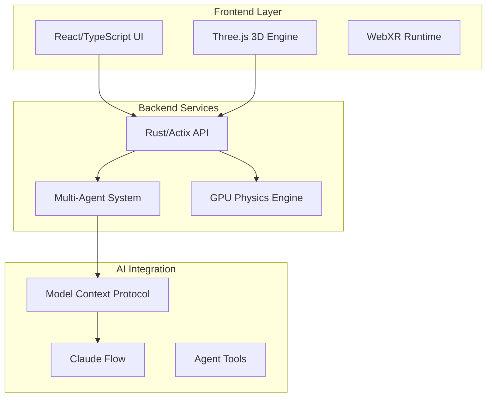

# VisionFlow

A real-time 3D visualisation platform for knowledge graphs and AI Multi-Agent systems, powered by CUDA-accelerated physics and modern web technologies.

## ✨ Key Features

- **Real-time 3D Visualization** - Interactive knowledge graphs with up to 100,000+ nodes
- **AI Multi-Agent System** - 15+ specialised agent types with autonomous coordination  
- **GPU Acceleration** - CUDA-powered physics engine with 80%+ efficiency
- **WebXR Support** - Full VR/AR compatibility including Quest 3
- **MCP Integration** - Model Context Protocol for Claude Flow orchestration
- **Voice Interaction** - Built-in speech-to-text and text-to-speech capabilities

## 🚀 Quick Start

### Option 1: Docker (Recommended)
```bash
git clone <repository-url>
cd ext
docker-compose up
```
Open http://localhost:3001

### Option 2: Development Setup
```bash
# Prerequisites: Node.js 18+, Rust 1.75+, CUDA 11.8+
git clone <repository-url>
cd ext

# Backend
cargo run --release

# Frontend (new terminal)
cd client
npm install && npm start
```

### Launch Your First Multi-Agent
1. Access the web interface at http://localhost:3001
2. Click "Create New Graph" in the command palette (Ctrl+K)
3. Select "Multi-Agent Template" 
4. Watch as AI agents populate and interact in real-time 3D space

## 📊 System Capabilities

| Feature | Specification |
|---------|---------------|
| **Nodes** | 100,000+ concurrent |
| **Edges** | 1,000,000+ relationships |
| **Performance** | 60 FPS sustained |
| **Agent Types** | 15+ specialised roles |
| **Concurrent Users** | 100+ WebSocket clients |
| **GPU Acceleration** | CUDA 11.8+ optimised |

## 🏗️ Architecture Overview



## 📚 Complete Documentation

For comprehensive guides, API references, and detailed examples, visit the main documentation hub:

**➡️ [Full Documentation Index](/docs/index.md)**

### Essential Guides
- **[Quick Start Guide](/docs/quick-start.md)** - Get running in 5 minutes
- **[Multi-Agent Setup](/docs/quick-start-multi-agent.md)** - Launch AI agents  
- **[System Architecture](/docs/architecture/system-overview.md)** - Technical deep dive
- **[API Reference](/docs/api/index.md)** - Complete endpoint documentation
- **[Deployment Guide](/docs/deployment/docker.md)** - Production deployment

## 🛠️ Development

Built with modern technologies:
- **Backend**: Rust, Actix-Web, CUDA, Tokio
- **Frontend**: React 18, TypeScript, Three.js, WebXR
- **Infrastructure**: Docker, WebSockets, MCP Protocol

## 🤝 Contributing

We welcome contributions! See [Contributing Guide](/docs/contributing.md) for:
- Development setup
- Code style guidelines  
- Pull request process
- Issue reporting

## 📝 License

MIT License - see LICENSE file for details.

---

**Get Started**: [Quick Start Guide](/docs/quick-start.md) • **Questions**: [GitHub Discussions](https://github.com/visionflow/visionflow/discussions) • **Community**: [Discord](https://discord.gg/visionflow)