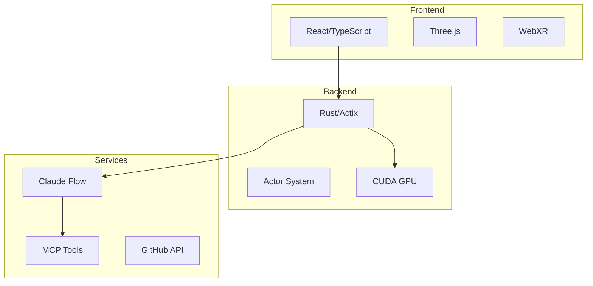

```mermaid
graph TD
    Docs[Documentation Root]
    Docs --> GS[Getting Started]
    Docs --> Arch[Architecture]
    Docs --> API[API Reference]
    Docs --> Client[Client Docs]
    Docs --> Server[Server Docs]
    Docs --> Deploy[Deployment]
    Docs --> Dev[Development]
    
    GS --> QS[Quick Start]
    GS --> QSS[Quick Start Swarm]
    
    Arch --> SO[System Overview]
    Arch --> DG[Dual Graph]
    Arch --> GPU[GPU Compute]
    Arch --> MCP[MCP Integration]
    
    API --> REST[REST API]
    API --> WS[WebSocket]
    API --> Binary[Binary Protocol]
    
    Client --> Comp[Components]
    Client --> Viz[Visualization]
    Client --> XR[XR/WebXR]
    
    Server --> Actors[Actor System]
    Server --> Services[Services]
    Server --> Physics[Physics Engine]
    
    Deploy --> Docker[Docker Guide]
    Deploy --> Config[Configuration]
    
    Dev --> Setup[Dev Setup]
    Dev --> Test[Testing]
    Dev --> Debug[Debugging]
```

# VisionFlow Documentation

Welcome to the comprehensive documentation for VisionFlow - a real-time 3D visualization platform for knowledge graphs and AI agent swarms.

## 📚 Documentation Structure



## 🚀 Getting Started

### For Users
1. **[Quick Start Guide](quick-start.md)** - Get up and running in 5 minutes
2. **[Quick Start Swarm](quick-start-swarm.md)** - Launch your first AI agent swarm
3. **[System Overview](architecture/system-overview.md)** - Understand the architecture

### For Developers
1. **[Development Setup](development/setup.md)** - Set up your development environment
2. **[Architecture Overview](architecture/system-overview.md)** - Deep dive into system design
3. **[API Documentation](api/index.md)** - Complete API reference

### For DevOps
1. **[Docker Deployment](deployment/docker.md)** - Production deployment guide
2. **[Configuration Guide](configuration/index.md)** - System configuration options
3. **[Security Guide](security/index.md)** - Authentication and security

## 📖 Documentation Index

### Core Documentation

#### Architecture (`/architecture`)
- **[System Overview](architecture/system-overview.md)** - Complete system architecture with detailed diagrams
- **[Dual Graph Architecture](architecture/dual-graph.md)** - Knowledge and agent graph system
- **[GPU Compute](architecture/gpu-compute.md)** - CUDA acceleration implementation
- **[MCP Integration](architecture/mcp-integration.md)** - Claude Flow and Model Context Protocol
- **[Claude Flow Actor](architecture/claude-flow-actor.md)** - Enhanced MCP actor implementation
- **[Agent Swarm](architecture/bots-visionflow-system.md)** - AI agent orchestration system
- **[Parallel Graphs](architecture/parallel-graphs.md)** - Multi-graph processing

#### API Reference (`/api`)
- **[API Overview](api/index.md)** - Complete API documentation index
- **[REST API](api/rest.md)** - HTTP endpoints reference
- **[WebSocket Protocols](api/websocket-protocols.md)** - Real-time communication protocols
- **[Binary Protocol](api/binary-protocol.md)** - Efficient binary data format

#### Client Documentation (`/client`)
- **[Client Overview](client/index.md)** - Frontend architecture
- **[Components](client/components.md)** - React component library
- **[Visualization](client/visualization.md)** - 3D rendering system
- **[XR Integration](client/xr.md)** - WebXR and Quest 3 support
- **[Command Palette](client/command-palette.md)** - Keyboard shortcuts
- **[Settings System](client/settings-panel-redesign.md)** - Dynamic configuration
- **[Onboarding](client/onboarding.md)** - User onboarding flows

#### Server Documentation (`/server`)
- **[Server Overview](server/index.md)** - Backend architecture
- **[Actor System](server/actors.md)** - Actix actor implementation
- **[Handlers](server/handlers.md)** - Request processing
- **[Services](server/services.md)** - Business logic layer
- **[Models](server/models.md)** - Data structures
- **[Physics Engine](server/physics-engine.md)** - Force calculations
- **[Agent Swarm](server/agent-swarm.md)** - Agent orchestration

#### Deployment (`/deployment`)
- **[Deployment Overview](deployment/index.md)** - Deployment strategies
- **[Docker Guide](deployment/docker.md)** - Container deployment
- **[Docker MCP Integration](deployment/docker-mcp-integration.md)** - MCP in Docker

#### Development (`/development`)
- **[Development Overview](development/index.md)** - Development workflow
- **[Setup Guide](development/setup.md)** - Local environment setup
- **[Testing Guide](development/testing.md)** - Test strategies
- **[Debugging Guide](development/debugging.md)** - Troubleshooting

#### Configuration (`/configuration`)
- **[Configuration Overview](configuration/index.md)** - System settings
- **[Quick Reference](configuration/quick-reference.md)** - Common configurations

#### Security (`/security`)
- **[Security Overview](security/index.md)** - Security architecture
- **[Authentication](security/authentication.md)** - Nostr authentication

### Feature Documentation

- **[Agent Visualization](agent-visualization-architecture.md)** - 3D agent swarm visualization
- **[Bots Implementation](bots-implementation.md)** - Agent system details
- **[Voice System](voice-system.md)** - Speech interaction capabilities
- **[Physics Engine](physics-engine.md)** - GPU-accelerated physics
- **[WebSocket Protocols](WEBSOCKET_PROTOCOLS.md)** - Real-time protocols

### Technical References

- **[Decoupled Graph Architecture](technical/decoupled-graph-architecture.md)** - Graph separation design
- **[MCP Tool Usage](technical/mcp_tool_usage.md)** - Available MCP tools
- **[DAA Setup Guide](architecture/daa-setup-guide.md)** - Decentralized Autonomous Agents

### Additional Documentation

- **[Settings Guide](SETTINGS_GUIDE.md)** - Detailed settings documentation
- **[Rust Development](RUST_DEVELOPMENT.md)** - Backend development guide
- **[GPU Build System](GPU_BUILD_SYSTEM.md)** - CUDA compilation
- **[Integration Roadmap](INTEGRATION_ROADMAP.md)** - Future integrations
- **[Contributing](contributing.md)** - Contribution guidelines
- **[Glossary](glossary.md)** - Technical terms

## 🏗️ System Architecture

### High-Level Overview



### Key Technologies

#### Backend Stack
- **Rust 1.75+** - Systems programming language
- **Actix-Web 4.4** - Async web framework
- **CUDA 11.8+** - GPU acceleration
- **Tokio** - Async runtime

#### Frontend Stack
- **React 18** - UI framework
- **TypeScript 5** - Type-safe JavaScript
- **Three.js** - 3D graphics
- **React Three Fiber** - React renderer for Three.js
- **@react-three/xr** - WebXR integration

#### Infrastructure
- **Docker** - Containerization
- **NGINX** - Reverse proxy
- **WebSockets** - Real-time communication
- **MCP** - Model Context Protocol

## 📊 Performance Metrics

| Metric | Capability |
|--------|-----------|
| **Node Capacity** | 100,000+ nodes |
| **Edge Capacity** | 1,000,000+ edges |
| **Update Rate** | 60 FPS sustained |
| **Network Efficiency** | 28 bytes/node |
| **GPU Utilization** | 80%+ efficiency |
| **Agent Types** | 15+ specialized |
| **WebSocket Clients** | 100+ concurrent |

## 🔧 Configuration Examples

### Basic Configuration
```yaml
server:
  port: 3001
  host: 0.0.0.0

physics:
  enabled: true
  iterations: 5
  gravity: -9.8

visualization:
  nodeSize: 10
  showLabels: true
  hologramEffect: true
```

### Docker Compose
```yaml
services:
  visionflow:
    image: visionflow:latest
    ports:
      - "3001:3001"
    volumes:
      - ./data:/data
    environment:
      - ENABLE_GPU=true
```

## 🛠️ Development Workflow

1. **Setup Environment**
   ```bash
   git clone <repo>
   cd ext
   docker-compose -f docker-compose.dev.yml up
   ```

2. **Make Changes**
   - Backend: `src/` directory (Rust)
   - Frontend: `client/src/` directory (React/TypeScript)

3. **Test**
   ```bash
   cargo test           # Backend tests
   npm test            # Frontend tests
   ```

4. **Build**
   ```bash
   cargo build --release
   npm run build
   ```

## 📈 Monitoring & Debugging

### Health Endpoints
- **System Health**: `GET /api/health`
- **MCP Health**: `GET /api/mcp/health`
- **GPU Status**: `GET /api/gpu/status`

### Logging
- **Backend**: `RUST_LOG=debug`
- **Frontend**: Browser DevTools
- **Docker**: `docker-compose logs -f`

## 🤝 Contributing

We welcome contributions! Please see our [Contributing Guide](contributing.md) for details on:
- Code style guidelines
- Pull request process
- Issue reporting
- Development workflow

## 📝 License

VisionFlow is licensed under the MIT License. See LICENSE file for details.

## 🔗 Quick Links

- **GitHub Repository**: [visionflow/visionflow](https://github.com/visionflow/visionflow)
- **Issue Tracker**: [GitHub Issues](https://github.com/visionflow/visionflow/issues)
- **Discussions**: [GitHub Discussions](https://github.com/visionflow/visionflow/discussions)
- **Discord Community**: [Join Discord](https://discord.gg/visionflow)

## 📚 Documentation Maintenance

This documentation is actively maintained and reflects the current state of the codebase. Last updated: 2024

### Documentation Standards
- All code examples are tested
- Diagrams use Mermaid for maintainability
- API documentation is auto-generated where possible
- Each major feature has dedicated documentation

### Reporting Issues
If you find any issues with the documentation:
1. Check if an [issue already exists](https://github.com/visionflow/visionflow/issues)
2. Create a new issue with the `documentation` label
3. Include the documentation file path and description of the issue

---

**Need help?** Start with the [Quick Start Guide](quick-start.md) or join our [Discord community](https://discord.gg/visionflow)!