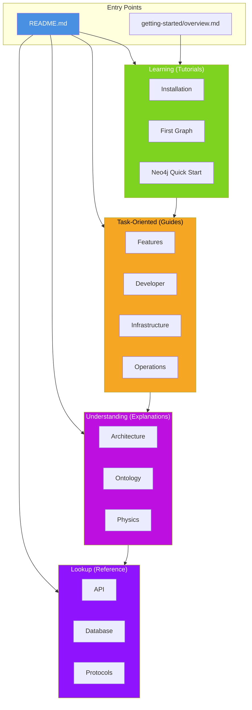

# VisionFlow Documentation

Enterprise-grade multi-agent knowledge graphing with 3D visualization, semantic reasoning, and GPU-accelerated physics. This documentation follows the [Diataxis framework](https://diataxis.fr/) for maximum discoverability.

## Quick Start

Get running in 5 minutes:

1. **[Installation](getting-started/installation.md)** - Docker or native setup
2. **[First Graph](getting-started/first-graph.md)** - Create your first visualization
3. **[Navigation Guide](guides/navigation-guide.md)** - Master the 3D interface

## Documentation by Role

<strong>New Users</strong> - Getting started with VisionFlow

### Your Learning Path

| Step | Document | Time |
|------|----------|------|
| 1 | [What is VisionFlow?](getting-started/overview.md) | 10 min |
| 2 | [Installation](getting-started/installation.md) | 15 min |
| 3 | [First Graph](getting-started/first-graph.md) | 20 min |
| 4 | [Navigation Guide](guides/navigation-guide.md) | 15 min |
| 5 | [Configuration](guides/configuration.md) | 10 min |

### Next Steps

- [Neo4j Quick Start](getting-started/neo4j-quickstart.md) - Query the graph database
- [Natural Language Queries](guides/features/natural-language-queries.md) - Ask questions in plain English
- [Troubleshooting](guides/troubleshooting.md) - Common issues and solutions

<strong>Developers</strong> - Building and extending VisionFlow

### Onboarding Path

| Priority | Document | Focus |
|----------|----------|-------|
| High | [Developer Journey](architecture/developer-journey.md) | Codebase learning path |
| High | [Development Setup](guides/developer/01-development-setup.md) | IDE and environment |
| High | [Project Structure](guides/developer/02-project-structure.md) | Code organisation |
| Medium | [Architecture Overview](architecture/overview.md) | System design |
| Medium | [Adding Features](guides/developer/04-adding-features.md) | Development workflow |
| Standard | [Testing Guide](guides/testing-guide.md) | Unit, integration, E2E |

### By Technology

- **Rust Backend** - [Server Architecture](architecture/server/overview.md), [Hexagonal CQRS](architecture/patterns/hexagonal-cqrs.md)
- **React Frontend** - [Client Architecture](architecture/client/overview.md), [State Management](guides/client/state-management.md)
- **Neo4j** - [Database Architecture](architecture/database.md), [Schemas](reference/database/schemas.md)
- **GPU/CUDA** - [GPU Overview](architecture/gpu/README.md), [Optimisations](architecture/gpu/optimizations.md)
- **WebSocket** - [Binary Protocol](reference/protocols/binary-websocket.md), [Best Practices](guides/developer/websocket-best-practices.md)

### API Reference

- [REST API](reference/api/rest-api-complete.md)
- [WebSocket API](reference/api/03-websocket.md)
- [Authentication](reference/api/01-authentication.md)

<strong>Architects</strong> - System design and patterns

### Architecture Path

| Document | Focus |
|----------|-------|
| [Architecture Overview](architecture/overview.md) | Complete system architecture |
| [Technology Choices](architecture/technology-choices.md) | Stack rationale |
| [System Overview](explanations/system-overview.md) | Architectural blueprint |
| [Hexagonal CQRS](architecture/patterns/hexagonal-cqrs.md) | Ports and adapters |
| [Data Flow](architecture/data-flow.md) | End-to-end pipeline |
| [Integration Patterns](concepts/integration-patterns.md) | System integration |

### Deep Dives

- **Actor System** - [Actor Guide](guides/architecture/actor-system.md), [Server Architecture](architecture/server/overview.md)
- **Database** - [Database Architecture](architecture/database.md), [Neo4j ADR](architecture/adr/ADR-0001-neo4j-persistent-with-filesystem-sync.md)
- **Physics** - [Semantic Physics](architecture/physics/semantic-forces.md), [GPU Communication](architecture/gpu/communication-flow.md)
- **Ontology** - [Ontology Storage](concepts/ontology-storage.md), [Reasoning Pipeline](architecture/ontology/reasoning-engine.md)
- **Multi-Agent** - [Multi-Agent System](architecture/agents/multi-agent.md), [Agent Orchestration](guides/agent-orchestration.md)

### Hexagonal Architecture Ports

- [Ports Overview](architecture/ports/01-overview.md)
- [Knowledge Graph Repository](architecture/ports/03-knowledge-graph-repository.md)
- [Ontology Repository](architecture/ports/04-ontology-repository.md)
- [Inference Engine](architecture/ports/05-inference-engine.md)
- [GPU Physics Adapter](architecture/ports/06-gpu-physics-adapter.md)

<strong>Operators</strong> - Deployment and operations

### Operations Path

| Document | Purpose |
|----------|---------|
| [Deployment Guide](guides/deployment.md) | Production deployment |
| [Docker Compose](guides/docker-compose-guide.md) | Container orchestration |
| [Operator Runbook](guides/operations/pipeline-operator-runbook.md) | Operations playbook |
| [Configuration](guides/configuration.md) | Environment variables |
| [Security](guides/security.md) | Authentication and secrets |
| [Telemetry](guides/telemetry-logging.md) | Observability |

### Infrastructure

- [Infrastructure Architecture](guides/infrastructure/architecture.md)
- [Docker Environment](guides/infrastructure/docker-environment.md)
- [Port Configuration](guides/infrastructure/port-configuration.md)
- [Infrastructure Troubleshooting](guides/infrastructure/troubleshooting.md)

### Data Operations

- [Neo4j Migration](guides/neo4j-migration.md)
- [Pipeline Admin API](guides/pipeline-admin-api.md)
- [GitHub Sync Service](concepts/github-sync-service.md)

## Documentation Structure

## Quick Links

| Task | Document |
|------|----------|
| **Install VisionFlow** | [Installation](getting-started/installation.md) |
| **Create first graph** | [First Graph](getting-started/first-graph.md) |
| **Deploy AI agents** | [Agent Orchestration](guides/agent-orchestration.md) |
| **Query Neo4j** | [Neo4j Integration](guides/neo4j-integration.md) |
| **Add a feature** | [Adding Features](guides/developer/04-adding-features.md) |
| **Set up XR/VR** | [Vircadia XR Guide](guides/vircadia-xr-complete-guide.md) |
| **Understand architecture** | [Architecture Overview](architecture/overview.md) |
| **Learn the codebase** | [Developer Journey](architecture/developer-journey.md) |
| **Deploy to production** | [Deployment Guide](guides/deployment.md) |
| **Configure environment** | [Configuration](guides/configuration.md) |
| **Fix issues** | [Troubleshooting](guides/troubleshooting.md) |
| **Write tests** | [Testing Guide](guides/testing-guide.md) |
| **Use REST API** | [REST API](reference/api/rest-api-complete.md) |
| **Use WebSocket API** | [WebSocket API](reference/api/03-websocket.md) |
| **Optimise performance** | [GPU Optimisations](architecture/gpu/optimizations.md) |
| **Secure the app** | [Security Guide](guides/security.md) |

## Documentation Categories

### Tutorials (Learning-Oriented)

Step-by-step lessons for beginners.

| Tutorial | Time | Description |
|----------|------|-------------|
| [Installation](getting-started/installation.md) | 10 min | Docker and native setup |
| [First Graph](getting-started/first-graph.md) | 15 min | Create your first visualisation |
| [Neo4j Quick Start](getting-started/neo4j-quickstart.md) | 20 min | Query the graph database |

### Concepts (Understanding-Oriented)

Core mental models and foundational knowledge.

| Concept | Description |
|---------|-------------|
| [Core Concepts](concepts/README.md) | Overview of VisionFlow mental models |
| [Physics Engine](concepts/physics-engine.md) | Force-directed graph simulation |
| [Actor Model](concepts/actor-model.md) | Concurrent actor-based patterns |
| [Hexagonal Architecture](concepts/hexagonal-architecture.md) | Ports and adapters design |

### Guides (Task-Oriented)

Practical instructions for specific goals.

Core Features (8 guides)

- [Navigation Guide](guides/navigation-guide.md) - 3D interface controls
- [Filtering Nodes](guides/features/filtering-nodes.md) - Graph filtering
- [Intelligent Pathfinding](guides/features/intelligent-pathfinding.md) - Graph traversal
- [Natural Language Queries](guides/features/natural-language-queries.md) - Semantic search
- [Semantic Forces](guides/features/semantic-forces.md) - Physics layouts
- [Configuration](guides/configuration.md) - Settings
- [Troubleshooting](guides/troubleshooting.md) - Common issues
- [Extending the System](guides/extending-the-system.md) - Plugins

AI Agent System (4 guides)

- [Agent Orchestration](guides/agent-orchestration.md) - Deploy AI agents
- [Orchestrating Agents](guides/orchestrating-agents.md) - Coordination patterns
- [Multi-Agent Skills](guides/multi-agent-skills.md) - Agent capabilities
- [AI Models](guides/ai-models/README.md) - Model integrations

Developer Guides (8 guides)

- [Development Setup](guides/developer/01-development-setup.md) - Environment
- [Project Structure](guides/developer/02-project-structure.md) - Code organisation
- [Adding Features](guides/developer/04-adding-features.md) - Workflow
- [Contributing](guides/developer/06-contributing.md) - Code standards
- [WebSocket Best Practices](guides/developer/websocket-best-practices.md) - Real-time
- [JSON Serialisation](guides/developer/json-serialization-patterns.md) - Data formats
- [Test Execution](guides/developer/test-execution.md) - Running tests

Infrastructure and Operations (15 guides)

- [Deployment](guides/deployment.md) - Production deployment
- [Docker Compose](guides/docker-compose-guide.md) - Container orchestration
- [Docker Environment](guides/docker-environment-setup.md) - Container config
- [Security](guides/security.md) - Auth and secrets
- [Telemetry](guides/telemetry-logging.md) - Observability
- [Operator Runbook](guides/operations/pipeline-operator-runbook.md) - Operations
- [Infrastructure Architecture](guides/infrastructure/architecture.md) - System design
- [Docker Environment](guides/infrastructure/docker-environment.md) - Containers
- [Port Configuration](guides/infrastructure/port-configuration.md) - Networking
- [Infrastructure Troubleshooting](guides/infrastructure/troubleshooting.md) - Issues

### Explanations (Understanding-Oriented)

Deep dives into architecture and design.

System Architecture (20+ documents)

- [System Overview](explanations/system-overview.md) - Architectural blueprint
- [Hexagonal CQRS](architecture/patterns/hexagonal-cqrs.md) - Ports and adapters
- [Data Flow](architecture/data-flow.md) - End-to-end pipeline
- [Services Architecture](architecture/services.md) - Business logic
- [Multi-Agent System](architecture/agents/multi-agent.md) - AI coordination
- [Integration Patterns](concepts/integration-patterns.md) - System integration
- [Database Architecture](architecture/database.md) - Neo4j design

GPU and Physics (8 documents)

- [Semantic Physics System](concepts/semantic-physics-system.md) - Force layout
- [GPU Semantic Forces](concepts/gpu-semantic-forces.md) - CUDA kernels
- [GPU Communication](architecture/gpu/communication-flow.md) - Data transfer
- [GPU Optimisations](architecture/gpu/optimizations.md) - Performance
- [Stress Majorisation](concepts/stress-majorization.md) - Layout algorithm

Ontology and Reasoning (11 documents)

- [Ontology Reasoning Pipeline](concepts/ontology-reasoning-pipeline.md) - Inference
- [Reasoning Engine](architecture/ontology/reasoning-engine.md) - Inference concepts
- [Ontology Storage](concepts/ontology-storage.md) - Neo4j persistence
- [Hierarchical Visualisation](architecture/ontology/hierarchical-visualization.md) - Tree layouts
- [Pathfinding System](architecture/ontology/intelligent-pathfinding-system.md) - Graph traversal

### Reference (Information-Oriented)

Technical specifications and APIs.

API Documentation (8 references)

- [API Complete](reference/api-complete-reference.md) - All endpoints
- [REST API](reference/api/rest-api-complete.md) - HTTP API spec
- [WebSocket API](reference/api/03-websocket.md) - Real-time protocol
- [Authentication](reference/api/01-authentication.md) - JWT and Nostr
- [Semantic Features API](reference/api/semantic-features-api.md) - NL queries

Database and Protocols (6 references)

- [Database Schemas](reference/database/schemas.md) - Neo4j schema
- [Ontology Schema V2](reference/database/ontology-schema-v2.md) - OWL schema
- [User Settings Schema](reference/database/user-settings-schema.md) - User data
- [Binary WebSocket](reference/protocols/binary-websocket.md) - 36-byte format
- [WebSocket Protocol](reference/websocket-protocol.md) - V2 spec

System Status (5 references)

- [Error Codes](reference/error-codes.md) - Error reference
- [Implementation Status](reference/implementation-status.md) - Feature matrix
- [Code Quality](reference/code-quality-status.md) - Build health
- [Performance Benchmarks](reference/performance-benchmarks.md) - GPU metrics
- [Physics Implementation](reference/physics-implementation.md) - Physics details

## Getting Help

| Issue Type | Resource |
|------------|----------|
| Documentation gaps | [GitHub Issues](https://github.com/DreamLab-AI/VisionFlow/issues) with `documentation` label |
| Technical problems | [Troubleshooting Guide](guides/troubleshooting.md) |
| Infrastructure issues | [Infrastructure Troubleshooting](guides/infrastructure/troubleshooting.md) |
| Developer setup | [Development Setup](guides/developer/01-development-setup.md) |
| Feature requests | [GitHub Discussions](https://github.com/DreamLab-AI/VisionFlow/discussions) |

## Documentation Stats

- **Total Documents**: 315 markdown files
- **Directories**: 82
- **Framework**: Diataxis (Tutorials, Guides, Explanations, Reference, Concepts)
- **Last Updated**: 2026-01-29

---

*Maintained by DreamLab AI Documentation Team*
