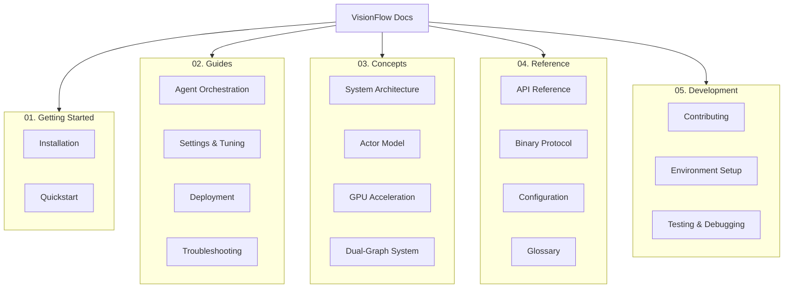

# VisionFlow Documentation

Welcome to the official documentation for VisionFlow, a high-performance, GPU-accelerated platform for real-time 3D visualisation of AI multi-agent systems and knowledge graphs.

This documentation provides a comprehensive guide for users, developers, and operators. Whether you are getting started, developing new features, or deploying to production, you will find the necessary information here.

## Documentation Structure

Our documentation is organised into several key areas to help you find information quickly.

## Quick Links

*   **New to VisionFlow?** Start with the **[Getting Started](./01-getting-started/README.md)** guide.
*   **Want to perform a specific task?** Check our **[How-to Guides](./02-guides/README.md)**.
*   **Need to understand the architecture?** Read the **[Concepts](./03-concepts/README.md)** documentation.
*   **Looking for technical details?** Dive into the **[Reference](./04-reference/README.md)** section.
*   **Want to contribute?** See the **[Development](./05-development/README.md)** guides.

## Navigation by Role

### For Users & Analysts
- **Installation**: [01-getting-started/installation.md](./01-getting-started/installation.md)
- **First Visualisation**: [01-getting-started/quickstart.md](./01-getting-started/quickstart.md)
- **Tuning and Settings**: [02-guides/settings-and-tuning.md](./02-guides/settings-and-tuning.md)

### For DevOps & System Administrators
- **Deployment with Docker**: [02-guides/deployment-with-docker.md](./02-guides/deployment-with-docker.md)
- **Configuration Reference**: [04-reference/configuration.md](./04-reference/configuration.md)
- **Troubleshooting**: [02-guides/troubleshooting.md](./02-guides/troubleshooting.md)

### For Developers & Contributors
- **System Architecture**: [03-concepts/system-architecture.md](./03-concepts/system-architecture.md)
- **API Reference**: [04-reference/api.md](./04-reference/api.md)
- **Development Workflow**: [02-guides/development-workflow.md](./02-guides/development-workflow.md)
- **Contributing Guide**: [05-development/contributing.md](./05-development/contributing.md)

## Documentation Sections

### 📚 [01. Getting Started](./01-getting-started/README.md)
Learn how to install VisionFlow and create your first visualisation. Perfect for new users who want to get up and running quickly.

- Installation guide with prerequisites
- Quick start tutorial
- First visualisation walkthrough

### 🔧 [02. Guides](./02-guides/README.md)
Practical how-to guides for accomplishing specific tasks with VisionFlow.

- Agent orchestration and multi-agent configuration
- Settings and performance tuning
- Docker deployment and scaling
- Troubleshooting common issues
- Development workflow best practices

### 🧠 [03. Concepts](./03-concepts/README.md)
Understand the core concepts and architecture behind VisionFlow.

- System architecture and design principles
- Actor model for concurrent processing
- GPU acceleration and CUDA integration
- Dual-graph system for knowledge and agents

### 📖 [04. Reference](./04-reference/README.md)
Complete technical reference documentation.

- REST and WebSocket API specifications
- Binary protocol format
- Configuration options and schemas
- Glossary of terms

### 🛠️ [05. Development](./05-development/README.md)
Everything you need to contribute to VisionFlow development.

- Contributing guidelines
- Development environment setup
- Testing strategies
- Debugging techniques

## Key Features Documentation

### 🤖 AI Agent Visualisation
- [Agent Orchestration Guide](./02-guides/agent-orchestration.md) - Configure and manage AI agent swarms
- [MCP Integration](./02-guides/agent-orchestration.md#mcp-integration) - Claude Flow Model Context Protocol setup

### 📊 Knowledge Graph Integration
- [Dual-Graph System](./03-concepts/dual-graph-system.md) - Understanding parallel visualisation
- [Graph Configuration](./04-reference/configuration.md#graph-settings) - Customising graph behaviour

### 🚀 Performance & Optimisation
- [GPU Acceleration](./03-concepts/gpu-acceleration.md) - CUDA-powered physics engine
- [Performance Tuning](./02-guides/settings-and-tuning.md#performance-optimisation) - Optimising for your hardware

### 🔌 Integration & APIs
- [API Reference](./04-reference/api.md) - Complete API documentation
- [Binary Protocol](./04-reference/binary-protocol.md) - High-performance streaming protocol

## Production Deployment

For production deployments, follow our comprehensive deployment guide:

1. [Docker Deployment](./02-guides/deployment-with-docker.md) - Container-based deployment
2. [Configuration Reference](./04-reference/configuration.md) - Production configuration
3. [Troubleshooting](./02-guides/troubleshooting.md) - Common issues and solutions

## Community & Support

- **GitHub Issues**: [Report bugs or request features](https://github.com/yourusername/visionflow/issues)
- **Discord**: [Join our community](https://discord.gg/visionflow)
- **Contributing**: [How to contribute](./05-development/contributing.md)

## Documentation Standards

This documentation follows the [Diátaxis framework](https://diataxis.fr/), organising content into:

- **Tutorials** (Getting Started) - Learning-oriented guides
- **How-to Guides** (Guides) - Task-oriented instructions
- **Explanations** (Concepts) - Understanding-oriented discussion
- **Reference** - Information-oriented technical descriptions

## Version Information

- **Documentation Version**: 2.0.0
- **VisionFlow Version**: 1.0.0
- **Last Updated**: January 2025

## License

VisionFlow is licensed under the MIT License. See the [LICENSE](../LICENSE) file for details.

---

**Need help?** Start with our [Getting Started](./01-getting-started/README.md) guide or check the [Troubleshooting](./02-guides/troubleshooting.md) section.