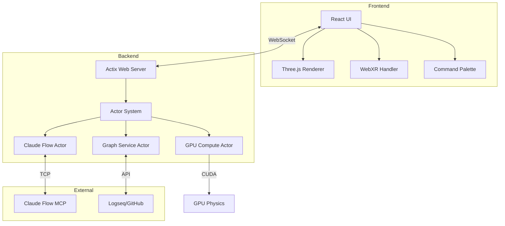

# VisionFlow Documentation

**Real-time AI Multi-Agent Visualisation & Knowledge Graph Explorer**

VisionFlow is a high-performance, GPU-accelerated platform for real-time visualisation of AI multi-agent systems alongside knowledge graphs, powered by Rust, React, and CUDA.

## Quick Navigation

### 🚀 Get Started
- [Installation & Setup](getting-started/installation.md) - Docker, development setup
- [Quick Start Guide](getting-started/quickstart.md) - First graph in 5 minutes
- [Configuration](getting-started/configuration.md) - Environment variables, settings

### 🏗️ Architecture
- [System Overview](architecture/system-overview.md) - High-level design
- [Component Architecture](architecture/components.md) - Actor system, services
- [Data Flow](architecture/data-flow.md) - Binary protocol, WebSocket streams
- [GPU Computing](architecture/gpu-compute.md) - CUDA physics engine

### 📡 API Documentation
- [REST API](api/rest/index.md) - HTTP endpoints reference
- [WebSocket API](api/websocket/index.md) - Real-time protocols
- [MCP Integration](api/mcp/index.md) - Claude Flow agent control
- [Binary Protocol](api/binary-protocol.md) - Position streaming format

### 💻 Development
- [Development Setup](development/setup.md) - Local environment
- [Testing Guide](development/testing.md) - Unit, integration tests
- [Debugging](development/debugging.md) - Tools and techniques
- [Contributing](development/contributing.md) - Code standards, workflow

### 🚀 Deployment
- [Docker Deployment](deployment/docker.md) - Production containers
- [Environment Setup](deployment/environment.md) - Server configuration
- [Monitoring](deployment/monitoring.md) - Health checks, metrics

## Key Features

- **🧠 Dual-Graph System**: Parallel processing of knowledge graphs and AI agent networks
- **⚡ GPU Acceleration**: CUDA-powered physics simulation with real-time performance
- **🤖 AI Agent Orchestration**: Claude Flow MCP integration for multi-agent systems
- **🌐 WebXR Support**: Immersive VR/AR visualisation with Quest 3 integration
- **📊 Real-time Streaming**: Binary WebSocket protocol with 85% bandwidth reduction
- **🎯 Advanced Analytics**: GPU-accelerated clustering and anomaly detection
- **🔊 Voice Interaction**: Natural language interface for graph manipulation
- **🛡️ Secure Architecture**: Nostr authentication and secure WebSocket connections

## Technology Stack

| Component | Technology |
|-----------|------------|
| **Backend** | Rust, Actix-Web, Tokio |
| **GPU Compute** | CUDA, PTX kernels |
| **Frontend** | React 18, TypeScript, Three.js |
| **XR/AR** | WebXR, React-XR, Quest 3 |
| **Protocols** | WebSocket, Binary streaming, REST |
| **AI Integration** | Claude Flow MCP, TCP sockets |
| **Infrastructure** | Docker, NGINX, Supervisord |
| **Storage** | SQLite, YAML configuration |

## System Requirements

### Minimum Requirements
- **OS**: Linux (Ubuntu 20.04+), macOS 12+, Windows 10+ with WSL2
- **CPU**: 4 cores, 2.5GHz+
- **RAM**: 8GB
- **GPU**: NVIDIA GPU with CUDA 11.0+ (for GPU features)
- **Docker**: Version 20.10+
- **Node.js**: Version 18+
- **Rust**: Version 1.70+

### Recommended Specifications
- **CPU**: 8+ cores, 3.5GHz+
- **RAM**: 16GB+
- **GPU**: NVIDIA RTX 3060+ with 6GB+ VRAM
- **Storage**: SSD with 20GB+ available

## Quick Start

```bash
# Clone the repository
git clone https://github.com/visionflow/visionflow.git
cd visionflow

# Start with Docker Compose
docker-compose up -d

# Access the application
open http://localhost:3002
```

For detailed setup instructions, see the [Installation Guide](getting-started/installation.md).

## Architecture Overview



## Documentation Structure

| Section | Description |
|---------|-------------|
| **[Getting Started](getting-started/index.md)** | Installation, configuration, quickstart guides |
| **[Architecture](architecture/index.md)** | System design, components, data flow |
| **[API Reference](api/index.md)** | REST, WebSocket, MCP, binary protocols |
| **[Client Guide](client/index.md)** | Frontend architecture, components, features |
| **[Server Guide](server/index.md)** | Backend architecture, services, actors |
| **[Deployment](deployment/index.md)** | Production setup, Docker, monitoring |
| **[Development](development/index.md)** | Setup, testing, debugging, contributing |
| **[Features](features/index.md)** | Detailed feature documentation |
| **[Reference](reference/index.md)** | Quick reference, troubleshooting, glossary |

## Community & Support

- **GitHub**: [github.com/visionflow/visionflow](https://github.com/visionflow/visionflow)
- **Discord**: [discord.gg/visionflow](https://discord.gg/visionflow)
- **Documentation**: [docs.visionflow.dev](https://docs.visionflow.dev)
- **Issues**: [GitHub Issues](https://github.com/visionflow/visionflow/issues)

## Contributing

We welcome contributions! Please see our [Contributing Guide](development/contributing.md) for details on:
- Code standards and style guides
- Development workflow
- Testing requirements
- Pull request process

## Licence

VisionFlow is licensed under the MIT Licence. See [LICENCE](../LICENCE) for details.

---

📖 **[Full Documentation Index](index.md)** | 🐛 **[Troubleshooting](reference/troubleshooting.md)** | 📊 **[API Reference](api/index.md)** | 🚀 **[Quick Start](getting-started/quickstart.md)**