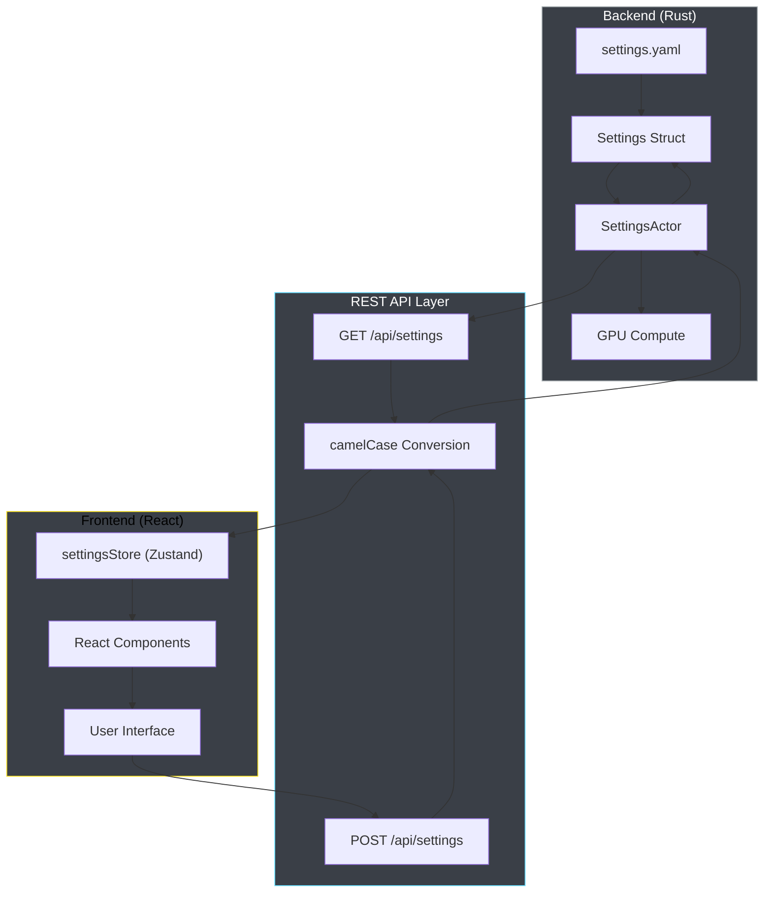

# Settings System Guide

## ⚠️ CRITICAL ISSUE: Dual Settings Store Problem

**IMPORTANT**: The current settings implementation has a **DUAL SETTINGS STORE PROBLEM** that causes the Physics tab to not work properly:

### The Problem
1. **Duplicate Stores**: There are TWO separate settings stores:
   - Primary store: `/ext/client/src/store/settingsStore.ts` (CORRECT)
   - Conflicting store: `/ext/client/src/features/settings/store/settingsStore.ts` (PROBLEMATIC)

2. **Import Path Confusion**: The Physics tab imports from the WRONG path:
   ```typescript
   // WRONG - causes physics controls to not work
   import { useSettingsStore } from '../store/settingsStore';
   
   // CORRECT - should import from here
   import { useSettingsStore } from '../../../../store/settingsStore';
   ```

3. **State Inconsistency**: Changes made in Physics tab don't propagate to the backend because they're updating the wrong store.

### The Solution
1. **Fix Import Paths**: All components should import from `/ext/client/src/store/settingsStore.ts`
2. **Remove Duplicate Store**: Delete the conflicting store in the features directory
3. **Unified Settings Flow**: Ensure all UI components use the same store instance

## Overview

The VisionFlow application SHOULD use a clean, single-source-of-truth settings system that provides:
- **Backend Settings (Rust)**: Server-side configuration loaded from settings.yaml
- **REST API**: Clean camelCase JSON interface for settings operations
- **Frontend Settings (React)**: TypeScript settings store with real-time updates
- **User Persistence**: User-specific settings via Nostr authentication
- **GPU Integration**: Physics settings automatically propagated to GPU compute

**NOTE**: Due to the dual store issue above, the current implementation is BROKEN.

## Architecture

The settings system SHOULD follow this clean data flow:

```
Backend (Rust) → REST API → Frontend (React) → User Interface
      ↓
   GPU Compute
```

**Current BROKEN Flow (due to dual store issue):**
```
Backend (Rust) → REST API → Primary Store → Some UI Components
                          ↘ Conflicting Store → Physics Tab (BROKEN)
```

### Key Components
- **SettingsActor**: Manages settings state in the Rust backend
- **Settings REST API**: Provides GET/POST endpoints with camelCase JSON
- **settingsStore** (PRIMARY): `/ext/client/src/store/settingsStore.ts` - The CORRECT store
- **settingsStore** (CONFLICTING): `/ext/client/src/features/settings/store/settingsStore.ts` - CAUSES ISSUES
- **SettingsService**: Handles API communication and validation

## Recent Improvements (2025)

### 1. Force-Directed Graph Layout
The force simulation parameters have been significantly improved to prevent node clustering:

**Key Physics Changes:**
- **Repulsion Strength**: Increased from 0.5 to 15.0 (30x stronger)
- **Repulsion Distance**: Increased from 2.0 to 50.0 (25x larger)
- **Spring Strength**: Decreased from 0.3 to 0.02 (15x weaker)
- **Collision Radius**: Increased from 0.5 to 5.0 (10x larger)
- **Bounds Size**: Increased from 15.0 to 150.0 (10x larger)
- **Viewport Bounds**: Increased from 1000 to 5000 (5x larger)

These changes ensure nodes spread out properly instead of clustering in a tiny area.

### 2. Enhanced Visual Quality

**Color Balance:**
- Node colors updated to cyan (#00e5ff) for better visibility
- Edge colors updated to light blue (#4fc3f7) for contrast
- Label colors set to pure white (#ffffff) on dark background
- Background color deepened to #0a0e1a for better contrast

**Material Properties:**
- Metalness increased to 0.85 for more realistic reflections
- Roughness decreased to 0.15 for glossier appearance
- Opacity increased to 0.95 for better visibility
- Node size increased to 1.2 for better clickability

**Bloom Effects:**
- Bloom strength increased to 1.8 (was 0.5)
- Edge bloom strength increased to 2.5
- Environment bloom strength increased to 3.0
- Node bloom strength set to 2.0
- Bloom radius expanded to 0.85
- Bloom threshold lowered to 0.15 for more glow

### 3. Enhanced Hologram System

The hologram system has been completely refactored with cutting-edge effects:

**New Features:**
- Quantum field background with plasma shader effects
- Energy rings with animated particle trails
- Geodesic dome visualization with pulsing emissive materials
- Buckminster Fuller sphere wireframe
- Data flow spiral visualization
- All effects properly integrated with bloom layers

**Hologram Settings:**
- Ring count increased to 5
- Ring color set to cyan (#00ffff)
- Ring opacity increased to 0.8
- Sphere sizes expanded to [40, 80]
- Ring rotation speed increased to 12.0
- All geometric shapes (Buckminster, Geodesic, Triangle) enabled
- Global rotation speed optimized at 0.5

### 4. Lighting Improvements

**Ambient & Directional Lighting:**
- Ambient light intensity increased to 1.2
- Directional light intensity increased to 1.5
- Better shadow and highlight balance

## Configuration Files

### 1. Server Configuration (settings.yaml)
Location: `/workspace/ext/data/settings.yaml`

This is the master configuration file that defines all default settings for the application. It uses snake_case naming convention and is loaded by the Rust backend.

### 2. Client Defaults (defaultSettings.ts)
Location: `/workspace/ext/client/src/features/settings/config/defaultSettings.ts`

TypeScript configuration that provides client-side defaults with proper type safety. Uses camelCase for JavaScript/TypeScript compatibility and serves as a fallback during initialization.

**CRITICAL**: This file defines physics parameters that should map to the UI controls:

```typescript
// Physics parameters and their UI mapping
physics: {
  enabled: true,                    // Enable/Disable Physics toggle
  repulsionStrength: 15.0,         // Repulsion Strength slider
  repulsionDistance: 50.0,         // Repulsion Distance slider  
  springStrength: 0.02,            // Spring Strength slider
  collisionRadius: 5.0,            // Collision Radius slider
  bounds: 150.0,                   // Bounds Size slider
  viewportBounds: 5000,            // Viewport Bounds slider
  dampingFactor: 0.95,             // Damping Factor slider
  maxVelocity: 10.0,               // Max Velocity slider
  minDistance: 1.0,                // Min Distance slider
  iterations: 200,                 // Iterations slider
  deltaTime: 0.016                 // Delta Time slider
}
```

### 3. Simulation Parameters (simulation_params.rs)
Location: `/workspace/ext/src/models/simulation_params.rs`

Rust structures that define GPU-accelerated physics simulation parameters with three phases:
- Initial: Heavy computation for initial layout
- Dynamic: Lighter computation for updates
- Finalize: Final positioning and cleanup

## Settings API

### REST Endpoints

The settings system provides clean REST endpoints with consistent camelCase JSON formatting.

#### Get Settings
```
GET /api/settings
```
Returns the current settings configuration in camelCase format.

**Response Example:**
```json
{
  "visualisation": {
    "nodes": {
      "baseColor": "#00e5ff",
      "metalness": 0.85,
      "size": 1.2
    },
    "physics": {
      "enabled": true,
      "repulsionStrength": 15.0,
      "springStrength": 0.02
    }
  },
  "system": {
    "debug": false,
    "performanceMonitoring": true
  }
}
```

#### Update Settings
```
POST /api/settings
Content-Type: application/json
```
**Request Body:** Partial settings object to update
```json
{
  "visualisation": {
    "nodes": {
      "baseColor": "#ff0080"
    }
  }
}
```

#### Get User Settings (Authenticated)
```
GET /api/settings/user
Headers:
  X-Nostr-Pubkey: <public_key>
```

#### Update User Settings (Authenticated)
```
POST /api/settings/user
Headers:
  X-Nostr-Pubkey: <public_key>
Content-Type: application/json
```

### WebSocket Updates

Settings changes are broadcast in real-time via WebSocket to all connected clients:

```javascript
ws.on('settings_update', (data) => {
  // Handle settings update
  console.log('Settings updated:', data);
});
```

## Control Panel Integration

The IntegratedControlPanel component provides real-time settings adjustment with:

### Sections:
1. **Appearance**: Node/edge colors, sizes, materials, labels
2. **Physics**: Force simulation parameters (**CURRENTLY BROKEN** due to dual store issue)
3. **Visual FX**: Bloom, hologram, animations
4. **Auth**: Nostr authentication
5. **Data**: WebSocket, caching, compression
6. **Info**: Debug settings, performance monitoring

### Physics Tab Issue
The Physics tab currently doesn't work because:
1. It imports from the WRONG settings store path
2. Changes made in Physics controls don't reach the backend
3. The store state gets out of sync with the primary store

### SpacePilot Integration:
- Buttons 1-6: Quick section switching
- Arrow buttons: Navigate settings
- F button: Commit changes
- 6DOF control: Adjust slider values with physical controller

## Frontend Settings Store

**CORRECT IMPORT PATH**: Always import from `/ext/client/src/store/settingsStore.ts`:

```typescript
// CORRECT - Use this import
import { useSettingsStore } from '../../../store/settingsStore';

// WRONG - Do NOT use this import (causes Physics tab issues)
// import { useSettingsStore } from '../store/settingsStore';

// Get current settings
const settings = useSettingsStore(state => state.settings);

// Update settings with validation
const { updateSettings } = useSettingsStore();
updateSettings({
  visualisation: {
    physics: {
      repulsionStrength: 20.0  // This should work when using correct store
    }
  }
});

// Subscribe to physics changes
useSettingsStore.subscribe(
  state => state.settings.visualisation.physics,
  (physics) => console.log('Physics updated:', physics)
);
```

### Settings.yaml Structure

The backend settings.yaml should match the physics parameters:

```yaml
visualisation:
  physics:
    enabled: true
    repulsion_strength: 15.0      # Maps to repulsionStrength
    repulsion_distance: 50.0      # Maps to repulsionDistance
    spring_strength: 0.02         # Maps to springStrength
    collision_radius: 5.0         # Maps to collisionRadius
    bounds: 150.0                 # Maps to bounds
    viewport_bounds: 5000         # Maps to viewportBounds
    damping_factor: 0.95          # Maps to dampingFactor
    max_velocity: 10.0            # Maps to maxVelocity
    min_distance: 1.0             # Maps to minDistance
    iterations: 200               # Maps to iterations
    delta_time: 0.016             # Maps to deltaTime
```

### Settings Validation

Settings are validated on both client and server:
- **Client**: TypeScript types ensure compile-time safety
- **Server**: Rust structs validate incoming settings data
- **Runtime**: Settings are validated before GPU propagation

## Architecture Overview

### Single Source of Truth Pattern

The new settings system implements a clean single-source-of-truth architecture:



### Data Flow

1. **Initialization**: Settings loaded from `settings.yaml` into Rust `Settings` struct
2. **Actor Management**: `SettingsActor` manages settings state with message passing
3. **API Conversion**: REST endpoints convert between snake_case (Rust) and camelCase (JSON)
4. **Frontend Updates**: Settings changes propagate through Zustand store to React components
5. **GPU Propagation**: Physics settings automatically sync to GPU compute kernels
6. **Validation Boundaries**: Each layer validates data according to its constraints

### Key Benefits

- **Type Safety**: Full TypeScript and Rust type checking
- **Performance**: Efficient message passing with actors
- **Consistency**: Single settings struct eliminates duplication
- **Validation**: Multiple validation layers prevent invalid states
- **GPU Integration**: Seamless physics settings propagation
- **User Experience**: Real-time UI updates with optimistic updates

## Best Practices

1. **Always use the PRIMARY settings store**: Import from `/ext/client/src/store/settingsStore.ts` ONLY
2. **Never create duplicate stores**: One source of truth for settings state
3. **Update both server and client defaults** when changing default values
4. **Use proper case conversion** (snake_case for server, camelCase for client)
5. **Test physics changes** with different graph sizes (10, 100, 1000+ nodes)
6. **Enable bloom and hologram effects** for best visual quality
7. **Monitor performance** with debug settings when adjusting render settings
8. **Use Nostr authentication** for persistent user-specific settings
9. **Check Network tab** when debugging settings issues to verify API calls
10. **Test all control panel tabs** after making store changes

## Settings Configuration Examples

### Correct Physics Settings for Different Use Cases

**Small Graphs (10-50 nodes)**:
```typescript
physics: {
  repulsionStrength: 10.0,
  repulsionDistance: 30.0,
  springStrength: 0.05,
  bounds: 100.0
}
```

**Medium Graphs (50-200 nodes)**:
```typescript
physics: {
  repulsionStrength: 15.0,  // Default
  repulsionDistance: 50.0,  // Default
  springStrength: 0.02,     // Default
  bounds: 150.0             // Default
}
```

**Large Graphs (200+ nodes)**:
```typescript
physics: {
  repulsionStrength: 25.0,
  repulsionDistance: 75.0,
  springStrength: 0.01,
  bounds: 300.0,
  viewportBounds: 10000
}
```

## Troubleshooting

### 🚨 Physics Tab Not Working (CRITICAL)
**Root Cause**: Dual settings store problem

**Symptoms**:
- Physics controls don't respond to changes
- Sliders move but nothing happens in the visualization
- Settings changes don't reach the backend
- Console shows no API calls when adjusting physics settings

**Solution**:
1. Fix import path in Physics tab component:
   ```typescript
   // Change from:
   import { useSettingsStore } from '../store/settingsStore';
   // To:
   import { useSettingsStore } from '../../../../store/settingsStore';
   ```
2. Remove the conflicting store file at `/ext/client/src/features/settings/store/settingsStore.ts`
3. Verify all components use the primary store

### Nodes Still Clustering
- **First**: Fix the Physics tab using steps above
- Check that physics is enabled: `visualisation.physics.enabled = true`
- Verify repulsion settings are applied: Check network tab for settings payload
- Clear browser cache to ensure new defaults are loaded
- Check simulation mode is set to "Remote" for GPU acceleration
- Try increasing repulsion strength to 20.0+ and repulsion distance to 60.0+

### Visual Effects Not Showing
- Ensure bloom is enabled: `visualisation.bloom.enabled = true`
- Check hologram setting: `visualisation.nodes.enableHologram = true`
- Verify WebGL2 support in browser
- Check console for shader compilation errors

### Settings Not Persisting
- **First**: Ensure using correct settings store (see Physics tab fix above)
- Verify Nostr authentication is connected
- Check network requests for 200 status on /api/settings endpoints
- Ensure feature access permissions for user
- Check server logs for settings actor errors
- Monitor browser dev tools Network tab for API calls when changing settings

### Import Path Debugging
- Search codebase for `from '../store/settingsStore'` or similar relative paths
- Replace with absolute imports from `/ext/client/src/store/settingsStore.ts`
- Grep for duplicate useSettingsStore imports:
  ```bash
  grep -r "useSettingsStore" /workspace/ext/client/src/
  ```

## Performance Optimization

For best performance with large graphs:

1. **Use GPU acceleration**: Ensure simulation mode is "Remote"
2. **Enable instancing**: `nodes.enableInstancing = true`
3. **Adjust quality settings**: Set to "medium" for balanced performance
4. **Limit bloom samples**: Reduce bloom radius if FPS drops
5. **Optimize physics iterations**: Start with 200, reduce if needed
6. **Use appropriate bounds**: Larger bounds = more GPU memory

## Migration Guide

When updating from older versions:

1. **Backup current settings**: Export via API or copy settings.yaml
2. **Update server config**: Replace settings.yaml with new defaults
3. **Clear caches**: Use /api/admin/settings/clear-all-cache endpoint
4. **Rebuild client**: Run build process to compile new defaults
5. **Test thoroughly**: Verify all sections of control panel work
6. **Update user settings**: Have users re-login with Nostr to sync

## Future Enhancements

Planned improvements for the settings system:

- [ ] Settings profiles/presets system
- [ ] A/B testing framework for settings
- [ ] Machine learning optimization of physics parameters
- [ ] WebGPU compute shader integration
- [ ] Settings version migration system
- [ ] Real-time collaborative settings editing
- [ ] Settings change history and rollback
- [ ] Performance impact preview for settings changes